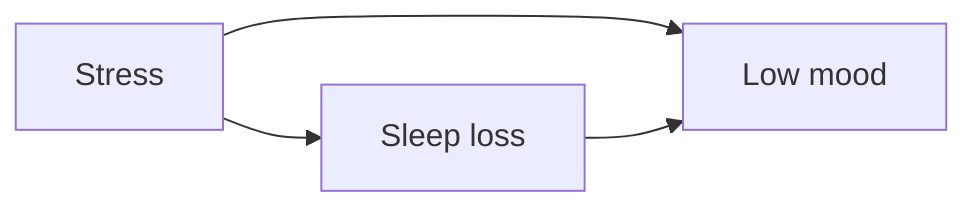

# suy luận nhân quả (causal inference) và cách đọc bằng chứng tâm lý học

> **Mạch đọc:** [README](../README.md) là bản đồ owner của **suy luận nhân quả (causal inference) và cách đọc bằng chứng tâm lý học**; nhìn vào vị trí đó trước để biết file này đang phục vụ nhánh kiến thức nào. **1. nhân quả (causal / 인과적) question khác prediction question như thế nào?** đặt câu hỏi trung tâm và tiêu chí dùng để đọc các phần sau; sau đó sang **2. Potential outcomes: tác động (effect / 효과) là một contrast, không phải thuộc tính (property / 속성) cố định** để soi ranh giới và điểm dễ nhầm. Mạch này nối causal inference với psychological evidence, để phân biệt association, mechanism và intervention effect.

Trong tâm lý học, câu hỏi khó nhất thường không phải “hai biến có liên quan không?” mà là **“nếu ta thay đổi X, điều gì sẽ xảy ra với Y?”**. Đó là câu hỏi về **suy luận nhân quả (suy luận nhân quả / 인과추론)**. Một correlation có thể hữu ích để dự đoán, nhưng nếu mục tiêu là can thiệp — thay đổi cách học, giảm stress, thiết kế workplace, điều trị triệu chứng hay đánh giá tác động của mạng xã hội (social media) — thì association đơn thuần chưa đủ.

Ví dụ, người ngủ ít thường báo cáo mood xấu hơn. Nhưng từ association đó ta chưa biết toàn bộ tác động (effect / 효과) của sleep mất mát (loss / 손실) lên mood, vì stress có thể vừa làm giảm sleep vừa làm xấu mood; trầm cảm (depression) có thể làm thay đổi sleep; medication hoặc shift công việc (work / 작업) có thể ảnh hưởng cả hai. lập luận nhân quả (causal reasoning / 인과적 추론) bắt buộc ta chuyển từ câu “X đi cùng Y” sang một mô hình (model / 모델) rõ hơn về **thời gian, cơ chế và những nguyên nhân chung**.

Xem thêm: [[02_research_methods]], [[03_measurement_statistics]], [[06_open_science_and_evidence_evaluation]], [[../02_learning_and_cognition/08_decision_under_risk_uncertainty_and_ambiguity]].

---

## 1. nhân quả (causal / 인과적) question khác prediction question như thế nào?

Một mô hình (model / 모델) dự đoán tốt không nhất thiết là một mô hình (model / 모델) nhân quả tốt. Nếu ta muốn dự đoán ai có khả năng bỏ học, attendance, prior grades và commuting distance có thể đủ hữu ích. Nhưng nếu muốn biết **“tăng attendance bằng chính sách (policy / 정책) có làm grades tăng không?”**, ta cần biết attendance là cause, biến trung gian (mediator), proxy hay chỉ marker cho một cấu trúc khác như motivation, illness hoặc socioeconomic ràng buộc (constraint / 제약조건).

Prediction hỏi:

> Khi thấy X, Y thường là gì?

suy luận nhân quả hỏi:

> Nếu cùng một hệ thống có thể tồn tại ở hai trạng thái khác nhau — có intervention X và không có intervention X — kết quả (outcome / 결과) sẽ khác bao nhiêu?

Đây là ý tưởng **counterfactual (phản thực / 반사실)**. Với cùng một người, ta không thể đồng thời quan sát “đã nhận intervention” và “không nhận intervention” tại cùng thời điểm. Vì vậy mọi nhân quả (causal / 인과적) estimate đều dựa trên thiết kế (design / 설계) và giả định (assumption / 가정) để tái tạo comparison hợp lý.

---

> **Chuyển mạch:** Trong **suy luận nhân quả (causal inference) và cách đọc bằng chứng tâm lý học**, **1. nhân quả (causal / 인과적) question khác prediction question như thế nào?** đã nêu tiêu chí phân biệt, còn **2. Potential outcomes: tác động (effect / 효과) là một contrast, không phải thuộc tính (property / 속성) cố định** dùng tiêu chí đó để soi ranh giới và điểm dễ nhầm. Từ đây, **3. Randomization giải quyết điều gì?** sẽ cho biết hệ quả hoặc giới hạn ấy hiện ra ở đâu.

## 2. Potential outcomes: tác động (effect / 효과) là một contrast, không phải thuộc tính (property / 속성) cố định

Giả sử `Y(1)` là kết quả (outcome / 결과) nếu một người nhận intervention, còn `Y(0)` là kết quả (outcome / 결과) nếu người đó không nhận. Individual nhân quả (causal / 인과적) tác động (effect / 효과) về lý thuyết là:

\[
Y(1)-Y(0)
\]

Nhưng ta chỉ quan sát một trong hai. Vì vậy research thường ước lượng **average treatment tác động (effect / 효과) (ATE)** trên population:

\[
ATE = E[Y(1)-Y(0)]
\]

Điểm quan trọng là tác động (effect / 효과) luôn phụ thuộc population, intervention definition, timing và ngữ cảnh (context / 맥락). “CBT có kích thước hiệu ứng (effect size) X”, “sleep có tác động (effect / 효과) Y” hay “phong cách nuôi dạy con (parenting style) có tác động (effect / 효과) Z” không phải hằng số phổ quát. Treatment phiên bản (version / 버전), baseline severity, đo lường (measurement / 측정) và follow-up có thể đổi estimate.

---

> **Chuyển mạch:** Ở chặng này của **suy luận nhân quả (causal inference) và cách đọc bằng chứng tâm lý học**, **2. Potential outcomes: tác động (effect / 효과) là một contrast, không phải thuộc tính (property / 속성) cố định** đã nêu tiêu chí phân biệt, còn **3. Randomization giải quyết điều gì?** dùng tiêu chí đó để soi ranh giới và điểm dễ nhầm. Từ đây, **4. DAG: biến một câu chuyện nhân quả thành sơ đồ có thể kiểm tra** sẽ cho biết hệ quả hoặc giới hạn ấy hiện ra ở đâu.

## 3. Randomization giải quyết điều gì?

Trong một **thử nghiệm đối chứng ngẫu nhiên (randomized controlled trial) (RCT / 무작위 대조시험)**, assignment ngẫu nhiên làm cho treatment group và điều khiển (control / 제어) group, về kỳ vọng, cân bằng ở cả measured và unmeasured pre-treatment causes. Nhờ đó difference sau intervention có thể được gán cho treatment với ít giả định (assumption / 가정) hơn observational thiết kế (design / 설계).

Randomization không tự giải quyết mọi vấn đề. Attrition, nonadherence, treatment contamination, đo lường (measurement / 측정) độ lệch (bias / 편향) và selective reporting vẫn có thể làm estimate lệch. Một RCT nhỏ trên population đặc thù cũng có thể có **nội bộ (internal / 내부) độ giá trị (validity)** tốt nhưng **bên ngoài (external / 외부) độ giá trị** hạn chế.

Vì vậy “RCT > mọi loại bằng chứng (evidence / 증거)” là mô hình tư duy (mental model / 사고 모델) quá thô. Cần hỏi RCT đang trả lời nhân quả (causal / 인과적) contrast nào, population nào và kết quả (outcome / 결과) nào.

---

> **Chuyển mạch:** Đặt trong câu hỏi lớn của **suy luận nhân quả (causal inference) và cách đọc bằng chứng tâm lý học**, **4. DAG: biến một câu chuyện nhân quả thành sơ đồ có thể kiểm tra** tiếp nhận điểm tựa từ **3. Randomization giải quyết điều gì?** nhưng đổi góc nhìn sang câu hỏi của chính nó; đọc liền hai mục để thấy mối quan hệ đó. Từ đây, **5. yếu tố gây nhiễu, biến trung gian và biến va chạm (collider) không thể phân biệt chỉ bằng correlation** sẽ cho biết hệ quả hoặc giới hạn ấy hiện ra ở đâu.

## 4. DAG: biến một câu chuyện nhân quả thành sơ đồ có thể kiểm tra

**Directed Acyclic đồ thị (graph / 그래프)** là cách biểu diễn nhân quả (causal / 인과적) các giả định (assumptions / 가정들) bằng nút (node / 노드) và arrow. Arrow `A → B` có nghĩa mô hình (model / 모델) giả định A có nhân quả (causal / 인과적) tác động (effect / 효과) lên B.

Ví dụ:


```mermaid
flowchart LR
    S[Stress] --> SL[Sleep loss]
    S --> M[Low mood]
    SL --> M
```

Nếu muốn estimate tác động (effect / 효과) của sleep mất mát (loss / 손실) lên mood, stress là **yếu tố gây nhiễu (confounder) (yếu tố nhiễu / 교란변수)** vì nó là dùng chung (common / 공통) cause của cả phơi nhiễm (exposure) và kết quả (outcome / 결과). Không xử lý stress có thể khiến association giữa sleep và mood trộn tác động (effect / 효과) của sleep với tác động (effect / 효과) của stress.

DAG không “khám phá sự thật” chỉ bằng việc vẽ. Nó là một **bản khai các giả định (assumptions / 가정들)**. Hai researchers có thể vẽ hai DAG khác nhau; disagreement trở nên hữu ích vì giả định (assumption / 가정) được lộ ra thay vì ẩn trong regression mô hình (model / 모델).

---

> **Chuyển mạch:** Trong **suy luận nhân quả (causal inference) và cách đọc bằng chứng tâm lý học**, **5. yếu tố gây nhiễu, biến trung gian và biến va chạm (collider) không thể phân biệt chỉ bằng correlation** tiếp nhận điểm tựa từ **4. DAG: biến một câu chuyện nhân quả thành sơ đồ có thể kiểm tra** nhưng đổi góc nhìn sang câu hỏi của chính nó; đọc liền hai mục để thấy mối quan hệ đó. Từ đây, **6. biến va chạm độ lệch (bias / 편향) trong đời sống: ví dụ tuyển chọn** sẽ cho biết hệ quả hoặc giới hạn ấy hiện ra ở đâu.

## 5. yếu tố gây nhiễu, biến trung gian và biến va chạm (collider) không thể phân biệt chỉ bằng correlation

Ba loại variable này thường bị trộn lẫn vì đều có thể liên quan thống kê với X và Y.

### yếu tố gây nhiễu

Confounder ảnh hưởng cả biến giải thích và kết quả, khiến association bị lệch khỏi tác động cần biết. Hãy vẽ đường nhân quả trước khi chọn biến kiểm soát.

```text
C → X
C → Y
```

`C` là dùng chung (common / 공통) cause. Ta thường cần khối (block / 블록) backdoor đường dẫn (path / 경로) do C tạo ra để estimate nhân quả (causal / 인과적) tác động (effect / 효과) của X lên Y.

### biến trung gian

Mediator nằm trên đường truyền từ nguyên nhân tới kết quả. Kiểm soát nó có thể giải thích cơ chế nhưng cũng có thể che mất một phần total effect.

```text
X → M → Y
```

`M` là một phần của cơ chế (mechanism / 메커니즘). Nếu mục tiêu là **total tác động (effect / 효과)** của X lên Y, điều khiển (control / 제어) M có thể loại bỏ chính phần tác động (effect / 효과) ta muốn đo. Nếu mục tiêu là direct tác động (effect / 효과), câu hỏi lại khác và cần các giả định (assumptions / 가정들) bổ sung.

### biến va chạm

Collider là biến chịu ảnh hưởng từ hai biến khác; conditioning vào nó có thể tạo association giả. Đây là lý do không nên chọn covariate chỉ vì nó tương quan với outcome.

```text
X → C ← Y
```

biến va chạm là dùng chung (common / 공통) consequence. Khi không điều kiện (condition / 조건) lên C, đường dẫn (path / 경로) này bị khối (block / 블록). Nhưng nếu ta select mẫu (sample / 표본) theo C hoặc đưa C vào mô hình (model / 모델), ta có thể tạo association giả giữa X và Y.

Đây là lý do quy tắc (rule / 규칙) “hãy điều khiển (control / 제어) càng nhiều variables càng tốt” là sai. Adjustment phải dựa trên nhân quả (causal / 인과적) cấu trúc (structure / 구조), không dựa trên số lượng biến có sẵn.

---

> **Chuyển mạch:** Ở chặng này của **suy luận nhân quả (causal inference) và cách đọc bằng chứng tâm lý học**, **5. yếu tố gây nhiễu, biến trung gian và biến va chạm (collider) không thể phân biệt chỉ bằng correlation** cho ta quy tắc; **6. biến va chạm độ lệch (bias / 편향) trong đời sống: ví dụ tuyển chọn** đặt quy tắc ấy vào tình huống cụ thể để thấy nó hoạt động đến đâu. Từ đây, **7. nhân quả ngược (reverse causation): thời gian không chỉ là chi tiết kỹ thuật** sẽ cho biết hệ quả hoặc giới hạn ấy hiện ra ở đâu.

## 6. biến va chạm độ lệch (bias / 편향) trong đời sống: ví dụ tuyển chọn

Giả sử hiệu năng (performance / 성능) trong một chương trình tuyển dụng phụ thuộc cả cognitive skill lẫn networking skill. Nếu chỉ quan sát những người đã được tuyển, ta đã điều kiện (condition / 조건) lên một biến va chạm: selection. Trong selected mẫu (sample / 표본), người có cognitive skill thấp có thể chỉ vào được vì networking skill rất cao và ngược lại. Điều này có thể tạo correlation âm giữa hai skill dù trong population hai skill không đối nghịch.

Tương tự, clinical samples, elite schools, online communities và “chỉ những người còn dùng app sau 6 tháng” đều là selection mechanisms có thể tạo association không tồn tại trong population gốc.

---

> **Chuyển mạch:** Đặt trong câu hỏi lớn của **suy luận nhân quả (causal inference) và cách đọc bằng chứng tâm lý học**, **6. biến va chạm độ lệch (bias / 편향) trong đời sống: ví dụ tuyển chọn** cho ta quy tắc; **7. nhân quả ngược (reverse causation): thời gian không chỉ là chi tiết kỹ thuật** đặt quy tắc ấy vào tình huống cụ thể để thấy nó hoạt động đến đâu. Từ đây, **8. Mediation: “cơ chế” là một nhân quả (causal / 인과적) claim mạnh** sẽ cho biết hệ quả hoặc giới hạn ấy hiện ra ở đâu.

## 7. nhân quả ngược (reverse causation): thời gian không chỉ là chi tiết kỹ thuật

Nếu mạng xã hội use liên quan trầm cảm, có ít nhất ba possibility:

```text
Social media use → depressive symptoms
Depressive symptoms → social media use
Third causes → both
```

Cross-sectional survey đo cả hai cùng lúc thường không tách được ba đường này. Longitudinal dữ liệu (data / 데이터) tốt hơn cho temporal thứ tự (ordering / 순서) nhưng vẫn không tự động giải quyết confounding. Repeated measures cũng có thể bị time-varying confounders và phản hồi (feedback / 피드백) loops.

Trong tâm lý học (psychology), rất nhiều constructs tương tác theo vòng lặp: stress làm mất ngủ, mất ngủ làm điều chỉnh cảm xúc (emotion regulation) kém, regulation kém làm xung đột (conflict / 충돌) tăng, xung đột (conflict / 충돌) lại tăng stress. DAG có thể biểu diễn vòng lặp bằng cách tách variable theo thời điểm `t1`, `t2`, `t3` thay vì dùng một nút (node / 노드) duy nhất.

---

> **Chuyển mạch:** Trong **suy luận nhân quả (causal inference) và cách đọc bằng chứng tâm lý học**, **7. nhân quả ngược (reverse causation): thời gian không chỉ là chi tiết kỹ thuật** xác định đầu vào; **8. Mediation: “cơ chế” là một nhân quả (causal / 인과적) claim mạnh** giải thích bước vận hành tạo ra kết quả kế tiếp. Từ đây, **9. Moderation không giống mediation** sẽ cho biết hệ quả hoặc giới hạn ấy hiện ra ở đâu.

## 8. Mediation: “cơ chế” là một nhân quả (causal / 인과적) claim mạnh

Research thường viết rằng niềm tin vào năng lực bản thân (self-efficacy) “mediates” tác động (effect / 효과) của intervention lên hiệu năng (performance / 성능). Nhưng một regression mediation `X → M → Y` không tự chứng minh cơ chế (mechanism / 메커니즘). Nếu có unmeasured causes của M và Y, mediation estimate có thể độ lệch (bias / 편향).

Một nhân quả (causal / 인과적) mediation phân tích (analysis / 분석) cần các giả định (assumptions / 가정들) rõ về confounding giữa treatment–biến trung gian, biến trung gian–kết quả (outcome / 결과) và treatment–kết quả (outcome / 결과). Khi treatment randomized nhưng biến trung gian không randomized, phần biến trung gian vẫn có thể chịu confounding.

Vì vậy cách diễn đạt thận trọng hơn là phân biệt:

- **statistical mediation:** mẫu (pattern / 패턴) dữ liệu phù hợp với indirect pathway;
- **nhân quả (causal / 인과적) mediation:** bằng chứng (evidence / 증거) và các giả định (assumptions / 가정들) đủ mạnh để diễn giải pathway như cơ chế (mechanism / 메커니즘).

---

> **Chuyển mạch:** Ở chặng này của **suy luận nhân quả (causal inference) và cách đọc bằng chứng tâm lý học**, **8. Mediation: “cơ chế” là một nhân quả (causal / 인과적) claim mạnh** xác định đầu vào; **9. Moderation không giống mediation** giải thích bước vận hành tạo ra kết quả kế tiếp. Từ đây, **10. Natural experiments và quasi-experiments** sẽ cho biết hệ quả hoặc giới hạn ấy hiện ra ở đâu.

## 9. Moderation không giống mediation

**Moderator (biến điều tiết / 조절변수)** trả lời “tác động (effect / 효과) khác nhau ở ai hoặc trong ngữ cảnh (context / 맥락) nào?”. Ví dụ intervention có thể hiệu quả hơn khi baseline severity cao. **biến trung gian (매개변수)** hỏi “tác động (effect / 효과) đi qua cơ chế nào?”.

Một variable có thể là moderator trong một question và biến trung gian trong question khác. Labels không phải bản chất cố định của variable; chúng phụ thuộc nhân quả (causal / 인과적) question.

---

> **Chuyển mạch:** Đặt trong câu hỏi lớn của **suy luận nhân quả (causal inference) và cách đọc bằng chứng tâm lý học**, **10. Natural experiments và quasi-experiments** tiếp nhận điểm tựa từ **9. Moderation không giống mediation** nhưng đổi góc nhìn sang câu hỏi của chính nó; đọc liền hai mục để thấy mối quan hệ đó. Từ đây, **11. sai số đo lường (measurement error / 측정 오차) cũng là nhân quả (causal / 인과적) bài toán (problem / 문제)** sẽ cho biết hệ quả hoặc giới hạn ấy hiện ra ở đâu.

## 10. Natural experiments và quasi-experiments

Không phải nhân quả (causal / 인과적) question nào cũng có thể randomized. Ta không thể randomize childhood adversity, poverty hay natural disaster. Khi đó researchers dùng **quasi-experimental designs** như regression discontinuity, interrupted thời gian (time / 시간) series, difference-in-differences, instrumental variables hoặc chính sách (policy / 정책) shocks.

Điểm chung là chúng cố tạo một comparison có lô-gic (logic / 논리) counterfactual mạnh hơn simple observation. Mỗi thiết kế (design / 설계) có giả định (assumption / 가정) riêng; ví dụ difference-in-differences cần một dạng **parallel trends giả định (assumption / 가정)**, còn instrumental variable cần instrument ảnh hưởng kết quả (outcome / 결과) chủ yếu qua phơi nhiễm theo cách mô hình (model / 모델) quy định.

Không có magic phương thức (method / 메서드) “biến observational dữ liệu (data / 데이터) thành RCT”. suy luận nhân quả là quá trình làm các giả định (assumptions / 가정들) tường minh (explicit / 명시적) và kiểm tra sensitivity của conclusion với các giả định (assumptions / 가정들) đó.

---

> **Chuyển mạch:** Trong **suy luận nhân quả (causal inference) và cách đọc bằng chứng tâm lý học**, **10. Natural experiments và quasi-experiments** nêu điều cần giải thích; **11. sai số đo lường (measurement error / 측정 오차) cũng là nhân quả (causal / 인과적) bài toán (problem / 문제)** đối chiếu nó với bằng chứng hoặc nguồn kiểm chứng. Từ đây, **12. Prediction mô hình (model / 모델) có thể dùng biến “sai nhân quả” nhưng nhân quả (causal / 인과적) mô hình (model / 모델) thì không** sẽ cho biết hệ quả hoặc giới hạn ấy hiện ra ở đâu.

## 11. sai số đo lường (measurement error / 측정 오차) cũng là nhân quả (causal / 인과적) bài toán (problem / 문제)

Nếu stress được đo bằng questionnaire kém độ tin cậy (reliability / 신뢰성) hoặc sleep được đo bằng self-report rất thô, nhân quả (causal / 인과적) estimate có thể attenuation hoặc độ lệch (bias / 편향) theo hướng khó dự đoán. Nếu sai số đo lường (measurement error / 측정 오차) khác nhau giữa groups, độ lệch (bias / 편향) còn phức tạp hơn.

Điều này nối suy luận nhân quả với tâm trắc học (psychometrics): **không thể suy luận nhân quả (causal / 인과적) tốt hơn chất lượng đo lường (measurement / 측정) của variables cốt lõi**.

Xem thêm: [[05_psychometrics_and_test_interpretation]], [[07_ecological_momentary_assessment_and_real_world_measurement]].

---

> **Chuyển mạch:** Ở chặng này của **suy luận nhân quả (causal inference) và cách đọc bằng chứng tâm lý học**, **11. sai số đo lường (measurement error / 측정 오차) cũng là nhân quả (causal / 인과적) bài toán (problem / 문제)** nêu điều cần giải thích; **12. Prediction mô hình (model / 모델) có thể dùng biến “sai nhân quả” nhưng nhân quả (causal / 인과적) mô hình (model / 모델) thì không** đối chiếu nó với bằng chứng hoặc nguồn kiểm chứng. Từ đây, **13. Một workflow thực tế cho lập luận nhân quả (causal reasoning / 인과적 추론)** sẽ cho biết hệ quả hoặc giới hạn ấy hiện ra ở đâu.

## 12. Prediction mô hình (model / 모델) có thể dùng biến “sai nhân quả” nhưng nhân quả (causal / 인과적) mô hình (model / 모델) thì không

Một machine-learning mô hình (model / 모델) dự đoán tái diễn kéo dài (relapse) có thể dùng bất kỳ tính năng (feature / 기능) nào cải thiện out-of-sample prediction, kể cả variable là hậu quả của tái diễn kéo dài rủi ro (risk / 위험). Nhưng nếu muốn can thiệp vào tính năng (feature / 기능) đó để giảm tái diễn kéo dài, ta cần biết tính năng (feature / 기능) có nhân quả (causal / 인과적) leverage hay chỉ là marker.

Ví dụ số lần mở mental-health app có thể dự đoán symptom severity. Giảm số lần mở app bằng cách khóa app không nhất thiết giảm symptoms, vì app use có thể là phản hồi (response / 응답) đối với symptoms.

Đây là distinction quan trọng khi AI/ML được dùng trong behavioral science: **predictive importance ≠ nhân quả (causal / 인과적) importance**.

---

> **Chuyển mạch:** Đặt trong câu hỏi lớn của **suy luận nhân quả (causal inference) và cách đọc bằng chứng tâm lý học**, **12. Prediction mô hình (model / 모델) có thể dùng biến “sai nhân quả” nhưng nhân quả (causal / 인과적) mô hình (model / 모델) thì không** xác định đầu vào; **13. Một workflow thực tế cho lập luận nhân quả (causal reasoning / 인과적 추론)** giải thích bước vận hành tạo ra kết quả kế tiếp. Từ đây, **14. Ví dụ: “dùng điện thoại trước ngủ làm ngủ kém”** sẽ cho biết hệ quả hoặc giới hạn ấy hiện ra ở đâu.

## 13. Một workflow thực tế cho lập luận nhân quả (causal reasoning / 인과적 추론)

Trước một claim “X gây Y”, hãy thực hiện theo thứ tự:

1. Viết nhân quả (causal / 인과적) question cụ thể: intervention nào, kết quả (outcome / 결과) nào, population nào, thời gian (time / 시간) horizon nào.
2. Xác định temporal thứ tự (order / 순서).
3. Vẽ DAG từ lĩnh vực (domain / 도메인) kiến thức (knowledge / 지식).
4. Tìm dùng chung (common / 공통) causes, mediators, colliders và selection mechanisms.
5. Chọn thiết kế (design / 설계) phù hợp trước khi chọn statistical mô hình (model / 모델).
6. Chỉ adjust variables cần thiết cho estimand.
7. Kiểm tra đo lường (measurement / 측정) chất lượng (quality / 품질), missingness và attrition.
8. Thực hiện robustness/sensitivity phân tích (analysis / 분석) nếu có unmeasured confounding hợp lý.
9. Phân biệt estimate từ interpretation.
10. Hỏi bên ngoài (external / 외부) độ giá trị: tác động (effect / 효과) có thể thay đổi ở population khác không?

Workflow này quan trọng hơn việc thuộc tên một phương pháp statistical cụ thể.

---

> **Chuyển mạch:** Trong **suy luận nhân quả (causal inference) và cách đọc bằng chứng tâm lý học**, sau khi thấy quy trình trong **13. Một workflow thực tế cho lập luận nhân quả (causal reasoning / 인과적 추론)**, **14. Ví dụ: “dùng điện thoại trước ngủ làm ngủ kém”** đặt nó vào một trường hợp đủ cụ thể để nhận ra điều kiện thành công và chỗ dễ sai. Từ đây, **mô hình tư duy: association là dấu vết, causation là mô hình về can thiệp** sẽ cho biết hệ quả hoặc giới hạn ấy hiện ra ở đâu.

## 14. Ví dụ: “dùng điện thoại trước ngủ làm ngủ kém”

Một phân tích (analysis / 분석) đơn giản có thể thấy screen use trước ngủ liên quan short sleep. Nhưng nhân quả (causal / 인과적) mô hình (model / 모델) cần hỏi thêm:

- Người insomnia có cầm điện thoại nhiều hơn vì không ngủ được không?
- căng thẳng công việc (work stress) có vừa tăng late-night phone use vừa làm khó ngủ không?
- Bright light, stimulating content và thời gian (time / 시간) displacement có phải các biến trung gian khác nhau không?
- Chronotype có modify tác động (effect / 효과) không?
- “Phone use” được đo bằng self-report hay thiết bị (device / 장치) log?

Nếu intervention là “không dùng phone 60 phút trước ngủ”, nhân quả (causal / 인과적) contrast khác với “giảm blue light” hay “không xem mạng xã hội”. nhân quả (causal / 인과적) question càng mơ hồ thì tác động (effect / 효과) estimate càng khó diễn giải.

---

> **Chuyển mạch:** Ở chặng này của **suy luận nhân quả (causal inference) và cách đọc bằng chứng tâm lý học**, **14. Ví dụ: “dùng điện thoại trước ngủ làm ngủ kém”** cho ta quy tắc; **mô hình tư duy: association là dấu vết, causation là mô hình về can thiệp** đặt quy tắc ấy vào tình huống cụ thể để thấy nó hoạt động đến đâu. Từ đây, **những hiểu lầm phổ biến (common misconceptions)** sẽ cho biết hệ quả hoặc giới hạn ấy hiện ra ở đâu.

## mô hình tư duy: association là dấu vết, causation là mô hình về can thiệp

Hãy coi correlation như một **dấu vết** cho thấy hai phần của hệ thống (system / 시스템) đi cùng nhau. suy luận nhân quả hỏi: **nếu ta chạm vào một phần của hệ thống (system / 시스템), phần khác sẽ đổi thế nào?**. Để trả lời, cần biết cấu trúc (structure / 구조) của hệ thống (system / 시스템), không chỉ mẫu (pattern / 패턴) trong dataset.

---

> **Chuyển mạch:** Đặt trong câu hỏi lớn của **suy luận nhân quả (causal inference) và cách đọc bằng chứng tâm lý học**, **những hiểu lầm phổ biến (common misconceptions)** gom các mảnh từ **mô hình tư duy: association là dấu vết, causation là mô hình về can thiệp** thành một kết luận có thể mang sang phần kế tiếp. Từ đây, **Research anchors** sẽ cho biết hệ quả hoặc giới hạn ấy hiện ra ở đâu.

## những hiểu lầm phổ biến (common misconceptions)

**“Correlation không bao giờ hữu ích.”** Sai. Correlation rất hữu ích cho description, prediction, screening và hypothesis generation. Vấn đề là dùng nó để trả lời nhân quả (causal / 인과적) question mà không có nhân quả (causal / 인과적) thiết kế (design / 설계).

**“điều khiển (control / 제어) nhiều biến hơn luôn tốt hơn.”** Sai. điều khiển (control / 제어) biến trung gian có thể loại bỏ tác động (effect / 효과) thật; điều khiển (control / 제어) biến va chạm có thể tạo độ lệch (bias / 편향) mới.

**“Longitudinal study chứng minh causation.”** Không. Temporal thứ tự (order / 순서) giúp nhưng confounding và selection vẫn tồn tại.

**“Randomized trial luôn generalize.”** Không. Randomization tăng nội bộ (internal / 내부) độ giá trị cho mẫu (sample / 표본)/thiết kế (design / 설계) cụ thể, không tự đảm bảo bên ngoài (external / 외부) độ giá trị.

**“DAG là bằng chứng.”** Không. DAG là formalized giả định (assumption / 가정) cấu trúc (structure / 구조); bằng chứng (evidence / 증거) vẫn cần thiết kế (design / 설계), dữ liệu (data / 데이터) và subject-matter kiến thức (knowledge / 지식).

---

> **Chuyển mạch:** Trong **suy luận nhân quả (causal inference) và cách đọc bằng chứng tâm lý học**, **Research anchors** tiếp nhận điểm tựa từ **những hiểu lầm phổ biến (common misconceptions)** nhưng đổi góc nhìn sang câu hỏi của chính nó; đọc liền hai mục để thấy mối quan hệ đó. Phần còn lại của file dùng kết quả này để khép lại mạch giải thích.

## Research anchors

Các research anchors dưới đây giúp kiểm tra cách dựng DAG, thiết kế nghiên cứu và diễn giải effect. Hãy dùng chúng để nối causal claim với giả định và evidence cụ thể.

- Bulbulia, J. A. (2024). *Methods in suy luận nhân quả. Part 1: causal diagrams and confounding*. Evolutionary Human Sciences, 6, e40. DOI: `10.1017/ehs.2024.35`.
- Hernán, M. A., & Robins, J. M. suy luận nhân quả framework và target-trial thinking.
- Pearl, J. Causal diagrams, d-separation và structural causal models.
- Potential-outcomes tradition từ Neyman–Rubin, cùng các extensions cho longitudinal treatments.

Các khung phần mềm (framework / 프레임워크) này không thay lĩnh vực (domain / 도메인) kiến thức (knowledge / 지식). Chúng buộc researcher nói rõ giả định (assumption / 가정) nào đang biến association thành nhân quả (causal / 인과적) interpretation.

> **Bàn giao:** Sau **Research anchors**, hãy giữ lại kết luận và ranh giới của mục này; quay về [README](../README.md) khi cần định vị owner hoặc chọn nhánh học tiếp theo.
