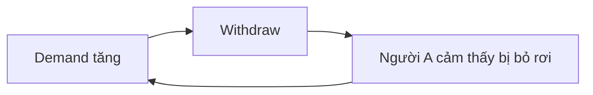

# Giao tiếp liên cá nhân, xung đột và sửa chữa quan hệ

Giao tiếp thường được dạy như kỹ năng “nói rõ ràng”, nhưng xung đột giữa người với người hiếm khi chỉ là vấn đề truyền dữ liệu. Cùng một câu có thể được diễn giải rất khác tùy attachment, status, expectation, history và emotional state. Vì vậy, giao tiếp tốt cần hiểu cả **nội dung**, **relationship signal** và **regulation state**.

## Ba lớp của một message

Một message có thể đồng thời truyền:

1. nội dung thực tế;
2. thái độ đối với relationship;
3. tín hiệu về identity/status.

Ví dụ câu “Cái này anh làm lại giúp em nhé” có thể chỉ là request công việc, nhưng nếu tone hoặc context khiến người nghe cảm thấy bị hạ thấp, conflict có thể xoay quanh status chứ không phải task.

Xem thêm: [[../03_human_development_and_person/04_social_and_cultural_psychology]], [[../03_human_development_and_person/15_power_status_hierarchy_and_inequality]].

## Attribution error trong conflict

Khi chính mình trả lời chậm, ta nghĩ “tôi bận”. Khi người khác trả lời chậm, ta dễ nghĩ “họ không tôn trọng mình”. Đây là ví dụ của attribution asymmetry.

Trong conflict, behavior thường được giải thích bằng character:

> “Anh lúc nào cũng ích kỷ.”

Trong khi một formulation hữu ích hơn hỏi:

> “Behavior nào xảy ra, trong condition nào, và interpretation nào làm conflict leo thang?”

Tách behavior khỏi global identity làm tăng khả năng sửa đổi.

## Active listening không phải lặp lại máy móc

Lắng nghe chủ động (active listening) có ba chức năng:

- kiểm tra mình đã hiểu đúng meaning chưa;
- giúp người kia cảm thấy experience được nhận biết;
- giảm tốc độ escalation.

Một phản hồi tốt thường gồm paraphrase + clarification:

> “Ý bạn là phần khó chịu nhất không phải deadline mà là việc requirement thay đổi sau khi bạn đã code gần xong, đúng không?”

Điều này tốt hơn “Tôi hiểu” nếu thực tế chưa kiểm tra understanding.

## Validation không đồng nghĩa đồng ý

**Validation** xác nhận rằng emotion hoặc perspective có logic trong bối cảnh người kia trải nghiệm. Nó không bắt buộc đồng ý với conclusion.

Có thể nói:

> “Tôi hiểu vì sao bạn bực khi nhận thay đổi sát giờ.”

mà vẫn tiếp tục:

> “Nhưng chúng ta vẫn cần kiểm tra xem thay đổi này có bắt buộc cho release không.”

Distinction này đặc biệt quan trọng trong therapy, management và couple conflict.

## Nonviolent Communication như một structure

NVC thường được nén thành:

```text
Observation → Feeling → Need → Request
```

Giá trị lớn nhất của structure không phải công thức nói chuyện hoàn hảo, mà là buộc người nói phân biệt **observation** với **evaluation**.

“Bạn đến trễ 20 phút” là observation gần với dữ liệu hơn “Bạn không tôn trọng tôi”. Câu thứ hai đã chứa inference về motive.

## Demand–withdraw cycle

Trong relationship, một pattern phổ biến là một người tăng pressure để đạt connection hoặc solution, người kia withdraw để giảm overload. Withdrawal lại khiến người đầu tiên tăng pressure.



Nếu chỉ hỏi ai đúng, loop vẫn còn. Can thiệp tìm cách thay đổi cả hai transition.

Xem thêm: [[../03_human_development_and_person/07_close_relationships_intimacy_and_family]], [[../03_human_development_and_person/01_attachment_and_relationships]].

## Repair attempt

Quan hệ bền không phải quan hệ không conflict. Một variable quan trọng là khả năng **repair** sau rupture.

Repair có thể là:

- thừa nhận tone vừa rồi quá mạnh;
- xin clarification;
- tạm nghỉ để giảm arousal rồi quay lại;
- nhận responsibility cho phần mình;
- phân biệt intention và impact.

Một apology tốt không chỉ nói “xin lỗi nếu bạn cảm thấy…”. Nó thường xác định behavior, impact và plan thay đổi.

## Arousal và khả năng reasoning

Khi physiological arousal quá cao, working memory và cognitive flexibility có thể giảm. Tiếp tục “nói cho ra lẽ” trong state đó thường tạo thêm error.

Time-out có ích nếu là **structured pause**, không phải stonewalling:

> “Tôi đang quá căng để nói tốt. Tôi muốn dừng 30 phút và quay lại lúc 9 giờ.”

Điểm quan trọng là có cam kết quay lại.

## Conflict ở workplace

Workplace conflict có thể đến từ nhiều tầng:

- task conflict: disagreement về giải pháp;
- process conflict: disagreement về cách phối hợp;
- relationship conflict: perceived disrespect/threat;
- structural conflict: role, incentive hoặc resource không rõ.

Không phải conflict nào cũng nên “giao tiếp tốt hơn”. Nếu root cause là incentive trái nhau hoặc workload bất khả thi, communication training không sửa được system.

Xem thêm: [[./00_work_organization_and_leadership]], [[./16_psychological_safety_team_learning_and_speaking_up]].

## Feedback hiệu quả

Feedback dễ thất bại khi nó đánh identity thay vì behavior.

Một structure hữu ích:

```text
Situation → Behavior → Impact → Next step
```

Ví dụ:

> “Trong buổi UAT sáng nay, khi issue chưa được xác nhận mà đã chuyển sang Done, team VN phải mở lại ticket. Lần sau mình giữ trạng thái Pending Verification cho tới khi tester confirm nhé.”

Feedback này observable và actionable hơn “Em thiếu trách nhiệm”.

## Power làm thay đổi communication

Trong hierarchy, “bạn cứ nói thật đi” không đủ để tạo openness. Người có ít power phải cân nhắc career risk, social cost và uncertainty.

Manager muốn nhận bad news cần thiết kế response: nếu lần đầu developer báo risk mà bị blame, team sẽ học rất nhanh rằng silence an toàn hơn.

Psychological safety vì vậy là learning history, không phải slogan.

## Cross-cultural communication

Directness, silence, disagreement với senior, eye contact và response time có meaning khác giữa culture. Khi làm việc cross-cultural, attribution cần chậm lại.

Thay vì:

> “Họ không chủ động.”

có thể hỏi:

> “Expectation về escalation, ownership và hierarchy có giống nhau giữa hai team không?”

Xem thêm: [[../03_human_development_and_person/04_social_and_cultural_psychology]], [[../03_human_development_and_person/16_acculturation_migration_and_bicultural_identity]].

## Negotiation: position và interest

Position là điều một bên nói họ muốn. **Interest** là nhu cầu phía sau.

Hai team có thể tranh cãi “deadline phải thứ Sáu” vs “phải thứ Hai”. Nếu interest thật là team A cần demo thứ Hai còn team B cần weekend không bị deploy, có thể tìm solution khác như feature freeze thứ Sáu và production release thứ Hai.

Tách position khỏi interest mở rộng solution space.

## Common Misconceptions

**“Giao tiếp tốt là luôn nói thẳng.”** Directness phù hợp phụ thuộc context, relationship và culture.

**“Conflict là xấu.”** Task conflict có thể hữu ích nếu psychological safety đủ và không chuyển thành identity attack.

**“Validation là đồng ý.”** Sai. Validation có thể coexist với boundary và disagreement.

**“Nếu tôi có intention tốt thì impact không quan trọng.”** Intention là một phần data; impact cũng là data.

## Mental Model

Trong conflict, đừng chỉ debug **message**. Debug cả:

```text
state + interpretation + history + power + incentive + feedback loop
```

Nhiều vấn đề “communication” thực chất là system problem được biểu hiện qua conversation.

## Connections

Xem thêm:

- [[../03_human_development_and_person/07_close_relationships_intimacy_and_family]];
- [[../03_human_development_and_person/01_attachment_and_relationships]];
- [[./16_psychological_safety_team_learning_and_speaking_up]];
- [[./00_work_organization_and_leadership]];
- [[../03_human_development_and_person/06_stress_coping_and_emotion_regulation]].