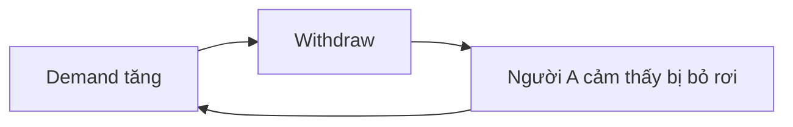

# Giao tiếp liên cá nhân, xung đột và sửa chữa quan hệ

> **Mạch đọc:** Đọc **Giao tiếp liên cá nhân, xung đột và sửa chữa quan hệ** như một mắt xích của lộ trình học (learning path / 학습 경로) hiện tại, không như một ghi chú tách rời. Nội dung đi từ **Ba lớp của một message** sang **Attribution lỗi (error / 오류) trong xung đột (conflict / 충돌)**; điểm nối này chuẩn bị câu hỏi cho các mục sau thay vì dừng ở định nghĩa đầu tiên.


Giao tiếp thường được dạy như kỹ năng “nói rõ ràng”, nhưng xung đột giữa người với người hiếm khi chỉ là vấn đề truyền dữ liệu. Cùng một câu có thể được diễn giải rất khác tùy attachment, status, expectation, lịch sử (history / 이력) và emotional trạng thái (state / 상태). Vì vậy, giao tiếp tốt cần hiểu cả **nội dung**, **relationship tín hiệu (signal / 신호)** và **regulation trạng thái (state / 상태)**.

## Ba lớp của một message

Một message có thể đồng thời truyền:

1. nội dung thực tế;
2. thái độ đối với relationship;
3. tín hiệu về định danh (identity / 식별자)/status.

Ví dụ câu “Cái này anh làm lại giúp em nhé” có thể chỉ là yêu cầu (request / 요청) công việc, nhưng nếu tone hoặc ngữ cảnh (context / 맥락) khiến người nghe cảm thấy bị hạ thấp, xung đột (conflict / 충돌) có thể xoay quanh status chứ không phải tác vụ (task / 작업).

Xem thêm: [[../03_human_development_and_person/04_social_and_cultural_psychology]], [[../03_human_development_and_person/15_power_status_hierarchy_and_inequality]].

## Attribution lỗi (error / 오류) trong xung đột (conflict / 충돌)

Khi chính mình trả lời chậm, ta nghĩ “tôi bận”. Khi người khác trả lời chậm, ta dễ nghĩ “họ không tôn trọng mình”. Đây là ví dụ của attribution asymmetry.

Trong xung đột (conflict / 충돌), hành vi (behavior / 동작) thường được giải thích bằng character:

> “Anh lúc nào cũng ích kỷ.”

Trong khi một formulation hữu ích hơn hỏi:

> “hành vi (behavior / 동작) nào xảy ra, trong điều kiện (condition / 조건) nào, và interpretation nào làm xung đột (conflict / 충돌) leo thang?”

Tách hành vi (behavior / 동작) khỏi toàn cục (global / 전역) định danh (identity / 식별자) làm tăng khả năng sửa đổi.

## Active listening không phải lặp lại máy móc

Lắng nghe chủ động (active listening) có ba chức năng:

- kiểm tra mình đã hiểu đúng meaning chưa;
- giúp người kia cảm thấy experience được nhận biết;
- giảm tốc độ escalation.

Một phản hồi tốt thường gồm paraphrase + clarification:

> “Ý bạn là phần khó chịu nhất không phải deadline mà là việc yêu cầu (requirement / 요구사항) thay đổi sau khi bạn đã mã (code / 코드) gần xong, đúng không?”

Điều này tốt hơn “Tôi hiểu” nếu thực tế chưa kiểm tra understanding.

## Kiểm tra hợp lệ (validation / 검증) không đồng nghĩa đồng ý

**kiểm tra hợp lệ (validation / 검증)** xác nhận rằng emotion hoặc perspective có lô-gic (logic / 논리) trong bối cảnh người kia trải nghiệm. Nó không bắt buộc đồng ý với conclusion.

Có thể nói:

> “Tôi hiểu vì sao bạn bực khi nhận thay đổi sát giờ.”

mà vẫn tiếp tục:

> “Nhưng chúng ta vẫn cần kiểm tra xem thay đổi này có bắt buộc cho bản phát hành (release / 릴리스) không.”

Distinction này đặc biệt quan trọng trong therapy, management và couple xung đột (conflict / 충돌).

## Nonviolent Communication như một cấu trúc (structure / 구조)

NVC thường được nén thành:

```text
Observation → Feeling → Need → Request
```

Giá trị lớn nhất của cấu trúc (structure / 구조) không phải công thức nói chuyện hoàn hảo, mà là buộc người nói phân biệt **observation** với **evaluation**.

“Bạn đến trễ 20 phút” là observation gần với dữ liệu hơn “Bạn không tôn trọng tôi”. Câu thứ hai đã chứa suy luận (inference / 추론) về motive.

## Demand–withdraw cycle

Trong relationship, một mẫu (pattern / 패턴) phổ biến là một người tăng pressure để đạt liên kết (connection / 연결) hoặc solution, người kia withdraw để giảm overload. Withdrawal lại khiến người đầu tiên tăng pressure.


```mermaid
flowchart LR
    A[Demand tăng] --> B[Withdraw]
    B --> C[Người A cảm thấy bị bỏ rơi]
    C --> A
```

Nếu chỉ hỏi ai đúng, vòng lặp (loop / 루프) vẫn còn. Can thiệp tìm cách thay đổi cả hai chuyển tiếp (transition / 전이).

Xem thêm: [[../03_human_development_and_person/07_close_relationships_intimacy_and_family]], [[../03_human_development_and_person/01_attachment_and_relationships]].

## Repair attempt

Quan hệ bền không phải quan hệ không xung đột (conflict / 충돌). Một variable quan trọng là khả năng **repair** sau rupture.

Repair có thể là:

- thừa nhận tone vừa rồi quá mạnh;
- xin clarification;
- tạm nghỉ để giảm arousal rồi quay lại;
- nhận responsibility cho phần mình;
- phân biệt intention và impact.

Một apology tốt không chỉ nói “xin lỗi nếu bạn cảm thấy…”. Nó thường xác định hành vi (behavior / 동작), impact và plan thay đổi.

## Arousal và khả năng lập luận (reasoning / 추론)

Khi physiological arousal quá cao, working bộ nhớ (memory / 메모리) và cognitive flexibility có thể giảm. Tiếp tục “nói cho ra lẽ” trong trạng thái (state / 상태) đó thường tạo thêm lỗi (error / 오류).

Time-out có ích nếu là **structured pause**, không phải stonewalling:

> “Tôi đang quá căng để nói tốt. Tôi muốn dừng 30 phút và quay lại lúc 9 giờ.”

Điểm quan trọng là có cam kết quay lại.

## Xung đột (conflict / 충돌) ở workplace

Workplace xung đột (conflict / 충돌) có thể đến từ nhiều tầng:

- tác vụ (task / 작업) xung đột (conflict / 충돌): disagreement về giải pháp;
- tiến trình (process / 프로세스) xung đột (conflict / 충돌): disagreement về cách phối hợp;
- relationship xung đột (conflict / 충돌): perceived disrespect/threat;
- structural xung đột (conflict / 충돌): role, incentive hoặc tài nguyên (resource / 자원) không rõ.

Không phải xung đột (conflict / 충돌) nào cũng nên “giao tiếp tốt hơn”. Nếu nguyên nhân gốc (root cause / 근본 원인) là incentive trái nhau hoặc tải công việc (workload / 워크로드) bất khả thi, communication huấn luyện (training / 학습) không sửa được hệ thống (system / 시스템).

Xem thêm: [[./00_work_organization_and_leadership]], [[./16_psychological_safety_team_learning_and_speaking_up]].

## Phản hồi (feedback / 피드백) hiệu quả

Phản hồi (feedback / 피드백) dễ thất bại khi nó đánh định danh (identity / 식별자) thay vì hành vi (behavior / 동작).

Một cấu trúc (structure / 구조) hữu ích:

```text
Situation → Behavior → Impact → Next step
```

Ví dụ:

> “Trong buổi UAT sáng nay, khi issue chưa được xác nhận mà đã chuyển sang Done, nhóm (team / 팀) VN phải mở lại ticket. Lần sau mình giữ trạng thái Pending xác minh (verification / 확인) cho tới khi tester confirm nhé.”

Phản hồi (feedback / 피드백) này observable và actionable hơn “Em thiếu trách nhiệm”.

## Power làm thay đổi communication

Trong hierarchy, “bạn cứ nói thật đi” không đủ để tạo openness. Người có ít power phải cân nhắc career rủi ro (risk / 위험), xã hội (social / 사회적) chi phí (cost / 비용) và bất định (uncertainty / 불확실성).

Manager muốn nhận bad news cần thiết kế phản hồi (response / 응답): nếu lần đầu nhà phát triển (developer / 개발자) báo rủi ro (risk / 위험) mà bị blame, nhóm (team / 팀) sẽ học rất nhanh rằng silence an toàn hơn.

Psychological an toàn (safety / 안전) vì vậy là học tập (learning / 학습) lịch sử (history / 이력), không phải slogan.

## Cross-cultural communication

Directness, silence, disagreement với cấp cao (senior / 시니어), eye contact và phản hồi (response / 응답) thời gian (time / 시간) có meaning khác giữa culture. Khi làm việc cross-cultural, attribution cần chậm lại.

Thay vì:

> “Họ không chủ động.”

có thể hỏi:

> “Expectation về escalation, quyền sở hữu (ownership / 소유권) và hierarchy có giống nhau giữa hai nhóm (team / 팀) không?”

Xem thêm: [[../03_human_development_and_person/04_social_and_cultural_psychology]], [[../03_human_development_and_person/16_acculturation_migration_and_bicultural_identity]].

## Negotiation: position và interest

Position là điều một bên nói họ muốn. **Interest** là nhu cầu phía sau.

Hai nhóm (team / 팀) có thể tranh cãi “deadline phải thứ Sáu” vs “phải thứ Hai”. Nếu interest thật là nhóm (team / 팀) A cần demo thứ Hai còn nhóm (team / 팀) B cần weekend không bị deploy, có thể tìm solution khác như tính năng (feature / 기능) freeze thứ Sáu và môi trường vận hành (production / 운영 환경) bản phát hành (release / 릴리스) thứ Hai.

Tách position khỏi interest mở rộng solution không gian (space / 공간).

## Dùng chung (common / 공통) Misconceptions

**“Giao tiếp tốt là luôn nói thẳng.”** Directness phù hợp phụ thuộc ngữ cảnh (context / 맥락), relationship và culture.

**“xung đột (conflict / 충돌) là xấu.”** tác vụ (task / 작업) xung đột (conflict / 충돌) có thể hữu ích nếu psychological an toàn (safety / 안전) đủ và không chuyển thành định danh (identity / 식별자) attack.

**“kiểm tra hợp lệ (validation / 검증) là đồng ý.”** Sai. kiểm tra hợp lệ (validation / 검증) có thể coexist với ranh giới (boundary / 경계) và disagreement.

**“Nếu tôi có intention tốt thì impact không quan trọng.”** Intention là một phần dữ liệu (data / 데이터); impact cũng là dữ liệu (data / 데이터).

## Mô hình tư duy (mental model / 사고 모델)

Trong xung đột (conflict / 충돌), đừng chỉ gỡ lỗi (debug / 디버그) **message**. gỡ lỗi (debug / 디버그) cả:

```text
state + interpretation + history + power + incentive + feedback loop
```

Nhiều vấn đề “communication” thực chất là hệ thống (system / 시스템) bài toán (problem / 문제) được biểu hiện qua conversation.

## Connections

Xem thêm:

- [[../03_human_development_and_person/07_close_relationships_intimacy_and_family]];
- [[../03_human_development_and_person/01_attachment_and_relationships]];
- [[./16_psychological_safety_team_learning_and_speaking_up]];
- [[./00_work_organization_and_leadership]];
- [[../03_human_development_and_person/06_stress_coping_and_emotion_regulation]].

> **Bàn giao:** Sau **Connections**, hãy chốt bất biến (invariant / 불변식) và giới hạn của mục này trước khi nối sang kiến thức kế tiếp. Có thể đọc tiếp [00 work organization and leadership](./00_work_organization_and_leadership.md) để đối chiếu ranh giới (boundary / 경계) gần nhất.
