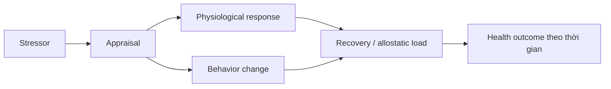

# Hành vi sức khỏe, stress và kết nối tâm–thân

Tâm lý sức khỏe (health psychology / 건강심리학) nghiên cứu cách behavior, cognition, emotion và social environment tương tác với physical health. Nó không giả định “mọi bệnh đều do tâm lý”, cũng không coi mind và body là hai hệ tách biệt.

Một cách nhìn chính xác hơn là: **cơ thể tạo điều kiện cho trải nghiệm tâm lý, và hành vi/tâm lý lại thay đổi exposure sinh học theo thời gian**.

## Từ stressor tới physiological response

Một stressor không đi thẳng tới disease. Giữa chúng có nhiều bước:



Cùng workload, hai người có thể appraisal khác nhau do control, predictability, experience và resources. Appraisal không phải “chỉ nghĩ khác đi là hết stress”; objective demand vẫn quan trọng.

Xem thêm: [[../01_brain_and_mind/06_stress_allostasis_and_psychoneuroimmunology]], [[../03_human_development_and_person/06_stress_coping_and_emotion_regulation]].

## Allostasis

**Allostasis** là quá trình cơ thể thay đổi để duy trì functioning trước demand. Heart rate tăng khi chạy không phải pathology; đó là adaptation.

Vấn đề xuất hiện khi activation thường xuyên, recovery kém hoặc nhiều stress system cùng bị huy động kéo dài. Khái niệm **allostatic load** giúp mô tả cumulative cost này.

Trong đời sống, stress thường ảnh hưởng health cả trực tiếp lẫn gián tiếp qua:

- ngủ ít;
- ăn uống thay đổi;
- alcohol/nicotine/substance use;
- giảm physical activity;
- medication adherence kém;
- social withdrawal.

Vì vậy, chỉ dạy relaxation mà bỏ workload và behavior có thể thiếu.

## Biopsychosocial model

Mô hình sinh học–tâm lý–xã hội (biopsychosocial model) không có nghĩa mọi factor có weight ngang nhau trong mọi bệnh.

Ví dụ bacterial infection cần biological treatment cụ thể. Psychology vẫn có thể ảnh hưởng help-seeking, adherence, pain experience hoặc recovery behavior, nhưng không thay thế antibiotic khi antibiotic được chỉ định.

Model này là lời nhắc: hãy hỏi **factor nào có causal relevance cho outcome nào**, không phải trộn mọi thứ thành một câu “tâm thân liên quan”.

## Pain: nociception không đồng nhất với pain

**Nociception** là neural processing của tín hiệu có khả năng gây tổn thương. **Pain** là conscious experience được tạo bởi nhiều nguồn thông tin: nociception, expectation, attention, context và learning.

Vì vậy:

- tissue damage nhiều không luôn tương ứng pain nhiều;
- pain thật có thể tồn tại dù structural imaging không giải thích đầy đủ;
- psychological modulation không có nghĩa pain “giả”.

Xem thêm: [[../01_brain_and_mind/04_interoception_pain_and_embodied_mind]], [[./13_placebo_nocebo_expectation_and_context]].

## Placebo và nocebo

Expectation có thể điều chỉnh symptom experience. Nếu clinician nói một side effect theo cách cực kỳ threatening, expectation có thể làm symptom monitoring tăng; đây là một phần của **nocebo effect**.

Đạo đức không yêu cầu giấu risk. Nó yêu cầu communicate risk chính xác mà không vô tình tạo threat không cần thiết.

## Adherence: tại sao “biết tốt cho sức khỏe” không đủ

Một người có thể biết exercise tốt nhưng vẫn không tập. Knowledge chỉ là một input.

Behavior phụ thuộc:

```text
motivation × opportunity × capability × friction × reinforcement
```

Nếu gym cách nhà 50 phút, lịch làm việc kết thúc 9 giờ tối và người đó ngủ thiếu, lời khuyên “hãy có kỷ luật” bỏ qua opportunity cost thực tế.

Intervention có thể thay đổi environment:

- chuẩn bị đồ từ trước;
- chọn activity gần nơi làm/nhà;
- giảm minimum viable session;
- implementation intention;
- social commitment;
- tracking đơn giản.

Xem thêm: [[./01_education_learning_and_habit_design]], [[./12_psychology_in_daily_life_and_self_regulation]].

## Motivation và identity

Health behavior bền hơn khi nó không chỉ dựa vào outcome xa như “30 năm nữa khỏe”. Immediate reward và identity có thể quan trọng.

Ví dụ chạy bộ có thể được duy trì vì social connection, stress relief hoặc cảm giác competence, không chỉ vì cardiovascular risk reduction.

Tuy nhiên identity cũng có risk. Nếu “tôi là người không bao giờ bỏ tập” trở nên rigid, injury hoặc illness có thể tạo guilt không cần thiết. Identity hữu ích khi nó hỗ trợ flexible value-based behavior.

## Sleep như health behavior nền

Sleep ảnh hưởng attention, mood, appetite regulation, immune function và safety. Nhưng sleep cũng không hoàn toàn voluntary.

“Ngủ sớm đi” ít hữu ích nếu người đó có shift work, insomnia, caregiving responsibility hoặc circadian mismatch.

Health psychology hỏi cả environmental constraint và behavioral loop.

Xem thêm: [[../01_brain_and_mind/08_sleep_circadian_and_recovery]], [[../04_mental_health/11_sleep_insomnia_and_circadian_disorders]].

## Psychosomatic không nghĩa tưởng tượng

Từ “psychosomatic” thường bị dùng như cách nói “bác sĩ không tìm thấy gì nên chắc do tâm lý”. Cách này không chính xác và dễ gây stigma.

Functional symptoms, stress-sensitive symptoms và somatic distress đều có thể rất thật. Khi nervous system, autonomic regulation, attention và prediction tham gia, symptom vẫn là biological event trong cơ thể.

Xem thêm: [[../04_mental_health/10_dissociation_somatic_and_functional_symptoms]].

## Illness behavior

Hai người có cùng symptom có thể phản ứng khác:

- một người tìm care rất sớm;
- người kia trì hoãn;
- một người liên tục checking;
- người kia avoid information.

Behavior này phụ thuộc health belief, previous experience, access, trust và anxiety.

Excessive reassurance có thể vô tình duy trì health-anxiety loop nếu mỗi lần uncertainty xuất hiện người đó chỉ giảm anxiety bằng test/check mới.

## Risk communication

Nói “thuốc giảm risk 50%” có meaning khác rất nhiều nếu baseline risk từ 2% xuống 1% so với 40% xuống 20%.

Health decision cần hiểu **absolute risk**, **relative risk** và time horizon.

Natural frequency thường dễ hiểu hơn probability abstract:

> “Trong 1000 người giống bạn, khoảng 20 người gặp outcome này; treatment giảm xuống khoảng 10.”

Xem thêm: [[../90_connections/03_risk_uncertainty_and_science_communication]].

## Social determinants

Health behavior không chỉ là individual choice. Income, housing, food access, work schedule, pollution, healthcare access và discrimination tạo constraint thực.

Nếu intervention chỉ nói “hãy ăn lành mạnh” mà người đó không có time/money/access, ta đang biến structural problem thành moral failure cá nhân.

## Behavior change maintenance

Thay đổi vài ngày khác với duy trì nhiều tháng. Maintenance cần:

- cue ổn định;
- reward đủ gần;
- recovery plan khi lapse;
- adaptation khi context đổi;
- identity linh hoạt;
- environment support.

Một lần bỏ tập không xóa habit. Biến quan trọng hơn là **recovery latency**: mất bao lâu để quay lại pattern mong muốn.

## Common Misconceptions

**“Stress gây mọi bệnh.”** Sai. Stress là một factor có effect khác nhau tùy disease, duration, vulnerability và pathway.

**“Nếu symptom bị ảnh hưởng bởi psychology thì symptom không thật.”** Sai.

**“Health behavior chỉ là willpower.”** Environment, reward, access và fatigue có vai trò lớn.

**“Placebo nghĩa là không có tác dụng thật.”** Placebo-related change có thể là measurable physiological/experiential effect; điều đó không làm treatment-specific mechanism trở nên không quan trọng.

## Mental Model

Health outcome dài hạn thường là tích phân của nhiều exposure nhỏ:

> **sinh học hiện tại + hành vi lặp lại + stress/recovery + môi trường + chăm sóc y tế**

Psychology hữu ích nhất khi xác định được **behavioral hoặc cognitive leverage point cụ thể**, không phải khi tuyên bố mind control body.

## Connections

Xem thêm:

- [[../01_brain_and_mind/06_stress_allostasis_and_psychoneuroimmunology]];
- [[../01_brain_and_mind/04_interoception_pain_and_embodied_mind]];
- [[./13_placebo_nocebo_expectation_and_context]];
- [[./12_psychology_in_daily_life_and_self_regulation]];
- [[../05_intervention/02_biological_and_community_treatment]].