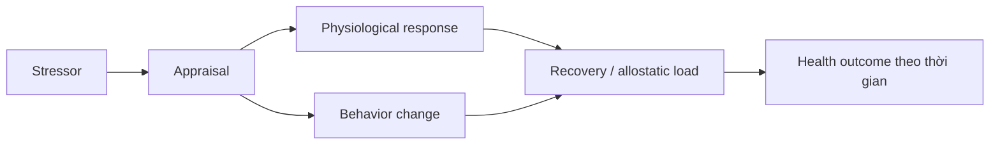

# Hành vi sức khỏe, stress và kết nối tâm–thân

> **Mạch đọc:** [README](../README.md) là bản đồ owner của **Hành vi sức khỏe, stress và kết nối tâm–thân**; nhìn vào vị trí đó trước để biết file này đang phục vụ nhánh kiến thức nào. **Từ stressor tới physiological phản hồi (response / 응답)** mở đối tượng chính của file và câu hỏi cần theo dõi; sau đó sang **Allostasis** để mở rộng đối tượng sang phạm vi kế cận. Mạch này nối health behavior với stress và psychosomatic connections, để phân biệt cơ chế sinh lý, nhận thức và hành vi.

Tâm lý sức khỏe (health psychology / 건강심리학) nghiên cứu cách hành vi (behavior / 동작), cognition, emotion và xã hội (social / 사회적) môi trường (environment / 환경) tương tác với vật lý (physical / 물리적) health. Nó không giả định “mọi bệnh đều do tâm lý”, cũng không coi mind và body là hai hệ tách biệt.

Một cách nhìn chính xác hơn là: **cơ thể tạo điều kiện cho trải nghiệm tâm lý, và hành vi/tâm lý lại thay đổi exposure sinh học theo thời gian**.

## Từ stressor tới physiological phản hồi (response / 응답)

Một stressor không đi thẳng tới disease. Giữa chúng có nhiều bước:


```mermaid
flowchart LR
    A[Stressor] --> B[Appraisal]
    B --> C[Physiological response]
    B --> D[Behavior change]
    C --> E[Recovery / allostatic load]
    D --> E
    E --> F[Health outcome theo thời gian]
```

Cùng tải công việc (workload / 워크로드), hai người có thể appraisal khác nhau do điều khiển (control / 제어), predictability, experience và resources. Appraisal không phải “chỉ nghĩ khác đi là hết stress”; mục tiêu (objective / 목표) demand vẫn quan trọng.

Xem thêm: [[../01_brain_and_mind/06_stress_allostasis_and_psychoneuroimmunology]], [[../03_human_development_and_person/06_stress_coping_and_emotion_regulation]].

> **Nối mạch:** Trong **Hành vi sức khỏe, stress và kết nối tâm–thân**, **Allostasis** nối từ **Từ stressor tới physiological phản hồi (response / 응답)** sang **Biopsychosocial mô hình (model / 모델)**, vì cơ chế trước tạo đầu vào cho bước sau.

## Allostasis

**Allostasis** là quá trình cơ thể thay đổi để duy trì functioning trước demand. Heart tỷ lệ (rate / 비율) tăng khi chạy không phải pathology; đó là adaptation.

Vấn đề xuất hiện khi activation thường xuyên, khôi phục (recovery / 복구) kém hoặc nhiều stress hệ thống (system / 시스템) cùng bị huy động kéo dài. Khái niệm **allostatic tải (load / 로드)** giúp mô tả cumulative chi phí (cost / 비용) này.

Trong đời sống, stress thường ảnh hưởng health cả trực tiếp lẫn gián tiếp qua:

- ngủ ít;
- ăn uống thay đổi;
- alcohol/nicotine/substance use;
- giảm vật lý (physical / 물리적) activity;
- medication adherence kém;
- xã hội (social / 사회적) withdrawal.

Vì vậy, chỉ dạy relaxation mà bỏ tải công việc (workload / 워크로드) và hành vi (behavior / 동작) có thể thiếu.

> **Nối mạch:** Ở chặng này của **Hành vi sức khỏe, stress và kết nối tâm–thân**, **Biopsychosocial mô hình (model / 모델)** nối từ **Allostasis** sang **Pain: nociception không đồng nhất với pain**, vì cơ chế trước tạo đầu vào cho bước sau.

## Biopsychosocial mô hình (model / 모델)

Mô hình sinh học–tâm lý–xã hội (biopsychosocial model) không có nghĩa mọi factor có weight ngang nhau trong mọi bệnh.

Ví dụ bacterial infection cần biological treatment cụ thể. Psychology vẫn có thể ảnh hưởng help-seeking, adherence, pain experience hoặc khôi phục (recovery / 복구) hành vi (behavior / 동작), nhưng không thay thế antibiotic khi antibiotic được chỉ định.

Mô hình (model / 모델) này là lời nhắc: hãy hỏi **factor nào có nhân quả (causal / 인과적) relevance cho kết quả (outcome / 결과) nào**, không phải trộn mọi thứ thành một câu “tâm thân liên quan”.

> **Nối mạch:** Đặt trong câu hỏi lớn của **Hành vi sức khỏe, stress và kết nối tâm–thân**, **Pain: nociception không đồng nhất với pain** nối từ **Biopsychosocial mô hình (model / 모델)** sang **Placebo và nocebo**, vì cơ chế trước tạo đầu vào cho bước sau.

## Pain: nociception không đồng nhất với pain

**Nociception** là neural processing của tín hiệu có khả năng gây tổn thương. **Pain** là conscious experience được tạo bởi nhiều nguồn thông tin: nociception, expectation, attention, ngữ cảnh (context / 맥락) và học tập (learning / 학습).

Vì vậy:

- tissue damage nhiều không luôn tương ứng pain nhiều;
- pain thật có thể tồn tại dù structural imaging không giải thích đầy đủ;
- psychological modulation không có nghĩa pain “giả”.

Xem thêm: [[../01_brain_and_mind/04_interoception_pain_and_embodied_mind]], [[./13_placebo_nocebo_expectation_and_context]].

> **Nối mạch:** Trong **Hành vi sức khỏe, stress và kết nối tâm–thân**, **Placebo và nocebo** nối từ **Pain: nociception không đồng nhất với pain** sang **Adherence: tại sao “biết tốt cho sức khỏe” không đủ**, vì cơ chế trước tạo đầu vào cho bước sau.

## Placebo và nocebo

Expectation có thể điều chỉnh symptom experience. Nếu clinician nói một side tác động (effect / 효과) theo cách cực kỳ threatening, expectation có thể làm symptom monitoring tăng; đây là một phần của **nocebo tác động (effect / 효과)**.

Đạo đức không yêu cầu giấu rủi ro (risk / 위험). Nó yêu cầu communicate rủi ro (risk / 위험) chính xác mà không vô tình tạo threat không cần thiết.

> **Nối mạch:** Ở chặng này của **Hành vi sức khỏe, stress và kết nối tâm–thân**, **Adherence: tại sao “biết tốt cho sức khỏe” không đủ** nối từ **Placebo và nocebo** sang **Motivation và định danh (identity / 식별자)**, vì cơ chế trước tạo đầu vào cho bước sau.

## Adherence: tại sao “biết tốt cho sức khỏe” không đủ

Một người có thể biết exercise tốt nhưng vẫn không tập. kiến thức (knowledge / 지식) chỉ là một đầu vào (input / 입력).

Hành vi (behavior / 동작) phụ thuộc:

```text
motivation × opportunity × capability × friction × reinforcement
```

Nếu gym cách nhà 50 phút, lịch làm việc kết thúc 9 giờ tối và người đó ngủ thiếu, lời khuyên “hãy có kỷ luật” bỏ qua opportunity chi phí (cost / 비용) thực tế.

Intervention có thể thay đổi môi trường (environment / 환경):

- chuẩn bị đồ từ trước;
- chọn activity gần nơi làm/nhà;
- giảm minimum viable session;
- hiện thực (implementation / 구현) intention;
- xã hội (social / 사회적) commitment;
- tracking đơn giản.

Xem thêm: [[./01_education_learning_and_habit_design]], [[./12_psychology_in_daily_life_and_self_regulation]].

> **Nối mạch:** Đặt trong câu hỏi lớn của **Hành vi sức khỏe, stress và kết nối tâm–thân**, **Motivation và định danh (identity / 식별자)** nối từ **Adherence: tại sao “biết tốt cho sức khỏe” không đủ** sang **Sleep như health hành vi (behavior / 동작) nền**, vì cơ chế trước tạo đầu vào cho bước sau.

## Motivation và định danh (identity / 식별자)

Health hành vi (behavior / 동작) bền hơn khi nó không chỉ dựa vào kết quả (outcome / 결과) xa như “30 năm nữa khỏe”. Immediate reward và định danh (identity / 식별자) có thể quan trọng.

Ví dụ chạy bộ có thể được duy trì vì xã hội (social / 사회적) liên kết (connection / 연결), stress relief hoặc cảm giác competence, không chỉ vì cardiovascular rủi ro (risk / 위험) reduction.

Tuy nhiên định danh (identity / 식별자) cũng có rủi ro (risk / 위험). Nếu “tôi là người không bao giờ bỏ tập” trở nên rigid, injury hoặc illness có thể tạo guilt không cần thiết. định danh (identity / 식별자) hữu ích khi nó hỗ trợ flexible value-based hành vi (behavior / 동작).

> **Nối mạch:** Trong **Hành vi sức khỏe, stress và kết nối tâm–thân**, **Sleep như health hành vi (behavior / 동작) nền** nối từ **Motivation và định danh (identity / 식별자)** sang **Psychosomatic không nghĩa tưởng tượng**, vì cơ chế trước tạo đầu vào cho bước sau.

## Sleep như health hành vi (behavior / 동작) nền

Sleep ảnh hưởng attention, mood, appetite regulation, immune hàm (function / 함수) và an toàn (safety / 안전). Nhưng sleep cũng không hoàn toàn voluntary.

“Ngủ sớm đi” ít hữu ích nếu người đó có shift công việc (work / 작업), insomnia, caregiving responsibility hoặc circadian mismatch.

Health psychology hỏi cả environmental ràng buộc (constraint / 제약조건) và behavioral vòng lặp (loop / 루프).

Xem thêm: [[../01_brain_and_mind/08_sleep_circadian_and_recovery]], [[../04_mental_health/11_sleep_insomnia_and_circadian_disorders]].

> **Nối mạch:** Ở chặng này của **Hành vi sức khỏe, stress và kết nối tâm–thân**, **Psychosomatic không nghĩa tưởng tượng** nối từ **Sleep như health hành vi (behavior / 동작) nền** sang **Illness hành vi (behavior / 동작)**, vì cơ chế trước tạo đầu vào cho bước sau.

## Psychosomatic không nghĩa tưởng tượng

Từ “psychosomatic” thường bị dùng như cách nói “bác sĩ không tìm thấy gì nên chắc do tâm lý”. Cách này không chính xác và dễ gây stigma.

Functional symptoms, stress-sensitive symptoms và somatic distress đều có thể rất thật. Khi nervous hệ thống (system / 시스템), autonomic regulation, attention và prediction tham gia, symptom vẫn là biological sự kiện (event / 이벤트) trong cơ thể.

Xem thêm: [[../04_mental_health/10_dissociation_somatic_and_functional_symptoms]].

> **Nối mạch:** Đặt trong câu hỏi lớn của **Hành vi sức khỏe, stress và kết nối tâm–thân**, **Illness hành vi (behavior / 동작)** nối từ **Psychosomatic không nghĩa tưởng tượng** sang **Rủi ro (risk / 위험) communication**, vì cơ chế trước tạo đầu vào cho bước sau.

## Illness hành vi (behavior / 동작)

Hai người có cùng symptom có thể phản ứng khác:

- một người tìm care rất sớm;
- người kia trì hoãn;
- một người liên tục checking;
- người kia avoid thông tin (information / 정보).

Hành vi (behavior / 동작) này phụ thuộc health belief, previous experience, truy cập (access / 접근), trust và anxiety.

Excessive reassurance có thể vô tình duy trì health-anxiety vòng lặp (loop / 루프) nếu mỗi lần bất định (uncertainty / 불확실성) xuất hiện người đó chỉ giảm anxiety bằng kiểm thử (test / 테스트)/check mới.

> **Nối mạch:** Trong **Hành vi sức khỏe, stress và kết nối tâm–thân**, **Rủi ro (risk / 위험) communication** nối từ **Illness hành vi (behavior / 동작)** sang **Xã hội (social / 사회적) determinants**, vì cơ chế trước tạo đầu vào cho bước sau.

## Rủi ro (risk / 위험) communication

Nói “thuốc giảm rủi ro (risk / 위험) 50%” có meaning khác rất nhiều nếu baseline rủi ro (risk / 위험) từ 2% xuống 1% so với 40% xuống 20%.

Health quyết định (decision / 결정) cần hiểu **absolute rủi ro (risk / 위험)**, **relative rủi ro (risk / 위험)** và thời gian (time / 시간) horizon.

Natural frequency thường dễ hiểu hơn xác suất (probability / 확률) abstract:

> “Trong 1000 người giống bạn, khoảng 20 người gặp kết quả (outcome / 결과) này; treatment giảm xuống khoảng 10.”

Xem thêm: [[../90_connections/03_risk_uncertainty_and_science_communication]].

> **Nối mạch:** Ở chặng này của **Hành vi sức khỏe, stress và kết nối tâm–thân**, **Xã hội (social / 사회적) determinants** nối từ **Rủi ro (risk / 위험) communication** sang **Hành vi (behavior / 동작) thay đổi (change / 변경) maintenance**, vì cơ chế trước tạo đầu vào cho bước sau.

## Xã hội (social / 사회적) determinants

Health hành vi (behavior / 동작) không chỉ là individual choice. Income, housing, food truy cập (access / 접근), công việc (work / 작업) schedule, pollution, healthcare truy cập (access / 접근) và discrimination tạo ràng buộc (constraint / 제약조건) thực.

Nếu intervention chỉ nói “hãy ăn lành mạnh” mà người đó không có thời gian (time / 시간)/money/truy cập (access / 접근), ta đang biến structural bài toán (problem / 문제) thành moral thất bại (failure / 실패) cá nhân.

> **Nối mạch:** Đặt trong câu hỏi lớn của **Hành vi sức khỏe, stress và kết nối tâm–thân**, **Hành vi (behavior / 동작) thay đổi (change / 변경) maintenance** nối từ **Xã hội (social / 사회적) determinants** sang **Dùng chung (common / 공통) Misconceptions**, vì cơ chế trước tạo đầu vào cho bước sau.

## Hành vi (behavior / 동작) thay đổi (change / 변경) maintenance

Thay đổi vài ngày khác với duy trì nhiều tháng. Maintenance cần:

- cue ổn định;
- reward đủ gần;
- khôi phục (recovery / 복구) plan khi lapse;
- adaptation khi ngữ cảnh (context / 맥락) đổi;
- định danh (identity / 식별자) linh hoạt;
- môi trường (environment / 환경) hỗ trợ (support / 지원).

Một lần bỏ tập không xóa habit. Biến quan trọng hơn là **khôi phục (recovery / 복구) độ trễ (latency / 지연 시간)**: mất bao lâu để quay lại mẫu (pattern / 패턴) mong muốn.

> **Nối mạch:** Trong **Hành vi sức khỏe, stress và kết nối tâm–thân**, **Dùng chung (common / 공통) Misconceptions** nối từ **Hành vi (behavior / 동작) thay đổi (change / 변경) maintenance** sang **Mô hình tư duy (mental model / 사고 모델)**, vì cơ chế trước tạo đầu vào cho bước sau.

## Dùng chung (common / 공통) Misconceptions

**“Stress gây mọi bệnh.”** Sai. Stress là một factor có tác động (effect / 효과) khác nhau tùy disease, duration, vulnerability và pathway.

**“Nếu symptom bị ảnh hưởng bởi psychology thì symptom không thật.”** Sai.

**“Health hành vi (behavior / 동작) chỉ là willpower.”** môi trường (environment / 환경), reward, truy cập (access / 접근) và fatigue có vai trò lớn.

**“Placebo nghĩa là không có tác dụng thật.”** Placebo-related thay đổi (change / 변경) có thể là measurable physiological/experiential tác động (effect / 효과); điều đó không làm treatment-specific cơ chế (mechanism / 메커니즘) trở nên không quan trọng.

> **Nối mạch:** Ở chặng này của **Hành vi sức khỏe, stress và kết nối tâm–thân**, **Mô hình tư duy (mental model / 사고 모델)** tổng hợp từ **Dùng chung (common / 공통) Misconceptions** thành một kết luận có thể mang sang phần kế tiếp. Từ đây, **Connections** mở rộng hệ quả hoặc giới hạn liên quan.

## Mô hình tư duy (mental model / 사고 모델)

Health kết quả (outcome / 결과) dài hạn thường là tích phân của nhiều exposure nhỏ:

> **sinh học hiện tại + hành vi lặp lại + stress/khôi phục (recovery / 복구) + môi trường + chăm sóc y tế**

Psychology hữu ích nhất khi xác định được **behavioral hoặc cognitive leverage điểm (point / 지점) cụ thể**, không phải khi tuyên bố mind điều khiển (control / 제어) body.

> **Nối mạch:** Đặt trong câu hỏi lớn của **Hành vi sức khỏe, stress và kết nối tâm–thân**, **Connections** tổng hợp từ **Mô hình tư duy (mental model / 사고 모델)** thành một kết luận có thể mang sang phần kế tiếp. Mục này khép mạch bằng cách nối kết quả với phạm vi của chapter.

## Connections

Xem thêm:

- [[../01_brain_and_mind/06_stress_allostasis_and_psychoneuroimmunology]];
- [[../01_brain_and_mind/04_interoception_pain_and_embodied_mind]];
- [[./13_placebo_nocebo_expectation_and_context]];
- [[./12_psychology_in_daily_life_and_self_regulation]];
- [[../05_intervention/02_biological_and_community_treatment]].

> **Bàn giao:** Sau **Connections**, hãy giữ lại kết luận và ranh giới của mục này; quay về [README](../README.md) khi cần định vị owner hoặc chọn nhánh học tiếp theo.
