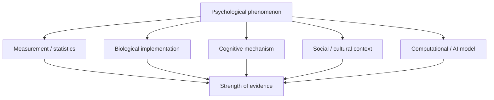

# Psychology kết nối với Biology, Statistics và AI

Tâm lý học không tồn tại như một hòn đảo. Một claim về memory có thể cần neuroscience để hiểu implementation, statistics để đánh giá evidence, computer science để mô hình hóa process và philosophy để làm rõ concept. Tuy nhiên, cross-domain connection chỉ có giá trị khi ta biết **level of analysis** đang thay đổi ở đâu.

## Một hiện tượng có nhiều level giải thích

Giả sử một người không thể tập trung khi làm việc.

Ta có thể mô tả ở nhiều level:

- biological: sleep debt, arousal, neural network dynamics;
- cognitive: working-memory load, attention switching;
- behavioral: notification checking đã được reinforcement;
- social: manager gửi message liên tục;
- organizational: workflow yêu cầu multi-tasking;
- computational: task queue và interruption cost.

Các explanation này không nhất thiết cạnh tranh. Chúng có thể là các lát cắt khác nhau của cùng system.

Sai lầm phổ biến là **reductionism**: nếu tìm thấy neural correlate, người ta kết luận psychological explanation không còn cần thiết. Nhưng biết transistor state của CPU không tự động thay thế algorithm-level explanation của program.

## Psychology và Biology

Biology cung cấp constraint và mechanism cho psychology. Nervous system, endocrine system, immune system và genetics đều ảnh hưởng behavior.

Nhưng gene không “mã hóa trực tiếp” một behavior phức tạp như một dòng source code. Gene expression phụ thuộc developmental context; behavior lại thay đổi environment, tạo **gene–environment correlation** và feedback loop.

Ví dụ temperament có thể ảnh hưởng cách người khác phản ứng với trẻ; response đó lại thay đổi learning environment của trẻ.

Xem thêm: [[../01_brain_and_mind/03_evolution_genetics_and_behavior]], [[../01_brain_and_mind/00_nervous_system_and_brain]], [[../04_mental_health/12_developmental_psychopathology_risk_and_resilience]].

## Neuroscience không phải máy phát hiện truth cho psychology

Brain imaging rất mạnh nhưng dễ bị overinterpretation. Nếu vùng X active khi người ta làm task Y, không thể tự động kết luận activation X “là” Y.

Một brain region thường tham gia nhiều function. Đây là vấn đề của **reverse inference**.

Neuroscience hữu ích nhất khi experimental design phân biệt được competing mechanism, không phải khi chỉ thêm hình não màu sắc vào psychological claim.

## Psychology và Statistics

Tâm lý học phải đo construct không nhìn thấy trực tiếp: intelligence, anxiety, personality, trust, motivation. Vì vậy statistics không chỉ là bước tính p-value ở cuối; nó nằm ngay trong logic measurement.

Observed score có thể được nghĩ đơn giản như:

\[
X = T + E
\]

trong đó `X` là observed score, `T` là true-score component trong classical test theory và `E` là measurement error.

Mental model: nếu measurement noisy, model downstream dù sophisticated đến đâu cũng đang học từ noisy representation.

Xem thêm: [[../00_foundations/03_measurement_statistics]], [[../00_foundations/05_psychometrics_and_test_interpretation]].

## Correlation, prediction và causation

Machine learning có thể dự đoán depression score từ digital behavior nhưng điều đó không chứng minh phone use gây depression.

Ba câu hỏi khác nhau:

1. hai biến có association không?
2. một biến giúp dự đoán biến kia ngoài sample không?
3. thay đổi X bằng intervention có làm Y thay đổi không?

Prediction có thể rất tốt mà causal understanding vẫn yếu.

Xem thêm: [[../00_foundations/08_causal_inference_and_psychological_evidence]], [[../00_foundations/07_ecological_momentary_assessment_and_real_world_measurement]].

## Psychology và Computer Science

Cognitive psychology từ lâu đã dùng information-processing metaphor. Memory, attention và problem solving có thể được mô hình hóa qua representation, capacity, search và control.

Nhưng brain không phải máy tính digital theo nghĩa đơn giản. Metaphor hữu ích khi nó tạo testable model, không khi nó biến thành identity statement “brain = computer”.

Một connection hữu ích là **bounded resources**. Trong software, queue và cache có giới hạn; trong cognition, attention và working memory cũng có bottleneck. Tuy nhiên mechanism cụ thể khác nhau.

## Reinforcement learning và behavior

Reinforcement learning (RL) formalize cách agent cập nhật value từ reward prediction error.

Dạng đơn giản:

\[
V_{t+1} = V_t + \alpha (R_t - V_t)
\]

Trong đó phần `R_t - V_t` là prediction error.

Psychology learning theory cũng quan tâm discrepancy giữa expected và actual outcome. Connection này mạnh vì cả hai đều mô tả updating, nhưng ta không nên nói dopamine đơn giản “là reward chemical” hoặc mọi human decision đều được giải thích bằng một RL equation duy nhất.

Xem thêm: [[../02_learning_and_cognition/00_learning_and_conditioning]], [[../02_learning_and_cognition/08_decision_under_risk_uncertainty_and_ambiguity]].

## Bayesian reasoning và perception

Bayesian framework mô tả cách prior belief được cập nhật bởi evidence:

\[
P(H|D) \propto P(D|H)P(H)
\]

Perception có thể được model như inference: brain kết hợp sensory likelihood với prior expectation.

Điều này giúp hiểu illusion, ambiguity và context effect. Tuy nhiên, nói “brain is Bayesian” thường là family of models, không phải một fact đơn giản rằng neuron trực tiếp tính Bayes formula.

Xem thêm: [[../01_brain_and_mind/01_sensation_and_perception]], [[../00_foundations/09_replication_meta_analysis_and_bayesian_reasoning]].

## Psychology và AI

AI system ngày càng tạo text, image, code và recommendation có vẻ mang tính xã hội. Điều này làm psychology trở nên quan trọng ở hai phía:

- psychology giúp thiết kế human–AI interaction;
- AI trở thành model/tool để nghiên cứu cognition.

Nhưng LLM output giống human language không chứng minh model có human-like mental state. Behaviorally similar output có thể được tạo bởi architecture/process rất khác.

Đây là distinction giữa **functional similarity** và **mechanistic identity**.

## Anthropomorphism

Con người có xu hướng gán intention cho object có behavior phức tạp. Khi chatbot dùng “tôi nghĩ”, “tôi hiểu”, user dễ xây social model về system.

Anthropomorphism có thể giúp interaction dễ hơn nhưng cũng tăng overtrust. Design cần làm rõ capability, uncertainty và boundary.

Xem thêm: [[../06_applied/02_hci_ai_and_human_decision_support]], [[./02_human_ai_collaboration_trust_and_cognitive_offloading]].

## AI như cognitive offloading

Search engine offload retrieval; calculator offload arithmetic; AI có thể offload synthesis, drafting và coding.

Câu hỏi không nên là “offloading tốt hay xấu?” mà là:

> Task này đang tối ưu **performance** hay **learning**?

Nếu mục tiêu học SQL, việc để AI viết query hoàn chỉnh ngay có thể giảm desirable difficulty. Nếu mục tiêu xử lý một task production đã hiểu rõ, offloading có thể tăng hiệu quả.

Xem thêm: [[../02_learning_and_cognition/10_cognitive_offloading_external_memory_and_extended_cognition]], [[../06_applied/01_education_learning_and_habit_design]].

## Digital phenotyping

Phone/wearable có thể thu sleep proxy, mobility, typing pattern hoặc activity. Những feature này có thể correlate với mental-health state nhưng gặp nhiều vấn đề:

- privacy;
- missing data;
- device-specific bias;
- context ambiguity;
- population shift;
- causal interpretation.

Một người di chuyển ít có thể depressed, nhưng cũng có thể làm remote work hoặc đang nghỉ phép. Sensor không tự mang meaning.

## Psychology và Economics

Behavioral economics dùng psychological insight để nghiên cứu decision dưới scarcity, uncertainty và framing. Concepts như loss aversion, default, mental accounting và present bias cho thấy rational choice model đôi khi cần bổ sung descriptive psychology.

Nhưng bias list cũng dễ bị biến thành storytelling. Một bias claim tốt cần experimental boundary và effect size, không chỉ một ví dụ hợp lý sau sự kiện.

Xem thêm: [[../02_learning_and_cognition/08_decision_under_risk_uncertainty_and_ambiguity]], [[../06_applied/18_financial_psychology_and_personal_decision_making]].

## Psychology và Philosophy

Psychology đo behavior/experience; philosophy giúp làm rõ khái niệm như consciousness, free will, personal identity và moral responsibility.

Không phải câu hỏi nào cũng được giải quyết chỉ bằng thêm data. Nếu construct chưa rõ nghĩa, measurement chính xác tới mấy cũng có thể đo sai thing.

Xem thêm: [[../01_brain_and_mind/09_consciousness_theories_and_evidence]].

## Knowledge graph mental model

Một cách học xuyên ngành:

Không arrow nào tự động thay thế các arrow khác.

## Common Misconceptions

**“Có brain scan là objective hơn questionnaire nên chắc đúng hơn.”** Brain measure cũng có noise, construct-validity problem và analysis choice.

**“AI dự đoán tốt thì đã hiểu tâm lý.”** Prediction và explanation khác nhau.

**“Psychology không phải hard science nên statistics không quan trọng.”** Chính vì construct khó đo nên statistical reasoning càng quan trọng.

**“Nếu một behavior có genetic component thì không thay đổi được.”** Heritability không đồng nghĩa immutability.

## Mental Model

Hãy dùng principle:

> **Một hiện tượng, nhiều level; mỗi level cần measurement và causal logic phù hợp.**

Cross-domain knowledge tốt không phải gom thuật ngữ từ nhiều ngành, mà là biết khi nào một model ở ngành này thực sự giải thích hoặc constrain model ở ngành khác.