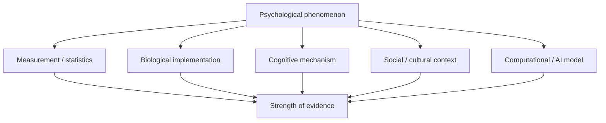

# Psychology kết nối với Biology, Statistics và AI

> **Mạch đọc:** Đọc **Psychology kết nối với Biology, Statistics và AI** như một mắt xích của lộ trình học (learning path / 학습 경로) hiện tại, không như một ghi chú tách rời. Nội dung đi từ **Một hiện tượng có nhiều mức (level / 수준) giải thích** sang **Psychology và Biology**; điểm nối này chuẩn bị câu hỏi cho các mục sau thay vì dừng ở định nghĩa đầu tiên.

Tâm lý học không tồn tại như một hòn đảo. Một claim về bộ nhớ (memory / 메모리) có thể cần neuroscience để hiểu hiện thực (implementation / 구현), statistics để đánh giá bằng chứng (evidence / 증거), khoa học máy tính (computer science / 컴퓨터 과학) để mô hình hóa tiến trình (process / 프로세스) và philosophy để làm rõ concept. Tuy nhiên, cross-domain liên kết (connection / 연결) chỉ có giá trị khi ta biết **mức (level / 수준) of phân tích (analysis / 분석)** đang thay đổi ở đâu.

## Một hiện tượng có nhiều mức (level / 수준) giải thích

Giả sử một người không thể tập trung khi làm việc.

Ta có thể mô tả ở nhiều mức (level / 수준):

- biological: sleep debt, arousal, neural mạng (network / 네트워크) dynamics;
- cognitive: working-memory tải (load / 로드), attention switching;
- behavioral: notification checking đã được reinforcement;
- xã hội (social / 사회적): manager gửi message liên tục;
- organizational: workflow yêu cầu multi-tasking;
- computational: tác vụ (task / 작업) hàng đợi (queue / 큐) và interruption chi phí (cost / 비용).

Các explanation này không nhất thiết cạnh tranh. Chúng có thể là các lát cắt khác nhau của cùng hệ thống (system / 시스템).

Sai lầm phổ biến là **reductionism**: nếu tìm thấy neural correlate, người ta kết luận psychological explanation không còn cần thiết. Nhưng biết transistor trạng thái (state / 상태) của CPU không tự động thay thế algorithm-level explanation của program.

## Psychology và Biology

Biology cung cấp ràng buộc (constraint / 제약조건) và cơ chế (mechanism / 메커니즘) cho psychology. Nervous hệ thống (system / 시스템), endocrine hệ thống (system / 시스템), immune hệ thống (system / 시스템) và genetics đều ảnh hưởng hành vi (behavior / 동작).

Nhưng gene không “mã hóa trực tiếp” một hành vi (behavior / 동작) phức tạp như một dòng mã nguồn (source code / 소스 코드). Gene expression phụ thuộc developmental ngữ cảnh (context / 맥락); hành vi (behavior / 동작) lại thay đổi môi trường (environment / 환경), tạo **gene–môi trường (environment / 환경) correlation** và vòng phản hồi (feedback loop / 피드백 루프).

Ví dụ temperament có thể ảnh hưởng cách người khác phản ứng với trẻ; phản hồi (response / 응답) đó lại thay đổi học tập (learning / 학습) môi trường (environment / 환경) của trẻ.

Xem thêm: [[../01_brain_and_mind/03_evolution_genetics_and_behavior]], [[../01_brain_and_mind/00_nervous_system_and_brain]], [[../04_mental_health/12_developmental_psychopathology_risk_and_resilience]].

## Neuroscience không phải máy phát hiện truth cho psychology

Brain imaging rất mạnh nhưng dễ bị overinterpretation. Nếu vùng X active khi người ta làm tác vụ (task / 작업) Y, không thể tự động kết luận activation X “là” Y.

Một brain region thường tham gia nhiều hàm (function / 함수). Đây là vấn đề của **reverse suy luận (inference / 추론)**.

Neuroscience hữu ích nhất khi experimental thiết kế (design / 설계) phân biệt được competing cơ chế (mechanism / 메커니즘), không phải khi chỉ thêm hình não màu sắc vào psychological claim.

## Psychology và Statistics

Tâm lý học phải đo construct không nhìn thấy trực tiếp: intelligence, anxiety, personality, trust, motivation. Vì vậy statistics không chỉ là bước tính p-value ở cuối; nó nằm ngay trong lô-gic (logic / 논리) đo lường (measurement / 측정).

Observed score có thể được nghĩ đơn giản như:

\[
X = T + E
\]

trong đó `X` là observed score, `T` là true-score thành phần (component / 컴포넌트) trong classical kiểm thử (test / 테스트) lý thuyết (theory / 이론) và `E` là sai số đo lường (measurement error / 측정 오차).

Mô hình tư duy (mental model / 사고 모델): nếu đo lường (measurement / 측정) noisy, mô hình (model / 모델) downstream dù sophisticated đến đâu cũng đang học từ noisy biểu diễn (representation / 표현).

Xem thêm: [[../00_foundations/03_measurement_statistics]], [[../00_foundations/05_psychometrics_and_test_interpretation]].

## Correlation, prediction và causation

Machine học tập (learning / 학습) có thể dự đoán depression score từ digital hành vi (behavior / 동작) nhưng điều đó không chứng minh phone use gây depression.

Ba câu hỏi khác nhau:

1. hai biến có association không?
2. một biến giúp dự đoán biến kia ngoài mẫu (sample / 표본) không?
3. thay đổi X bằng intervention có làm Y thay đổi không?

Prediction có thể rất tốt mà nhân quả (causal / 인과적) understanding vẫn yếu.

Xem thêm: [[../00_foundations/08_causal_inference_and_psychological_evidence]], [[../00_foundations/07_ecological_momentary_assessment_and_real_world_measurement]].

## Psychology và Khoa học máy tính (computer science / 컴퓨터 과학)

Cognitive psychology từ lâu đã dùng information-processing metaphor. bộ nhớ (memory / 메모리), attention và bài toán (problem / 문제) solving có thể được mô hình hóa qua biểu diễn (representation / 표현), sức chứa (capacity / 용량), tìm kiếm (search / 검색) và điều khiển (control / 제어).

Nhưng brain không phải máy tính digital theo nghĩa đơn giản. Metaphor hữu ích khi nó tạo testable mô hình (model / 모델), không khi nó biến thành định danh (identity / 식별자) statement “brain = computer”.

Một liên kết (connection / 연결) hữu ích là **bounded resources**. Trong software, hàng đợi (queue / 큐) và bộ nhớ đệm (cache / 캐시) có giới hạn; trong cognition, attention và working bộ nhớ (memory / 메모리) cũng có bottleneck. Tuy nhiên cơ chế (mechanism / 메커니즘) cụ thể khác nhau.

## Reinforcement học tập (learning / 학습) và hành vi (behavior / 동작)

Reinforcement học tập (learning / 학습) (RL) formalize cách tác nhân (agent / 에이전트) cập nhật giá trị (value / 값) từ reward prediction lỗi (error / 오류).

Dạng đơn giản:

\[
V_{t+1} = V_t + \alpha (R_t - V_t)
\]

Trong đó phần `R_t - V_t` là prediction lỗi (error / 오류).

Psychology học tập (learning / 학습) lý thuyết (theory / 이론) cũng quan tâm discrepancy giữa expected và actual kết quả (outcome / 결과). liên kết (connection / 연결) này mạnh vì cả hai đều mô tả updating, nhưng ta không nên nói dopamine đơn giản “là reward chemical” hoặc mọi human quyết định (decision / 결정) đều được giải thích bằng một RL equation duy nhất.

Xem thêm: [[../02_learning_and_cognition/00_learning_and_conditioning]], [[../02_learning_and_cognition/08_decision_under_risk_uncertainty_and_ambiguity]].

## Bayesian lập luận (reasoning / 추론) và perception

Bayesian khung phần mềm (framework / 프레임워크) mô tả cách prior belief được cập nhật bởi bằng chứng (evidence / 증거):

\[
P(H|D) \propto P(D|H)P(H)
\]

Perception có thể được mô hình (model / 모델) như suy luận (inference / 추론): brain kết hợp sensory likelihood với prior expectation.

Điều này giúp hiểu illusion, ambiguity và ngữ cảnh (context / 맥락) tác động (effect / 효과). Tuy nhiên, nói “brain is Bayesian” thường là family of các mô hình (models / 모델들), không phải một fact đơn giản rằng neuron trực tiếp tính Bayes formula.

Xem thêm: [[../01_brain_and_mind/01_sensation_and_perception]], [[../00_foundations/09_replication_meta_analysis_and_bayesian_reasoning]].

## Psychology và AI

AI hệ thống (system / 시스템) ngày càng tạo văn bản (text / 텍스트), ảnh (image / 이미지), mã (code / 코드) và recommendation có vẻ mang tính xã hội. Điều này làm psychology trở nên quan trọng ở hai phía:

- psychology giúp thiết kế human–AI tương tác (interaction / 상호작용);
- AI trở thành mô hình (model / 모델)/công cụ (tool / 도구) để nghiên cứu cognition.

Nhưng LLM đầu ra (output / 출력) giống human ngôn ngữ (language / 언어) không chứng minh mô hình (model / 모델) có human-like mental trạng thái (state / 상태). Behaviorally similar đầu ra (output / 출력) có thể được tạo bởi kiến trúc (architecture / 아키텍처)/tiến trình (process / 프로세스) rất khác.

Đây là distinction giữa **functional similarity** và **mechanistic định danh (identity / 식별자)**.

## Anthropomorphism

Con người có xu hướng gán intention cho đối tượng (object / 객체) có hành vi (behavior / 동작) phức tạp. Khi chatbot dùng “tôi nghĩ”, “tôi hiểu”, người dùng (user / 사용자) dễ xây xã hội (social / 사회적) mô hình (model / 모델) về hệ thống (system / 시스템).

Anthropomorphism có thể giúp tương tác (interaction / 상호작용) dễ hơn nhưng cũng tăng overtrust. thiết kế (design / 설계) cần làm rõ năng lực (capability / 역량), bất định (uncertainty / 불확실성) và ranh giới (boundary / 경계).

Xem thêm: [[../06_applied/02_hci_ai_and_human_decision_support]], [[./02_human_ai_collaboration_trust_and_cognitive_offloading]].

## AI như cognitive offloading

Tìm kiếm (search / 검색) engine offload retrieval; calculator offload arithmetic; AI có thể offload synthesis, drafting và coding.

Câu hỏi không nên là “offloading tốt hay xấu?” mà là:

> tác vụ (task / 작업) này đang tối ưu **hiệu năng (performance / 성능)** hay **học tập (learning / 학습)**?

Nếu mục tiêu học SQL, việc để AI viết truy vấn (query / 쿼리) hoàn chỉnh ngay có thể giảm desirable difficulty. Nếu mục tiêu xử lý một tác vụ (task / 작업) môi trường vận hành (production / 운영 환경) đã hiểu rõ, offloading có thể tăng hiệu quả.

Xem thêm: [[../02_learning_and_cognition/10_cognitive_offloading_external_memory_and_extended_cognition]], [[../06_applied/01_education_learning_and_habit_design]].

## Digital phenotyping

Phone/wearable có thể thu sleep proxy, mobility, typing mẫu (pattern / 패턴) hoặc activity. Những tính năng (feature / 기능) này có thể correlate với mental-health trạng thái (state / 상태) nhưng gặp nhiều vấn đề:

- privacy;
- missing dữ liệu (data / 데이터);
- device-specific độ lệch (bias / 편향);
- ngữ cảnh (context / 맥락) ambiguity;
- population shift;
- nhân quả (causal / 인과적) interpretation.

Một người di chuyển ít có thể depressed, nhưng cũng có thể làm remote công việc (work / 작업) hoặc đang nghỉ phép. Sensor không tự mang meaning.

## Psychology và Economics

Behavioral economics dùng psychological insight để nghiên cứu quyết định (decision / 결정) dưới scarcity, bất định (uncertainty / 불확실성) và framing. Concepts như mất mát (loss / 손실) aversion, default, mental accounting và present độ lệch (bias / 편향) cho thấy rational choice mô hình (model / 모델) đôi khi cần bổ sung descriptive psychology.

Nhưng độ lệch (bias / 편향) danh sách (list / 목록) cũng dễ bị biến thành storytelling. Một độ lệch (bias / 편향) claim tốt cần experimental ranh giới (boundary / 경계) và tác động (effect / 효과) kích thước (size / 크기), không chỉ một ví dụ hợp lý sau sự kiện.

Xem thêm: [[../02_learning_and_cognition/08_decision_under_risk_uncertainty_and_ambiguity]], [[../06_applied/18_financial_psychology_and_personal_decision_making]].

## Psychology và Philosophy

Psychology đo hành vi (behavior / 동작)/experience; philosophy giúp làm rõ khái niệm như consciousness, free will, personal định danh (identity / 식별자) và moral responsibility.

Không phải câu hỏi nào cũng được giải quyết chỉ bằng thêm dữ liệu (data / 데이터). Nếu construct chưa rõ nghĩa, đo lường (measurement / 측정) chính xác tới mấy cũng có thể đo sai thing.

Xem thêm: [[../01_brain_and_mind/09_consciousness_theories_and_evidence]].

## Kiến thức (knowledge / 지식) đồ thị (graph / 그래프) mô hình tư duy (mental model / 사고 모델)

Một cách học xuyên ngành:

```mermaid
flowchart TD
    P[Psychological phenomenon]
    P --> B[Biological implementation]
    P --> C[Cognitive mechanism]
    P --> S[Social / cultural context]
    P --> M[Measurement / statistics]
    P --> A[Computational / AI model]
    M --> E[Strength of evidence]
    B --> E
    C --> E
    S --> E
    A --> E
```

Không arrow nào tự động thay thế các arrow khác.

## Dùng chung (common / 공통) Misconceptions

**“Có brain scan là mục tiêu (objective / 목표) hơn questionnaire nên chắc đúng hơn.”** Brain measure cũng có noise, construct-validity bài toán (problem / 문제) và phân tích (analysis / 분석) choice.

**“AI dự đoán tốt thì đã hiểu tâm lý.”** Prediction và explanation khác nhau.

**“Psychology không phải hard science nên statistics không quan trọng.”** Chính vì construct khó đo nên statistical lập luận (reasoning / 추론) càng quan trọng.

**“Nếu một hành vi (behavior / 동작) có genetic thành phần (component / 컴포넌트) thì không thay đổi được.”** Heritability không đồng nghĩa immutability.

## Mô hình tư duy (mental model / 사고 모델)

Hãy dùng principle:

> **Một hiện tượng, nhiều mức (level / 수준); mỗi mức (level / 수준) cần đo lường (measurement / 측정) và nhân quả (causal / 인과적) lô-gic (logic / 논리) phù hợp.**

Cross-domain kiến thức (knowledge / 지식) tốt không phải gom thuật ngữ từ nhiều ngành, mà là biết khi nào một mô hình (model / 모델) ở ngành này thực sự giải thích hoặc constrain mô hình (model / 모델) ở ngành khác.

> **Bàn giao:** Sau **mô hình tư duy (mental model / 사고 모델)**, hãy chốt bất biến (invariant / 불변식) và giới hạn của mục này trước khi nối sang kiến thức kế tiếp. Có thể đọc tiếp [00 freud jung and depth psychology in context](./00_freud_jung_and_depth_psychology_in_context.md) để đối chiếu ranh giới (boundary / 경계) gần nhất.
