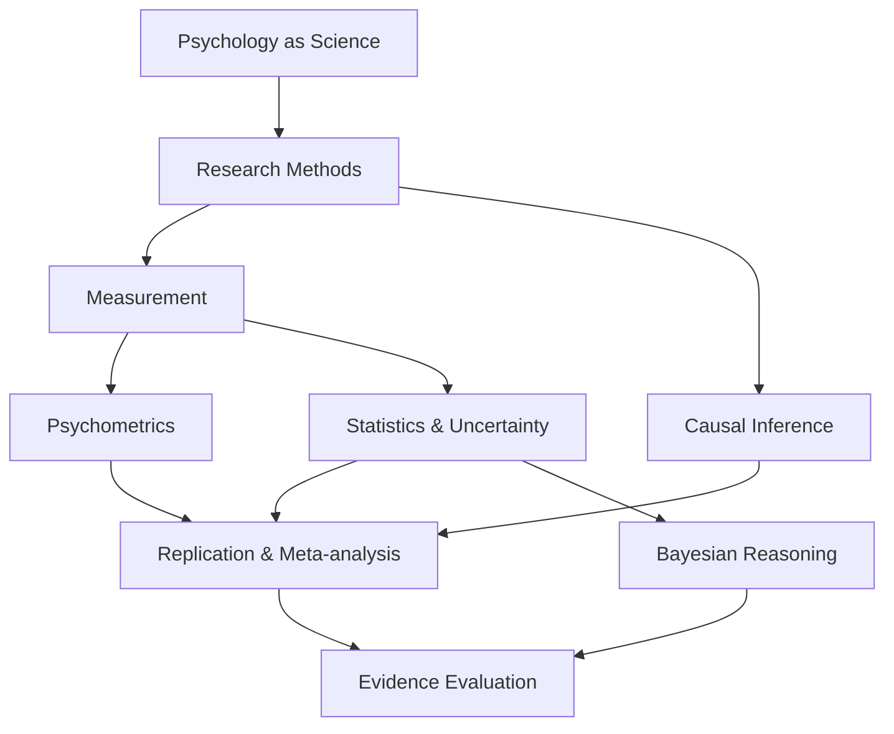
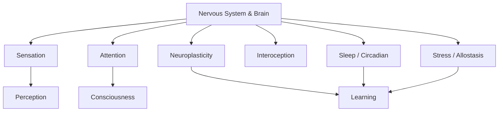
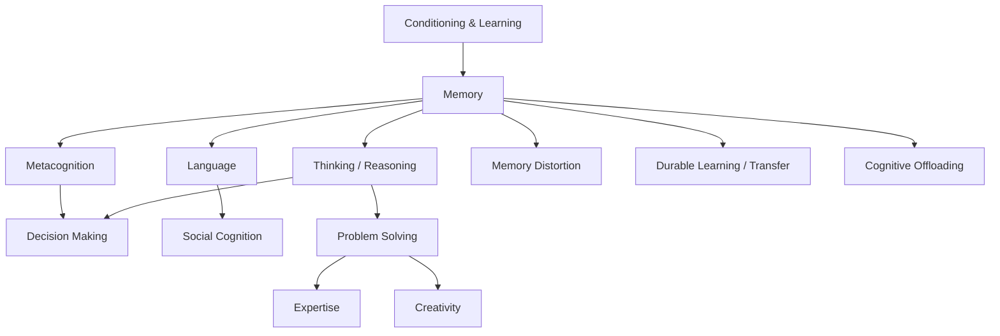
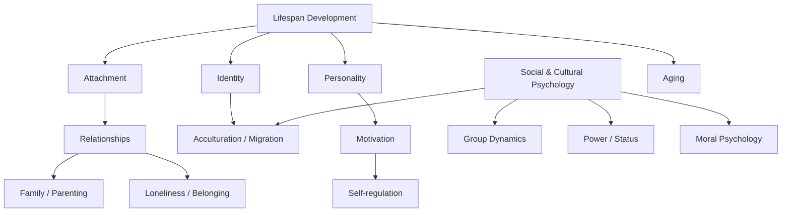
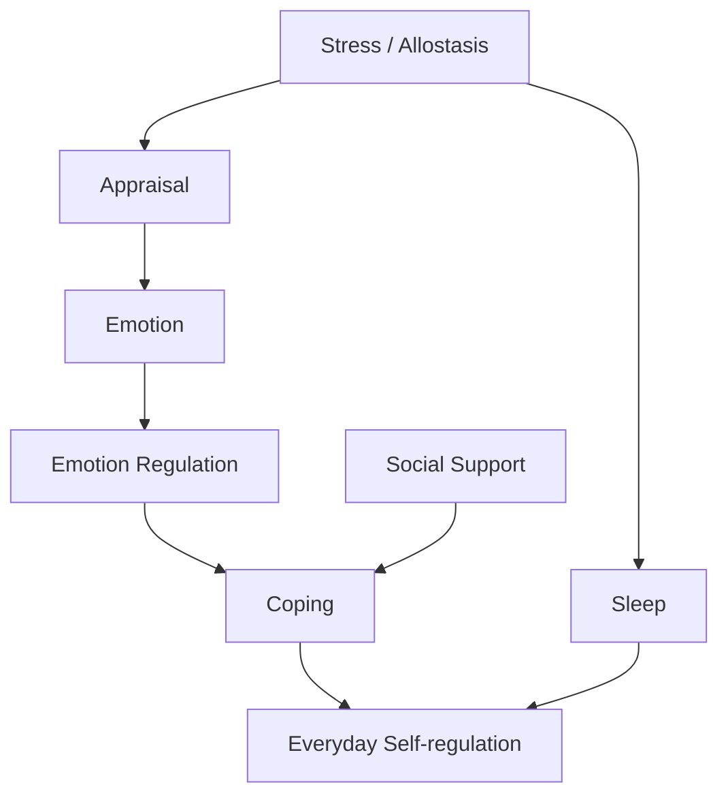
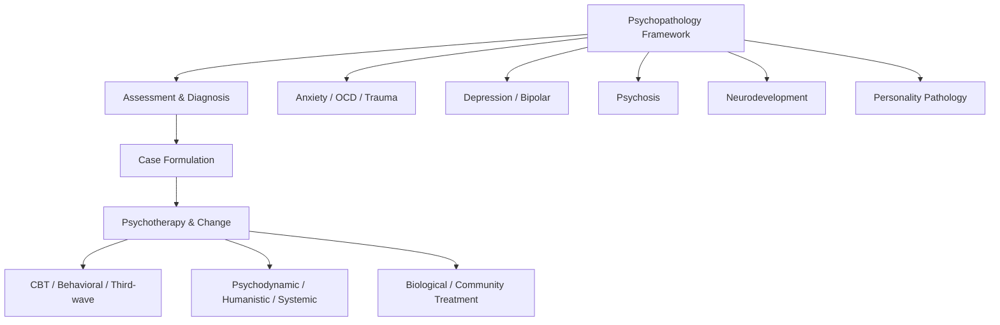
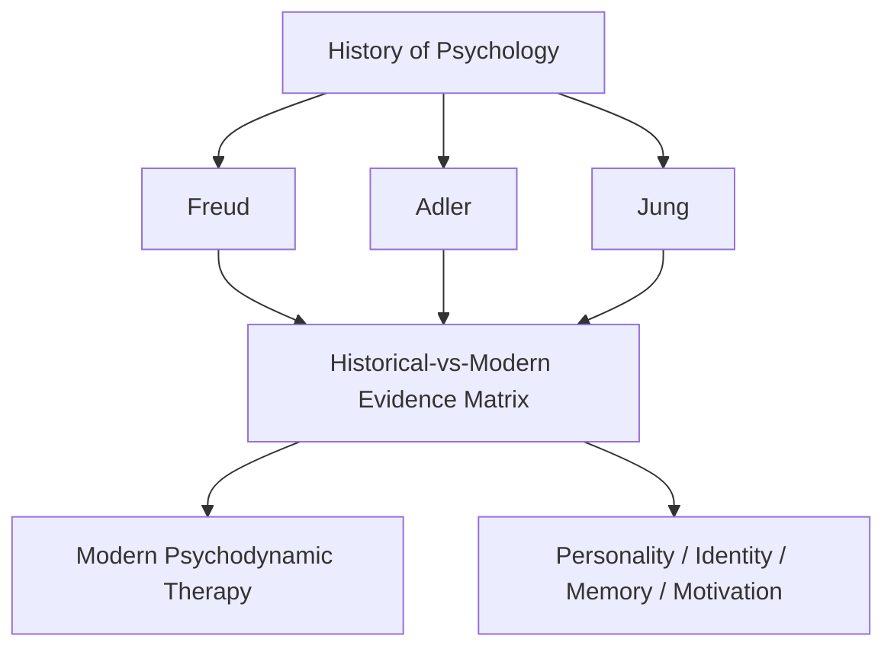
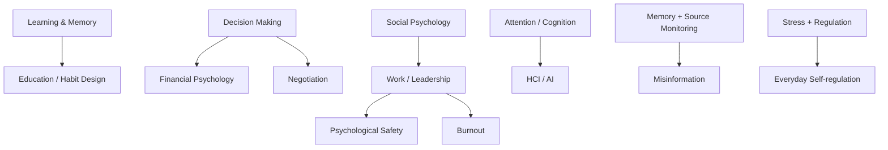

# Conceptual Dependencies — Psychology Knowledge Library

File này mô tả **dependency về khái niệm**, không phải thứ tự học cứng. Mục tiêu là tránh đọc một concept downstream mà bỏ qua assumptions ở upstream.

## 1. Trục khoa học nền



Ý nghĩa của graph này: trước khi kết luận một effect “real”, cần biết construct được đo ra sao, analysis dựa assumptions nào, causal question có hợp lệ không và result có đứng vững qua replication/synthesis không.

## 2. Brain & Mind



Neuroscience là một level of analysis, không phải “final explanation” cho mọi psychological construct.

## 3. Learning & Cognition



Important dependency:

```text
Learning performance hôm nay
        ≠
Durable learning ngày mai
```

Vì vậy applied education phải dựa vào memory/transfer evidence, không chỉ cảm giác học “trôi chảy”.

## 4. Development, self và social world



Attachment không nên dùng như internet personality label. Identity, culture và family context có bidirectional influence; không có một causal arrow duy nhất giải thích development.

## 5. Stress, emotion và regulation



Applied regulation content phải giữ boundary giữa:

- low-risk strategy;
- mechanism-based intervention;
- clinical treatment;
- self-help claim chưa có evidence.

## 6. Mental Health



Diagnosis là classification/inference tool, không phải identity sentence. Treatment evidence phải được tách khỏi theoretical truth của trường phái.

## 7. Historical Schools



Dependency bắt buộc:

```text
Historical influence
      ≠
Modern scientific validation
```

Freud, Adler và Jung phải được đọc qua [[EVIDENCE_STATUS_GUIDE]] và [[90_connections/06_historical_theories_and_modern_evidence_matrix]].

## 8. Applied Psychology



Ứng dụng chỉ nên mạnh bằng upstream evidence của nó. Một practical recommendation không được nâng status chỉ vì nghe hợp lý hoặc dễ nhớ.

## 9. Five-level evidence dependency

Khi đọc bất kỳ chapter nào, nên map claim vào một trong năm mức:

```text
Established evidence
Current theory
Hypothesis
Debated issue
Historical theory
```

Một chapter có thể chứa nhiều mức đồng thời. Status phải gắn vào **claim**, không gắn cứng vào toàn bộ topic.

## 10. Core navigation

- Scientific reasoning: [[00_foundations/00_psychology_as_science]] → [[00_foundations/02_research_methods]] → [[00_foundations/03_measurement_statistics]] → [[00_foundations/05_psychometrics_and_test_interpretation]] → [[00_foundations/09_replication_meta_analysis_and_bayesian_reasoning]].
- Brain/mind: [[01_brain_and_mind/00_nervous_system_and_brain]] → [[01_brain_and_mind/01_sensation_and_perception]] → [[01_brain_and_mind/07_attention_consciousness_and_awareness]] → [[01_brain_and_mind/09_consciousness_theories_and_evidence]].
- Learning/cognition: [[02_learning_and_cognition/00_learning_and_conditioning]] → [[02_learning_and_cognition/01_memory]] → [[02_learning_and_cognition/02_thinking_language_and_decision]] → [[02_learning_and_cognition/04_cognitive_biases_and_metacognition]].
- Historical context: [[00_foundations/01_history_and_major_perspectives]] → [[90_connections/05_adler_individual_psychology_in_context]] / [[90_connections/00_freud_jung_and_depth_psychology_in_context]] → [[90_connections/06_historical_theories_and_modern_evidence_matrix]].

## 11. Rule khi tạo chapter mới

Chỉ tạo chapter mới khi ít nhất một điều đúng:

1. concept có mechanism riêng đủ lớn;
2. chapter cũ đang chứa nhiều conceptual boundary;
3. topic cần evidence-status riêng để tránh overclaim;
4. topic là prerequisite của nhiều domain khác;
5. chapter riêng giúp giảm duplication thực sự.

Không tách file chỉ vì muốn tăng số lượng chapter.
