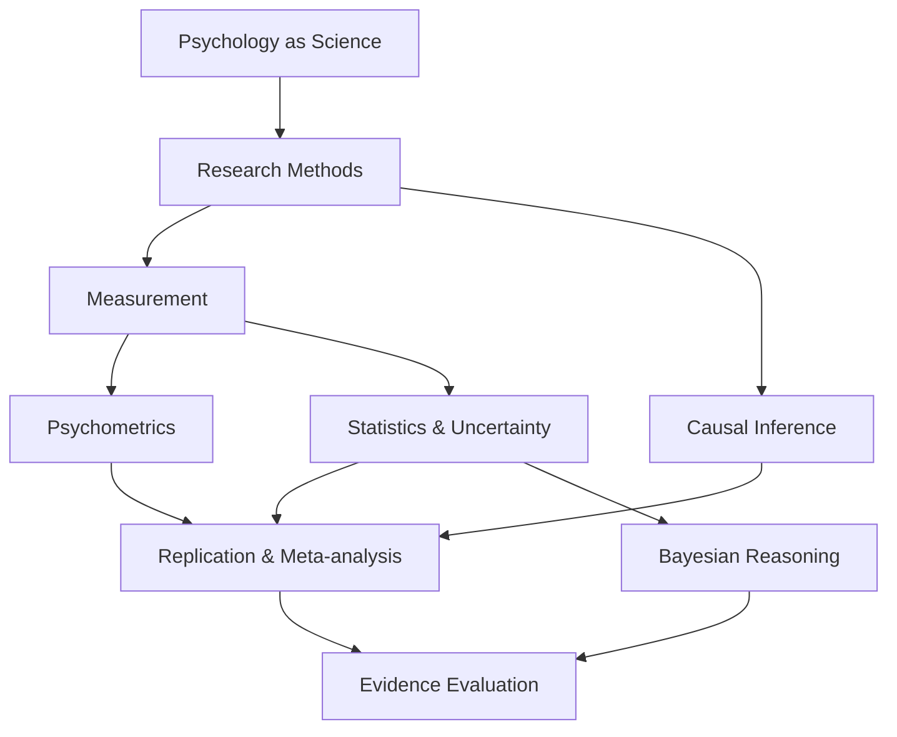
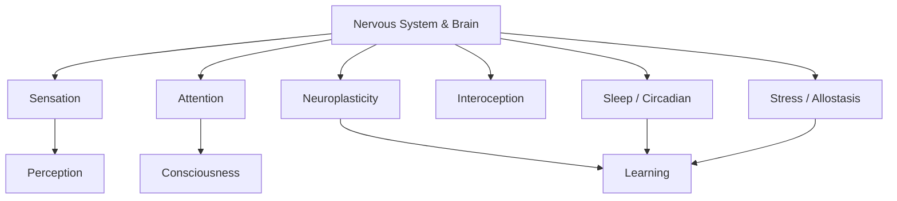
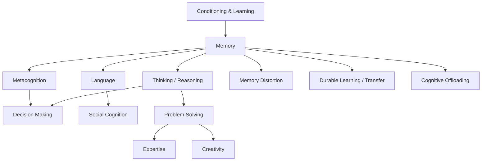
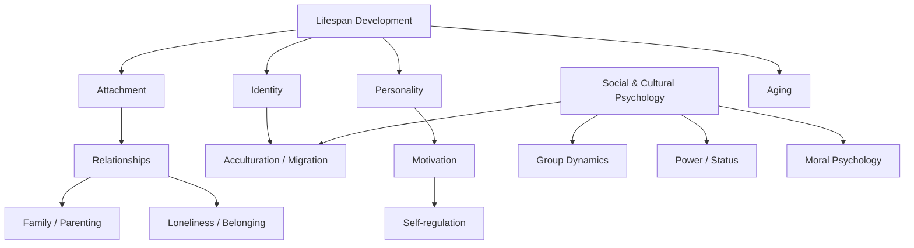
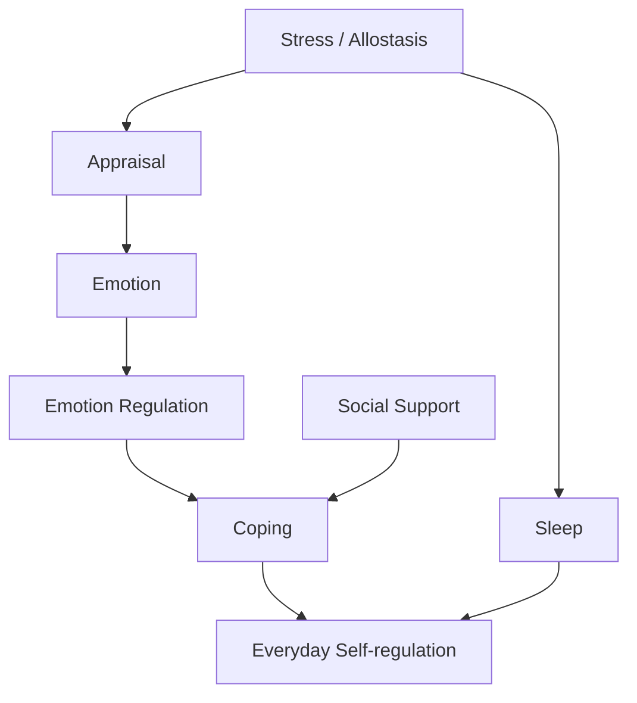
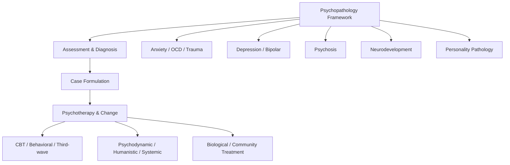
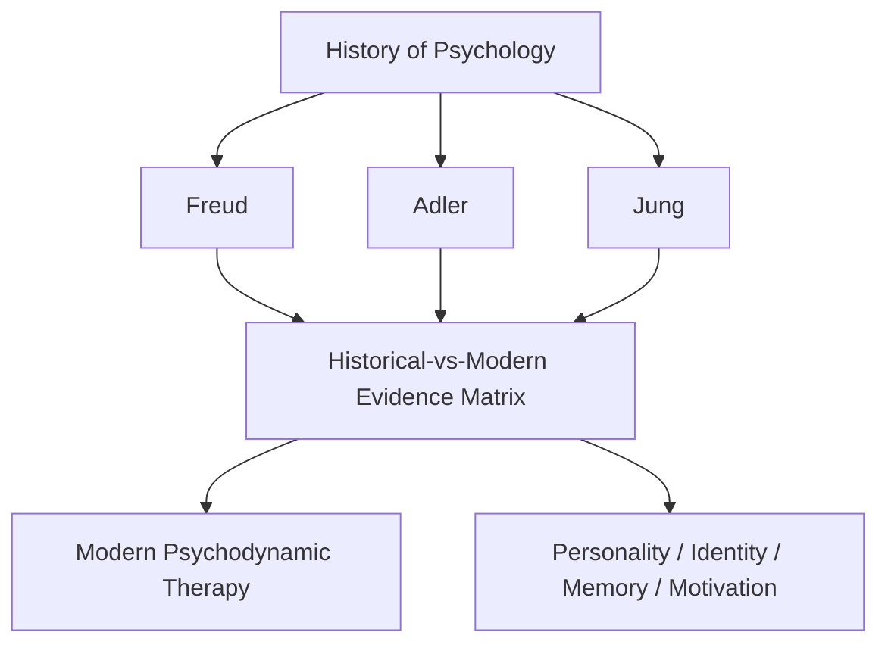
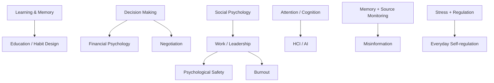

# Conceptual Dependencies — Psychology thư viện kiến thức (knowledge library / 지식 라이브러리)

> **Mạch đọc:** [README](./README.md) là owner của **Conceptual Dependencies — Psychology thư viện kiến thức (knowledge library / 지식 라이브러리)**; dùng file này như bản đồ prerequisite chứ không phải thứ tự học cứng. Từ **1. Trục khoa học nền** nối psychology as science, methods, measurement, brain/mind, cognition, development, intervention và cross-domain connections, rồi quay về dependency graph để chọn chapter owner và giới hạn suy luận.

Tệp (file / 파일) này mô tả **phụ thuộc (dependency / 의존성) về khái niệm**, không phải thứ tự học cứng. Mục tiêu là tránh đọc một concept downstream mà bỏ qua các giả định (assumptions / 가정들) ở upstream.

## 1. Trục khoa học nền

Trục này dựng nền từ psychology as science, measurement và inference. Hãy đọc nó trước để mọi domain sau đều có cùng cách phân biệt observation, mechanism, evidence và limitation.


```mermaid
graph TD
    A[Psychology as Science] --> B[Research Methods]
    B --> C[Measurement]
    C --> D[Psychometrics]
    C --> E[Statistics & Uncertainty]
    B --> F[Causal Inference]
    E --> G[Replication & Meta-analysis]
    E --> H[Bayesian Reasoning]
    D --> G
    F --> G
    G --> I[Evidence Evaluation]
    H --> I
```

Ý nghĩa của đồ thị (graph / 그래프) này: trước khi kết luận một tác động (effect / 효과) “real”, cần biết construct được đo ra sao, phân tích (analysis / 분석) dựa các giả định (assumptions / 가정들) nào, nhân quả (causal / 인과적) question có hợp lệ không và kết quả (result / 결과) có đứng vững qua replication/synthesis không.

> **Nối mạch:** Trong **Conceptual Dependencies — Psychology thư viện kiến thức (knowledge library / 지식 라이브러리)**, **2. Brain & Mind** nối từ **1. Trục khoa học nền** sang **3. học tập (learning / 학습) & Cognition**, vì cơ chế trước tạo đầu vào cho bước sau.

## 2. Brain & Mind

Nhóm Brain & Mind nối neural systems, perception, attention và consciousness. Mục tiêu là đi từ substrate tới trải nghiệm mà không rút gọn hiện tượng tâm lý thành một tín hiệu đơn lẻ.


```mermaid
graph TD
    A[Nervous System & Brain] --> B[Sensation]
    B --> C[Perception]
    A --> D[Attention]
    D --> E[Consciousness]
    A --> F[Sleep / Circadian]
    A --> G[Interoception]
    A --> H[Stress / Allostasis]
    A --> I[Neuroplasticity]
    I --> J[Learning]
    F --> J
    H --> J
```

Neuroscience là một mức (level / 수준) of phân tích (analysis / 분석), không phải “final explanation” cho mọi psychological construct.

> **Nối mạch:** Ở chặng này của **Conceptual Dependencies — Psychology thư viện kiến thức (knowledge library / 지식 라이브러리)**, **3. học tập (learning / 학습) & Cognition** nối từ **2. Brain & Mind** sang **4. Development, self và xã hội (social / 사회적) world**, vì cơ chế trước tạo đầu vào cho bước sau.

## 3. học tập (learning / 학습) & Cognition

Nhóm này giải thích cách hệ thống tiếp nhận, lưu, biến đổi và sử dụng thông tin. Các chapter nối memory, language, decision và expertise với điều kiện môi trường và giới hạn tài nguyên.


```mermaid
graph TD
    A[Conditioning & Learning] --> B[Memory]
    B --> C[Thinking / Reasoning]
    B --> D[Language]
    B --> E[Metacognition]
    C --> F[Decision Making]
    E --> F
    D --> G[Social Cognition]
    C --> H[Problem Solving]
    H --> I[Expertise]
    H --> J[Creativity]
    B --> K[Memory Distortion]
    B --> L[Durable Learning / Transfer]
    B --> M[Cognitive Offloading]
```

Important phụ thuộc (dependency / 의존성):

```text
Learning performance hôm nay
        ≠
Durable learning ngày mai
```

Vì vậy applied education phải dựa vào bộ nhớ (memory / 메모리)/transfer bằng chứng (evidence / 증거), không chỉ cảm giác học “trôi chảy”.

> **Nối mạch:** Đặt trong câu hỏi lớn của **Conceptual Dependencies — Psychology thư viện kiến thức (knowledge library / 지식 라이브러리)**, **4. Development, self và xã hội (social / 사회적) world** nối từ **3. học tập (learning / 학습) & Cognition** sang **5. Stress, emotion và regulation**, vì cơ chế trước tạo đầu vào cho bước sau.

## 4. Development, self và xã hội (social / 사회적) world

Trục phát triển đặt cá nhân trong thời gian, quan hệ và bối cảnh xã hội. Hãy theo dõi feedback giữa biology, learning, attachment, identity và institution thay vì xem development như một đường thẳng cố định.


```mermaid
graph TD
    A[Lifespan Development] --> B[Attachment]
    A --> C[Identity]
    A --> D[Personality]
    B --> E[Relationships]
    E --> F[Family / Parenting]
    C --> G[Acculturation / Migration]
    D --> H[Motivation]
    H --> I[Self-regulation]
    J[Social & Cultural Psychology] --> G
    J --> K[Group Dynamics]
    J --> L[Power / Status]
    J --> M[Moral Psychology]
    E --> N[Loneliness / Belonging]
    A --> O[Aging]
```

Attachment không nên dùng như internet personality label. định danh (identity / 식별자), culture và family ngữ cảnh (context / 맥락) có bidirectional influence; không có một nhân quả (causal / 인과적) arrow duy nhất giải thích development.

> **Nối mạch:** Trong **Conceptual Dependencies — Psychology thư viện kiến thức (knowledge library / 지식 라이브러리)**, **5. Stress, emotion và regulation** nối từ **4. Development, self và xã hội (social / 사회적) world** sang **6. Mental Health**, vì cơ chế trước tạo đầu vào cho bước sau.

## 5. Stress, emotion và regulation

Nhóm này nối threat, emotion, allostasis và coping với hành vi quan sát được. Câu hỏi trung tâm là khi nào một đáp ứng ngắn hạn trở thành pattern duy trì hoặc gây chi phí.


```mermaid
graph TD
    A[Stress / Allostasis] --> B[Appraisal]
    B --> C[Emotion]
    C --> D[Emotion Regulation]
    D --> E[Coping]
    E --> F[Everyday Self-regulation]
    A --> G[Sleep]
    G --> F
    H[Social Support] --> E
```

Applied regulation content phải giữ ranh giới (boundary / 경계) giữa:

- low-risk chiến lược (strategy / 전략);
- mechanism-based intervention;
- clinical treatment;
- self-help claim chưa có bằng chứng (evidence / 증거).

> **Nối mạch:** Ở chặng này của **Conceptual Dependencies — Psychology thư viện kiến thức (knowledge library / 지식 라이브러리)**, **6. Mental Health** nối từ **5. Stress, emotion và regulation** sang **7. Historical Schools**, vì cơ chế trước tạo đầu vào cho bước sau.

## 6. Mental Health

Mental health được đọc qua symptom, impairment, context, risk và protective factors. Phần này giữ ranh giới giữa mô tả lâm sàng, chẩn đoán và hỗ trợ đời sống.


```mermaid
graph TD
    A[Psychopathology Framework] --> B[Assessment & Diagnosis]
    B --> C[Case Formulation]
    C --> D[Psychotherapy & Change]
    D --> E[CBT / Behavioral / Third-wave]
    D --> F[Psychodynamic / Humanistic / Systemic]
    D --> G[Biological / Community Treatment]
    A --> H[Anxiety / OCD / Trauma]
    A --> I[Depression / Bipolar]
    A --> J[Psychosis]
    A --> K[Neurodevelopment]
    A --> L[Personality Pathology]
```

Diagnosis là classification/suy luận (inference / 추론) công cụ (tool / 도구), không phải định danh (identity / 식별자) sentence. Treatment bằng chứng (evidence / 증거) phải được tách khỏi theoretical truth của trường phái.

> **Nối mạch:** Đặt trong câu hỏi lớn của **Conceptual Dependencies — Psychology thư viện kiến thức (knowledge library / 지식 라이브러리)**, **7. Historical Schools** nối từ **6. Mental Health** sang **8. Applied Psychology**, vì cơ chế trước tạo đầu vào cho bước sau.

## 7. Historical Schools

Các trường phái lịch sử được đặt trong bối cảnh ra đời và giới hạn bằng chứng của chúng. Mục tiêu là học cách một theory tạo câu hỏi, đồng thời biết phần nào đã được thay thế hoặc kiểm tra lại.


```mermaid
graph TD
    A[History of Psychology] --> B[Freud]
    A --> C[Adler]
    A --> D[Jung]
    B --> E[Historical-vs-Modern Evidence Matrix]
    C --> E
    D --> E
    E --> F[Modern Psychodynamic Therapy]
    E --> G[Personality / Identity / Memory / Motivation]
```

Phụ thuộc (dependency / 의존성) bắt buộc:

```text
Historical influence
      ≠
Modern scientific validation
```

Freud, Adler và Jung phải được đọc qua [[EVIDENCE_STATUS_GUIDE]] và [[90_connections/06_historical_theories_and_modern_evidence_matrix]].

> **Nối mạch:** Trong **Conceptual Dependencies — Psychology thư viện kiến thức (knowledge library / 지식 라이브러리)**, **8. Applied Psychology** nối từ **7. Historical Schools** sang **9. Five-level bằng chứng (evidence / 증거) phụ thuộc (dependency / 의존성)**, vì cơ chế trước tạo đầu vào cho bước sau.

## 8. Applied Psychology

Ứng dụng chuyển mental model thành quyết định trong work, health, education, relationship và technology. Hãy kiểm tra external validity và trade-off trước khi biến một finding thành lời khuyên chung.


```mermaid
graph TD
    A[Learning & Memory] --> B[Education / Habit Design]
    C[Decision Making] --> D[Financial Psychology]
    C --> E[Negotiation]
    F[Social Psychology] --> G[Work / Leadership]
    G --> H[Psychological Safety]
    G --> I[Burnout]
    J[Attention / Cognition] --> K[HCI / AI]
    L[Memory + Source Monitoring] --> M[Misinformation]
    N[Stress + Regulation] --> O[Everyday Self-regulation]
```

Ứng dụng chỉ nên mạnh bằng upstream bằng chứng (evidence / 증거) của nó. Một practical recommendation không được nâng status chỉ vì nghe hợp lý hoặc dễ nhớ.

> **Nối mạch:** Ở chặng này của **Conceptual Dependencies — Psychology thư viện kiến thức (knowledge library / 지식 라이브러리)**, **8. Applied Psychology** đặt vấn đề; **9. Five-level bằng chứng (evidence / 증거) phụ thuộc (dependency / 의존성)** đối chiếu bằng chứng, rồi **11. quy tắc (rule / 규칙) khi tạo chapter mới** mở rộng hệ quả hoặc giới hạn liên quan.

## 9. Five-level bằng chứng (evidence / 증거) phụ thuộc (dependency / 의존성)

Khi đọc bất kỳ chapter nào, nên map claim vào một trong năm mức:

```text
Established evidence
Current theory
Hypothesis
Debated issue
Historical theory
```

Một chapter có thể chứa nhiều mức đồng thời. Status phải gắn vào **claim**, không gắn cứng vào toàn bộ topic.

Phần điều hướng này bàn giao dependency giữa các domain và chỉ ra các đường đọc thay thế. Chọn route theo câu hỏi hiện tại, rồi quay lại foundation khi một thuật ngữ hoặc bằng chứng chưa rõ.

- Scientific reasoning: [[00_foundations/00_psychology_as_science]] → [[00_foundations/02_research_methods]] → [[00_foundations/03_measurement_statistics]] → [[00_foundations/05_psychometrics_and_test_interpretation]] → [[00_foundations/09_replication_meta_analysis_and_bayesian_reasoning]].
- Brain/mind: [[01_brain_and_mind/00_nervous_system_and_brain]] → [[01_brain_and_mind/01_sensation_and_perception]] → [[01_brain_and_mind/07_attention_consciousness_and_awareness]] → [[01_brain_and_mind/09_consciousness_theories_and_evidence]].
- học tập (learning / 학습)/cognition: [[02_learning_and_cognition/00_learning_and_conditioning]] → [[02_learning_and_cognition/01_memory]] → [[02_learning_and_cognition/02_thinking_language_and_decision]] → [[02_learning_and_cognition/04_cognitive_biases_and_metacognition]].
- Historical ngữ cảnh (context / 맥락): [[00_foundations/01_history_and_major_perspectives]] → [[90_connections/05_adler_individual_psychology_in_context]] / [[90_connections/00_freud_jung_and_depth_psychology_in_context]] → [[90_connections/06_historical_theories_and_modern_evidence_matrix]].

> **Nối mạch:** Đặt trong câu hỏi lớn của **Conceptual Dependencies — Psychology thư viện kiến thức (knowledge library / 지식 라이브러리)**, **9. Five-level bằng chứng (evidence / 증거) phụ thuộc (dependency / 의존성)** đặt vấn đề; **11. quy tắc (rule / 규칙) khi tạo chapter mới** đối chiếu bằng chứng. Mục này khép mạch bằng cách nối kết quả với phạm vi của chapter.

## 11. quy tắc (rule / 규칙) khi tạo chapter mới

Chỉ tạo chapter mới khi ít nhất một điều đúng:

1. concept có cơ chế (mechanism / 메커니즘) riêng đủ lớn;
2. chapter cũ đang chứa nhiều conceptual ranh giới (boundary / 경계);
3. topic cần evidence-status riêng để tránh overclaim;
4. topic là prerequisite của nhiều lĩnh vực (domain / 도메인) khác;
5. chapter riêng giúp giảm duplication thực sự.

Không tách tệp (file / 파일) chỉ vì muốn tăng số lượng chapter.

> **Bàn giao:** Sau **11. quy tắc (rule / 규칙) khi tạo chapter mới**, hãy giữ lại kết luận và ranh giới của mục này; quay về [README](./README.md) khi cần định vị owner hoặc chọn nhánh học tiếp theo.
