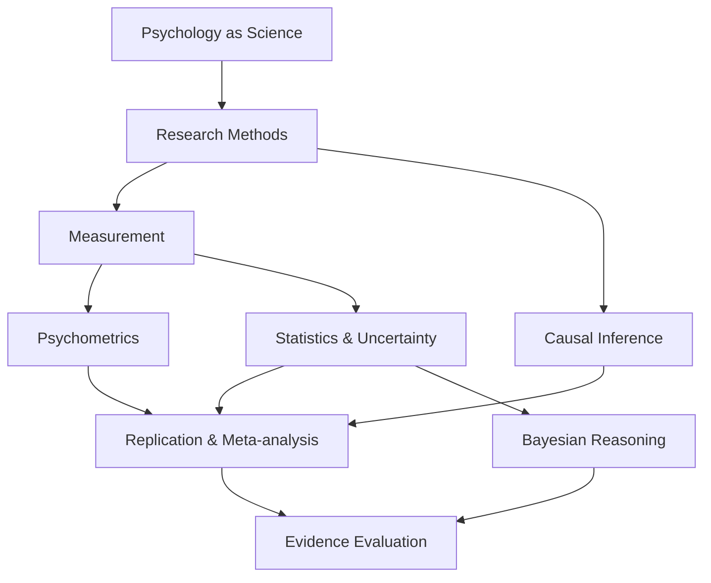
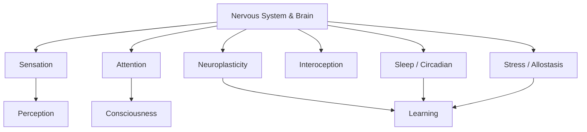
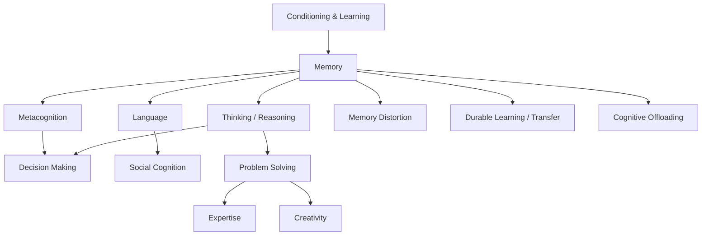
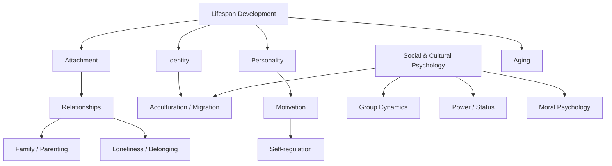
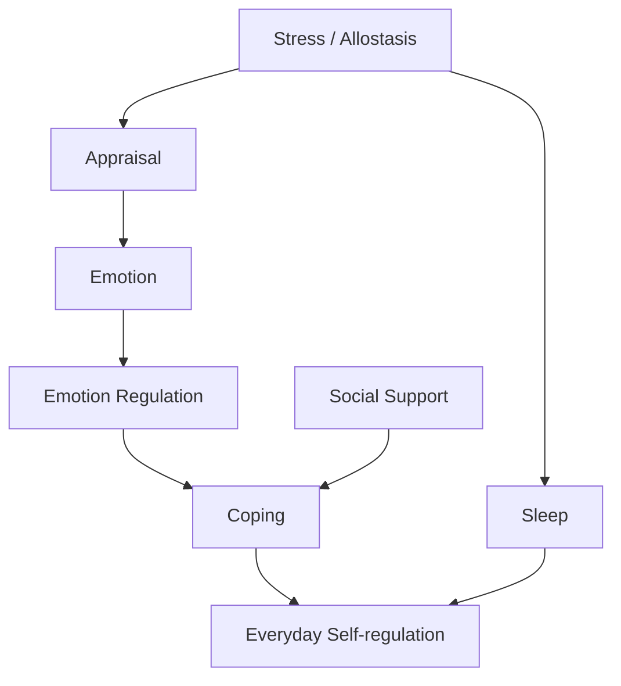
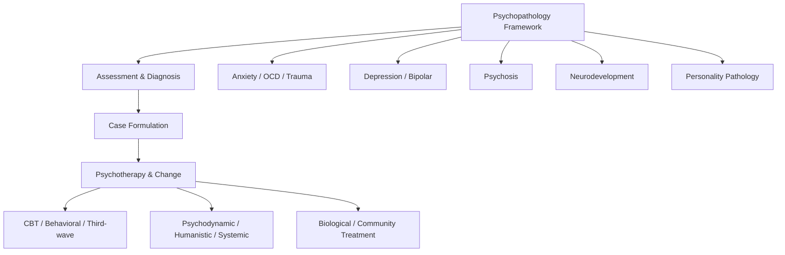
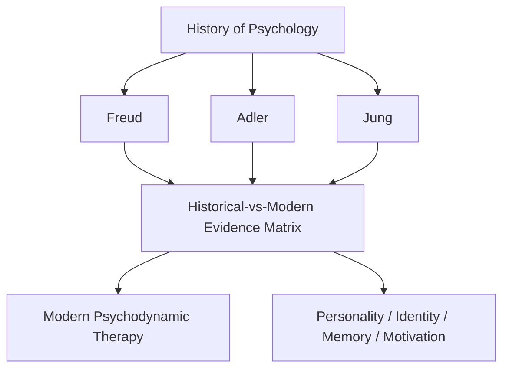
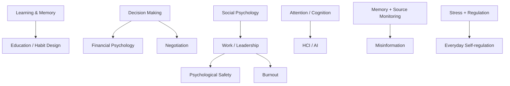

# Conceptual Dependencies — Psychology thư viện kiến thức (knowledge library / 지식 라이브러리)

> **Mạch đọc:** Đặt **Conceptual Dependencies — Psychology thư viện kiến thức (knowledge library / 지식 라이브러리)** trong bản đồ [README](./README.md) để thấy đơn vị sở hữu (owner / 오너) và vị trí của nó. Nội dung đi từ **1. Trục khoa học nền** sang **2. Brain & Mind**; điểm nối này chuẩn bị câu hỏi cho các mục sau thay vì dừng ở định nghĩa đầu tiên.


Tệp (file / 파일) này mô tả **phụ thuộc (dependency / 의존성) về khái niệm**, không phải thứ tự học cứng. Mục tiêu là tránh đọc một concept downstream mà bỏ qua các giả định (assumptions / 가정들) ở upstream.

## 1. Trục khoa học nền


```mermaid
graph TD
    A[Psychology as Science] --> B[Research Methods]
    B --> C[Measurement]
    C --> D[Psychometrics]
    C --> E[Statistics & Uncertainty]
    B --> F[Causal Inference]
    E --> G[Replication & Meta-analysis]
    E --> H[Bayesian Reasoning]
    D --> G
    F --> G
    G --> I[Evidence Evaluation]
    H --> I
```

Ý nghĩa của đồ thị (graph / 그래프) này: trước khi kết luận một tác động (effect / 효과) “real”, cần biết construct được đo ra sao, phân tích (analysis / 분석) dựa các giả định (assumptions / 가정들) nào, nhân quả (causal / 인과적) question có hợp lệ không và kết quả (result / 결과) có đứng vững qua replication/synthesis không.


> **Chuyển mạch:** Từ **1. Trục khoa học nền**, ta sang **2. Brain & Mind** để mở rộng cùng câu hỏi và dùng kết quả đó để khép lại mạch giải thích.

## 2. Brain & Mind


```mermaid
graph TD
    A[Nervous System & Brain] --> B[Sensation]
    B --> C[Perception]
    A --> D[Attention]
    D --> E[Consciousness]
    A --> F[Sleep / Circadian]
    A --> G[Interoception]
    A --> H[Stress / Allostasis]
    A --> I[Neuroplasticity]
    I --> J[Learning]
    F --> J
    H --> J
```

Neuroscience là một mức (level / 수준) of phân tích (analysis / 분석), không phải “final explanation” cho mọi psychological construct.


> **Chuyển mạch:** Từ **2. Brain & Mind**, ta sang **3. học tập (learning / 학습) & Cognition** để mở rộng cùng câu hỏi và dùng kết quả đó để khép lại mạch giải thích.

## 3. học tập (learning / 학습) & Cognition


```mermaid
graph TD
    A[Conditioning & Learning] --> B[Memory]
    B --> C[Thinking / Reasoning]
    B --> D[Language]
    B --> E[Metacognition]
    C --> F[Decision Making]
    E --> F
    D --> G[Social Cognition]
    C --> H[Problem Solving]
    H --> I[Expertise]
    H --> J[Creativity]
    B --> K[Memory Distortion]
    B --> L[Durable Learning / Transfer]
    B --> M[Cognitive Offloading]
```

Important phụ thuộc (dependency / 의존성):

```text
Learning performance hôm nay
        ≠
Durable learning ngày mai
```

Vì vậy applied education phải dựa vào bộ nhớ (memory / 메모리)/transfer bằng chứng (evidence / 증거), không chỉ cảm giác học “trôi chảy”.


> **Chuyển mạch:** Từ **3. học tập (learning / 학습) & Cognition**, ta sang **4. Development, self và xã hội (social / 사회적) world** để mở rộng cùng câu hỏi và dùng kết quả đó để khép lại mạch giải thích.

## 4. Development, self và xã hội (social / 사회적) world


```mermaid
graph TD
    A[Lifespan Development] --> B[Attachment]
    A --> C[Identity]
    A --> D[Personality]
    B --> E[Relationships]
    E --> F[Family / Parenting]
    C --> G[Acculturation / Migration]
    D --> H[Motivation]
    H --> I[Self-regulation]
    J[Social & Cultural Psychology] --> G
    J --> K[Group Dynamics]
    J --> L[Power / Status]
    J --> M[Moral Psychology]
    E --> N[Loneliness / Belonging]
    A --> O[Aging]
```

Attachment không nên dùng như internet personality label. định danh (identity / 식별자), culture và family ngữ cảnh (context / 맥락) có bidirectional influence; không có một nhân quả (causal / 인과적) arrow duy nhất giải thích development.


> **Chuyển mạch:** Từ **4. Development, self và xã hội (social / 사회적) world**, ta sang **5. Stress, emotion và regulation** để mở rộng cùng câu hỏi và dùng kết quả đó để khép lại mạch giải thích.

## 5. Stress, emotion và regulation


```mermaid
graph TD
    A[Stress / Allostasis] --> B[Appraisal]
    B --> C[Emotion]
    C --> D[Emotion Regulation]
    D --> E[Coping]
    E --> F[Everyday Self-regulation]
    A --> G[Sleep]
    G --> F
    H[Social Support] --> E
```

Applied regulation content phải giữ ranh giới (boundary / 경계) giữa:

- low-risk chiến lược (strategy / 전략);
- mechanism-based intervention;
- clinical treatment;
- self-help claim chưa có bằng chứng (evidence / 증거).


> **Chuyển mạch:** Từ **5. Stress, emotion và regulation**, ta sang **6. Mental Health** để mở rộng cùng câu hỏi và dùng kết quả đó để khép lại mạch giải thích.

## 6. Mental Health


```mermaid
graph TD
    A[Psychopathology Framework] --> B[Assessment & Diagnosis]
    B --> C[Case Formulation]
    C --> D[Psychotherapy & Change]
    D --> E[CBT / Behavioral / Third-wave]
    D --> F[Psychodynamic / Humanistic / Systemic]
    D --> G[Biological / Community Treatment]
    A --> H[Anxiety / OCD / Trauma]
    A --> I[Depression / Bipolar]
    A --> J[Psychosis]
    A --> K[Neurodevelopment]
    A --> L[Personality Pathology]
```

Diagnosis là classification/suy luận (inference / 추론) công cụ (tool / 도구), không phải định danh (identity / 식별자) sentence. Treatment bằng chứng (evidence / 증거) phải được tách khỏi theoretical truth của trường phái.


> **Chuyển mạch:** Từ **6. Mental Health**, ta sang **7. Historical Schools** để mở rộng cùng câu hỏi và dùng kết quả đó để khép lại mạch giải thích.

## 7. Historical Schools


```mermaid
graph TD
    A[History of Psychology] --> B[Freud]
    A --> C[Adler]
    A --> D[Jung]
    B --> E[Historical-vs-Modern Evidence Matrix]
    C --> E
    D --> E
    E --> F[Modern Psychodynamic Therapy]
    E --> G[Personality / Identity / Memory / Motivation]
```

Phụ thuộc (dependency / 의존성) bắt buộc:

```text
Historical influence
      ≠
Modern scientific validation
```

Freud, Adler và Jung phải được đọc qua [[EVIDENCE_STATUS_GUIDE]] và [[90_connections/06_historical_theories_and_modern_evidence_matrix]].


> **Chuyển mạch:** Từ **7. Historical Schools**, ta sang **8. Applied Psychology** để mở rộng cùng câu hỏi và dùng kết quả đó để khép lại mạch giải thích.

## 8. Applied Psychology


```mermaid
graph TD
    A[Learning & Memory] --> B[Education / Habit Design]
    C[Decision Making] --> D[Financial Psychology]
    C --> E[Negotiation]
    F[Social Psychology] --> G[Work / Leadership]
    G --> H[Psychological Safety]
    G --> I[Burnout]
    J[Attention / Cognition] --> K[HCI / AI]
    L[Memory + Source Monitoring] --> M[Misinformation]
    N[Stress + Regulation] --> O[Everyday Self-regulation]
```

Ứng dụng chỉ nên mạnh bằng upstream bằng chứng (evidence / 증거) của nó. Một practical recommendation không được nâng status chỉ vì nghe hợp lý hoặc dễ nhớ.


> **Chuyển mạch:** Từ **8. Applied Psychology**, ta sang **9. Five-level bằng chứng (evidence / 증거) phụ thuộc (dependency / 의존성)** để mở rộng cùng câu hỏi và dùng kết quả đó để khép lại mạch giải thích.

## 9. Five-level bằng chứng (evidence / 증거) phụ thuộc (dependency / 의존성)

Khi đọc bất kỳ chapter nào, nên map claim vào một trong năm mức:

```text
Established evidence
Current theory
Hypothesis
Debated issue
Historical theory
```

Một chapter có thể chứa nhiều mức đồng thời. Status phải gắn vào **claim**, không gắn cứng vào toàn bộ topic.


> **Chuyển mạch:** Từ **9. Five-level bằng chứng (evidence / 증거) phụ thuộc (dependency / 의존성)**, ta sang **10. cốt lõi (core / 핵심) điều hướng (navigation / 내비게이션)** để mở rộng cùng câu hỏi và dùng kết quả đó để khép lại mạch giải thích.

## 10. cốt lõi (core / 핵심) điều hướng (navigation / 내비게이션)

- Scientific lập luận (reasoning / 추론): [[00_foundations/00_psychology_as_science]] → [[00_foundations/02_research_methods]] → [[00_foundations/03_measurement_statistics]] → [[00_foundations/05_psychometrics_and_test_interpretation]] → [[00_foundations/09_replication_meta_analysis_and_bayesian_reasoning]].
- Brain/mind: [[01_brain_and_mind/00_nervous_system_and_brain]] → [[01_brain_and_mind/01_sensation_and_perception]] → [[01_brain_and_mind/07_attention_consciousness_and_awareness]] → [[01_brain_and_mind/09_consciousness_theories_and_evidence]].
- học tập (learning / 학습)/cognition: [[02_learning_and_cognition/00_learning_and_conditioning]] → [[02_learning_and_cognition/01_memory]] → [[02_learning_and_cognition/02_thinking_language_and_decision]] → [[02_learning_and_cognition/04_cognitive_biases_and_metacognition]].
- Historical ngữ cảnh (context / 맥락): [[00_foundations/01_history_and_major_perspectives]] → [[90_connections/05_adler_individual_psychology_in_context]] / [[90_connections/00_freud_jung_and_depth_psychology_in_context]] → [[90_connections/06_historical_theories_and_modern_evidence_matrix]].


> **Chuyển mạch:** Từ **10. cốt lõi (core / 핵심) điều hướng (navigation / 내비게이션)**, ta sang **11. quy tắc (rule / 규칙) khi tạo chapter mới** để mở rộng cùng câu hỏi và dùng kết quả đó để khép lại mạch giải thích.

## 11. quy tắc (rule / 규칙) khi tạo chapter mới

Chỉ tạo chapter mới khi ít nhất một điều đúng:

1. concept có cơ chế (mechanism / 메커니즘) riêng đủ lớn;
2. chapter cũ đang chứa nhiều conceptual ranh giới (boundary / 경계);
3. topic cần evidence-status riêng để tránh overclaim;
4. topic là prerequisite của nhiều lĩnh vực (domain / 도메인) khác;
5. chapter riêng giúp giảm duplication thực sự.

Không tách tệp (file / 파일) chỉ vì muốn tăng số lượng chapter.

> **Bàn giao:** Sau **11. quy tắc (rule / 규칙) khi tạo chapter mới**, hãy chốt bất biến (invariant / 불변식) và giới hạn của mục này trước khi nối sang kiến thức kế tiếp. Có thể đọc tiếp [COVERAGE AUDIT](./COVERAGE_AUDIT.md) để đối chiếu ranh giới (boundary / 경계) gần nhất.
