작성: [bruders.tistory](https://bruders.tistory)

# 2024 SQLD 개정판 개념 정리

※ 주로 유튜브 '국민대학교 김남규 교수' 강의와 '홍샘의 데이터랩' 강의를 듣고 정리한 내용입니다.

※ 그 외 다른 요약본이나 SQL 전문가 가이드도 참고하였습니다.

※ 수정해야 할 부분이 있다면 [블로그](#)에 덧글로 알려주시면 감사하겠습니다.

※ 시험 후기나 추천 자료 등과 관련된 내용은 아래 글을 확인해주세요.

■ 2024년 개정 SQLD 시험 합격 후기

## [출제 범위]

| 변경 전        |                  |
|-------------|------------------|
| 주요항목        | 세부항목             |
| 데이터 모델링의 이해 | 데이터모델의 이해        |
|             | 엔터티              |
|             | 속성               |
|             | 관계               |
|             | 식별자              |
| 데이터 모델과 성능  | 정규화와 성능          |
|             | 반정규화와 성능         |
|             | 대응량 데이터에 따른 성능   |
|             | DB 구조와 성능        |
|             | 분산 DB 데이터에 따른 성능 |

| 변경 후        |                   |
|-------------|-------------------|
| 주요항목        | 세부항목              |
| 데이터 모델링의 이해 | 데이터모델의 이해         |
|             | 엔터티               |
|             | 속성                |
|             | 관계                |
|             | 식별자               |
| 데이터 모델과 성능  | 정규화               |
|             | 관계와 조인의 이해        |
|             | 모델이 표현하는 트랜잭션의 이해 |
|             | NULL 속성의 이해       |
|             | 본질식별자 vs 인조식별자    |

| 변경 전          |                    |
|---------------|--------------------|
| 주요항목          | 세부항목               |
| SQL 기본        | 관계형 데이터베이스 개요      |
|               | DDL                |
|               | DML                |
|               | TCL                |
|               | WHERE 절            |
|               | FUNCTION           |
|               | GROUP BY, HAVING 절 |
| SQL 활용        | ORDER BY 절         |
|               | 조인                 |
|               | 표준 조인              |
|               | 집합 연산자             |
|               | 계층형 질의             |
|               | 서브 쿼리              |
|               | 그룹 함수              |
| SQL 최적화 기본 원리 | 원도우 함수             |
|               | DCL                |
|               | 절차형 SQL            |
|               | 옵티마이저와 실행계획        |
| SQL 최적화 기본 원리 | 인덱스 기본             |
|               | 조인 수행 원리           |

| 변경 후   |                    |
|--------|--------------------|
| 주요항목   | 세부항목               |
| SQL 기본 | 관계형 데이터베이스 개요      |
|        | SELECT 문           |
|        | 함수                 |
|        | WHERE 절            |
|        | GROUP BY, HAVING 절 |
|        | ORDER BY 절         |
|        | 조인                 |
| 표준 조인  |                    |
| SQL 활용 | 서브 쿼리              |
|        | 집합 연산자             |
|        | 그룹 함수              |
|        | 원도우 함수             |
|        | TOP N 쿼리           |
|        | 계층형 질의와 셀프 조인      |
|        | PIVOT 절과 UNPIVOT 절 |
| 관리 구문  | 정규 표현식             |
|        | DML                |
|        | TCL                |
|        | DDL                |
| 관리 구문  | DCL                |

## I. 데이터 모델링의 이해(1)

### 1장. 데이터 모델링의 이해

#### 제 1절 데이터 모델링의 이해

##### 1. 모델링

- - 복잡한 현실세계를 추상화·단순화하여 일정한 표기법(형식)에 의해 명확히 표현하는 것
- - 데이터베이스를 구축하기 위한 분석·설계의 과정
- - 정보시스템을 구축하기 위한 데이터 관점의 업무 분석 기법

##### 2. 모델링 특징 (구체화, 복잡화, 일반화 X)

- - 추상화(모형화): 현실세계를 일정한 형식에 맞춰 간략히 표현
- - 단순화: 약속된 규약으로 제한된 표기법이나 언어로 표현
- - 명확화(정확화): 애매모함(불분명함)을 제거하고 정확하게 현상을 기술 목|분석된 모델로 실제 DB를 생성하여 개발 및 데이터 관리에 사용 적|업무정보를 구성하는 기초 정보들을 일정한 표기법으로 표현하여 정보시스템 구축의 대상이 되는 업무 내용을 정확하게 분석하는 것

##### 3. 모델링의 관점

- - 데이터 관점 (What) ‘무엇이 필요한지에만 관심’: 업무와 데이터의 관계, 데이터와 데이터의 관계를 모델링, 프로세스에서 사용하는 데이터를 모델링
- - 프로세스 관점 (How) ‘어떤 절차/순서로 이루어지는지에 관심’: 업무가 실제 하고 있는 일, 해야 하는 일을 모델링
- - 데이터와 프로세스의 상관관점 (Interaction): 업무 처리 방법에 따라 데이터가 받는 영향을 모델링

##### 4. 데이터 모델링의 중요성과 유의점

1. 1) 중요성: 파급효과, 간결한 표현, 데이터 품질 유지
2. 2) 유의점:
   1. ① 중복: 여러 장소의 DB에 같은 정보를 저장하지 않도록 설계해야 함.
   2. ② 비유연성: 데이터의 정의를 데이터의 사용 프로세스와 분리해야 함, 사소한 업무변화에 데이터 모델이 수시로 변경되면 안됨.
   3. ③ 비일관성: 데이터 간 상호 연관 관계가 명확히 정의되어야 함.

##### 5. 데이터 모델링의 3단계

- - 개념적 모델링: 업무중심적, 포괄적인 수준의 모델링,  
  **추상화 수준이 가장 높음**,  
  업무 분석 후 업무의 핵심 Entity를 추출, ERD 도출, 전사적으로 수행
- - 논리적 모델링: 테이블 도출, (**key, 속성, 관계**)를 표현, 정규화 적용 → 데이터의 일관성 유지
- - 물리적 모델링: DBMS의 특성과 맞게 데이터 인덱스, 저장 방식 등 물리적인 성격 고려

##### 6. 데이터의 독립성

- - 데이터의 구조에 변화가 생겨도 응용 프로그램이 변경될 필요 X
- - 특정 스키마를 변경해도 상위 수준의 스키마 정의에 영향 X
- ⇒ 논리적 독립성과 물리적 독립성의 보장으로 실현됨

##### Q. 데이터의 독립성이 유지되지 않는다면?

- • 데이터의 중복성 및 복잡도 증가
- • 요구사항 대응 난이도 증가 → 데이터 유지보수 비용 증가

## 7. 데이터베이스 스키마(Schema)

### STUDENT

| Name | Student_no | Class | Major |
|------|------------|-------|-------|
|------|------------|-------|-------|

- - 데이터 모델링의 대상
- - 데이터베이스 구조, 데이터 타입, 제약조건에 대한 명세
- - 데이터베이스 설계 단계에서 명시되며 자주 변경되지 않음

## 8. 데이터베이스 3단계 구조 ★★

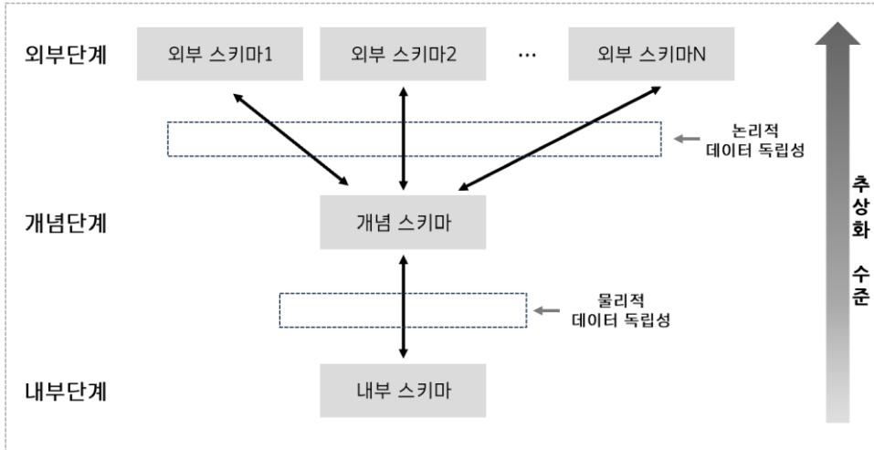

- - 외부 스키마: **사용자 개개인의 관점, View(여러 사용자 관점)**,  
  DB 이용자의 관점으로 구성된 개인적 DB 스키마
- - 개념 스키마: 모든 사용자 관점을 **통합, 조직 전체** 관점의 통합,  
  DB에 저장되는 데이터와 그들 간의 관계, 설계자 관점
- - 내부 스키마: DB가 물리적으로 저장된 형식, 개발자 관점,  
  데이터가 어떻게 저장되는가, 저장 장치 관점

⇒ 데이터 모델링은 통합 관점의 개념 스키마를 만들어 가는 과정

## 9. 사상(Mapping)

- - 상호 독립적인 개념을 연결시켜주는 다리

- ▶ 논리적 독립성: 외부 스키마와 개념 스키마의 맵핑을 통해 보장
- - 개념 스키마가 변경되어도 외부 스키마에 영향 X
- - 논리적 구조가 변경되어도 응용 프로그램에 영향 X
- ▶ 물리적 독립성: 개념 스키마와 내부 스키마의 맵핑을 통해 보장
- - 내부 스키마가 변경되어도 외부/개념 스키마에 영향 X
- - 저장장치의 구조변경은 응용 프로그램과 개념 스키마에 영향 X
- - 물리 스키마가 변경되어도 논리 스키마에 영향 X

## 10. 데이터 모델링의 3가지 구성 요소

- - Entity: 업무와 관련된 어떤 것(Things)  
  ex) 학생, 과목
- - Attribute: 어떤 것이 갖는 성격  
  ex) 이름, 학점, 과목명
- - Relationship: 어떤 것 간의 관계  
  ex) 수강하다

- ▶ 데이터베이스 인스턴스(Instance):
- - 특정 시점에 DB에 실제로 저장되어 있는 데이터의 값

| 개념   | 복수/집합개념<br>타입/클래스 | 개별/단수개념<br>어커런스/인스턴스 |
|------|-------------------|----------------------|
| 어떤 것 | 엔터티 타입            | 엔터티                  |
|      | 엔터티               | 인스턴스/어커런스            |
| 연관   | 관계                | 페어링                  |
| 성격   | 속성                | 속성값                  |

## 11. 좋은 데이터 모델의 요소

- - 완전성: 업무에서 필요로 하는 모든 데이터가 모델에 정의되어야 함
- - 중복배제: 하나의 DB 내에 동일한 사실은 1번만 기록되어야 함

ex) 고객 테이블과 주문 테이블에 '주소'라는 동일한 속성이 들어감

※ FK는 필수불가결한 경우다.

- - 업무규칙: 업무 규칙이 데이터 모델에 표현되어야 하고,

모든 사용자가 공유할 수 있도록 제공되어야 함

- - 데이터 재사용: 데이터의 통합성과 독립성에 대해 고려해야 함,

회사 전체 관점에서 공통 데이터를 도출하고,

이를 전 영역에서 사용할 수 있도록 설계해야 함

■ 파일시스템처럼 부서별로, 응용 프로그램별로 데이터를 따로 만들지 말라는 것

- - 의사소통: 업무규칙은 엔터티, 서브타입, 속성, 관계 등의 형태로

최대한 자세히 표현해야 함,

이를 관련자들이 동일한 의미로 받아들여 활용할 수 있어야

- - 통합성: 동일한 데이터는 조직의 전체에서 1번만 정의되고,

이를 다른 영역에서 참조, 활용해야 함

## 12. 데이터 모델링의 이해관계자

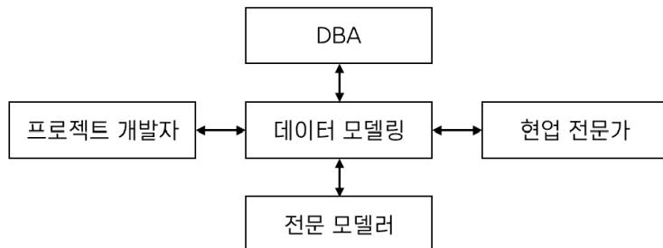

- - 프로젝트에 참여하는 모두가 데이터 모델링을 알아야 한다.

- - 프로젝트 개발자와 전문 모델러는 작성까지 할 수 있어야 한다.

※ 데이터 모델은 대상으로 하는 업무를 데이터 관점에서 분석하고 이를 설계하여 나오는 최종 산출물이다.

## 12. ERD(Entity Relationship Diagram)

- - 업무분석에서 도출된 엔터티와 엔터티간의 관계를 이해하기 쉽게 도식

화한 다이어그램

- - 데이터 흐름과 프로세스와의 연관성을 이야기하는 표기법이자 산출물.

※ 1976년 피터 첸(Peter Chen)이 Entity-Relationship Model(E-R model)이라는 표기법을 만들었다.

## 13. ERD 작성 순서

(1) 엔터티를 그린다.

(2) 엔터티를 적절하게 배치한다.

- - 선이 꼬이지 않게, 가장 중요한 엔터티는 왼쪽 상단에 배치

(3) 엔터티 간 관계를 설정한다.

- - 식별자 관계를 우선 설정한다.

(식별자 관계: 부모로부터 상속받은 FK가 자식의 PK의 일부가 되는 관계)

- - 가급적 Cycle 관계(순환 관계)가 발생하지 않도록 한다.

(4) 관계명을 기술한다.

- - 현재형 사용, 지나치게 포괄적인 단어는 지양

ex) 주문한다, 철회한다, 수강하다

(5) 관계의 참여도를 기술한다. + 관계차수(Cardinality)를 기술한다.

- - 관계 차수: 1...N(Chen), 까마귀발로 표시(IE)

(6) 관계의 필수/선택 여부를 기술한다.

- - 필수여부는 원을 이용하여 표시(IE)

## 14. ERD 표기법

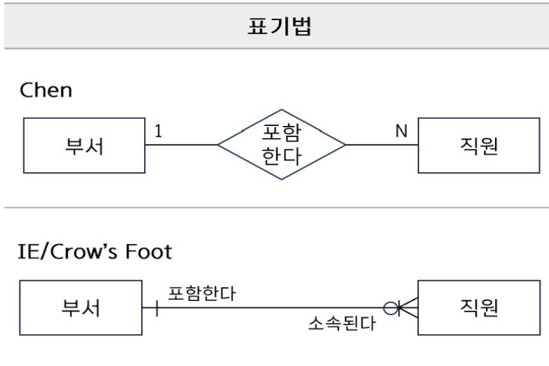

## 제 2절 엔터티

### 1. 엔터티란?

- - 업무에 필요하고 유용한 정보를 저장하고 관리하기 위한 집합
- - 엔터티 = 인스턴스의 집합

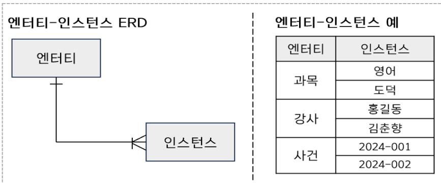

## 2. 엔터티 유형

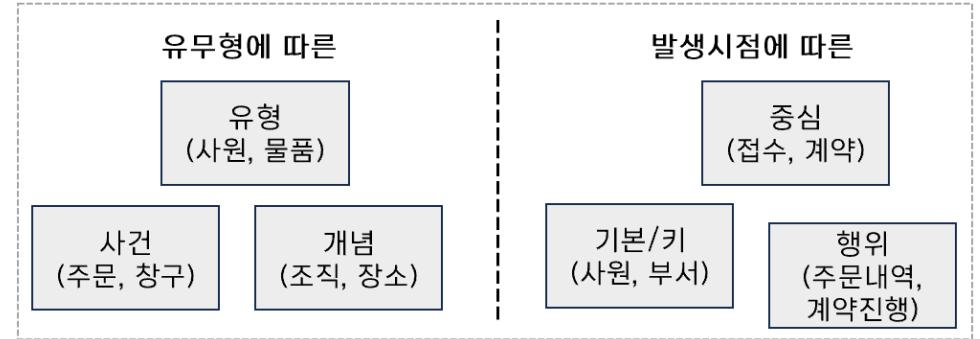

### ❖ 유형, 무형에 따른 분류

- ① 유형(Tangible) 엔터티
  - - 물리적인 형태가 있고 안정적이며 지속적 활용
  - ex) 교수, 강의실, 물품, 사원
- ② 개념(Conceptual) 엔터티
  - - 물리적인 형태는 존재하지 않으나 관리해야 할 개념적 정보
  - ex) 수업, 보험상품, 시스템, 조직
- ③ 사건(Event) 엔터티
  - - 업무 수행 과정에서 발생, 비교적 발생량이 많음(각종 통계 자료에 이용)
  - ex) 수강신청, 주문, 입금, 미납
  - ▪ 주로 relationship으로 할까 entity로 할까 고민하는 것들이 해당
  - ▪ 혼자 존재할 수 없는 엔터티, 즉 다른 엔터티에 의존해 있음
  - (수강신청은 학생과 수업이 있어야 함)

### ❖ 발생시점에 따른 분류

- ① 기본(Key) 엔터티
  - - 업무에 본래 존재하는 정보, 독립적으로 생성되는 엔터티
  - - 타 엔터티의 부모 역할, 자신의 고유 주식별자 가짐
  - ex) 사원, 부서, 고객, 상품, 자재

② 중심(Main) 엔터티

- - 기본 엔터티로부터 발생, 기본 엔터티와 행위 엔터티 중간에 존재
- - 다른 엔터티와의 관계를 통해 많은 행위 엔터티 생성

ex) 계약, 주문, 청구, 사고, 매출

③ 행위(Active) 엔터티

- - 2개 이상의 부모 엔터티로부터 발생
- - 업무처리를 하는 동안 발생되는 엔터티
- - 자주 변경되고 지속적으로 정보가 추가되어 데이터양이 많음

ex) 주문 목록, 사원 변경 이력

3. 엔터티의 특징

1) 반드시 해당 업무에서 필요하고 관리하고자 하는 정보다.

2) 유일한 식별자에 의해 식별이 가능하다.

ex) 학생의 학번, 강사의 사번, 사건의 사건번호

3) 영속적으로 존재하는 인스턴스의 집합이다.

(= 2개 이상의 인스턴스를 포함한다.)

4) 업무 프로세스에 이용된다.

- - 업무 프로세스에 의해 CRUD가 발생하는 엔터티이어야 한다.
- - CRUD가 발생 X라면 → 부적절한 엔터티 도출 또는 업무 누락임
- 5) 반드시 속성을 가진다.

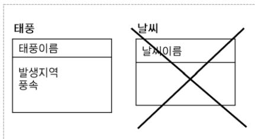

- - 주식별자만 존재하고 일반속성이 없는 엔터티는 바람직하지 않음
- ■ 단 연관 엔터티는 주식별자 속성만 갖고 있어도 인정

6) 다른 엔터티와 최소 1개 이상의 관계가 있다.

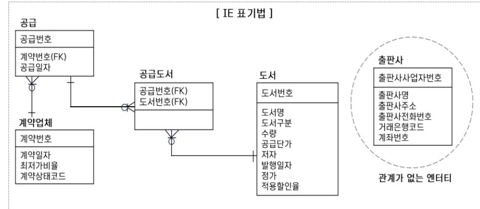

- - 예외적으로 관계를 생략하는 경우도 있다.

→ 통계성 엔터티, 코드성 엔터티

→ 시스템 처리 시 내부 필요에 의한 엔터티(트랜잭션 로그 테이블 등)

- 관계가 없는 엔터티를 ‘고립 엔터티’ 라고 한다.

→ 관계 누락이거나 부적절한 엔터티가 도출된 것

4. 엔터티의 명명

- - 엔터티 생성 의미대로 이름 부여, 실제 업무에서 사용하는 용어 사용
- - 약어 사용 X
- - 단수 명사를 사용
- - 유일한 이름 사용

## 제 3절 속성

### 1. 속성의 정의

- - 사물의 성질 또는 본질
- - 업무에서 필요로 하는 인스턴스에서 관리하고자 하는 의미상 더 이상 분리되지 않는 최소의 데이터 단위

ex) 나이, 이름 등 / 신상정보는 이름, 주소 등으로 분리가 가능해 속성X

- - 엔터티를 설명하고 인스턴스의 구성 요소가 된다.

### \* 엔터티, 인스턴스, 속성, 속성값의 관계

- - 1개의 엔터티는 2개 이상의 인스턴스 집합이어야 한다.
- - 1개의 엔터티는 2개 이상의 속성을 가진다.
- - 1개의 속성은 1개의 속성값을 가진다.

ex) 나이 속성에 25, 370이 같이 들어갈 수 없음

### 2. 속성의 특징

- - 해당 업무에서 필요하고 관리해야 하는 정보
- - 정규화 이론에 근간하여 주식별자에 함수적으로 종속되어야 함
- ■ 주식별자(학번)에 의해 다른 속성들이(이름, 학과 등) 결정되기 때문
- - 하나의 속성은 한 개의 값만을 가져야 함
- (속성이 다중값을 가질 시, 해당 속성을 별도의 엔터티로 분리함)

### 3. 속성의 명명

- - 해당 업무에서 사용하는 이름을 부여
- - 약어 사용은 가급적 피하기
- - 서술식 속성명은 피하고 명사형 속성명을 사용
- - 수식어, 소유격을 피한다
- - 속성의 이름은 전체 데이터 모델에서 유일성을 확보

ex) 교수 엔터티의 속성 '이름', 학생 엔터티의 속성 '이름' 보다는 교수명, 학생명으로 속성 이름을 정하도록 한다. = 복합 명사 사용

### 4. 속성의 표기법

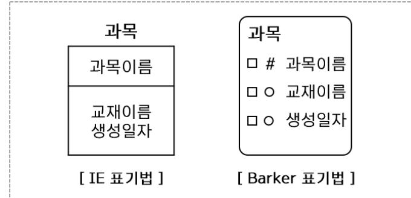

### 5. 속성의 도메인(Domain)

- - 각 속성이 가질 수 있는 값의 범위
- - 속성에 대한 데이터 타입과 크기, 그리고 제약사항을 지정

ex) 주소: 길이가 20자리 이내인 문자열, 학점: 0.0 ~ 4.5 사이의 실수

### \* 정리

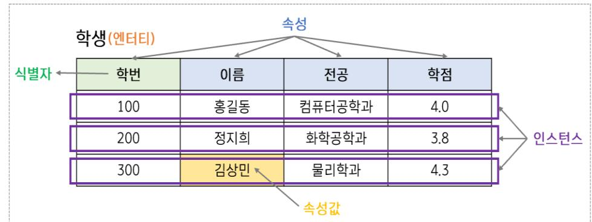

| <div><div><span><span></span></span></div><span><b>사원번호</b>(PK)</span></div> |                            |                                                         |                                                              |
|------------------------------------------------------------------------------|----------------------------|---------------------------------------------------------|--------------------------------------------------------------|
| <div><div><span><span></span></span></div><span><b>사원명</b></span></div>      | <span><span></span></span> | <span><b>속성분류</b></span>                                | <span><b>속성명</b></span>                                      |
| <div><div><span><span></span></span></div><span><b>우편번호</b></span></div>     | <span><span></span></span> | <span><b>PK 속성</b></span>                               | <span><b>사원번호</b></span>                                     |
| <div><div><span><span></span></span></div><span><b>주소</b></span></div>       | <span><span></span></span> | <span><b>FK 속성</b></span>                               | <span><b>부서코드</b></span>                                     |
| <div><div><span><span></span></span></div><span><b>전화번호</b></span></div>     | <span><span></span></span> | <span><b>일반속성</b></span>                                | <span><b>사원명</b>, <b>우편번호</b>, <b>주소</b>, <b>전화번호</b></span> |
| <div><div><span><span></span></span></div><span><b>부서코드</b>(FK)</span></div> | <span><span></span></span> | <span><span> </span></span> <span><span> </span></span> | <span><span> </span></span>                                  |


# ••

☛☛ unique

•☛

•••••☛

••

## 제 4절 관계

### 1. 관계의 정의

- - 엔터티의 인스턴스 사이의 논리적인 연관성으로서 존재의 형태로서나 행위로서 서로에게 연관성이 부여된 상태
- ex) [ 강사 ] - 가르친다 - [ 수강생 ]

### 2. 관계의 페어링

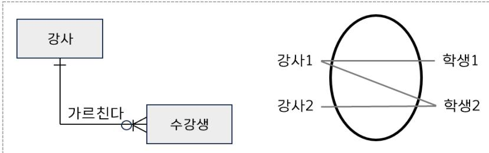

- - 페어링: 엔터티 안에 인스턴스가 개별적으로 관계를 가지는 것
- - 관계: 페어링의 집합을 논리적으로 표현한 것
- cf) 엔터티: 인스턴스의 집합을 논리적으로 표현한 것
- ■ 위 예시에선 총 3개의 페어링이 존재

### 3. 관계의 분류

어떤 목적(존재, 행위)으로 연결되었는지에 따라 관계 분류

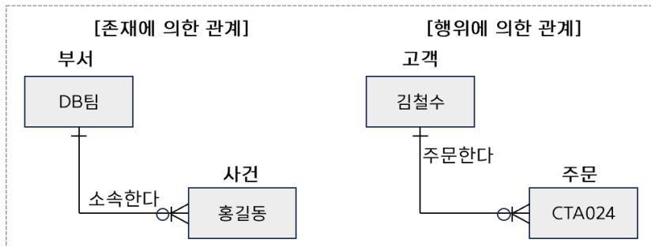

#### ① 존재에 의한 관계

- - 하나의 엔터티가 다른 엔터티에 항상 속해 있다.
- - 각 엔터티는 독립적으로 존재할 수 있다.
- - UML에서는 ‘연관관계’라 표현한다. (실선으로 표기)
- - 연관관계는 **소스코드에서 멤버변수로 선언하여 사용할 수 있다.**

#### ② 행위에 의한 관계

- - 혼자서는 존재할 수 없는 엔터티 (사건 엔터티)
- - UML에서는 ‘의존관계’라 표현한다. (점선으로 표기)
- - **의존관계는 오퍼레이션에서 파라미터 등으로 이용할 수 있다.**

ex) 주문 CTA024는 김철수의 ‘주문’이라는 행위를 통해 생성

※ ERD에서는 UML과 달리 해당 관계를 구분하지 않고 표현한다.

### 4. 관계의 표기법

- • **관계명:** 관계의 이름 (명명 규칙: 애매한 동사 피하기, 현재형으로 표현)
- • **관계 차수(Degree):** 각 관계에 참여할 수 있는 인스턴스의 수
- - 1:N, 1:1, M:N
- • **관계선택사양(선택성):** 필수참여관계(표기: |), 선택참여관계(표기: ○)

### 5. 관계 체크사항

☑ 2개의 엔터티 사이에 관심있는 연관 규칙이 존재하는가

☑ 2개의 엔터티 사이에 정보의 조합이 발생하는가

☑ 업무기술서, 장표에 관계연결에 대한 규칙이 서술되어 있는가

☑ 업무기술서, 장표에 관계연결을 가능하게 하는 **동사**가 있는가

## 6. 관계 읽기

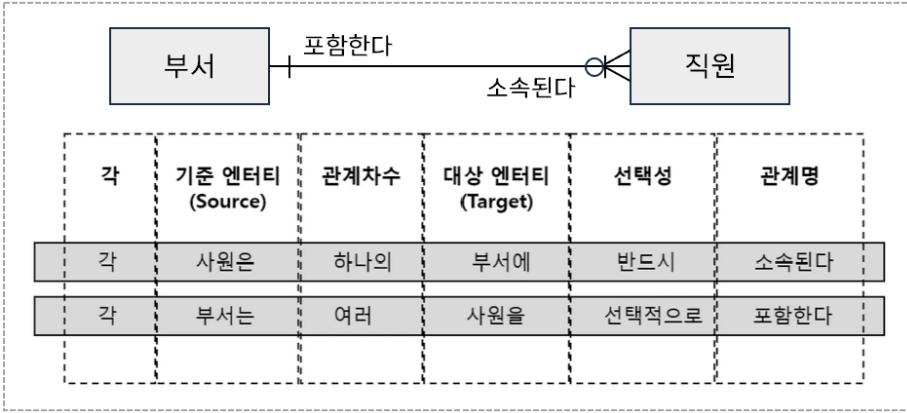

## 제 5절 식별자

### 1. 식별자 개념

- - 하나의 엔터티에 구성되어 있는 여러 개의 속성 중 엔터티를 대표할 수 있는 속성, 각각의 인스턴스를 구분 가능하게 만들어주는 대표 속성
- - 하나의 엔터티는 반드시 하나의 유일한 식별자가 존재한다.

Q 식별자? 키?

- ※ 식별자라는 용어는 논리 데이터 모델링 단계에서 사용
- ※ 키(Key)는 DB 테이블 접근을 위한 매개체로서 물리 데이터 모델링 단계에서 사용

## 2. 식별자 특징

- • 유일성:  
  주식별자에 의해 엔터티 내의 모든 인스턴스들을 유일하게 구분
- • 최소성: (하나의 속성으로 충분히 구분이 가능하면 추가하지 말라는 것)  
  주식별자를 구성하는 속성의 수는 유일성을 만족하는 최소의 수가 되야 함

- • 불변성:

주식별자가 한번 특정 엔터티에 지정되면 그 식별자의 값은 변하면 안됨

- • 존재성: (학번이 없는 학생은 존재하지 않음, 주민번호 없는 사람은 없음)

주식별자가 지정되면 반드시 데이터 값이 존재해야 함 (Null 허용X)

## 3. 식별자의 분류 ★

| 분류          | 식별자                      | 설명                                                    |
|-------------|--------------------------|-------------------------------------------------------|
| 대표성<br>여부   | 주식별자<br>(Primary Key)    | 엔터티 내 각 어커런스 구분 가능<br>타 엔터티와 참조관계 연결 가능               |
|             | 보조식별자<br>(Candidate Key) | 엔터티 내에서 각 어커런스 구분 가능<br>대표성을 갖지 못해 참조관계 연결 불가능        |
| 스스로<br>생성여부 | 내부식별자                    | 엔터티 내부에서 스스로 만들어지는 식별자                                |
|             | 외부식별자<br>(Foreign Key)   | 관계를 통해 유입되는 타 엔터티의 식별자                                |
| 속성 수        | 단일식별자                    | 하나의 속성으로 구성된 식별자                                      |
|             | 복합식별자                    | 둘 이상의 속성으로 구성된 식별자                                    |
| 대체<br>여부    | 본질식별자                    | 업무에 의해 만들어지는 식별자                                      |
|             | 인조식별자                    | 업무적으로 만들어지지는 않으나,<br>원조식별자가 복잡한 구성을 가져 인위적으로 만들어진 식별자 |

※ 보통 주식별자이면서 내부식별자이면서 단일식별자이면서 본질식별자다.

※ 보조식별자는 주식별자에 선택받지 못한 애들이다.

ex) 학생이란 엔터티에 학번, 주민번호, 이름, 이메일이란 속성이 있다면 학번, 주민번호, 이메일은 모두 각 어커런스 구분이 가능함. 하지만 주식별자를 학번으로 결정했다면 주민번호, 이메일은 보조식별자가 되는 것.

※ 일반적으로 식별자는 단일식별자며, 운동 선수를 예시로, 소속팀과 등번호, 이렇게 둘이 같이 있어야 식별이 가능한 경우를 복합식별자라고 함.

※ 본질 = 원조, 인조 = 대리

※ 키의 종류

후보 키(Candidate Key)

- - 테이블에서 각 행을 유일하게 식별할 수 있는 속성들의 집합
- - 유일성과 최소성을 동시에 만족해야 함

기본 키(Primary Key)

- - 후보 키 중 엔터티를 대표하는 키로 선정된 키

수퍼 키(Super Key)

- - 유일성은 만족하나 최소성은 만족하지 못함

대체 키(Alternative Key)

- - 후보 키 중 선별된 기본키를 제외하고 남은 키

3. 주식별자 도출기준

- - 해당 업무에서 자주 이용되는 속성, 자주 변하지 않는 값
- - 명칭, 내역 등과 같이 이름으로 기술되는 것들은 가능하면 지정X
- - 복합으로 주식별자로 구성할 경우, 너무 많은 속성은 포함X

4. 식별자와 비식별자의 관계 ★★

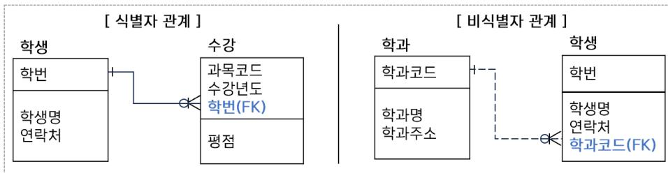

① 식별자 관계

- - 자식이 부모의 주식별자를 자신의 주식별자에 포함시키는 경우

(= 부모의 주식별자가 자식의 주식별자로 상속됨)

- - 반드시 부모 엔터티가 생성이 되어야 자식 엔터티가 생성될 수 있음

- - SQL 문의 조인 관계를 최소화해야 하는 경우

- - 이 때 식별자를 공유한 부모 엔터티를 'Strong Entity',

공유 받은 자식 엔터티를 'Weak Entity' (부모 없이 존재할 수 없어서 약함)

② 비식별자 관계

- - 부모의 주식별자가 자식 엔터티의 비식별자 속성으로 상속

- - 부모 엔터티 없이 자식 엔터티가 생성이 가능한 경우

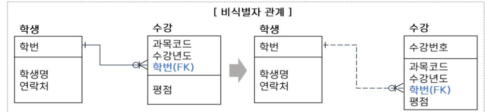

- - 자식 엔터티의 주식별자로 사용해도 되나, 일반 속성으로 두는 게 유리한 경우

- - 부모와 자식 엔터티 간의 관계가 약한 경우

- - 자식 엔터티의 독립적인 주식별자 설정이 필요한 경우

- - 부모 엔터티의 인스턴스가 자식 엔터티의 인스턴스보다 먼저 소멸되는 경우

- - PK 속성의 단순화가 필요한 경우

(SQL 복잡도 증가로 인해 개발 생산성이 저하되는 현상 방지)

| 항목         | 식별자 관계                                                                                                          | 비식별자 관계                                                                                                                                                            |
|------------|-----------------------------------------------------------------------------------------------------------------|--------------------------------------------------------------------------------------------------------------------------------------------------------------------|
| 목적         | 강한 연결관계 표현                                                                                                      | 약한 연결관계 표현                                                                                                                                                         |
| 자식 주식별자 영향 | 자식 주식별자의 구성에 포함                                                                                                 | 자식 일반 속성에 포함                                                                                                                                                       |
| 표기법        | 실선                                                                                                              | 점선                                                                                                                                                                 |
| 연결 고려사항    | <ul> <li>• 반드시 부모 엔터티에 종속</li> <li>• 자식 주식별자 구성에 부모 주식별자 포함 필요</li> <li>• 상속받은 주식별자 속성을 타 엔터티에 이전 필요</li> </ul> | <ul> <li>• 약한 종속관계</li> <li>• 자식 주식별자 구성을 독립적으로 구성</li> <li>• 자식 주식별자구성에 부모 주식별자 부분 필요</li> <li>• 상속받은 주식별자 속성을 타 엔터티에 차단 필요</li> <li>• 부모쪽의 관계참여가 선택관계</li> </ul> |

일반 속성(= 비식별자 속성)

※ 정리

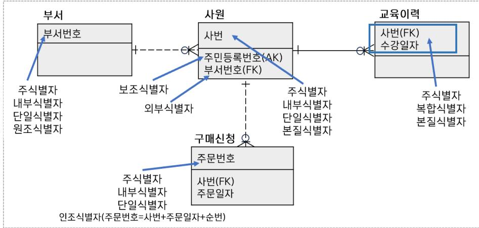

I. 데이터 모델링의 이해(2)

2장. 데이터 모델과 SQL

성능 데이터 모델링의 개요 (범위 X)

1. 성능 데이터 모델링의 정의

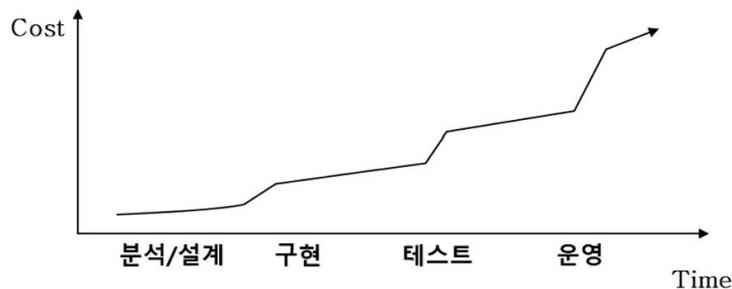

- - 데이터베이스 성능을 고려하여 데이터 모델링을 수행하는 것
- ■ 정규화, 반정규화, 테이블 통합 및 분할, 조인 구조, PK/FK 설정 등
- - 수행 시점은 당연히 빠르면 빠를수록 좋음(분석/설계 단계에서 하자)

2. 성능 데이터 모델링 진행 순서/고려 사항

1. 1) 정규화를 정확하게 수행
2. 2) DB 용량산정 수행 (각 엔터티에 어느 정도의 트랜잭션이 들어오나 파악)
3. 3) DB에 발생되는 트랜잭션 유형 파악 (CRUD 매트릭스 활용)
4. 4) 용량과 트랜잭션 유형에 따라 반정규화 수행
5. 5) 이력모델의 조정, 인덱스를 고려한 PK/FK 순서 조정, 슈퍼타입/서브타입 조정
6. 6) 성능관점에서 데이터 모델 검증

제 1절 정규화

| 과목코드(PK) | 과목명  | 학번(PK) | 이름  | 연락처           |
|----------|------|--------|-----|---------------|
| C01      | DB개론 | 2401   | 강감찬 | 010-1234-5678 |
| C02      | DB실무 | 2401   | 강감찬 | 010-1234-5678 |
| A01      | 마이닝  | 2402   | 홍길동 | 010-6363-8282 |
| B01      | 통계   | 2401   | 강감찬 | 010-1234-5678 |
| C01      | DB개론 | 2403   | 이춘향 | 010-9876-5432 |

- ▶ 삭제 이상 (어떤 정보를 삭제하면서 원하지 않게 다른 정보도 삭제)
- Q 학번이 2402인 학생이 A01을 수강한 기록을 삭제할 때
- - 만일 A01를 수강하고 있는 다른 학생이 없을 경우 A01이라는 과목에 대한 정보가 다 날라가 짐
- ▶ 삽입 이상 (관련 없는 다른 정보가 비어 있어 원하는 정보 입력 불가)
- Q 새로운 학생(2404, 김유신, 010-2226-4545)을 추가하고자 할 때
- - 해당 테이블은 복합식별자를 가져 추가할 수 없음
- - 즉, 수강하는 과목에 대한 정보를 넣어야만 추가 가능
- ▶ 갱신 이상
- - 강감찬의 전화번호를 바꾸고 싶다면 3개의 정보가 바뀌어야 함

- ■ 테이블이 과목, 수강, 학생이 전부 통합되어 있기 때문에 하나의 정보를 바꿀 때 여러 번의 업데이트가 일어나게 된다.

⇒ 뭉뚱그려져 있는 큰 테이블을 주제별로 독립된 테이블로 만들어줘야 한다. 이를 '정규화'라고 한다.

## 1. 정규화

- 정규화는 **최소한의 데이터 중복, 최대한의 데이터 유연성, 데이터 일관성을 위해 데이터를 분리하는 과정이다.**

- 데이터 중복을 제거하고 데이터 모델의 독립성을 확보한다.

- 정규화를 통해 업무 상 변화가 생겨도 데이터 모델의 변경을 최소화할 수 있다.

- **논리 데이터 모델(개념, 물리 모델X)** 상세화 과정의 대표적인 활동

목적: 데이터를 결정하는 결정자에 의해 함수적 종속을 가지고 있는 일반 속성을 의존자로 하여 입력/수정/삭제 이상을 제거하는 것

## 2. 정규화 종류(정규화 절차) ★★

- 정규형(NF: Normal Form): 정규화로 도출된 데이터 모델이 갖춰야 할 특성

• 제 1정규형 (1NF, 원자성, 완전함수종속성 제거):

- 모든 속성은 반드시 하나의 값을 가져야 한다, 중복 인스턴스X

• 제 2정규형 (2NF, 부분함수종속성 제거):

- 엔터티의 일반속성은 주식별자 전체에 종속이어야 한다.

• 제 3정규형 (3NF, 이행함수종속성 제거):

- 엔터티의 일반속성 간에는 서로 종속적이지 않다.

- 이행종속성X: A → B, B → C의 관계가 제거된다는 것

※ 이전 단계의 정규형을 만족해야 그 다음 단계의 정규화를 진행할 수 있다.

## 3. 함수적 종속성(FD, Functional Dependency)

ex) 학번, 혈액형이라는 속성이 있다고 해보자. 이 때 수업을 듣는 학생들 중 A형을 가진 학생의 학번을 묻는다면, 단 하나의 학번이 아닌 A형을 가진 학생들 전부의 학번이 나오게 될 것이다.

x값 하나에 대응되는 y의 값이 하나만 존재해야 함수라 말할 수 있는데, 그렇지 않으니 이는 함수라 얘기할 수 없다.

→ 혈액형은 학번을 함수적으로 결정하지 못한다.

→ 학번은 혈액형에 함수적으로 종속되지 않는다.

이번에는 반대로 2401이라는 학번을 가진 학생의 혈액형이 무엇인지 묻는다고 해보자. 이때 결정되는 학생은 딱 한 명이 된다.

→ 학번은 혈액형을 함수적으로 결정한다.

→ 혈액형은 학번에 함수적으로 종속된다.

⇒ 정규화는 이런 함수적 종속성을 기반으로 수행된다.

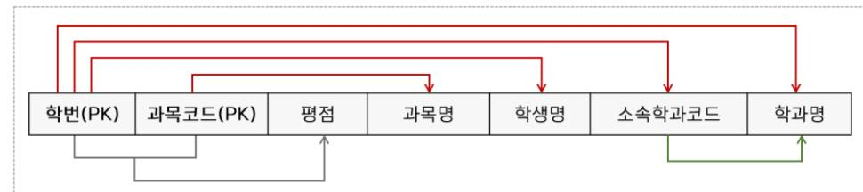

▶ **부분함수종속: 하나의 PK가 혼자서 속성을 결정하는 것**

ex) 학번 하나로 학생명과 소속학과코드, 학과명이 결정됨

▶ **이행함수종속: PK가 아닌 애가 속성을 결정하는 것**

ex) 소속학과코드가 학과명을 결정함

⇒ 정규화를 통해 부분함수종속과 이행함수종속을 없애면, 식별자 전체에 의해 결정되는 것만 남게 된다.

⇒ 식별자가 아닌 속성(주식별자의 일부, 일반속성)이 결정자 역할을 하는 함수 종속을 제거하면 3정규형을 얻을 수 있다

정규화: 자기애들끼리 독립해서 다른 테이블을 만들면 됨. 단 결정자는 본 테이블에도 남아 있어야 한다.

▶ 제 2차 정규화 예시) - 부분함수종속 제거

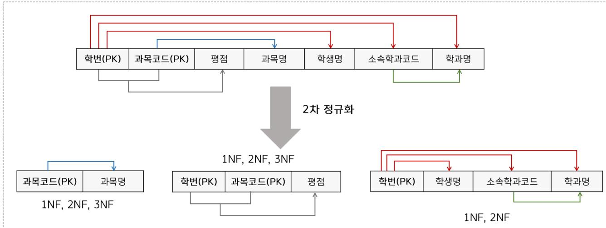

▶ 제 3차 정규화 예시) - 이행함수종속 제거

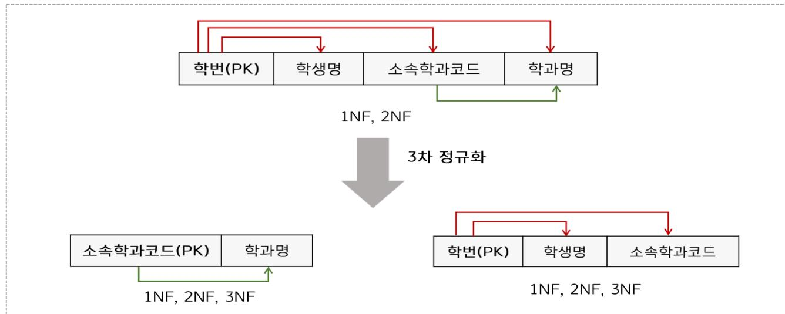

#### 4. 정규화의 성능

- - 데이터의 중복 감소 → 용량 최소화 → 성능 향상
- - 데이터가 관심사별로 묶임 → 성능 향상
- - 데이터 입력/수정/삭제 → 성능 향상
- - **조회(SELECT) 질의에서 JOIN이 많이 발생 → 성능 저하**  
  (조회의 경우 처리조건에 따라 성능이 향상될 수도 있음)

#### ▶ 정규화를 통한 성능 개선 예시

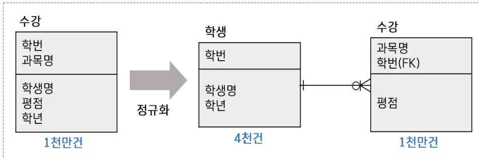

→ 특정 학생의 학년 변경

- - 정규화 전: 해당 학생이 수강 테이블에서 나타나는 수만큼 변경
- - 정규화 후: 해당 학생의 학년 건만 변경
- → 3학년 학생의 학번, 이름 조회
- - 정규화 전: 수강 이력이 누적된 수만큼 인스턴스 조회
- - 정규화 후: 학생 수만큼 인스턴스 조회
- → 학번, 학생명, 과목명, 평점 조회
- - 정규화 전: 하나의 테이블에서 모두 조회 가능
- - 정규화 후: JOIN 필요 (약간의 성능 저하)

#### • BCNF(3NF의 강화버전):

- - 제3정규형을 만족하면서, 모든 결정자가 후보 키 집합에 속해야 한다.
- - 즉, 후보 키 집합에 속하지 않은 컬럼이 결정자가 되어서는 안된다.

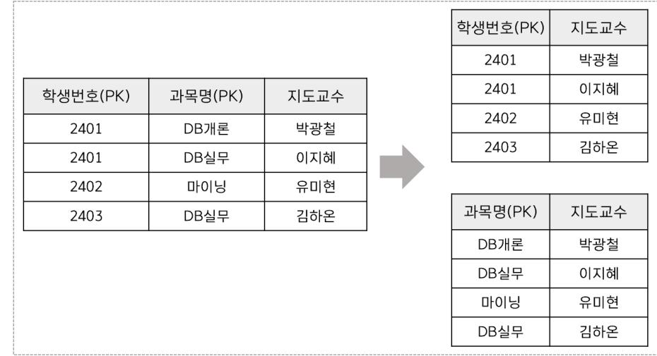

- - 하나의 과목을 여러 지도교수가 담당한 경우, 과목명 하나로는 지도교수를 결정할 수 없지만, 지도교수 속성 하나로는 과목명을 알 수 있으니 지도교수가 결정자가 된다. 지도교수는 후보키가 아니니 BCNF을 만족X
- - BCFF형이 되기 위해 위와 같이 테이블을 분해해주면 된다.

#### • 제 4정규형 (4NF):

- - BCNF을 만족하며 다치 종속(Multivalued Dependency)이 없어야 한다.

| 학생번호(PK) | 과목명(PK) | 취미 |
|----------|---------|----|
| 2401     | DB개론    | 그림 |
| 2401     | DB실무    | 게임 |
| 2402     | 마이닝     | 축구 |
| 2402     | DB실무    | 게임 |

- - 위 테이블처럼 데이터가 다치 종속성을 가진다고 가정해보자.
- - 다치 종속의 조건
  1. 1) [다치 종속성]: A → B 일 때, 하나의 A값에 여러 개의 B 값이 존재
  2. 2) 최소 3개의 컬럼이 존재
  3. 3) R(A, B, C)가 있을 때, A와 B 사이에 다치 종속성이 있으면 B와 C가 독립적이다.

| 학생번호(PK) | 과목명(PK) | 취미 |
|----------|---------|----|
| 2401     | DB개론    | 그림 |
| 2401     | DB개론    | 게임 |
| 2401     | DB실무    | 그림 |
| 2401     | DB실무    | 게임 |

- - 이 때 학생번호를 토대로 데이터를 조회하면 중복이 발생한다.
- - 과목, 취미는 서로 독립적인 관계이며, 둘 다 학생번호 컬럼에 다치 종속되어버려 중복이 발생하는 것이다.

| 학생번호(PK) | 과목명(PK) | 학생번호(PK) | 취미 |
|----------|---------|----------|----|
| 2401     | DB개론    | 2401     | 그림 |
| 2401     | DB실무    | 2401     | 게임 |
| 2402     | 마이닝     | 2402     | 축구 |
| 2402     | DB실무    | 2402     | 게임 |

- - 제 4차 정규화를 통해 위와 같이 분해하면 된다.

- • 제 5정규형 (5NF, 부분함수종속성 제거):
- - 5NF는 Project Join Normal Form(PJNF)라고도 불린다.
- - 4NF를 만족해야 하며 조인 종속(Join Dependency)가 없어야 한다.
- - 조인 연산을 했을 시 손실이 없어야 한다.
- - DB 설계에서 매우 희귀하게 적용된다.

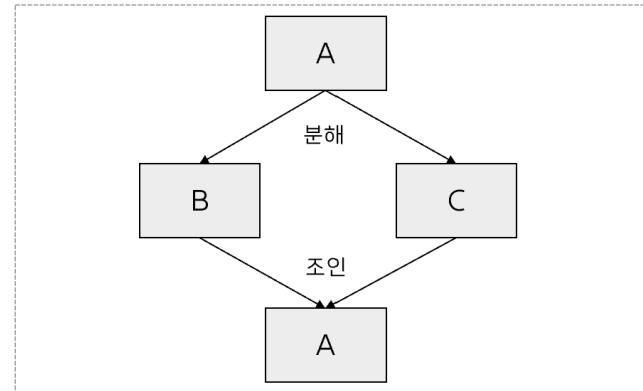

- - 릴레이션(=테이블) A를 B와 C로 분해했다가 다시 조인했을 때 그대로 A가 된다면, A는 조인 종속성이 있다고 한다.

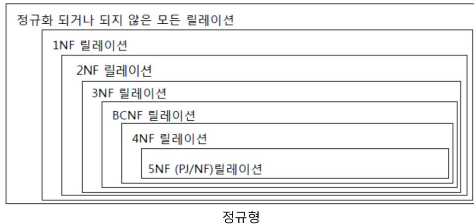

## 반정규화 (범위 X)

### 1. 반정규화(=역정규화, Denomination) ≠ 비정규화

- - DB의 성능 향상을 위해, 데이터 중복을 허용하고 조인을 줄이는 방법
- - 시스템의 성능 향상, 개발 및 운영의 단순화를 위해 정규화 된 데이터 모델을 중복, 통합, 분리하는 모델링 기법
- - 조회 속도를 향상시키나, 데이터 모델의 유연성은 낮아진다.
- - 즉, 입력/수정/삭제 성능이 저하된다는 것

### 2. 반정규화를 수행하는 경우

- - 정규화를 통해 엔터티, 관계 수가 많아져 조회 JOIN으로 인한 성능 저하가 예상될 때
- - 정규화에 충실해 종속성, 활용성은 향상되나 수행속도가 느려지는 경우
- - 다량의 범위를 자주 처리해야 하는 경우
- - 특정 범위의 데이터만 자주 처리하는 경우
- - 요약/집계 정보가 자주 요구되는 경우

※ 반정규화가 조회 성능 향상을 향상 보장하는 것은 아니다.

## 제 2절 관계와 조인의 이해

### 1. 관계 (+ 인스턴스의 연관성은 페어링)

- - 엔터티의 인스턴스 사이의 논리적인 연관성으로서 존재의 형태로서나 행위로서 서로에게 연관성이 부여된 상태
- - 부모의 식별자를 자식의 식별자에 포함하면 식별관계, 부모의 식별자를 자식의 일반속성으로 상속하면 비식별관계
- - 관계를 맺는다 = 식별자를 상속시키고 해당 식별자를 매핑키로 활용해 데이터를 결합하겠다는 것

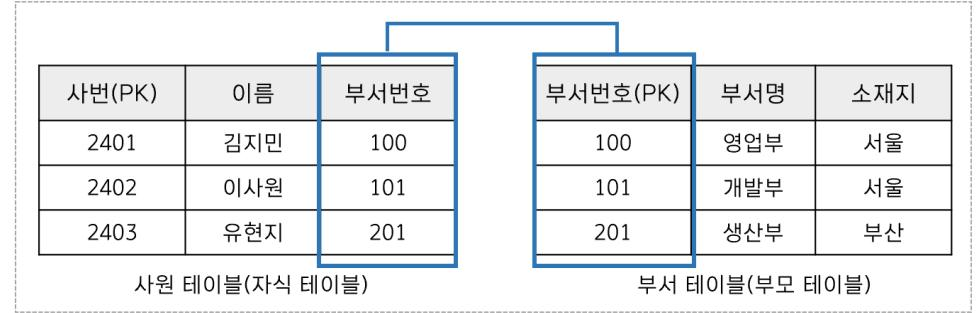

부서번호가 JOIN KEY가 된다.

### 2. 관계의 분류

- - 존재 관계: 엔터티가 다른 엔터티에 속함
- ex) 사원 엔터티는 부서 엔터티에 소속
- - 행위 관계: '행위'를 통해서 발생
- ex) 주문은 고객이 주문할 때 발생

### 3. 조인(JOIN)

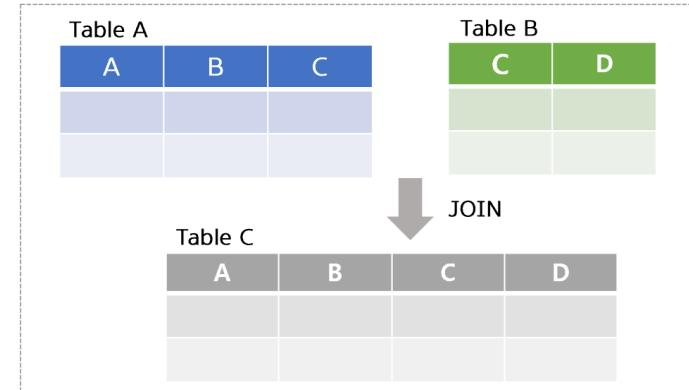

- - 조인이란 식별자를 상속하고, 상속된 속성을 매핑키로 활용하여 데이터를 결합하는 것

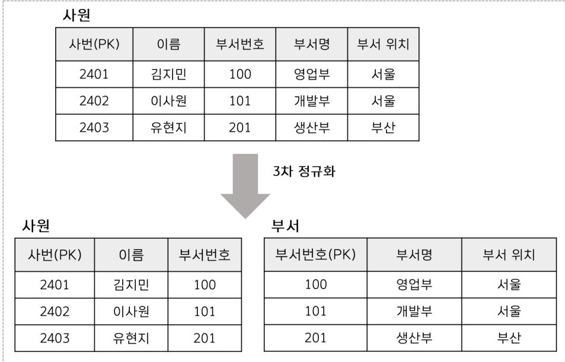

- - 제 3차 정규화를 통해 사원 테이블은 사원 테이블과 부서 테이블로 분해되었다. 3정규형이 되기 전에는 하나의 사원 테이블에서 사원과 부서 정보를 동시에 얻을 수 있었지만, 3정규형으로 분리된 후에는 사원의 정보와 부서의 정보를 함께 조회하고 싶다면 조인을 사용해야 한다.
- - 조인은 두 테이블의 공통된 속성을 기반으로 데이터를 연결하는 과정이며, 이때 사용되는 공통 속성을 조인 키(JOIN KEY)라고 한다.
- - 조인 키는 보통 외래 키로 설정된다.

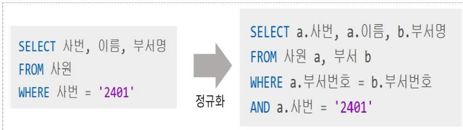

#### 4. 관계형 데이터 모델

- - 자기 자신끼리의 관계
- - 하나의 엔터티 내에서 인스턴스끼리 계층 구조를 가지는 경우
- → 계층 구조를 갖는 인스턴스끼리 연결하는 조인을 셀프 조인이라 한다. (즉, 같은 테이블을 여러 번 조인)

| 직원       |     |      |
|----------|-----|------|
| 직원ID(PK) | 이름  | 상사ID |
| 1        | 나사장 | NULL |
| 2        | 김철수 | 1    |
| 3        | 이지현 | 1    |
| 4        | 황수지 | 2    |
| 5        | 박현석 | 3    |

- - 상사ID는 상사의 직원ID로 직원ID 컬럼과 관련이 있다.
- - 만일 어떤 직원의 상사의 이름을 알고 싶다면 셀프 조인을 해야 한다.

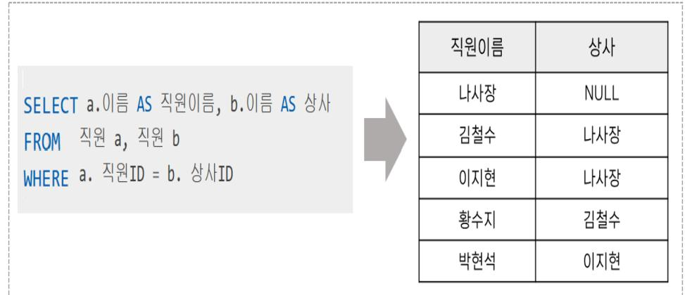

5. 상호 배타적 관계(Exclusive-OR 관계)

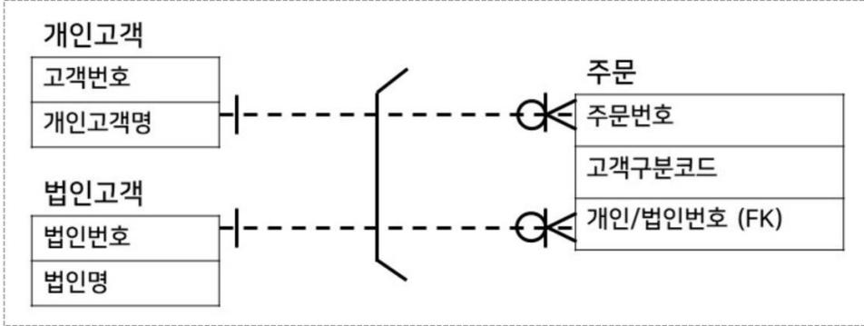

- - 하나의 부모가 2개의 자식 엔터티를 가질 때, 행위 조건에 따라 두 자식 중 하나만 부모와 관계를 가질 수 있는 상황
- - 두 자식 엔터티가 동시에 부모 엔터티와 연결될 수 없으며, 특정 조건에 의해 둘 중 하나만 선택적으로 관계를 유지한다.

ex) 주문 엔터티는 개인 또는 법인번호 둘 중 하나만 상속될 수 있음  
 즉, 주문은 개인고객이거나 법인고객 둘 중 하나의 고객만이 가능함

제 3절 모델이 표현하는 트랜잭션의 이해

1. 트랜잭션: 업무 처리를 위한 논리적인 작업 단위

- - 하나의 연속적인 업무 단위
- - 트랜잭션에 의한 관계는 **필수적인 관계 형태**를 가진다.
- - 하나의 트랜잭션에는 여러 SELECT, DELETE, UPDATE 등이 포함될 수 있다.
- - 하나의 트랜잭션에 속한 동작들은 모두 성공하거나, 모두 취소(UNDO)되어야 한다. [트랜잭션의 '원자성']
- - 서로 독립적으로 업무가 발생해서는 안된다. 순차적으로 함께

ex) 계좌이체

상황: A 고객 ----- 100만원 이체 -----> B 고객  
 [처리단계]

- (1) A 고객의 잔액이 100만원 이상인지 확인
- (2) 이상이라면, A 고객의 잔액을 -100 UPDATE
- (3) B 고객의 잔액에 +100 UPDATE

■ 2번과 3번 과정은 동시에 수행되어야 함. 즉, 모두 성공 or 모두 취소되어야 함. (All or Nothing)  
 - A 고객에게서 100만큼 빠지지 않았는데 B 고객에게 100만큼 들어가면 안되잖아.

※ A 고객 잔액 차감과 B 고객 잔액 가산이 서로 독립적으로 발생하면 X 즉, 각각의 INSERT 문으로 개발X  
 ※ 부분 COMMIT 불가, 동시 COMMIT이나 ROLLBACK으로 처리

- ▶ 필수적, 선택적 관계와 ERD
- - 두 엔터티의 관계가 서로 필수적일 때 하나의 트랜잭션을 형성
- - 두 엔터티가 서로 독립적인 수행이 가능하다면 선택적 관계로 표현

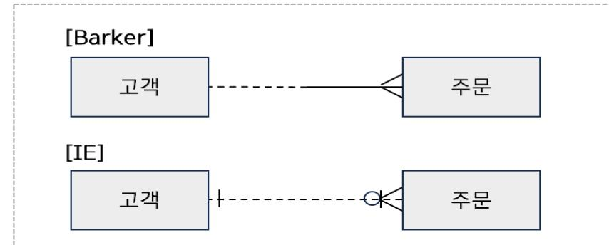

- • IE 표기법
- • Barker 표기법
- - 필수적 관계: 원 X
- - 선택적 관계: 원
- • Barker 표기법
- - 필수적 관계: 실선의 관계선
- - 선택적 관계: 점선의 관계선

## 2. 트랜잭션의 특징

### ① 원자성(Atomicity)

- 트랜잭션은 더 이상 분해가 불가능한 업무의 최소단위이므로, 전부 처리되거나 모두 처리되지 않아야 한다.

### ② 일관성(Consistency)

- 일관된 상태의 DB에서 하나의 트랜잭션을 성공적으로 완료하고 나면 그 DB는 여전히 일관된 상태여야 한다. 즉, 트랜잭션 실행의 결과로 DB 상태가 모순되지 않아야 한다.

- 시스템이 가지고 있는 고정요소는 트랜잭션 수행 전과 수행 완료 후의 상태가 같아야 한다.

### ③ 격리성(Isolation)

- 실행 중인 트랜잭션의 중간결과를 다른 트랜잭션이 접근할 수 없다.  
 - 수행 중인 트랜잭션은 완전히 완료될 때까지 다른 트랜잭션에서 수행 결과를 참조할 수 없다.

### ④ 영속성/지속성(Durability)

- 트랜잭션이 성공적으로 완료되었을 경우, 그 결과는 데이터베이스에 영속적으로 저장된다. (결과가 영구적으로 반영된다는 뜻)

## 제 4절 NULL 속성의 이해 ★★★

### 1. NULL의 특징 (모르는 값, 값의 부재)

- 널 값은 **아직 정의되지 않은 값**으로 0(수) 또는 공백(문자)과는 다르다.  
 - 테이블 생성할 때 NOT NULL 또는 PRIMARY KEY로 정의되지 않은 모든 데이터 유형은 널 값을 포함할 수 있다.  
 - 널 값을 **포함하는 연산의 경우 결과값도 널 값**이다. 모르는 데이터에 숫자를 더하거나 빼도 결과는 마찬가지로 모르는 데이터인 것과 같다.

- 결과값을 NULL이 아닌 다른 값을 얻고자 할 때 NVL/ISNULL 함수를 사용한다. 널 값의 대상이 숫자 유형 데이터인 경우는 주로 0(Zero)으로, 문자 유형 데이터인 경우는 공백보다는 'x' 같이 해당 시스템에서 의미 없는 문자로 바꾸는 경우가 많다.

⇒ NVL(C, 0): 컬럼 C에 NULL값은 0으로 치환하라

- 널과의 모든 비교(IS NULL 제외)는 알 수 없음(unknown)을 반환한다.

⇒ NULL = NULL → unknown OR FALSE

- 집계 함수를 계산할 때 NULL 값은 0이 아니라 계산에서 제외된다.

※ 집계 함수에서의 NULL의 취급

|   | 컬럼1 | 컬럼2  |
|---|-----|------|
| 1 | 10  | 20   |
| 2 | 20  | NULL |

- 이 테이블에서 각 컬럼에 대한 집계함수의 값은 어떻게 될까?

|               | column = 컬럼1 | column = 컬럼2 |
|---------------|--------------|--------------|
| count(column) | 2            | 1            |
| sum(column)   | 30           | 20           |
| avg(column)   | 15           | 20           |
| max(column)   | 20           | 20           |
| min(column)   | 10           | 20           |

✓ NULL 값은 집계 함수에서 무시된다!

✓ COUNT(\*)는 NULL값을 포함한 전체 행의 개수

✓ 컬럼이 PK라면 NULL값 허용X → 항상 COUNT(\*) = COUNT(컬럼)

✓ 전체 행 개수에 대한 평균 = SUM(column)/COUNT(\*)

▶ NULL의 ERD 표기법

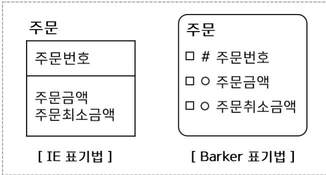

- IE: NULL 허용여부 알 수 없음

- Barker: 속성 앞 동그라미 표시

제 5절 본질식별자 vs. 인조식별자

1. 본질 식별자와 인조식별자

▶ 원조(본질) 식별자

- 업무에 의해 만들어지는 식별자(꼭 필요한 식별자)

ex) 학번, 주민등록번호, 사번

▶ 인조(대리) 식별자

- 업무에 존재하지는 않으나 원래의 식별자가 너무 복잡하게 구성되어 있어 인위적으로 만든 식별자

- 원조 식별자가 PK 2개 이상인 복합 식별자 일 때 속성들을 하나의 속성으로 묶어서 사용하면 이것이 인조 식별자

- 꼭 필요하진 않지만 편의성을 위해 인위적으로 만들어지는 것

- 본질식별자가 복잡한 구성을 가질 때 인위적으로 생성

- 주로 각 행을 구분하기 위한 기본키로 사용되며 자동으로 증가하는 일련번호 같은 형태

- 개발 편의성을 높여주나 단점도 존재하니 꼭 필요한 경우에만 사용하는 것이 바람직하다.

주문과 주문 상세에 대한 엔터티를 설계해야 한다고 가정해보자.

1) PK(주식별자): 주문번호 + 상품번호

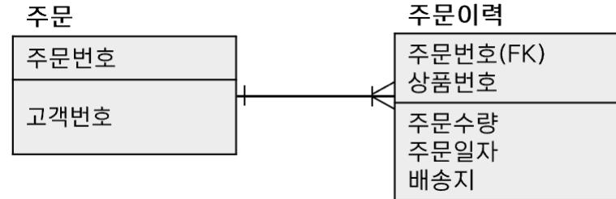

이 때 장바구니에 3개의 상품에 대한 주문사항을 넣는다면 아래와 같은 SQL문이 작성될 것이다.

```
INSERT INTO 주문이력 VALUES('101', 'c03', 3, '2024-10-10', '경기도')
INSERT INTO 주문이력 VALUES('101', 'c05', 1, '2024-10-10', '경기도')
INSERT INTO 주문이력 VALUES('101', 'c06', 2, '2024-10-10', '경기도')
```

후에 주문 수량을 수정하는 것이 아니라, 몇시간 뒤에 장바구니에 이미 넣은 상품을 추가로 또 넣는다면 어떻게 될까?

```
INSERT INTO 주문이력 VALUES('101', 'c03', 3, '2024-10-10', '경기도')
INSERT INTO 주문이력 VALUES('101', 'c05', 1, '2024-10-10', '경기도')
INSERT INTO 주문이력 VALUES('101', 'c06', 2, '2024-10-10', '경기도')
INSERT INTO 주문이력 VALUES('101', 'c03', 2, '2024-10-10', '경기도')
```

오류가 발생하게 된다. (PK가 주문번호와 상품번호라는 것은 주문번호와 상품번호를 가지고 각 인스턴스를 구분한다는 것이라 첫번째 인스턴스와 네번째 인스턴스를 구분할 수 없게 되니까)

※ 물론 전산적 오류로 인한 중복 데이터의 입력을 막아주는 역할도 한다.

## 2) PK(주식별자): 일련번호 형태의 인조식별자

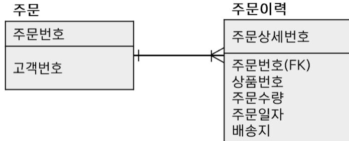

주문상세번호라는 인조식별자를 생성해 주식별자로 둔다면

```
INSERT INTO 주문이력 VALUES(주문상세번호.SEQ.NEXTVAL,'101', 'c03', 3, ...)
INSERT INTO 주문이력 VALUES(주문상세번호.SEQ.NEXTVAL,'101', 'c05', 1, ...)
INSERT INTO 주문이력 VALUES(주문상세번호.SEQ.NEXTVAL,'101', 'c06', 2, ...)
INSERT INTO 주문이력 VALUES(주문상세번호.SEQ.NEXTVAL,'101', 'c03', 2, ...)
```

주문상세번호로 각 주문이력을 구분하기 때문에 같은 주문의 같은 상품이력이 저장될 수 있다. 허나 주문상세번호만이 주식별자라 시스템 오류로 인한 중복 데이터의 입력을 막을 수 없게 된다.

+ 조건을 세워 검색을 하고자 할 때, 결국은 주문번호와 상품번호를 기반으로 WHERE절을 작성하게 된다.

## 2. 인조 식별자의 단점

- - 중복 데이터 발생 가능성 → 데이터 품질 저하
- - 불필요한 인덱스 생성 → 저장 공간 낭비 및 DML 성능 저하
  - (PK 생성 시 unique 인덱스가 자동 생성됨)
- - 별도의 인덱스 생성이 필요

## 3. 인조식별자의 장점

- - 추가적인 연산 없이 시퀀스나 키 제약조건 등을 통해 주식별자를 생성할 수 있으므로 개발의 편의성이 향상될 수 있다. ⇨ 시간 ↓ → 비용 ↓

## II. SQL 기본 및 활용(1)

### 1장. SQL 기본

#### 제 1절 관계형 데이터베이스 개요

##### 1. 데이터베이스

- - 넓은 의미: 일상적인 정보들을 모아놓은 것 자체
- - 일반적인 의미: 특정 기업이나 조직 또는 개인이 필요에 의해 (부가가 치가 발생하는) 데이터를 일정한 형태로 저장해 놓은 것

##### 2. DBMS(Database Management System)

- - 데이터를 효율적으로 관리하기 위한 시스템
- - 데이터의 손상을 피하며 필요한 데이터를 복구해주는 시스템

ex) MySQL, ORACLE

##### 3. 데이터베이스의 발전

1960년대:

- • Flowchart 중심의 개발 방법 사용
- • 파일 구조를 통해 데이터를 저장과 관리 (파일시스템)

1970년대:

- • DB 관리 기법이 처음 출현(태동)
- • 계층형(Hierarchical), 망형(Network) 데이터베이스 제품 상용화

1980년대:

- • 관계형(Relational) 데이터베이스 상용화
- • Oracle, Sybase, DB2 등의 제품 사용

1990년대:

- • Oracle, Sybase, Informix, DB2, Teradata, SQL Server 외 많은 제품 출현
- • 객체 관계형 데이터베이스로 발전

##### 4. 관계형 데이터베이스(Relational Database, RDB)

- - 1970년 영국의 수학자인 E. F. Codd 박사의 논문에서 처음 소개
- - 기업의 핵심 데이터는 대부분 관계형 데이터베이스로 저장되어 있음
- - 관계형 데이터베이스는 SQL 문장에 의해 관리됨

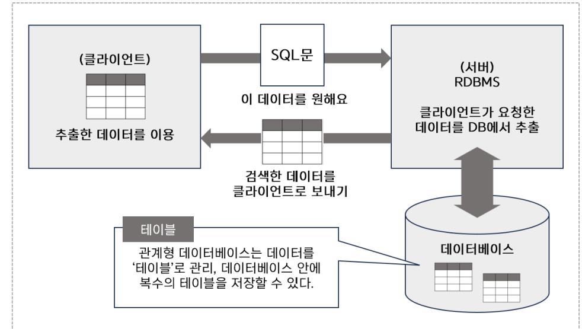

```
SELECT a.학번, a.학생이름, b.과목명
FROM 학생 a
INNER JOIN 수강 b
ON a.학번 = b.학번
```

예시 SQL문

## 5. 관계형 데이터베이스의 구성 요소

- - 계정: 데이터의 접근 제한을 위해 업무별/시스템별로 존재  
  (모든 테이블이 모든 유저들에게 조회되게 할 수는 없으니까)
- - 테이블: DBMS의 데이터베이스 안에 데이터가 저장되는 형식
- - 스키마: 테이블이 어떠한 구성으로 이루어져 있는지, 즉 테이블의 기본적인 구조 정의

## 6. 테이블

테이블: 행과 열의 2차원 구조를 가진 데이터 저장 객체(Object),  
관계형 데이터베이스의 기본 단위,  
릴레이션이 곧 테이블이다.

컬럼/열: 테이블에서 세로 방향으로 이루어진 개별 속성,  
(더 이상 나눌 수 없는 특성),  
필드(Field)라고도 한다.

로우/행: 테이블에서 가로 방향으로 이루어진 연결된 데이터,  
레코드(Record)나 튜플(Tuple)이라고도 한다.

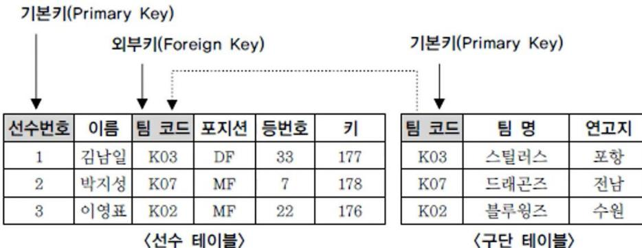

## 7. 테이블의 특징

- - 하나의 테이블은 반드시 하나의 유저(계정)이 소유해야 한다.
- - 테이블간 관계: 1:1, 1:N, N:N
- - 테이블명은 종복될 수 없으나, 소유자가 다르다면 같은 이름으로 생성될 수 있다.
- - 즉, 같은 계정으로 동일한 이름을 가진 객체 생성이 불가능하다는 것
- - 테이블은 행 단위로 데이터가 입력, 삭제되며 수정은 값의 단위로 가능

## 8. SQL (Structured Query Language)

- - 관계형 데이터베이스에서 데이터 정의, 조작, 제어를 위해 사용하는 언어
- - SQL문법은 대, 소문자 구분X
- - 종류: 데이터 조작어, 데이터 정의어, 데이터 제어어, 트랜잭션 제어어

### ▶ SQL 실행단계

#### (1) 파싱(Parsing)

- - 문법 확인 및 구문 분석을 통해 올바른 SQL문인지 확인
- - 파싱이 끝나면, 분석된 SQL이 라이브러리 캐시(Library Cache)에 저장
- - Library Cache: 이전에 실행된 SQL 문에 대한 정보를 저장하는 공

#### (2) 실행(Execution)

- - 옵티마이저(Optimizer)가 생성한 최적의 실행 계획에 따라 SQL문 실행

#### (3) 인출(Fetch)

- - 실행 결과를 데이터베이스에서 사용자에게 전송하는 과정

## 9. 관계형 데이터베이스 특징

- - 데이터의 분류, 정렬, 탐색 속도가 빠르다.
- - 신뢰성이 높고, 데이터의 무결성 보장한다.
- - 기존의 작성된 스키마를 수정하기 어렵다.
- - 데이터베이스의 부하를 분석하는 것이 어렵다.

## 10. 데이터 무결성(Integrity)

- - 데이터의 정확성과 일관성을 유지하고, 데이터에 결손과 부정함이 없음을 보증하는 것
- - 데이터베이스에 저장된 값과 그것이 표현하는 현실의 비즈니스 모델의 값이 일치하는 정확성을 의미
- - 데이터 무결성을 유지하는 것이 DBMS에 중요한 기능
- - 다양한 제약조건(기본키, 외래키, NOT NULL 제약, UNIQUE 제약 등)을 통해 데이터의 무결성이 유지됨

## 11. 데이터 무결성 종류

1. ① 개체 무결성: 데이블의 기본키를 구성하는 컬럼(속성)은 NULL값 X, 중복값 X
2. ② 참조 무결성: 외래키
3. ③ 도메인 무결성: 주어진 속성 값이 정의된 도메인에 속한 값이어야 함
4. ④ NULL 무결성: 특정 속성에 대해 NULL을 허용하지 않음
5. ⑤ 고유 무결성: 특정 속성에 대해 값이 중복되지 않음
6. ⑥ 키 무결성: 하나의 관계에는 적어도 하나의 키가 존재해야 함

(데이블이 서로 관계를 가진다면, 반드시 하나 이상의 조인키를 가짐)

## 12. Relational Model Constraints ★★

[ 4대 제약 조건 ]

### ① 도메인 제약 (Domain Constraints)

- - 속성 (Attribute)에 대한 제약
- ② 키 제약 (Key Constraints)
- - 릴레이션 (Relation)에 대한 제약 / 테이블에 대한 제약
- - 테이블은 키(PK)를 가져야 한다.
- ③ 개체 무결성 제약 (Entity Integrity Constraints)
- - 기본키 (Primary Key)에 대한 제약
- - 테이블이 가진 키는 자고로 이래야 한다는 제약
- - PK는 UNIQUE하면서 NOT NULL이어야 한다.
- ④ 참조 무결성 제약 (Referential Integrity Constraints)
- - 외래키 (Foreign Key)에 대한 제약

※ 3대 제약 조건이라고 하는 경우엔 키와 개체 무결성 제약을 합쳐서 말함

### 12-1. 도메인 제약

- - 속성 값은 원자성(Atomicity)을 가지며 도메인에서 정의된 값이어야 함
- - Composite Attribute와 Multivalued Attribute는 허용 X cf) 주소 = 시군구 + 상세주소
- - NULL값은 허용됨 (NOT NULL이 아닌 속성이라면)

### 학생

| 학번   | 이름  | 나이                                              | 차량번호                                           | 취미         |
|------|-----|-------------------------------------------------|------------------------------------------------|------------|
| 1234 | 홍길동 | 21                                              | 01가1234                                        | 체조         |
| 5678 | 강감찬 | <span style="border: 1px dashed red;">고려</span> | <span style="border: 1px dashed red;"> </span> | 축구, 농구, 배구 |

1

2

3

 ☛ ☛

|          | 학번   | 이름  | 나이 | 차량번호    |
|----------|------|-----|----|---------|
| <b>1</b> | 1234 | 홍길동 | 21 | 01가1234 |
| <b>2</b> | 5678 | 강감찬 | 22 |         |
| <b>3</b> |      | 김유신 | 23 |         |
| <b>4</b> | 1234 | 유관순 |    | 02나3456 |

| 학과명 | 정원  | 위치  |
|-----|-----|-----|
| MIS | 100 | 경상관 |
| 경영  | 200 | 경상관 |
| 컴공  | 100 | 공학관 |
| 수학  | 50  | 자연관 |

 ❹ 

- 릴레이션의 모든 튜플은 서로 식별 가능해야 함  
Q 다음 중 키 제약을 위반하고 있는 릴레이션은?

| 이름  | 나이 | 혈액형 | 전공    |
|-----|----|-----|-------|
| 홍길동 | 21 | A   | 경영정보  |
| 강감찬 | 22 | O   | 정보시스템 |

- •
- FK는 자기 자신이 속한 릴레이션을 참조할 수 있다. ex) 멘토

| 이름  | 나이 | 학번   | 주민번호     |
|-----|----|------|----------|
| 홍길동 | 21 | 1234 | 111-2222 |
| 강감찬 | 22 | 5678 | 333-4444 |

| <b>학번</b> | <b>이름</b>  | <b>나이</b> | <b>소속</b> | <b>멘토</b> |
|-----------|------------|-----------|-----------|-----------|
| 1234      | <b>홍길동</b> | 21        | MIS       |           |
| 2345      | <b>강감찬</b> | 22        | MIS       | 1234      |
| 3456      | <b>김유신</b> | 23        | 경영        |           |
| 4567      | <b>유관순</b> | 22        | 컴공        | 2345      |

☛

### 참조 무결성 제약

- 릴레이션 R1이 릴레이션 R2를 참조하는 경우, R1의 FK는 ...

- (1) NULL 이거나
- (2) NULL 이 아닌 경우 R2에 실제로 존재하는 값으로 구성되어야 함

Q 다음 중 참조 무결성을 위배하는 튜플은?

| 학생 (R1) |      |     |    |     | 학과 (R2) |     |     |     |
|---------|------|-----|----|-----|---------|-----|-----|-----|
|         | 학번   | 이름  | 나이 | 소속  | 멘토      | 학과명 | 정원  | 위치  |
| 1       | 1234 | 홍길동 | 21 | MIS |         | MIS | 100 | 경상관 |
| 2       | 2345 | 강감찬 | 22 | MIS | 1234    | 경영  | 200 | 경상관 |
| 3       | 3456 | 김유신 | 23 |     | 5678    | 컴공  | 100 | 공학관 |
| 4       | 4567 | 유관순 | 22 | 자동차 | 2345    | 수학  | 50  | 자연관 |

- ① 소속인 MIS는 실제 있는 값이고 멘토(FK)는 없어도 괜찮으니 위배 X
- ② 소속과 멘토의 속성값이 모두 있는 값이라 참조 무결성 제약에 위배 X
- ③ 소속이 없지만 NULL이어도 되니 괜찮음,  
  하지만 존재하지 않는 멘토를 참조하니 참조 무결성에 위배됨
- ④ 자동차 전공은 학과 테이블에 없는 값임

### 13. Constraint Violations

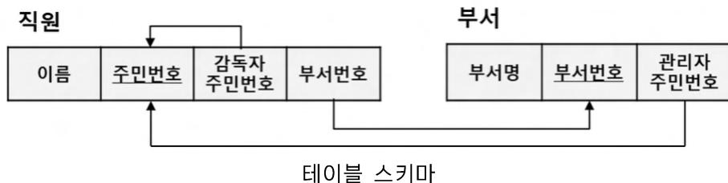

Q 다음 연산들은 어떤 문제를 야기하는가?

- ① 새 직원 <'유관순', '555', NULL, 4> 삽입
- ② 새 직원 <'이방원', '123', '456', 5> 삽입
- ③ SSN = '666'인 직원 삭제

| 직원  |      | FK      | FK   |
|-----|------|---------|------|
| 이름  | 주민번호 | 감독자주민번호 | 부서번호 |
| 강감찬 | 111  | 222     | 5    |
| 김유신 | 222  | 888     | 5    |
| 이성계 | 333  | 444     | 4    |
| 이순신 | 444  | 888     | 4    |
| 정몽주 | 555  | 222     | 5    |
| 최무선 | 666  | 222     | 5    |
| 최치원 | 777  | 444     | 4    |
| 홍길동 | 888  | NULL    | 1    |

| 부서명 | 부서번호 | 관리자주민번호 |
|-----|------|---------|
| 개발팀 | 5    | 222     |
| 인사팀 | 4    | 444     |
| 기획팀 | 1    | 666     |

- ① '555'를 PK값으로 가진 정몽주가 존재하니 개체 무결성 제약 위배
- ② '456'을 가진 사람이 없음, 없는 사람을 참조하니 참조 무결성 위배
- ③ 기획팀의 관리자가 '666'을 가진 최무선이라 최무선 삭제시 참조 무결성 위배

### 14. ERD (Entity Relationship Diagram)

- - 테이블 간 서로의 상관 관계를 그림으로 도식화(표현)한 것
- - 관계의 의미를 직관적으로 표현할 수 있는 수단
- - 구성요소: 엔터티(Entity), 관계(Relationship), 속성(Attribute)
- ■ 현실 세계의 데이터는 이 3가지의 구성으로 모두 표현이 가능하다.

## 제 2절 SELECT 문

### 1. SQL 문장들의 종류

| 명령어의 종류                                         | 명령어                               | 설명                                                                                       |
|-------------------------------------------------|-----------------------------------|------------------------------------------------------------------------------------------|
| 데이터 조작어<br>(DML, Data Manipulation Language)    | SELECT                            | - 데이터를 조회, 검색하기 위한 명령어<br>- RETRIEVE 라고도 함                                               |
|                                                 | INSERT<br>UPDATE<br>DELETE        | - 데이터에 변형을 가하는 명령어<br>ex) 데이터를 테이블의 새로운 행에 집어넣기<br>ex) 원하지 않는 데이터 삭제<br>ex) 데이터 수정       |
| 데이터 정의어<br>(DDL, Data Definition Language)      | CREATE<br>ALTER<br>DROP<br>RENAME | - 테이블과 같은 데이터 구조를 정의하는 데 사용되는 명령어<br>- 테이블의 구조를 생성, 변경, 삭제<br>- 이름 바꾸기 등 데이터 구조와 관련된 명령어 |
| 데이터 제어어<br>(DCL, Data Control Language)         | GRANT<br>REVOKE                   | - 데이터베이스에 접근하고 객체들을 사용하도록 권한을 주고 회수하는 명령어                                                |
| 트랜잭션 제어어<br>(TCL, Transaction Control Language) | COMMIT<br>ROLLBACK                | - 논리적인 작업의 단위를 묶어서 DML에 의해 조작된 결과를 작업단위(트랜잭션) 별로 제어하는 명령어                                |

### 추가

DDL: TRUNCATE(오토커밋이라)

DML: MERGE

TCL: SAVEPOINT

+ DQL(Data Query Language): SELECT

※ DML: 사용자가 COMMIT 해야 함! → ROLLBACK 가능

※ DDL: AUTO COMMIT → ROLLBACK 불가능

### 2. SELECT 문의 구조

```
SELECT * | 컬럼명 | 표현식
FROM 데이블명/뷰명
WHERE 조회 조건
GROUP BY 그룹화 기준 컬럼명
HAVING 그룹핑 필터링 조건
ORDER BY 정렬 기준 컬럼명
```

- - 6개의 절로 구성
- - 각 절의 순서대로 작성해야 한다.  
  (GROUPBY와 HAVING의 순서는 서로 바꿀 수 있으나 보통 사용 X)
- - **SELECT 문의 내부 파싱(문법적 해석)순서는 작성 순서와는 다르다.**

#### MySQL 쿼리 문법 작성 순서

```
SELECT - FROM - WHERE - GROUP BY - HAVING - ORDER BY
```

#### MySQL 쿼리 처리 순서 / 논리적 실행 순서

```
FROM - WHERE - GROUP BY - HAVING - SELECT - ORDER BY
```

1. (1) 데이터베이스는 우선 FROM 절로 가서 어떤 테이블을 가져와야 하는지를 파악하고,
2. (2) WHERE 절로 가서 조건에 맞는 데이터만 필터링한다.
3. (3) 필터링 후에 GROUP BY 절로 가서 필터링한 데이터를 그룹화하고,
4. (4) Having 절을 보고 그 그룹화된 결과에 대해 다시 필터링을 진행한다.
5. (5) 그러고 나서야 SELECT 절로 필요한 컬럼만 추리게 되며,
6. (6) 마지막으로 ORDER BY 절을 보고 데이터를 정렬하는 것이다.

### 3. SELECT 절

- - SELECT 문장을 사용하여 불러올 컬럼명, 연산 결과를 작성하는 절
- - \* : 테이블 내 모든 컬럼 조회
- - SELECT 열1, 열2, ... FROM 테이블명; 로 여러 컬럼 조회 가능
- - 표현식: 기존 컬럼명을 그대로 적는 것이 아니라 연산식, 기존 컬럼의 함수 변형식

### 4. AS

- - SQL에서 별칭(Alias)을 만들 때 사용하는 키워드 (생략 가능하다)
- - 별칭을 통해 출력할 컬럼이나 테이블에 임시로 이름을 부여할 수 있다.
- - 별칭은 결과에만 적용되며, 실제 데이터베이스 테이블에는 영향 X

### 5. AS의 특징/주의사항

- **SELECT 문보다 늦게 사용되는 ORDER BY절에서만 컬럼 별칭 사용 가능** (HAVING이나 WHERE 절에서 사용 시 에러 발생)

※ 오라클에서 테이블 별칭을 명시할 때 AS를 사용할 수 없다! ★

- - 이미 존재하는 예약어로는 당연 사용 불가 ex) SELECT, AVG 등
- - 다음의 경우 큰따옴표(“ ”)를 사용한다. (역따옴표도 사용 가능)
  1. ① 공백 포함
  2. ② 특수문자 포함 (\_, \$, #는 제외 )
  3. ③ 별칭 그대로 전달하고자 할 때

### 6. SELECT [ALL/DISTINCT]

- • ALL: 디폴트 옵션이라 별도로 표시하지 않아도 됨  
  중복된 데이터가 있어도 모두 출력
- • **DISTINCT**: 중복된 데이터가 있는 경우, 1건으로 처리해서 출력

```
SELECT 이름, 급여, 급여 * 1.1
FROM EMPLOYEE;
```

| RBC 이름 | 123 급여    | 123 급여 * 1.1 |
|--------|-----------|--------------|
| 1 김철수  | 2,500,000 | 2,750,000    |
| 2 이영희  | 3,200,000 | 3,520,000    |
| 3 박민수  | 2,800,000 | 3,080,000    |
| 4 정지훈  | 3,000,000 | 3,300,000    |
| 5 최우진  | 2,700,000 | 2,970,000    |


```
SELECT 이름, 급여, 급여 * 1.1 AS "급여(보너스포함)"
FROM EMPLOYEE;
```

| RBC 이름 | 123 급여    | 123 급여(보너스포함) |
|--------|-----------|---------------|
| 1 김철수  | 2,500,000 | 2,750,000     |
| 2 이영희  | 3,200,000 | 3,520,000     |
| 3 박민수  | 2,800,000 | 3,080,000     |
| 4 정지훈  | 3,000,000 | 3,300,000     |
| 5 최우진  | 2,700,000 | 2,970,000     |

| RBC 부서  |
|---------|
| 1 인사부   |
| 2 마케팅부  |
| 3 개발부   |
| 4 영업부   |
| 5 인사부   |
| 6 개발부   |
| 7 마케팅부  |
| 8 영업부   |
| 9 개발부   |
| 10 마케팅부 |

DISTINCT


| RBC 부서 |
|--------|
| 1 인사부  |
| 2 마케팅부 |
| 3 개발부  |
| 4 영업부  |

## 7. FROM 절

- - 데이터를 불러올 테이블명이나 뷰명 전달
- - 여러 테이블 전달 가능(컴마로 구분)
  - ■ 여러 테이블 사이에 JOIN 조건이 존재하지 않다면, SQL은 두 테이블의 모든 가능한 조합을 생성한다. (이를 Cartesian Product이라고 함)
  - - 테이블도 별칭 선언 가능  
    (ORACLE은 AS 사용 불가, SQL Server는 사용/생략 가능)
  - - 테이블에 별칭을 사용 시, 해당 테이블을 참조할 때 반드시 별칭을 사용해야만 한다.
  - - ORACLE에서는 FROM 절 생략 불가 (Oracle 23c 버전부터는 가능)
  - ■ 의미상 테이블이 필요 없다면 DUAL 테이블을 선언한다.
  - - SQL Server에서는 FROM 절이 필요 없다면 생략 가능하다.

ex) SELECT 10 \* 100같은 단순 연산이나  
 SELECT CURDATE(); 현재 날짜 조회 같은 거

※ 뷰(View): 테이블과 동일하게 데이터를 조회할 수 있는 객체지만 테이블 처럼 실제 데이터가 저장된 것이 아닌, SELECT 문 결과에 이름을 붙여 그 이름만으로도 조회가 가능하도록 만든 기능

## 8. SQL 문 작성 시 주의사항

- - 문자 상수나 날짜 상수 표현 시 홀따옴표 사용하기
- - ORACLE은 문자 상수의 경우 대소문자를 구분한다.
- - MSSQL은 기본적으로 문자 상수의 대소문자를 구분 X
- - MySQL은 비교나 검색을 수행할 때 기본적으로 대소문자 구분 없이 비교 및 검색이 가능하다.

## 제 3절 함수

### 1. 함수란?

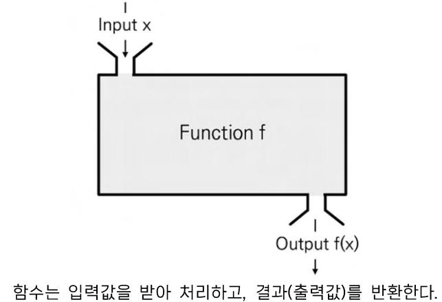

### ① 단일행 함수(Single-Row Functions)

- • 하나의 입력 값에 대해 하나의 결과를 반환하는 함수 (1:1 관계)
- ■ 각 행들에 대해 개별적으로 작용하여 데이터 값들을 조작하고, 각각의 행에 대한 조작 결과를 반환한다는 뜻
- • 주로 데이터 변환이나 조작에 사용
- • 보통 SELECT, WHERE, ORDER BY절에서 사용된다.
- • 함수 종첩 가능 ex) UPPER(CONCAT(first\_name, ' , last\_name))

```
SELECT UPPER(name), SUBSTRING(name, 1, 3)
FROM EMPLOYEE
WHERE LENGTH(name) > 5
ORDER BY LOWER(name);
```

## ② 복수행 (다중행) 함수(Multi-Row Functions)

- • 여러 행의 데이터를 하나의 결괏값으로 반환하는 함수
- • 주로 합계, 평균, 개수, 최대/최소 값 등을 계산하는 데 사용
- • 이런 집계를 목적으로 하는 함수들이 GROUP BY와 잘 어울리져 사용됨
- • 보통 SELECT, HAVING 절에서 사용 (ORDER BY 절에서도 사용 가능)

```
SELECT department, AVG(salary) AS average_salary
FROM EMPLOYEE
GROUP BY department
HAVING AVG(salary) > 3000
ORDER BY average_salary DESC;
```

## ▶ 합성 연산

```
-- (1) || (Oracle)
SELECT FIRST_NAME || ' ' || LAST_NAME AS FULL_NAME
FROM EMPLOYEES;
-- (2) + (SQL Server)
SELECT FIRST_NAME + ' ' + LAST_NAME AS FULL_NAME
FROM EMPLOYEES;
-- (3) CONCAT
SELECT CONCAT('Hello, ', 'World!') AS greeting;
```

## ▶ 숫자형 함수 모음: 단일행 함수

| 함수             | 기능                      | 예시                          | 출력      | 추가설명                  |                      |
|----------------|-------------------------|-----------------------------|---------|-----------------------|----------------------|
| ABS(x)         | x의 절대값 반환               | ABS(-1)                     | 1       |                       |                      |
| SIGN(x)        | x가 양수면 1, 음수면 -1 반환     | SIGN(100)                   | 1       | SING(0)은 0반환          |                      |
| CEIL(x)        | x보다 크거나 같은 최소 정수 반환     | CEIL(5.3)                   | 6       | SQL Server: CEILING   |                      |
|                |                         | CEIL(-5.3)                  | -5      |                       |                      |
| FLOOR(x)       | x보다 작거나 같은 최대 정수 반환     | FLOOR(1.8)                  | 1       |                       |                      |
|                |                         | FLOOR(-1.8)                 | -2      |                       |                      |
| MOD(x, y)      | x를 y로 나눈 나머지 반환         | MOD(9, 2)                   | 1       |                       |                      |
| ROUND(x, d)    | x를 소수점 d자리까지 반올림        | ROUND(2.718, 2)             | 2.72    |                       |                      |
|                |                         | ROUND(2.718, 0)             | 3       | d자리 생략 = 0자리 반올림      |                      |
|                |                         | ROUND(272, -1)              | 270     | d < 0 이면, 정수 자리에서 반올림 |                      |
| POWER(x, n)    | x를 n 제곱한 값 반환           | POWER(3, 2)                 | 9       |                       |                      |
| SQRT(x)        | x의 제곱근 값 반환             | SQRT(100)                   | 10      |                       |                      |
| TRUNCATE(x, d) | x를 지정한 소수점 d자리까지 잘라서 버림 | TRUNCATE<br>(1234.5678, 2)  | 1234.56 |                       |                      |
|                |                         | TRUNCATE<br>(1234.5678, 0)  | 1234    |                       |                      |
|                |                         | TRUNCATE<br>(1234.5678, -2) | 1200    |                       | d < 0 이면, 정수 자리에서 자름 |

▶ 문자열 함수 모음 (ORACLE): 문자열 결합 · 추출 · 삭제, 단일행 함수

| 함수                                       | 기능                                       | 예시                               | 출력     | 추가설명                                                                        |
|------------------------------------------|------------------------------------------|----------------------------------|--------|-----------------------------------------------------------------------------|
| LOWER(s)                                 | 소문자로 변환                                  | LOWER('Ab')                      | ab     |                                                                             |
| UPPER(s)                                 | 대문자로 변환                                  | UPPER('aB')                      | AB     |                                                                             |
| ASCII(s)                                 | ASCII 코드 번호로 변환                          | ASCII('A')                       | 65     |                                                                             |
| CHR(ascii_no)                            | ASCII 번호를 문자나 숫자로                        | CHR(65)                          | A      |                                                                             |
| CONCAT(s1, s2)                           | 문자열 결합                                   | CONCAT('A', 'B')                 | AB     |                                                                             |
| SUBSTR(s, m, n)                          | m위치에서<br>n개의 문자열 추출                      | SUBSSTR('ABCDE', 2, 3)           | BCD    |                                                                             |
|                                          |                                          | SUBSSTR('ABCDE', 2)              | BCDE   | n 생략 시 끝까지 추출                                                               |
|                                          |                                          | SUBSSTR('ABCDE', -4, 3)          | BCD    | 뒤에서 4번째 부터 오른쪽방향으로 스캔해 3개의 문자열 추출                                           |
| INSTR(s, sub_s, m, n)                    | 찾는 문자열 위치 반환<br>(m: 시작 위치<br>n: n번째 발견된) | INSTR('banana', 'a')             | 2      | m, n 생략 시 m, n = 1 로 간주                                                     |
|                                          |                                          | INSTR('banana', 'a', 3, 2)       | 6      | 3번째 위치에서부터 스캔해 2번째 발견된 a의 위치                                                |
|                                          |                                          | INSTR('banana', 'a', -3, 1)      | 4      | 뒤에서 3번째에서 왼쪽으로 스캔해 1번째로 발견된 a의 위치<br>만일 n > 2 면 0을 반환 (a는 최대 2번 찾게 되는 위치니까) |
| LENGTH(s)                                | 길이 반환                                    | LENGTH('AB CD')                  | 5      |                                                                             |
| LTRIM(s, remove_s)                       | 특정 문자열을 왼쪽에서 삭제                          | LTRIM('#A#B#C#', '#')            | A#B#C# | 삭제할 문자열 생략 시 공백 삭제                                                          |
| TRIM([leading   both   trailing] FROM s) | 특정 문자열을 왼/양/오른쪽에서 삭제                     | TRIM(BOTH '#' FROM '#A#B#C#')    | A#B#C  | 삭제할 문자열 생략 시 공백 삭제                                                          |
| RTRIM(s, remove_s)                       | 특정 문자열을 오른쪽에서 삭제                         | RTRIM('#A#B#C#', '#')            | #A#B#C | 삭제할 문자열 생략 시 공백 삭제                                                          |
| LPAD(s, n, pad_s)                        | 왼쪽에 특정 문자열을 추가하여 총 n길이의 문자열 리턴           | LPAD('abc', 5, '0')              | 00abc  |                                                                             |
| RPAD(s, n, pad_s)                        | 오른쪽에 특정 문자열을 추가하여 총 n길이의 문자열 리턴          | RPAD('abc', 5, '0')              | Abc00  |                                                                             |
| REPLACE<br>(s, old_s, new_s)             | 문자열 s에서 old_s를 new_s로 대체                 | REPLACE<br>('ABBAC', 'AB', 'ab') | abBAC  | 3번째 인수 생략 or 빈문자열 전달 시 old_s 삭제                                             |
| TRANSLATE<br>(s, old_s, new_s)           | 글자를 1대1로 치환                              | REPLACE<br>('ABBAC', 'AB', 'ab') | abbaC  | A는 a로, B는 b로 매칭되는 글자끼리 각각 치환됨<br>3번째 인수가 필수며 빈문자열 전달 시 NULL 반환              |

SQL SERVER: SUBSTR → SUBSTRING, LENGTH → LEN, INSTR → CHARINDEX

▶ 날짜형 함수 모음 (ORACLE): 단일행 함수

| 함수                                                                                          | 기능                                                     | 예시                                      | 출력                         |
|---------------------------------------------------------------------------------------------|--------------------------------------------------------|-----------------------------------------|----------------------------|
| SYSDATE                                                                                     | 현재 날짜와 시간 반환                                           | SYSDATE                                 | 2024/11/11 23:30:45        |
| CURRENT_DATE                                                                                | 현재 날짜 반환                                               | CURRENT_DATE                            | 2024/11/11                 |
| CURRENT_TIMESTAMP                                                                           | 현재 타임스탭프 반환                                            | CURRENT_TIMESTAMP                       | 2024/11/11 23:30:45 +09:00 |
| EXTRACT<br>(year   month   day from d)                                                      | 날짜 d에서 년/월/일 추출                                        | EXTRACT<br>(DAY from SYSDATE)           | 11                         |
| ADD_MONTHS(d, n)                                                                            | 날짜 d에서 n개월 후 날짜 반환<br>( n < 0 이면 n개월 전)                | ADD_MONTHS(SYSDATE, 2)                  | 2025/01/11                 |
| TO_NUMBER(TO_CHAR(d, 'YYYY'))<br>TO_NUMBER(TO_CHAR(d, 'MM'))<br>TO_NUMBER(TO_CHAR(d, 'DD')) | 날짜 d에서 년/월/일 추출                                        | TO_NUMBER<br>(TO_CHAR(SYSDATE, 'YYYY')) | 2024                       |
| MONTHS_BETWEEN(d1, d2)                                                                      | d1과 d2의 개월 차이 반환                                       | MONTHS_BETWEEN<br>(SYSDATE, HIREDATE)   | 17.9                       |
| LAST_DAY(d)                                                                                 | 주어진 월의 마지막 날 반환                                        | LAST_DAY(SYSDATE)                       | 2024/11/31                 |
| NEXT_DAY(d, n)                                                                              | 날짜 d 이후<br>지정된 요일의 첫 날짜 반환<br>n: 1(일), 2(월), ..., 7(토) | NEXT_DAY(SYSDATE, 1)                    | 2024/11/17                 |

※ DBMS마다 날짜 출력 형식은 다르다.

SQL SERVER:

SYSDATE → GETDATE(),

EXTRACT(year | month | day from d) → DATEPART(year | month | day, d)

ADD\_MONTHS(d, n) → DATEADD(year | month | day, d, n) 월 뿐만이 아니라 모든 날짜 단위 연산이 가능하다

TO\_NUMBER(TO\_CHAR(d, 'YYYY' | 'MM'| 'DD')) → YEAD(d), MONTH(d), DAY(d)

MONTHS\_BETWEEN(d1, d2) → DATEDIFF(year | month | day, d1, d2)

▶ 변환 함수 모음: 단일행 함수

| ORACLE 함수                     | 기능                                              | 예시                                      | 출력(설명)                          |
|-------------------------------|-------------------------------------------------|-----------------------------------------|---------------------------------|
| TO_NUMBER(문자)                 | 숫자형으로 변환 후 반환                                   | TO_NUMBER('100')                        | 100                             |
| TO_CHAR(대상, 포맷)               | 날짜를 주어진 포맷 형태로 변환                               | TO_CHAR<br>(SYSDATE, 'DD.MM.YYYY')      | 10.11.2024                      |
|                               | 숫자를 주어진 포맷 형태로 변환<br>(0과 9는 자릿수를 표현)            | TO_CHAR(1250, '9,999')                  | 1,250<br>(천 단위 구분자 생김)          |
|                               |                                                 | TO_CHAER(1250, '00000')                 | 01250<br>(총 다섯자리로 변환)           |
| TO_DATE(문자, 포맷)               | 문자를 포맷 형태에<br>맞게 날짜로 반환<br>(문자와 포맷 스타일이 일치해야 함) | TO_DATE<br>('2024.10.31', 'YYYY.MM.DD') | (날짜형으로 반환됨)                     |
| SQL SERVER 함수                 | 기능                                              | 예시                                      | 출력(설명)                          |
| FORMAT(날짜, 포맷)                | 날짜의 포맷 변환                                       | FORMAT(GETDATE(), 'YYYY')               | 2024                            |
| CAST(대상 AS 데이터타입)             | 대상을 주어진<br>데이터타입으로 변환<br>(ORACLE에서도 동일)         | CAST(123.45 AS INT)                     | 123                             |
|                               |                                                 | CAST('1250' AS INT)                     | 1250                            |
| CONVERT<br>(데이터타입, 대상, [스타일]) | 대상을 주어진<br>데이터타입으로 변환                           | CONVERT(INT, 123.45)                    | 123                             |
|                               |                                                 | CONVERT(VARCHAR(10),<br>GETDATE(), 101) | 10/11/2024<br>(101: MM/DD/YYYY) |

일반적인 데이터 형식 변환에는 CAST를 사용할 수 있지만,

날짜 및 시간 변환 시 특정 형식을 요구하는 경우에는 CONVERT를 사용하는 것이 좋다.

- ▶ 집계 함수 모음: 복수행(다중행) 함수, NULL 값은 0으로 계산되는 것이 아니라 무시된다!!

| 함수           | 기능                   | 예시                                      |
|--------------|----------------------|-----------------------------------------|
| COUNT(*)     | NULL 값 포함 전체 행의 수 반환 | SELECT COUNT(*) FROM EMP;               |
| COUNT(칼럼)    | 행의 수 반환              | SELECT COUNT(BOOK_NAME) FROM BOOK_LIST; |
| SUM(칼럼)      | 총 합 반환               | SELECT SUM(SAL) FROM EMP;               |
| AVG(칼럼)      | 평균 반환                | SELECT AVG(SAL) FROM EMP;               |
| MIN(칼럼)      | 최솟값 반환               | SELECT MIN(SAL) FROM EMP;               |
| MAX(칼럼)      | 최댓값 반환               | SELECT MAX(SAL) FROM EMP;               |
| STDDEV(칼럼)   | 표준편차 반환              | SELECT STDDEV(SAL) FROM EMP;            |
| VARIANCE(칼럼) | 분산 반환                | SELECT VARIANCE(SAL) FROM EMP;          |

MAX(), MIN()은 날짜형 데이터에도 사용이 가능하다. ex) MAX(ORDER\_DATE): 가장 최근 주문 날짜 반환

SQL SERVER:

STDDEV → STDEV, VARIANCE() → VAR()

- ▶ NULL 관련 함수 및 기타 함수 모음 (ORACLE) ★★★

| 함수                                           | 기능                                                                                   |
|----------------------------------------------|--------------------------------------------------------------------------------------|
| NVL(a, b)                                    | a가 NULL이면 b 반환,<br>NULL이 아니면 a 반환                                                    |
| NVL2(a, b, c)                                | a가 NULL이면 c로 반환,<br>NULL이 아니면 b 반환                                                   |
| NULLIF(a, b)                                 | a = b 면 NULL 반환,<br>a ≠ b 면 a 반환                                                     |
| ISNULL(a, b)<br>#SQL SERVER 함수임              | a가 NULL이면 b 반환,<br>NULL이 아니면 a 반환                                                    |
| COALESCE(a, b, c, .....)                     | 인수들 중 가장 처음으로 NULL이 아닌 값 반환,<br>인수들이 모두 NULL이면 NULL반환                                |
| DECODE(대상, 값1, 리턴1,<br>값2, 리턴2, ..., ELSE 값) | 대상 = 값1이면 리턴1 반환,<br>대상 = 값2이면 리턴2 반환, ...,<br>그 외에는 ELSE 값 반환 (ELSE 값 생략 시 NULL 반환) |

▶ CASE 표현

- - 일반 프로그램의 IF-THEN-ELSE-END 로직과 같음
- - ORACLE의 DECODE() 함수와 같은 기능을 가짐

① SIMPLE\_CASE\_EXPRESSION: 특정 값과의 일치 평가  
[구문]

```
CASE expression
  WHEN value1 THEN result1
  WHEN value2 THEN result2
  ELSE default_result
END
```

예시:

```
SELECT
  CASE JOB
    WHEN 'Manager' THEN 'Management'
    WHEN 'Developer' THEN 'Engineering'
    WHEN 'Sales' THEN 'Sales Department'
    ELSE 'General'
  END AS DEPARTMENT
FROM EMPLOYEES;
```

직원 직업에 따른 부서 할당

```
SELECT
  CASE
    WHEN JOB = 'Manager' THEN 'Management'
    WHEN JOB = 'Developer' THEN 'Engineering'
    WHEN JOB = 'Sales' THEN 'Sales Department'
    ELSE 'General'
  END AS DEPARTMENT
FROM EMPLOYEES;
```

② SEARCHED\_CASE\_EXPRESSION: 개별 조건 평가

[구문]

```
CASE
  WHEN condition1 THEN result1
  WHEN condition2 THEN result2
  ELSE default_result
END
```

예시:

```
SELECT
  CASE
    WHEN PRICE > 50000 THEN 'High'
    WHEN PRICE > 30000 THEN 'Medium'
    ELSE 'Low'
  END AS Quality
FROM PRODUCTS;
```

상품 가격에 따른 퀄리티 구분

```
SELECT
  CUSTOMER_ID,
  TOTAL_ORDER,
  CASE
    WHEN TOTAL_ORDER >= 100000 THEN 'VIP'
    WHEN TOTAL_ORDER >= 50000 THEN 'S'
    WHEN TOTAL_ORDER >= 20000 THEN 'A'
    ELSE 'B'
  END AS CUSTOMER_GRADE
FROM CUSTOMERS;
```

총 주문 상품량에 따른 고객별 등급 구분

## 제 4절 WHERE 문

### 1. 특징

- - 테이블의 데이터 중 원하는 조건에 맞는 데이터만 조회하고 싶을 때 사용(엑셀의 필터기능 같은 것)
- - 즉, 조건을 설정하여 원하는 데이터만 검색하기 위해 사용하는 절
- - 여러 조건 동시 전달도 가능(AND 나 OR로 조건 연결)
- - **NULL은 '='로 조회가 불가능, IS NULL / IS NOT NULL을 사용**
- - 조건 전달 시 비교 대상끼리 데이터 타입이 일치하는 것이 좋음 ex) 숫자 데이터 타입을 문사 상수로 비교 시 성능 문제 발생 가능
- - **집계 함수 사용 불가**

### 2. WHERE 절 구문

```
SELECT [DISTINCT/ALL] 칼럼명 [ALIAS명]
FROM 테이블명
WHERE 조건식;
```

### 3. 주의!

- - **집계함수는 WHERE 절에서의 사용이 불가능하다.**
- - WHERE 절은 각 행을 개별적으로 필터링하기 때문에 여러 행의 데이터를 요약하여 하나의 결과를 생성하는 집계함수의 사용이 불가능한 것.
- - GROUP BY를 통해 그룹화된 결과에 대한 조건을 적용할 때, 집계함수를 조건절에 사용할 수 있게 된다.
- - 해당 조건은 HAVING 절에 넣어주면 된다.

```
GROUP BY department
HAVING AVG(salary) > 3000
```

### [연산자의 종류]

| 구분         | 연산자                 | 연산자의 의미               |
|------------|---------------------|-----------------------|
| 비교 연산자     | =                   | 같다                    |
|            | >                   | 보다 크다                 |
|            | >=                  | 보다 크거나 같다             |
|            | <                   | 보다 작다                 |
|            | <=                  | 보다 작거나 같다             |
| SQL 연산자    | BETWEEN a AND b     | a와 b값 사이 (a, b 포함)    |
|            | IN (list)           | 리스트에 있는 값             |
|            | LIKE '비교문자열'        | 비교문자열과 형태 일치          |
|            | IS NULL             | NULL 값인 경우            |
| 논리 연산자     | AND                 | 앞,뒤 조건 모두 만족          |
|            | OR                  | 앞, 뒤 조건 중 하나만 참       |
|            | NOT                 | 뒤에 오는 조건에 반대되는 결과 돌려줌 |
| 부정 비교 연산자  | !=                  | 같지 않다                 |
|            | ^=                  | 같지 않다                 |
|            | <>                  | 같지 않다 (ISO표준)         |
|            | NOT 칼럼명 =           | ~와 같지 않다              |
| 부정 SQL 연산자 | NOT 칼럼명 >           | ~보다 크지 않다             |
|            | NOT BETWEEN a AND b | a와 b값 사이에 X (a, b 포함) |
|            | NOT IN (list)       | 리스트에 없는 값             |
|            | IS NOT NULL         | NULL 값을 가지지 않음        |

### [연산자의 우선 순위]

| 연산 우선순위 | 설명               |
|---------|------------------|
| 1       | 괄호               |
| 2       | 부정 연산자 (NOT 연산자) |
| 3       | 비교 연산자, SQL 연산자  |
| 4       | AND              |
| 5       | OR               |

## 4. Where 과 논리 연산자

```
SELECT 사원번호, 이름, 연력처
FROM EMPLOYEES
WHERE 부서 = '마케팅부' AND 급여 >= 3000000;
```

마케팅부이며 급여를 300만원 이상으로 받는 사원

```
SELECT * FROM BOOKSHELF
WHERE PUBLISHER = '민음사' OR PRICE < 15000;
```

출판사가 민음사이거나 가격이 15000원 미만인 책 조회

### ✓ 주의할 점

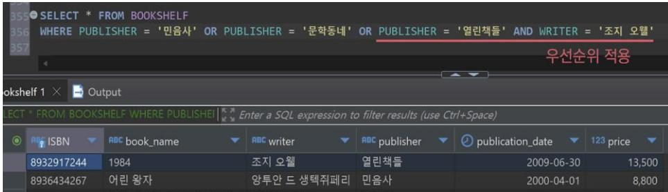

우선순위가 더 높은 AND 연산자가 OR 연산자보다 우선적으로 실행된다.

```
SELECT * FROM BOOKSHELF
WHERE PUBLISHER = '민음사' OR PUBLISHER = '문학동네' OR (PUBLISHER = '열린책들' AND WRITER = '조지 오웰')
```

따라서 위 쿼리는 이렇게 해석되는 것이다.

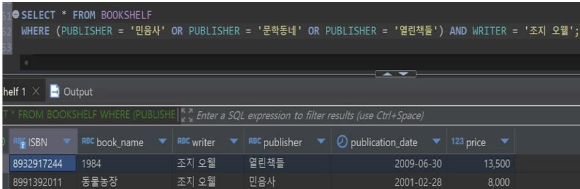

## 5. WHERE 과 IN

- - 특정 컬럼의 값이 지정된 목록 중에서 일치하는 값이 있는지 확인
- - OR 사용해 표현이 가능하지만, IN을 사용하면 쿼리가 훨씬 간결해짐
- - IN은 NULL값을 무시
- - NOT IN은 IN의 반대 연산자로, 목록에 없는 값을 필터링

```
SELECT * FROM EMPLOYEES
WHERE 부서 IN ('개발부', '영업부', '마케팅부');
```

```
SELECT * FROM EMPLOYEES
WHERE 부서 = '개발부' OR 부서 = '영업부' OR 부서 = '마케팅부';
```

개발부이거나 영업부이거나 마케팅부인 사원 조회

```
SELECT * FROM EMPLOYEES
WHERE 부서 NOT IN ('개발부', '영업부', '마케팅부');
```

개발부나 영업부, 마케팅부가 아닌 사원 조회

```
SELECT ENAME, JOB, DEPTNO
FROM EMP
WHERE (JOB, DEPTNO) IN (('MANAGER', 20), ('CLERK', 30));
```

직업이 MANAGER이면서 20번 부서에 속하거나  
직업이 CLERK이면서 30번 부서에 속하는 사원 조회

```
SELECT ENAME, JOB, DEPTNO
FROM EMP
WHERE JOB IN ('MANAGER', 'CLERK') AND DEPTNO IN (20, 30);
```

직업이 MANAGER이거나 CLERK이면서  
20번이나 30번 부서에 속하는 사원 조회

## 6. WHERE 과 BETWEEN A AND B

- - A 보다 크거나 같고 B 보다 작거나 같은 조건을 만족 (반드시  $A < B$ )
- - A와 B에는 범위로 묶을 상수값 전달(숫자, 문자, 날짜 모두 가능)

```
SELECT * FROM BOOKSHELT
WHERE PRICE BETWEEN 15000 AND 20000;
```

```
SELECT * FROM BOOKSHELT
WHERE PRICE >= 15000 AND PICE <= 20000;
```

가격이 15000원 이상이며 20000원 이하인 책 정보 조회

```
SELECT * FROM BOOKSHELT
WHERE PRICE NOT BETWEEN 15000 AND 20000;
```

가격이 15000원 이상이며 20000원 이하가 아닌 책 정보 조회

## 7. WHERE 과 LIKE (LIKE 연산자는 대소문자 구분함)

- - LIKE는 특정 패턴과 일치하는 데이터를 조회할 때 사용
- - 주로 와일드카드와 함께 사용되어 부분적으로 일치하는 문자열을 찾음

※ 와일드카드

% : 0개 이상의 문자를 대체 = 해당 위치에 몇 글자만 올 수 있음

\_ : 딱 1개의 문자만을 대체 = 해당 위치에 반드시 한 글자만 올 수 있음

```
WHERE 이름 LIKE 'S%':           이름이 S로 시작
WHERE 이름 LIKE '%S%':           이름이 S를 포함
                                     (즉, S로 시작하거나, 끝나는 데이터도 포함)
WHERE 이름 LIKE '%S':           이름이 S로 끝남
WHERE 이름 LIKE '_S':            이름이 3글자며 S로 끝남
WHERE 이름 LIKE '_S%':           이름의 두 번째 글자가 S
WHERE 이름 LIKE '_S_':           이름이 5글자며 가운데 글자가 S
```

## 8. WHERE 과 IS NULL

- - NULL값과의 수치연산은 NULL값 리턴
- - NULL값과의 비교연산은 거짓을 리턴

- ■ 따라서 비교연산자 '=', '>', '<', 사용 시 WHERE 절의 조건이 FALSE가 되어 WHERE 절의 조건을 만족하는 데이터를 한 건도 얻지 못하게 됨
- - 어떤 값과 비교할 수도 없으며, 특정 값보다 크다, 적다라고 표현 불가

```
SELECT PLAYER_NAME, TEAM_NAME
FROM PLAYER
WHERE POSITION IS NULL;
```

포지션이 없는 선수 조회

## 제 5절 GROUP BY와 HAVING 절

### 1. GROUP BY 절

- - 데이터들을 작은 그룹으로 분류하여 소그룹에 대한 항목별 통계 정보를 얻을 때 사용

ex) 각 팀별 선수들의 평균 신장, 카테고리별 총 매출, 부서별 사원 수 등

- - 각 행을 특정 조건에 따라 그룹으로 분리하여 계산하도록 함
- - 그룹 관련 조건은 WHERE 절에서 사용 불가, HAVING 절에서 사용
- - SELECT 절에 집계함수를 사용해서 그룹별 연산 결과를 표현하도록 함
- - 별칭(ALIAS) 사용 불가능

- ■ 컬럼 별칭은 SELECT 절에서 정의되어 SELECT 구문이 실행될 때 만들어지는 이름이라 SELECT 이전에 실행되는 단계인 GROUP BY나 WHERE 절에서는 사용이 불가능하다.

- - 성능 저하를 막기 위해 그룹 연산에서 필요가 없는 데이터는 미리 WHERE 절을 통해 제외해두자.

- - 여러 컬럼을 기준으로 그룹화하는 것도 가능

## 2. 주의!

- GROUP BY로 그룹화를 한 이후에는 그룹화 기준이 아닌 컬럼을 SELECT 절에 사용할 수 없다.

```
SELECT POSITION, COUNT(*) 인원수, HEIGHT  
FROM PLAYER  
GROUP BY POSITION
```

오류

- 이렇게 작성하면 포지션별로 묶어 각 포지션별 인원수와 키를 출력하라는 건데, 이 때 각 포지션별 키는 단 하나의 값이 아니라 여러 값이 존재한다.

- 그룹으로 묶인 상태라 그룹별 하나의 행을 반환해야 하는데 키 값은 여러 개니 에러가 날 수밖에 없다.

(SQL엔진 입장에서 많은 키 값 중 하나만 꼭 집어서 반환할 수가 없음)

```
SELECT POSITION, COUNT(*) 인원수, ROUND(AVG(HEIGHT),2) 평균키  
FROM PLAYER  
GROUP BY POSITION
```

- 그룹화되지 않은 컬럼을 사용하고 싶다면 집계 함수를 통해 각 그룹에서 해당 컬럼을 요약해야 한다.

## 3. HAVING 절

- - 그룹화된 결과에 대한 조건을 적용할 때 사용하는 절
- - HAVING 절이 GROUP BY 절 앞에 위치해도 되나, 논리적 실행 순서에 맞게 GROUP BY 뒤에 쓰는 것을 권장
- - HAVING 절이 SELECT 절보다 먼저 수행되니 SELECT절에서 선언된 ALIAS사용 불가

```
SELECT TEAM_ID ID, COUNT(*)  
FROM PLAYER  
WHERE TEAM_ID IN ('K03', 'K09')  
GROUP BY TEAM_ID  
HAVING AVG(SALARY) > 25000;
```

특정 팀('K03', 'K09')에 속한 선수들의 팀별 총 인원 수를 조회  
단, 각 팀의 평균 연봉(SALARY)이 25000을 초과하는 경우만

## 4. GROUP BY 절과 HAVING 절의 특성 정리

- • GROUP BY 절을 통해 소그룹별 기분을 정한 후, SELECT 절에 집계 함수를 사용한다.
- • 집계 함수의 통계 정보는 NULL 값을 가진 행을 제외하고 수행한다.
- • ALIAS 명을 사용할 수 없다.
- • 집계 함수는 WHERE 절에는 올 수 없다.
- • WHERE 절은 전체 데이터를 GROUP으로 나누기 전에 행들을 미리 제거한다.
- • HAVING 절은 GROUP BY 절의 기준 항목이나 소그룹의 집계 함수를 이용한 조건을 표시할 수 있다.
- • GROUP BY 절에 의한 소그룹별로 만들어진 집계 데이터 중, HAVING 절에서 제한조건을 두어 조건을 만족하는 내용만 출력한다.
- • HAVING 절은 일반적으로 GROUP BY 뒤에 위치한다.

## DUAL 테이블의 특성

- - 23c이전 버전의 오라클에서는 SELECT 문 작성시 FROM 절 필수
- - 그래서 데이터를 가져올 테이블이 필요 없는 경우 DUAL 테이블을 사용 (Sybase나 SQL Server의 경우 SELECT 절만으로도 수행 가능)
- - 사용자 SYS가 소유하며 모든 사용자가 액세스 가능한 테이블 (SYS: DB의 관리자 계정 )
- - SELECT ~ FROM ~ 의 형식을 갖추기 위한 일종의 DUMMY 테이블
- - DUMMY라는 문자열 유형의 칼럼에 'X'라는 값 1건 포함

### DESC DUAL

| Name  | Null? | Type        |
|-------|-------|-------------|
| DUMMY |       | VARCHAR2(1) |

DUAL 테이블의 구조

### SELECT \* FROM DUAL;

#### DUMMY

#### X

DUAL 테이블의 컬럼과 값

## 제 6절 ORDER BY 절

### 1. ORDER BY 절

- - 원칙적으로 관계형 데이터베이스 환경에서는 ORDER BY 절을 명시해야 데이터 정렬이 수행된다.
- - ORDER BY 뒤에 정렬의 기준이 되는 컬럼을 명시하면 된다.  
  (여러 컬럼이 기준 시, 가장 왼쪽 컬럼부터 우선순위가 적용됨)
- - 정렬 순서: ASC(오름차순), DESC(내림차순) / 기본 값: ASC
- - **유일하게 SELECT 절에 정의한 컬럼 별칭 사용 가능**
- - 숫자 뿐만이 아니라 문자, 날짜 타입도 정렬 가능
- - 문자 데이터의 경우 첫 번째 문자가 같은 값이면, 두 번째 값을 기준으로 정렬한다.
- - **ORACLE에서 NULL은 최댓값, SQL Server에서는 최솟값**
- - ORACLE은 ORDER BY 절에 NULL LAST | NULL FISRT 을 명시해 NULL의 정렬 순서 변경이 가능
- - **GROUP BY로 그룹화를 했을 시 ORDER BY에 올 수 있는 컬럼은 SELECT 절에 있는 컬럼만 가능하다.**

### 2. ORDER BY 구문

```
SELECT 칼럼명
FROM 테이블명
WHERE 조건식
GROUP BY 그룹핑칼럼명
HAVING 그룹 조건식
ORDER BY 정렬칼럼명 [ASC | DESC]
```

### 3. 예시

| 44-1                         |                    | 44-2                                   |                               | 44-3                                                      |                        |
|------------------------------|--------------------|----------------------------------------|-------------------------------|-----------------------------------------------------------|------------------------|
| SELECT * FROM POP_SONG_CHART |                    | ORDER BY SINGER ASC, LIKE_NUMBER DESC; |                               | 왼쪽부터 우선순위 적용                                              |                        |
| pop_song_chart 1             |                    | SELECT * FROM POP_SONG_CHART ORDER BY  |                               | Enter a SQL expression to filter results (use Ctrl+Space) |                        |
|                              |                    |                                        |                               |                                                           |                        |
| 1                            | <b>123</b> ranking | <b>BBC song</b>                        | <b>BBC singer</b>             | <b>BBC album</b>                                          | <b>123 like_number</b> |
| 1                            | <b>5</b>           | Kiss Me More                           | Doja Cat                      | Planet Her                                                | 2,500,000              |
| 2                            | 2                  | Levitating                             | Dua Lipa                      | Future Nostalgia                                          | 1,803,258              |
| 3                            | 10                 | Heat Waves                             | Glass Animals                 | Dreamland                                                 | 1,629,580              |
| 4                            | 4                  | Peaches                                | Justin Bieber                 | Justice                                                   | 900,000                |
| 5                            | 9                  | MONTERO (Call Me By Your Name)         | Lil Nas X                     | MONTERO                                                   | 124,820                |
| 6                            | <b>6</b>           | drivers license                        | Olivia Rodrigo                | SOUR                                                      | 2,705,300              |
| 7                            | 8                  | Good 4 U                               | Olivia Rodrigo                | SOUR                                                      | 1,492,817              |
| 8                            | 7                  | Stay                                   | The Kid LAROI & Justin Bieber | Stay                                                      | 1,972,000              |
| 9                            | 3                  | Save Your Tears                        | The Weeknd                    | After Hours                                               | 2,200,000              |
| 10                           | 1                  | Blinding Lights                        | The Weeknd                    | After Hours                                               | 2,000,500              |

- • 출력된 데이터를 보면, singer순으로는 정렬이 제대로 되어있지만, like\_number의 경우 제대로 정렬이 되어있지 않는 모습을 확인할 수 있다.

- ⇒ 하나의 행은 세트로 같이 움직이니 두 조건을 모두 완벽하게 만족하면서 정렬하는 것은 불가능하다.

- ⇒ 그렇다면 왜 굳이 여러 열을 기준으로 데이터를 출력하는 걸까?

- • 1차 정렬의 기준이 된 컬럼을 기준으로 동일한 값을 가지는 행들의 경우 두 번째 컬럼을 기준으로 정렬(2차 정렬)이 되는데, 이를 통해 세부적인 정렬이 가능하기 때문이다.

- ⇒ 즉, 1차 정렬한 값이 같은 행들에 한해서 2차 정렬이 일어난다는 것.

- ⇒ 따라서 동일한 값이 나올 수 없는 데이터는 굳이 2차 정렬을 할 필요가 없다.

## 제 7절 조인(JOIN)

### 1. 조인

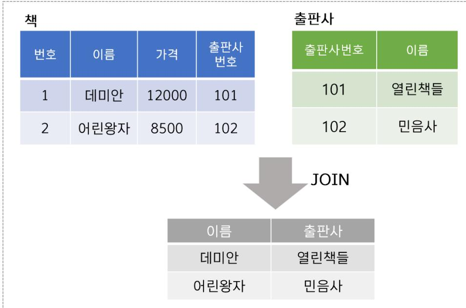

- - 여러 테이블의 데이터를 동시에 출력하거나 참조할 때 사용한다.
- - 여러 테이블을 연결하거나 결합하여 하나의 결과 집합으로 만드는 방법
- - 여러 테이블에 나뉘어 있는 관련 데이터를 하나의 조합 결과로 모음
- - **일반적인 경우 행들은 PK나 FK 값의 연관에 의해 조인이 성립된다.**
- - 하지만 어떤 경우에는 PK, FK 관계가 없어도 논리적인 값들의 연관만으로 조인이 성립된다.
- - FROM 절에 여러 테이블이 나열되더라도 SQL에서 데이터를 처리할 때는 **단 2개의 집합 간에만 조인이 일어난다.**
- ■ 예로 FROM A, B, C 라면 A JOIN B가 먼저 실행되고 A JOIN B의 결과 집합과 남은 테이블 C과의 조인이 일어난다는 것

- - 여러 테이블을 조인 시, SELECT 절에 적는 컬럼은 해당 컬럼이 어느 테이블에 존재하는 컬럼인지를 명시해야 한다.

- ■ 같은 이름의 컬럼이 다른 테이블에도 존재할 수 있기 때문에
- ■ 가독성이나 유지보수성 높이기 위해서도 명시하는 게 좋음
- - ORACLE 표준과 ANSI/ISO SQL 표준이 다르다.
- - 가독성을 높이기 위해 테이블에 별칭을 붙이는 경우가 많다.

**※ N개의 테이블 조인 시 최소 N-1개의 조인 조건 필요**

### 2. 조인의 종류

1. ① 조건의 형태에 따른 구분
   1. 1) EQUI JOIN: 조인 조건이 동등(=) 조건일 경우
   2. 2) NON EQUI JOIN: 조인 조건이 동등 조건이 아닌 경우
2. ② 조인 결과에 따른 구분
   1. 1) INNER JOIN: 두 테이블간 조인 조건이 일치하는 데이터만 출력
   2. 2) OUTER JOIN: 두 테이블간 조건이 일치하지 않는 데이터도 출력

종류: LEFT / RIGHT / FULL OUTER JOIN

1. ③ NATURAL JOIN
   - - 두 테이블에서 같은 이름을 가진 컬럼을 자동으로 찾아 조인
2. ④ CROSS JOIN
   - - **두 테이블의 모든 조합을 생성하는 조인** (Cartesian Product 반환)
   - - ORACLE: FROM t1,t2 + WHERE 절에 조건 명시하지 않을 시 발생
   - - ANSI: t1 CROSS JOIN t2 + on으로 조인 조건 명시 X
3. ⑤ SELF JOIN
   - - 같은 테이블을 두 번 이상 참조하는 조인

### 3. EQUI JOIN

- 등가(EQUI) JOIN은 2개의 테이블 간에 컬럼 값들이 서로 정확하게 일치하는 경우에 사용되는 방법으로 보통 PK  $\leftrightarrow$  FK 관계를 기반으로 한다.

(반드시 PK  $\leftrightarrow$  FK 의 관계로만 EQUI JOIN이 성립한다는 게 아님)

| [ORACLE]               | [ANSI/ISO SQL]     |
|------------------------|--------------------|
| 조인 조건을 <b>WHERE 절에</b> | 조인 조건을 <b>ON절에</b> |

```
-- ORCALE  
SELECT 테이블1.칼럼 , 테이블2.칼럼 , ...  
FROM 테이블1, 테이블2  
WHERE 테이블1.칼럼 = 테이블2.칼럼;
```

```
-- ANSI/ISO SQL  
SELECT 테이블1.칼럼 , 테이블2.칼럼 , ...  
FROM 테이블1  
INNER JOIN 테이블2  
ON 테이블1.칼럼 = 테이블2.칼럼;
```

```
-- ORCALE  
SELECT P.PLAYER_NAME 선수명, P.BACK_NO 등번호, P.TEAM_ID 팀코드,  
T.TEAM_NAME 팀명, T.REGION_NAME 연고지  
FROM PLAYER P, TEAM T  
WHERE P.TEAM_ID = T.TEAM_ID;
```

```
-- ANSI/ISO SQL  
SELECT P.PLAYER_NAME 선수명, P.BACK_NO 등번호, P.TEAM_ID 팀코드,  
T.TEAM_NAME 팀명, T.REGION_NAME 연고지  
FROM PLAYER P  
INNER JOIN TEAM T  
ON P.TEAM_ID = T.TEAM_ID;
```

### \* 데이터 필터링 조건도 WHERE 절에!

```
-- ORCALE  
SELECT P.PLAYER_NAME 선수명, P.BACK_NO 등번호,  
T.TEAM_NAME 팀명  
FROM PLAYER P, TEAM T  
WHERE P.TEAM_ID = T.TEAM_ID AND P.POSITION = 'GK'  
ORDER BY P.BACK_NO;
```

```
-- ANSI/ISO SQL  
SELECT P.PLAYER_NAME 선수명, P.BACK_NO 등번호,  
T.TEAM_NAME 팀명  
FROM PLAYER P  
INNER JOIN TEAM T  
ON P.TEAM_ID = T.TEAM_ID  
WHERE P.POSITION = 'GK'  
ORDER BY P.BACK_NO;
```

포지션이 골키퍼인 선수 정보 조회

\* 만약 테이블에 대한 ALIAS를 적용했을 경우, 다른 SELECT, WHERE 등의 절에서도 본래 테이블명이 아닌 ALIAS를 사용해야만 한다.

```
-- ORCALE  
SELECT PLAYER.PLAYER_NAME 선수명, T.TEAM_NAME 팀명  
FROM PLAYER P, TEAM T  
WHERE P.TEAM_ID = T.TEAM_ID;
```

오류

### 3. NON EQUI JOIN

- - 비등가(NON EQUI JOIN) 조인은 2개의 테이블 간에 컬럼 값들이 서로 정확하게 일치하지 않는 경우에 사용
- - 즉, “=” 연산자가 아닌 다른(BETWEEN, <, <=, >, >= 등) 연산자들을 사용하여 조인을 수행하는 것
- - 대부분 비등가 조인을 수행할 수 있으나, 때론 설계상의 이유로 수행이 불가능함

```
SELECT 테이블1.칼럼 , 테이블2.칼럼 , ...
FROM 테이블1, 테이블2
WHERE 테이블1.칼럼 BETWEEN 테이블2.칼럼 AND 테이블2.칼럼SELECT 테이블1.칼럼 , 테이블2.칼럼 , ...
FROM 테이블1, 테이블2
WHERE 테이블1.칼럼 >= 테이블2.칼럼 AND 테이블1.칼럼 <= 테이블2.칼럼;
```

예시 구문 사례

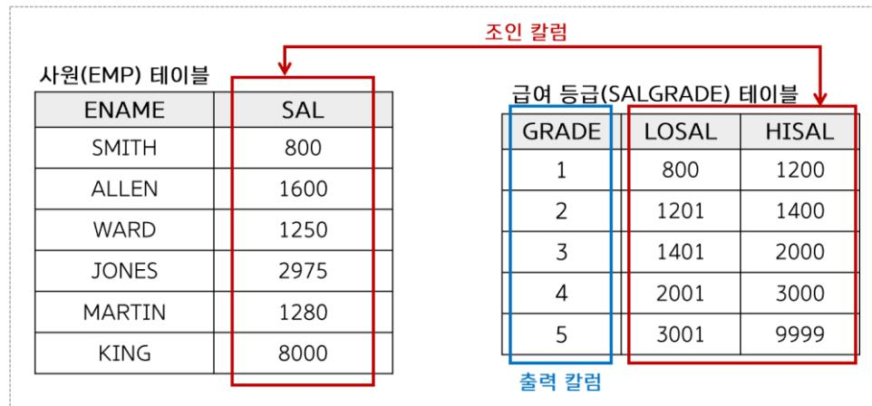

- - 사원에 따른 급여 등급을 출력해보자.

```
SELECT E.ENAME 사원명, E.SAL 급여, S.GRADE 급여등급
FROM EMP E, SALGRADE S
WHERE E.SAL BETWEEN S.LOSAL AND S.HISAL;
```

| 사원명    | 급여   | 급여등급 |
|--------|------|------|
| SMITH  | 800  | 1    |
| ALLEN  | 1600 | 3    |
| WARD   | 1250 | 2    |
| JONES  | 2975 | 4    |
| MARTIN | 1280 | 2    |
| KING   | 8000 | 5    |

출력 결과

### 4. 3개 이상의 테이블 조인

- - 관계 잘 파악해서 모든 테이블이 연결되도록 조인 조건 명시
- - 3개의 테이블 조인이면 최소 2개의 조인 조건 필요

```
SELECT P.PLAYER_NAME, P.POSITION, T.REGION_NAME,
                                                    T.TEAM_NAME, S.STADIUM_NAME
FROM PLAYER P, TEAM T, STADIUM S
WHERE P.TEAM_ID = T.TEAM_ID
AND T.STADIUM_ID = S.STADIUM_ID;
```

```
SELECT P.PLAYER_NAME, P.POSITION, T.REGION_NAME,
                                                    T.TEAM_NAME, S.STADIUM_NAME
FROM PLAYER P
INNER JOIN TEAM T ON P.TEAM_ID = T.TEAM_ID
INNER JOIN STADIUM S ON T.STADIUM_ID = S.STADIUM_ID;
```

## 5. SELF JOIN

- - 동일 테이블 사이의 조인
- - FROM 절에 동일 테이블이 2번 이상 나타나게 되니 식별을 위해 반드시 테이블 ALIAS를 사용해야 한다.


```
SELECT E1.EMP_ID, E1.NAME, E1.MGR_ID,
                            E2.EMP_ID, E2.NAME
FROM EMPLOYEES E1, EMPLOYEES E2
WHERE E1.EMP_ID = E2.EMP_ID
```

| EMP_ID | NAME   | MGR_ID | EMP_ID | NAME  |
|--------|--------|--------|--------|-------|
| 101    | ALLEN  | 100    | 100    | KING  |
| 102    | WARD   | 100    | 100    | KING  |
| 103    | JONES  | 102    | 102    | WARD  |
| 104    | MARTIN | 101    | 101    | ALLEN |
| 105    | SMITH  | 103    | 103    | JONES |

결과

- - INNER JOIN(EQUI JOIN)이라 MANAGER\_ID가 NULL인 사장 KING 은 조건에 맞지 않으니 제외됨
- - 조인 조건이 일치하지 않는 데이터들도 출력하고 싶을 땐 OUTER JOIN을 사용해야 한다.

## 제 8절 표준 조인

### 1. 표준 조인(STANDARD JOIN)

- - ANSI 표준으로 작성되는 INNER/CROSS/NATURAL/OUTER JOIN

### 2. 순수 관계 연산자

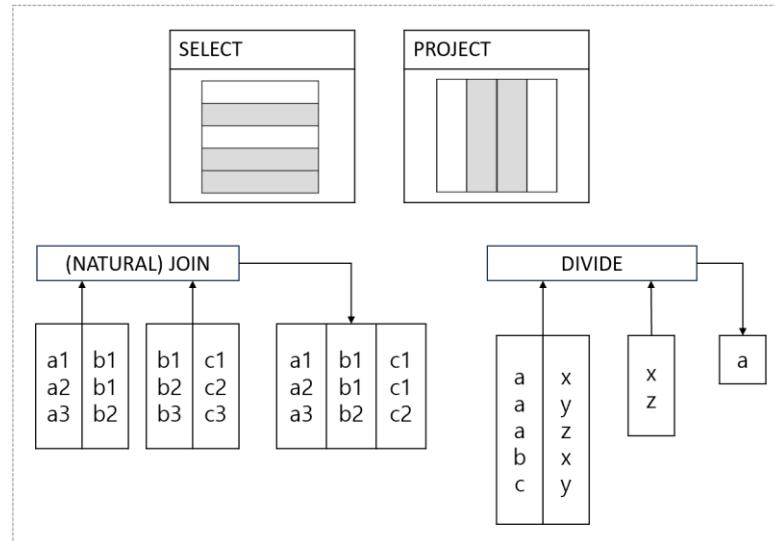

- - SELECT 연산 → WHERE 절로 구현
- - PROJECT 연산 → SELECT 절로 구현
- - (NATURAL) JOIN 연산 → 다양한 JOIN 기능으로 구현
- - DIVIDE 연산 → 현재 사용X

### 3. INNER JOIN

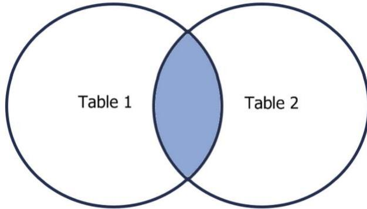

- - 내부 JOIN이라고 하며 JOIN 조건이 일치하는 행만 반환
- - ORACLE 조인의 기본
- - ANSI 표준에서는 USING 조건절이나 ON 조건절이 필수

-- ORACLE

```
SELECT EMP.DEPTNO, EMPNO, ENAME, DNAME
FROM EMP, DEPT
WHERE EMP.DEPTNO = DEPT.DEPTNO;
```

-- ANSI

```
SELECT EMP.DEPTNO, EMPNO, ENAME, DNAME
FROM EMP INNER JOIN DEPT -- JOIN으로 생략 가능
ON EMP.DEPTNO = DEPT.DEPTNO;
```

겹치는 컬럼명에만 테이블 출처 명시한 상태

### 4. ON 조건절 (괄호 씌우는 건 옵션)

- - 조인할 양 컬럼의 컬럼명이 서로 달라도 사용 가능
- - 같은 컬럼명을 가진 테이블과의 조인 시, 테이블 출처 명확하게
- - ANSI: ON 조건절: JOIN 조건 명시, WHERE 조건절: 일반 조건 명시

### 5. USING 조건절 (괄호 필수)

- - 조인할 양 컬럼의 컬럼명이 같을 경우 사용
- - ALIAS 사용 불가, 출처 테이블 명시 불가(DEPT.DEPTNO -> DEPTNO)
- - USING 절의 기준 컬럼은 식별자를 가질 수 X
- - SQL Server 에서는 지원X
- - SELECT \* FROM을 하면, USING 조건절의 기준 컬럼이 1번째 출력 컬럼이 된다.

```
SELECT EMP.ENAME, DEPTNO, DEPT.DNAME
FROM EMP JOIN DEPT
USING (DEPTNO)
```

### 6. NATURAL JOIN

- - 두 테이블 간의 동일한 이름을 갖는 모든 컬럼들에 대해 EQUI JOIN 수행한다.
- - JOIN에 사용되는 컬럼들이 동일한 이름, 같은 데이터형, 같은 데이터 성격(도메인)이어야 한다.
- - NATURAL JOIN이 명시되면, 추가로 USING 절, ON 절, WHERE 절에서 JOIN 조건을 정의할 수 없다.
- - SQL Server 에서는 지원X
- - JOIN에 사용된 컬럼들은 ALIAS나 테이블명(접두사) 사용 불가
- - 여러 개의 컬럼명이 동일한 경우, 동일한 이름을 가진 모든 컬럼의 값이 같아야 JOIN된다.


- - NATURAL JOIN은 JOIN에 사용된 같은 이름의 칼럼을 하나로 처리
- - 즉, 중복된 컬럼 중 하나만 결과에 포함시킨다.
- - JOIN되는 컬럼이 NULL 값을 가지면 일치하다고 볼 수 없다.

| Table1 |      | Table2 |     | NATURAL JOIN |      |     |
|--------|------|--------|-----|--------------|------|-----|
| NO     | NAME | NO     | POS | NO           | NAME | POS |
| 1      | A    | 1      | 탑   | 1            | A    | 탑   |
| 2      | B    | 2      | 미드  | 1            | A    | 정글  |
| NULL   | C    | 1      | 정글  | 2            | B    | 미드  |
|        |      | NULL   | 서포터 |              |      |     |

- - SELECT \* FROM을 하면, NATURAL JOIN의 기준 컬럼이 1번째 출력 컬럼이 된다.

```
-- ok
SELECT DEPTNO, EMP.EMPNO, EMP.ENAME, DEPT.DNAME
FROM EMP NATURAL JOIN DEPT;-- ok
SELECT DEPTNO, EMPNO, ENAME, DNAME
FROM EMP NATURAL JOIN DEPT;-- 오류! NATURAL JOIN에 사용된 열은 식별자 가질 수X
SELECT DEPT.DEPTNO, EMPNO, ENAME, DNAME
FROM EMP NATURAL JOIN DEPT;
```

## 7. CROSS JOIN

- - E.F.CODD 박사가 언급한 일반 집합 연산자의 PRODUCT 개념
- - 테이블 간 JOIN 조건이 없는 경우 생길 수 있는 모든 데이터의 조합

→ (CARTESIAN PRODUCT, 카타시안 곱을 출력)

- - 양쪽 테이블의 데이터 수끼리 곱한 만큼의 데이터 조합 발생(M \* N)

ex) Table1(3건) \* Table2(3건) => 총 9건의 데이터 조합 발생

Table1

| X1   | X2 |
|------|----|
| a    | 12 |
| b    | 3  |
| NULL | 8  |

Table2

| X1 | Y2  |
|----|-----|
| a  | 4.8 |
| b  | 1.2 |
| c  | 3.6 |

```
SELECT *
FROM Table1 CROSS JOIN Table2;
```

| X1(Table1) | X2 | X1(Table2) | Y2  |
|------------|----|------------|-----|
| a          | 12 | a          | 4.8 |
| a          | 12 | b          | 1.2 |
| a          | 12 | c          | 3.6 |
| b          | 3  | a          | 4.8 |
| b          | 3  | b          | 1.2 |
| b          | 3  | c          | 3.6 |
| NULL       | 8  | a          | 4.8 |
| NULL       | 8  | b          | 1.2 |
| NULL       | 8  | c          | 3.6 |

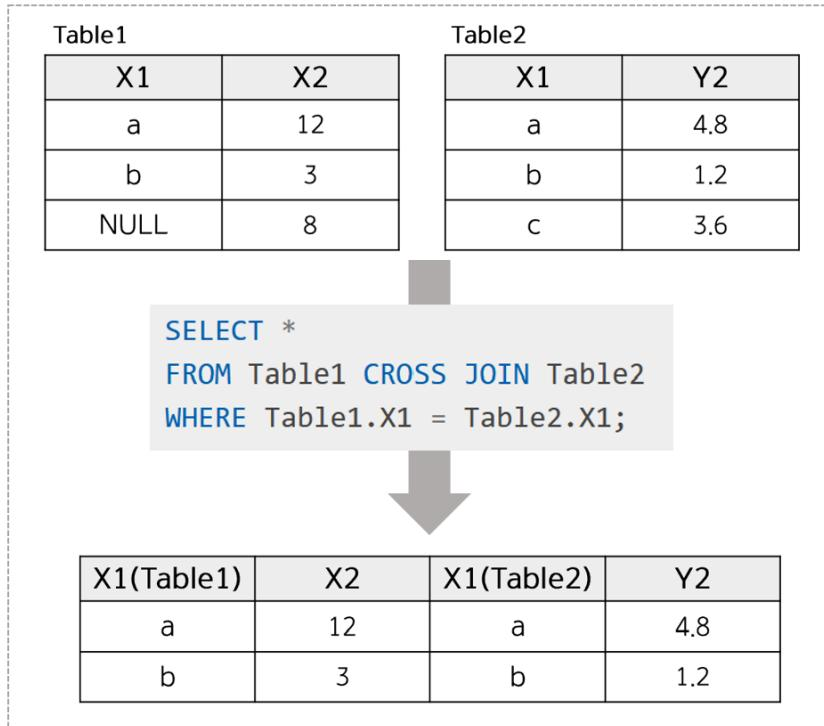

- - NATURAL JOIN의 경우 WHERE 절에서 JOIN 조건을 추가할 수 없지만, CROSS JOIN은 추가할 수 있다.
- - 하지만, 이 경우 CROSS JOIN이 아니라 INTER JOIN과 같은 결과를 얻으니 CROSS JOIN 사용의 의미가 없어지므로 권고하지 않는다.

```
SELECT ENAME, DNAME
FROM EMP CROSS JOIN DEPT
WHERE EMP.DEPTNO = DEPT.DEPTNO;
--위 SQL과 아래 SQL은 같은 결과를 얻을 수 있다.
SELECT ENAME, DNAME
FROM EMP INNER JOIN DEPT
WHERE EMP.DEPTNO = DEPT.DEPTNO;
```

## 8. OUTER JOIN

- - INNER JOIN과 대비되는 조인 방식
- - JOIN 조건에서 동일한 값이 없는 행도 반환할 때 사용
- - 기준이 되는 테이블의 방향에 따라 LEFT, RIGHT, FULL OUTER 조인
- - OUTER는 생략 가능 (LEFT OUTER JOIN → LEFT JOIN)

## 9. OUTER JOIN 종류

### 1) LEFT OUTER JOIN

- - 왼쪽 테이블을 기준으로 오른쪽 테이블이 더해지는 형태
- - 즉, 왼쪽 테이블의 모든 행 데이터가 반환되며, 오른쪽 테이블은 왼쪽테이블과 결합 기준 컬럼값과 일치하는 행만 반환
- - 오른쪽 테이블에서 일치하는 값이 없으면, 해당 부분이 NULL로 채워짐

### 2) RIGHT OUTER JOIN

- - 오른쪽 테이블을 기준으로 왼쪽 테이블이 더해지는 형태
- - 즉, 오른쪽 테이블의 모든 행 데이터가 반환되며, 왼쪽 테이블은 오른쪽테이블과 결합 기준 컬럼값과 일치하는 행만 반환
- - 왼쪽 테이블에서 일치하는 값이 없으면, 해당 부분이 NULL로 채워짐

### 3) FULL OUTER JOIN

- - 두 테이블의 모든 데이터가 결합
- - 즉, 두 테이블이 가지고 있는 모든 행이 반환된다.
- - 기준 컬럼의 값이 일치하지 않는 경우 해당 부분은 NULL로 채워진다.
- - 오라클 표준에서는 직접적으로 지원하지 않으나, UNION을 통해 구현이 가능하다.
- - = LEFT OUTER JOIN의 결과 UNION RIGHT OUTER JOIN의 결과
- - ■ UNION: 중복 데이터는 하나만 반환

BOOK\_LIST

| Book_id | Book_name   | Writer      | Publisher_id |
|---------|-------------|-------------|--------------|
| b01     | 데미안         | 헤르만 헤세      | 1            |
| b02     | 어린왕자        | 앙투안 드 생택쥐페리 | 2            |
| b03     | 1984        | 조지 오웰       | 8            |
| b04     | 나미야 잡화점의 기적 | 히가시노 게이고    | 3            |

PUBLISHER

| Publisher_id | Publisher_name |
|--------------|----------------|
| 1            | 열린책들           |
| 2            | 민음사            |
| 3            | 현대문학           |
| 4            | 한빛미디어          |

-- ANSI(표준 조인)

SELECT b.Book\_id, b.Book\_name, b.Writer, b.Publisher\_id, p.Publisher\_name

FROM BOOK\_LIST b

LEFT JOIN PUBLISHER p

ON b.Publisher\_id = p.Publisher\_id;

-- ORACLE 표준

SELECT b.Book\_id, b.Book\_name, b.Writer, b.Publisher\_id, p.Publisher\_name

FROM BOOK\_LIST b, PUBLISHER p

WHERE b.Publisher\_id = p.Publisher\_id(+);

| Book_id | Book_name   | Writer      | Publisher_id | Publisher_name |
|---------|-------------|-------------|--------------|----------------|
| b01     | 데미안         | 헤르만 헤세      | 1            | 열린책들           |
| b02     | 어린왕자        | 앙투안 드 생택쥐페리 | 2            | 민음사            |
| b03     | 1984        | 조지 오웰       | 8            | NULL           |
| b04     | 나미야 잡화점의 기적 | 히가시노 게이고    | 3            | 현대문학           |

LEFT OUTER JOIN

-- ANSI(표준 조인)

SELECT b.Book\_id, b.Book\_name, b.Writer, b.Publisher\_id, p.Publisher\_name

FROM BOOK\_LIST b

RIGHT JOIN PUBLISHER p

ON b.Publisher\_id = p.Publisher\_id;

-- ORACLE 표준

SELECT b.Book\_id, b.Book\_name, b.Writer, b.Publisher\_id, p.Publisher\_name

FROM BOOK\_LIST b, PUBLISHER p

WHERE (+)b.Publisher\_id = p.Publisher\_id;

| Book_id | Book_name   | Writer      | Publisher_id | Publisher_name |
|---------|-------------|-------------|--------------|----------------|
| b01     | 데미안         | 헤르만 헤세      | 1            | 열린책들           |
| b02     | 어린왕자        | 앙투안 드 생택쥐페리 | 2            | 민음사            |
| b04     | 나미야 잡화점의 기적 | 히가시노 게이고    | 3            | 현대문학           |
| NULL    | NULL        | NULL        | 4            | 한빛미디어          |

RIGHT OUTER JOIN

-- ANSI(표준 조인)

SELECT b.Book\_id, b.Book\_name, b.Writer, b.Publisher\_id, p.Publisher\_name

FROM BOOK\_LIST b

FULL JOIN PUBLISHER p

ON b.Publisher\_id = p.Publisher\_id;

-- ORACLE

SELECT b.Book\_id, b.Book\_name, b.Writer, b.Publisher\_id, p.Publisher\_name

FROM BOOK\_LIST b, PUBLISHER p

WHERE b.Publisher\_id = p.Publisher\_id(+)

UNION

SELECT b.Book\_id, b.Book\_name, b.Writer, b.Publisher\_id, p.Publisher\_name

FROM BOOK\_LIST b, PUBLISHER p

WHERE b.Publisher\_id(+) = p.Publisher\_id;

| Book_id | Book_name   | Writer      | Publisher_id | Publisher_name |
|---------|-------------|-------------|--------------|----------------|
| b01     | 데미안         | 헤르만 헤세      | 1            | 열린책들           |
| b02     | 어린왕자        | 앙투안 드 생택쥐페리 | 2            | 민음사            |
| b03     | 1984        | 조지 오웰       | 8            | NULL           |
| b04     | 나미야 잡화점의 기적 | 히가시노 게이고    | 3            | 현대문학           |
| NULL    | NULL        | NULL        | 4            | 한빛미디어          |

FULL OUTER JOIN

서브쿼리는 쿼리 안에 포함된 또 다른 쿼리로, 메인쿼리를 보조하는 하위 쿼리다. 서브쿼리는 다양한 위치에서 사용될 수 있다.

## II. SQL 기본 및 활용(2)

### 2장. SQL 활용

# 

☛ ☛ ☛ ☛ 예외: TOP-N 분석

- •
- •
- •

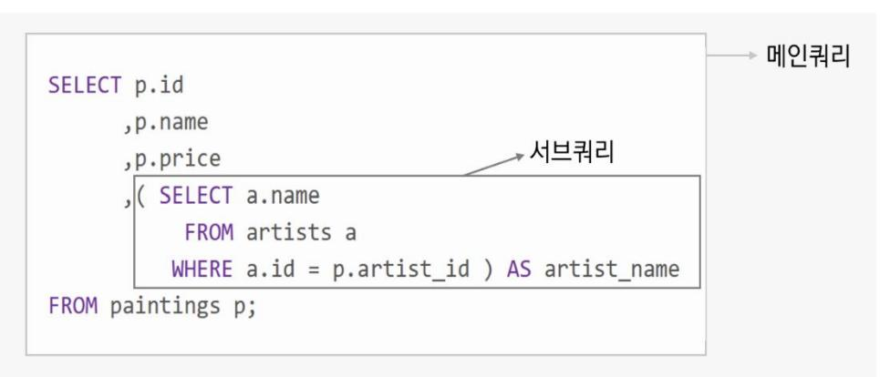

- SELECT, FROM, WHERE, HAVING, ORDER BY **절 [GROUP BY불가]**
- 기타 DML: INSERT 문의 VALUES **절**, UPDATE 문의 SET **절**

| 종류                                           | 설명                     |
|----------------------------------------------|------------------------|
| <b>연관 서브쿼리</b><br>(Correlated Subquery)      | 서브쿼리가 메인쿼리의 컬럼을 가짐     |
| <b>비연관 서브쿼리</b><br>(Un-Correlated Subquery ) | 서브쿼리가 메인쿼리의 컬럼을 가지지 않음 |

# 

- •

※ 즉, 메인쿼리의 결과가 서브쿼리로 제공될 수도 있고, 서브쿼리의 결과가 메인쿼리로 제공될 수 있음 → 실행 순서는 상황에 따라 다르다는 것

## 5. 반환되는 데이터 형태에 따른 서브쿼리 분류

- • 단일행 서브쿼리:

- - 서브쿼리의 실행 결과가 항상 1건 이하

- - 단일행 비교 연산자와 함께 사용

(=, <, <=, >, >=, <>)

- - 다중행 비교 연산자도 사용 가능

- • 다중행 서브쿼리:

- - 서브쿼리의 실행 결과가 여러 건인 서브쿼리

- - 다중행 비교 연산자와 함께 사용

- - IN, ALL, ANY, SOME, EXISTS

- - 단일행 비교 연산자 사용 불가능

- • 다중컬럼 서브쿼리:

- - 서브쿼리의 실행 결과로 여러 컬럼 반환

- - 주로 메인쿼리의 조건과 비교하기 위해 사용

(비교하고자 하는 컬럼의 개수와 위치가 동일해야 함)

## 6. 위치에 따른 서브쿼리 분류

| 종류                            | 설명                                                                                                                          |
|-------------------------------|-----------------------------------------------------------------------------------------------------------------------------|
| 스칼라 서브쿼리<br>(Scalar Subquery) | SELECT 절에 위치하며 메인 쿼리의 각 행당 정확히 하나의 값을 반환 (단일 행, 단일 열 반환)                                                                    |
| 인라인 뷰<br>(Inline View)        | FROM 절에 위치하며 하나의 테이블처럼 사용된다.<br>뷰(View)처럼, 쿼리 내에서 임시적으로 생성된 결과를 테이블처럼 사용할 수 있게 해준다.<br>즉, 쿼리를 실행할 때만 존재하며 데이터베이스에 저장되지 않는다. |
| 중첩 서브쿼리<br>(Nested Subquery)  | WHERE 절이나 HAVING 절과 같은 조건절에서 쓰이는 서브쿼리                                                                                       |

## 1) 스칼라 서브쿼리

- - SELECT 절에 사용하는 서브쿼리

- - 서브쿼리가 단일행, 단일열을 반환

- - 서브쿼리의 결과를 하나의 열처럼 사용하기 위해 사용

-- 스칼라 서브쿼리

```
SELECT * | 컬럼명 | 표현식,
                                        ( SELECT * | 컬럼명 | 표현식
                                        FROM 테이블명/뷰명
                                        WHERE 조건)
FROM 테이블명/뷰명;
```

## 2) 인라인뷰

- - FROM 절에 사용하는 서브쿼리

- - 서브쿼리의 결과를 테이블처럼 사용하기 위해 주로 사용

-- 인라인뷰

```
SELECT * | 컬럼명 | 표현식
FROM (SELECT * | 컬럼명 | 표현식
                                        FROM 테이블명/뷰명)
WHERE 조건;
```

## 3) 중첩 서브쿼리

- - 조건절에서 사용하는 서브쿼리

- - 메인쿼리의 데이터를 필터링하거나 비교할 때 사용

- - 반환 데이터의 형태가 여러 가지(단일, 다중, 다중컬럼, 연관/비연관)

-- 중첩 서브쿼리

```
SELECT * | 컬럼명 | 표현식
```

```
FROM 테이블명/뷰명
```

```
WHERE 조건연산자 (SELECT * | 컬럼명 | 표현식
```

```
                                        FROM 테이블명/뷰명
```

```
                                        WHERE 조건);
```

## 스칼라 서브쿼리 (Scalar Subquery) '단일행 연관 서브쿼리'

- - 메인쿼리의 각 행마다 하나의 단일값을 반환해준다

| id  | name  | artist_id | price     | id          | name |
|-----|-------|-----------|-----------|-------------|------|
| 101 | 숲과 나  | 1         | 1,100,000 | 1           | 이지현  |
| 102 | 밤의 도시 | 1         | 1,350,000 | 2           | 황현석  |
| 103 | 파도    | 2         | 470,000   | 3           | 박성진  |
| 104 | Pop!  | 3         | 750,000   | 4           | 백예서  |
| 105 | 너     | 4         | 640,000   | 5           | 정하나  |
| 106 | 밤 비   | 5         | 920,000   | artists 테이블 |      |
| 107 | 기억    | 5         | 380,000   |             |      |

paintings 테이블

```
SELECT p.id, p.name, p.price,
(SELECT a.name
  FROM artists a
  WHERE a.id = p.artist_id) AS artist_name
FROM paintings p;
```

| id  | name  | price     | artist_name |
|-----|-------|-----------|-------------|
| 101 | 숲과 나  | 1,100,000 | 이지현         |
| 102 | 밤의 도시 | 1,350,000 | 이지현         |
| 103 | 파도    | 470,000   | 황현석         |
| 104 | Pop!  | 750,000   | 박성진         |
| 105 | 너     | 640,000   | 백예서         |
| 106 | 밤 비   | 920,000   | 정하나         |
| 107 | 기억    | 380,000   | 정하나         |

- - 각 작품의 번호, 이름, 가격과 그 작품에 대한 작가 정보를 가져오는 SELECT 문을 작성한 것이다.
- - 메인 쿼리의 각 행에 대해 하나의 단일값(예술가 이름)을 반환했다.
- - 스칼라 서브쿼리는 OUTER JOIN 연산을 사용한 결과와 같다.

```
SELECT p.id, p.name, p.price, a.name
FROM paintings p
LEFT JOIN artists a
ON p.artist_id = a.id; -- 같은 결과 반환
```

Q 서브쿼리의 WHERE 절에서 매칭되는 값이 존재하지 않는다면? (paintings 테이블에 artist\_id가 10번인 새 데이터를 삽입했다고 가정해 보자.)

| id  | name  | price     | artist_name |
|-----|-------|-----------|-------------|
| 101 | 숲과 나  | 1,100,000 | 이지현         |
| 102 | 밤의 도시 | 1,350,000 | 이지현         |
| 103 | 파도    | 470,000   | 황현석         |
| 104 | Pop!  | 750,000   | 박성진         |
| 105 | 너     | 640,000   | 백예서         |
| 106 | 밤 비   | 920,000   | 정하나         |
| 107 | 기억    | 380,000   | 정하나         |
| 108 | 여행    | 150,000   | NULL        |

- - 매칭되는 데이터가 없는 경우 해당 컬럼에 대한 값은 NULL로 표현된다. (생략되는 게 아님)!!!

## 스칼라 서브쿼리 다른 예시

```
SELECT EMPNO, ENAME, DEPTNO,
                                (SELECT DNAME
                                FROM DEPT D
                                WHERE D.DEPTNO = E.DEPTNO) AS DNAME
FROM EMP E
WHERE DEPTNO = 10;
```

부서번호가 10번인 각 직원의 이름과 사번, 부서번호, 부서 이름 출력

```
SELECT EMPNO, ENAME, DEPTNO, SAL,
                                (SELECT SUM(SAL)
                                FROM EMP) AS TOTAL_SAL
FROM EMP;
```

사번, 직원 이름, 부서번호, 급여, 총 급여 출력

- 원래 SUM 함수는 집계함수로 각 행들의 값을 하나의 값으로 요약하는 함수라 다른 컬럼과 함께 SELECT 절에 올 수 없다. 하지만 서브쿼리를 통해 단일값으로 가져와 각 직원정보의 행마다 4번째 컬럼값으로 넣어줄 수 있다.

### 인라인 뷰 (Inline View) = 동적 뷰(Dynamic View)

- - 서브쿼리를 FROM 절에 작성하여 일시적인 테이블처럼 사용하는 것
- - 서브쿼리로 원하는 내용만 추출해서 새로운 테이블을 만드는 개념
- - 다른 테이블과 조인 시 반드시 **테이블 별칭을 명시해야** 함
- - **FROM 절에 정의를 하니 중첩 서브쿼리와 다르게 서브쿼리의 결과를 메인 쿼리의 어느 절에서도 사용할 수 있음**
- - 인라인뷰의 결과와 메인쿼리 테이블과 조인할 목적으로 주로 사용
- - 모든 연산자 사용 가능
- - 데이터베이스에 해당 정보를 저장하지 않음 - ‘일회성’임

- 각 작가의 평균 수입보다 높은 가격인 그림들의 목록을 뽑아보자.

```
SELECT p.artist_id, p.name, p.price, p2.avg_price
FROM PAINTINGS p,
                                (SELECT artist_id, AVG(price) AS avg_price
                                FROM PAINTINGS
                                GROUP BY artist_id) p2
WHERE p.artist_id = p2.artist_id
AND p.price > p2.avg_price;
```

### 인라인 뷰의 실행 원리/순서

#### (1) 서브쿼리(인라인 뷰)

- - 서브쿼리가 각 작가별 평균 작품의 가격을 계산
- - 계산된 결과는 다중행, 다중컬럼을 가진 일종의 테이블
- - **where절에서 조인을 해야 하므로 서브쿼리의 결과는 무조건 별칭을 가져야 한다.**

#### (2) FROM

- - paintings 테이블 p와 서브쿼리로부터 받은 임시 테이블 p2를 조인
- - 두 테이블 사이에 명확한 JOIN 조건이 존재하지 않아 Cartesian Product을 생성

#### (3) WHERE

- - p.artist\_id = p2.artist\_id 인 데이터 찾기
- - p.price > p2.avg\_price를 만족하는 행을 필터링

#### (4) SELECT

- - 최종적으로 SELECT 절에서 선택한 행들만 반환

| artist_id | name  | price     | avg_price |
|-----------|-------|-----------|-----------|
| 1         | 밤의 도시 | 1,350,000 | 1,225,000 |
| 5         | 밤 비   | 920,000   | 650,000   |

결과

Q 조인을 명시해줬다면

```
SELECT p.artist_id, p.name, p.price, p2.avg_price
FROM paintings p
INNER JOIN (
  SELECT artist_id, AVG(price) AS avg_price
  FROM paintings
  GROUP BY artist_id) p2
ON p.artist_id = p2.artist_id
WHERE p.price > p2.avg_price;
```

- 조인의 종류를 명시하면 불필요한 조합이 생성되지 않는다.

**인라인 뷰 다른 예시**

```
SELECT E.사원번호, E.사원명, D.부서번호, D.부서명
,(SELECT COUNT(*)
  FROM 부양가족 F
  WHERE F.사원번호 = E.사원번호) AS 부양가족수
FROM 부서 D, (SELECT *
  FROM 사원
  WHERE 입사년도= '2020') E
WHERE D.부서번호 = E.부서번호
```

- 2020년에 입사한 사원들의 정보와 각 사원들의 부양가족 수 조회

▼ 스칼라 서브 쿼리와의 차이

### 스칼라 서브 쿼리

```
SELECT p.id, p.name, p.price,
  (SELECT a.name
  FROM artists a
  WHERE a.id = p.artist_id) AS artist_name
FROM paintings p;
```

### 인라인 뷰

```
SELECT p.artist_id, p.name, p.price, p2.avg_price
FROM PAINTINGS p,
  (SELECT artist_id, AVG(price) AS avg_price
  FROM PAINTINGS
  GROUP BY artist_id) p2
WHERE p.artist_id = p2.artist_id
AND p.price > p2.avg_price;
```

- 스칼라 서브쿼리는 단일 값을 반환해야 하므로 하나의 컬럼만 선택할 수 있으며, 메인쿼리의 각 행마다 독립적으로 실행된다.

- 인라인 뷰는 테이블 형태의 결과를 반환해야 하므로 메인 쿼리에서 필요한 컬럼들이 서브쿼리 안에 포함되어야 한다.

■ 메인쿼리에서 조인할 때 서브쿼리로부터 얻은 임시 테이블의 컬럼이 필요하니 반드시 해당 쿼리는 인라인 뷰안에 명시되어야 한다.

+ 인라인 뷰에서 집계함수를 사용하고 해당 결과값을 메인쿼리의 조건절인 WHERE 절에 사용해야 한다면 별칭을 무조건 정해주어야 한다.

■ WHERE 절에는 집계함수를 사용할 수 없으니까

## 중첩 서브쿼리(Nested Subquery)

- - WHERE 절이나 HAVING 절과 같은 조건절에서 사용되는 서브쿼리로,
- - 메인쿼리의 데이터를 필터링하거나 비교할 때 사용

### ① 반환종류: 단일행 서브쿼리

- - 서브쿼리의 결과로 1개의 행이 반환
- - 단일행 비교 연산자: =, <>, > >=, <, <=

```
SELECT EMPNO, ENAME, SAL
FROM EMP
WHERE SAL > (SELECT AVG(SAL)
                                        FROM EMP);
```

평균 봉급보다 높은 봉급을 가진 직원의 사번, 이름, 봉급 출력

```
SELECT PLAYER_NAME, POSITION, BACK_NO
FROM PLAYER
WHERE TEAM_ID = (SELECT TEAM_ID
                                        FROM PLAYER
                                        WHERE PLAYER_NAME = '강감찬')
```

강감찬 소속 팀에 소속된 팀의 선수들 정보 출력

### ② 반환종류: 다중행 서브쿼리

- - 서브쿼리의 결과로 여러 행이 반환

| 다중행 비교 연산자 | 설명                  |
|------------|---------------------|
| IN         | 결과에 값이 포함되는지 확인     |
| ANY        | 결과 중 하나라도 조건을 만족하는지 |
| ALL        | 모든 값이 조건을 만족하는지     |
| EXISTS     | 결과가 존재하는지 여부를 확인    |

| 연산자   | 설명     | 비교                                 |
|-------|--------|------------------------------------|
| > ANY | 최소값 반환 | > ANY(10,200): 최소값(10)보다 큰 행들 반환   |
| < ANY | 최대값 반환 | < ANY(10,200): 최대값(200)보다 작은 행들 반환 |
| > ALL | 최대값 반환 | > ALL(10,200): 최대값(200)보다 큰 행들 반환  |
| < ALL | 최소값 반환 | < ALL(10,200): 최소값(10)보다 작은 행들 반환  |

```
SELECT EMPNO, ENAME, SAL
FROM EMP
WHERE SAL > ANY(SELECT SAL
                                        FROM EMP
                                        WHERE DEPTNO = 10);
```

10번 부서의 사원들의 봉급 중 최소 봉급보다 많이 받는 사원 정보 조회

### ③ 반환종류: 다중컬럼 서브쿼리 (SQL Server 지원 X)

- - 서브쿼리의 결과로 여러 개의 컬럼이 반환
- - 메인쿼리의 비교 컬럼이 2개 이상인 경우
- - 대소 비교 전달 불가 (두 값을 동시에 묶어서 대소비교할 수 없으니)

```
SELECT EMPNO, ENAME, SAL, DEPTNO
FROM EMP
WHERE (DEPTNO, SAL) IN (SELECT DEPTNO, MAX(SAL)
                                        FROM EMP
                                        GROUP BY DEPTNO);
```

부서별 최대 급여자들의 정보 출력

```
SELECT TEAM_ID, PLAYER_NAME, HEIGHT
FROM PLAYER
WHERE (TEAM_ID, HEIGHT) IN (SELECT TEAM_ID, MIN(HEIGHT)
                                        FROM PLAYER
                                        GROUP BY TEAM_ID);
```

소속팀별 키가 가장 작은 사람들의 정보 출력

#### ④ 반환종류: 상호연관 서브쿼리

- - 메인쿼리와 서브쿼리의 비교 수행
- - 서브쿼리 내에 메인쿼리의 컬럼이 사용됨
- - 비교할 집단이나 조건은 서브쿼리에 명시

(메인쿼리절엔 서브쿼리 컬럼이 정의되어 있지 않으니 오류 발생)

Q 부서별 해당 부서의 평균 급여보다 높은 급여를 받는 사원 정보

```
SELECT EMPNO, ENAME, SAL, DEPTNO
FROM EMP
WHERE (DEPTNO, SAL) > (SELECT DEPTNO, AVG(SAL)
                                        FROM EMP
                                        GROUP BY DEPTNO);
```

- 다중 컬럼 서브쿼리는 두 컬럼에 대해 동시 대소비교가 불가능하니 오류!

```
SELECT EMPNO, ENAME, SAL, DEPTNO
FROM EMP E1
WHERE SAL > (SELECT AVG(SAL)
                                        FROM EMP E2
                                        WHERE E1.DEPTNO = E2.DEPTNO
                                        GROUP BY DEPTNO);
```

- 대소 비교할 컬럼을 메인쿼리에 두고, 일치 조건은 서브쿼리에 전달하면 된다.

- ▪ 메인쿼리와 결과적으로 비교해야 할 컬럼은 SAL, DEPTNO인데, 그 중 SAL에 대한 대소비교 전에 먼저 비교할 DEPTNO가 확정되어야 함
- ▪ 먼저 비교할 DEPTNO 값을 서브쿼리에 전달
- ▪ 메인쿼리에는 서브쿼리의 테이블 정보가 없으므로

메인쿼리에 E.DEPTNO = D.DEPTNO 조건은 사용불가한 것

#### ▼ 상호 연관 서브쿼리의 연산 순서

1. (1) 메인쿼리의 테이블 READ
2. (2) 메인쿼리의 WHERE 절 확인
3. (3) 서브쿼리 테이블 READ
4. (4) 서브쿼리 WHERE 절 확인
5. (5) E1.DEPTNO와 서브쿼리의 DEPTNO와 비교
6. (6) 위 조건에 성립하는 행들의 그룹연산 결과 확인 (AVG(SAL))
7. (7) 해당 결과를 메인쿼리에 전달해 해당 조건을 만족하는 행만 추출

※ 상호연관 서브쿼리 사용 시 GROUP BY 생략 가능

```
SELECT a.name AS artist_name
FROM artists a
WHERE a.id = (
    SELECT p.artist_id
    FROM paintings p
    WHERE p.price = (SELECT MAX(price) FROM paintings)
);
```

```
SELECT p.id, p.name, p.price, a.name AS artist_name
FROM paintings p
JOIN artists a ON p.artist_id = a.id
WHERE p.price > (
    SELECT AVG(p2.price)
    FROM paintings p2
    WHERE p2.artist_id = p.artist_id
);
```

비상관 서브쿼리  
: 메인쿼리의 컬럼을 갖지 X

상관 서브쿼리  
: 메인쿼리의 컬럼을 갖음

## 7. 서브쿼리 사용 시 주의사항2

-- 주문 항목을 저장하는 테이블

```
CREATE TABLE order_items (
    order_id INT,
    product_id INT,
    quantity INT,
    price DECIMAL(10, 2),
    PRIMARY KEY (order_id, product_id)
);SELECT a.order_id, a.product_id,
    a.quantity, a.price,
    (SELECT SUM(b.quantity * b.price)
        FROM order_items b
        WHERE b.order_id = a.order_id
        AND b.product_id = a.product_id) AS total_amount
    FROM order_items a;
```

- 조인할 테이블들의 기본키가 2개 이상이라면 WHERE 절에서 조인(=)에 사용되는 기본키에도 두 키를 모두 사용해줘야 한다.

## 8. HAVING절에서 서브쿼리

- 그룹함수와 함께 사용될 때, 그룹핑된 결과에 대해 부가 조건을 걸기 위해 사용

## 9. UPDATE문의 SET절에서 서브쿼리

- 서브쿼리를 사용한 변경 작업을 할 때, 서브쿼리 결과가 NULL을 반환하면 해당 컬럼 결과가 NULL이 될 수 있기 때문에 주의

## 10. NOT EXISTS 와 서브쿼리

- WHERE문에 NOT EXISTS는 서브쿼리 테이블의 결과물을 제외한 나머지를 메인쿼리에 출력  
 - 메인쿼리에서 서브쿼리의 결과물이랑 겹치는 애들은 제외 (차집합)

## 11. EXISTS 와 서브쿼리

- WHERE문에 EXISTS는 서브쿼리 테이블의 결과물과 겹치는 데이터만 메인쿼리에 출력

## 제 2절 집합 연산자

### 1. 집합 연산자

- - SELECT 문 결과를 하나의 집합으로 간주,  
   그 집합에 대한 합집합, 교집합, 차집합의 연산
- - 두 집합의 각 컬럼의 순서와 데이터 타입이 상호 호환 가능해야
- - 전체 집합의 컬럼명과 데이터 타입은 첫 번째 집합에 의해 결정됨
- - 두 집합 사이에 집합 연산자 정의
- - 두 개이상의 테이블에서 JOIN을 사용하지 않고, 연관된 데이터를 조회하는 방법

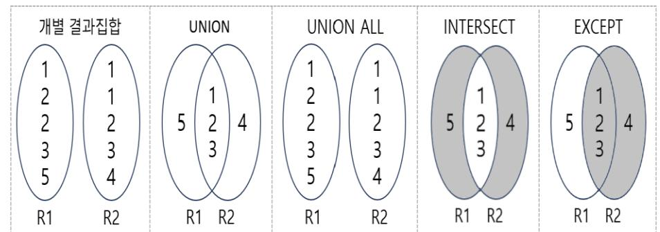

## 2. 합집합

- - 두 집합의 합집합 / UNION, UNION ALL로 표현

### ① UNION

- - 중복된 데이터는 한 번만 출력

- - 중복된 데이터를 제거하기 위해 내부적으로 정렬 수행

- - 따라서 추가적인 연산을 하지 않게 하기 위해, 중복된 데이터가 없을 경우엔 UNION ALL을 사용하는 게 좋음

```
SELECT 배역명, 본명 FROM sweethome1  
UNION
```

```
SELECT 배역명, 본명 FROM sweethome2;;
```

스윗홈 시즌1, 2 출연 배우 모두 조회 (중복은 한 번만)

### ② UNION ALL

- - 중복된 데이터를 제거하지 않고 모든 행 반환

```
SELECT 배역명, 본명 FROM sweethome1  
UNION ALL
```

```
SELECT 배역명, 본명 FROM sweethome2;;
```

스윗홈 시즌1, 2 출연 배우 모두 조회 (중복 괜찮음)

## 3. 교집합 (INTERSECT '중복 제거임!')

- - 두 집합의 공통으로 있는 행 출력

```
SELECT 배역명, 본명 FROM sweethome1  
INTERSECT
```

```
SELECT 배역명, 본명 FROM sweethome2;;
```

스윗홈 시즌1,2에 모두 출연한 배우 조회

## 4. 차집합 (ORACLE: MINUS) EXCEPT

- - 두 집합 중 한 쪽 집합에만 존재하는 행 출력

- - ( A - B )와 ( B - A )는 다르니 집합의 순서에 주의하자

```
SELECT 배역명, 본명 FROM sweethome1  
MINUS
```

```
SELECT 배역명, 본명 FROM sweethome2;;
```

시즌 1에는 출연했으나 시즌 2에는 출연하지 않은 배우 조회

```
SELECT 배역명, 본명 FROM sweethome2  
MINUS
```

```
SELECT 배역명, 본명 FROM sweethome1;;
```

시즌 2에는 출연했으나 시즌 1에는 출연하지 않은 배우 조회

## 5. 집합 연산자 사용시 주의 사항

1. 1) 두 집합의 컬럼 수가 일치해야

1. 2) 두 집합의 컬럼 순서도 일치해야 (오류가 발생하지는 않음, 근데 의미x)

1. 3) 두 집합의 각 컬럼의 데이터 타입이 상호 호환 가능해야

1. 4) 각 컬럼의 사이즈는 달라도 됨

1. 5) **개별 SELECT 문에 ORDER BY 불가 (GROUP BY는 가능)**

■ 아래 집합의 ORDER BY는 집합 연산자 전체 결과에 대한 ORDER BY 로 적용됨

※1 : 1 의 테이블관계라면 EXCEPT 결과는 항상 공집합이다.

※1 : 1 의 테이블관계라면 INTERSECT와 JOIN 연산의 결과는 같다.

※1 : N 의 테이블관계라면 INTERSECT 보다 JOIN의 연산 결과 수가 더 많다.

※1 : 1 의 테이블관계라면 INTERSECT와 UNION의 결과는 같다.

※1 : 1 의 테이블관계라면 UNION ALL 수행 시 결과는 한 테이블의 전체건수에 2배가 된다. (UNION 수행 시 결과 건수는 같음)

## 제 3절 그룹 함수

### 1. ANSI/ISO SQL 표준 데이터 분석을 위한 세 가지의 함수

- - AGGREGATE FUNCTION 집계 함수
- - GROUP FUNCTION 그룹 함수
- - WINDOW FUNCTION 윈도우 함수

### 2. 집계 함수 정리 'NULL값 무시'

#### 1) COUNT

- - 행의 수를 세는 함수, 모든 데이터타입에 사용 가능
- - 대상 컬럼은 \* 또는 단 하나의 컬럼  
  (해당 컬럼의 값이 NULL인 경우 COUNT 제외)
- - PK 컬럼의 경우 NULL일 수 없으니 전체 행의 수를 세고 싶을 때는 PK 컬럼이나 NOT NULL 컬럼을 사용하는 것이 좋음

#### 2) SUM

- - 총 합 출력, 따라서 숫자 컬럼에만 사용 가능

#### 3) AVG

- - 평균 출력, 따라서 숫자 컬럼에만 사용 가능
- - **NULL을 제외한 대상의 평균을 반환하니 전체 대상 평균 연산 시 주의**

```
AVG(SAL)  
SUM(SAL) / COUNT(EMPNO) -- empno: PK  
AVG(NVL(SAL,0))
```

- - 전체 10명, 그 중 NULL값을 5명이 가졌다면 AVG()는 5명에 대한 평균을 계산하게 된다. 전체에 대한 평균을 구하고 싶다면 SUM()/COUNT(NOT NULL 컬럼)이나 NVL(SAL,0)로 NULL값을 0으로 바꾼 후 구하면 된다.

#### 4) MIN / MAX

- - 최소/ 최대 출력
- - 날짜, 숫자, 문자 컬럼에 모두 사용 가능

#### 5) VARIANCE / STDDEV

- - 분산과 표준편차 (분산의 루트값)

### 3. 그룹 함수 ★★★

일반적인 GROUP BY 절을 사용한다고 생각해보자.

예시: 부서별 업무별 사원수와 급여 합 조회

```
SELECT DNAME, JOB,  
                                COUNT(*) "Total Empl",  
                                SUM(SAL) "Total Sal"  
FROM EMP, DEPT  
WHERE DEPT.DEPTNO = EMP.DEPTNO  
GROUP BY DNAME, JOB;
```

| DNAME      | JOB       | Total Empl | Total Sal |
|------------|-----------|------------|-----------|
| -----      | -----     | -----      | -----     |
| SALES      | MANAGER   | 1          | 2850      |
| SALES      | CLERK     | 1          | 950       |
| ACCOUNTING | MANAGER   | 1          | 2450      |
| RESEARCH   | ANALYST   | 2          | 6000      |
| ACCOUNTING | CLERK     | 1          | 1300      |
| SALES      | SALESMAN  | 4          | 5600      |
| RESEARCH   | ANAGER    | 1          | 2975      |
| ACCOUNTING | PRESIDENT | 1          | 5000      |
| RESEARCH   | CLERK     | 2          | 1900      |

- - 별도의 그룹함수를 GROUP BY 절에 적지 않을 경우 소계나 총 합계가 따로 생성되지는 않는다.

\* GROUP BY 절 사용시 자동 정렬이 수행되지 않으니, 정렬이 필요한 경우엔 ORDER BY 절에 명시적으로 정렬 컬럼을 표시해야 한다.

① ROLLUP 함수

```
SELECT DNAME, JOB,
                    COUNT(*) "Total Empl",
                    SUM(SAL) "Total Sal"
FROM EMP, DEPT
WHERE DEPT.DEPTNO = EMP.DEPTNO
GROUP BY ROLLUP(DNAME, JOB)
ORDER BY DNAME, JOB;
```

| DNAME      | JOB       | Total Empl | Total Sal |
|------------|-----------|------------|-----------|
| -----      | -----     | -----      | -----     |
| ACCOUNTING | CLERK     | 1          | 1300      |
| ACCOUNTING | MANAGER   | 1          | 2450      |
| ACCOUNTING | PRESIDENT | 1          | 5000      |
| ACCOUNTING |           | 3          | 8750      |
| RESEARCH   | ANALYST   | 2          | 6000      |
| RESEARCH   | CLERK     | 2          | 1900      |
| RESEARCH   | MANAGER   | 1          | 2975      |
| RESEARCH   |           | 5          | 10875     |
| SALES      | CLERK     | 1          | 950       |
| SALES      | MANAGER   | 1          | 2850      |
| SALES      | SALESMAN  | 4          | 5600      |
| SALES      |           | 6          | 9400      |
|            |           | 14         | 29025     |

13개의 행이 선택되었다.

- ROLLUP 함수를 사용하면 그룹핑 하는 컬럼의 수가 N일 시 N + 1 Level의 Subtotal(소계) 가 생성된다.

- ROLLUP의 인수는 계층 구조라 인수 순서가 바뀌면 수행 결과도 바뀐다.

- GROUPING COLUMNS인 DNAME과 JOB에 대해 다음과 같은 추가 LEVEL의 집계가 생성되었다.

- • L1 - GROUP BY 수행 시 생성되는 표준 집계 (9건)
- • L2 - DNAME 별 모든 JOB의 SUBTOTAL (3건)
- • L3 - GRAND TOTAL (마지막 행, 1건)

-- UNION ALL로 대체 가능!

```
SELECT DNAME, JOB,
                    COUNT(*) AS "Total Empl",
                    SUM(SAL) AS "Total Sal"
FROM EMP, DEPT
WHERE DEPT.DEPTNO = EMP.DEPTNO
GROUP BY DNAME, JOB
```

UNION ALL

```
SELECT DNAME, NULL AS JOB,
                    COUNT(*) AS "Total Empl",
                    SUM(SAL) AS "Total Sal"
FROM EMP, DEPT
WHERE DEPT.DEPTNO = EMP.DEPTNO
GROUP BY DNAME
```

UNION ALL

```
SELECT NULL AS DNAME, NULL AS JOB,
                    COUNT(*) AS "Total Empl",
                    SUM(SAL) AS "Total Sal"
FROM EMP, DEPT
WHERE DEPT.DEPTNO = EMP.DEPTNO
ORDER BY DNAME, JOB;
```

DNAME과 JOB 별 그룹 연산

DNAME별 그룹 연산(소계)

전체 총계

Q ROLLUP의 인수의 순서를 바꾼다면...

```
SELECT NVL(species, '합계') AS species,
            NVL(breed, '합계') AS breed,
            ROUND(AVG(age),2) AS 평균_나이
FROM ANIMAL_HOTEL
GROUP BY ROLLUP(species, breed);
```

| species | breed    | 평균_나이 |
|---------|----------|-------|
| 강아지     | 말티즈      | 6     |
| 강아지     | 비송 프리제   | 5     |
| 강아지     | 시바견      | 1     |
| 강아지     | 치와와      | 2     |
| 강아지     | 포메라니안    | 3     |
| 강아지     | 푸들       | 6.5   |
| 강아지     | 합계       | 4.56  |
| 고양이     | 러시안블루    | 2     |
| 고양이     | 샴        | 3.33  |
| 고양이     | 스코티쉬 폴드  | 5     |
| 고양이     | 아비시니안    | 2     |
| 고양이     | 페르시안     | 5.67  |
| 고양이     | 합계       | 4     |
| 고양이     | 네덜란드 드워프 | 2     |
| 토끼      | 라이언헤드    | 3     |
| 토끼      | 미니렉스     | 2     |
| 토끼      | 홀랜드 롬    | 4     |
| 토끼      | 합계       | 2.67  |
| 합계      | 합계       | 3.88  |

소계의 기준이 동물종 → 품종으로 바뀜

```
SELECT NVL(species, '합계') AS species,
            NVL(breed, '합계') AS breed,
            ROUND(AVG(age),2) AS 평균_나이
FROM ANIMAL_HOTEL
GROUP BY ROLLUP(breed, species);
```

| species | breed    | 평균_나이 |
|---------|----------|-------|
| 토끼      | 네덜란드 드워프 | 2     |
| 합계      | 네덜란드 드워프 | 2     |
| 토끼      | 라이언헤드    | 3     |
| 합계      | 라이언헤드    | 3     |
| 고양이     | 러시안블루    | 2     |
| 합계      | 러시안블루    | 2     |
| 강아지     | 말티즈      | 6     |
| 합계      | 말티즈      | 6     |
| 토끼      | 미니렉스     | 2     |
| 합계      | 미니렉스     | 2     |
| 강아지     | 비송 프리제   | 5     |
| 합계      | 비송 프리제   | 5     |
| 고양이     | 샴        | 3.33  |
| 합계      | 샴        | 3.33  |
|         | .....    |       |
| 합계      | 합계       | 3.88  |

## IF.ROLLUP 함수에 결합 컬럼 사용

```
SELECT DNAME, JOB, MGR, SUM(SAL) "Total Sal"  
FROM EMP, DEPT  
WHERE DEPT.DEPTNO = EMP.DEPTNO  
GROUP BY ROLLUP (DNAME, (JOB, MGR));
```

| DNAME      | JOB       | MGR  | Total Sal |
|------------|-----------|------|-----------|
| SALES      | CLERK     | 7698 | 950       |
| SALES      | MANAGER   | 7839 | 2850      |
| SALES      | SALESMAN  | 7698 | 5600      |
| SALES      |           |      | 9400      |
| RESEARCH   | CLERK     | 7788 | 1100      |
| RESEARCH   | CLERK     | 7902 | 800       |
| RESEARCH   | ANALYST   | 7566 | 6000      |
| RESEARCH   | MANAGER   | 7839 | 2975      |
| RESEARCH   |           |      | 10875     |
| ACCOUNTING | CLERK     | 7782 | 1300      |
| ACCOUNTING | MANAGER   | 7839 | 2450      |
| ACCOUNTING | PRESIDENT |      | 5000      |
| ACCOUNTING |           |      | 8750      |
|            |           |      | 29025     |

14개의 행이 선택되었다.

■ ROLLUP 함수 사용 시 괄호로 묶은 JOB과 MGR의 경우 **하나의 집합 (JOB+MGR) 컬럼으로 간주**하여 괄호 내 각 컬럼별 집계를 구하지 않는다.

## GROUPING 함수 ★★★

- - 그룹 함수를 지원하기 위한 함수로 ROLLUP이나 CUBE에 의한 소계가 계산된 결과에는 GROUPING(컬럼) = 10이 표시되고,
- - 그 외 결과에는 GROUPING(컬럼) = 0이 표시된다.

▼ NVL 대신 GROUPING 함수 이용해서 NULL값 다른 값으로 대체하기

```
SELECT CASE WHEN GROUPING(DNAME) = 1 THEN 'All Departments'  
                                                    ELSE DNAME END AS DNAME,  
                                                    CASE WHEN GROUPING(JOB) = 1 THEN 'All Jobs'  
                                                        ELSE JOB END AS JOB,  
                                                    COUNT(*) AS "Total Empl",  
                                                    SUM(SAL) AS "Total Sal"  
FROM EMP, DEPT  
WHERE DEPT.DEPTNO = EMP.DEPTNO  
GROUP BY ROLLUP(DNAME, JOB);
```

| DNAME           | JOB       | Total Empl | Total Sal |
|-----------------|-----------|------------|-----------|
| SALES           | CLERK     | 1          | 950       |
| SALES           | MANAGER   | 1          | 2850      |
| SALES           | SALESMAN  | 4          | 5600      |
| SALES           | All Jobs  | 6          | 9400      |
| RESEARCH        | CLERK     | 2          | 1900      |
| RESEARCH        | ANALYST   | 2          | 6000      |
| RESEARCH        | MANAGER   | 1          | 2975      |
| RESEARCH        | All Jobs  | 5          | 10875     |
| ACCOUNTING      | CLERK     | 1          | 1300      |
| ACCOUNTING      | MANAGER   | 1          | 2450      |
| ACCOUNTING      | PRESIDENT | 1          | 5000      |
| ACCOUNTING      | All Jobs  | 3          | 8750      |
| All Departments | All Jobs  | 14         | 29025     |

▼ DECODE를 사용해도 같은 결과를 얻는다.

```
SELECT
DECODE(GROUPING(DNAME), 1, 'All Departments', DNAME) AS DNAME,
DECODE(GROUPING(JOB), 1, 'All Jobs', JOB) AS JOB,
COUNT(*) "Total Empl",
SUM(SAL) "Total Sal"
FROM EMP, DEPT
WHERE DEPT.DEPTNO = EMP.DEPTNO
GROUP BY ROLLUP (DNAME, JOB);
```

## ② CUBE 함수

- - 결합 가능한 모든 값에 대하여 다차원 집계 생성
- - 즉 그룹핑되는 컬럼이 가질 수 있는 모든 경우에 대해 소계를 생성
- - 따라서 ROLLUP에 비해 시스템에 많은 부담이 생기니 사용에 주의
- - ROLLUP과 달리 인수들간의 간 계층 구조가 아니라 평등한 관계라 인수의 순서가 바뀌어도 정렬 순서는 바뀔 수 있어도 데이터의 결과는 같다.
- - CUBE(DNAME, JOB)이나 CUBE(JOB, DNAME)이나 같은 결과 도출

```
SELECT DNAME, JOB,
COUNT(*) "Total Empl",
SUM(SAL) "Total Sal"
FROM EMP, DEPT
WHERE DEPT.DEPTNO = EMP.DEPTNO
GROUP BY CUBE(DNAME, JOB);
```

| DNAME      | JOB       | Total Empl | Total Sal |
|------------|-----------|------------|-----------|
|            |           | 14         | 29025     |
|            | CLERK     | 4          | 4150      |
|            | ANALYST   | 2          | 6000      |
|            | MANAGER   | 3          | 8275      |
|            | SALESMAN  | 4          | 5600      |
|            | PRESIDENT | 1          | 5000      |
| SALES      |           | 6          | 9400      |
| SALES      | CLERK     | 1          | 950       |
| SALES      | MANAGER   | 1          | 2850      |
| SALES      | SALESMAN  | 4          | 5600      |
| RESEARCH   |           | 5          | 10875     |
| RESEARCH   | CLERK     | 2          | 1900      |
| RESEARCH   | ANALYST   | 2          | 6000      |
| RESEARCH   | MANAGER   | 1          | 2975      |
| ACCOUNTING |           | 3          | 8750      |
| ACCOUNTING | CLERK     | 1          | 1300      |
| ACCOUNTING | MANAGER   | 1          | 2450      |
| ACCOUNTING | PRESIDENT | 1          | 5000      |

- - GROUP BY ROLLUP(DNAME, JOB) 에서는 JOB별 소계는 생성되지 않았지만 CUBE에서는 JOB별 소계도 생성된다.
- - 전체 총계도 물론 생성된다.
- - ROLLUP과 마찬가지로 UNION ALL을 통해서 표현할 수 있으며, ROLLUP과는 달리 JOB 컬럼에 대한 소계가 추가되므로 인수가 2개일 경우 총 4개의 SELECT 문이 UNION 되어야 한다.

### ③ GROUPING SETS 함수

- CUBE와 마찬가지로 **인수별로 평등한 관계를 가져 컬럼의 나열 순서는 중요하지 않는다.**

- ROLLUP과 CUBE와 달리 자동으로 **총계가 출력되지 않는다.**

- 하지만 GROUP BY GROUPING SETS ( A, B, ( ) )나

- GROUP BY GROUPING SETS ( A, B, **NULL** )로

→ A 소계, B 소계, **총계** 이렇게 총계까지 출력되게 할 수 있다.

```
SELECT DNAME, JOB,
                COUNT(*) "Total Empl", SUM(SAL) "Total Sal"
FROM EMP, DEPT
WHERE DEPT.DEPTNO = EMP.DEPTNO
GROUP BY GROUPING SETS(DNAME, JOB);
```

| DNAME      | JOB   | Total Empl | Total Sal |
|------------|-------|------------|-----------|
| -----      | ----- | -----      | -----     |
| CLERK      | 4     | 4150       |           |
| SALESMAN   | 4     | 5600       |           |
| PRESIDENT  | 1     | 5000       |           |
| MANAGER    | 3     | 8275       |           |
| ANALYST    | 2     | 6000       |           |
| -----      | ----- | -----      | -----     |
| ACCOUNTING | 3     | 8750       |           |
| RESEARCH   | 5     | 10875      |           |
| SALES      | 6     | 9400       |           |

8개의 행이 선택되었다.

- GROUPING SETS의 경우 인수로 받은 각 컬럼별 소계가 생성된다.

-- UNION ALL로 대체 가능!

```
SELECT DNAME, NULL AS JOB,
                COUNT(*) "Total Empl", SUM(SAL) "Total Sal"
FROM EMP, DEPT
WHERE DEPT.DEPTNO = EMP.DEPTNO
GROUP BY DNAME
UNION ALL
SELECT NULL AS DNAME, JOB,
                COUNT(*) "Total Empl", SUM(SAL) "Total Sal"
FROM EMP, DEPT
WHERE DEPT.DEPTNO = EMP.DEPTNO
GROUP BY JOB ;
```

- GROUPING SET도 UNION ALL로 쿼리문을 작성할 수 있다.

-- UNION ALL로 대체 가능!

```
SELECT DNAME, NULL AS JOB,
                COUNT(*) "Total Empl", SUM(SAL) "Total Sal"
FROM EMP, DEPT
WHERE DEPT.DEPTNO = EMP.DEPTNO
GROUP BY DNAME
```

DNAME별 소계

UNION ALL

```
SELECT NULL AS DNAME, JOB,
                COUNT(*) "Total Empl", SUM(SAL) "Total Sal"
FROM EMP, DEPT
WHERE DEPT.DEPTNO = EMP.DEPTNO
GROUP BY JOB ;
```

JOB별 소계

- NULL AS DNAME 대신 NULL만 써도 됨. 앞에 집합에서 이미 컬럼명을 명시해줬으니까

| 표현식                 | 출력값                           | 순서 무관     |
|---------------------|-------------------------------|-----------|
| ROLLUP(A, B)        | A와 B별 소계 / A별 소계 / 총계         | X (계층 구조) |
| CUBE(A, B)          | A와 B별 소계 / A별 소계 / B별 소계 / 총계 | O (평등 관계) |
| GROUPING SETS(A, B) | A별 소계 / B별 소계                 |           |

- 세 함수 모두 결과 정렬이 필요한 경우 ORDER BY절에 정렬 컬럼을 명시해야 한다.

```
-- ROLLUP 이용
SELECT DEPTNO, JOB, SUM(SAL)
FROM EMP
GROUP BY ROLLUP(DEPTNO, JOB);-- GROUPING SETS로
SELECT DEPTNO, JOB, SUM(SAL)
FROM EMP
GROUP BY GROUPING SETS((DEPTNO, JOB), DEPTNO, ());
```

```
-- CUBE 이용
SELECT DEPTNO, JOB, SUM(SAL)
FROM EMP
GROUP BY CUBE(DEPTNO, JOB);-- GROUPING SETS로
SELECT DEPTNO, JOB, SUM(SAL)
FROM EMP
GROUP BY GROUPING SETS(DEPTNO, JOB, (DEPTNO, JOB), ());
```

- CUBE와 ROLLUP 함수 모두 GROUPING SETS 함수로 대체 가능하다.

## 제 4절 원도우 함수 ★★★

### 1. 원도우 함수

- - 집계 함수는 보통 그룹별로 집계된 결과를 반환할 때, 원본 데이터의 개별 행 정보는 포함되지 않는다.
- (각 그룹별 한 행씩 요약해서 출력하는 형태)
- - 원도우 함수는 조인과 **서브쿼리를 쓰지 않고도 행과 행간을 비교, 연산하는 것을 가능하게 해준다.**
- - 그룹별 하나의 결과를 반환하는 집계함수와 다르게 데이터의 각 행을 그대로 유지하면서 그룹 내 연산을 수행할 수 있게 해준다.
- - GROUP BY 없이 그룹 연산을 가능하게 해준다.

-- 구문

```
SELECT [컬럼],
             원도우함수([컬럼]) OVER ([PARTITION BY 컬럼]
                            [ORDER BY 컬럼 ASC|DESC]
                            [ROWS|RANGE BETWEEN A AND B]) AS result
FROM 데이블명;
```

- • 원도우 함수: 집계 함수나 순위 함수 등
- • PARTITION BY 절: 그룹연산을 수행할 특정 그룹 (=GROUP BY 컬럼)
- • ORDER BY 절:
- - 순위함수의 경우 필수(정렬컬럼과 순서에 따라 순위가 변하니까)
- - **집계함수는 누적값 출력 시 사용**
- • ROWS | RANGE BETWEEN A AND B절 (SQL Server는 지원X):
- - 연산 범위 설정
- - **ORDER BY 절 필수**

\* PARTITION BY, ORDER BY, ROWS | ... 순서 그대로 전달해야 오류X

## 2. 원도우 함수의 효과

```
-- 오류! 집계함수결과와 각 컬럼별 행 정보는 동시 출력 불가
SELECT EMPNO, ENAME, SAL, SUM(SAL) AS TOTAL
FROM EMP;
```

```
-- 해결방법1. 서브쿼리
SELECT EMPNO, ENAME, SAL,
                                (SELECT SUM(SAL) FROM EMP) AS TOTAL
FROM EMP;
```

```
-- 해결방법2. 원도우함수
SELECT EMPNO, ENAME, SAL,
                                SUM(SAL) OVER() AS TOTAL
FROM EMP;
```

- 서브쿼리나 조인등으로 해결하면 쿼리를 하나의 SELECT 문으로 작성할 수 있다!

## 3. 일반 집계 함수

- SUM, AVG, COUNT, MAX, MIN

```
-- 출판사별 책들의 가격 관련 집계함수 결과를 구해보자
SELECT book_name, writer, publisher, price,
                                집계함수(price) OVER (PARTITION BY publisher ORDER BY price) AS 컬럼별칭
FROM BOOKSHELF;
```

## ① 집계함수 = SUM()

| book_name         | writer      | publisher | price  | total  |
|-------------------|-------------|-----------|--------|--------|
| 멋진 신세계            | 울더스 헉슬리     | 문학동네      | 13,000 | 13,000 |
| 천개의 찬란한 태양        | 할레드 호세이니    | 문학동네      | 16,000 | 29,000 |
| 어린 왕자             | 앙투안 드 생텍쥐페리 | 민음사       | 8,800  | 8,800  |
| 참을 수 없는 존재의 가벼움   | 밀란 쿤데라      | 민음사       | 11,000 | 19,800 |
| 데미안               | 헤르만 헤세      | 열린책들      | 12,000 | 12,000 |
| 1984              | 조지 오웰       | 열린책들      | 13,500 | 25,500 |
| 창문 넘어 도망친 100세 노인 | 요나스 요나슨     | 열린책들      | 15,200 | 40,700 |
| 나미야 잡화점의 기적       | 히가시노 게이고    | 현대문학      | 14,800 | 14,800 |

- ORDER BY를 명시하지 않을 경우엔 합이 누적으로 계산되지 않음

## ② 집계함수 = AVG()

| book_name         | writer      | publisher | price  | avg       |
|-------------------|-------------|-----------|--------|-----------|
| 멋진 신세계            | 울더스 헉슬리     | 문학동네      | 13,000 | 13,000    |
| 천개의 찬란한 태양        | 할레드 호세이니    | 문학동네      | 16,000 | 14,500    |
| 어린 왕자             | 앙투안 드 생텍쥐페리 | 민음사       | 8,800  | 8,800     |
| 참을 수 없는 존재의 가벼움   | 밀란 쿤데라      | 민음사       | 11,000 | 9,900     |
| 데미안               | 헤르만 헤세      | 열린책들      | 12,000 | 12,000    |
| 1984              | 조지 오웰       | 열린책들      | 13,500 | 12,750    |
| 창문 넘어 도망친 100세 노인 | 요나스 요나슨     | 열린책들      | 15,200 | 13,566.57 |
| 나미야 잡화점의 기적       | 히가시노 게이고    | 현대문학      | 14,800 | 14,800    |

- ORDER BY를 명시하지 않을 경우엔 평균이 누적으로 계산되지 않음

③ 집계함수 = MIN()

| book_name         | writer      | publisher | price  | min    |
|-------------------|-------------|-----------|--------|--------|
| 멋진 신세계            | 올더스 헉슬리     | 문학동네      | 13,000 | 13,000 |
| 천개의 찬란한 태양        | 할레드 호세이니    | 문학동네      | 16,000 | 13,000 |
| 어린 왕자             | 앙투안 드 생텍쥐페리 | 민음사       | 8,800  | 8,800  |
| 참을 수 없는 존재의 가벼움   | 밀란 쿤데라      | 민음사       | 11,000 | 8,800  |
| 데미안               | 헤르만 헤세      | 열린책들      | 12,000 | 12,000 |
| 1984              | 조지 오웰       | 열린책들      | 13,500 | 12,000 |
| 창문 넘어 도망친 100세 노인 | 요나스 요나슨     | 열린책들      | 15,200 | 12,000 |
| 나미야 잡화점의 기적       | 히가시노 게이고    | 현대문학      | 14,800 | 14,800 |

- MIN(), MAX()의 경우 ORDER BY 영향 X

④ 집계함수 = COUNT()

| book_name         | writer      | publisher | price  | count |
|-------------------|-------------|-----------|--------|-------|
| 멋진 신세계            | 올더스 헉슬리     | 문학동네      | 13,000 | 1     |
| 천개의 찬란한 태양        | 할레드 호세이니    | 문학동네      | 16,000 | 2     |
| 어린 왕자             | 앙투안 드 생텍쥐페리 | 민음사       | 8,800  | 1     |
| 참을 수 없는 존재의 가벼움   | 밀란 쿤데라      | 민음사       | 11,000 | 2     |
| 데미안               | 헤르만 헤세      | 열린책들      | 12,000 | 1     |
| 1984              | 조지 오웰       | 열린책들      | 13,500 | 2     |
| 창문 넘어 도망친 100세 노인 | 요나스 요나슨     | 열린책들      | 15,200 | 3     |
| 나미야 잡화점의 기적       | 히가시노 게이고    | 현대문학      | 14,800 | 1     |

- ORDER BY를 명시하지 않을 경우 개수합이 누적되지 않음

4. 윈도우 함수의 연산 범위: 집계 연산 시 행의 범위 설정 가능!

- • ROWS, RANGE

1) ROWS: 값이 같더라도 각 행씩 연산

2) RANGE: 값이 같으면 하나의 RANGE로 묶어서 동시 연산 (DEFAULT)

- • BETWEEN A AND B

A: 시작점 정의

- CURRENT ROW: 현재행부터

- UNBOUNDED PRECEDING: 처음부터 (DEFAULT)

- N PRECEDING: N 이전부터

B: 마지막 시점 정의

- CURRENT ROW: 현재까지 (DEFAULT)

- UNBOUNDED FOLLOWING: 마지막까지

- N FOLLOWING: N 이후까지

| JOB     | ENAME   | SAL  |
|---------|---------|------|
| CLERK   | SMITH   | 800  |
| .....   |         |      |
| CLERK   | JAMES   | 950  |
| CLERK   | ADAMS   | 1100 |
| CLERK   | MILLER  | 1300 |
| MANAGER | CLARK   | 2450 |
| MANAGER | BLAKE   | 2850 |
| MANAGER | JONES   | 2975 |
| .....   |         |      |
| MANAGER | MUELLER | 4200 |

UNBOUNDED PRECEDING:  
맨 위의 행

PRECEDING: 이전 행

CURRENT ROW: 현재 행

FOLLOWING: 다음 행

UNBOUNDED FOLLOWING:  
맨 아래의 행

## 5. ROWS와 RANGE의 차이

1) RANGE: 값이 같으면 같은 범위로 취급하여 동시 연산

```
SELECT EMPNO, ENAME, SAL,
                SUM(SAL) OVER(ORDER BY SAL) AS TOTAL_SAL
FROM EMP;
```

| EMPNO | ENAME  | SAL  | TOTAL_SAL |
|-------|--------|------|-----------|
| 7369  | CLERK  | 800  | 800       |
| 7900  | JAMES  | 950  | 1750      |
| 7876  | ADAMS  | 1100 | 2050      |
| 7521  | WARD   | 1250 | 5350      |
| 7654  | MARTIN | 1250 | 5350      |
| 7934  | MILLER | 1300 | 6650      |

2) ROWS: 각 행 별로 연산

```
SELECT EMPNO, ENAME, SAL,
                SUM(SAL) OVER(ORDER BY SAL
                                    ROWS BETWEEN UNBOUNDED PRECEDING
                                    AND CURRENT ROW) AS TOTAL_SAL
FROM EMP;
```

| EMPNO | ENAME  | SAL  | TOTAL_SAL |
|-------|--------|------|-----------|
| 7369  | CLERK  | 800  | 800       |
| 7900  | JAMES  | 950  | 1750      |
| 7876  | ADAMS  | 1100 | 2050      |
| 7521  | WARD   | 1250 | 4100      |
| 7654  | MARTIN | 1250 | 5350      |
| 7934  | MILLER | 1300 | 6650      |

```
SELECT EMPNO, ENAME, SAL,
                SUM(SAL) OVER(ORDER BY SAL
                                    ROWS BETWEEN UNBOUNDED PRECEDING
                                    AND UNBOUNDED FOLLOWING) AS TOTAL_SAL
FROM EMP;
```

| EMPNO | ENAME  | SAL  | TOTAL_SAL |
|-------|--------|------|-----------|
| 7369  | CLERK  | 800  | 6650      |
| 7900  | JAMES  | 950  | 6650      |
| 7876  | ADAMS  | 1100 | 6650      |
| 7521  | WARD   | 1250 | 6650      |
| 7654  | MARTIN | 1250 | 6650      |
| 7934  | MILLER | 1300 | 6650      |

```
SELECT EMPNO, ENAME, SAL,
                SUM(SAL) OVER(ORDER BY SAL
                                    ROWS BETWEEN UNBOUNDED PRECEDING
                                    AND 1 FOLLOWING) AS TOTAL_SAL
FROM EMP;
```

| EMPNO | ENAME  | SAL  | TOTAL_SAL |
|-------|--------|------|-----------|
| 7369  | CLERK  | 800  | 1750      |
| 7900  | JAMES  | 950  | 2850      |
| 7876  | ADAMS  | 1100 | 4100      |
| 7521  | WARD   | 1250 | 5350      |
| 7654  | MARTIN | 1250 | 6650      |
| 7934  | MILLER | 1300 | 6650      |

현재 연산 중인 행은 첫 행부터 그 다음 행까지 연산

## 5. 순위 함수 ★★

- ① ROW\_NUMBER(): 1위부터 순차적으로 순위 부여
- ② RANK(): 동일한 값에 같은 순위 부여, 그 다음 순위는 건너뜀
- ③ DENSE\_RANK(): 동일한 값에 같은 순위 부여, 그 다음 순위 건너뜀X

```
SELECT 이름, 부서, 급여,
                ROW_NUMBER() OVER(PARTITION BY 부서 ORDER BY 급여 desc) AS row_no,
                RANK() OVER(PARTITION BY 부서 ORDER BY 급여 desc) AS rank_no,
                DENSE_RANK() OVER(PARTITION BY 부서 ORDER BY 급여 desc) AS dense_rank_no
FROM EMPLOYEES;
```

| 이름    | 부서 | 급여        | row_no | rank_no | dense_rank_no |
|-------|----|-----------|--------|---------|---------------|
| 이현우   | 개발 | 5,200,000 | 1      | 1       | 1             |
| 강수진   | 개발 | 4,800,000 | 2      | 2       | 2             |
| 박민수   | 개발 | 3,650,000 | 3      | 3       | 3             |
| 이영희   | 개발 | 3,650,000 | 4      | 3       | 3             |
| 한성민   | 개발 | 2,70,000  | 5      | 5       | 4             |
| 김하나   | 영업 | 3,700,000 | 1      | 1       | 1             |
| ..... |    |           |        |         |               |

- PARTITION 절을 명시하지 않는다면 전체 데이터에 대한 순위 연산

Q 특정 값에 대한 순위를 알고 싶다면?

-- 구문

```
SELECT RANK(값) WITHIN GROUP(ORDER BY 컬럼);
```

- - 여기서 RANK()는 윈도우 함수가 아닌 일반함수
- - 특정값에 대한 순위를 반환한다
- - 정렬 기준에 따라 순위가 바뀌니 정렬 컬럼 명시 필수

-- 예시

```
SELECT RANK(96) WITHIN GROUP(ORDER BY MATH_SCORE DESC) AS 순위
FROM STUDENT; -- ex) 1 반환
```

\* 순위 함수 특징

- - 정렬 기준에 따라 순위가 달라지니 ORDER BY절 명시 필수
- - 순위를 구할 대상을 ORDER BY절에 명시 (여러 개 명시 가능)
- - 그룹 내 순위 구할 시 PARTITION BY 절 사용

## 6. 행 순서 관련 함수

- ① LAG와 LEAD (SQL Server는 지원X)

- LAG: **이전 행의 값** 가져오기 | LEAD: **이후 행의 값** 가져오기

- ORDER BY 절 필수

-- 구문

```
SELECT LAG / LEAD(컬럼,                                         -- 가져올 값의 컬럼
                                                                           [N]                                                 -- 몇 번째 값을 가져올지(DEFAULT: 1)
                                                                           OVER([PARTITION BY 컬럼]    -- 행의 이동 그룹
                                                                           ORDER BY 컬럼 [ASC|DESC]); -- 정렬컬럼
```

```
SELECT ENAME, HIREDATE, SAL,
                                                    LAG(SAL) OVER(ORDER BY HIREDATE) AS 바로직전상사급여
```

| ENAME  | HIREDATE   | SAL  | 바로직전상사급여 |
|--------|------------|------|----------|
| ALLEN  | 1981-02-20 | 1600 | NULL     |
| WARD   | 1981-02-22 | 1250 | 1600     |
| TURNER | 1981-09-08 | 1500 | 1250     |
| MARTIN | 1981-09-28 | 1350 | 1350     |

- - 만약 그룹별 바로 직전상사의 급여를 가져오는 쿼리였다면 각 그룹별 첫 시작행은 NULL
- - NULL 값을 없애고 싶다면 **LAG(SAL, N, NULL 대체값)**에서 3번째 인수로 대체값을 써주면 된다.

```
SELECT ENAME, SAL,
            LAG(SAL) OVER(ORDER BY DEPTNO, SAL) AS RESULT
FROM EMP;
```

| ENAME  | SAL  | DEPTNO | RESULT |
|--------|------|--------|--------|
| WARD   | 1250 | 10     |        |
| TURNER | 1500 | 10     | 1250   |
| ALLEN  | 1600 | 10     | 1500   |
| MARTIN | 1350 | 20     | 1600   |

```
SELECT ENAME, HIREDATE, SAL,
            LEAD(SAL) OVER(ORDER BY HIREDATE) AS RESULT
FROM EMP;
```

| ENAME  | HIREDATE   | SAL  | RESULT |
|--------|------------|------|--------|
| ALLEN  | 1981-02-20 | 1600 | 1250   |
| WARD   | 1981-02-22 | 1250 | 1500   |
| TURNER | 1981-09-08 | 1500 | 1350   |
| MARTIN | 1981-09-28 | 1350 | NULL   |

② FIRST\_VALUE, LAST\_VALUE (SQL Server는 지원X)

- - 정해진 범위에서 정렬 순서대로 처음 값, 마지막 값 출력
- - 순서와 범위 정의에 따라 최솟값 / 최대값 반환 가능
- - PARTITION BY, ORDER BY 절 생략 가능

```
SELECT ENAME, DEPTNO, SAL,
            FIRST_VALUE(SAL) OVER(PARTITION BY DEPTNO ORDER BY SAL) AS MIN,
            FIRST_VALUE(SAL) OVER(PARTITION BY DEPTNO ORDER BY SAL DESC) AS MAX,
FROM EMP;
```

| ENAME  | DEPTNO | SAL  | MIN  | MAX  |
|--------|--------|------|------|------|
| ALLEN  | 10     | 1300 | 1300 | 2750 |
| WARD   | 10     | 1500 | 1300 | 2750 |
| TURNER | 10     | 2750 | 1300 | 2750 |
| MARTIN | 20     | 920  | 920  | 1800 |
| SCOTT  | 20     | 1800 | 920  | 1800 |

```
SELECT ENAME, DEPTNO, SAL,
            FIRST_VALUE(ENAME) OVER(PARTITION BY DEPTNO ORDER BY SAL DESC
                                                            ROWS UNBOUNDED PRECEDING) AS ENAME_FV
FROM EMP;
```

| ENAME  | DEPTNO | SAL  | ENAME_FV |
|--------|--------|------|----------|
| KING   | 10     | 5000 | KING     |
| CLARK  | 10     | 2450 | KING     |
| MILLER | 10     | 1300 | KING     |
| SCOTT  | 20     | 3000 | SCOTT    |
| ADAMS  | 20     | 2700 | SCOTT    |

```
SELECT ENAME, DEPTNO, SAL,
    LAST_VALUE(ENAME) OVER(PARTITION BY DEPTNO ORDER BY SAL) AS V1
    LAST_VALUE(ENAME) OVER(PARTITION BY DEPTNO ORDER BY SAL
                                        RANGE BETWEEN UNBOUNDED PRECEDING
                                        AND UNBOUNDED FOLLOWING) AS MAX,
    LAST_VALUE(SAL) OVER(PARTITION BY DEPTNO ORDER BY SAL DESC
                                        RANGE BETWEEN UNBOUNDED PRECEDING
                                        AND UNBOUNDED FOLLOWING) AS MIN,
FROM EMP;
```

| ENAME  | DEPTNO | SAL  | V1   | MAX  | MIN  |
|--------|--------|------|------|------|------|
| KING   | 10     | 1300 | 1300 | 5000 | 1300 |
| CLARK  | 10     | 2450 | 2450 | 5000 | 1300 |
| MILLER | 10     | 5000 | 5000 | 5000 | 1300 |
| SCOTT  | 20     | 950  | 950  | 3000 | 950  |
| ADAMS  | 20     | 3000 | 3000 | 3000 | 950  |

- - LAST\_VALUE()는 마지막 값을 가져오는 함수. 윈도우 함수의 연산 범위 default값이 첫 행부터 현재 행이니 V1은 1300, 2450, 5000이 된다.
- - MAX의 경우 오름차순으로 정렬했을 때 현재 행부터 마지막 행까지에서 마지막 값을 가져오는 것으로 구할 수 있다.
- - MIN은 LAST\_VALUE()시 마지막 값을 가져오게 되므로 정렬을 내림차순으로 해 마지막 값을 가장 작게 만들어 구하면 된다.

## 7. NTILE(N) (SQL Server는 지원X)

- - 행을 특정 컬럼 순서에 따라 정해진 수(N) 만큼의 그룹으로 나누기 위한 함수
- - 따라서 ORDER BY 필수
- - 그룹별 번호가 반환됨
- - PARTITION BY를 통해 특정 그룹을 원하는 수의 그룹만큼 분리 가능
- - 총 행의 수가 나눠 떨어지지 않으면, 앞 그룹의 크기가 더 크게 분리됨 ex) 14명을 3 그룹으로 분리 → 그룹별로 5, 5, 4씩 나눠짐

-- 구문

```
SELECT NTILE(N) OVER([PARTITION BY 컬럼]
                                        ORDER BY 컬럼 ASC|DESC)
FROM 테이블명;
```

```
SELECT ENAME, SAL, DEPTNO.
                                        NTILE(2) OVER(ORDER BY SAL) AS GROUPD_NO
FROM EMP;
```

| ENAME  | SAL  | DEPTNO | GROUP_NO |
|--------|------|--------|----------|
| SMITH  | 800  | 20     | 1        |
| JAMES  | 950  | 30     | 1        |
| ADAMS  | 1100 | 20     | 1        |
| WARD   | 1250 | 30     | 1        |
| MARTIN | 1250 | 30     | 1        |
| MILLER | 1300 | 10     | 1        |
| ALLEN  | 1600 | 30     | 2        |
| CLERK  | 2450 | 10     | 2        |
| BLIKE  | 2800 | 30     | 2        |

## 8. 비율 관련 함수 (SQL Server는 지원X) ★★

### ① RATIO\_TO\_REPORT

- - 파티션 내 전체 SUM(컬럼)값에 한 행별 컬럼 값의 비율
- - 각 컬럼값(결과값): 0 < 결과 <= 1
- - (PARTITION BY 명시하지 않는다면 데이터 전체 총계에서의 해당 컬럼 값의 비율)

#### - OREDR BY 사용 불가

```
-- 구문
SELECT 컬럼,
    RATIO_TO_REPORT(컬럼) OVER([PARTITION BY컬럼])
FROM 데이블명;
```

```
-- 예시
SELECT ENAME, SAL
    ROUND(RATIO_TO_REPORT(SAL) OVER(),2) AS RATIO
FROM EMP
WHERE JOB = 'SALESMAN';
```

| ENAME  | SAL  | RATIO |
|--------|------|-------|
| ALLEN  | 1600 | 0.29  |
| WARD   | 1250 | 0.22  |
| TURNER | 1250 | 0.22  |
| MARTIN | 1500 | 0.27  |

↓  
합 1 (= 100%)

### ② PERCENT\_RANK

- - 파티션별 윈도우에서 제일 먼저 나오는 것을 0(상위0%), 제일 늦게 나오는 것을 1로 하여, 값이 아닌 행의 순서별 백분율을 구한다.
- - 즉 PERCENTILE (분위수)를 출력한다는 것
- - 0 <= 결과 값 <= 1
- - ORDER BY 필수

#### -- 구문

```
SELECT 컬럼,
    PERCENT_RANK() OVER([PARTITION BY 컬럼]
                                                ORDER BY 컬럼 ASC|DESC)
FROM 데이블명;
```

#### -- 예시

```
SELECT DEPTNO, ENAME, SAL,
    PERCENT_RANK() OVER (PARTITION BY DEPTNO ORDER BY SAL DESC) as PR
FROM EMP;
```

| DEPTNO | ENAME  | SAL  | PR   | (순위 - 1) / (총 행 개수 - 1)    |
|--------|--------|------|------|----------------------------|
| 10     | KING   | 5000 | 0    | $(1 - 1) / (3 - 1) = 0.0$  |
| 10     | CLARK  | 2400 | 0.5  | $(2 - 1) / (3 - 1) = 0.5$  |
| 10     | MILLER | 1300 | 1    | $(3 - 1) / (3 - 1) = 1$    |
| 20     | SCOTT  | 3000 | 0    | $(1 - 1) / (5 - 1) = 0.0$  |
| 20     | FORD   | 3000 | 0    | $(1 - 1) / (5 - 1) = 0.0$  |
| 20     | JONES  | 2975 | 0.5  | $(3 - 1) / (5 - 1) = 0.5$  |
| 20     | ADAMS  | 1100 | 0.75 | $(4 - 1) / (5 - 1) = 0.75$ |
| 20     | SMITH  | 800  | 1    | $(5 - 1) / (5 - 1) = 1$    |

### ③ CUME\_DIST ‘각 행의 수에 대한 누적비율’

- - 파티션별 윈도우의 전체건수에서 현재 행보다 작거나 같은 건수에 대한 누적백분율을 구함
- - **ORDER BY 필수**
- - ORDER BY를 통해 누적비율을 구하는 순서 정할 수 있음
- - 0 < 결과 값 <= 1
- ex) 한 파티션의 행이 3개면 첫 번째 행은 1/3 = 0.33

-- 예시

```
SELECT DEPTNO, ENAME, SAL,
                    CUME_DIST() OVER (PARTITION BY DEPTNO ORDER BY SAL DESC) as PR
FROM EMP;
```

| DEPTNO | ENAME  | SAL  | CUME_DIST |
|--------|--------|------|-----------|
| 10     | KING   | 5000 | 0.3333    |
| 10     | CLARK  | 2400 | 0.6667    |
| 10     | MILLER | 1300 | 1.0000    |
| 20     | SCOTT  | 3000 | 0.4000    |
| 20     | FORD   | 3000 | 0.4000    |
| 20     | JONES  | 2975 | 0.6000    |
| 20     | ADAMS  | 1100 | 0.8000    |
| 20     | SMITH  | 800  | 1         |

디폴트 범위가 RANGE라 값은 값을 가진 행을 같이 연산한다는 것을 잊지 말자. 다르게 연산하길 원한다면 rows으로 바꾸거나 ORDER BY에 컬럼을 하나 더 추가해서 다르게 취급하게 하던가.

### 제 5절 TOP N 쿼리 ★★

#### 1. TOP N 쿼리

- - 페이징 처리를 효과적으로 수행하기 위해 사용
- - **전체 결과에서 데이터의 상위 N개 행을 추출**
- ex) 성적 상위자 3명

#### 2. TOP-N 행 추출 방법

##### ① ROWNUM

- - **출력된 데이터를 기준으로 행 번호가 부여**
- - 따라서 ORDER BY나 WHERE절로 데이터를 제한할 경우, 또다른 순서가 그 때 그때 부여됨
- - **절대적인 행 번호가 아닌 가상의 번호라 특정 행을 지정할 수 없음**
- - ROWNUM은 쿼리 결과에 순차적인 번호를 할당하며, WHERE 절에서 이를 제한할 수 있음
- - 첫번째 행이 증가한 이후 할당되므로 ‘>’ 연산 사용 불가

-- **ROWNUM** 출력 형태

```
SELECT ROWNUM, EMPNO, ENAME, SAL
FROM EMP
WHER SAL >= 1500;
```

| ROWNUM | EMPNO | ENAME | SAL  |
|--------|-------|-------|------|
| 1      | 7499  | ALLEN | 1600 |
| 2      | 7566  | JONES | 2975 |
| 3      | 7698  | BLAKE | 2850 |
| 4      | 7782  | CLARK | 2450 |
| .....  |       |       |      |

```
-- ROWNUM 의 잘못된 사용 1
SELECT *
FROM EMP
WHERE ROWNUM > 1;
```

- 오류는 뜨지 않으나 아무 행도 반환하지 않음

[원인]

- - 먼저, 쿼리가 FROM 절에서 데이터를 읽어옴 (아직 ROWNUM 부여X)
- - (그 후, ROWNUM은 각 행이 하나씩 조회될 때마다 부여된다. 데이터의 첫 번째 행이 조회될 때 ROWNUM은 1이 되고, 두 번째 행이 조회될 때는 ROWNUM이 2, 세 번째 행이 조회될 때는 30이 된다, .....)
- - WHERE 절의 조건이 각 행 별로 적용되는데 ROWNUM이 부여되는 과정에서 WHERE 절 조건이 평가된다.
- - 첫 번째 행이 조회될 때 ROWNUM = 1이 되는데, 이는 ROWNUM > 1 조건을 만족하지 않으므로 제외된다.
- - 다음 행(두번째 행)이 또 ROWNUM = 1로 시작해서 다시 ROWNUM > 1 조건을 만족하지 않는다.
- - 결국 모든 행이 조건을 통과하지 못하게 되어 아무 결과도 반환 안함.

\* ROWNUM은 각 행을 하나씩 읽어오면서 부여되기 때문에 WHERE절에서 ROWNUM에 대한 조건을 걸 때 ROWNUM = 1 값이 무조건 포함이 되어야만 한다.

\* ROWNUM >= 1은 전체 데이터를 반환하는 것과 동일한 결과를 준다.

```
-- ROWNUM 의 잘못된 사용 2
SELECT *
FROM EMP
WHERE ROWNUM = 3;
```

- 항상 불변하는 절대적 번호가 아니라 '=' 연산자 단독 전달 불가

-- ROWNUM 의 올바른 사용

```
SELECT ROWNUM, ENAME, SAL
FROM EMP
WHERE ROWNUM <= 3;
```

| ROWNUM | ENAME | SAL  |
|--------|-------|------|
| 1      | SMITH | 800  |
| 2      | ALLEN | 1600 |
| 3      | WARD  | 1250 |

- ROWNUM = 1 부터 순서대로 데이터를 뽑을 수 있으니 출력 가능

- 정렬 순서에 따라 출력되는 ROWNUM는 달라짐

-- 상위 급여자 3명 조회 (잘못된 쿼리)

```
SELECT ENAME, SAL
FROM EMP
WHERE ROWNUM <= 3
ORDER BY SAL DESC;
```

| ENAME | SAL  |
|-------|------|
| ALLEN | 1600 |
| WARD  | 1250 |
| SMITH | 800  |

- - 얼핏 상위 3 급여자를 뽑은 것 같지만, 급여 순서에 상관없이 무작위로 추출된 3명에 한해서 내림차순 정렬된 것이다.

■ **WHERE 절이 ORDER BY 절보다 먼저 수행되므로 무작위에서 정렬한 것이다.**

```
-- 상위 급여자 3명 조회
SELECT ENAME, SAL
FROM (SELECT ENAME, SAL
          FROM EMP
          ORDER BY SAL DESC)
WHERE ROWNUM <= 3;
```

| ENAME | SAL  |
|-------|------|
| KING  | 5000 |
| SCOTT | 3000 |
| FORD  | 3000 |

- - 서브쿼리를 사용하여(인라인 뷰) 미리 내림차순으로 정렬을 해둔다.

■ 즉 행렬 ROWNUM이 결정되기 전에 미리 데이터 정렬을 해 둔 다음에 ROWNUM을 적용시키는 것이다.

-- 상위 n ~ m 까지의 행을 뽑고 싶다면

```
SELECT ENAME, SAL
FROM (SELECT * FROM EMP ORDER BY SAL DESC)
WHERE ROWNUM BETWEEN 4 AND 6
ORDER BY SAL DESC;
-- ROWNUM = 1 이 정의되지 않았으니
-- 이를 건너띄고 그 다음 행에 대한 추출이 불가하다
```

-- 인라인 뷰 결과에 ROWNUM을 미리 부여함으로서 해결

```
SELECT ENAME, SAL
FROM(SELECT ROWNUM AS RN, A.*
          FROMFROM (SELECT ENAME, SAL
              FROM EMP
              ORDER BY SAL DESC) AS A) AS B
WHERE ROWNUM BETWEEN 4 AND 6
ORDER BY SAL DESC;
```

## ② RANK

- - 윈도우 함수의 RANK
- - 동일한 값에 같은 순위 부여, 그 다음 순위는 건너뜀

-- RANK를 이용해 원하는 순위 급여자 뽑기

```
SELECT ENAME, SAL
FROM(SELECT ENAME, SAL,
          RANK() OVER(ORDER BY SAL DESC) AS RN
          FROM EMP ) AS A
WHERE RN BETWEEN 4 AND 6
ORDER BY SAL DESC;
```

### ③ FETCH

- - 출력될 행의 수를 제한하는 절
- - ORACLE 12c 이상부터, SQL Server 사용 가능
- - ORDER BY 절 뒤에 사용(내부 파싱 순서도 ORDER BY 뒤)

-- 구문

```
SELECT
FROM WHERE
GROUP BY
HAVING
ORDER BY
OFFSET N { ROW | ROWS }
FETCH { FIRST | NEXT } N { ROW | ROWS } ONLY
```

- • OFFSET N { ROW | ROWS }
- - 결과 집합에서 처음 N개의 행을 건너뛰고 그 다음 행부터 반환을 시작
- - N: 건너뛰 행의 수
- - ROW / ROWS: 행의 수에 다른 구분 (한 행[단수]/여러 행[복수] 구분하지 않아도 된다)
- • FETCH { FIRST | NEXT } N { ROW | ROWS } ONLY
- - OFFSET 절에 의해 건너뛰 행들 이후에 가져올 행의 개수를 지정
- - FIRST: OFFSET 사용하지 않았을 때, 처음부터 N 행 출력하라는 뜻
- - NEXT: OFFSET 사용했을 경우 OFFSET 에서 제외한 행 다음부터 N 행을 출력하라는 뜻
- - ONLY: 결과 제한을 의미하며 필수로 포함되어야 함

-- 급여자 top 5

```
SELECT EMPNO, ENAME, JOB, SAL
FROM EMP
ORDER BY SAL DESC
FETCH FIRST 5 ROWS ONLY;
```

-- 급여자 top 4,5,6 정보 출력

```
SELECT EMPNO, ENAME, JOB, SAL
FROM EMP
ORDER BY SAL DESC
OFFSET 3 ROW
FETCH FIRST 3 ROW ONLY;
```

- FETCH FIRST, FETCH NEXT는 결과 동일함.

### ④ TOP N(SQL Server)

- - SQL Server에서 상위 N개의 행 추출하는 문법
- - 서브쿼리 사용 없이 하나의 쿼리로 정렬된 순서대로 상위 N개의 데이터를 추출 가능함
- - WITH TIES 를 사용해 동순위까지 함께 출력이 가능함

-- 구문

```
SELECT TOP N 컬럼1, 컬럼2, ...
FROM 데이블명
ORDER BY 정렬컬럼명 ASC|DESC;
```

-- TOP 2 급여자

```
SELECT TOP 2 ENAME, SAL
FROM EMP
ORDER BY SAL DESC;
```

| ENAME | SAL  |
|-------|------|
| KING  | 5000 |
| SCOTT | 3000 |

-- TOP 2 급여자(동순위도 출력)

```
SELECT TOP 2 WITH TIES ENAME, SAL
FROM EMP
ORDER BY SAL DESC;
```

| ENAME | SAL  |
|-------|------|
| KING  | 5000 |
| SCOTT | 3000 |
| FORD  | 3000 |

## 제 6절 계층형 질의와 셀프 조인 ★★

### 1. 계층형 질의 (Hierarchical Query)

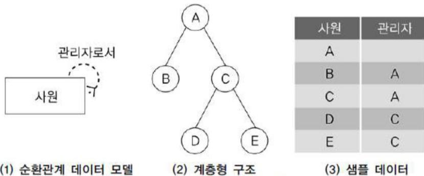

- - 계층형 데이터를 조회하기 위해 사용
- - 계층형 데이터: 동일 테이블에 계층적으로 상/하위 데이터가 포함됨
- ex) 사원 테이블의 사원들 사이에 “하위 사원”과 “상위 사원(관리자)” 관계
- - 엔터티를 순환관계 데이터 모델로 설계할 경우 계층형 데이터가 발생
- ex) 조직, 사원, 메뉴 등

- - 하나의 테이블 내 각 행끼리 관계를 가질 때, 연결고리를 통해 행과 행 사이의 계층(depth)을 표현하는 기법 ex) 부서별 상하관계

### - PRIOR의 위치에 따라 연결하는 데이터가 달라짐

```
-- 구문
SELECT 컬럼
FROM 테이블명
START WITH 시작조건 -- 시작점 지정하는 조건
CONNECT BY [NOCYCLE] PRIOR 연결조건;
-- → 시작점 기준으로 연결 데이터를 찾아가는 조건
```

- • START WITH: 계층 구조 전개의 시작 위치 지정, 루트노드, 최상위 노드
- - 루트노드는 LEVEL 값으로 1을 가진다.
- • CONNECT BY PRIOR: 행을 이어나갈 조건
- • NOCYCLE: A행 → B행, B행 → A행 같은 순환구조인 데이터는 무한 루프가 발생할 수 있어서 이를 방지하고자 할 때 사용

```
-- 부서 테이블에 대해 각 부서의 레벨 출력
SELECT *, LEVEL
FROM DEPT
START WITH PDEPT IS NULL -- PDEPT: 상위부서코드
CONNECT BY PRIOR DCODE = PDEPT;
```

| DCODE | DNAME | PDEPT | LEVEL |
|-------|-------|-------|-------|
| 0001  | 사장실   |       | 1     |
| 1000  | 경영지원부 | 0001  | 2     |
| 1001  | 재무관리  | 1000  | 3     |
| 1002  | 총무    | 1000  | 3     |
| 1003  | 기술부   | 0001  | 2     |
| 1004  | H/W지원 | 1003  | 3     |
| 1005  | S/W지원 | 1003  | 3     |

- - PRIOR 컬럼A = 컬럼B; 컬럼 위치 구분 법
- - 시작점의 컬럼A를 읽고 그 값을 컬럼B로 넘겨서 해당 조건이 일치하는 행을 찾는 것임.
- - 만약 PRIOR PDEPT = DCODE; 썼다면 시작점인 사장실 데이터에서 PDEPT 컬럼의 값을 먼저 읽게 되는데 이 경우 그 값이 NULL이다. 그럼 DCODE 값이 NULL인 곳을 찾아야 하는데 그런 행은 없으니 연결이 될 수가 없다.

■ 정리: 사장실의 DCODE를 넘겨 다시 각 행들의 PDEPT와 비교해야 하므로 먼저 정해져야 하는 값의 방향에 PRIOR을 전달해야 한다.

```
-- 잘못된 예시
SELECT *, LEVEL
FROM DEPT
START WITH PDEPT IS NULL
CONNECT BY DCODE = PRIOR PDEPT;
```

| DCODE | DNAME | PDEPT | LEVEL |
|-------|-------|-------|-------|
| 0001  | 사장실   |       | 1     |

■ PRIOR가 어디 위치하냐에 따라 출력되는 데이터가 다르니 주의

- ※ PRIOR 자식 = 부모 ~> [자식 → 부모] 자식에서 부모데이터로 순방할 전개
- ※ PRIOR 부모 = 자식 ~> [부모 → 자식] 부모에서 자식데이터로 역방향 전개

```
-- CONNECT BY에 조건 전달
SELECT *
FROM DEPT
START WITH PDEPT IS NULL
CONNECT BY PRIOR DCODE = PDEPT AND AREA = '서울지사';
```

| DCODE | DNAME | PDEPT | AREA |
|-------|-------|-------|------|
| 0001  | 사장실   |       | 포항본사 |
| 1000  | 경영지원부 | 0001  | 서울지사 |
| 1001  | 재무관리  | 1000  | 서울지사 |
| 1002  | 총무    | 1000  | 서울지사 |

- - AREA = '서울지사'라는 조건이 CONNECT BY 절에 쓰인거라 연결하려는 행을 찾는 조건에 쓰인 것이다.
- - 그래서 최상위노드인 사장실 데이터도 같이 출력된다.

```
-- WHERE 절에 조건 전달
SELECT *, LEVEL
FROM DEPT
WHERE AREA = '서울지사'
START WITH PDEPT IS NULL
CONNECT BY PRIOR DCODE = PDEPT;
```

| DCODE | DNAME | PDEPT | AREA | LEVEL |
|-------|-------|-------|------|-------|
| 1000  | 경영지원부 | 0001  | 서울지사 | 2     |
| 1001  | 재무관리  | 1000  | 서울지사 | 3     |
| 1002  | 총무    | 1000  | 서울지사 | 3     |

- - WHERE 절은 START WITH ..... CONNECT BY ..... 계층형 질의절이 모두 연산된 다음에 수행된다.
- - 따라서 서울지사가 아닌 사장실 데이터가 출력에서 제외되었다.

## 2. 계층형 질의 가상 컬럼

1) LEVEL: 검색 항목 데이터의 깊이, 루프노드(최상위 계층): 1

2) CONNECT\_BY\_ISLEAF: 리프노드(최하위 계층) 여부

- 해당 데이터가 **리프노드라면 1, 아니면 0 반환**

## 3. 계층형 질의 가상 함수

1) CONNECT\_BY\_ROOT 컬럼: 최상위(루프토드) 계층의 컬럼값 표시

2) SYS\_CONNECT\_BY\_PATH(컬럼, 경로분리자)

: 루트 데이터부터 현재 전개할 데이터까지 경로를 표시

3) ORDER SIBLINGS BY 컬럼: **형제 노드(동일 LEVEL) 사이에서 정렬 수행**

4) CONNECT\_BY\_ISCYCLE: 계층형 쿼리의 결과에서 순환이 발생했는가

- 자식 데이터와 조상 데이터가 같으면 1, 아니면 0 반환

```
SELECT CONNECT_BY_ROOT 사원 AS 루트사원,
                                SYS_CONNECT_BY_PATH(사원, '/') 경로, 사원, 관리자
FROM 사원
START WITH 관리자 IS NULL
CONNECT BY PRIOR 사원 = 관리자
```

| 루트사원 | 경로     | 사원 | 관리자 |
|------|--------|----|-----|
| A    | /A     | A  |     |
| A    | /A/B   | B  | A   |
| A    | /A/C   | C  | A   |
| A    | /A/C/D | D  | C   |

순환구조 예시 테이블 - EMP1

| EMP_ID | DEPTNO | MGR_ID | NAME |
|--------|--------|--------|------|
| 1000   | 10     | 2000   | 홍길동  |
| 2000   | 10     | 1000   | 강감찬  |

```
-- NOCYCLE 명시 X
SELECT EMP_ID, NAME, LEVEL
FROM EMP1
START WITH EMP_ID = 1000
CONNECT BY PRIOR EMP_ID = MGR_ID; -- 오류!
```

- 순환구조를 가진 데이터인데 NOCYCLE 명시하지 않아 오류

```
-- NOCYCLE 명시 0
SELECT EMP_ID, NAME, LEVEL,
                                CONNECT_BY_ISCYCLE AS IS_CYCLE
FROM EMP1
START WITH EMP_ID = 1000
CONNECT BY NOCYCLE PRIOR EMP_ID = MGR_ID;
```

| EMP_ID | NAME | LEVEL | IS_CYCLE |
|--------|------|-------|----------|
| 1000   | 홍길동  | 1     | 0        |
| 2000   | 강감찬  | 2     | 1        |

## 제 7절 PIVOT 절과 UNPIVOT 절 ‘데이터 구조를 변경하는 기능’

### 1. 데이터의 구조

#### 1) Long Data (Tidy Data) ‘통계 분석용’

- - 하나의 속성이 하나의 컬럼으로 정의되어 값들이 여러 행으로 쌓이는 구조
- - 동일한 키 값이 여러 번 반복될 수 있음
- - RDBMS의 데이터 설계 방식
- - 다른 테이블과의 조인 연산이 가능
- - 각 행이 관찰 단위를 나타내며,
- - 각 열은 측정 변수 또는 속성을 나타냄

| id | year | sales |
|----|------|-------|
| 1  | 2022 | 100   |
| 1  | 2023 | 120   |
| 2  | 2022 | 150   |
| 2  | 2023 | 130   |

### 2) Wide Data (Cross Table) ‘단순 보고서 작성이나 데이터 요약용’

- - 행과 컬럼에 유의미한 정보 전달을 목적으로 작성하는 교차표
- - 하나의 속성값이 여러 컬럼으로 분리되어 표현
- - 데이터가 많아질수록 열의 수가 급격히 늘어나니 분석을 위해선 비효율
- - 다른 테이블과의 조인 연산 불가능

| id | 2022 | 2023 |
|----|------|------|
| 1  | 100  | 120  |
| 2  | 150  | 130  |

### 2. 데이터 구조 변경

- PIVOT: Long Data → Wide Data ‘행 데이터를 열 데이터로’

- UNPIVOT: Wide Data → Long Data ‘열 데이터를 행 데이터로’

### 3. PIVOT

```
SELECT *
FROM (
  SELECT E.JOB, D.DNAME
  FROM EMP E
  JOIN DEPT D
  ON E.DEPTNO = D.DEPTNO
)
PIVOT (
  COUNT(*) FOR DNAME IN (
    'ACCOUNTING' AS ACCOUNTING,
    'RESEARCH' AS RESEARCH,
    'SALES' AS SALES
  )
);
```

| JOB      | ACCOUNTING | RESEARCH | SALES |
|----------|------------|----------|-------|
| CLERK    | 0          | 1        | 0     |
| SALESMAN | 1          | 0        | 3     |
| MANAGER  | 1          | 1        | 1     |
| ANALYST  | 0          | 2        | 0     |

#### 4. UNPIVOT

```
SELECT JOB, DEPARTMENT, EMP_COUNT
FROM PIVOT_TABLE
UNPIVOT (
  EMP_COUNT FOR DEPARTMENT IN (
    ACCOUNTING AS 'ACCOUNTING',
    RESEARCH AS 'RESEARCH',
    SALES AS 'SALES')
);
```

| JOB      | DEPARTMENT | EMP_COUNT |
|----------|------------|-----------|
| CLERK    | ACOUNTING  | 0         |
| CLERK    | RESEARCH   | 1         |
| CLERK    | SALES      | 0         |
| SALESMAN | ACOUNTING  | 1         |
| SALESMAN | RESEARCH   | 0         |
| SALESMAN | SALES      | 3         |
| MANAGER  | ACOUNTING  | 1         |
| MANAGER  | RESEARCH   | 1         |
| MANAGER  | SALES      | 1         |
| ANALYST  | ACOUNTING  | 0         |
| ANALYST  | RESEARCH   | 2         |
| ANALYST  | SALES      | 0         |

#### 제 8절 정규 표현식

##### 1. 정규 표현식

- - 문자열의 공통된 규칙을 보다 일반화하여 표현하는 방법  
  (공통적으로 가지고 있는 패턴을 표현하는 방법)
- - 정규 표현식 사용 가능한 문자함수 제공  
  (오라클: regexp\_replace, regexp\_substr, regexp\_instr, ...)
- - 특정 패턴을 가진 문자열을 검색, 매칭, 또는 수정할 때 사용하는 매우 강력한 도구
- - 텍스트 데이터 안에서 특정 규칙을 정의해, 이를 만족하는 문자열을 찾아내는 데 유용

##### 2. 정규 표현식의 종류

| 연산자 | 영문        | 설명                    |
|-----|-----------|-----------------------|
| .   | dot       | 모든 한 글자 (제외: newline) |
|     | or        | 대체 문자를 구분             |
| \   | backslash | 다음 문자를 일반 문자로 취급      |

정규 표현식의 기본 연산자

| 앵커 | 설명      |
|----|---------|
| ^  | 시작되는 글자 |
| \$ | 마지막 글자  |

| 연산자   | 설명                 |
|-------|--------------------|
| ?     | 0회 또는 1회 일치        |
| *     | 0회 이상 일치           |
| +     | 1회 이상 일치           |
| {m}   | m회 일치              |
| {m,}  | 최소 m회 일치           |
| {,m}  | 최대 m회 일치           |
| {m,n} | 최소 m회 일치, 최대 n회 일치 |

수량사

| 연산자        | 설명                       |
|------------|--------------------------|
| [char...]  | 문자 리스트 중 한 문자와 일치        |
| [^char...] | 문자 리스트에 포함되지 않은 한 문자와 일치 |

| 연산자        | 설명                        | 동일                    |
|------------|---------------------------|-----------------------|
| [:digit:]  | 숫자                        | [0-9]                 |
| [:lower:]  | 소문자                       | [a-z]                 |
| [:upper:]  | 대문자                       | [A-Z]                 |
| [:alpha:]  | 영문자                       | [a-zA-Z]              |
| [:alnum:]  | 영문자와 숫자                   | [0-9a-zA-Z]           |
| [:xdigit:] | 16진수                      | [0-9a-fA-F]           |
| [:punct:]  | 구두점 기호                    | [^[:alnum:][:cntrl:]] |
| [:blank:]  | 공백 문자                     |                       |
| [:space:]  | 공간 문자 (space, enter, tab) |                       |

| 연산자 | 설명                                  | 동일            |
|-----|-------------------------------------|---------------|
| \d  | 숫자                                  | [[:digit:]]   |
| \D  | 숫자가 아니 모든 문자                        | [^[:digit:]]  |
| \w  | 숫자와 영문자(underbar 포함)                | [[:alnum:]_]  |
| \W  | 숫자와 영문자가 아닌 모든 문자<br>(제외: underbar) | [^[:alnum:]_] |
| \s  | 공백 문자                               | [[:space:]]   |
| \S  | 공백 문자가 아닌 모든 문자                     | [^[:space:]]  |

### 3. 정규 표현식 함수 ★★

#### ① REGEXP\_LIKE 조건

: source\_char가 패턴과 일치하면 true, 일치하지 않으면 false를 반환

```
REGEXP_LIKE(source_char, pattern [, match_param])
```

- • source\_char: 검색 문자열
- • pattern: 검색 패턴
- • match\_param: 일치 옵션 (기본값: c)

일치 옵션: i 대소문자 무시  
 c 대소문자 구분  
 n dot(.)를 개행(줄바꿈) 문자와 일치  
 m 다중 행 모드 (앵커(^,\$)에 영향)  
 x 검색 패턴의 공백 문자를 무시

## ② REGEXP\_REPLACE 함수

: source\_char에서 일치한 패턴을 replace\_string으로 변경한 문자 값을 반환

```
REGEXP_REPLACE(source_char,  
    pattern[, replace_string[, position [, occurrence [, match_param]]]))
```

- • source\_char: 검색 문자열
- • pattern: 검색 패턴
- • replace\_string: 변경 문자열
- • position: 검색 시작 위치 (기본값: 1)
- • occurrence: 패턴 일치 횟수 (기본값: 1)
- • match\_param: 일치 옵션

## ③ REGEXP\_SUBSTR 함수

: source\_char에서 일치한 pattern을 반환

```
REGEXP_SUBSTR(source_char,  
    pattern, [, position[, occurrence [, match_param [, subexpr]]]))
```

- • source\_char: 검색 문자열
- • pattern: 검색 패턴
- • position: 검색 시작 위치 (기본값: 1)
- • occurrence: 패턴 일치 횟수 (기본값: 1)
- • match\_param: 일치 옵션
- • subexpr: 서브표현식 (0은 전체패턴, 1이상은 서브 표현식, 기본값은 0)

## ④ REGEXP\_INSTR 함수

: source\_char에서 일치한 pattern의 시작 위치를 정수로 반환

```
REGEXP_INSTR(source_char,  
    pattern [, position [, occurrence [, return_opt [, match_param [, subexpr]]]]))
```

- • source\_char: 검색 문자열
- • pattern: 검색 패턴
- • position: 검색 시작 위치 (기본값: 1)
- • occurrence: 패턴 일치 횟수 (기본값: 1)
- • return\_opt: 반환 옵션 (0은 시작위치, 1은 다음위치, 기본값은 0)
- • match\_param: 일치 옵션
- • subexpr: 서브표현식 (0은 전체패턴, 1이상은 서브 표현식, 기본값은 0)

## ⑤ REGEXP\_COUNT 함수

: source\_char에서 일치한 pattern의 횟수를 반환

```
REGEXP_COUNT(source_char, pattern [, position [, match_param]])
```

- • source\_char: 검색 문자열
- • pattern: 검색 패턴
- • position: 검색 시작 위치 (기본값: 1)
- • match\_param: 일치 옵션

## II. SQL 기본 및 활용(3)

### 3장. 관리 구문

#### 제 1절 DML(Data Manipulation Language)

##### 1. DML

- - 만들어진 테이블에 관리하기를 원하는 자료들을 입력, 수정, 삭제, 조회하는 명령어
- - 데이터 입력(INSERT), 수정(UPDATE), 삭제(DELETE), 조회(SELECT)
- - 추가: 병합(MERGE)
- - **COMMIT, ROLLBACK 필수**

##### 2. INSERT

```
-- 원하는 컬럼에만 데이터 입력
INSERT INTO 테이블명 (열1, 열2, 열5, 열7) VALUES (값1, 값2, 값5, 값7);
-- 전체 컬럼에 데이터 입력
INSERT INTO 테이블명 VALUES (값1, 값2, 값3, ..., 값n);
```

- - 테이블에 행 데이터 삽입
- - ORACLE: 한 번에 한 행만 입력 가능  
  / SQL Server: 여러 행 동시 삽입 가능
- - 컬럼별 데이터타입과 사이즈에 맞게 하나의 값만 삽입
- - 일부 컬럼만의 입력도 가능, 작성하지 않은 컬럼은 NULL 입력됨
- ■ NOT NULL이 제약조건인 컬럼인 경우, 오류 발생
- - 문자 컬럼에 숫자값을 입력해도 오류는 뜨지 않으나 권장하지 않음
- - 오라클에서 " 데이터를 삽입하면 NULL로 입력됨
- ■ 따라서 해당 데이터를 조회하려면 IS NULL 조건을 사용해야 함
- - SQL Server에서 " 데이터를 삽입하면 아무것도 입력X(NULL입력 아님)
- ■ 따라서 해당 데이터를 조회하려면 = " 라 입력해야 함

### 3. UPDATE

UPDATE 테이블명

SET 수정할컬럼1 = 수정값1, 수정할컬럼2 = 수정값2, ...

WHERE 조건;

- - 데이터 수정 수행
- - 컬럼 단위 수행
- - **다중 컬럼 수정이 가능**
- - SET에 수정할 컬럼과 새로 넣어줄 값을 설정
- - WHERE 절에 수정할 행을 선택하는 조건을 입력
- ■ 조건을 지정해주지 않으면 모든 행들이 수정됨

-- 서브쿼리를 사용한 데이터 수정

UPDATE 테이블명

SET (수정할컬럼1, 수정할컬럼2, ...) = (수정값1, 수정값2, ...)

WHERE 조건;

※ 서브쿼리의 결과가 수정할 각 행의 값마다 하나씩 전달된다.  
즉, 수정할 컬럼 개수만큼 수정값이 있어야 한다는 얘기

UPDATE EMP

```
SET (SAL, COMM) = (SELECT AVG(SAL), AVG(COMM)
                                                    FROM EMP)
```

```
WHERE ENAME = 'John';
```

서브쿼리 사용 예시

#### 4. DELETE

```
DELETE [FROM] 테이블명  
WHERE 조건;
```

- - 데이터 삭제 수행
- - 행 단위 실행
- - 조건을 붙이지 않은 경우, 테이블에 존재하는 모든 데이터가 삭제됨

#### 5. 주의

- - DB는 DDL 명령어와 DML 명령어의 처리 방식에는 차이가 있다.
- - DDL의 경우, 직접 DB에 영향을 미쳐 DDL 명령어를 입력하는 순간 해당 작업이 즉시(AUTO COMMIT)이 완료된다.
- - DML의 경우, 조작하려는 테이블을 메모리 버퍼에 올려놓고 작업을 해서 실시간으로 테이블에 영향을 미치는 것이 아니다.
- - 따라서 버퍼에서 처리한 DML 명령어가 실제 테이블에 반영되기 위해 선 COMMIT 명령어를 입력해 TRANSACTION을 종료해야 한다.
- - SQL Server: DML도 AUTO COMMIT으로 처리됨

#### 6. MERGE

```
MERGE INTO 수정할테이블 AS TGT  
USING 참조테이블 AS SRC  
ON (연결조건) --괄호 필수  
WHEN MATCHED THEN  
  UPDATE --테이블명 생략  
  SET 수정내용  
  DELETE (조건) --괄호 생략 가능  
WHEN NOT MATCHED THEN  
  INSERT (컬럼1, 컬럼2, ...)  
  VALUES (값1, 값2, ...);
```

- - 데이터 병합
- - 참조 테이블의 데이터를 기준으로 다른 테이블을 수정하는 것
- - 참조 테이블과 동일하게 맞추는 작업
- - UPDATE와 DELETE, INSERT를 한 번의 작업으로 수행 가능

```
MERGE INTO TEAM T  
USING MEMBER M  
ON (T.member_id = M.member_id)  
WHEN MATCHED THEN  
  UPDATE SET T.name = M.name, T.email = M.email  
WHEN NOT MATCHED THEN  
  INSERT (team_id, name, email)  
  VALUES (M.member_id, M.name, M.email);  
예시
```

#### 7. SELECT

```
SELECT [ALL/DISTINCT] 칼럼명  
FROM 테이블명;
```

#### 8. 산술 연산자

- - NUMBER 와 DATE 자료형에 적용
- - 수학에서의 사칙연산
- - 수학에서와 같이 (), \*, /, +, - .의 우선순위를 가짐

## 9. 합성 연산자

```
-- (1) || (Oracle)  
SELECT FIRST_NAME || ' ' || LAST_NAME AS FULL_NAME  
FROM EMPLOYEES;  
-- (2) + (SQL Server)  
SELECT FIRST_NAME + ' ' + LAST_NAME AS FULL_NAME  
FROM EMPLOYEES;  
-- (3) CONCAT  
SELECT CONCAT('Hello, ', 'World!') AS greeting;
```

- - 컬럼과 문자 또는 다른 컬럼을 연결시킨다.
- - 문자 표현식의 결과에 의해 새로운 컬럼을 생성한다.

```
SELECT PLAYER_NAME +'선수, '+ HEIGHT +'cm, '+ WEIGHT +'kg'  
--실행 결과--  
안대현선수, 179cm, 72kg
```

## 제 2절 TCL(Transaction Control Language)

### 1. TCL

- - 트랜잭션 제어어로 COMMIT, ROLLBACK, SAVEPOINT 포함
- - DML에 의해 조작된 결과를 작업단위(트랜잭션)별로 제어

### 2. 트랜잭션

- - 데이터베이스의 논리적 연산단위
- - 분할할 수 없는 최소의 단위
- ■ 따라서, 전부 적용하거나 전부 취소해야 (ALL OR NOTHING)

- ■ 즉, 모두가 COMMIT 하거나 ROLLBACK 처리해야 함

ex) 계좌이체는 하나의 계좌에서는 금액이 빠지고 다른 하나의 계좌에서는 금액이 더해지는 일이 모두 성공적으로 완료가 되었을 때 종료된다. 하나라도 실패할 경우 두 계좌는 원래의 금액을 유지해야만 한다.

## 3. 트랜잭션의 특징

### ① 원자성(Atomicity)

- 트랜잭션에서 정의된 연산들은 모두 성공적으로 실행되던가 아니면 전혀 실행되지 않은 상태로 남아 있어야 한다. (ALL OR NOTHING)

### ② 일관성(Consistency)

- 트랜잭션이 실행되기 전의 데이터베이스 내용이 잘못되어 있지 않다면 트랜잭션이 실행된 이후에도 데이터베이스의 내용에 잘못이 있으면 안된다.

### ③ 고립성(Isolation)

- 트랜잭션이 실행되는 도중에 다른 트랜잭션의 영향을 받아 잘못된 결과를 만들어서는 안된다.

### ④ 지속성(Durability)

- 트랜잭션이 성공적으로 수행되면 그 트랜잭션이 갱신한 데이터베이스의 내용은 영구적으로 저장된다.

## 4. COMMIT

- - 올바르게 반영된 데이터를 데이터베이스에 반영시키는 것
- - 입력, 수정, 삭제한 데이터에 이상이 없을 시 데이터를 저장하는 명령어
- - COMMIT을 수행하면 COMMIT 이전에 수행된 DML은 모두 저장되며 되돌릴 수 없음

- - ORACLE: DDL 시 AUTO COMMIT(23c 버전부터 비활성화 가능)
- - SQL Server: AUTO COMMIT 비활성화 설정 가능

## 5. SQL Server의 COMMIT

- - ORACLE: DML시 사용자가 COMMIT / ROLLBACK 수행해야 트랜잭션 종료
- - SQL Server: 기본적으로 AUTO COMMIT 모드라 DML 수행 후 사용자가 COMMIT / ROLLBACK 처리할 필요 없음
- - DML 구문이 문제 없으면 자동 COMMIT 되고, 오류 발생 시 자동 ROLLBACK 처리됨

## 6. SQL Server의 3가지 트랜잭션 방식

### 1) AUTO COMMIT

- - SQL Server의 기본 방식으로, DML, DDL 명령어가 성공적으로 수행되면 자동 COMMIT 수행, 오류 발생 시 자동 ROLLBACK 수행

### 2) 암시적 트랜잭션

- - ORACLE과 같은 방식으로 처리
- - 즉 사용자가 명시적으로 COMMIT / ROLLBACK 처리
- - 인스턴스 단위 또는 세션 단위로 설정 가능

### 3) 명시적 트랜잭션

- - 트랜잭션의 시작과 끝을 모두 사용자가 명시적으로 지정
- - BEGIN TRANSACTION (BEGIN TRAN)으로 트랜잭션을 시작하고
- - COMMIT TRANSACTION 또는 ROLLBACK TRANSACTION으로 트랜잭션을 종료함 (이 때 TRANSACTION 생략 가능)
- - ROLLBACK 구문 만나면 최초의 BEGIN TRANSACTION 시점까지 모두 ROLLBACK 수행

## 7. ROLLBACK

- - 데이블 내 입력한 데이터나 수정한 데이터, 삭제한 데이터에 대하여 변경을 취소하는 명령어
- - 데이터베이스에 저장되지 않고 최종 COMMIT 지점 / 변경 전 / 특정 SAVEPOINT 지점으로 원복됨
- - 최종 COMMIT 시점 이전까지 ROLLBACK 가능
- - SAVEPOINT를 통해 최종 COMMIT 시점이 아닌, 원하는 시점으로의 원복이 가능
- - SQL Server는 AUTO COMMIT이 기본 방식이라 임의적으로 ROLLBACK 수행하려면 명시적으로 트랜잭션을 선언해야 함

```
-- ORACLE
UPDATE PLAYER
SET PRICE = 2800
WHERE DRINK = '아메리카노';ROLLBACK;-- SQL Server
BEGIN TRAN
UPDATE PLAYER
SET PRICE = 2800
WHERE DRINK = '아메리카노';ROLLBACK;
```

## 8. COMMIT과 ROLLBACK을 통한 효과

- - 데이터 무결성 보장
- - 영구적인 변경을 하기 전에 데이터의 변경 사항 확인 가능
- - 논리적으로 연관된 작업을 그룹핑하여 처리 가능

## ※ 정리

```
UPDATE A SET VAL = 10;                                                    -- DML, 트랜잭션 시작
CREATE TABLE B (ID CHAR(3) PRIMARY KEY);      -- DDL, 자동 커밋 발생
INSERT INTO B VALUES ('1');                                                -- DML, 새로운 트랜잭션
ROLLBACK;
```

- - Oracle에서 DDL 명령어(CREATE TABLE, ALTER TABLE 등)가 실행되면, 해당 DDL 이전에 수행된 모든 DML 작업이 자동으로 커밋된다.
- - 즉, DDL이 발생하기 전까지의 모든 트랜잭션이 커밋되고, 이후부터는 새로운 트랜잭션이 시작되는 것

## 9. SAVEPOINT(저장점)

- - SAVEPOINT를 통해 트랜잭션에 포함된 전체 작업을 롤백하는 것이 아니라 **현 시점에서 SAVEPOINT까지 트랜잭션의 일부만 롤백 가능**
- - 사용자가 원하는 위치에 원하는 이름으로 설정 가능
- - **ROLLBACK TO savepoint로 원하는 지점으로 원복 가능 (COMMIT 이전으로는 원복 불가)**
- - 복수의 savepoint를 정의할 수 있고, 동일이름으로 정의했을 시, 나중에 정의한 저장점이 유효함

```
-- ORACLE
SAVEPOINT a;ROLLBACK TO a;-- SQL Server
SAVE TRANSACTION a;ROLLBACK TRANSACTION a;
```

```
SELECT COUNT(*)
FROM PLAYER; -- 결과: 480SELECT COUNT(*)
FROM PLAYER
WHERE WEIGHT = 100; -- 결과: 0INSERT INTO PLAYER
(PLAYER_ID, TEAM_ID, PLAYER_NAME, POSITION, HEIGHT, WEIGHT)
VALUES ('135', 'K02', '이운재', 'GK', 182, 82);SAVEPOINT SVPT_A;
-----
UPDATE PLAYER
SET WEIGHT = 100;SAVEPOINT SVPT_B;
-----
DELETE FROM PLAYER;
```

CASE1] ROLLBACK TO SVPT\_B: PLAYER 삭제되기 전으로

CASE2] ROLLBACK TO SVPT\_A: 선수들의 몸무게가 전부 100kg 되기 전으로

CASE3] ROLLBACK: 이운재 선수가 추가되기 전으로

## 제 3절 DDL(Data Definition Language)

- 1. 데이터 유형 (앞: Oracle, 뒤: SQL Server)
  - CHAR(n): 고정 길이 문자열, 할당된 변수 값의 길이가 n 이하면 n만큼 공백으로 채워짐, CHAR(5)인데 ‘Lee’라는 3바이트 글자를 넣으면 부족한 자리 만큼 공백으로 채워 5바이트로 저장됨

[문자열 비교 방식] ‘AA’ = ‘AA’

- VARCHAR2(n), VARCHAR(n): 가변 길이 문자열, 할당되는 변수 값의 길이가 최대 n, VARCHAR(15)로 15바이트가 지정되더라도 ‘Park’ 으로 데이터가 입력되면 4바이트의 공간만을 차지

[문자열 비교 방식] ‘AA’ ≠ ‘AA’

- NUMBER(p, s), NUMERIC(p, s): 정수, 실수 등 숫자 정보

ex) NUMBER(6,2): 전체 자리수가 60이고 소수 자리 수는 2인 숫자 1234.56 (가능), 12345.67(오류!)

- DATE, DATETIME: 날짜와 시각 정보

1. 테이블명은 객체를 의미할 수 있는 적절한 이름 사용, 단수형 권고
2. 테이블명은 다른 테이블명과 중복되지 않아야 함
3. 한 테이블 내에서는 컬럼명은 중복될 수 없음
4. 테이블명을 지정하고 각 컬럼들은 괄호 “()”로 묶어 지정
5. 각 컬럼들은 콤마 “,”로 구분되고, 테이블 생성문의 끝은 항상 세미콜론으로 “;” 끝남
6. 컬럼에 대해서는 다른 테이블까지 고려하여 데이터베이스 내에서는 일관성 있게 사용하는 것이 좋음
7. 컬럼 뒤에 데이터 유형은 꼭 지정되어야 함
8. **테이블명과 컬럼명은 반드시 문자로 시작해야 함**
9. 벤더에서 사전에 정의한 예약어는 사용 불가
10. A-Z, a-z, 0-9, \_, \$, # 문자만 허용됨

### 3. CREATE

**CREATE TABLE** [소유자.]테이블명 ( **칼럼1** 데이터타입 [**DEFAULT**] [제약조건], **칼럼2** 데이터타입 [**DEFAULT**] [제약조건], ... ) ;

- 테이블, 인덱스 등의 **객체를 생성하는 명령어**
- 테이블 생성 시 각 컬럼의 제약조건 및 기본값은 생략 가능
- 테이블 생성 시 소유자 명시 가능 (생략 시 명령어 수행 계정의 소유)
- 숫자컬럼의 경우 컬럼 사이즈 생략 가능 (날짜 컬럼은 사이즈 명시X)
- 테이블 생성 시 대/소문자 구분X
  (기본적으로 테이블명, 컬럼명은 대문자)

## 4. 테이블 생성시 주의사항

## 2. DDL

- 데이터 정의어
- **데이터의 구조를 정의** (객체 생성, 삭제, 변경)
- CREATE(객체 생성), ALTER(객체 변경), TRUNCATE(테이블 내 모든 데이터 삭제, 테이블 삭제 X)
- 스키마, 도메인, 테이블, 뷰, 인덱스를 정의/변경/제거할 때 사용
- **AUTO COMMIT 이라 ROLLBACK 불가**
  - \* TRUNCATE이 데이터 삭제라 DML에 껴야 할 것 같지만 AUTO COMMIT 특성 때문에 DDL에 포함됨

## 5. 테이블 복제 (CTAS) '이미 만들어진 테이블을 활용해서 테이블 재생성'

```
-- ORACLE
CREATE TABLE 테이블명
AS
SELECT * FROM 복제할테이블명;-- SQL Server
SELECT * INTO 테이블명
FROM 복제할테이블명;
```

- - 복제할 테이블의 컬럼명과 컬럼의 데이터 타입이 복제됨
- - SELECT 문에서 컬럼 별칭 사용 시 컬럼 별칭으로 이름 생성
- - CREAT 문에서 컬럼명 변경 가능
- - NULL 속성도 복제됨
- - 구조뿐만 아니라 데이터도 복제가 되니 WHERE 절을 명시해서 일부 데이터만 제한해서 복제하는 것도 가능
- - 테이블에 있는 기본키, 고유키, 외래키, CHECK등의 제약 조건은 복제X \* 기존 테이블의 제약조건 중 NOT NULL만 복제 적용됨.

```
-- 테이블 생성
CREATE TABLE BOOK(
ID VARCHAR2(10),
NAME VARCHAR2(100),
PRICE NUMBER
PUBLISHER_DATE DATE
);
```

테이블 생성 예시

```
-- 테이블 복제
CREATE TABLE test
AS
SELECT * FROM BOOK;-- 데이터 없이 테이블의 구조만 복제
CREATE TABLE test
AS
SELECT * FROM BOOK
WHERE 1 = 2;
```

```
-- 테이블 복제 시 칼럼명 변경
CREATE TABLE test(BOOK_ID, BOOK_NAME)
AS
SELECT ID, NAME
FROM BOOK;
```

- 데이터 없이 테이블의 구조만 복제하고 싶은 경우, WHERE 절에 거짓인 조건을 적어 데이터는 가져오지 않고 테이블의 구조만 복사하게 한다.

## 6. 생성된 테이블 구조 확인

```
-- ORACLE
DESCRIBE EMPLOYEES; -- DESC로 생략 가능-- SQL Server
exec sp_help 'dbo.EMPLOYEES'
go
```

## 7. ALTER

```
ALTER TABLE 테이블명 ADD 컬럼명 데이터유형                         -- 컬럼 추가
ALTER TABLE 테이블명 MODIFY 컬럼명                                -- 컬럼 수정
ALTER TABLE 테이블명 RENAME COLUMN 컬럼명 TO 새컬럼명                    -- 컬럼명 변경
ALTER TABLE 테이블명 DROP COLUMN 컬럼명                                -- 컬럼 삭제
ALTER TABLE 테이블명 DROP CONSTRAINT 제약조건명                            -- 제약조건 삭제
ALTER TABLE 테이블명 ADD CONSTRAINT 제약조건명 제약조건 -- 제약조건 추가
```

- 테이블의 구조 변경

ex) 컬럼명, 컬럼 데이터타입, 컬럼사이즈, default값, 컬럼 삭제,

컬럼 추가, 제약조건 정의

- 컬럼 순서 변경은 불가능 (순서 변경 원할 시 테이블 재생성해야)

## 8. 컬럼 추가

```
ALTER TABLE 테이블명 ADD 컬럼명 데이터타입 [DEFAULT] [제약조건];
```

- 새로 추가된 컬럼은 테이블의 마지막 컬럼이 되며 위치 지정 불가

- 컬럼 추가 시 데이터타입 필수, DEFAULT와 제약조건은 필수 X

- 여러 컬럼 동시 추가도 가능 (이때는 반드시 괄호 사용)

```
ALTER TABLE PLAYER ADD ADDRESS VARCHAR2(50);
```

```
ALTER TABLE PLAYER ADD (ADDRESS VARCHAR2(50));
```

```
ALTER TABLE PLAYER ADD (BIRTHDAY DATE, ADDRESS VARCHAR2(80));
```

```
ALTER TABLE PLAYER ADD BIRTHDAY DATE, ADDRESS VARCHAR2(80); -- 오류!
```

```
ALTER TABLE PLAYER ADD BIRTHDAY DATE NOT NULL; -- 불가능
```

```
ALTER TABLE PLAYER
```

```
ADD STADIUM VARCHAR2(25)
```

```
DEFAULT '전주월드컵경기장' NOT NULL; -- 가능
```

- 이미 테이블에 데이터들이 들어가 있는 경우 NOT NULL의 속성을 가진 새 컬럼의 추가는 불가능하다. (기존 데이터들이 해당 컬럼의 속성값으로 전부 NULL을 가지게 되므로)

■ 데이터가 아직 없는 경우엔 상관없다.

- 하지만 컬럼을 추가 시 default 값을 지정해주면 NOT NULL의 속성을 가진 새 컬럼의 추가는 가능하다.

## 9. 컬럼 속성 변경/수정

```
-- ORACLE
```

```
ALTER TABLE 테이블명
```

```
MODIFY (컬럼명1 데이터유형 [DEFAULT] [NOT NULL],
                                           컬럼명2 데이터유형2 ...);
```

```
-- SQL Server '한 번에 하나의 컬럼만 수정 가능'
```

```
ALTER TABLE 테이블명
```

```
ALTER COLUMN 컬럼명1 데이터유형 [DEFAULT] [NOT NULL];
```

```
ALTER TABLE 테이블명
```

```
ALTER COLUMN 컬럼명2 데이터유형 [DEFAULT] [NOT NULL];
```

- 수정할 컬럼이 한 개일 경우 괄호 생략 가능

- 테이블에 이미 존재하는 컬럼에 대해서 컬럼의 데이터 유형, default 값, NOT NULL 제약조건에 대한 변경 가능

## 1) 컬럼 사이즈 변경

```
ALTER TABLE TEST MODIFY (COL1 VARCHAR2(50));    -- ORACLE
ALTER TABLE TEST ALTER COLUMN COL1 VARCHAR(50);   -- SQL Server
```

- - 컬럼 사이즈 증가는 항상 가능
- - 컬럼 사이즈 축소는 데이터 존재 여부에 따라 제한됨  
  (데이터가 있는 경우, 데이터의 최대 사이즈만큼 축소가 가능)

## 2) 데이터 타입 변경

```
-- VARCHAR2(10) 속성을 가진 DEPTNO
ALTER TABLE EMP MODIFY DEPTNO NUMBER(3);
-- 아직 depto 컬럼에 데이터가 없을 경우 변경 가능
```

- - 컬럼이 NULL 값만 가지거나 데이터가 비어져 있는 컬럼이면 데이터 타입 변경 가능
- - CHAR, VARCHAR 타입의 경우 데이터가 있어도 서로 변경 가능

## 3) DEFAULT 값 변경

```
ALTER TABLE EMP MODIFY (SAL DEFAULT 2500);
```

- - DEFAULT 값: 특정 컬럼에 값을 지정하지 않은 경우 자동으로 부여되는 값
- - NULL 값을 넣는다면 default 값이 아닌 NULL이 입력됨 (NULL도 값이니까)
- - 이미 데이터가 존재하는 특정 컬럼의 default 값을 바꾸면 변경 작업 이후 발생하는 행 삽입에만 영향을 미친다. (즉 기존 데이터는 수정 안됨)
- - default 값을 NULL로 선언하면 default 값 해제 가능

## 10. 컬럼 이름 변경

```
-- ORACLE
ALTER TABLE 데이블명
RENAME COLUMN 컬럼명 TO 새컬럼명;-- SQL Server
EXEC sp_rename 'dbo.데이블명.컬럼명', '새컬럼명', 'COLUMN';
```

- - 컬럼의 이름 변경은 항상 가능 (데이터 존재 여부와 상관 X)
- - 동시에 여러 컬럼 이름 변경은 불가능

```
ALTER TABLE EMP
RENAME COLUMN ENAME TO FIRST_NAME;
```

## 10+ 데이블 이름 변경

```
-- ORACLE
RENAME 데이블명 TO 새데이블명;-- SQL Server
sp_rename 'dbo.데이블명', '새데이블명';
```

- - 컬럼뿐만이 아니라 데이블 이름도 변경이 가능하다

```
-- ORACLE
RENAME season1 TO season2;
-- SQL Server
sp_rename 'dbo.season1', 'season2';
```

## 11. 컬럼 삭제

```
ALTER TABLE 데이블명 DROP COLUMN 삭제할칼럼명;
-- 예시
ALTER TABLE PLAYER DROP COLUMN ADDRESS;
ALTER TABLE PLAYER DROP COLUMN ADDRESS, BIRTHDAY; -- 오류!
```

- - 데이터 존재 여부와 상관없이 필요 없는 컬럼 삭제 가능
- - **한 번에 하나의 컬럼만 삭제 가능**
- - 컬럼 삭제 후 최소 하나 이상의 컬럼이 테이블에 존재해야 함
- - 삭제된 컬럼은 복구가 불가능

## 11+ 객체(테이블, 인덱스 등) 삭제

```
DROP TABLE 데이블명 [CASCADE CONSTRAINT];
-- 예시
DROP TABLE PLAYER;
```

- - **테이블의 모든 데이터 및 구조를 삭제**
- - CASCADE CONSTRAINT 옵션은 해당 테이블과 관계가 있었던 참조되는 제약조건에 대해서도 삭제한다는 것을 의미
- - CASCADE CONSTRAINT 옵션을 지정하지 않으면 참조 중인 제약 조건이 있을 때 삭제가 불가능할 수 있음.
- - SQL Server에서는 CASCADE 옵션이 X, 따라서 테이블을 삭제하기 전에 참조하는 FOREIGN KEY 제약 조건 또는 참조하는 테이블을 먼저 삭제해야 함.
- - 삭제 후 복구 ROLLBACK 불가, 삭제 후 DESC 로 확인불가

## 12. TRUNCATE

```
TRUNCATE TABLE 데이블명;
-- 예시
TRUNCATE TABLE PLAYER;
```

- - 테이블 자체 삭제X, 테이블의 구조만 남기고 전체 데이터 삭제
- - ROLLBACK 불가
- - 삭제 후 DESC로 확인가능

## ▼ DELETE / DROP / TRUNCATE TABLE 차이 ★

| DELETE                      | DROP                          | TRUNCATE                |
|-----------------------------|-------------------------------|-------------------------|
| DML                         | DDL                           |                         |
| COMMIT 이전이라면<br>ROLLBACK 가능 | ROLLBACK 불가능<br>(Auto Commit) |                         |
| 데이터 일부<br>또는 전체 삭제          | 데이터와 테이블 구조<br>모두 삭제          | 데이터 전체 삭제<br>테이블 구조는 남김 |
| 데이터 하나씩 삭제                  | 전체 데이터 한 번에 삭제                |                         |

## 제약 조건(CONSTRAINT)

- - 데이터의 무결성을 유지하기 위해 특정 컬럼에 설정하는 제약
- - 테이블에 데이터가 올바르게 들어올 수 있도록 거는 제약 장치 ex) 예를 들어 학번은 NULL이면 안되고, 종복되어도 안됨 등
- - 테이블 생성 시 정의 가능, 컬럼 추가 시 정의 가능.  
  이미 생성된 컬럼에 제약조건만 추가 가능

### 1. PRIMARY KEY(기본키) ★★★

- - 행 데이터를 고유하게 구별하는 식별자
- - 종복 허용 X, NULL 허용 X  $\Rightarrow$  UNIQUE + NOT NULL
- - 기본키 제약 정의하면 DBMS는 자동으로 UNIQUE 인덱스 생성함
- - PK 생성하면 NOT NULL 특징 자동 부여  
  (그냥 NOT NULL이면 CTAS시 복사되나 PK로 인한 건 복사되지 X)
- - 하나의 테이블에 하나의 기본키만 생성 가능
- - 하나의 기본키를 여러 컬럼을 결합하여 생성할 수 있음
- - 제약조건에 이름을 명시하고 싶으면 CONSTRAINT과 함께 이름을 전달해주면 된다  
  (제약조건명 생략 시 DBMS에서 자동으로 이름을 부여함)

### 1) 테이블 생성 시 제약조건 생성

```
CREATE TABLE 테이블명(  
  컬럼1 데이터타입 [DEFAULT 기본값] [CONSTRAINT 제약조건명] 제약조건종류,  
  컬럼2 데이터타입 [DEFAULT 기본값] [CONSTRAINT 제약조건명] 제약조건종류,  
  ....  
);
```

-- 복합키

CREATE TABLE 테이블명 (

컬럼1 데이터타입,

컬럼2 데이터타입,

컬럼3 데이터타입,

CONSTRAINT pk\_제약조건명 PRIMARY KEY (컬럼1, 컬럼2)

);

-- 기본키, 외래키

CREATE TABLE 테이블명 (

컬럼1 데이터타입,

컬럼2 데이터타입,

컬럼3 데이터타입,

CONSTRAINT pk\_제약조건명 PRIMARY KEY (컬럼1),

CONSTRAINT fk\_제약조건명 FOREIGN KEY (컬럼3) REFERENCES 참조테이블(참조컬럼)  
);

- 이렇게 밑에서 제약조건을 지정해 줄 수도 있다.

- 이 방식은 복합키나 외래키 설정할 때 사용

- PK나 FK는 default값 가지지 않음

■ PK는 고유성에 위배되며. FK의 경우 기본값이 참조 테이블에 존재하지 않는 경우 무결성 제약 조건을 위반할 위험이 있음

### 2) 컬럼 추가 시 제약조건 생성

ALTER TABLE 테이블명

ADD 컬럼명 데이터타입 [DEFAULT 기본값] CONSTRAINT 제약조건명 제약조건종류;

### 3) 이미 생성된 컬럼에 제약조건 추가

```
ALTER TABLE 테이블명
ADD CONSTRAINT 제약조건명 제약조건종류 (컬럼명);
```

### 4) 제약조건 삭제

```
ALTER TABLE 테이블명 DROP CONSTRAINT 제약조건명;
```

## 2. UNIQUE(고유)

```
CREATE TABLE TEST(
  ID NUMBER,
  NAME VARCHAR2(10) UNIQUE);-- 예시
INSERT INTO TEST VALUES(1, 'a');
INSERT INTO TEST VALUES(2, 'a'); -- 중복값을 넣었으니 오류
INSERT INTO TEST VALUES(2, NULL);
INSERT INTO TEST VALUES(3, NULL); -- NULL값은 상관 없음
```

- 중복 허용 X, NULL 허용, UNIQUE INDEX 자동 생성

### 3. NOT NULL

- - 다른 제약조건과 달리 컬럼의 특징을 나타냄 ⇨ CTAS로 복제 시 따라감
- - 컬럼 생성 시 NOT NULL을 선언X 면 NULLABLE 컬럼으로 생성됨

-- 예시

```
ALTER TABLE TEST ADD NOT NULL(COL1)               -- 불가능
ALTER TABLE TEST MODIFY COL1 NOT NULL;             -- 이렇게 써야함
ALTER TABLE TEST MODIFY COL1
                                                           -- 제약조건에 이름 넣기
                                                           CONSTRAINT test_c1_nn NOT NULL;
```

## 4. FOREIGN KEY(외래키)

- - 자식 테이블에 FK를 겸
- - 참조테이블의 참조 컬럼에 있는 데이터를 확인하면서 본 테이블 데이터를 관리할 목적으로 생성
- - 즉, 부모 테이블의 특정 키의 있는 정보만을 가지고 자식 테이블의 데이터를 관리하겠다는 것
- - 반드시 참조(부모)테이블의 참조 컬럼(REFERENCE KEY)이 사전에 PK 혹은 UNIQUE KEY를 가져야 함

```
CREATE TABLE 테이블명 (
  컬럼1 데이터타입 PRIMARY KEY,
  컬럼2 데이터타입,
  컬럼3 데이터타입 REFERENCES 참조테이블(참조컬럼)
);CREATE TABLE 테이블명 (
  컬럼1 데이터타입,
  컬럼2 데이터타입,
  컬럼3 데이터타입,
  CONSTRAINT pk_제약조건명 PRIMARY KEY (컬럼1),
  CONSTRAINT fk_제약조건명 FOREIGN KEY (컬럼3) REFERENCES 참조테이블(참조컬럼)
);
```

```
CREATE TABLE EMP1 AS SELECT * FROM EMP; -- 자식
CREATE TABLE DEPT1 AS SELECT * FROM DEPT; -- 부모-- 부모 테이블의 REFERENCE KEY(참조데상)에 PK 설정
ALTER TABLE DEPT1 ADD CONSTRAINT DEPT_PK PRIMARY KEY(DEPTNO);-- 자식 테이블에 FK 생성
ALTER TABLE EMP1 ADD CONSTRAINT EMP_FK
    FOREIGN KEY(DEPTNO) REFERENCES DEPT1(DEPTNO);;
```

- 사원정보 보다는 부서정보가 먼저 만들어져야 함 → 부서테이블이 부모

▼ FK가 생성된 이후 부모와 자식 테이블에 걸리는 제약

- - FK에 부모가 가지고 있는 정보값만 INSERT 가능
- - UPDATE도 마찬가지로 부모가 가지고 있는 값으로만 가능
- - DELETE는 상관 X
- - 자식과 다르게 부모는 삭제 불가 (자식이 있는 상태에서 삭제 불가)
- - 자식이 이미 있는 상태에서 값수정도 불가능

```
-- 자식 테이블에서 3번 부서원 삭제 시도
DELETE EMP1 WHERE DEPTNO = 3; -- 가능-- 자식 테이블에서 5번 부서원을 50번으로 변경 시도
UPDATE EMP1 SET DEPTNO = 50 WHERE DEPTNO = 20; -- 불가능-- 자식 테이블에서 50번 부서원 입력 시도
INSERT INTO EMP1(EMPNO, ENAME, DEPTNO)
    VALUES('101', 'RICK', 50); -- 불가능
```

- 부모 테이블에 50번 부서번호가 정의되어 있지 않아 자식 테이블에서

해당 값으로 수정이 불가능하고, 해당 값으로의 입력도 불가능한 것이다.

```
-- 부모 테이블에서 3번 부서 삭제 시도
DELETE DEPT1 WHERE DEPTNO = 3; -- 불가능-- 부모 테이블에서 3번 부서를 70번 부서로 변경 시도
UPDATE DEPT1 SET DEPTNO = 70 WHERE DEPTNO = 3; -- 불가능
```

- 3번 부서 정보가 자식 테이블에 이미 존재하니 삭제 및 변경 불가

▼ FOREIGN KEY 옵션 (생성 시 정의, 변경 불가 → 재생성해야)

1) ON DELETE CASCADE:

- - 부모 데이터 삭제 시 자식 데이터도 함께 삭제
- 2) ON DELETE SET NULL:
- - 부모 데이터 삭제 시 자식 데이터의 참조값은 NULL 로 수정

```
ALTER TABLE EMP1 DROP CONSTRAINT EMP_FK;
ALTER TABLE EMP1 ADD CONSTRAINT EMP_FK
    FOREIGN KEY(DEPTNO) REFERENCES DEPT1(DEPTNO) FK옵션-- 부모 테이블에서 3번 부서 삭제 시도
-- 1) ON DELETE CASCADE
DELETE DEPT1 WHERE DEPTNO = 3;
SELECT * FROM EMP1 WHERE DEPTNO = 3; -- 자식 데이터 삭제됨-- 2) ON DELETE SET NULL
DELETE DEPT1 WHERE DEPTNO = 3;
SELECT * FROM EMP1 WHERE ENAME = 'RICK';
-- DEPTNO 컬럼만 NULL값 가지고, 나머지 데이터는 그대로 존재
```

## 5. CHECK

- 직접적으로 데이터의 값 제한 (도메인 범위를 정해주는 느낌)

```
ALTER TABLE EMP1 ADD CONSTRAINT EMP_SAL_CK CHECK (SAL > 0);
```

### ※ 정리 ★★

제약조건: 데이터의 무결성 유지

1. 1. PRIMARY KEY(기본키): UNIQUE & NOT NULL
2. 2. UNIQUE KEY(고유키): 고유해야(중복 X), NULL은 허용
3. 3. NOT NULL: NULL 값 불가
4. 4. CHECK: 입력 값 범위 제한
5. 5. FOREIGN KEY(외래키): NULL 가능, 여러 개 가능

자식 테이블: 참조 컬럼의 값 수정과 입력에 제약

부모 테이블: 수정과 삭제에 제약

## 6. 참조 동작 (Referential Action)

※ Delete / Modify Action (부서[부모] - 사원[자식])

1. 1) **Cascade:** Parent 삭제 시 Child 같이 삭제
2. 2) Set Null: Parent 삭제 시 Child의 해당 필드는 Null로 설정
3. 3) Set Default: Parent 삭제 시 Child의 해당 필드를 Default값으로 설정
4. 4) **Restrict:** Parent 삭제 시 Child 테이블에 PK가 없는 경우에만 Parent 삭제 허용
5. 5) No Action: 참조 무결성을 위반하는 삭제/수정 액션은 취하지 않는다

\* Insert Action (부서[부모] - 사원[자식]) ‘자식테이블의 FK 데이터 생성 시’

1. 1) **Automatic:** Child 삽입 시 Parent 테이블에 PK가 없으면, Parent PK 생성 후 Child에 삽입
2. 2) Set Null: child 삽입 시 Parent 테이블에 PK가 없으면, Child 외부키를 Null값으로 설정
3. 3) Set Default: child 시 Parent테이블에 PK 없으면, Child 외부키를 지정 된 Default값으로 설정
4. 4) **Dependent:** Child 삽입 시 Parent 테이블에 PK가 존재할 때만, Child 삽입 허용
5. 5) No Action: 참조 무결성을 위반하는 삽입 액션은 취하지 않는다.

## 기타1

### 1. 뷰(VIEW)

- - 저장공간을 가지지는 않으나 테이블처럼 조회 및 수정 가능한 객체
- - 가상 테이블이라고도 함

### 2. 뷰의 종류

- - 단순뷰: 하나의 테이블로 조회 결과를 만든 뷰
- - 복합뷰: 둘 이상의 테이블 조인해서 만든 뷰

### 3. 뷰의 특징

- - 기본 테이블과 같은 형태의 구조를 가진다.
- - 뷰는 가상의 테이블이라 물리적으로 구현되어 있지 않으니 저장공간을 차지하지 않는다.

- - 데이터를 안전하게 보호 가능하다.
- - 이미 정의되어 있는 뷰는 다른 뷰의 정의에 기초가 될 수 있다.
- - 기본 테이블이 삭제되면 그 테이블을 참조하여 만든 뷰 역시 삭제된다.
- - 단지 정의만을 가지며, 실행 시점에 질의를 재작성하여 수행한다.
- - 실제 데이터를 저장하고 있는 뷰를 생성하는 기능을 지원하는 DBMS도 있다.

#### 4. 뷰의 장점

1. 1) 독립성: 테이블 구조가 변경되어도 뷰를 사용하는 응용 프로그램은 변하지 않아도 됨
2. 2) 편리성: 복잡한 쿼리(질의)를 뷰로 생성함으로써 관련 질의를 단순하게 작성 가능, 해당 형태의 SQL문을 자주 사용할 때 뷰를 이용하면 편리하게 사용 가능
3. 3) 보안성: 직원의 급여정보와 같이 숨기고 싶은 정보가 존재한다면, 뷰를 생성할 때 해당 컬럼을 빼고 생성함으로써 사용자에게 정보를 감출 수 있음

그 외: 사용자의 데이터 권리 단순화, 데이터의 다양한 지원가능

#### 5. 뷰의 단점

- - 뷰의 정의 변경 불가
- - 삽입, 삭제, 갱신 연산에 제한
- - 인덱스 구성 불가

```
-- 뷰 생성
CREATE [OR REPLACE] VIEW 뷰이름
AS
조회쿼리;-- 뷰 삭제
DROP VIEW 뷰이름;
```

```
-- 뷰 생성
CREATE VIEW V_EMP_DEPT
AS
SELECT E.EPMNO, E.ENAME, E.DEPTNO, D.DNAME
FROM EMP E, DEPT D
WHERE E.DEPTNO = D.DEPTNO;
-- 뷰를 통한 조회
SELECT * FROM V_EMP_DEPT;
```

- - 특정 쿼리를 업무에서 자주 사용해야 할 경우, 매번 동일한 쿼리를 입력하는 것은 번거롭고 비효율적이다.
- - 이럴 때 뷰(View)를 사용하면, 복잡한 쿼리를 미리 정의해두고 이를 참조하여 쉽게 조회할 수 있다.
- - 복잡한 쿼리 결과를 기반으로 뷰를 생성하면, 사용자는 뷰의 이름만으로 해당 쿼리의 결과를 쉽게 조회할 수 있다.
- - 뷰에 데이터가 저장되는 개념이 아니라 원본 테이블의 데이터가 변경되면, 변경된 대로 조회가 된다.

(뷰 조회할 때마다 저 쿼리가 실행되는 개념임)

## 기타2

### 1. 시퀀스(SEQUENCE)

- 자동으로 연속적인 숫자 부여해주는 객체

```
CREATE SEQUENCE 시퀀스명
INCREMENT BY      -- 증가값(default: 1)
START WITH      -- 시작값(default: 1)
MAXVALUE          -- 마지막값(증가시퀀스), 재사용시 시작값(감소시퀀스)
MINVALUE          -- 재사용시 시작값(증가시퀀스), 마지막값(감소시퀀스)
CYCLE | NOCYCLE  -- 시퀀스 번호 재사용(default: NOCYCLE)
CACHE N          -- 캐시값(default: 20)
;
```

- 캐시값: 메모리에 미리 올려넣는 값

## 기타3

### 1. 시노님(SYNONYM)

- 테이블 별칭 생성

ex) JOHN 계정에서 SCOTT.EMP 를 EMP로 조회하는 방법

본인 소유의 테이블이 아니라면 테이블 앞에 소유자명을 붙여야 함(권한이 있다는 가정하에). 근데 매번 소유자명을 붙이기는 번거로우니 EMP라는 별칭을 준 것

```
CREATE [OR REPLACE] [PUBLIC] SYNONYM 별칭 FOR 테이블명;
```

- - OR REPLACE: 기존에 같은 이름의 시노님이 있는 경우 대체
- - PUBLIC: 누구나 사용 가능
- - PRIVATE으로 할 경우 시노님을 생성한 유저만 사용 가능
- - PUBLIC으로 생성한 시노님은 반드시 PUBLIC으로 삭제

```
-- 시노님 생성
CREATE PUBLIC SYNONYM EMP FOR SCOTT.EMP;
-- 시노님 생성 후 테이블 조회
SELECT * FROM EMP
```

## 제 4절 DCL(Data Control Language)

### 1. DCL

- - 데이터 제어어로 객체에 대한 권한 부여(GRANT)하거나 권한 회수(REVOKE)
- - 테이블 소유자는 타계정에 테이블 조회 및 수정 권한 부여와 회수 가능

### 2. 권한

- - 일반적으로 본인(접속한 계정) 소유가 아닌 테이블은 원칙적으로 조회 불가
- - 업무적으로 필요시 테이블 소유자가 아닌 계정에 테이블 조회, 수정 권한 부여 가능

### 3. ORACLE 기본 유저 종류

- - SCOTT: 테스트용 샘플 유저 (default 패스워드: TIGER)
- - SYS: DBA ROLE을 부여받은 유저
- - SYSTEM: DB의 모든 권한을 부여받은 DBA 유저  
  (ORACLE 설치 완료 시 패스워드를 설정)

#### 4. 권한 종류

##### 1) 오브젝트권한

- 테이블에 대한 권한 제어

ex) 특정 테이블에 대한 DML(SELECT, INSERT, UPDATE, DELETE, MERGE) 권한

- 테이블 소유자는 타계정에 소유 테이블에 대한 조회 및 수정 권한 부여 및 회수 가능

##### 2) 시스템권한

- 시스템 작업을 제어

ex) 테이블 생성 권한, 인덱스 삭제 권한 (DDL 권한)

- 관리자 권한만 권한 부여 및 회수가 가능

#### 5. GRANT

- 권한 부여시 반드시 테이블 소유자나 관리자계정(SYS, SYSTEM)으로 접속하여 권한을 부여해야 함

- 동시에 여러 유저에 대한 권한 부여 가능

- 동시에 여러 권한 부여 가능

- 동시에 여러 객체 권한 부여 불가

-- 오브젝트 권한 부여

GRANT 권한 ON 테이블명 TO 유저;

-- 예시

| GRANT SELECT ON EMP TO A;                 | -- 가능  |
|-------------------------------------------|--------|
| GRANT SELECT ON EMP TO A, B;              | -- 가능  |
| GRANT SELECT, UPDATE, INSERT ON EMP TO B; | -- 가능  |
| GRANT SELECT ON EMP, DEPT ON A;           | -- 불가능 |

EMP 테이블 소유자가 실행

-- 시스템 권한 부여

GRANT 권한 객체 TO 유저;

-- 예시

| GRANT CREATE TABLE TO A; | -- 가능 |
|--------------------------|-------|
|--------------------------|-------|

| GRANT CREATE TABLE TO A, B; | -- 가능 |
|-----------------------------|-------|
|-----------------------------|-------|

| GRANT CREATE TABLE, DROP ANY TABLE TO A; | -- 가능 |
|------------------------------------------|-------|
|------------------------------------------|-------|

관리자 권한으로 실행

#### 6. REVOKE

- 동시에 여러 권한 회수 가능

- 이미 회수된 권한을 재회수 불가

- 동시 여러 유저로부터의 권한 회수 가능

-- 오브젝트 권한 회수

REVOKE 권한 ON 테이블명 FROM 유저;

-- 예시

REVOKE SELECT, UPDATE, INSERT ON EMP FROM A; -- 가능

REVOKE SELECT ON EMP FROM A, B; -- 가능

REVOKE SELECT ON EMP FROM A, B -- 오류(이미 회수된 권한임)

#### ORACLE

- 테이블 소유권: Oracle에서는 테이블이나 다른 오브젝트의 소유자는 해당 오브젝트를 생성한 유저(User)다.

- 권한 부여: 다른 사용자가 특정 테이블에 접근하려면, 해당 테이블을 소유한 유저가 개별적으로 권한을 부여해야 한다.

## SQL Server

- 스키마와 소유권: SQL Server에서는 오브젝트가 유저가 아닌 스키마에 의해 소유된다. 유저는 오브젝트를 직접 소유하지 않고, 특정 스키마에 대한 권한을 부여받아야 그 스키마의 오브젝트에 접근할 수 있다.

- 예를 들어, dbo.테이블명에서 dbo는 스키마를 나타낸다. 유저는 dbo 스키마에 대한 권한을 받아야만 해당 스키마 내의 오브젝트를 사용할 수 있게 된다.

- 권한 부여 방식: GRANT SELECT ON 스키마명.테이블명 TO 유저;

## 7. 롤(ROLE)

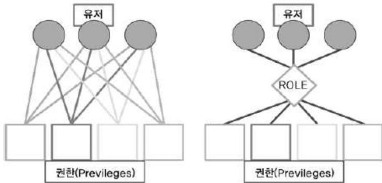

- 유저를 생성하면 기본적으로 CREATE SESSION, CREATE TABLE 등 많은 권한을 부여해야 한다. DB 관리자는 유저가 생성될 때마다 각각의 권한들을 유저에게 부여하는 작업을 수행해야 하며 유저가 점점 늘어나고 자주 변경되는 상황에서 이는 매우 번거로운 작업이 된다.

- 이런 문제를 해결하기 위해 DB 관리자는 ROLE을 생성하고, ROLE에 각종 권한들을 부여한 후 ROLE을 다른 ROLE이나 유저에게 부여한다.

- 롤은 DB에서 유저들과 권한들 사이에서 중개 역할을 함

- ROLE은 유저에게 직접 부여될 수도 있고, 다른 ROLE에 포함하여 유저에게 부여될 수도 있다.

- 즉, 롤은 다양한 권한의 묶음으로 SYSTEM 계정에서 생성 가능

-- 롤 생성을 위해 시스템계정으로 로그인

CONN SYSTEM/MANAGER

CREATE ROLE 롤이름;

-- 롤 생성

GRANT 권한1, 권한2, ... TO 롤이름;

-- 롤에 권한 부여

GRANT 롤이름 TO 유저;

-- 권한 집합인 롤을 유저에게 부여

-- 롤 생성

CREATE ROLE ROLE1;

-- 롤에 권한 담기

GRANT SELECT ON EMP TO ROLE1;

GRANT SELECT ON DEPT TO ROLE1;

-- 유저에게 롤 부여

GRANT ROLE1 TO A;

- [A 계정에서 수행] SELECT \* FROM SCOTT.DEPT

- 이제 유저 A는 EMP와 DEPT 테이블 조회 가능

주의: 원래 권한은 ‘즉시’ 반영이 된다. 즉 접속해 있는 상태에서 권한을 받으면 재접속을 할 필요가 없다. 하지만 롤은 반드시 재접속을 해야만 권한이 부여된다.

-- 롤에서 특정 권한 빼기

REVOKE SELECT ON DEPT FROM ROLE1

-- [권한 회수 후 A 계정에서 조회]

SELECT \* FROM SCOTT.DEPT; -- 오류! 권한 불충분!

- 롤에서 회수된 권한은 즉시 반영되므로 다시 롤을 부여할 필요가 없음

-- [SCOTT에서 실행] 롤을 통해 부여한 권한 직접 회수하기

REVOKE SELECT ON EMP FROM A; -- 오류!

- 롤을 통해 부여한 권한은 직접 회수가 불가능

- 롤을 통해 부여한 권한은 롤을 통한 회수만 가능

## 8. 권한부여 옵션(중간관리자의 권한)

- 권한은 보통 최상위 관리자들이 부여를 하는데, 그럴 경우 최상위 관리자들이 너무 많은 유저들에게 권한 부여 및 회수를 하게 된다. 그래서 중간관리자를 두어 중간관리자에게 특정 권한을 일임하여 중간 관리자가 자유롭게 제 3자에게 권한을 부여하거나 회수할 수 있게 한다.

### 1) WITH GRANT OPTION

- 오브젝트 권한에 대해 다른 사용자에게 해당 권한 부여 가능

- 중간관리자 부여한 권한은 중간관리자만 회수 가능

■ 즉, 시스템 관리자, 최상위 관리자에서 직접 회수 불가능

- 중간관리자에게 부여된 권한 회수 시 제3자에게 부여된 권한도 함께 회수됨

### 2) WITH ADIMIN OPTION

- 시스템 권한 / 롤 권한을 다른 사용자에게 부여 가능

- 중간관리자를 거치지 않고 직접 회수 가능

- 중간관리자의 권한 회수 시 제3자에게 부여된 권한은 남아있음

ex) 최고 관리자 lee / 중간관리자 kim / 제 3자 park

1) lee가 kim에게 WITH GRANT OPTION으로 오브젝트 권한 부여

2) 중간관리자가 된 kim이 park에게 DML 권한 부여

■ lee가 park의 권한 직접 회수 불가능

■ 하지만 lee가 kim의 권한을 회수 시, park의 권한까지 모두 회수됨

3) lee가 kim에게 WITH ADMIN OPTION으로 시스템 권한 부여

4) 중간관리자, kim이 park에게 DDL 권한 부여

■ lee가 park의 권한 직접 회수 가능

■ lee가 kim의 권한을 회수 시, park의 권한은 남아있음.