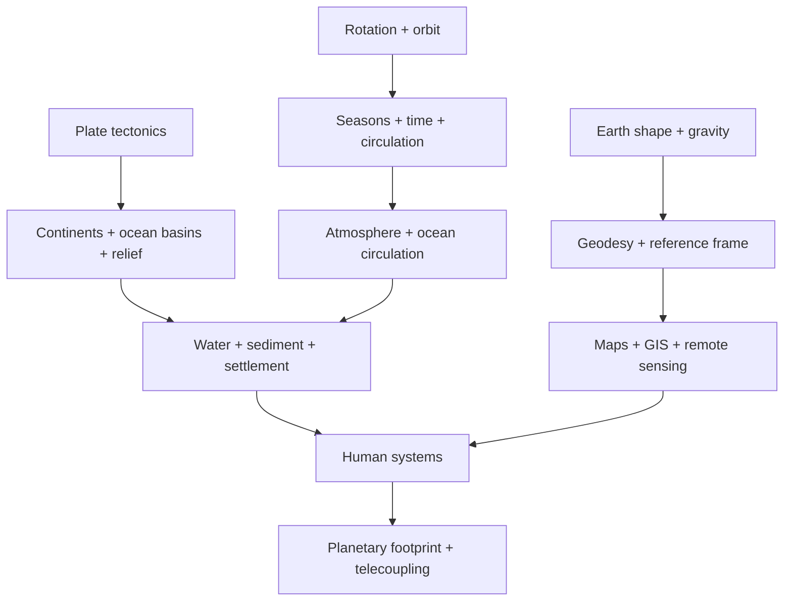

# Địa cầu và Địa lý toàn hành tinh

Phần này nối **Foundations**, **Physical Geography**, **Global Systems** và **World Atlas**. Mục tiêu không phải tạo một phiên bản khác của địa chất hay khí hậu, mà trả lời câu hỏi: trước khi chia thế giới thành quốc gia và vùng, bản thân Địa cầu được đo, tổ chức và vận hành như thế nào?

Một quả địa cầu trong lớp học làm mọi vị trí có vẻ cố định. Thực tế, Trái Đất quay, các mảng chuyển động, geoid không trùng ellipsoid, mực nước biển thay đổi, khối lượng nước–băng dịch chuyển và reference frame có epoch. Vì vậy “bản đồ thế giới” là lớp cuối của một chuỗi dài từ vật lý hành tinh tới hệ tọa độ.

## Causal chain của phần này

Nên đọc folder này theo chuỗi:

**hình dạng và trường vật lý → chuyển động hành tinh → lục địa/đại dương → relief → tuần hoàn nước–năng lượng → reference systems → human footprint**.

Chuỗi này giúp tránh học rời rạc. Ví dụ gravity không chỉ là kiến thức vật lý: nó tạo geoid, geoid ảnh hưởng height system, height ảnh hưởng hydrology và survey. Rotation không chỉ tạo ngày–đêm: nó ảnh hưởng Coriolis, climate circulation, satellite orbit và timekeeping.

## Learning route

1. [Hình dạng Trái Đất, trắc địa và đo lường hành tinh](./00_earth_shape_size_geodesy.md) — phân biệt topographic surface, ellipsoid, geoid, datum, frame và epoch.
2. [Chuyển động quay, quỹ đạo, mùa và hệ thời gian](./01_rotation_orbit_seasons_time.md) — từ axial tilt đến timezone, Earth orientation và satellite observation.
3. [Lục địa, bồn đại dương và cấu trúc cấp hành tinh](./02_continents_ocean_basins.md) — vì sao surface elevation có hai miền lớn và ocean basin được tái chế.
4. [Độ cao toàn cầu và đường cong cao–sâu](./03_global_relief_hypsometry.md) — đọc relief như trường thế năng điều khiển water, climate, settlement và risk.
5. [Nước, năng lượng và hoàn lưu toàn hành tinh](./04_global_water_energy_circulation.md) — Earth như mạng redistribution của heat và water.
6. [Trọng lực, geoid, từ trường và các trường vật lý](./05_gravity_geoid_magnetic_field.md) — field, anomaly, paleomagnetism và space-weather connection.
7. [Hệ quy chiếu toàn cầu, datum và hạ tầng tọa độ](./06_global_reference_systems.md) — CRS, transformation, vertical datum, dynamic frame và geospatial interoperability.
8. [Dấu chân con người ở quy mô hành tinh](./07_human_footprint_planetary_scale.md) — land-use, material flow, telecoupling và planetary–local linkage.

## Những câu hỏi phải trả lời được sau phần này

Người học nên giải thích được vì sao một tọa độ chính xác cần CRS và epoch; vì sao độ cao GNSS có thể khác độ cao bản đồ; vì sao mùa không chủ yếu do Earth–Sun distance; vì sao ocean floor trẻ hơn phần lớn continental crust; vì sao global relief có tính bimodal; vì sao gravity data có thể theo dõi water/ice mass; vì sao boundary dataset cũng cần provenance; và vì sao environmental footprint của một city có thể nằm ở nhiều lục địa.

## Quan hệ với Foundations

[Coordinates](../00_foundations/02_coordinates_time_maps.md), [Cartography](../00_foundations/03_cartography_projections_scale.md) và [GIS/remote sensing](../00_foundations/04_geospatial_data_gis_remote_sensing.md) tập trung vào công cụ suy luận và dữ liệu. Folder này giải thích nền vật lý–trắc địa khiến các công cụ đó cần datum, projection, time reference và sensor model.

## Quan hệ với Physical Geography

Plate tectonics tạo ocean basin và mountain belt. Atmosphere–ocean circulation phân phối heat/water. Hydrology chuyển gravity field thành drainage network. Ecosystem phản ứng với relief, climate và material flow.

Vì vậy `05_earth_global_geography` không thay thế `01_physical_geography`; nó cung cấp **planetary frame** để thấy các quá trình đó cùng nằm trong một hành tinh.

## Quan hệ với World Atlas

Khi đọc một country profile, không nên bắt đầu từ thủ đô hay GDP. Hãy bắt đầu bằng câu hỏi:

**Territory nằm ở đâu trong planetary geometry? relief và climate tạo constraint gì? water/resource nằm ở đâu? population tập trung ở đâu? corridor nào nối settlement với market? external dependency và hazard nào đến từ hệ toàn cầu?**

Đây là bridge từ Earth science sang regional/human geography.

## Mô hình tổng hợp

Mental model cuối cùng là: **Địa cầu là một hệ vật lý có hình học, trường, chuyển động và dòng; xã hội xây network lên trên hệ đó; Geography nghiên cứu nơi các lớp này giao nhau.**