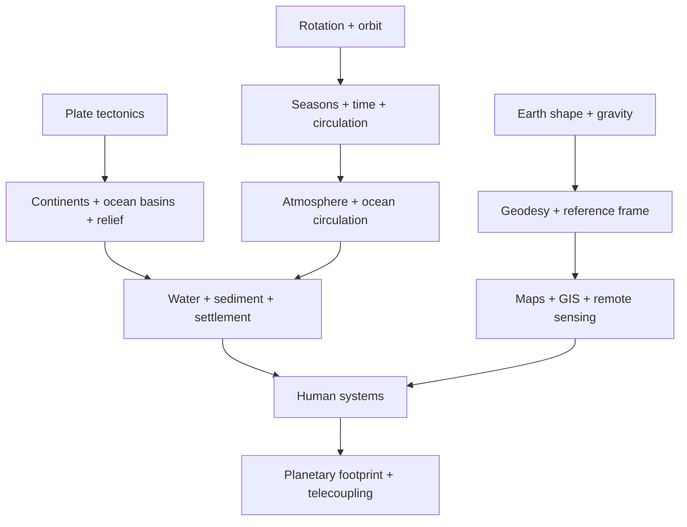

# Địa cầu và Địa lý toàn hành tinh

> **Mạch đọc:** README này là owner của **Địa cầu và Địa lý toàn hành tinh**. Route đi từ hình học và đo đạc Trái Đất → chuyển động, mùa và thời gian → vỏ, địa hình, nước và năng lượng → các hệ toàn cầu, để phần nền tảng dẫn được sang khí hậu, địa lý nhân văn và World Atlas.

Phần này nối **Foundations**, **vật lý (physical / 물리적) Geography**, **toàn cục (global / 전역) các hệ thống (systems / 시스템들)** và **World Atlas**. Mục tiêu không phải tạo một phiên bản khác của địa chất hay khí hậu, mà trả lời câu hỏi: trước khi chia thế giới thành quốc gia và vùng, bản thân Địa cầu được đo, tổ chức và vận hành như thế nào?

Một quả địa cầu trong lớp học làm mọi vị trí có vẻ cố định. Thực tế, Trái Đất quay, các mảng chuyển động, geoid không trùng ellipsoid, mực nước biển thay đổi, khối lượng nước–băng dịch chuyển và tham chiếu (reference / 참조) frame có epoch. Vì vậy “bản đồ thế giới” là lớp cuối của một chuỗi dài từ vật lý hành tinh tới hệ tọa độ.

## Chuỗi nhân quả (causal chain / 인과 사슬) của phần này

Nên đọc folder này theo chuỗi:

**hình dạng và trường vật lý → chuyển động hành tinh → lục địa/đại dương → relief → tuần hoàn nước–năng lượng → tham chiếu (reference / 참조) các hệ thống (systems / 시스템들) → human footprint**.

Chuỗi này giúp tránh học rời rạc. Ví dụ gravity không chỉ là kiến thức vật lý: nó tạo geoid, geoid ảnh hưởng height hệ thống (system / 시스템), height ảnh hưởng hydrology và survey. Rotation không chỉ tạo ngày–đêm: nó ảnh hưởng Coriolis, climate circulation, satellite orbit và timekeeping.

> **Chuyển mạch:** Trong **Địa cầu và Địa lý toàn hành tinh**, **Chuỗi nhân quả (causal chain / 인과 사슬) của phần này** xác định đầu vào; **Học tập (learning / 학습) tuyến (route / 경로)** giải thích bước vận hành tạo ra kết quả kế tiếp. Từ đây, **Những câu hỏi phải trả lời được sau phần này** sẽ cho biết hệ quả hoặc giới hạn ấy hiện ra ở đâu.

## Học tập (learning / 학습) tuyến (route / 경로)

1. [Hình dạng Trái Đất, trắc địa và đo lường hành tinh](./00_earth_shape_size_geodesy.md) — phân biệt topographic surface, ellipsoid, geoid, datum, frame và epoch.
2. [Chuyển động quay, quỹ đạo, mùa và hệ thời gian](./01_rotation_orbit_seasons_time.md) — từ axial tilt đến timezone, Earth orientation và satellite observation.
3. [Lục địa, bồn đại dương và cấu trúc cấp hành tinh](./02_continents_ocean_basins.md) — vì sao surface elevation có hai miền lớn và ocean basin được tái chế.
4. [Độ cao toàn cầu và đường cong cao–sâu](./03_global_relief_hypsometry.md) — đọc relief như trường thế năng điều khiển water, climate, settlement và rủi ro (risk / 위험).
5. [Nước, năng lượng và hoàn lưu toàn hành tinh](./04_global_water_energy_circulation.md) — Earth như mạng redistribution của heat và water.
6. [Trọng lực, geoid, từ trường và các trường vật lý](./05_gravity_geoid_magnetic_field.md) — trường dữ liệu (field / 필드), anomaly, paleomagnetism và space-weather liên kết (connection / 연결).
7. [Hệ quy chiếu toàn cầu, datum và hạ tầng tọa độ](./06_global_reference_systems.md) — CRS, transformation, vertical datum, động (dynamic / 동적) frame và geospatial interoperability.
8. [Dấu chân con người ở quy mô hành tinh](./07_human_footprint_planetary_scale.md) — land-use, material luồng (flow / 흐름), telecoupling và planetary–cục bộ (local / 로컬) linkage.

> **Chuyển mạch:** **Học tập route** sắp xếp prerequisite của Earth systems; **Những câu hỏi phải trả lời được** biến route thành năng lực giải thích trước khi quay về **Foundations**.

## Những câu hỏi phải trả lời được sau phần này

Người học nên giải thích được vì sao một tọa độ chính xác cần CRS và epoch; vì sao độ cao GNSS có thể khác độ cao bản đồ; vì sao mùa không chủ yếu do Earth–Sun distance; vì sao ocean floor trẻ hơn phần lớn continental crust; vì sao toàn cục (global / 전역) relief có tính bimodal; vì sao gravity dữ liệu (data / 데이터) có thể theo dõi water/ice mass; vì sao ranh giới (boundary / 경계) dataset cũng cần provenance; và vì sao environmental footprint của một city có thể nằm ở nhiều lục địa.

> **Chuyển mạch:** **Foundations** giữ math và systems prerequisite; **Physical Geography** áp dụng chúng vào địa hình, khí hậu và quá trình vật lý.

## Quan hệ với Foundations

[Coordinates](../00_foundations/02_coordinates_time_maps.md), [Cartography](../00_foundations/03_cartography_projections_scale.md) và [GIS/remote sensing](../00_foundations/04_geospatial_data_gis_remote_sensing.md) tập trung vào công cụ suy luận và dữ liệu. Folder này giải thích nền vật lý–trắc địa khiến các công cụ đó cần datum, projection, thời gian (time / 시간) tham chiếu (reference / 참조) và sensor mô hình (model / 모델).

> **Chuyển mạch:** **Physical Geography** giải thích process và constraint; **World Atlas** cung cấp inventory theo region để đặt process vào không gian cụ thể.

## Quan hệ với vật lý (physical / 물리적) Geography

Plate tectonics tạo ocean basin và mountain belt. Atmosphere–ocean circulation phân phối heat/water. Hydrology chuyển gravity trường dữ liệu (field / 필드) thành drainage mạng (network / 네트워크). Ecosystem phản ứng với relief, climate và material luồng (flow / 흐름).

Vì vậy `05_earth_global_geography` không thay thế `01_physical_geography`; nó cung cấp **planetary frame** để thấy các quá trình đó cùng nằm trong một hành tinh.

> **Chuyển mạch:** **World Atlas** đặt dữ liệu theo boundary và source owner; **Mô hình tổng hợp** nối inventory với causal explanation.

## Quan hệ với World Atlas

Khi đọc một country profile, không nên bắt đầu từ thủ đô hay GDP. Hãy bắt đầu bằng câu hỏi:

**Territory nằm ở đâu trong planetary hình học (geometry / 기하학)? relief và climate tạo ràng buộc (constraint / 제약조건) gì? water/tài nguyên (resource / 자원) nằm ở đâu? population tập trung ở đâu? corridor nào nối settlement với thị trường (market / 시장)? bên ngoài (external / 외부) phụ thuộc (dependency / 의존성) và hazard nào đến từ hệ toàn cầu?**

Đây là cầu nối (bridge / 브리지) từ Earth science sang regional/human geography.

> **Chuyển mạch:** **Mô hình tổng hợp** khép README bằng process, place và evidence; chi tiết vùng hoặc dữ liệu quay về canonical geography owner.

## Mô hình tổng hợp

Sau khi nối Earth science với World Atlas, ta có thể nhìn toàn bộ thư viện như một chuỗi từ hình học và chuyển động của Địa cầu tới network xã hội. Sơ đồ này là điểm chốt để chuyển từ từng chapter sang cách đọc hệ thống.

```mermaid
graph TD
  A[Earth shape + gravity] --> B[Geodesy + reference frame]
  C[Rotation + orbit] --> D[Seasons + time + circulation]
  E[Plate tectonics] --> F[Continents + ocean basins + relief]
  F --> G[Water + sediment + settlement]
  D --> H[Atmosphere + ocean circulation]
  H --> G
  B --> I[Maps + GIS + remote sensing]
  G --> J[Human systems]
  I --> J
  J --> K[Planetary footprint + telecoupling]
```

Mental model cuối cùng là: **Địa cầu là một hệ vật lý có hình học, trường, chuyển động và dòng; xã hội xây network lên trên hệ đó; Geography nghiên cứu nơi các lớp này giao nhau.**

> **Bàn giao:** Sau **Mô hình tổng hợp**, hãy giữ lại kết luận và ranh giới của mục này; quay về [README](./README.md) khi cần định vị owner hoặc chọn nhánh học tiếp theo.
