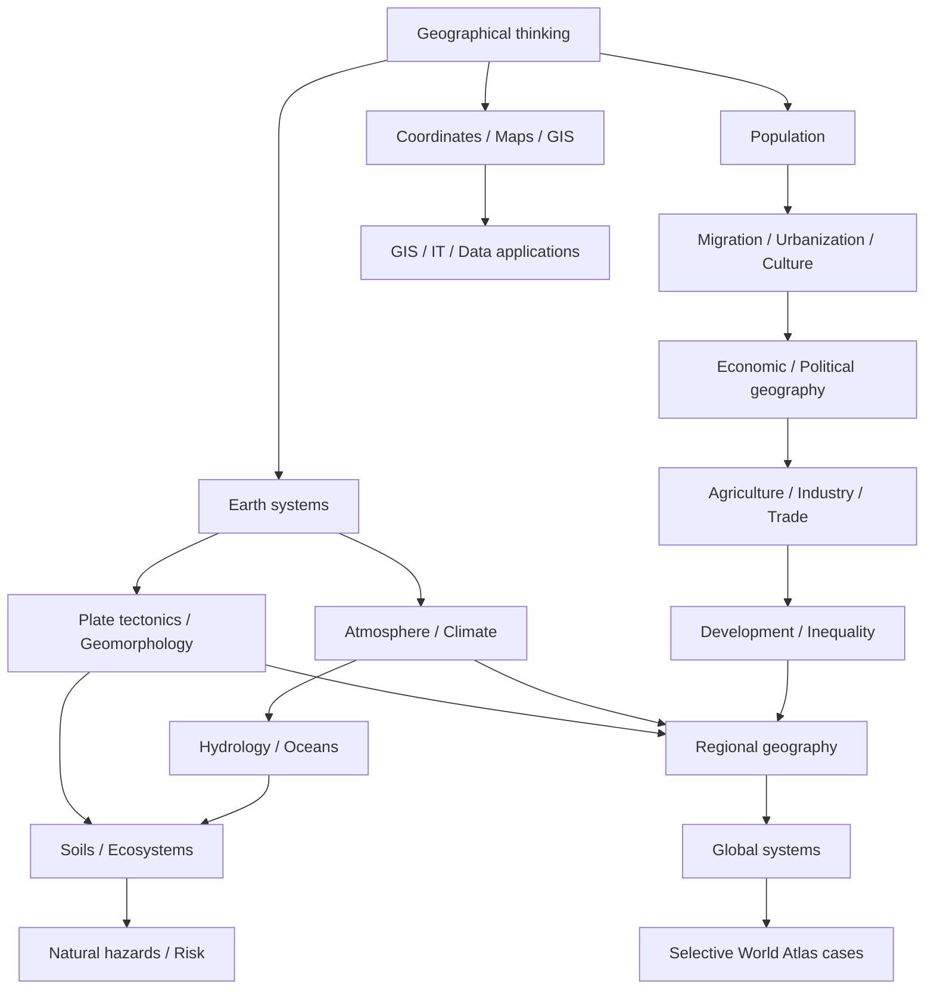

# Knowledge Library — Địa lý thế giới

Bộ tài liệu này được tổ chức theo **khái niệm (concept) → kiến thức phụ thuộc (dependency) → mối quan hệ (relationship)**. Mục tiêu là hiểu **vì sao** thế giới có các pattern địa hình, khí hậu, dân cư, thành phố, biên giới và mạng kinh tế như hiện nay, thay vì ghi nhớ địa danh.

> **Mental model trung tâm:** Địa lý là khoa học về **mẫu (pattern) + quá trình (process) + mạng/dòng (network/flow) + quy mô (scale) + bằng chứng (evidence)**.

## Bắt đầu ở đâu?

Đọc [Learning Route](./LEARNING_ROUTE.md) trước nếu học từ đầu hoặc muốn biết thứ tự dependency. Xem [Core Coverage Audit](./CORE_COVERAGE_AUDIT.md) nếu muốn biết chapter nào đã sâu, chapter nào còn cần nâng và roadmap tiếp theo.

World Atlas là **application layer**, không phải foundation. Không cần đọc hàng trăm country file để “học hết địa lý”.

## Kiến trúc Knowledge Library

`00_foundations` xây tư duy không gian, tọa độ, cartography, GIS và remote sensing.

`01_physical_geography` giải thích solid Earth, atmosphere, hydrology, oceans, soils/ecosystems và natural hazards.

`02_human_geography` đi từ population–migration–urbanization sang culture, political/economic geography, agriculture, industry/energy, trade và development.

`03_regions` tổng hợp các mechanism để đọc region; đây không phải folder ghi nhớ country list.

`04_global_systems` nghiên cứu system vượt biên giới: climate change, Water–Food–Energy nexus, chokepoint/resource networks, global cities và sustainability.

`05_earth_global_geography` mở rộng sang Địa cầu như một vật thể: geodesy, rotation/orbit, continents/ocean basins, relief, gravity, magnetic field và global reference systems.

`06_world_atlas` dùng country/territory như case study có chọn lọc. Inventory có thể đầy đủ nhưng profile chỉ được coi hoàn chỉnh khi đạt chuẩn learning chapter. Xem [Atlas coverage status](./06_world_atlas/03_coverage_status.md).

`90_connections` nối Geography với Math/Statistics, IT/GIS/Data, Economics/Finance và mental models tổng hợp.

## Sơ đồ dependency

## Cách đánh giá chất lượng chapter

Một chapter tốt phải trả lời được: khái niệm là gì; vấn đề nào khiến nó cần tồn tại; cơ chế hoạt động thế nào; biến/flow/constraint nào quan trọng; ở scale nào kết luận có thể đổi; dữ liệu đo bằng gì; limitation và misconception ở đâu; nó nối với chapter nào.

Số file, số heading và số dòng không phải metric chất lượng.

## Quy tắc ngôn ngữ

Phần giải thích dùng tiếng Việt tự nhiên. Thuật ngữ tiếng Anh được giữ như keyword bổ sung khi giúp tra cứu, ví dụ `khả năng tiếp cận (accessibility)`, `tự tương quan không gian (spatial autocorrelation)`. Code, công thức, acronym và canonical name giữ nguyên khi dịch làm mất chính xác.

## Nội dung thay đổi theo thời gian

Core ưu tiên kiến thức tương đối bền vững. Population, GDP, trade share, current government, current border/dispute status hoặc ranking nếu được dùng phải có mốc thời gian và nguồn phù hợp. Atlas không nên trở thành snapshot nhanh lỗi thời.

## Roadmap sau audit

Thứ tự ưu tiên hiện tại là:

**core cross-link audit → East Asia/Southeast Asia regional depth → selective high-value Atlas profiles → comparative geography chapters**.

Không quay lại chiến lược tạo hàng trăm country skeleton.