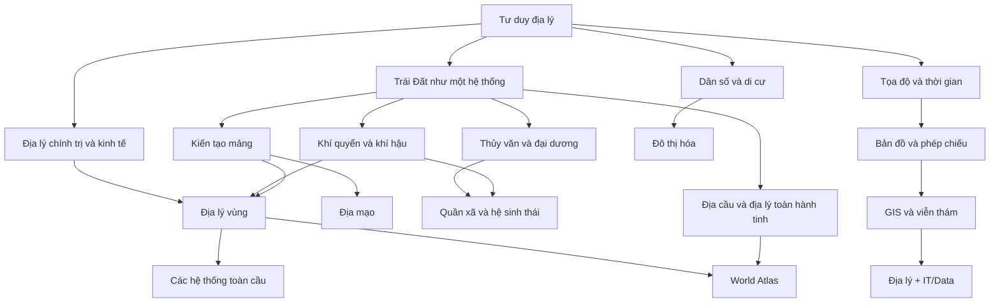

# Knowledge Library — Địa lý thế giới

Bộ tài liệu này được tổ chức theo **khái niệm (concept) → kiến thức phụ thuộc (dependency) → mối quan hệ (relationship)**, không chia theo các mức cơ bản–trung cấp–nâng cao. Mục tiêu là học Địa lý như một hệ thống giải thích **vì sao thế giới có hình dạng, khí hậu, dân cư, thành phố, biên giới, mạng lưới kinh tế và các vùng địa lý như hiện nay**, thay vì ghi nhớ danh sách địa danh.

> **Mô hình tư duy (mental model) trung tâm:** Địa lý nghiên cứu *vị trí*, *phân bố*, *quan hệ không gian*, *quá trình* và *quy mô*. Một hiện tượng chỉ thật sự được hiểu khi ta biết nó xảy ra ở đâu, vì sao ở đó, lan truyền theo cơ chế nào và thay đổi thế nào khi đổi quy mô phân tích.

## Cách dùng thư viện

Nên đọc `00_foundations` trước để hiểu tư duy không gian, hệ tọa độ, bản đồ và dữ liệu địa lý. `01_physical_geography` giải thích nền vật lý của Trái Đất; `02_human_geography` giải thích dân số, đô thị, kinh tế và không gian xã hội; `03_regions` dùng các nguyên lý đó để đọc từng vùng; `04_global_systems` đi vào các hệ thống xuyên biên giới.

`05_earth_global_geography` mở rộng từ “địa lý trên bề mặt” sang **Địa cầu như một vật thể hành tinh**: hình dạng, kích thước, chuyển động, lục địa–đại dương, phân bố độ cao, trường hấp dẫn, từ trường, hệ quy chiếu toàn cầu và dấu chân của con người ở quy mô hành tinh.

`06_world_atlas` là **Atlas thế giới dạng knowledge graph**. Thay vì chỉ liệt kê thủ đô–dân số, mỗi hồ sơ quốc gia hoặc vùng lãnh thổ giải thích khung tự nhiên, khí hậu–nước, phân bố dân cư, mạng đô thị, không gian sản xuất, hành lang giao thông, rủi ro và vai trò của vị trí trong khu vực. Inventory chính dựa trên UN M49 “countries or areas”; các trường hợp không được M49 tách riêng nhưng có giá trị địa lý–thống kê được xử lý trong nhóm hồ sơ bổ sung với ghi chú phương pháp rõ ràng.

`90_connections` nối Địa lý với Toán học, thống kê, công nghệ thông tin, GIS, dữ liệu, kinh tế học và các mô hình tư duy tổng hợp.

Quy ước liên kết chéo dùng đường dẫn Markdown tương đối, ví dụ: [Bản đồ và phép chiếu](./00_foundations/03_cartography_projections_scale.md).

## Sơ đồ quan hệ kiến thức



## Cấu trúc

```text
world_geography/
├── 00_foundations/
├── 01_physical_geography/
├── 02_human_geography/
├── 03_regions/
├── 04_global_systems/
├── 05_earth_global_geography/
├── 06_world_atlas/
└── 90_connections/
```

Bộ tài liệu ưu tiên kiến thức tương đối bền vững. Với số liệu dân số, GDP, khí hậu cực trị, tên chính thức hoặc tình trạng lãnh thổ có thể thay đổi theo thời điểm, hồ sơ atlas ưu tiên cơ chế địa lý và ghi rõ hệ phân loại đang dùng thay vì coi một con số tạm thời là kiến thức cố định.