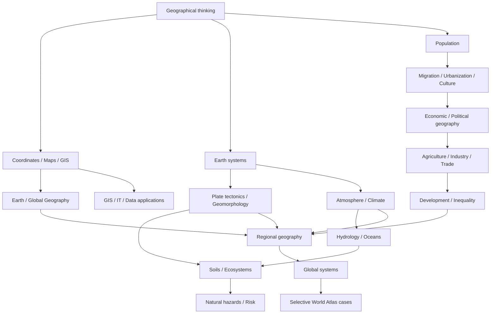

# Knowledge Library — Địa lý thế giới

Bộ tài liệu này được tổ chức theo **khái niệm (concept) → cơ chế (mechanism) → quan hệ (relationship) → ứng dụng (application)**. Mục tiêu là hiểu **vì sao** thế giới có các pattern địa hình, khí hậu, dân cư, thành phố, biên giới và mạng kinh tế như hiện nay, thay vì ghi nhớ địa danh hoặc tạo encyclopedia rời rạc.

> **Mental model trung tâm:** Địa lý là khoa học về **mẫu (pattern) + quá trình (process) + mạng/dòng (network/flow) + quy mô (scale) + bằng chứng (evidence)**.

## Canonical source

Nội dung World Geography hiện được phát triển trên branch `feature/world-geography-knowledge-library`. Các branch `feature/world-geography-africa-*` và `feature/world-geography-americas-batch` là nhánh lịch sử đã nằm phía sau canonical branch và không phải nguồn tiếp tục phát triển.

`main` có thể tiến nhanh vì các Knowledge Library khác; việc `main` có commit mới hơn không đồng nghĩa nội dung Geography ở đó mới hơn. Khi merge sau này phải so sánh tree/commit thực tế, không suy từ timestamp.

## Bắt đầu ở đâu?

Đọc [Learning Route](./LEARNING_ROUTE.md) nếu học từ đầu hoặc muốn biết dependency. Xem [Core Coverage Audit](./CORE_COVERAGE_AUDIT.md) để biết phần nào đã sâu và phần nào cần audit tiếp.

World Atlas là **application layer**, không phải foundation. Không cần đọc mọi country file để “học hết địa lý”.

## Kiến trúc Knowledge Library

`00_foundations` xây geographic thinking, scale, location, coordinates, time zones, cartography, map projection, GIS, geospatial data và remote sensing.

`01_physical_geography` giải thích Earth systems, geological time, plate tectonics, geomorphology, atmosphere, weather, climate, hydrology, oceans/coasts, soils, biomes, ecosystems và natural-hazard risk.

`02_human_geography` đi từ population–migration–urbanization sang culture/language/religion, political/economic geography, agriculture/food systems, industry/resources/energy, transport/trade/globalization và development/inequality.

`03_regions` tổng hợp các mechanism để đọc region. Mỗi region phải nối **physical geography → resources/water → settlement → economy → transport → society → regional role**, không trở thành danh sách quốc gia.

`04_global_systems` nghiên cứu system vượt biên giới: climate change, Water–Food–Energy nexus, resource/chokepoint networks, global cities/trade networks và sustainability.

`05_earth_global_geography` mở rộng sang Địa cầu như một vật thể hành tinh: geodesy, rotation/orbit/seasons, reference systems, continents/ocean basins, global relief, water–energy circulation, gravity/geoid, magnetic field và human footprint.

`06_world_atlas` dùng country/territory như case study có chọn lọc. Inventory có thể rộng, nhưng profile chỉ được coi hoàn chỉnh khi đạt chuẩn learning chapter. Xem [Atlas coverage status](./06_world_atlas/03_coverage_status.md).

`90_connections` nối Geography với Math/Statistics, IT/GIS/Data, Economics/Finance và mental models tổng hợp.

## Sơ đồ dependency

## Standard causal chain cho Regional Geography và Atlas

Khi viết hoặc audit region/profile, ưu tiên chuỗi:

**physical base → climate/water → resources → settlement/population → production/economy → transport/network → society/institutions → regional/global role → hazards/transformation**.

Chuỗi này không có nghĩa môi trường quyết định xã hội. Physical geography tạo constraint và opportunity; history, technology, institutions và network quyết định cách các constraint đó được chuyển thành outcome.

## Cách đánh giá chất lượng chapter

Một chapter tốt phải trả lời được: khái niệm là gì; vì sao cần nó; cơ chế hoạt động thế nào; biến/flow/constraint nào quan trọng; ở scale nào kết luận có thể đổi; dữ liệu đo bằng gì; limitation và misconception ở đâu; nó nối với prerequisite/application chapter nào.

Số file, số heading và số dòng không phải metric chất lượng.

## Quy tắc ngôn ngữ

Phần giải thích dùng tiếng Việt tự nhiên. Thuật ngữ tiếng Anh được giữ như keyword bổ sung khi giúp tra cứu, ví dụ `khả năng tiếp cận (accessibility)`, `tự tương quan không gian (spatial autocorrelation)`. Code, công thức, acronym và canonical name giữ nguyên khi dịch làm mất chính xác.

## Nội dung thay đổi theo thời gian

Core ưu tiên kiến thức tương đối bền vững. Population, GDP, trade share, current government, current border/dispute status hoặc ranking nếu được dùng phải có mốc thời gian và nguồn phù hợp. Atlas không nên trở thành snapshot nhanh lỗi thời.

## Trạng thái audit hiện tại

Foundations, Physical Geography, Human Geography và Global Systems đã có depth pass tương đối đồng đều. Earth/Global Geography vừa được nâng thêm ở continents/ocean basins, hypsometry và planetary water–energy circulation. Regional Geography vừa được cân bằng thêm ở South Asia, Central Asia và West Asia; East Asia và Southeast Asia vẫn là reference standard vì liên hệ trực tiếp Korea–Vietnam.

Khoảng trống tiếp theo chủ yếu là **cross-link consistency, comparative regional synthesis và cleanup Atlas legacy stubs**, không phải thiếu chapter nền tảng.

## Roadmap tiếp theo

Thứ tự ưu tiên:

**cross-link audit → comparative regional chapters → selective high-value Atlas depth → cleanup/merge legacy stubs**.

Không quay lại chiến lược tạo hàng trăm country skeleton.