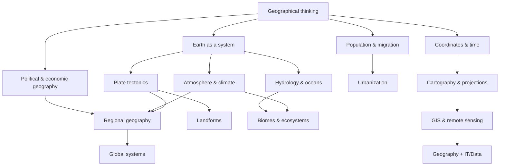

# Knowledge Library — Địa lý thế giới

Bộ tài liệu này được tổ chức theo **concept → dependency → relationship**, không theo mức Beginner/Intermediate/Advanced. Mục tiêu là học Địa lý như một hệ thống giải thích **vì sao thế giới có hình dạng, khí hậu, dân cư, thành phố, biên giới, mạng lưới kinh tế và các vùng địa lý như hiện nay**, thay vì ghi nhớ danh sách địa danh.

> **Mental model trung tâm:** Địa lý nghiên cứu *vị trí* (where), *phân bố* (distribution), *quan hệ không gian* (spatial relationship), *quá trình* (process) và *quy mô* (scale). Một hiện tượng chỉ thật sự được hiểu khi ta biết nó xảy ra ở đâu, vì sao ở đó, lan truyền theo cơ chế nào, và thay đổi thế nào khi đổi scale.

## Cách dùng library

Nên đọc `00_foundations` trước để hiểu tư duy không gian, hệ tọa độ, bản đồ và dữ liệu địa lý. Sau đó có thể đi sang `01_physical_geography` để hiểu nền vật lý của Trái Đất, hoặc `02_human_geography` để hiểu dân số, đô thị, kinh tế và chính trị. `03_regions` dùng các nguyên lý trước đó để đọc từng vùng của thế giới. `04_global_systems` tập trung vào các hệ thống xuyên biên giới. `90_connections` nối Địa lý với Toán, Statistics, IT/GIS, Economics và các mental model tổng hợp.

Convention cross-reference dùng link Markdown tương đối, ví dụ: [Bản đồ và phép chiếu](./00_foundations/03_cartography_projections_scale.md).

## Dependency map



## Cấu trúc

```text
world_geography/
├── 00_foundations/
├── 01_physical_geography/
├── 02_human_geography/
├── 03_regions/
├── 04_global_systems/
└── 90_connections/
```

Bộ tài liệu ưu tiên kiến thức tương đối bền vững. Với số liệu dân số, GDP, khí hậu cực trị hay biên giới đang tranh chấp, hãy coi số cụ thể là dữ liệu theo thời điểm và kiểm tra nguồn cập nhật khi cần ra quyết định thực tế.
