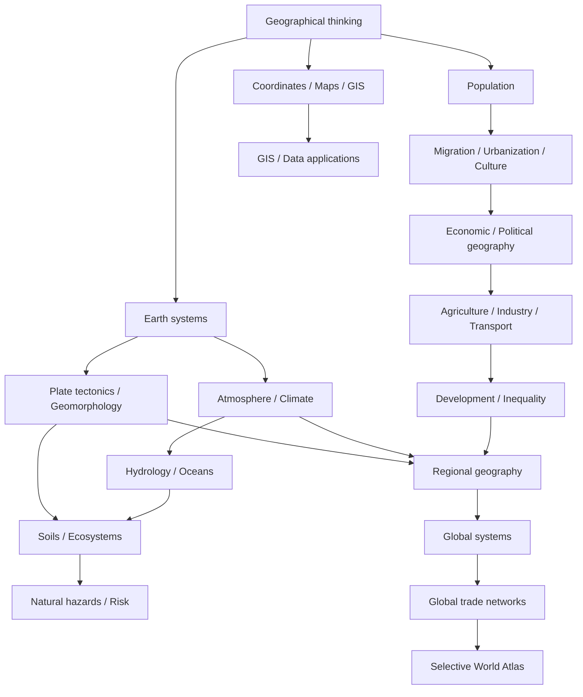

# Knowledge Library — Địa lý thế giới

Bộ tài liệu này được tổ chức theo **khái niệm (concept) → cơ chế (mechanism) → dependency → relationship → application**. Mục tiêu không phải nhớ country list mà hiểu **vì sao địa hình, khí hậu, tài nguyên, dân cư, thành phố, hạ tầng, thương mại và regional role tạo ra pattern hiện nay**.

> **Mental model trung tâm:** Geography = **pattern + process + network/flow + scale + evidence**.

## Cách dùng library

Nếu học từ đầu, bắt đầu ở [Learning Route](./LEARNING_ROUTE.md). Nếu muốn biết chỗ nào còn yếu, xem [Core Coverage Audit](./CORE_COVERAGE_AUDIT.md).

World Atlas là **application layer**, không phải tiêu chí completion. Một file country ngắn không được tính là chapter hoàn chỉnh chỉ vì nó tồn tại.

## Kiến trúc

`00_foundations` xây geographic thinking, scale, location, coordinates, time zones, cartography, projection, GIS, geospatial data và remote sensing.

`01_physical_geography` giải thích tectonics, geomorphology, atmosphere, weather, climate, hydrology, oceans/coasts, soils/ecosystems và hazards/risk.

`02_human_geography` đi từ population–migration–urbanization tới culture, political/economic geography, agriculture, industry/energy/resources, transport/trade và development/inequality.

`03_regions` tổng hợp core mechanism vào regional systems. Region chapter phải giải thích **physical base → resources/water → settlement → economy → transport → urban network → trade → regional role**, không phải country encyclopedia.

`04_global_systems` nghiên cứu system vượt border: climate change, Water–Food–Energy Nexus, chokepoints/resources, global cities, sustainability và [global trade networks](./04_global_systems/05_global_trade_networks.md).

`05_earth_global_geography` mở rộng sang Địa cầu như một vật thể: geodesy, rotation/orbit, continental–ocean structure, relief, planetary circulation, gravity/geoid, magnetic field, reference systems và human footprint.

`06_world_atlas` dùng country/territory như case study có chọn lọc. Xem [Atlas coverage status](./06_world_atlas/03_coverage_status.md).

`90_connections` nối Geography với Math/Statistics, IT/GIS/Data, Economics/Finance và mental models tổng hợp.

## Dependency graph

## Chuỗi causal bắt buộc cho chapter ứng dụng

Khi viết region hoặc country profile, ưu tiên chuỗi:

**địa hình / khí hậu / nước → tài nguyên và constraint → phân bố dân cư → production/economy → transport corridor → urban system → trade network → society/institution → regional/global role → hazard/transformation**.

Đây không phải linear determinism. Institution, technology và history có thể thay đổi hoặc đảo chiều từng arrow.

## Trạng thái sau các depth pass gần nhất

Core không còn lỗ hổng lớn kiểu “có file nhưng chỉ định nghĩa”. Earth Systems và Natural Hazards vừa được nâng sâu thêm về system boundary, timescale, critical-zone coupling, expected loss, dynamic vulnerability và critical-infrastructure dependency.

Human Geography vừa được integration pass ở Culture, Political Geography, Economic Geography và Transport/Trade để các chapter nối trực tiếp physical constraint–settlement–production–network.

Regional Geography vừa được nâng ở Europe, Africa, North America và Latin America/Caribbean; South/Central/West Asia đã được nâng ở batch trước. East Asia và Southeast Asia tiếp tục là reference standard cho Korea–Vietnam route.

Global Systems hiện có chapter riêng về [Mạng thương mại toàn cầu](./04_global_systems/05_global_trade_networks.md), nối production tiers, resources, ports, inventory, finance, cities và systemic risk.

Atlas vừa nâng Singapore, Indonesia và India; không tăng số skeleton.

## Quy tắc chất lượng

Một chapter tốt phải trả lời: khái niệm là gì; mechanism nào tạo pattern; stock/flow/node/boundary nào quan trọng; scale nào làm kết luận đổi; evidence đo bằng gì; limitation/misconception ở đâu; chapter nối sang system nào.

Số file, số heading và số dòng không phải metric chất lượng.

## Quy tắc ngôn ngữ

Giải thích chính bằng tiếng Việt tự nhiên. English keyword giữ trong ngoặc khi giúp tra cứu, ví dụ `khả năng tiếp cận (accessibility)`, `tự tương quan không gian (spatial autocorrelation)`, `chuỗi giá trị toàn cầu (global value chain)`.

Code, formula, acronym, proper noun và canonical technical name giữ nguyên nếu dịch làm mất chính xác.

## Roadmap tiếp theo

Ưu tiên sau batch hiện tại:

**physical cross-link QA → Oceania/Polar regional depth → Development/Agriculture/Energy integration QA → selective Brazil/Australia/Malaysia/Thailand/Philippines profiles nếu đạt learning-profile standard → Atlas cleanup các reference stub → link validation**.

Không quay lại chiến lược sinh hàng trăm country skeleton.