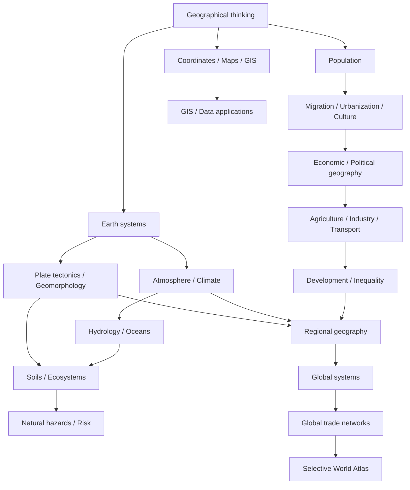

# Thư viện kiến thức (knowledge library / 지식 라이브러리) — Địa lý thế giới

> **Mạch đọc:** Đây là README owner của **Thư viện kiến thức — Địa lý thế giới**. Route đọc đi từ geographic thinking/foundations → physical/human geography → regions/atlas → global systems → connections and methods, để mỗi phần nối không gian với dòng chảy và thể chế.

Bộ tài liệu này được tổ chức theo **khái niệm (concept) → cơ chế (mechanism / 메커니즘) → phụ thuộc (dependency / 의존성) → relationship → ứng dụng (application / 애플리케이션)**. Mục tiêu không phải nhớ country danh sách (list / 목록) mà hiểu **vì sao địa hình, khí hậu, tài nguyên, dân cư, thành phố, hạ tầng, thương mại và regional role tạo ra mẫu (pattern / 패턴) hiện nay**.

> **mô hình tư duy (mental model / 사고 모델) trung tâm:** Geography = **mẫu (pattern / 패턴) + tiến trình (process / 프로세스) + mạng (network / 네트워크)/luồng (flow / 흐름) + quy mô (scale / 규모) + bằng chứng (evidence / 증거)**.

## Cách dùng thư viện (library / 라이브러리)

Nếu học từ đầu, bắt đầu ở [Learning Route](./LEARNING_ROUTE.md). Nếu muốn biết chỗ nào còn yếu, xem [Core Coverage Audit](./CORE_COVERAGE_AUDIT.md).

World Atlas là **ứng dụng (application / 애플리케이션) tầng (layer / 계층)**, không phải tiêu chí completion. Một tệp (file / 파일) country ngắn không được tính là chapter hoàn chỉnh chỉ vì nó tồn tại.

> **Chuyển mạch:** **Cách dùng thư viện** xác định source và cách tra cứu; **Kiến trúc** tổ chức domain, rồi **Dependency graph** chỉ quan hệ prerequisite giữa các atlas.

## Kiến trúc

`00_foundations` xây geographic thinking, quy mô (scale / 규모), location, coordinates, thời gian (time / 시간) zones, cartography, projection, GIS, geospatial dữ liệu (data / 데이터) và remote sensing.

`01_physical_geography` giải thích tectonics, geomorphology, atmosphere, weather, climate, hydrology, oceans/coasts, soils/ecosystems và hazards/rủi ro (risk / 위험).

`02_human_geography` đi từ population–di chuyển (migration / 마이그레이션)–urbanization tới culture, political/economic geography, agriculture, industry/năng lượng (energy / 에너지)/resources, vận chuyển (transport / 전송)/trade và development/inequality.

`03_regions` tổng hợp cốt lõi (core / 핵심) cơ chế (mechanism / 메커니즘) vào regional các hệ thống (systems / 시스템들). Region chapter phải giải thích **vật lý (physical / 물리적) cơ sở (base / 기반) → resources/water → settlement → economy → vận chuyển (transport / 전송) → urban mạng (network / 네트워크) → trade → regional role**, không phải country encyclopedia.

`04_global_systems` nghiên cứu hệ thống (system / 시스템) vượt border: climate thay đổi (change / 변경), Water–Food–năng lượng (energy / 에너지) Nexus, chokepoints/resources, toàn cục (global / 전역) cities, sustainability và [global trade networks](./04_global_systems/05_global_trade_networks.md).

`05_earth_global_geography` mở rộng sang Địa cầu như một vật thể: geodesy, rotation/orbit, continental–ocean cấu trúc (structure / 구조), relief, planetary circulation, gravity/geoid, magnetic trường dữ liệu (field / 필드), tham chiếu (reference / 참조) các hệ thống (systems / 시스템들) và human footprint.

`06_world_atlas` dùng country/territory như trường hợp (case / 사례) study có chọn lọc. Xem [Atlas coverage status](./06_world_atlas/03_coverage_status.md).

`90_connections` nối Geography với Math/Statistics, IT/GIS/dữ liệu (data / 데이터), Economics/Finance và mô hình tư duy (mental models / 사고 모델들) tổng hợp.

Để hiểu vì sao các mẫu (pattern / 패턴) không gian hình thành theo thời gian, đọc song song [World History](../world_history/README.md). Geography cung cấp vật lý (physical / 물리적) ràng buộc (constraint / 제약조건), tài nguyên (resource / 자원) cơ sở (base / 기반) và mạng (network / 네트워크) location; lịch sử (history / 이력) bổ sung institutions, technology, warfare, demography và ideas đã biến đổi chúng. Không dùng địa lý như lời giải định mệnh cho lịch sử.

> **Chuyển mạch:** **Dependency graph** cho biết atlas nào cần đọc trước; **Chuỗi nhân quả bắt buộc cho chapter ứng dụng** biến geography thành explanation có cơ chế.

## Phụ thuộc (dependency / 의존성) đồ thị (graph / 그래프)

Sơ đồ dưới đây cho thấy thứ tự phụ thuộc của thư viện: tư duy địa lý và dữ liệu làm nền, Earth systems tạo process, rồi các lớp dân cư–kinh tế–vùng nối thành global systems. Hãy dùng nó để chọn prerequisite trước khi mở một atlas profile.

```mermaid
graph TD
  A[Geographical thinking] --> B[Coordinates / Maps / GIS]
  A --> C[Earth systems]
  C --> D[Plate tectonics / Geomorphology]
  C --> E[Atmosphere / Climate]
  E --> F[Hydrology / Oceans]
  D --> G[Soils / Ecosystems]
  F --> G
  G --> H[Natural hazards / Risk]
  A --> I[Population]
  I --> J[Migration / Urbanization / Culture]
  J --> K[Economic / Political geography]
  K --> L[Agriculture / Industry / Transport]
  L --> M[Development / Inequality]
  D --> N[Regional geography]
  E --> N
  M --> N
  N --> O[Global systems]
  O --> T[Global trade networks]
  B --> P[GIS / Data applications]
  T --> Q[Selective World Atlas]
```

> **Chuyển mạch:** Đặt trong câu hỏi lớn của **Thư viện kiến thức (knowledge library / 지식 라이브러리) — Địa lý thế giới**, **Phụ thuộc (dependency / 의존성) đồ thị (graph / 그래프)** xác định đầu vào; **Chuỗi nhân quả (causal / 인과적) bắt buộc cho chapter ứng dụng** giải thích bước vận hành tạo ra kết quả kế tiếp. Từ đây, **Trạng thái sau các độ sâu (depth / 깊이) pass gần nhất** sẽ cho biết hệ quả hoặc giới hạn ấy hiện ra ở đâu.

## Chuỗi nhân quả (causal / 인과적) bắt buộc cho chapter ứng dụng

Khi viết region hoặc country profile, ưu tiên chuỗi:

**địa hình / khí hậu / nước → tài nguyên và ràng buộc (constraint / 제약조건) → phân bố dân cư → môi trường vận hành (production / 운영 환경)/economy → vận chuyển (transport / 전송) corridor → urban hệ thống (system / 시스템) → trade mạng (network / 네트워크) → society/institution → regional/toàn cục (global / 전역) role → hazard/transformation**.

Đây không phải tuyến tính (linear / 선형) determinism. Institution, technology và lịch sử (history / 이력) có thể thay đổi hoặc đảo chiều từng arrow.

> **Chuyển mạch:** Trong **Thư viện kiến thức (knowledge library / 지식 라이브러리) — Địa lý thế giới**, **Chuỗi nhân quả (causal / 인과적) bắt buộc cho chapter ứng dụng** xác định đầu vào; **Trạng thái sau các độ sâu (depth / 깊이) pass gần nhất** giải thích bước vận hành tạo ra kết quả kế tiếp. Từ đây, **Quy tắc chất lượng** sẽ cho biết hệ quả hoặc giới hạn ấy hiện ra ở đâu.

## Trạng thái sau các độ sâu (depth / 깊이) pass gần nhất

### Cốt lõi (core / 핵심) và vật lý (physical / 물리적) Geography

Earth các hệ thống (systems / 시스템들) và Natural Hazards đã được nâng sâu về hệ thống (system / 시스템) ranh giới (boundary / 경계), timescale, coupled processes, expected mất mát (loss / 손실), động (dynamic / 동적) vulnerability và hạ tầng (infrastructure / 인프라) phụ thuộc (dependency / 의존성). Các vật lý (physical / 물리적) chapter riêng lẻ hiện khá cân bằng; priority mới chuyển sang **cross-link QA** giữa tectonics–relief–sediment–hydrology–coast–hazard thay vì rewrite từng tệp (file / 파일).

### Human Geography

Culture, Political Geography, Economic Geography và vận chuyển (transport / 전송)/Trade đã qua tích hợp (integration / 통합) pass trước đó.

Batch mới nhất nối sâu thêm:

**Agriculture ↔ Industry/năng lượng (energy / 에너지)/Resources ↔ Development/Inequality**

qua dùng chung (shared / 공유) chuỗi (chain / 사슬) `resource base → energy/water/input → production/processing → corridor/trade → value capture → household access → inequality/resilience`.

Điều này giúp Human Geography hoạt động như một hệ thống (system / 시스템) thay vì tập hợp sector notes.

### Regional Geography

Europe, Africa, North America, Latin America/Caribbean, South/Central/West Asia đã qua độ sâu (depth / 깊이) pass. Oceania/Pacific và Polar Regions vừa được nâng tiếp.

[Oceania/Pacific](./03_regions/09_oceania_pacific.md) giờ nối island kiểu (type / 타입), water/resources, urban primacy, public-service quy mô (scale / 규모), gateway phụ thuộc (dependency / 의존성), food/năng lượng (energy / 에너지) imports, cables, fisheries và Australia–Asia mạng (network / 네트워크).

[Polar Regions](./03_regions/10_polar_regions.md) giờ nối ice/permafrost với settlement/dịch vụ (service / 서비스) nodes, hạ tầng (infrastructure / 인프라), tài nguyên (resource / 자원) economics, shipping độ tin cậy (reliability / 신뢰성), research logistics và toàn cục (global / 전역) climate/ocean transmission.

### Toàn cục (global / 전역) các hệ thống (systems / 시스템들)

Toàn cục (global / 전역) các hệ thống (systems / 시스템들) hiện có chapter riêng về [Mạng thương mại toàn cầu](./04_global_systems/05_global_trade_networks.md), nối môi trường vận hành (production / 운영 환경) tiers, resources, ports, inventory, finance, cities và systemic rủi ro (risk / 위험).

### Selective Atlas

Không tăng số skeleton. Các compact files chỉ được promote khi đủ chiều sâu.

Batch mới đã nâng:

- [Australia](./06_world_atlas/oceania/australia_new_zealand/AUS_australia.md);
- [Brazil](./06_world_atlas/americas/south_america/BRA_brazil.md);
- [Malaysia](./06_world_atlas/asia/south_eastern_asia/MYS_malaysia.md).

Chúng được chọn vì có học tập (learning / 학습) giá trị (value / 값) về resources, commodity/industrial networks, ports, urban các hệ thống (systems / 시스템들) và liên hệ East/Southeast Asia.

> **Chuyển mạch:** **Trạng thái sau depth pass** cho biết coverage đang ở đâu; **Quy tắc chất lượng** chuyển trạng thái đó thành evidence, rồi **Quy tắc ngôn ngữ** giữ prose tiếng Việt.

## Quy tắc chất lượng

Một chapter tốt phải trả lời: khái niệm là gì; cơ chế (mechanism / 메커니즘) nào tạo mẫu (pattern / 패턴); stock/luồng (flow / 흐름)/nút (node / 노드)/ranh giới (boundary / 경계) nào quan trọng; vật lý (physical / 물리적) ràng buộc (constraint / 제약조건) và tài nguyên (resource / 자원) nào tác động; quy mô (scale / 규모) nào làm kết luận đổi; bằng chứng (evidence / 증거) đo bằng gì; limitation/misconception ở đâu; chapter nối sang hệ thống (system / 시스템) nào.

Số tệp (file / 파일), số heading và số dòng không phải chỉ số (metric / 지표) chất lượng.

> **Chuyển mạch:** **Quy tắc ngôn ngữ** diễn đạt claim và boundary nhất quán; **Roadmap tiếp theo** chỉ ưu tiên mở rộng theo gap có owner.

## Quy tắc ngôn ngữ

Giải thích chính bằng tiếng Việt tự nhiên. English từ khóa (keyword / 키워드) giữ trong ngoặc khi giúp tra cứu, ví dụ `khả năng tiếp cận (accessibility)`, `tự tương quan không gian (spatial autocorrelation)`, `chuỗi giá trị toàn cầu (global value chain)`.

Mã (code / 코드), formula, acronym, proper noun và chuẩn gốc (canonical / 정본) technical name giữ nguyên nếu dịch làm mất chính xác.

> **Chuyển mạch:** **Roadmap tiếp theo** khép README bằng owner, coverage gap và route kiểm chứng; không mở chapter mới chỉ để tăng số lượng.

## Roadmap tiếp theo

Ưu tiên mới sau batch hiện tại:

**vật lý (physical / 물리적) cross-link QA → population/urban/development nhân quả (causal / 인과적) examples → regional prerequisite/ứng dụng (application / 애플리케이션) links → selective Thailand/Philippines profiles nếu đủ chiều sâu → Atlas tham chiếu (reference / 참조) cleanup → internal-link kiểm tra hợp lệ (validation / 검증)**.

Không quay lại chiến lược sinh hàng trăm country skeleton.

> **Bàn giao:** Sau **Roadmap tiếp theo**, hãy giữ lại kết luận và ranh giới của mục này; quay về [README](./README.md) khi cần định vị owner hoặc chọn nhánh học tiếp theo.
