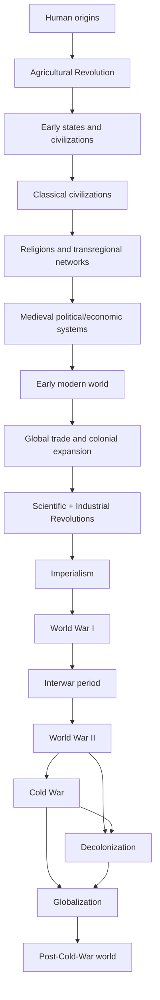

# Mục lục và kiến thức (knowledge / 지식) phụ thuộc (dependency / 의존성) — World lịch sử (history / 이력)

> **Mạch đọc:** Đặt **Mục lục và kiến thức (knowledge / 지식) phụ thuộc (dependency / 의존성) — World lịch sử (history / 이력)** trong bản đồ [README](./README.md) để thấy đơn vị sở hữu (owner / 오너) và vị trí của nó. Nội dung đi từ **phụ thuộc (dependency / 의존성) đồ thị (graph / 그래프)** sang **Câu hỏi xuyên suốt**; điểm nối này chuẩn bị câu hỏi cho các mục sau thay vì dừng ở định nghĩa đầu tiên.

## Phụ thuộc (dependency / 의존성) đồ thị (graph / 그래프)
Phần “Phụ thuộc (dependency / 의존성) đồ thị (graph / 그래프)” nối kiến thức trước với nội dung sắp đọc, giúp người mới hiểu mục đích, tiêu chí theo dõi và kết luận cần rút ra trước khi xem danh sách, bảng hoặc ví dụ.

```mermaid
graph TD
  A[Human origins] --> B[Agricultural Revolution]
  B --> C[Early states and civilizations]
  C --> D[Classical civilizations]
  D --> E[Religions and transregional networks]
  E --> F[Medieval political/economic systems]
  F --> G[Early modern world]
  G --> H[Global trade and colonial expansion]
  H --> I[Scientific + Industrial Revolutions]
  I --> J[Imperialism]
  J --> K[World War I]
  K --> L[Interwar period]
  L --> M[World War II]
  M --> N[Cold War]
  M --> O[Decolonization]
  N --> O
  N --> P[Globalization]
  O --> P
  P --> Q[Post-Cold-War world]
```

> **Chuyển mạch:** Từ **phụ thuộc (dependency / 의존성) đồ thị (graph / 그래프)**, ta sang **Câu hỏi xuyên suốt** để mở rộng cùng câu hỏi và dùng kết quả đó để khép lại mạch giải thích.

## Câu hỏi xuyên suốt
Phần “Câu hỏi xuyên suốt” nối kiến thức trước với nội dung sắp đọc, giúp người mới hiểu mục đích, tiêu chí theo dõi và kết luận cần rút ra trước khi xem danh sách, bảng hoặc ví dụ.

| Trục | Câu hỏi cơ chế |
| --- | --- |
| Technology | Công nghệ làm giảm chi phí phối hợp, sản xuất hay bạo lực ở đâu? |
| Resources | Lương thực, nước, đất, khoáng sản, năng lượng và lao động được huy động thế nào? |
| Institutions | Ai đặt luật, thu thuế, ghi chép, phân xử và tạo tính chính danh? |
| Trade | Mạng trao đổi nào nối producer–broker–bên tiêu thụ (consumer / 소비자); chokepoint và tiền tệ nằm ở đâu? |
| Warfare | Năng lực quân sự dựa trên logistics, nhân lực, tài chính và thông tin nào? |
| Demography | Dân số, di cư, đô thị, dịch bệnh và cơ cấu tuổi biến đổi quyền lực ra sao? |
| Ideas | Tôn giáo, khoa học, dân tộc, chủ quyền, giai cấp và nhân quyền làm hợp thức hoá hành động nào? |

> **Chuyển mạch:** Từ **Câu hỏi xuyên suốt**, ta sang **Lộ trình đọc** để mở rộng cùng câu hỏi và dùng kết quả đó để khép lại mạch giải thích.

## Lộ trình đọc
Phần “Lộ trình đọc” nối kiến thức trước với nội dung sắp đọc, giúp người mới hiểu mục đích, tiêu chí theo dõi và kết luận cần rút ra trước khi xem danh sách, bảng hoặc ví dụ.

- **Nền tảng vật chất:** 01 → 02 → 03.
- **Đế chế và mạng ý tưởng:** 04 → 05 → 06.
- **Đại dương, vốn và công nghiệp:** 07 → 08 → 09 → 10.
- **Thế kỷ chiến tranh và tái cấu trúc:** 11 → 12 → 13 → 14.
- **Chủ quyền và phụ thuộc hiện đại:** 15 → 16 → 17.
- **trường hợp (case / 사례) study Đông Á:** đọc song song [`korean_history/00_index_and_dependency.md`](../korean_history/00_index_and_dependency.md).

Một mũi tên chỉ **phụ thuộc (dependency / 의존성) để hiểu**, không khẳng định mọi xã hội trải qua cùng thứ tự hay cùng kết quả.

> **Chuyển mạch:** Từ **Lộ trình đọc**, ta sang **Chapter map** để mở rộng cùng câu hỏi và dùng kết quả đó để khép lại mạch giải thích.

## Chapter map
Phần “Chapter map” nối kiến thức trước với nội dung sắp đọc, giúp người mới hiểu mục đích, tiêu chí theo dõi và kết luận cần rút ra trước khi xem danh sách, bảng hoặc ví dụ.

| # | Giai đoạn | Chapter |
| --- | --- | --- |
| 01 | Human origins | [Human origins](01_human_origins.md) |
| 02 | Agricultural Revolution | [Agricultural Revolution](02_agricultural_revolution.md) |
| 03 | Early states and civilizations | [Early states and civilizations](03_early_states_civilizations.md) |
| 04 | Classical civilizations | [Classical civilizations](04_classical_civilizations.md) |
| 05 | Religions and transregional networks | [Religions and transregional networks](05_religions_transregional_networks.md) |
| 06 | Medieval political/economic các hệ thống (systems / 시스템들) | [Medieval systems](06_medieval_systems.md) |
| 07 | Early hiện đại (modern / 현대적) world | [Early modern world](07_early_modern_world.md) |
| 08 | toàn cục (global / 전역) trade and colonial expansion | [Global trade and colonial expansion](08_global_trade_colonial_expansion.md) |
| 09 | Scientific + Industrial Revolutions | [Scientific + Industrial Revolutions](09_scientific_industrial_revolutions.md) |
| 10 | Imperialism | [Imperialism](10_imperialism.md) |
| 11 | World War I | [World War I](11_world_war_i.md) |
| 12 | Interwar period | [Interwar period](12_interwar_period.md) |
| 13 | World War II | [World War II](13_world_war_ii.md) |
| 14 | Cold War | [Cold War](14_cold_war.md) |
| 15 | Decolonization | [Decolonization](15_decolonization.md) |
| 16 | Globalization | [Globalization](16_globalization.md) |
| 17 | Post-Cold-War world | [Post-Cold-War world](17_post_cold_war_world.md) |
| 18 | Phương pháp và connections | [Methods and connections](18_methods_connections.md) |
| 19 | Glossary và tham chiếu (reference / 참조) map | [Glossary and reference map](19_glossary_and_reference_map.md) |
| 20 | Comparative trường hợp (case / 사례) studies | [Comparative case studies](20_comparative_case_studies.md) |
| 21 | chuyển tiếp (transition / 전이) ma trận (matrix / 행렬) | [Transition matrix](21_transition_matrix.md) |
| 22 | nguồn (source / 소스) workbench | [Source workbench](22_source_workbench.md) |
| 23 | Annotated bibliography | [Annotated bibliography](23_annotated_bibliography.md) |

> **Chuyển mạch:** Từ **Chapter map**, ta sang **Tài liệu điều hướng** để mở rộng cùng câu hỏi và dùng kết quả đó để khép lại mạch giải thích.

## Tài liệu điều hướng
Phần “Tài liệu điều hướng” nối kiến thức trước với nội dung sắp đọc, giúp người mới hiểu mục đích, tiêu chí theo dõi và kết luận cần rút ra trước khi xem danh sách, bảng hoặc ví dụ.

- [Learning Route](LEARNING_ROUTE.md): các đường đọc theo mục tiêu và cách ôn lại.
- [Coverage Audit](COVERAGE_AUDIT.md): trạng thái breadth/độ sâu (depth / 깊이), ranh giới và ưu tiên vòng tiếp theo.

> **Bàn giao:** Sau **Tài liệu điều hướng**, hãy chốt bất biến (invariant / 불변식) và giới hạn của mục này trước khi nối sang kiến thức kế tiếp. Có thể đọc tiếp [01 human origins](./01_human_origins.md) để đối chiếu ranh giới (boundary / 경계) gần nhất.
