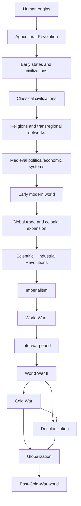

# Mục lục và kiến thức (knowledge / 지식) phụ thuộc (dependency / 의존성) — World lịch sử (history / 이력)

> **Mạch đọc:** [README](./README.md) là bản đồ owner của **Index và dependency map của World History**. Route đi từ period/region map → causal dependencies → recurring questions → chapter sequence → comparative cases, để người đọc biết mỗi giai đoạn nối vào cấu trúc nào.

## Phụ thuộc (dependency / 의존성) đồ thị (graph / 그래프)

```mermaid
graph TD
  A[Human origins] --> B[Agricultural Revolution]
  B --> C[Early states and civilizations]
  C --> D[Classical civilizations]
  D --> E[Religions and transregional networks]
  E --> F[Medieval political/economic systems]
  F --> G[Early modern world]
  G --> H[Global trade and colonial expansion]
  H --> I[Scientific + Industrial Revolutions]
  I --> J[Imperialism]
  J --> K[World War I]
  K --> L[Interwar period]
  L --> M[World War II]
  M --> N[Cold War]
  M --> O[Decolonization]
  N --> O
  N --> P[Globalization]
  O --> P
  P --> Q[Post-Cold-War world]
```

> **Chuyển mạch:** **Phụ thuộc đồ thị** cho biết chapter nào cần đọc trước; **Câu hỏi xuyên suốt** chuyển đồ thị đó thành các câu hỏi về cơ chế và bằng chứng, rồi **Lộ trình đọc** biến chúng thành thứ tự học có thể kiểm tra.

## Câu hỏi xuyên suốt

| Trục | Câu hỏi cơ chế |
| --- | --- |
| Technology | Công nghệ làm giảm chi phí phối hợp, sản xuất hay bạo lực ở đâu? |
| Resources | Lương thực, nước, đất, khoáng sản, năng lượng và lao động được huy động thế nào? |
| Institutions | Ai đặt luật, thu thuế, ghi chép, phân xử và tạo tính chính danh? |
| Trade | Mạng trao đổi nào nối producer–broker–bên tiêu thụ (consumer / 소비자); chokepoint và tiền tệ nằm ở đâu? |
| Warfare | Năng lực quân sự dựa trên logistics, nhân lực, tài chính và thông tin nào? |
| Demography | Dân số, di cư, đô thị, dịch bệnh và cơ cấu tuổi biến đổi quyền lực ra sao? |
| Ideas | Tôn giáo, khoa học, dân tộc, chủ quyền, giai cấp và nhân quyền làm hợp thức hoá hành động nào? |

> **Chuyển mạch:** Sau khi xác định câu hỏi xuyên suốt, **Lộ trình đọc** xếp các chapter theo tiền đề–hệ quả; **Chapter map** tiếp tục gắn từng điểm dừng với chủ đề và owner cụ thể.

## Lộ trình đọc

- **Nền tảng vật chất:** 01 → 02 → 03.
- **Đế chế và mạng ý tưởng:** 04 → 05 → 06.
- **Đại dương, vốn và công nghiệp:** 07 → 08 → 09 → 10.
- **Thế kỷ chiến tranh và tái cấu trúc:** 11 → 12 → 13 → 14.
- **Chủ quyền và phụ thuộc hiện đại:** 15 → 16 → 17.
- **trường hợp (case / 사례) study Đông Á:** đọc song song [`korean_history/00_index_and_dependency.md`](../korean_history/00_index_and_dependency.md).

Một mũi tên chỉ **phụ thuộc (dependency / 의존성) để hiểu**, không khẳng định mọi xã hội trải qua cùng thứ tự hay cùng kết quả.

> **Chuyển mạch:** **Chapter map** cho biết mỗi chapter đóng góp cơ chế nào vào tuyến học; **Tài liệu điều hướng** dùng mapping đó để đưa người đọc tới nguồn, case và audit tương ứng.

## Chapter map

| # | Giai đoạn | Chapter |
| --- | --- | --- |
| 01 | Human origins | [Human origins](01_human_origins.md) |
| 02 | Agricultural Revolution | [Agricultural Revolution](02_agricultural_revolution.md) |
| 03 | Early states and civilizations | [Early states and civilizations](03_early_states_civilizations.md) |
| 04 | Classical civilizations | [Classical civilizations](04_classical_civilizations.md) |
| 05 | Religions and transregional networks | [Religions and transregional networks](05_religions_transregional_networks.md) |
| 06 | Medieval political/economic các hệ thống (systems / 시스템들) | [Medieval systems](06_medieval_systems.md) |
| 07 | Early hiện đại (modern / 현대적) world | [Early modern world](07_early_modern_world.md) |
| 08 | toàn cục (global / 전역) trade and colonial expansion | [Global trade and colonial expansion](08_global_trade_colonial_expansion.md) |
| 09 | Scientific + Industrial Revolutions | [Scientific + Industrial Revolutions](09_scientific_industrial_revolutions.md) |
| 10 | Imperialism | [Imperialism](10_imperialism.md) |
| 11 | World War I | [World War I](11_world_war_i.md) |
| 12 | Interwar period | [Interwar period](12_interwar_period.md) |
| 13 | World War II | [World War II](13_world_war_ii.md) |
| 14 | Cold War | [Cold War](14_cold_war.md) |
| 15 | Decolonization | [Decolonization](15_decolonization.md) |
| 16 | Globalization | [Globalization](16_globalization.md) |
| 17 | Post-Cold-War world | [Post-Cold-War world](17_post_cold_war_world.md) |
| 18 | Phương pháp và connections | [Methods and connections](18_methods_connections.md) |
| 19 | Glossary và tham chiếu (reference / 참조) map | [Glossary and reference map](19_glossary_and_reference_map.md) |
| 20 | Comparative trường hợp (case / 사례) studies | [Comparative case studies](20_comparative_case_studies.md) |
| 21 | chuyển tiếp (transition / 전이) ma trận (matrix / 행렬) | [Transition matrix](21_transition_matrix.md) |
| 22 | nguồn (source / 소스) workbench | [Source workbench](22_source_workbench.md) |
| 23 | Annotated bibliography | [Annotated bibliography](23_annotated_bibliography.md) |

> **Chuyển mạch:** Khi chapter map đã chỉ rõ quan hệ phụ thuộc, **Tài liệu điều hướng** là điểm tra cứu để chọn tuyến đọc, nguồn đối chiếu và bước quay lại audit mà không lạc owner.

## Tài liệu điều hướng

- [Learning Route](LEARNING_ROUTE.md): các đường đọc theo mục tiêu và cách ôn lại.
- [Coverage Audit](COVERAGE_AUDIT.md): trạng thái breadth/độ sâu (depth / 깊이), ranh giới và ưu tiên vòng tiếp theo.

> **Bàn giao:** Sau **Tài liệu điều hướng**, hãy giữ lại kết luận và ranh giới của mục này; quay về [README](./README.md) khi cần định vị owner hoặc chọn nhánh học tiếp theo.
