# 정보처리 기사 필기 요약

> 빠른 복습용 정리. 각 번호는 기출 핵심 주제이며, 참고 이미지는 원문 자료에 연결됩니다.

## 목차

- 1과목: 데이터베이스
- 2과목: 전자 계산기 구조
- 3과목: 운영체제
- 4과목: 소프트웨어 공학
- 5과목: 데이터 통신


## 1과목·데이터베이스

### 001. 핵심 정보 시스템

### 003. 핵심 데이터베이스의 특징

### 002. 핵심 데이터베이스의 정의

#### 정보 시스템

- 조직체에 필요한 Data를 수집, 저장해 두었다가 필요 시에 처리해서 의사 결정에 유용한 정보를 생성하고 분 배하는 수단이다.
- 사용하는 목적에 따라 경영 정보 시스템, 군사 정보 시 스템, 인사 행정 정보 시스템, 의사 결정 지원 시스템 등 으로 사용된다.

#### 정보와 자료

- 자료(Data) : 현실 세계에서 관찰이나 측정을 통해 수집한 단순한 사실이나 결과값으로, 가공되지 않은 상태
- 정보(Information) : 의사 결정에 도움을 줄 수 있는 유용한 형태로, 자료를 가공(처리)해서 얻는 결과물

- 자료 처리 시스템 : 정보 시스템이 사용할 자료를 처리 하는 정보 시스템의 서브 시스템으로, 처리 형태에 따 라 일괄 처리 시스템, 온라인 실시간 처리 시스템, 분 산 처리 시스템으로 분류
- 데이터웨어 하우스(DataWare House) : 조직이나 기업체 의 중심이 되는 주요 업무 시스템에서 추출되어 새로 이 생성된 데이터베이스로서 의사 결정 지원 시스템을 지원하는 주체적, 통합적, 시간적 데이터의 집합체

- 통합된 데이터(Integrated Data) : 자료의 중복을 배제한 데이터의 모임
- 저장된 데이터(Stored Data) : 컴퓨터가 접근할 수 있는 저장 매체에 저장된 자료
- 운영 데이터(Operational Data) : 조직의 업무를 수행하는 데 있어서 존재 가치가 확실하고 없어서는 안 될 반드 시 필요한 자료
- 공용 데이터(Shared Data) : 여러 응용 시스템들이 공동 으로 소유하고 유지하는 자료

- 실시간 접근성(Real Time Accessibility) : 수시적이고 비정 형적인 질의(조회)에 대하여 실시간 처리(Real-Time Processing)에 의한 응답이 가능함
- 계속적인 변화(Continuous Evolution) : 새로운 데이터의 삽입(Insertion), 삭제(Deletion), 갱신(Update)으로 항상 최신의 데이터를 유지함
- 동시 공유(동시 공용)(Concurrent Sharing) : 여러 사용자가 동시에 자기가 원하는 데이터를 이용할 수 있음
- 내용에 의한 참조(Content Reference) : 데이터베이스에 있는 데이터를 참조할 때 데이터 주소나 위치에 의해 서가 아니라 사용자가 요구하는 데이터 내용으로 데이 터를 찾음

- 사용자와 데이터베이스 사이에서 사용자의 요구에 따 라 정보를 생성해 주고, 데이터베이스를 관리해 주는 소프트웨어이다.
- 기존의 파일 시스템이 갖는 데이터의 종속성과 중복성 의 문제를 해결하기 위해 제안된 시스템으로, 모든 응 용 프로그램들이 데이터베이스를 공용할 수 있도록 관 리해 준다.
- 데이터베이스의 구성, 접근 방법, 유지관리에 대한 모 든 책임을 진다.

### 004. 핵심 DBMS(DataBase Management System)의 정의

#### 종속성으로 인한 문제점

- 종속성이란 응용 프로그램과 데이터 파일이 상호 의존 적인 관계를 말한다.
- 데이터 파일이 보조기억장치에 저장되는 방법이나 저 장된 데이터의 접근 방법을 변경할 때는 응용 프로그 램도 같이 변경해야 한다.

#### 중복성으로 인한 문제점

- 일관성 : 중복된 데이터 간에 내용이 일치하지 않는 상 황이 발생하여 일관성이 없어짐

### 005. 핵심 기존의 파일 처리 방식에서의 문제점


- 보안성 : 중복되어 있는 모든 데이터에 동등한 보안 수 준을 유지하기가 어려움
- 경제성 : 저장공간의 낭비와 동일한 데이터의 반복 작업 으로 인한 비용의 증가
- 무결성 : 제어의 분산으로 인해 데이터의 정확성을 유지 할 수 없음

- 정의(조직)(Definition)
  - 데이터의 형(Type)과 구조, 데이터가 DB에 저장될 때의 제약조건 등을 명시하는 기능이다.
- 데이터와 데이터의 관계를 명확하게 명세할 수 있어 야 하며, 원하는 데이터 연산은 무엇이든 명세할 수 있어야 한다.
- 조작(Manipulation) : 데이터 검색(요청), 갱신(변경), 삽 입, 삭제 등을 체계적으로 처리하기 위해 데이터 접근 수단 등을 정하는 기능
- 제어(Control)
  - 데이터베이스를 접근하는 갱신, 삽입, 삭제 작업이 정확하게 수행되어 데이터의 무결성이 유지되도록 제어해야 한다.
  - 정당한 사용자가 허가된 데이터만 접근할 수 있도록 보안(Security)을 유지하고 권한(Authority)을 검사 할 수 있어야 한다.
  - 여러 사용자가 데이터베이스를 동시에 접근하여 데 이터를 처리할 때 처리 결과가 항상 정확성을 유지 하도록 병행 제어(Concurrency Control)를 할 수 있 어야 한다.

### 006. 핵심 DBMS의 필수 기능

#### 논리적 독립성과 물리적 독립성

- 논리적 독립성 : 응용 프로그램과 데이터베이스를 독립 시킴으로써, 데이터의 논리적 구조를 변경시키더라도 응용 프로그램은 변경되지 않음
- 물리적 독립성 : 응용 프로그램과 보조기억장치 같은 물 리적 장치를 독립시킴으로써, 데이터베이스 시스템의 성능 향상을 위해 새로운 디스크를 도입하더라도 응용 프로그램에는 영향을 주지 않고 데이터의 물리적 구조 만을 변경함

| 장 점                 | 단 점                    |
|---------------------|------------------------|
| •데이터의 중복을 피할 수 있음  |                        |
| •저장된 자료를 공동으로 이용할 |                        |
| 수 있음                |                        |
| •보안을 유지할 수 있음      |                        |
| •데이터를 표준화할 수 있음    |                        |
| •항상 최신의 데이터를 유지함   |                        |
| •데이터의 실시간 처리가 가능함  |                        |
| •데이터의 논리적·물리적 독립성  |                        |
| 이 보장                |                        |
| •데이터베이스            | 전문가 부족                 |
| •전산화               | 비용이 증가함                |
| •대용량               | 디스크로의 집중적인             |
|                     | Access로 과부하(Overhead)가 |
| •파일의               | 예비(Backup)와 회복         |
|                     | (Recovery)이 어려움        |
| •시스템이              | 복잡함                    |

### 007. 핵심 DBMS의 장·단점

- 데이터베이스의 구조와 제약조건에 관한 전반적인 명 세(Specification)를 기술(Description)한다.
- 데이터베이스를 구성하는 데이터 개체(Entity), 속성 (Attribute), 관계(Relationship) 및 데이터 조작 시 데이터 값들이 갖는 제약조건 등에 관해 전반적으로 정의한다.
- 스키마는 사용자의 관점에 따라 외부(External) 스키 마, 개념(Conceptual) 스키마, 내부(Internal) 스키마 로 나뉜다.
- 스키마(Schema)는 데이터 사전에 저장되며, 다른 이 름으로 메타 데이터(Meta-Data)라고도 한다.

### 008. 핵심 스키마(Schema)의 정의


#### 외부 스키마(External Schema) = 서브 스키마 = 사용자 뷰 (View)

- 사용자나 응용 프로그래머가 각 개인의 입장에서 필요 로 하는 데이터베이스의 논리적 구조를 정의한다.
- 전체 데이터베이스의 한 논리적인 부분으로 볼 수 있 으므로 서브 스키마(Subschema)라고도 한다.
- 하나의 데이터베이스 시스템에는 여러 개의 외부 스키 마가 존재할 수 있으며, 하나의 외부 스키마를 여러 개 의 응용 프로그램이나 사용자가 공용할 수 있다.
- 같은 데이터베이스에 대해서도 서로 다른 관점을 정의 할 수 있도록 허용한다.
- 일반 사용자는 질의어(SQL)를 사용하여 DB를 사용한다.

#### 개념 스키마(Conceptual Schema) = 전체적인 뷰(View)

- 데이터베이스의 전체적인 논리적 구조로서, 모든 응용 프로그램이나 사용자들이 필요로 하는 데이터를 통합 한 조직 전체의 데이터베이스로 하나만 존재한다.
- 개념 스키마는 개체 간의 관계와 제약조건을 나타내고 데이터베이스의 접근 권한, 보안 및 무결성 규칙에 관 한 명세를 정의한다.
- 단순히 스키마(Schema)라고 하면 개념 스키마를 의미 한다.
- 기관이나 조직체의 관점에서 데이터베이스를 정의한 것이다.
- 데이터베이스 관리자에 의해서 구성된다.

#### 내부 스키마(Internal Schema)

- 물리적 저장장치의 입장에서 본 데이터베이스 구조로, 물리적인 저장장치와 밀접한 계층이다.
- 실제로 데이터베이스에 저장될 레코드의 물리적인 구 조를 정의하고, 저장 데이터 항목의 표현 방법, 내부 레코드의 물리적 순서 등을 나타낸다.
- 시스템 프로그래머나 시스템 설계자가 보는 관점의 스 키마이다.
- 데이터베이스의 물리적 구조를 정의한다.
- 데이터의 실제 저장 방법을 기술한다.
- 물리적인 저장장치와 밀접한 계층이다.

### 009. 핵심 스키마의 3계층

#### 데이터 정의 언어(DDL ; Data Definition Language)

- DB 구조, 데이터 형식, 접근 방식 등 DB를 구축하거나 수정할 목적으로 사용하는 언어이다.
- 번역한 결과가 데이터 사전(Data-Dictionary)이라는 특별한 파일에 여러 개의 테이블로 저장된다.
- 데이터 정의 언어의 기능 -외부 스키마 명세 정의
- 데이터베이스의 논리적 데이터 구조와 물리적 데이 터 구조의 정의 및 수정
- 논리적 데이터 구조와 물리적 데이터 구조 간의 사상 정의 -스키마에 사용되는 제약조건에 대한 명세 정의 -데이터의 물리적 순서 규정

#### 데이터 조작 언어(DML ; Data Manipulation Language) = 서브 언어

- 사용자로 하여금 데이터를 처리할 수 있게 하는 도구로 서 사용자(응용 프로그램)와 DBMS 간의 인터페이스를 제공한다.
- 응용 프로그램을 통하여 사용자가 DB의 데이터를 실질 적으로 조작할 수 있도록 하기 위해 C, COBOL 등의 호스트 언어에 DB 기능을 추가시켜 만든 언어이다.
- 대표적인 데이터 조작어(DML)에는 질의어가 있으며, 질의어는 터미널에서 주로 이용하는 비절차적(Non Procedural) 데이터 언어이다.

#### 데이터 제어 언어(DCL ; Data Control Language)

- 무결성,보안및권한제어,회복등을하기위한언어이다.
- 데이터를 보호하고 데이터를 관리하는 목적으로 사용 된다.
- 데이터 제어 언어의 기능
- 불법적인 사용자로부터 데이터를 보호하기 위한 데 이터 보안(Security) -데이터의 정확성을 위한 무결성(Integrity) 유지 -시스템 장애에 대비한 데이터 회복과 병행수행 제어

### 010. 핵심 데이터베이스 언어(Database Language)


#### DBA(DataBase Administrator)

데이터베이스 시스템의 모든 관리와 운영에 대한 책임을 지고 있는 사람이나 그룹을 의미한다.

- 데이터베이스 구성 요소 결정
- 개념 스키마 및 내부 스키마 정의
- 데이터베이스의 저장 구조 및 접근 방법 정의
- 보안 및 데이터베이스의 접근 권한 부여 정책 수립
- 장애에 대비한 예비(Back Up) 조치와 회복(Recovery) 에 대한 전략 수립
- 무결성을 위한 제약조건의 지정
- 데이터 사전의 구성과 유지관리
- 사용자의 요구와 불평의 청취 및 해결
- 변화 요구에 대한 적응과 성능 향상에 대한 감시
- 시스템 감시 및 성능 분석
- 데이터사용추세,이용형태및각종통계등을종합,분석

#### 응용 프로그래머

- 응용 프로그래머는 일반 호스트 언어로 프로그램을 작 성할 때 데이터 조작어를 삽입해서 일반 사용자가 응 용 프로그램을 사용할 수 있게, 인터페이스를 제공할 목적으로 데이터베이스를 접근하는 사람들이다.
- 응용 프로그래머는 C, COBOL, PASCAL 등의 호스트 언어와 DBMS가 지원하는 데이터 조작어에 능숙한 컴 퓨터 전문가이다.

#### 일반 사용자

일반 사용자는 보통 터미널을 이용하여 데이터베이스에 있는 자원을 활용할 목적으로 질의어나 응용 프로그램을 사용하여 데이터베이스에 접근하는 사람들이다.

### 011. 핵심 데이터베이스 사용자

- 현실 세계의 정보들을 컴퓨터에 표현하기 위해 단순 화, 추상화하여 체계적으로 표현한 개념적 모형이다.
- 데이터, 데이터의 관계, 데이터의 의미 및 일관성, 제약 조건 등을 기술하기 위한 개념적 도구들의 모임이다.
- 현실 세계를 데이터베이스에 표현하는 중간 과정, 즉 데이터베이스 설계 과정에서 데이터의 구조를 논리적 으로 표현하기 위해 사용되는 도구이다.

### 012. 핵심 데이터 모델의 정의

#### 개념적 데이터 모델

- 현실 세계에 대한 인간의 이해를 돕기 위하여 현실 세 계에 대한 인식을 추상적 개념으로 표현하는 과정이다.
- 속성들로 기술된 개체 타입과 이 개체 타입들 간의 관 계를 이용하여 현실 세계를 표현하는 방법이다.
- 현실 세계에 존재하는 개체를 인간이 이해할 수 있는 정보 구조로 표현하기 때문에 정보 모델이라고도 한다.
- 대표적으로 개체-관계(E-R) 모델이 있다.

#### 논리적 데이터 모델

- 개념적 모델링 과정에서 얻은 개념적 구조를 컴퓨터가 이해하고 처리할 수 있는 컴퓨터 세계의 환경에 맞도 록 변환하는 과정이다.
- 필드로 기술된 데이터 타입과 이 데이터 타입들 간의 관계를 이용하여 현실 세계를 표현하는 방법이다.
- 단순히 데이터 모델이라고 하면 논리적 데이터 모델을 의미한다.
- 논리적 데이터 모델은 데이터 간의 관계를 어떻게 표 현하느냐에 따라 관계 모델, 계층 모델, 네트워크 모델 로 구분한다.

### 013. 핵심 데이터 모델의 종류


- 구조(Structure) : 논리적으로 표현된 개체 타입들 간의 관계로서 데이터 구조 및 정적 성질을 표현함
- 연산(Operation) : 데이터베이스에 저장된 실제 데이터를 처리하는 방법을 표시하는 것으로서 데이터베이스를 조작하는 기본 도구임
- 제약조건(Constraint) : 데이터베이스에 저장될 수 있는 실제 데이터의 논리적인 제약조건을 표시함

### 014. 핵심 데이터 모델에 표시할 사항

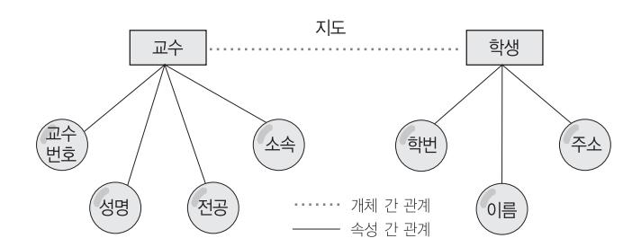

#### 개체(Entity)

- 데이터베이스에 표현하려는 것으로, 사람이 생각하는 개념이나 정보 단위 같은 현실 세계의 대상체이다.
- 유형, 무형의 정보로서 서로 연관된 몇 개의 속성으로 구성된다.
- 파일 시스템의 레코드에 대응하는 것으로, 어떤 정보 를 제공하는 역할을 수행한다.
- 실세계에 독립적으로 존재하거나 그 자체로서도 구별이 가능하다.

#### 속성(Attribute)

- 데이터의 가장 작은 논리적 단위로서 파일 구조의 데 이터 항목 또는 데이터 필드에 해당된다.
- 개체를 구성하는 항목이다.

|         | 속성  |          | 개체 세트(레코드 타입) |
|---------|-----|----------|---------------|
| 교수번호    | 성명  | 전공       | 소속            |
| 146001  | 강현준 | 식물       | 서울대           |
|         | 박윤영 | 미생물      | 강원대           |
| } 개체 세트 | 조성진 | 곤충 교수 개체 | 안산대 개체 인스턴스   |

#### 관계(Relationship)

- 개체 간의 관계 또는 속성 간의 관계
- 다음 그림의 관계는 교수가 학생을 지도하는 관계이다.

- 교수 개체의 구성 요소
- 속성 : 개체가 가지고 있는 특성, 교수번호, 성명, 전 공, 소속
- 개체 타입 : 속성으로만 기술된 개체의 정의
- 개체 인스턴스 : 개체를 구성하고 있는 각 속성들이 값을 가져 하나의 개체를 나타내는 것으로 개체 어 커런스(Occurence) 라고도 함
- 개체 세트 : 개체 인스턴스의 집합

### 015. 핵심 데이터 모델의 구성 요소

- 개념적 데이터 모델의 가장 대표적인 것으로, 1976년 Peter Chen에 의해 제안되었다.
- 개체 타입(Entity Type)과 이들 간의 관계 타입 (Relationship Type)을 이용해 현실 세계를 개념적으 로 표현한다.
- 데이터를 개체(Entity), 관계(Relationship), 속성 (Attribute)으로 묘사한다.
- E-R 다이어그램으로 표현한다.
- 특정 DBMS를 고려한 것이 아니기 때문에 관계 표현 에 제한이 없다.

### 016. 핵심 개체-관계(Entity-Relationship) 모델

### 017. 핵심 E-R 다이어그램

- E-R 모델의 기본적인 아이디어를 시각적으로 표현하 기 위한 도구이다.
- 개체 간의 관계는 물론 시스템 내의 역할을 하는 모든 개체들, 즉 조직, 부서, 사용자, 프로그램, 데이터를 모두 표시한다.


|   | 기 호 | 기호 이름 | 의 미                    |
|---|-----|-------|------------------------|
| n | m   |       |                        |
|   |     | 사각형   | 개체(Entity) 타입          |
| n | m   |       |                        |
|   |     | 마름모   | 관계(Relationship) 타입    |
| n | m   |       |                        |
|   |     | 타원    | 속성(Attribute)          |
| n | m   |       |                        |
|   |     | 밑줄 타원 | 기본키 속성                 |
| n | m   |       |                        |
|   |     | 복수 타원 |                        |
|   |     |       | 복합 속성                  |
|   |     |       |  성명은 성과 이름으로 구       |
| n | m   | 관계    | 1:1, 1:N, N:M 등의 개체 관계 |
|   |     |       | 에 대해 선 위에 대응수 기술       |
|   |     | 선, 링크 | 개체 타입과 속성 연결           |

- 계층 모델과 망 모델의 복잡한 구조를 단순화시킨 모 델이다.
- 표(Table)를 이용해서 데이터 상호 관계를 정의하는 DB 구조를 말한다.
- 데이터 간의 관계를 기본키(Primary Key)와 이를 참 조하는 외래키(Foreign Key)로 표현한다.
- 대표적인 DBMS : Oracle, MS-SQL, Informix 등
- 1:1, 1:N, M:N 관계를 자유롭게 표현할 수 있다.
- 장점 : 간결하고, 보기 편리하며, 다른 데이터베이스로 의 변환이 용이함
- 단점 : 성능이 다소 떨어짐

### 018. 핵심 관계형 데이터 모델

- 데이터의 논리적 구조도가 트리 형태이며, 개체가 트 리를 구성하는 노드 역할을 한다.
- 개체 집합에 대한 속성 관계를 표시하기 위해 개체를 노드로 표현하고 개체 집합들 사이의 관계를 링크로 연결한다.
- 개체 간의 관계를 부모와 자식 간의 관계로 표현한다.
- 개체 타입 간에는 상위와 하위 관계가 존재하며, 일 대 다(1:N) 대응 관계만 존재한다.
- 레코드 삭제 시 연쇄 삭제(Triggered Delete)가 된다.
- 개체 타입들 간에는 사이클(Cycle)이 허용되지 않는다.
- 계층형 모델에서는 개체(Entity)를 세그먼트(Segment) 라 부른다.
- 대표적인 DBMS는 IMS이다.

### 019. 핵심 계층형 데이터 모델

- CODASYL이 제안한 것으로, CODASYL DBTG 모델 이라고도 한다.
- 그래프를 이용해서 데이터 논리 구조를 표현한 데이터 모델이다.
- 상위와 하위 레코드 사이에서 다 대 다(N:M) 대응 관 계를 만족하는 구조이다.
- 상위의 레코드를 Owner, 하위의 레코드를 Member라 하여 Owner-Member 관계라고도 한다.
- 레코드 타입 간의 관계는 1:1, 1:N, N:M이 될 수 있다.
- 대표적인 DBMS : DBTG, EDBS, TOTAL 등

### 020. 핵심 망(그래프, 네트워크)형 데이터 모델

#### 데이터베이스 설계 시 고려사항

- 데이터의 무결성 유지 : 삽입, 삭제, 갱신 등의 연산 후에 도 데이터베이스에 저장된 데이터가 정해진 제약조건 을 항상 만족해야 함
- 데이터의 일관성 유지 : 데이터베이스에 저장된 데이터들 사이나, 특정 질의에 대한 응답이 처음부터 끝까지 변

### 021. 핵심 데이터베이스 설계

14.8. 14.3, 13.8, 13.6, 12.8, 12.5, 11.8, 11.6, 11.3, 10.9, 10.5, 10.3, 09.8, 09.5, 09.3, 08.9, 08.5, 08.3, 07.9, 07.3, 06.9, 06.3, 05.9, 05.5, 05.4, 04.9, 01.9, 00.3, 99.4


함없이 일정해야 함

- 데이터의 회복성 유지 : 시스템에 장애가 발생했을 때 장 애 발생 직전의 상태로 복구할 수 있어야 함
- 데이터의 보안성 유지 : 불법적인 데이터의 노출 또는 변 경이나 손실로부터 보호할 수 있어야 함
- 데이터의 효율성 유지 : 응답시간의 단축, 시스템의 생산 성, 저장 공간의 최적화 등이 가능해야 함
- 데이터베이스의 확장성 유지 : 데이터베이스 운영에 영향 을 주지 않으면서 지속적으로 데이터를 추가할 수 있어 야 함

#### 개념적 설계(정보 모델링, 개념화)

- 정보의 구조를 얻기 위하여 현실 세계의 무한성과 계속 성을 이해하고, 다른 사람과 통신하기 위하여 현실 세 계에 대한 인식을 추상적 개념으로 표현하는 과정이다.
- 스키마 모델링과 트랜잭션 모델링을 병행하여 수행한다.
- 요구 분석 단계에서 나온 결과(요구 조건 명세)를 DBMS에 독립적인E-R다이어그램(개체관계도)으로작성한다.
- DBMS에 독립적인 개념 스키마를 설계한다.

#### 논리적 설계(데이터 모델링)

- 현실 세계에서 발생하는 자료를 컴퓨터가 처리할 수 있는 물리적 저장장치에 저장할 수 있도록 변환하기 위해 특정 DBMS가 지원하는 논리적 자료 구조로 변 환시키는 과정이다.
- 개념 세계의 데이터를 필드로 기술된 데이터 타입과 이 데이터 타입들 간의 관계로 표현되는 논리적 구조 의 데이터로 모델화한다.
- 개념적 설계가 개념 스키마를 설계하는 단계라면 논리적 설계에서는 개념 스키마를 평가 및 정제하고 특정 DBMS에 종속적인 논리적 스키마를 설계하는 단계이다.
- 트랜잭션의 인터페이스를 설계한다.
- 관계형 데이터베이스라면 테이블을 설계하는 단계이다.

#### 물리적 설계(데이터 구조화)

- 논리적 설계 단계에서 논리적 구조로 표현된 데이터를 디스크 등의 물리적 저장장치에 저장할 수 있는 물리 적 구조의 데이터로 변환하는 과정이다.
- 데이터베이스 파일의 저장 구조, 레코드의 형식, 접근 경로와 같은 정보를 사용하여 데이터가 컴퓨터에 저장 되는 방법을 묘사한다.

- 트랜잭션을 작성한다.
- 물리적 설계 단계에 꼭 포함되어야 할 것은 저장 레코 드의 양식 설계, 레코드 집중의 분석 및 설계, 접근 경 로 등이다.
- 물리적 설계 시 고려사항
- 인덱스의 구조
- 레코드의 크기 및 개수
- 파일에 대한 트랜잭션의 갱신과 참조 성향
- 성능 향상을 위한 개념 스키마의 변경 여부 검토
- 빈번한 질의와 트랜잭션들의 수행속도를 높이기 위 한 고려
- 시스템 운용 시 파일 크기의 변화 가능성
- 물리적 설계 옵션 선택 시 고려 사항
- 반응시간(Response Time) : 트랜잭션 수행을 요구 한 시점부터 처리 결과를 얻을 때까지의 경과시간 -공간 활용도(Space Utilization) : 데이터베이스 파일 과 액세스 경로 구조에 의해 사용되는 저장공간의 양
- 트랜잭션 처리량(Transaction Throughput) : 단위 시간 동안 데이터베이스 시스템에 의해 처리될 수 있 는 트랜잭션의 평균 개수

요구 조건 명세서 작성

개념 스키마, 트랜잭션 모델링, E-R 모델

목표 DBMS에 맞는 스키마 설계, 트랜잭션 인터페이

스 설계

목표 DBMS에 맞는 물리적 구조의 데이터로 변환

특정 DBMS의 DDL로 데이터베이스 생성, 트랜잭션

작성

요구 분석 ↓ 개념적 설계 ↓ 논리적 설계 ↓ 물리적 설계 ↓ 구현

### 022. 핵심 데이터베이스 설계 순서


릴레이션은 데이터들을 표(Table)의 형태로 표현한 것으 로, 구조를 나타내는 릴레이션 스키마와 실제 값들인 릴레 이션 인스턴스로 구성된다.

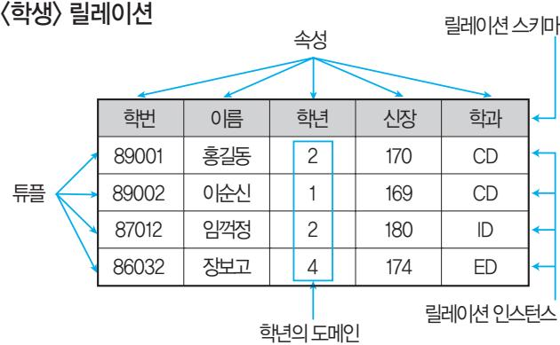

#### 튜플(Tuple)

- 릴레이션을 구성하는 각각의 행
- 속성의 모임으로 구성된다.
- 파일 구조에서 레코드와 같은 의미이다.
- 튜플의 수 = 카디널리티(Cardinality) = 기수 = 대응수

#### 속성(Attribute, 애트리뷰트)

- 릴레이션을 구성하는 각각의 열
- 데이터베이스를 구성하는 가장 작은 논리적 단위이다.
- 파일 구조 상의 데이터 항목 또는 데이터 필드에 해당된다.
- 개체의 특성을 기술한다.
- 속성의 수 = 디그리(Degree) = 차수

#### 도메인(Domain)

- 하나의 애트리뷰트가 취할 수 있는 같은 타입의 원자 (Atomic)값들의 집합
- 실제 애트리뷰트 값이 나타날 때 그 값의 합법 여부를 시스템이 검사하는 데에도 이용된다. 성별 애트리뷰트의 도메인은 '남'과 '여'로, 그 외의 값은 입력될 수 없다.

#### 릴레이션 인스턴스(Relation Instance)

데이터 개체를 구성하고 있는 속성들에 데이터 타입이 정의되어 구체적인 데이터 값을 갖고 있는 것을 말한다.

### 023. 핵심 관계 데이터베이스의 Relation 구조

#### <학생> 릴레이션

| 학번    | 이름  | 학년 | 신장  | 학과 |
|-------|-----|----|-----|----|
| 89001 | 홍길동 | 2  | 170 | CD |
| 89002 | 이순신 | 1  | 169 | CD |
| 87012 | 임꺽정 | 2  | 180 | ID |
| 86032 | 장보고 | 4  | 174 | ED |

- 한 릴레이션에 포함된 튜플들은 모두 상이하다. <학생> 릴레이션을 구성하는 홍길동 레코드는 홍길동에 대한 학 적사항을 나타내는 것으로 <학생> 릴레이션 내에서는 유일하다.
- 한 릴레이션에 포함된 튜플 사이에는 순서가 없다. <학생> 릴레이션에서 홍길동 레코드와 임꺽정 레코드의 위치가 바뀌어도 상관없다.
- 튜플들의 삽입, 삭제 등의 작업으로 인해 릴레이션은 시간에 따라 변한다. <학생> 릴레이션에 새로운 학생의 레코드를 삽입하거나 기존 학 생에 대한 레코드를 삭제함으로써 테이블은 내용 면에서나 크기 면에서 변하게 된다.
- 릴레이션 스키마를 구성하는 속성들 간의 순서는 중요 하지 않다. 학번, 이름 등의 속성을 나열하는 순서가 이름, 학번 순으로 바뀌 어도 데이터 처리에는 아무런 영향을 미치지 않는다.
- 속성의 유일한 식별을 위해 속성의 명칭은 유일해야 하 지만, 속성을 구성하는 값은 동일한 값이 있을 수 있다. 각 학생의 학년을 기술하는 속성인 '학년'은 다른 속성명들과 구 분되어 유일해야 하지만 '학년' 속성에는 2, 1, 2, 4 등이 입력된 것 처럼 동일한 값이 있을 수 있다.
- 릴레이션을 구성하는 튜플을 유일하게 식별하기 위해 속성들의 부분집합을 키(Key)로 설정한다. <학생> 릴레이션에서는 '학번'이나 '이름'이 튜플들을 구분하는 유 일한 값인 키가 될 수 있다.
- 속성은 더 이상 쪼갤 수 없는 원자값만을 저장한다. '학년'에 저장된 1, 2, 4 등은 더 이상 세분화할 수 없다.

### 024. 핵심 릴레이션의 특징


키(Key)는 데이터베이스에서 조건에 만족하는 튜플을 찾 거나 순서대로 정렬할 때 다른 튜플들과 구별할 수 있는 유일한 기준이 되는 애트리뷰트(속성)이다.

#### <학생> 릴레이션

#### <수강> 릴레이션

| 학번   | 주민번호           | 성명  | 성별 |
|------|----------------|-----|----|
| 1001 | 810429-1231457 | 김형석 | 남  |
| 1002 | 800504-1546781 | 김현천 | 남  |
| 1003 | 811215-2547842 | 류기선 | 여  |
| 1004 | 801225-2201248 | 홍영선 | 여  |

| 학번   | 과목명 |
|------|-----|
| 1001 | 영어  |
| 1001 | 전산  |
| 1002 | 영어  |
| 1003 | 수학  |
| 1004 | 영어  |
| 1004 | 전산  |

|        | •릴레이션을 | 구성하는         | 속성들   | 중에서     | 튜플을     | 유일      |
|--------|---------|--------------|-------|---------|---------|---------|
| 하게     | 식별하기    | 위해           | 사용하는  |         | 속성들의    | 부분집합,   |
| 즉      | 기본키로    | 사용할          | 수 있는  | 속성들을    | 말함      |         |
| •모든   | 릴레이션은   |              | 반드시   | 하나 이상의  |         | 후보키를 가  |
| 져야     | 함       |              |       |         |         |         |
|        | •릴레이션에 | 있는 모든        | 튜플에   | 대해서     |         | 유일성과 최  |
|        | 소성을     | 만족시켜야        | 함     |         |         |         |
|       | <학생>    | 릴레이션에서       |       | ‘학번’이나  |         | ‘주민번호’는 |
|        | 다른      | 레코드를         | 유일하게  | 구별할     | 수 있는    | 기본      |
|        | 키로 사용할  | 수            | 있으므로  |         | 후보키이다.  |         |
| •후보키  | 중에서     | 선택한          |       | 주키(Main | Key)    |         |
| •한    | 릴레이션에서  | 특정           | 튜플을   |         | 유일하게    | 구별할 수   |
| 있는     | 속성      |              |       |         |         |         |
| •Null | 값을 가질   | 수 없음         |       |         |         |         |
|        | •기본키로  | 정의된          | 속성에는  | 동일한     | 값이      | 중복되어    |
|        | 저장될 수   | 없음           |       |         |         |         |
|       | <학생>    | 릴레이션에서는      |       | ‘학번’이나  |         | ‘주민번호’가 |
|        | 기본키가    | 될 수          | 있고,   | <수강>    | 릴레이션에서는 |         |
|        |         | ‘학번’+‘과목명’으로 |       | 조합해야    | 기본키가    | 만들어     |
|       | ‘학번’이   | <학생>         | 릴레이션의 |         | 기본키로    | 정의되면    |
|        | 이미 입력된  | ‘1001’은      | 다른    | 튜플의     | ‘학번’    | 속성의     |
|        | 값으로     | 입력할 수        | 없다.   |         |         |         |

| •후보키가              | 둘       | 이상일          | 때 기본키를     | 제외한       | 나머지     |
|---------------------|---------|--------------|------------|-----------|---------|
| 후보키들을               |         | 말함           |            |           |         |
| •보조키라고도            |         | 함            |            |           |         |
|  <학생>             | 릴레이션에서  |              | ‘학번’을      | 기본키로      | 정의하     |
| 면                   | ‘주민번호’는 | 대체키가         | 된다.        |           |         |
| •슈퍼키는              | 한       | 릴레이션         | 내에 있는      | 속성들의      | 집합으     |
| 로                   | 구성된     | 키로서 릴레이션을    |            | 구성하는      | 모든 튜플   |
| 중                   | 슈퍼키로    | 구성된          | 속성의 집합과    | 동일한       | 값은      |
| 나타나지                | 않는다.    |              |            |           |         |
| •릴레이션을             |         | 구성하는         | 모든 튜플에     | 대해        | 유일성은    |
| 만족시키지만,             |         | 최소성은         | 만족시키지      | 못함        |         |
|  <학생>             | 릴레이션에서는 |              | ‘학번’,      | ‘주민번호’,   | ‘학번’    |
| +‘주민번호’,            |         | ‘주민번호’+‘성명’, |            | ‘학번’+‘주민번 |         |
| 호’+‘성명’             |         | 등으로          | 슈퍼키를 구성할   | 수         | 있다.     |
| •관계(Relationship)를 |         |              | 맺고 있는      | 릴레이션      | R1, R2에 |
| 서                   | 릴레이션    | R1이 참조하고     | 있는         | 릴레이션      | R2의     |
| 기본키와                | 같은      | R1 릴레이션의     |            | 속성        |         |
| •외래키는              | 참조되는    |              | 릴레이션의      | 기본키와      | 대응되     |
| 어                   | 릴레이션    | 간에 참조        | 관계를        | 표현하는데     | 중요한     |
| •외래키로              | 지정되면    | 참조           | 테이블의       | 기본키에      | 없는      |
| 값은                  | 입력할     | 수 없음         |            |           |         |
|  <수강>             | 릴레이션이   |              | <학생> 릴레이션을 |           | 참조하고    |
| 있으므로                |         | <학생> 릴레이션의   |            | ‘학번’은     | 기본키이    |
| 고,                  | <수강>    | 릴레이션의        | ‘학번’은      | 외래키이다.    |         |
|  <수강>             | 릴레이션의   |              | ‘학번’에는     | <학생>      | 릴레이션    |
| 의                   | ‘학번’에   | 없는 값은        | 입력할        | 수 없다.     |         |

#### 널 값(NULL Value)

데이터베이스에서 아직 알려지지 않았거나 모르는 값으로서 "해당 없음" 등의 이유로 정보 부재를 나타내기 위해 사용하는, 이론적으로 아무것도 없는 특수한 데이터입니다.

#### 최소성과 유일성

'학번'+'주민번호'를 사용하여 슈퍼키를 만들면 다른 튜플들과 구분할 수 있는 유일성은 만족하지만, '학번'이나 '주민번호' 하나만 가지고도 다른 튜플들을 구분할 수 있으므로 최소성은 만족시키지 못합니다.

#### 잠깐만요 !

### 025. 핵심 키(Key)의 개념 및 종류

- 개체 무결성 : 릴레이션에서 기본키를 구성하는 속성은 널(NULL) 값이나 중복값을 가질 수 없음 <학생> 릴레이션에서 '학번'이 기본키로 정의되면 튜플을 추가할 때 '주민번호'나 '성명' 필드에는 값을 입력하지 않아도 되지만 '학 번' 속성에는 반드시 값을 입력해야 한다. 또한 '학번' 속성에는 이 미 한 번 입력한 속성값을 중복하여 입력할 수 없다.
- 참조 무결성 : 외래키 값은 NULL이거나 참조 릴레이션 의 기본키 값과 동일해야 함, 즉 릴레이션은 참조할 수

### 026. 핵심 무결성(Integrity)


없는 외래키 값을 가질 수 없음 <수강> 릴레이션의 '학번' 속성에는 <학생> 릴레이션의 '학번' 속성 에 없는 값은 입력할 수 없다.
- 도메인 무결성 : 특정 속성의 값이 그 속성이 정의된 도 메인에 속한 값이어야 한다는 규정 성별 속성의 도메인은 '남'과 '여'로, 그 외의 값은 입력할 수 없다.

- 관계형 데이터베이스에서 원하는 정보와 그 정보를 어 떻게 유도하는가를 기술하는 절차적인 언어이다.
- 릴레이션을 처리하기 위해 연산자와 연산규칙을 제공하는 언어로 피연산자가 릴레이션이고, 결과도 릴레이션이다.
- 질의에 대한 해를 구하기 위해 수행해야 할 연산의 순 서를 명시한다.
- 순수 관계 연산자와 일반 집합 연산자가 있다.
- 순수 관계 연산자 : Select, Project, Join, Division
- 일반 집합 연산자 : UNION(합집합), INTERSECTION (교집합), DIFFERENCE(차집합), Cartes ian Product(교차곱)

### 027. 핵심 관계대수의 개요

관계 데이터베이스에 적용할 수 있도록 특별히 개발된 관계 연산자이다.

| 연산자   |            |         | 특 징    |           |                 |
|-------|------------|---------|--------|-----------|-----------------|
|       | •릴레이션에    | 존재하는    | 튜플     | 중에서 선택    | 조건을 만족하         |
| 는     | 튜플의        | 부분집합을   | 구하여    | 새로운       | 릴레이션을 만듦        |
|       | •릴레이션의    | 행(가로)에  | 해당하는   | 튜플을       | 구하는 것이          |
| 므로    | 수평         | 연산이라고도  | 함      |           |                 |
|       | •연산자의 기호는 | 그리스     | 문자     | 시그마(σ)를   | 사용함             |
| •주어진 |            | 릴레이션에서  | 속성     | List에 제시된 | Attribute만을     |
|       | 추출하는 연산    |         |        |           |                 |
|       | •릴레이션의    | 열(세로)에  | 해당하는   |           | Attribute를 추출하는 |
|       | 것이므로 수직    | 연산자라고도  |        | 함         |                 |
|       | •연산자의 기호는 | 그리스     | 문자     | 파이( π )를  | 사용함             |
| •공통  | 속성을        | 중심으로    | 2개의    | 릴레이션을     | 하나로 합쳐          |
| 서     | 새로운        | 릴레이션을   | 만드는    | 연산        |                 |
|       | •연산자의 기호는 | ▷◁를     | 사용함    |           |                 |
| •X   | ⊃ Y인 2개의   |         | 릴레이션에서 | R(X)와     | S(Y)가 있을 때,     |
| R의    | 속성이 S의     | 속성값을    | 모두     | 가진        | 튜플에서 S가 가       |
| 진     | 속성을        | 제외(분리)한 | 속성만을   | 구하는       | 연산              |

### 028. 핵심 순수 관계 연산자

- 코드(E. F. Codd)가 수학의 Predicate Calculus(술어 해 석)에 기반을 두고 관계 데이터베이스를 위해 제안했다.
- 관계해석은 원하는 정보가 무엇이라는 것만 정의하는 비절차적 특성을 지닌다.
- 원하는 정보를 정의할 때는 계산 수식을 사용한다.
- 튜플 관계해석과 도메인 관계해석이 있다.
- 기본적으로 관계해석과 관계대수는 관계 데이터베이 스를 처리하는 기능과 능력 면에서 동등하다.
- 질의어로 표현한다.

### 029. 핵심 관계해석

#### 정규화의 개요

- 함수적 종속성 등의 종속성 이론을 이용하여 잘못 설계 된 관계형 스키마를 더 작은 속성의 세트로 쪼개어 바 람직한 스키마로 만들어 가는 과정이다.
- 정규형에는 제1정규형, 제2정규형, 제3정규형, BCNF 형, 제4정규형, 제5정규형이 있으며, 차수가 높아질수 록 만족시켜야 할 제약 조건이 늘어난다.
- 정규화는 데이터베이스의 논리적 설계 단계에서 수행 한다.
- 정규화는 논리적 처리 및 품질에 큰 영향을 미친다.

#### 정규화의 목적

- 데이터 구조의 안정성을 최대화한다.
- 어떠한 릴레이션이라도 데이터베이스 내에서 표현 가 능하게 만든다.
- 효과적인 검색 알고리즘을 생성할 수 있다.
- 중복을 배제하여 삽입, 삭제, 갱신 이상의 발생을 방지 한다.
- 데이터 삽입 시 릴레이션을 재구성할 필요성을 줄인다.

### 030. 정규화(Normalization)

핵심 14.5, 13.8, 13.3, 12.5, 12.3, 11.8, 10.9, 10.5, 09.8, 09.3, 08.5, 07.5, 06.5, 05.3, 03.3


#### 이상(Anomaly)의 개념

- 정규화(Normalization)를 거치지 않은 데이터베이스 내에 데이터들이 불필요하게 중복되어 릴레이션 조작 시 발생하는 예기치 못한 곤란한 현상이다.
- 애트리뷰트들 간에 존재하는 여러 종속 관계를 하나의 릴레이션에 표현하기 때문에 이상이 발생한다.

#### 이상의 종류

| 릴레이션에  | 데이터를 |       | 삽입할  | 때    | 의도와는  |
|--------|------|-------|------|------|-------|
| 관계없이   | 원하지  | 않은    | 값들도  | 함께   | 삽입되는  |
| 릴레이션에서 |      | 한 튜플을 | 삭제할  | 때    | 의도와는  |
| 관계없는   | 값들도  | 함께    | 삭제되는 |      | 연쇄 삭제 |
| 릴레이션에서 |      | 튜플에   | 있는   | 속성값을 | 갱신할   |
| 때 일부   | 튜플의  | 정보만   | 갱신되어 |      | 정보에   |
| 모순이    | 생기는  | 현상    |      |      |       |

### 031. 핵심 Anomaly(이상)의 개념 및 종류

| 비정규 릴레이션                                                      |  |
|---------------------------------------------------------------|--|
| <span></span> <div><span><span>↓</span></span> 도메인이 원자값</div> |  |
| 1NF                                                           |  |
| <span><span>↓</span></span> 부분적 함수 종속 제거                      |  |
| 2NF                                                           |  |
| <span><span>↓</span></span> 이행적 함수 종속 제거                      |  |
| 3NF                                                           |  |
| <span><span>↓</span></span> 결정자이면서 후보키가 아닌 것 제거               |  |
| BCNF                                                          |  |
| <span><span>↓</span></span> 다치 종속 제거                          |  |
| 4NF                                                           |  |
| <span><span>↓</span></span> 조인 종속성 이용                         |  |
| 5NF                                                           |  |

#### 함수적 종속 관계

어떤 릴레이션 R에서 X와 Y를 각각 R의 애트리뷰트 집 합의 부분 집합이라고 할 경우, 애트리뷰트 X의 값 각각 에 대해 시간에 관계없이 항상 애트리뷰트 Y의 값이 오 직 하나만 연관되어 있을 때 Y는 X에 함수 종속적이라고 하며, X→Y와 같이 표기한다.

 <수강> 릴레이션이 (학번, 이름, 과목명)으로 되어 있 을 때, '학번'이 결정되면 '`과목명'에 상관없이 '`학번' 에는 항상 같은 이름이 대응된다. '`학번'에 따라 '이름' 이 결정될 때 '이름'을 '학번'에 함수 종속적이라고 하 며 '`학번 → 이름'과 같이 표기한다.

#### 이행적 종속 관계

A → B이고 B → C일 때 A → C를 만족하는 관계이다.

#### 정규화 단계 암기 요령

정규화라는 출소자가 말했다. 두부이겨다줘≒도부이결다조

도메인이 원자값

부분적 함수 종속 제거

이행적 함수 종속 제거 결정자이면서 후보키가 아닌 것 제거 다치 종속 제거 조인 종속성 이용

### 032. 정규화 과정

핵심

#### DDL(데이터 정의어)

- SCHEMA, DOMAIN, TABLE, VIEW, INDEX를 정 의하거나 변경 또는 삭제할 때 사용하는 언어이다.
- 데이터베이스 관리자나 데이터베이스 설계자가 사용한다.
- 데이터 정의어(DDL)의 3가지 유형

#### DML(데이터 조작어)

- 데이터베이스 사용자가 응용 프로그램이나 질의어를 통하여 저장된 데이터를 실질적으로 처리하는 데 사용 하는 언어이다.
- 데이터베이스 사용자와 데이터베이스 관리 시스템 간 의 인터페이스를 제공한다.
- 데이터 조작어(DML)의 4가지 유형

| 명령어    |         |         |        | 기 능   |        |     |
|--------|---------|---------|--------|-------|--------|-----|
| CREATE | SCHEMA, | DOMAIN, | TABLE, | VIEW, | INDEX를 | 정의함 |
| ALTER  | TABLE에  | 대한      | 정의를    | 변경하는  | 데 사용함  |     |
| DROP   | SCHEMA, | DOMAIN, | TABLE, | VIEW, | INDEX를 | 삭제함 |

### 033. 핵심 SQL의 분류


| 명령어    | 기 능                      |
|--------|--------------------------|
| SELECT | 테이블에서 조건에 맞는 튜플을 검색함     |
| INSERT | 테이블에 새로운 튜플을 삽입함         |
| DELETE | 테이블에서 조건에 맞는 튜플을 삭제함     |
| UPDATE | 테이블에서 조건에 맞는 튜플의 내용을 변경함 |

#### DCL(데이터 제어어)

- 데이터의 보안, 무결성, 데이터 회복, 병행수행 제어 등을 정의하는 데 사용하는 언어이다.
- 데이터베이스관리자가데이터관리를목적으로사용한다.

#### 데이터 제어어(DCL)의 종류

| 명령어      |        |        | 기 능   |        |            |
|----------|--------|--------|-------|--------|------------|
|          | 명령에    | 의해 수행된 | 결과를   | 실제     | 물리적 디스크로 저 |
|          | 장하고,   | 데이터베이스 | 조작    | 작업이    | 정상적으로 완료   |
|          | 되었음을   | 관리자에게  | 알려줌   |        |            |
| ROLLBACK | 데이터베이스 | 조작     | 작업이   | 비정상적으로 | 종료되었을      |
|          | 때 원래의  | 상태로    | 복구함   |        |            |
| GRANT    | 데이터베이스 |        | 사용자에게 | 사용 권한을 | 부여함        |
| REVOKE   | 데이터베이스 | 사용자의   | 사용    | 권한을    | 취소함        |

테이블을 구성하는 튜플(행)들 중에서 전체 또는 조건을 만족하는 튜플(행)을 검색하여 주기억장치 상에 임시 테 이블로 구성시키는 명령문이다.

SELECT Predicate [테이블명.]속성명1, [테이블명.]속성명2, … FROM 테이블명1, 테이블명2, … [WHERE 조건] [GROUP BY 속성명1, 속성명2, …] [HAVING 조건] [ORDER BY 속성명 [ASC | DESC]];

#### 1. SELECT절

- Predicate : 불러올 튜플 수를 제한할 명령어를 기술함
- ALL : 모든 튜플을 검색할 때 지정하는 것으로, 주 로 생략함

- DISTINCT : 중복된 튜플이 있으면 그 중 첫 번째 한 개만 검색함
- DISTINCTROW : 중복된 튜플을 검색하지만 선택 된 속성의 값이 아닌, 튜플 전체를 대상으로 함
- 속성명 : 검색하여 불러올 속성(열) 및 수식들을 지정함
- 기본 테이블을 구성하는 모든 속성을 지정할 때는 ' \*' 를 기술한다.
- 두 개 이상의 테이블을 대상으로 검색할 때는 반드 시 테이블명.속성명으로 표현해야 한다.

2. FROM절 : 질의에 의해 검색될 데이터들을 포함하는

테이블명을 기술함

#### 3. WHERE절 : 검색할 조건 기술

#### 4. GROUP BY절

- 특정 속성을 기준으로 그룹화하여 검색할 때 그룹화 할 속성을 지정함
- 일반적으로 GROUP BY절은 그룹 함수와 함께 사용된다.
- 그룹 함수의 종류
- COUNT(속성명) : 그룹별 튜플 수를 구하는 함수
- MAX(속성명) : 그룹별 최대값을 구하는 함수
- MIN(속성명) : 그룹별 최소값을 구하는 함수
- SUM(속성명) : 그룹별 합계를 구하는 함수
- AVG(속성명) : 그룹별 평균을 구하는 함수

5. HAVING절 : GROUP BY와 함께 사용되며, 그룹에 대

한 조건을 지정함

6. ORDER BY절 : 특정 속성을 기준으로 정렬하여 검색할

때 사용함

- 속성명 : 정렬의 기준이 되는 속성명을 기술함
- [ASC|DESC] : 정렬 방식으로서 'ASC'는 오름차순, '`DESC`'는 내림차순임, 생략하면 오름차순으로 지정

### 034. 핵심 Select문


#### 삽입문(INSERT INTO ~ )

- 기본 테이블에 새로운 튜플을 삽입할 때 사용한다.

#### INSERT

INTO 테이블명(속성명1, 속성명2, … ) VALUES (데이터1, 데이터2, … );

- 대응하는 속성과 데이터는 개수와 데이터 형식이 일치 해야 한다.
- 기본 테이블의 모든 속성을 사용할 때는 속성명을 생략 할 수 있다.
- SELECT문을 사용하여 다른 테이블의 검색 결과를 삽 입할 수 있다.

#### 삭제문(DELETE FROM ~ )

- 기본 테이블에 있는 튜플들 중에서 특정 튜플을 삭제할 때 사용한다.

#### DELETE

FROM 테이블명 WHERE 조건;

- 모든 레코드를 삭제할 때는 WHERE절을 생략한다.
- 모든 레코드를 삭제하더라도 테이블 구조는 남아 있기 때문에 디스크에서 테이블을 완전히 제거하는 DROP 과는 다르다.

#### 갱신문(UPDATE ~ SET ~ )

기본 테이블에 있는 튜플들 중에서 특정 튜플의 내용을 변경할 때 사용한다.

UPDATE 테이블명 SET 속성명1 = 데이터1[, 속성명2 = 데이터2] WHERE 조건;

### 035. 핵심 삽입, 삭제, 갱신문

- 응용 프로그램이 실행될 때 함께 실행되도록 호스트 프로그램 언어로 만든 프로그램에 삽입된 SQL이다.
- 내장 SQL 실행문은 호스트 언어에서 실행문이 나타날 수 있는 곳이면 프로그램의 어느 곳에서나 사용할 수 있다.
- 일반 SQL문은 수행 결과로 여러 개의 튜플을 반환하 는 반면, 내장 SQL은 단 하나의 튜플만을 반환한다.
- 내장 SQL문에 의해 반환되는 튜플은 일반 변수를 사 용하여 저장할 수 있다.
- Host Program의 컴파일 시 내장 SQL문은 선행 처리 기에 의해 분리되어 컴파일된다.
- 호스트 변수와 데이터베이스 필드의 이름은 같아도 된다.
- 내장 SQL문에 사용된 호스트 변수의 데이터 타입은 이에 대응하는 데이터베이스 필드의 SQL 데이터 타입 과 일치하여야 한다.
- 내장 SQL문이 실행되면 SQL의 실행 상태가 SQL 상 태 변수에 전달된다.
- 호스트 언어의 실행문과 SQL문을 구분시키는 방법
- 명령문의 구분 : C/C++에서 내장 SQL문은 \$와 세 미콜론(;) 문자 사이에 기술하고, Visual BASIC에서 는 내장 SQL문 앞에 'EXEC SQL'을 기술함
- 변수의 구분 : 내장 SQL에서 사용하는 호스트 변수 는 변수 앞에 콜론(:) 문자를 붙임

### 036. 핵심 내장 SQL(Embedded SQL)

### 037. 핵심 뷰(View)

- 사용자에게 접근이 허용된 자료만을 제한적으로 보여 주기 위해 하나 이상의 기본 테이블로부터 유도된 가 상 테이블이다.
- 저장장치 내에 물리적으로 존재하지 않지만, 사용자에 게는 있는 것처럼 간주된다.
- 데이터 보정작업, 처리과정 시험 등 임시적인 작업을 위한 용도로 활용된다.

#### 뷰(View)의 특징

- 기본 테이블로부터 유도된 테이블이기 때문에 기본 테 이블과 같은 형태의 구조를 가지며, 조작도 기본 테이 블과 거의 같다.


- 가상 테이블이기 때문에 물리적으로 구현되어 있지 않다.
- 필요한 데이터만 뷰로 정의해서 처리할 수 있기 때문 에 관리가 용이하고 명령문이 간단해진다.
- 조인문의 사용을 최소화하여 사용상의 편의성을 최대 화한다.
- 뷰를 통해서만 데이터에 접근하게 하면 뷰에 나타나지 않는 데이터를 안전하게 보호할 수 있다.
- 기본 테이블의 기본키를 포함한 속성(열) 집합으로 뷰 를 구성해야만 삽입, 삭제, 갱신 연산이 가능하다.
- 정의된 뷰는 다른 뷰의 정의에 기초가 될 수 있다.
- 하나의 뷰를 삭제하면 그 뷰를 기초로 정의된 다른 뷰 도 자동으로 삭제된다.

#### 뷰의 장점

- 논리적 데이터 독립성을 제공한다.
- 동일 데이터에 대해 동시에 여러 사용자의 상이한 응 용이나 요구를 지원해준다.
- 사용자의 데이터 관리를 간단하게 해준다.
- 접근 제어를 통한 자동 보안이 제공된다.

#### 뷰의 단점

- 독립적인 인덱스를 가질 수 없다.
- 뷰의 정의를 변경할 수 없다.
- 뷰로 구성된 내용에 대한 삽입, 삭제, 갱신 연산에 제 약이 따른다.

#### 뷰 정의문

CREATE VIEW 뷰이름[(속성이름[,속성이름])] AS SELECT문;

- SELECT문을 부질의로 사용하여 SELECT문의 결과로 서 뷰를 생성한다.
- 부질의로서의 SELECT문에는 UNION이나 ORDER BY절을 사용할 수 없다.
- 속성 이름을 기술하지 않으면 SELECT문의 속성 이름 이 자동으로 사용된다.

#### 뷰 삭제문

DROP VIEW 뷰이름 {RESTRICT | CASCADE};

취소됨

- CASCADE : 뷰를 참조하는 다른 뷰나 제약 조건까지 모 두 삭제됨

- 시스템 그 자체에 관련이 있는 스키마 및 다양한 객체 에 관한 정보를 포함하는 시스템 데이터베이스이다.
- 데이터베이스에 포함되는 모든 데이터 객체에 대한 정의 나 명세에 관한 정보를 유지관리하는 시스템 테이블이다.
- 데이터 정의어의 결과로 구성되는 기본 테이블, 뷰, 인 덱스, 패키지, 접근 권한 등의 데이터베이스 구조 및 통계 정보를 저장한다.
- 카탈로그들이 생성되면 자료 사전(Data Dictionary)에 저장되기 때문에 좁은 의미로는 카탈로그를 자료 사전 이라고도 한다.
- 카탈로그에 저장된 정보를 메타 데이터(Meta-Data) 라고 한다.

#### 시스템 카탈로그의 특징

- 카탈로그 자체도 시스템 테이블로 구성되어 있어 일반 이용자도 SQL을 이용하여 내용을 검색해 볼 수 있다.
- INSERT, DELETE, UPDATE문으로 갱신하는 것은 허용하지 않는다.
- DBMS가 스스로 생성하고 유지한다.
- 카탈로그는 사용자가 SQL문을 실행시켜 기본 테이블, 뷰, 인덱스 등에 변화를 주면 시스템이 자동으로 갱신된다.

### 038. 핵심 시스템 카탈로그

- 데이터베이스의 상태를 변환시키는 하나의 논리적 기 능을 수행하기 위한 작업의 단위 또는 한꺼번에 모두 수행되어야 할 일련의 연산들을 의미한다.
- 데이터베이스 시스템에서 복구 및 병행 수행 시 처리되 는 작업의 논리적 단위이다.
- 하나의 트랜잭션은 Commit되거나 Rollback된다.
- 트랜잭션은 일반적으로 회복의 단위가 된다.

### 039. 핵심 트랜잭션의 정의


| •트랜잭션이 |         | 그 실행을     | 성공적으로   |      | 완료하면    | 언   |
|---------|---------|-----------|---------|------|---------|-----|
| 제나      | 일관성     | 있는 데이터베이스 |         |      | 상태로 변환함 |     |
| •시스템이  | 가지고     | 있는        | 고정      | 요소는  | 트랜잭션    | 수   |
| 행       | 전과 트랜잭션 |           | 수행 완료   | 후의   | 상태가     | 같아  |
| 야       | 함       |           |         |      |         |     |
| •둘     | 이상의     | 트랜잭션이     | 동시에     | 병행   | 실행되는    | 경   |
| 우       | 어느 하나의  | 트랜잭션      |         | 실행중에 | 다른      | 트랜잭 |
| 션의      | 연산이     | 끼어들       | 수 없음    |      |         |     |
| •수행중인  | 트랜잭션은   |           | 완전히     | 완료될  | 때까지     | 다   |
| 른       | 트랜잭션에서  | 수행        | 결과를     | 참조할  | 수       | 없음  |
| 성공적으로   |         | 완료된 트랜잭션의 |         | 결과는  | 영구적으    |     |
| 로 반영되어야 |         | 함         |         |      |         |     |
| •트랜잭션의 |         | 연산은       | 데이터베이스에 |      | 모두      | 반영  |
| 되든지     | 아니면     | 전혀        | 반영되지    | 않아야  | 함       |     |
| •트랜잭션  | 내의      | 모든        | 명령은     | 반드시  | 완벽히     | 수행  |
| 되어야     | 하며,     | 모두가       | 완벽히     | 수행되지 | 않고      | 어   |
| 느       | 하나라도    | 에러가       | 발생하면    | 트랜잭션 |         | 전부가 |
| 취소되어야   |         | 함         |         |      |         |     |

### 040. 핵심 트랜잭션의 특성

- Commit 연산 : 하나의 논리적 단위(트랜잭션)에 대한 작업이 성공적으로 끝났고, 데이터베이스가 다시 일관 된 상태에 있을 때 이 트랜잭션이 행한 갱신 연산이 완 료된 것을 트랜잭션 관리자에게 알려주는 연산
- Rollback 연산 : 하나의 트랜잭션 처리가 비정상적으로 종료되어 데이터베이스의 일관성을 깨뜨렸을 때, 이 트랜잭션의 일부가 정상적으로 처리되었더라도 트랜 잭션의 원자성을 구현하기 위해 이 트랜잭션이 행한 모든 연산을 취소(Undo)시키는 연산으로, 해당 트랜 잭션을 재시작하거나 폐기함

### 041. 핵심 Commit, Rollback 연산

- Active(활동) : 트랜잭션이 실행중에 있는 상태
- Failed(장애) : 트랜잭션 실행에 오류가 발생하여 중단된 상태
- Aborted(철회) : 트랜잭션이 비정상적으로 종료되어 Rollback 연산을 수행한 상태
- Partially Committed(부분 완료) : 트랜잭션의 마지막 연산

### 042. 핵심 트랜잭션의 상태

까지 실행했지만, Commit 연산이 실행되기 직전의 상태

- Committed(완료) : 트랜잭션이 성공적으로 종료되어

Commit 연산을 실행한 후의 상태

- 회복은 트랜잭션들의 처리를 수행하는 도중 장애가 발 생하여 데이터베이스가 손상되었을 때 손상되기 이전 의 정상 상태로 복구시키는 작업이다.
- 장애의 유형
- 트랜잭션 장애 : 입력 데이터 오류, 불명확한 데이터, 시스템 자원 요구의 과다 등 트랜잭션 내부의 비정상 적인 상황으로 인하여 프로그램 실행이 중지되는 현상
- 시스템 장애 : 데이터베이스에 손상을 입히지는 않 으나 하드웨어 오동작, 소프트웨어의 손상, 교착 상 태 등에 의해 모든 트랜잭션의 연속적인 수행에 장 애를 주는 현상
- 미디어 장애 : 저장장치인 디스크 블록의 손상이나 디스크 헤드의 충돌 등에 의해 데이터베이스의 일부 또는 전부가 물리적으로 손상된 상태
- 회복 관리기(Recovery Management)
- DBMS의 구성 요소이다.
- 트랜잭션 실행이 성공적으로 완료되지 못하면 트랜 잭션이 데이터베이스에 만들었던 모든 변화를 취소 (Undo)시키고 트랜잭션 수행 이전의 원래 상태로 복구하는 역할을 담당한다.
- 메모리 덤프, 로그(Log)를 이용하여 수행한다.
- 회복 기법의 종류
- 연기 갱신 기법(Deferred Update)
- 즉각 갱신 기법(Immediate Update)
- 그림자 페이지 대체 기법(Shadow Paging)
- 검사점 기법(Check Point)

### 043. 핵심 회복(Recovery)


- 다중 프로그램의 이점을 활용하여 동시에 여러 개의 트 랜잭션을 병행 수행시킬 때, 동시에 실행되는 트랜잭션 들이 데이터베이스의 일관성을 파괴하지 않도록 트랜 잭션 간의 상호작용을 제어하는 것이다.

#### 병행 수행의 문제점

- 갱신 분실(Lost Update) : 2개 이상의 트랜잭션이 같 은 자료를 공유하여 갱신할 때 갱신 결과의 일부가 없어지는 현상
- 비완료 의존성(Uncommitted Dependency) : 하나 의 트랜잭션 수행이 실패한 후 회복되기 전에 다른 트랜잭션이 실패한 갱신 결과를 참조하는 현상
- 모순성(Inconsistency) : 두 개의 트랜잭션이 병행 수행될 때 원치 않는 자료를 이용함으로써 발생하는 문제
- 연쇄 복귀(Cascading Rollback) : 병행 수행되던 트 랜잭션들 중 어느 하나에 문제가 생겨 Rollback하는 경우 다른 트랜잭션도 함께 Rollback되는 현상

#### 병행 제어의 목적

- 데이터베이스의 공유를 최대화한다.
- 시스템의 활용도를 최대화한다.
- 데이터베이스의 일관성을 유지한다.
- 사용자에 대한 응답 시간을 최소화한다.

#### 로킹(Locking)

- 로킹은 주요 데이터의 액세스를 상호 배타적으로 하 는 것이다.
- 트랜잭션들이 어떤 로킹 단위를 액세스하기 전에 Lock(잠금)을 요청해서 Lock이 허락되어야만 그 로 킹 단위를 액세스할 수 있도록 하는 기법이다.

#### 로킹 단위(Locking Granularity)

- 병행 제어에서 한꺼번에 로킹할 수 있는 데이터 단위 이다.
- 데이터베이스, 파일, 레코드, 필드 등은 로킹 단위가 될 수 있다.
- 로킹 단위가 크면 로크 수가 작아 관리하기 쉽지만 병행성 수준이 낮아지고, 로킹 단위가 작으면 로크 수가 많아 관리하기 복잡하지만 병행성 수준이 높아 진다.

### 044. 핵심 병행 제어(Concurrency Control)

### 045. 핵심 보안(Security)

#### 데이터베이스 보안의 개요

- 데이터베이스의 일부분 또는 전체에 대해서 권한이 없 는 사용자가 액세스를 수행하는 것을 금지하기 위해 사 용되는 기술이다.
- 데이터베이스 사용자들은 일반적으로 서로 다른 객체 에 대하여 다른 접근권리 또는 권한을 갖게된다.

#### 무결성(Integrity)과 보안(Security)

- 무결성은 권한이 있는 사용자로부터 데이터베이스를 보호하는 것이고, 보안은 권한이 없는 사용자로부터 데 이터베이스를 보호하는 것을 말한다.
- 보안은 데이터베이스 사용자들이 데이터베이스를 사용 하고자 할 때 언제든지 사용할 수 있도록 보장하는 것 이고, 무결성은 정확하게 사용할 수 있도록 보장하는 것을 말한다.

#### 암호화 기법

- 개인키 암호 방식(Private Key Encryption) = 비밀키 암호 방식
- 동일한 키로 데이터를 암호화하고 복호화한다.
- 비밀키는 제3자에게는 노출시키지 않고, 데이터베이 스 사용 권한이 있는 사용자만 나누어 가진다.
- 대칭 암호 방식 또는 단일키 암호화 기법이라고도 한 다.
- 대표적으로 DES(Data Encryption Standard)가 있다.
- 장점 : 암호화/복호화 속도가 빠르며, 알고리즘이 단 순하고 파일 크기가 작음
- 단점 : 사용자의 증가에 따라 관리해야 할 키의 수가 상대적으로 많아짐
- DES는 56Bit의 16개 키를 이용하여 64Bit의 평문 블록 을 16회의 암호 계산 단계를 거쳐 64Bit의 암호문을 얻 는다.

#### 공개키 암호 방식(Public Key Encryption)

- 서로 다른 키로 데이터를 암호화하고 복호화한다.
- 데이터를 암호화할 때 사용하는 키(공개키, Public Key)는 데이터베이스 사용자에게 공개하고, 복호화 할 때의 키(비밀키, Secret Key)는 관리자가 비밀리 에 관리하는 방법이다.
- 비대칭 암호 방식이라고도 하며, 대표적으로 RSA (Rivest Shamir Adleman)가 있다.


- 분산 데이터베이스는 논리적으로는 하나의 시스템에 속하지만 물리적으로는 네트워크를 통해 연결된 여러 개의 컴퓨터 사이트(Site)에 분산되어 있는 데이터베이 스를 의미한다.
- 분산 데이터베이스의 4대 목표

| 위치 투명성            |        |         |         |       |        |
|-------------------|--------|---------|---------|-------|--------|
| (Location         | 액세스하려는 |         | 데이터베이스의 | 실제    | 위치를 알  |
| 필요 Transparency)  | 없이     | 단지      | 데이터베이스의 | 논리적인  | 명칭     |
| 만으로 중복(복제)        |        | 액세스할 수  | 있음      |       |        |
| 동일 투명성            | 데이터가   | 여러      | 곳에      | 중복되어  | 있더라도 사 |
| 용자는 (Replication  | 마치     | 하나의     | 데이터만    | 존재하는  | 것처럼    |
| Transparency)     | 사용하고,  | 시스템은    | 자동으로    | 여러    | 자료에 대한 |
| 작업을 병행 투명성        |        | 수행함     |         |       |        |
| 분산 (Concurrency   |        | 데이터베이스와 | 관련된     | 다수의   | 트랜잭션들  |
| 이 Transparency)   | 동시에    | 실현되더라도  | 그       | 트랜잭션의 | 결과는    |
| 영향을 장애 투명성        | 받지     | 않음      |         |       |        |
| (Failure          | 트랜잭션,  | DBMS,   | 네트워크,   | 컴퓨터   | 장애에도 불 |
| 구하고 Transparency) |        | 트랜잭션을   | 정확하게    | 처리함   |        |

### 046. 핵심 분산 데이터베이스

|        | 장 점     | 단 점                |
|--------|---------|--------------------|
| •지역    | 자치성이    | 높음                 |
| •자료의  | 공유성이    | 향상                 |
| •분산   | 제어가 가능함 |                    |
| •시스템  | 성능이     | 향상                 |
| •효용성과 | 융통성이    | 높음                 |
| •신뢰성  | 및 가용성이  | 높음                 |
| •점증적  | 시스템     | 용량 확장이             |
|        |         | •DBMS가 수행할 기능이 복잡 |
|        |         | •데이터베이스 설계가 어려움   |
|        |         | •소프트웨어 개발 비용이 증가  |
|        |         | •처리 비용이 증가함       |
|        |         | •잠재적 오류가 증가함      |

### 047. 핵심 분산 데이터베이스의 장·단점

- 선형 구조 : 선형 리스트(배열), 연결 리스트, 스택, 큐, 데크
- 비선형 구조 : 트리, 그래프

### 048. 핵심 자료 구조의 분류

- 13.8, 13.3, 12.8, 12.5, 07.5, 07.3, 06.9, 06.5, 05.5, 04.5, 03.8, 03.3, 01.6, 01.3 장점 : 키의 분배가 용이하고, 관리해야 할 키의 개수 가 적음
- 단점 : 암호화/복호화 속도가 느리며, 알고리즘이 복 잡하고 파일 크기가 큼

- 연결 리스트는 자료들을 임의의 기억공간에 기억시키 되, 자료 항목의 순서에 따라 노드의 포인터 부분을 이 용하여 서로 연결시킨 자료 구조이다.
- 노드의 삽입, 삭제 작업이 용이하다.
- 기억공간이연속적으로놓여있지않아도저장이가능하다.
- 연결을 위한 링크(포인터) 부분이 필요하기 때문에 순 차 리스트에 비해 기억공간 이용 효율이 좋지 않다.
- 접근 속도가 느리다.
- 연결 리스트 중에서 중간 노드의 연결이 끊어지면 그 다음 노드를 찾기 힘들다.
- 희소 행렬을 링크드 리스트로 표현하면 기억장소가 절 약된다.

#### 희소 행렬(Sparse Matrix) 잠깐만요 !

행렬의 요소 중 많은 항들이 0으로 되어 있는 형태로, 기억장소를 절 약하기 위해 링크드 리스트를 이용하여 저장합니다.

### 049. 핵심 연결 리스트(Linked List)

- 리스트의 한쪽 끝으로만 자료의 삽입, 삭제 작업이 이 루어지는 자료 구조이다.
- 가장 나중에 삽입된 자료가 가장 먼저 삭제되는 후입 선출(LIFO; Last-In, First-Out) 방식으로 자료를 처 리한다.
- TOP : Stack으로 할당된 기억공간에 가장 마지막으로 삽입된 자료가 기억된 위치를 가리키는 요소, 스택 포 인터라고도 함
- Bottom : 스택의 가장 밑바닥임
- PUSH : 스택에 자료를 입력하는 명령
- POP : 스택에서 자료를 출력하는 명령

#### Stack의 용도

### 050. 핵심 스택(Stack)


- 함수 호출의 순서 제어
- 인터럽트가 발생하여 복귀주소를 저장할 때
- 후위 표기법(Postfix Notation)으로 표현된 산술식을 연산할 때
- 0 주소지정방식 명령어의 자료 저장소
- 재귀(Recursive) 프로그램의 순서 제어
- 컴파일러를 이용한 언어 번역 시

#### 재귀(Recursion) 프로그램 잠깐만요 !

재귀(Recursion) 프로그램이란 한 루틴(Routine)이 자기를 다시 호출 하여 실행하는 프로그램을 말합니다.

- 선형 리스트의 한쪽에서는 삽입 작업이 이루어지고 다 른 한쪽에서는 삭제 작업이 이루어지도록 구성한 자료 구조이다.
- 시작(Front 또는 Head)과 끝(Rear 또는 Tail)을 표시 하는 두 개의 포인터가 있다.
- 가장 먼저 삽입된 자료가 가장 먼저 삭제되는 선입선 출(FIFO; First-In, First-Out) 방식으로 처리한다.
- 프런트(F, Front) 포인터 : 가장 먼저 삽입된 자료의 기억공 간을 가리키는 포인터로, 삭제 작업을 할 때 사용함
- 리어(R, Rear) 포인터 : 가장 마지막에 삽입된 자료가 위 치한 기억장소를 가리키는 포인터로, 삽입 작업을 할 때 사용함

#### Queue를 이용하는 예

- 창구 업무처럼 서비스 순서를 기다리는 등의 대기 행 렬의 처리에 사용한다.
- 운영체제의 작업 스케줄링에 사용한다.

### 051. 큐(Queue)

- 삽입과 삭제가 리스트의 양쪽 끝에서 모두 발생할 수 있는 자료 구조이다.
- Double Ended Queue의 약자이다.
- Stack과 Queue의 장점만 따서 구성한 것이다.
- 입력이 한쪽에서만 발생하고 출력은 양쪽에서 일어날 수 있는 입력 제한과 입력은 양쪽에서 일어나고 출력

### 052. 핵심 데크(Deque)

은 한쪽에서만 이루어지는 출력 제한이 있다.

- 입력 제한 데크 : Scroll
- 출력 제한 데크 : Shelf

정점(Node, 노드)과 선분(Branch, 가지)을 이용하여 사 이클을 이루지 않도록 구성한 Graph의 특수한 형태로 가족의 계보(족보), 연산 수식, 회사 조직 구조도, 히프 (Heap) 등을 표현하기에 적합하다.

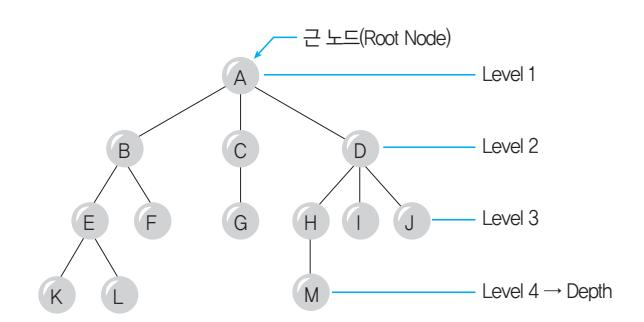

- G H I E F
- 노드(Node) : 트리의 기본 요소로서 자료 항목과 다른 항목에 대한 가지(Branch)를 합친 것
- A, B, C, D, E, F, G, H, I, J, K, L, M
- 근 노드(Root Node) : 트리의 맨 위에 있는 노드 A
- 디그리(Degree, 차수) : 각 노드에서 뻗어나온 가지의 수
- A = 3, B = 2, C = 1, D = 3
- 트리의 디그리 : 노드들의 디그리 중에서 가장 많은 수
- 노드 A나 D가 3개의 디그리를 가지므로 위 트리의 디그리는 3이다.
- 단말 노드(Terminal Node) = 잎 노드(Leaf Node) : 자식이 하나도 없는 노드, 즉 디그리가 0인 노드
- K, L, F, G, M, I, J
- 비단말 노드(Non-Terminal Node) : 자식이 하나라도 있는 노드, 즉 디그리가 0이 아닌 노드
- A, B, C, D, E, H
- 자식 노드(Son Node, Children Node) : 어떤 노드에 연결 된 다음 레벨의 노드들
- D의 자식 노드 : H, I, J
- 부모 노드(Parent Node) : 어떤 노드에 연결된 이전 레벨 의 노드

### 053. 트리(Tree)


- E, F의 부모 노드는 B
- 형제 노드(Brother Node, Sibling) : 동일한 부모를 갖는 노 드들
- H의 형제 노드는 I, J
- Level : 근 노드의 Level을 1로 가정한 후 어떤 Level이 L이면 자식 노드는 L+1이다.
- H의 레벨은 3
- 깊이(Depth, Height) : 어떤 Tree에서 노드가 가질 수 있 는 최대의 레벨
- 위 트리의 깊이는 4

 Preorder는 Root → Left → Right이므로 A13이 된다. 1은 B2E이므로 AB2E3이 된다. 2는 DHI이므로 ABDHIE3이 된다. 3은 CFG이므로 ABDHIECFG가 된다. ∴ 방문 순서 : ABDHIECFG <Inorder 운행법의 방문 순서> Inorder는 Left → Root → Right이므로 1A3이 된다. 1은 2BE이므로 2BEA3이 된다. 2는 HDI이므로 HDIBEA3이 된다. 3은 FCG이므로 HDIBEAFCG가 된다. ∴ 방문 순서 : HDIBEAFCG <Postorder의 방문 순서> Postorder는 Left → Right → Root이므로 13A가 된다. 1은 2EB이므로 2EB3A가 된다. 2는 HID이므로 HIDEB3A가 된다. 3은 FGC이므로 HIDEBFGCA가 된다. ∴ 방문 순서 : HIDEBFGCA

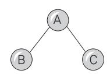

- Preorder(전위) 운행 : Root → Left → Right 순으로 운 행함 A, B, C
- Inorder(중위) 운행 : Left → Root → Right 순으로 운행 함 B, A, C
- Postorder(후위) 운행 : Left → Right → Root 순으로 운행함 B, C, A
- 다음 트리를 Inorder, Preorder, Postorder 방법으 로 운행했을 때 각 노드를 방문한 순서는?

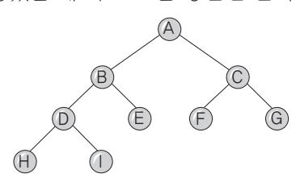

#### <Preorder 운행법의 방문 순서>

 서브 트리를 하나의 노드로 생각할 수 있도록 다음과 같이 서브 트리 단위로 묶는다. Preorder, Inorder, Postorder 모두 공통으로 사용한다. A

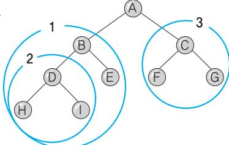

### 054. 핵심 이진 트리의 운행법

### 055. 핵심 수식의 표기법

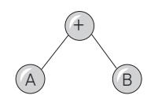

- 전위 표기법(Prefix) : 연산자 → Left → Right, +AB
- 중위 표기법(Infix) : Left → 연산자 → Right, A+B
- 후위 표기법(Postfix) : Left → Right → 연산자, AB+

Infix 표기를 Postfix로 바꾸기

Infix로 표기된 수식에서 연산자를 해당 피연산자 2개의 뒤(오른쪽)에 오도록 이동하면 Postfix가 된다.

X = A / B \* (C + D) + E X A B / C D + \* E + =

➊ 연산 우선순위에 따라 괄호로 묶는다.

( X = ( ( (A / B) \* (C + D) ) + E ) )


➋ 연산자를 해당 괄호의 뒤로 옮긴다.

$$( \mathbf{X} \ ( \ ( \ ( \mathbf{AB} ) \ / \ ( \mathbf{CD} ) \ + ) \ * \ \mathbf{E} \ ) \ + ) =$$

➌ 괄호를 제거한다.

X A B / C D + \* E + =

#### Infix 표기를 Prefix로 바꾸기

Infix로 표기된 수식에서 연산자를 해당 피연산자 2개의 앞(왼쪽)에 오도록 이동하면 Prefix가 된다.

➊ 연산 우선순위에 따라 괄호로 묶는다.

$$(X = (((A / B) * (C + D)) + E))$$

➋ 연산자를 해당 괄호의 앞으로 옮긴다.

$$(X = ((A / B) * (C + D) + E))$$

=(X + ( \* ( / ( A B) + (C D) ) E) )

➌ 괄호를 제거한다.

=X + \* / A B + C D E

#### Postfix 표기를 Infix로 바꾸기

Postfix는 Infix 표기법에서 연산자를 해당 피연산자 2개 의 뒤(오른쪽)로 이동한 것이므로 연산자를 다시 해당 피 연산자 2개의 가운데로 옮기면 된다.

| $A B C - / D E F + * + \rightarrow A / (B - C) + D * (E + F)$ |
|---------------------------------------------------------------|
|---------------------------------------------------------------|

➊ 먼저 인접한 피연산자 2개와 오른쪽의 연산자를 괄호 로 묶는다.

( (A (B C -) /) (D (E F +) \*) + )

➋ 연산자를 해당 피연산자의 가운데로 이동시킨다.

$$((A / (B - C)) + (D * (E + F)))$$

➌ 필요 없는 괄호를 제거한다.

A / (B - C) + D \* (E + F)

파일을 구성하는 각 레코드들을 특정 키 항목을 기준으 로 오름차순(Ascending) 또는 내림차순(Descending)으 로 재배열하는 작업이다.

#### 내부 정렬

- 소량의 데이터를 주기억장치에만 기억시켜서 정렬하 는 방식이다.
- 종류 : 히프 정렬, 삽입 정렬, 셸 정렬, 버블 정렬, 선택 정렬, 퀵 정렬, 2-Way Merge 정렬, 기수 정렬 (=Radix Sort)

#### 외부 정렬

- 대량의 데이터를 보조기억장치에 기억시켜서 정렬하 는 방식으로, 대부분 병합 정렬(Merge Sort) 기법으로 처리한다.
- 종류 : 밸런스 병합 정렬, 캐스케이드 병합 정렬, 폴리 파즈 병합 정렬, 오실레이팅 병합 정렬

### 056. 핵심 정렬(Sort)

$$(X = (((A / B) * (C + D)) + E))$$

#### 삽입 정렬

8, 5, 6, 2, 4를 삽입 정렬로 정렬하시오. 8 5 6 2 4 예제

- 초기 상태 : 8 5 6 2 4 8 5 6 2 4

- 1회전 :

두 번째 값 5를 첫 번째 값과 비교하여 첫 번째 자리에

삽입하고 8을 한 칸 뒤로 이동시킨다.

- 2회전 :

 세 번째 값 6을 첫 번째, 두 번째 값과 비교하여 8자리에 삽입하고 8은 한 칸 뒤로 이동시킨다. 5 6 8 2 4 5 6 8 2 4 2 5 6 8 4 5 8 6 2 4 5 6 8 2 4 5 8 6 2 4 5 6 8 2 4

- 3회전 : 네 번째 값 2를 처음부터 비교하여 맨 처음에 삽입하고 나머지를 한 칸씩 뒤로 이동시킨다. 2 5 6 8 4 2 4 5 6 8 2 5 6 8 4 2 4 5 6 8 2 5 6 8 4 2 4 5 6 8 5 6 8 2 4 2 5 6 8 4 5 6 8 2 4 2 5 6 8 4

- 4회전 :

8 5 6 2 4

5 8 6 2 4

$$((A (B C -) / ) (D (E F +) *) +)$$

5 8 6 2 4

5 8 6 2 4

5 6 8 2 4

5 6 8 2 4

8 5 6 2 4

5 8 6 2 4

5 8 6 2 4

5 8 6 2 4

8 5 6 2 4

5 8 6 2 4

5 8 6 2 4

5 8 6 2 4

5 6 8 2 4

5 6 8 2 4

8 5 6 2 4

8 5 6 2 4

2 5 6 8 4

5 8 6 2 4

8 5 6 2 4

8 5 6 2 4

2 5 6 8 4

5 8 6 2 4

2 4 5 6 8

### 057. 핵심 주요 정렬 알고리즘의 이해


**버블 정렬**

예제 8, 5, 6, 2, 4를 버블 정렬로 정렬하시오.

- 초기 상태 : 

| 8 | 5 | 6 | 2 | 4 |
|---|---|---|---|---|
|---|---|---|---|---|

- 1회전 : 

| 5 | 8 | 6 | 2 | 4 |
|---|---|---|---|---|
|---|---|---|---|---|

 → 

| 5 | 6 | 8 | 2 | 4 |
|---|---|---|---|---|
|---|---|---|---|---|

| 5 | 6 | 2 | 8 | 4 |
|---|---|---|---|---|
|---|---|---|---|---|

 → 

| 5 | 6 | 2 | 4 | 8 |
|---|---|---|---|---|
|---|---|---|---|---|

- 2회전 : 

| 5 | 6 | 2 | 4 | 8 |
|---|---|---|---|---|
|---|---|---|---|---|

 → 

| 5 | 2 | 6 | 4 | 8 |
|---|---|---|---|---|
|---|---|---|---|---|

→ 

| 5 | 2 | 4 | 6 | 8 |
|---|---|---|---|---|
|---|---|---|---|---|

- 3회전 : 

| 2 | 5 | 4 | 6 | 8 |
|---|---|---|---|---|
|---|---|---|---|---|

 → 

| 2 | 4 | 5 | 6 | 8 |
|---|---|---|---|---|
|---|---|---|---|---|

- 4회전 : 

| 2 | 4 | 5 | 6 | 8 |
|---|---|---|---|---|
|---|---|---|---|---|

**선택 정렬**

예제 8, 5, 6, 2, 4를 선택 정렬로 정렬하시오.

- 초기 상태 : 

| 8 | 5 | 6 | 2 | 4 |
|---|---|---|---|---|
|---|---|---|---|---|

- 1회전 : 

| 5 | 8 | 6 | 2 | 4 |
|---|---|---|---|---|
|---|---|---|---|---|

 → 

| 5 | 8 | 6 | 2 | 4 |
|---|---|---|---|---|
|---|---|---|---|---|

→ 

| 2 | 8 | 6 | 5 | 4 |
|---|---|---|---|---|
|---|---|---|---|---|

 → 

| 2 | 8 | 6 | 5 | 4 |
|---|---|---|---|---|
|---|---|---|---|---|

- 2회전 : 

| 2 | 6 | 8 | 5 | 4 |
|---|---|---|---|---|
|---|---|---|---|---|

 → 

| 2 | 5 | 8 | 6 | 4 |
|---|---|---|---|---|
|---|---|---|---|---|

→ 

| 2 | 4 | 8 | 6 | 5 |
|---|---|---|---|---|
|---|---|---|---|---|

- 3회전 : 

| 2 | 4 | 6 | 8 | 5 |
|---|---|---|---|---|
|---|---|---|---|---|

 → 

| 2 | 4 | 5 | 8 | 6 |
|---|---|---|---|---|
|---|---|---|---|---|

- 4회전 : 

| 2 | 4 | 5 | 6 | 8 |
|---|---|---|---|---|
|---|---|---|---|---|

**2-Way 합병 정렬(Merge Sort)**

예제 71, 2, 38, 5, 7, 61, 11, 26, 53, 42를 2-Way 합병 정렬로 정렬하시오.

- 1회전 : 2개씩 묶은 후 각각의 묶음 안에서 정렬합니다.  
(71, 2) (38, 5) (7, 61) (11, 26) (53, 42)

↓  
(2, 71) (5, 38) (7, 61) (11, 26) (42, 53)  
- 2회전 : 묶여진 묶음을 2개씩 묶은 후 각각의 묶음 안에서 정렬합니다.  
((2, 71) (5, 38)) ((7, 61) (11, 26)) (42, 53)  
↓  
(2, 5, 38, 71) (7, 11, 26, 61) (42, 53)  
- 3회전 : 묶여진 묶음을 2개씩 묶은 후 각각의 묶음 안에서 정렬합니다.  
((2, 5, 38, 71) (7, 11, 26, 61)) (42, 53)  
↓  
(2, 5, 7, 11, 26, 38, 61, 71) (42, 53)  
- 4회전 : 묶여진 묶음 2개를 하나로 묶은 후 정렬합니다.  
((2, 5, 7, 11, 26, 38, 61, 71) (42, 53))  
↓  
2, 5, 7, 11, 26, 38, 42, 53, 61, 71

핵심 **058** 이분 검색(이진 검색)

- 제어 검색의 일종인 이분 검색은 반드시 순서화된 파일 이어야 검색할 수 있다.
- 탐색 효율이 좋고 탐색 시간이 적게 소요된다.
- 전체 파일을 두 개의 서브 파일로 분리해 가면서 Key 레코드를 검색하기 때문에 검색회수를 거듭할 때마다 검색 대상이 되는 데이터의 수가 절반으로 줄어든다.
- 찾고자 하는 Key 값을 파일의 중간 레코드 Key 값과 비교하면서 검색한다.
- 중간 레코드 번호(M) :  $\frac{F+L}{2}$  (단, F : 첫 번째 레코드 번호, L : 마지막 레코드 번호)

핵심 **059** 해싱(Hashing)

- Hash Table이라는 기억공간을 할당하고, 해싱 함수 (Hash Function)를 이용하여 레코드 키에 대한 Hash Table 내의 Home Address를 계산한 후 주어진 레코드를 해당 기억장소에 저장하거나 검색 작업을 수행하는 방식이다.


- DAM(직접접근방법) 파일을 구성할 때 해싱이 사용되며, 접근 속도는 빠르지만 기억공간이 많이 요구된다.
- 여러가지 검색 방식 중 검색 속도가 가장 빠르다.
- 삽입, 삭제 작업의 빈도가 많을 때 유리한 방식이다.
- 키-주소 변환 방법이라고도 한다.

#### 해시 테이블(Hash Table)

- 레코드를 1개 이상 보관할 수 있는 Home Bucket들로 구 성한 기억공간으로, 보조기억장치에 구성할 수도 있고 주기억장치에 구성할 수도 있다.

- 버킷(Bucket) : 하나의 주소를 갖는 파일의 한 구역을 의 미하며, 버킷의 크기는 같은 주소에 포함될 수 있는 레코 드 수를 의미함
- 슬롯(Slot) : 1 개의 레코드를 저장할 수 있는 공간으로 n 개의 슬롯이 모여 하나의 버킷을 형성함
- Collision(충돌 현상) : 서로 다른 2개 이상의 레코드가 같 은 주소를 갖는 현상
- Synonym : 같은 Home Address를 갖는 레코드들의 집합
- Overflow -계산된 Home Address의 Bucket 내에 저장할 기억공 간이 없는 상태 -Bucket을 구성하는 Slot이 여러 개일 때는 Collision은 발생해도 Overflow는 발생하지 않을 수 있음

- 입력되는 데이터들을 논리적인 순서에 따라 물리적 연 속 공간에 순차적으로 기록하는 방식이다.
- 급여 관리 등과 같이 변동 사항이 크지 않고 기간별로 일괄 처리를 주로 하는 경우에 적합하다.
- 주로 순차 접근이 가능한 자기 테이프에서 사용된다.

### 060. 핵심 순차 파일(Sequential File) = 순서 파일

#### 순차 파일의 장점

- 기록 밀도가 높아 기억공간을 효율적으로 사용할 수 있다.
- 레코드가 키 순서대로 편성되어 취급이 용이하다.
- 매체 변환이 쉬워 어떠한 매체에도 적용할 수 있다.
- 레코드를 기록할 때 사용한 키 순서대로 레코드를 처리 하는 경우, 다른 편성법보다 처리 속도가 빠르다.

#### 순차 파일의 단점

- 파일에 새로운 레코드를 삽입, 삭제, 수정하는 경우 파 일 전체를 복사해야 하므로 시간이 많이 소요된다.
- 데이터 검색 시 처음부터 순차적으로 하기 때문에 검색 효율이 낮다.

- 순차 처리와 랜덤 처리가 모두 가능하도록 레코드들을 키 값 순으로 정렬(Sort)시켜 기록하고, 레코드의 키 항 목만을 모은 색인을 구성하여 편성하는 방식이다.
- 색인을 이용한 순차적인 접근 방법을 제공하여 ISAM (Index Sequential Access Method)이라고도 한다.
- 레코드를 참조할 때는 색인을 탐색한 후 색인이 가리키 는 포인터(주소)를 사용하여 직접 참조할 수 있다.
- 일반적으로 자기 디스크에 많이 사용되며, 자기 테이프 에서는 사용할 수 없다.

#### 색인 순차 파일의 구성

- 기본 구역(Prime Area) : 실제 레코드들을 기록하는 부분 으로, 각 레코드는 키 값 순으로 저장
- 색인 구역(Index Area) : 기본 구역에 있는 레코드들의 위 치를 찾아가는 색인이 기록되는 부분으로, 트랙 색인 구 역, 실린더 색인 구역, 마스터 색인 구역으로 구분할 수 있음
- 오버플로 구역(Overflow Area) : 기본 구역에 빈 공간이 없 어서 새로운 레코드의 삽입이 불가능할 때를 대비하여 예비적으로 확보해 둔 부분

| 실린더 오버플로          |       |       |       |      |         |
|-------------------|-------|-------|-------|------|---------|
| 각 구역(Cylinder     | 실린더마다 |       | 만들어지는 | 오버플로 | 구역으     |
| 로, Overflow Area) | 해당    | 실린더의  | 기본    | 구역에서 | 오버플로    |
| 된                 | 데이터를  | 기록함   |       |      |         |
| 실린더               |       | 오버플로  | 구역에   | 더 이상 | 오버플로    |
| 된 (Independent    | 데이터를  | 기록할   | 수     | 없을 때 | 사용할 수 있 |
| 는 Overflow Area)  | 예비    | 공간으로, | 실린더   | 오버플로 | 구역과는    |
| 별도로               |       | 만들어짐  |       |      |         |

### 061. 핵심 색인 순차 파일(Indexed Sequential File)


#### 색인 순차 파일의 장점

- 순차 처리와 랜덤 처리가 모두 가능하므로, 목적에 따 라 융통성 있게 처리할 수 있다.
- 효율적인 검색이 가능하고 레코드의 삽입, 삭제, 갱신 이 용이하다.

#### 색인 순차 파일의 단점

- 색인 구역과 오버플로우 구역을 구성하기 위한 추가 기억 공간이 필요하다.
- 파일이 정렬되어 있어야 하므로 추가, 삭제가 많으면 효율이 떨어진다.
- 색인을 이용한 액세스를 하기 때문에 액세스 시간이 랜덤 편성 파일보다 느리다.

## 2과목·전자계산기 구조

### 062. 핵심 불대수의 기본 공식

- 교환법칙 : A+B = B+A, A·B = B·A
- 결합법칙 : A+(B+C) = (A+B)+C, A·(B·C) = (A·B)·C
- 분배법칙 : A·(B+C) = A·B+A·C, A+B·C = (A+B)·(A+C)
- 멱등법칙 : A+A = A, A·A = A
- 보수법칙 : A+A = 1, A·A = 0
- 항등법칙 : A+0 = A, A+1 = 1, A·0 = 0, A·1 = A
- 드모르강 : A+B = (A·B), A·B = (A+B)
- 복원법칙 : A = A

#### 불 대수의 기본 공식 이용하기

❶ 합의 곱((A+B)(C+D)) 표현을 곱의 합(AC+AD+ BC+BD) 표현으로 변환한다. ❷ 공통 인수를 뽑아 묶는다. ❸ 멱등법칙, 보수법칙, 항등법칙 등의 기본 공식 형태로 유도하여 줄여 나간다.

### 063. 핵심 논리식의 간소화

다음 불 함수를 간략화하시오.

- A + A·B = A·(1 + B) = A·1 = A
- A(A + B) = A·A + A·B = A + A·B = A·(1 + B) = A·1 = A
- A <sup>+</sup> A·B ß <sup>=</sup> (A <sup>+</sup> <sup>A</sup>ß)(A <sup>+</sup> B) <sup>=</sup> 1·(A <sup>+</sup> B) <sup>=</sup> <sup>A</sup> <sup>+</sup> <sup>B</sup>
- A(Aß <sup>+</sup> B) <sup>=</sup> A·Aß <sup>+</sup> A·B <sup>=</sup> <sup>0</sup> <sup>+</sup> A·B <sup>=</sup> A·B

#### 다음 불 함수를 간략화하시오.

- Y <sup>=</sup> AB <sup>+</sup> ABß <sup>+</sup> ABß <sup>=</sup> A(B <sup>+</sup> <sup>B</sup>ß  ) <sup>+</sup> ABß <sup>=</sup> A(1) <sup>+</sup> ABß <sup>=</sup> <sup>A</sup> <sup>+</sup> ABß <sup>=</sup> (A <sup>+</sup> A)(A ß <sup>+</sup> B) = 1·(A + B) = A + B

#### 카르노 맵(카르노 도, Karnaugh Map) 이용하기

카르노 맵은 설계된 논리식을 도표로 표현하여 최소화하 는 방법이다. 여기서는 카르노 맵으로 표현된 도표를 간 략화하여 표기하는 방법에 대해서만 알아볼 것이다.

- 카르노 맵은 변수(입력선)의 개수에 따라 표의 크기가 달라지며 칸의 위치에 따라서 각 칸의 불 함수가 정해 진다.

#### <변수가 두 개일 때>

| 00: | 0     |
|-----|-------|
|     | 01: 1 |
| 10: | 2     |
|     | 11: 3 |
| B   | 0     |

#### <변수가 세 개일 때>

| 000: 0 |        |
|--------|--------|
| 001:   | 1      |
| 100: 4 |        |
| 101:   | 5      |
|        | 011: 3 |
|        | 010: 2 |
|        | 111: 7 |
|        | 110: 6 |
| BC 00  |        |

A는 1, B는 0, C는 0이므로 100이 된다. 1은 참, 0은 거짓이므로 ABC가 된다.

A는 1, B는 0, C는 0이므로 100이된다. 1은 참, 0은 거짓이 므로 ABC가 된다. ¬

다음과 같이 표시된 카르노 도를 간략화하시오.


(가) 

| A | B | 0 | 1 |
|---|---|---|---|
|   | 0 | 1 | 1 |
| 1 | 1 |   |   |

(나) 

| A | BC | 00 | 01 | 11 | 10 |
|---|----|----|----|----|----|
|   | 0  | 1  | 1  |    | 1  |
| 1 | 1  |    | 1  | 1  |    |

① 1이 입력되어 이웃하는 칸을 최대 2(1, 2, 4, 8, 16 ...) 개로 묶는다. 한번 묶인 칸이 다른 묶음에 또 묶여도 된다. 1묶음에 묶여지는 칸이 많을수록, 그리고 묶음의 개수가 적을수록 간소화된다.

(가) 

| A | B | 0 | 1 |
|---|---|---|---|
|   | 0 | 1 | 1 |
| 1 | 1 |   |   |

①

(나)

| A | BC | B | C | 00 | 01 | 11 | 10 |
|---|----|---|---|----|----|----|----|
|   | 0  | 1 | 1 |    | 1  | 1  | 1  |
| 1 | 1  |   |   | 1  | 1  |    |    |

① 3번 묶음이 B에는 0만 해당되고 C에는 0과 1 모두에 해당된다. A에는 0만 해당된다.

③번 묶음이 B에는 0만 해당되고 C에는 0과 1 모두에 해당된다. A에는 0만 해당된다.

※ (나)의 ③번 묶음은 앞의 두 개와 맨 뒤의 두 개를 합쳐 네 개를 한 묶음으로 묶은 것이다.

② 묶여진 묶음을 한 개로 간주하고 불 함수를 읽는다. 한 개의 묶음에 속하는 변수들은 AND 연산시키고, 다른 묶음과는 OR 연산시킨다. 묶음이 0과 1에 모두 속해 있는 변수는 0과 1 아무거나 입력되어도 상관없는 것이므로 무시한다.

(가) ①번 묶음이 변수 A에 대해서는 0, 1 모두에 속하므로 무시하고, 변수 B에 대해서는 0에만 해당되는데, 0은 부정이므로 ①번 묶음은  $\bar{B}$ 가 된다. ②번 묶음은 변수 B에 대해서는 0, 1 모두에 속하므로 무시하고, 변수 A에 대해서는 0에만 해당되므로 ②번 묶음은  $\bar{A}$ 가 된다. 결과는 ① + ②이므로  $\bar{A} + \bar{B}$ 가 된다.

(나) ③번 묶음이 변수 A에 대해서는 0, 1에 모두 속하므로 무시하고, 변수 B에 대해서도 0, 1에 모두 속하므로 무시한다. 하지만 변수 C에 대해서는 0에만 속하므로 ③번 묶음은  $\bar{C}$ 가 된다. ④번 묶음은 변수 A에 대해서는 1에만 속하므로 A, 변수 B에 대해서도 1에만 속하므로 B, 변수 C에 대해서는 0, 1 모두에 속하므로 무시한다. 그러므로 ④번 묶음은 AB이다. ⑤번

묶음은 변수 A에 대해서는 0에만 속하므로  $\bar{A}$ , 변수 B에 대해서도 0에만 속하므로  $\bar{B}$ , 변수 C에 대해서는 0, 1 모두에 속하므로 무시한다. 그러므로 ⑤번 묶음은  $\bar{A} \cdot \bar{B}$ 이다. 결과는 ③ + ④ + ⑤이므로  $\bar{C} + AB + \bar{A} \bar{B}$ 가 된다.

핵심 064 논리 게이트

| 게이트    | 기호                                | 의미                               | 진리표                                                                                                               | 논리식                                                              |
|--------|-----------------------------------|----------------------------------|-------------------------------------------------------------------------------------------------------------------|------------------------------------------------------------------|
| AND    | A $\rightarrow$ B $\rightarrow$ Y | 입력신호가 모두 1일 때 1 출력               | $\begin{array}{ccc c} A & B & Y & \\ \hline 0 & 0 & 0 & \\ 0 & 1 & 0 & \\ 1 & 0 & 0 & \\ 1 & 1 & 1 & \end{array}$ | $Y = A \cdot B$<br>$Y = AB$                                      |
| OR     | A $\rightarrow$ B $\rightarrow$ Y | 입력신호 중 1개만 10이어 도 1 출력           | $\begin{array}{ccc c} A & B & Y & \\ \hline 0 & 0 & 0 & \\ 0 & 1 & 1 & \\ 1 & 0 & 1 & \\ 1 & 1 & 1 & \end{array}$ | $Y = A + B$                                                      |
| NOT    | A $\rightarrow$ $\neg$ Y          | 입력된 정보를 반대로 변환하여 출력              | $\begin{array}{cc c} A & Y & \\ \hline 0 & 1 & \\ 1 & 0 & \end{array}$                                            | $Y = A'$<br>$Y = \bar{A}$                                        |
| BUFFER | A $\rightarrow$ $\neg$ Y          | 입력된 정보를 그대로 출력                   | $\begin{array}{cc c} A & Y & \\ \hline 0 & 0 & \\ 1 & 1 & \end{array}$                                            | $Y = A$                                                          |
| NAND   | A $\rightarrow$ B $\rightarrow$ Y | NOT + AND, 즉 AND의 부정             | $\begin{array}{ccc c} A & B & Y & \\ \hline 0 & 0 & 1 & \\ 0 & 1 & 1 & \\ 1 & 0 & 1 & \\ 1 & 1 & 0 & \end{array}$ | $Y = A \cdot B$<br>$Y = \bar{A}B$                                |
| NOR    | A $\rightarrow$ B $\rightarrow$ Y | NOT + OR, 즉 OR의 부정               | $\begin{array}{ccc c} A & B & Y & \\ \hline 0 & 0 & 1 & \\ 0 & 1 & 0 & \\ 1 & 0 & 0 & \\ 1 & 1 & 0 & \end{array}$ | $Y = \bar{A} + B$                                                |
| XOR    | A $\rightarrow$ B $\rightarrow$ Y | 입력되는 것이 모두 같으면 0, 한 개라도 다르면 1 출력 | $\begin{array}{ccc c} A & B & Y & \\ \hline 0 & 0 & 1 & \\ 0 & 1 & 1 & \\ 1 & 0 & 1 & \\ 1 & 1 & 0 & \end{array}$ | $Y = A \oplus B$<br>$Y = \bar{A}B + A\bar{B}$                    |
| XNOR   | A $\rightarrow$ B $\rightarrow$ Y | NOT + XOR, 즉 XOR의 부정             | $\begin{array}{ccc c} A & B & Y & \\ \hline 0 & 0 & 1 & \\ 0 & 1 & 0 & \\ 1 & 0 & 0 & \\ 1 & 1 & 1 & \end{array}$ | $Y = A \cdot B$<br>$Y = \bar{A} \oplus B$<br>$Y = AB + A\bar{B}$ |


다음 논리회로를 논리식으로 표현하시오.

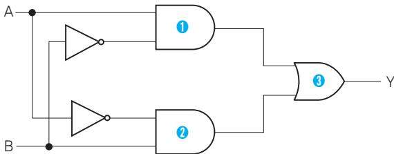

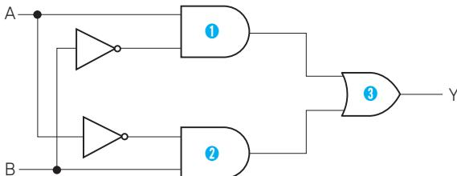

각각의 논리 게이트를 분리하여 논리식으로 표현한 후 한 개의 논리 식으로 합쳐나간다.

<sup>➊</sup> A·Bß <sup>➋</sup> A·B ß <sup>➌</sup> ➊+➋=  A·Bß  +  ßA·B  =  A  ⊕  B 그러므로 위의 논리회로는 오른쪽과 같은 XOR 회로로 간략하게 표현할 수 있다. A Y B

### 065. 핵심 논리회로의 이해

다음 논리식을 논리회로로 표현하시오.

A B+BC +(A+C)

AND 연산에 해당하는 논리식을 논리 게이트로 표현한 후 각각의 출 력을 OR 게이트의 입력으로 표현한다. <sup>➊</sup> A·B ß

<sup>➋</sup> B·Cß ➌ A+C ➍ ➊  +  ➋  +  ➌

➊ ➌

➋

A B

C

➍

B C

A B

➊ ➌

C

A B

A

➊ ➌

A 12.8, 12.5, 08.5, 07.5, 05.3, 04.3

### B ➍ **066** 핵심 반가산기(HA; Half Adder)

C 1Bit짜리 2진수 2개를 덧셈한 합(S)과 자리올림 수(C)를 구하는 회로이다.

A C

➊ ➌

➋

B

B C

A

진리표

| A | B | Sum | Carry |
|---|---|-----|-------|
| 0 | 0 | 0   | 0     |
| 0 | 1 | 1   | 0     |
| 1 | 0 | 1   | 0     |
| 1 | 1 | 0   | 1     |

### 067. 핵심 전가산기(FA; Full Adder)

논리식

Carry = A·B Sum= A·B + A·B = A⊕`B

논리회로

<sup>A</sup> Sum Carry B 1 1 1 자리올림 수(Ci)를 포함하여 1Bit 크기의 2진수 3자리를 더 하여 합(Sum)과 자리올림 수(Carry)를 구하는 회로이다.

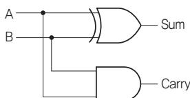

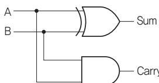

진리표

| A | B | Ci | Sum | Ci+1 |
|---|---|----|-----|------|
| 0 | 0 | 0  | 0   | 0    |
| 0 | 0 | 1  | 1   | 0    |
| 0 | 1 | 0  | 1   | 0    |
| 0 | 1 | 1  | 0   | 1    |
| 1 | 0 | 0  | 1   | 0    |
| 1 | 0 | 1  | 0   | 1    |
| 1 | 1 | 0  | 0   | 1    |
| 1 | 1 | 1  | 1   | 1    |

논리식

- 합계(Sum) = (A`⊕```B) ⊕ Ci
- 자리올림(Carry) = (A`⊕```B)Ci+ AB

회로

전가산기는 2개의 반가산기(HA)와 1개의 OR Gate로 구성된다.

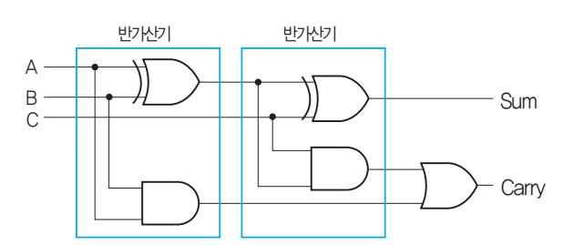


### 068. 핵심 디코더(Decoder)

- n Bit의 Code화된 정보를 그 Code의 각 Bit 조합에 따라 2n 개의 출력으로 번역하는 회로이다.
- 명령어의 명령부나 번지를 해독할 때 사용하며, 주로 AND 게이트로 구성된다.

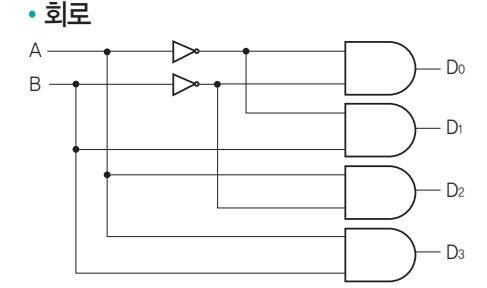

- 플립플롭은 전원이 공급되고 있는 한, 상태의 변화를 위한 신호가 발생할 때까지 현재의 상태를 그대로 유지 하는 논리회로이다.
- 플립플롭 1개가 1Bit를 구성하는 2진 셀(Binary Cell) 이 된다.
- 반도체 기억장치에서 2진수 1자리값을 기억하는 메모 리 소자이다.
- 플립플롭은 레지스터를 구성하는 기본 소자이다.
- 기본적인 플립플롭은 2개의 NAND 또는 NOR 게이트 를 이용하여 구성한다.

| 플립플롭 |         |        | 특 징     |                |               |
|------|---------|--------|---------|----------------|---------------|
|      | 플립플롭의   | 기본으로,  | S와      | R선의 입력을        | 조절하여 임의       |
| 의    | Bit 값을  | 그대로    | 유지시키거나, |                | 무조건 0 또는 1의 값 |
| 을    | 기억시키기   | 위해서    | 사용      |                |               |
| •RS | FF에서    | S=R=1일 | 때       | 동작되지           | 않는 결점을 보완     |
| 한    | 플립플롭    |        |         |                |               |
| •RS | FF의     | 입력선    | S와 R을   | JK FF의         | 입력선 J와 K로 사   |
| •모든  | 플립플롭의   |        | 기능을     | 포함함            |               |
| •RS | FF의     | R선에    |         | 인버터(Inverter)를 | 추가하여 S선과      |
|      | 하나로 묶어서 |        | 입력선을    | 하나만 구성한        | 플립플롭          |
|      | •입력하는   | 값을 그대로 | 저장하는    | 기능을            | 수행함           |

#### 특성 표

| S | R    | Q(T+1)    |   | 암기   |                       |
|---|------|-----------|---|------|-----------------------|
| 0 | 0    | Q(T)      | 무 | (상태  | 변화 없음)                |
| 0 | 1    | 0         | 공 | (항상  | 0)                    |
| 1 | 0    | 1         | 일 | (항상  | 1)                    |
| 1 | 1 동작 | 안됨        | 불 | (불가) |                       |
|   |      |           |   |      | J K Q(T+1) 암기         |
|   |      |           |   |      | 0 0 Q(T) 무 (상태 변화 없음) |
|   |      |           |   |      | 0 1 0 공 (항상 0)        |
|   |      |           |   |      | 1 0 1 일 (항상 1)        |
|   |      |           |   |      | 1 1 보수 보 (보수)         |
|   |      | <RS 플립플롭> |   |      | <JK 플립플롭>             |

### 069. 플립플롭

핵심 14.8, 14.5, 12.8, 12.3, 11.3, 10.5, 10.3, 08.9, 08.3, 06.5, 06.3, 05.5, 04.9, 03.5, 02.9, 02.5, 00.7, 99.4

| •JK   | FF의 두         | 입력선을   | 묶어서   | 한 개의           | 입력선으로  | 구성     |
|--------|---------------|--------|-------|----------------|--------|--------|
| 한      | 플립플롭          |        |       |                |        |        |
| •T=0인 | 경우는           | 변화가    | 없고,   | T=1인           | 경우에    | 현재의 상태 |
| 를      | 토글(Toggle)시킴. |        | 즉 원   | 상태와            | 보수 상태의 | 2가지    |
| 상태로만   |               | 서로 전환됨 |       |                |        |        |
| •출력   | 측의            | 일부가    | 입력 측에 | 궤환(FeedBack)되어 |        | 유      |
| 발되는    | 레이스           | 현상을    | 없애기   | 위해             | 고안된    | 플립플롭   |
| •2개의  | 플립플롭으로        |        | 구성되는  | 데,             | 한쪽 회로가 | 마스터    |
| 이고     | 다른            | 한쪽이    | 슬레이브의 | 위치에            | 있어     | 마스터-슬  |
| 레이브    | 플립플롭이라        |        | 함     |                |        |        |

| D | <D 플립플롭> Q(t+1) | T | <T 플립플롭> Q(t+1) |
|---|-----------------|---|-----------------|
| 0 | 0               |   |                 |
| 1 | 1               |   |                 |
|   |                 | 0 | Q(t)            |
|   |                 | 1 | Q(t)            |

JK 플립플롭은 J와 K에 모두 1이 입력될 때 보수가 출력 되는 것이 RS 플립플롭과 다릅니다. 잠깐만요 !

### 070. 핵심 자료 구성의 단위

|               | •자료(정보) 표현의       | 최소      | 단위                |
|---------------|-------------------|---------|-------------------|
| •2가지          | 상태(0과             | 1)를     | 표시하는 2진수 1자리      |
| •nBit를        | 이용하여              | 2n      |                   |
|               |                   | 가지를     | 표현할 수 있음          |
| •4개의          | 비트(Bit)가          | 모여      | 1개의 Nibble을 구성함   |
|               | •4비트로 구성되며       | 16진수    | 1자리를 표현하기에        |
| •문자를         | 표현하는              | 최소      | 단위로, 8개의 비트(Bit)가 |
| 모여            | 1Byte를            | 구성함     |                   |
| •1Byte는       | 256(28            |         |                   |
|               |                   | )가지의    | 정보를 표현할 수 있음      |
| •주소           | 지정의               | 단위로 사용  |                   |
| •CPU가         | 한 번에              | 처리할     | 수 있는 명령 단위        |
|               | 반워드(Half Word)    | :       | 2Byte             |
|               | 풀워드(Full Word)    | : 4Byte |                   |
| •            | 더블워드(Double Word) |         | : 8Byte           |
| 필드(Field) •파일 | 구성의               | 최소 단위   |                   |
| •의미           | 있는 정보를            | 표현하는    | 최소 단위             |


| •하나           | 이상의    | 관련된            | 필드가          | 모여서      | 구성됨         |
|---------------|--------|----------------|--------------|----------|-------------|
| •컴퓨터         | 내부의    | 자료             | 처리           | 단위로서,    | 일반적으로       |
| 레코드는          |        | 논리 레코드(Logical |              | Record)를 | 의미함         |
| •하나           | 이상의    | 논리             | 레코드가         | 모여서      | 구성됨         |
| •각종          | 저장     | 매체와의           | 입·출력         | 단위를      | 의미하며,       |
| 일반적으로         |        | 물리             | 레코드(Physical |          | Record)라고 함 |
| 파일(File) 프로그램 | 구성의    | 기본             | 단위로,         | 여러       | 레코드가 모      |
| 여서            | 구성됨    |                |              |          |             |
| (Database) 여러 | 개의 관련된 | 파일(File)의      |              | 집합       |             |

#### 10진수를 2진수, 8진수, 16진수로 변환

- 정수 부분 : 10진수의 값을 변환할 진수로 나누어 더 이 상 나눠지지 않을 때까지 나누고, 나머지를 역순으로 표시함
- 소수 부분 : 10진수의 값에 변환할 진수를 곱한 후 결과 의 정수 부분만을 차례대로 표기하되, 소수 부분이 0 또는 반복되는 수가 나올 때까지 곱하기를 반복함

(47.625)10를 2진수, 8진수, 16진수로 변환하기

#### <정수 부분>

#### <소수 부분>

|   | 2진수                | 8진수 16진수                       |
|---|--------------------|--------------------------------|
|   | (47)10 = (101111)2 | (47)10 = (57)8 (47)10 = (2F)16 |
| 2 | 47                 |                                |
| 2 | 23                 | 1                              |
| 2 | 11                 | 1                              |
| 2 | 5                  | 1                              |
| 2 | 2                  | 1                              |
|   | 1                  | … 0                            |

| 2진수                        | 8진수                  | 16진수                          |
|----------------------------|----------------------|-------------------------------|
| (47.625)10 → (101111.101)2 |                      |                               |
| (0.625)10 = (0.101)2       | (0.625)10 = (0.5)8   |                               |
|                            | (47.625)10 → (57.5)8 | (47.625)10 → (2F.A)16         |
|                            | × 8                  |                               |
|                            |                      | × 16                          |
| 0.625 0.250 0.5            |                      |                               |
| × 2 × 2 × 2                |                      |                               |
| 1.250 0.5 1.0              |                      | 10(A).000 (0.625)10 = (0.A)16 |

### 071. 핵심 진법 변환

#### 2진수, 8진수, 16진수를 10진수로 변환

정수 부분과 소수 부분의 각 자리를 분리하여 변환하려 는 각 진수의 자리값과 자리의 지수 승을 곱한 결과값을 모두 더하여 계산한다.

#### (101111.101)2를 10진수로 변환하기

| ( 1 `0 ``1 `` 1 ``1 1 .        | ` 1 0 `1 )2       |
|--------------------------------|-------------------|
| × × × × × `×                   | ` `× ``× ×        |
| = 25                           |                   |
| 20                             | 2-1 2-2 2-3       |
| = 32 + 0 + `8 + `4 `+ `2 + 1 . | 0.5 `+ `0 + 0.125 |

#### (57.5)8를 10진수로 변환하기

 (5 7 . `5)8 × × × = 81 ``` 80 . 8-1 = 40 + 7 . 0.625 = 47.625

#### (4F.2)16를 10진수로 변환하기

 ( 4 F . 2 )16 × × ×

= 161

+ 160

. 16-1

= 64 + 15 ``` . 0.125

= 79.125

#### 2진수, 8진수, 16진수 상호 변환

- 2진수를 8진수로 : 정수 부분은 소수점을 기준으로 왼 쪽 방향으로 3자리씩, 소수 부분은 소수점을 기준으로 오른쪽 방향으로 3자리씩 묶어서 변환함
- 2진수를 16진수로 : 정수 부분은 소수점을 기준으로 왼쪽 방향으로 4자리씩, 소수 부분은 소수점을 기준으로 오 른쪽 방향으로 4자리씩 묶어서 변환함
- 8진수, 16진수를 2진수로 : 8진수 1자리는 2진수 3비트로, 16진수 1자리는 2진수 4비트로 풀어서 변환함
- 8진수를 16진수로 : 8진수를 2진수로 변환한 뒤 2진수 를 16진수로 변환함
- 16진수를 8진수로 : 16진수를 2진수로 변환한 뒤 2진 수를 8진수로 변환함


### 072. 핵심 보수

컴퓨터가 기본적으로 수행하는 덧셈 회로를 이용하여 뺄 셈을 수행하기 위해 사용한다.

| •10진법에는 |        | 10의 보수가 있고, 2진법에는 2의 보수           |
|----------|--------|-----------------------------------|
| 가        | 있음     |                                   |
| •보수를    | 구할     | 숫자의 자릿수만큼 0을 채우고 가장               |
| 왼쪽에      | 1을     | 추가하여 기준을 만듦                       |
|  33의    | 10의    | 보수는?                              |
| 33       | + X =  | 100 → X = 100 33 → X = 67         |
|         | 10101의 | 2의 보수는?                           |
| 10101   | +      | X = 100000 → X = 100000 10101 → X |
| =        | 01011  |                                   |
| •10진법에는 |        | 9의 보수가 있고, 2진법에는 1의 보수가           |
| •10진수   | N에     | 대한 9의 보수는 주어진 숫자의 자릿수             |
| 만큼       | 9를     | 채워 기준을 만듦                         |
|  33의    | 9의     | 보수는?                              |
| 33       | + X    | = 99 → X = 99 33 → X = 66         |
| •2진수    | N에     | 대한 1의 보수는 주어진 숫자의 자릿수             |
| 만큼       | 1을     | 채워 기준을 만듦                         |
|         | 10101의 | 1의 보수는?                           |
| 10101    | + X    | = 11111 → X = 11111 10101 → X     |
| =        | 01010  |                                   |

- 정수값을 2진수로 변환하여 표현하는 방식이다.
- 표현할 수 있는 범위는 작지만 연산 속도가 빠르다.
- n Bit 크기의 워드가 있을 때 맨 처음 1 Bit는 부호 (Sign) 비트로 사용되고 나머지 n-1 Bit에 2진수로 표 현된 정수값이 저장된다.
- 양수 : 부호 비트에 0을 넣고, 변환된 2진수 값을 Data Bit의 오른쪽에서 왼쪽 순으로 차례로 채우고 남는 자 리에 0을 채움
- 음수 : 음수를 표현할 때는 다음과 같은 3가지 방법을 사용함

| 종 류                | 표현 방법 | 비 고        |
|--------------------|-------|------------|
| 부호화 절대치법           |       |            |
| (Signed Magnitude) |       |            |
| 양수                 | 표현에   | 대하여        |
| 부호                 | Bit의  | 값만 0을      |
| 1로                 | 바꿈    | 두 가지 형태의 0 |
| 부호화 1의 보수법         |       | 존재(+0, -0) |
| (Signed 1's        |       |            |
| 양수                 | 표현에   | 대하여        |
| 1의                 | 보수를   | 취함         |

#### 표현 범위

| 종류         | 범위                                          | n=8         | n=16            | n=32                                    |
|------------|---------------------------------------------|-------------|-----------------|-----------------------------------------|
| 부호화 절대치법   | −2 <sup>n+1</sup> +1 ~ +2 <sup>n+1</sup> −1 | −127 ~ +127 | −32767 ~ +32767 | −2 <sup>3</sup> +1 ~ +2 <sup>3</sup> −1 |
| 부호화 1의 보수법 |                                             |             |                 |                                         |
| 부호화 2의 보수법 | −2 <sup>n+1</sup> ~ +2 <sup>n+1</sup> −1    | −128 ~ +127 | −32768 ~ +32767 | −2 <sup>3</sup> ~ +2 <sup>3</sup> −1    |

### 073. 핵심 2진 연산

| 부호화 2의 보수법  |     |             |
|-------------|-----|-------------|
| (Signed 2's |     |             |
| 양수          | 표현에 | 대하여         |
| 2의          | 보수를 | 취함          |
|             |     | 한 가지 형태의 0만 |

### 074. 핵심 부동 소수점 표현

#### 2의 보수 표현법이 널리 사용되는 이유 잠깐만요 !

- 2의 보수 표현법은 1의 보수 표현법에 비해 음수 표현 시 숫자 1개 를 더 표현할 수 있습니다.
- 2의 보수 표현법에서는 연산 시 자리올림(Carry)이 발생하면 무시 하므로 1의 보수 표현에 비해 연산이 간단합니다.
- 2의 보수 표현법에서는 0이 하나만 존재하므로 0의 판단이 쉽습니다.

부동 소수점 방식은 소수점이 포함된 실수 데이터의 표 현과 연산에 사용하는 방식이다.

#### 부동 소수점 방식의 특징

- 고정 소수점 방식으로 표현하는 것보다 매우 큰 수나 작 은 수, 매우 정밀한 수를 적은 비트로 표현할 수 있다.
- 과학이나 공학 또는 수학적인 응용에 주로 사용된다.
- 고정 소수점 방식에 비해 연산 시간이 많이 걸린다.
- 지수부와 가수부를 분리하는 정규화 과정이 필요하다.
- 4Byte를 사용하는 단정도와 가수부를 4Byte 추가하여 좀 더 정밀하게 표현할 수 있는 8Byte 배정도 표현법 이 있다.

- 표현 범위 : ±16-64~±1663

#### 부동 소수점 수의 연산 방법

- 덧셈, 뺄셈

➊ 0인지의 여부를 조사한다. ➋ 가수의 위치 조정 : 두 자료의 지수를 비교한 후 소 수점의 위치를 이동하여 지수가 큰 쪽에 맞춘다.

| 0  | 1   | 78  | 3BD |  |
|----|-----|-----|-----|--|
| 보호 | 지수부 | 가수부 |     |  |


 가수부 값끼리 더하거나 뺀다. 결과를 정규화한다.
- 곱셈 0인지의 여부를 조사한다. 지수를 더한다. ➌ 가수를 곱한다. 결과를 정규화한다.
- 나눗셈 0인지의 여부를 조사한다. 부호를 결정한다. 피제수가 제수보다 작게 피제수의 위치를 조정한다. 지수의 뺄셈을 한다. 가수의 나눗셈을 한다.

| •10진수 1자리의 수를 2진수 4Bit로     | 표현함       |
|-----------------------------|-----------|
| •4Bit의 2진수 각 Bit가 8(23     |           |
| ), 4(22                     |           |
| ),                          | 2(21      |
|                             | ), 1(20   |
|                             | )의 자리     |
| 값을 가지므로 8421 코드라고도          | 함         |
| •대표적인 가중치 코드               |           |
| •문자 코드인 BCD에서 Zone 부분을     | 생략한 형태임   |
| •10진수 입·출력이 간편함            |           |
| •BCD + 3, 즉 BCD 코드에 3을 더하여 | 만든 코드임    |
| •대표적인 자보수 코드이며, 비가중치       | 코드임       |
| •BCD 코드의 인접하는 비트를 X-OR     | 연산하여 만    |
| 든 코드                        |           |
| •입·출력장치, A/D 변환기, 주변장치     | 등에서 숫자    |
| 를 표현할 때 사용                  |           |
| •1Bit만 변화시켜 다음 수치로 증가시키기   | 때문에       |
| 하드웨어적인 오류가 적음               |           |
| •코드의 오류를 검사하기 위해서          | 데이터 비트 외에 |
| 1Bit의 패리티 체크 비트를 추가하는       | 것으로 1Bit의 |
| 오류만 검출할 수 있음                |           |
| Odd Parity : 코드에서 1인 Bit의   | 수가 홀수가 되  |
| 도록 0이나 1을 추가함               |           |
| Even Parity : 코드에서 1인 Bit의  | 수가 짝수가 되  |
| 도록 0이나 1을 추가함               |           |
| •오류를 스스로 검출하여 교정이          | 가능한 코드    |
| •1Bit의 오류만 교정할 수 있음        |           |
| •데이터 비트 외에 에러 검출 및         | 교정을 위한 잉여 |
| 비트가 많이 필요함                  |           |

### 075. 핵심 자료 표현 코드

오류 검출용 코드 해밍 코드, 패리티 검사 코드, Biquinary, Ring-Counter, 2-out-of-5, 3-out-of-5 잠깐만요 !

해밍 코드
- 해밍 코드 중 1, 2, 4, 8, <sup>16</sup> …… 2n 번째 비트는 <sup>오</sup> 류 검출을 위한 패리티 비트임

- 해밍 코드 중 1, 2, 4, 8, 16 …… 2n 번째 비트는 오류

검출을 위한 패리티 비트이다.

- n번 째의 패리티 비트는 n번째 비트에서 시작하여 n개 의 비트를 포함하고, n개의 비트를 건너뛴 비트들을 대 상으로 패리티 비트를 결정한다.

다음은 해밍 코드로 구성된 데이터이다. 패리티 비트 를 표시하시오.

1 0 1 1 0 1 1

BCD 코드 1011에 대한 해밍 코드를 구하시오(짝수 패리티 이용).

➊ 4비트 이므로 패리티 비트가 들어갈 자리인 1, 2, 4번 째 자리를 비운 나머지 자리에 4비트를 적는다.

1 2 3 4 5 6 7 H H 1 H 0 1 1

➋ 1번 비트는 3, 5, 7번 비트를 이용하여 1인 비트의 수

가 짝수가 되도록 한다.

1 2 3 4 5 6 7 0 H 1 H 0 1 1

3, 5, 7번 비트의 1의 개수는 짝수이므로 1번 비트를 0으로 하여 1, 3, 5, 7 번 비트의 1의 개수가 짝수가 되게 한다.

➌ 2번 비트는 3, 6, 7번 비트를 이용하여 1인 비트의 수

가 짝수가 되도록 한다.

1 2 3 4 5 6 7 0 1 1 H 0 1 1

3, 6, 7번 비트의 1의 개수는 홀수이므로 2번 비트를 1로 하여 2, 3, 6, 7번 비트의 1의 개수가 짝수가 되게 한다.

➍ 4번 비트는 5, 6, 7번 비트를 이용하여 1의 비트의 수

가 짝수가 되도록 한다.

패리티 비트

### 076. 핵심 해밍 코드의 오류 검출


#### 1 2 3 4 5 6 7

#### 0 1 1 0 0 1 1

5, 6, 7 번 비트의 1의 개수는 짝수이므로 4번 비트를 0으로 하여 4, 5, 6, 7번 비트의 1의 개수가 짝수가 되게 한다.

#### 2진수를 Gray Code로 변환하는 방법

- ➊ 첫 번째 그레이 비트는 2진수의 첫 번째 비트를 그대 로 내려쓴다. ➋ 두 번째 그레이 비트부터는 변경할 2진수의 해당 번째 비트와 그 왼쪽의 비트를 XOR 연산하여 쓴다.
- 2진수 1001을 Gray Code로 변환하시오.

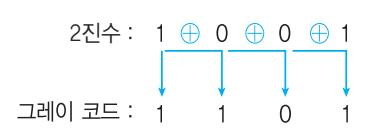

#### Gray Code를 2진수로 변환하는 방법

➊ 첫 번째 2진수 비트는 그레이 코드의 첫 번째 비트를

그대로 내려쓴다.

➋ 두 번째 2진수 비트부터는 왼쪽에 구해 놓은 2진수 비 트와 변경할 해당 번째 그레이 비트를 XOR 연산하여

쓴다.

Gray Code 1001을 2진수로 변환하시오.

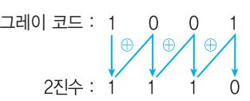

### 077. 핵심 그레이 코드 변환

#### 오류 검출을 위한 패리티 비트 결정하는 방법 잠깐만요 !

n번 패리티 비트를 결정하기 위해서는 n비트만큼을 포함하고, n비트 씩 건너뛴 비트들을 대상으로 패리티 비트를 결정합니다. 즉 1번 패 리티 비트를 결정하기 위해서는 1비트만큼을 포함하고 1비트씩 건너 뛴 1, 3, 5, 7, … 비트가 대상이 됩니다. 2번 비트를 결정하기 위해서 는 2비트만큼을 포함하고 2비트씩 건너뛴 2, 3, 6, 7, 10, 11, … 비트를 이용하고, 4번 비트를 결정하기 위해서는 4비트만큼을 포함하고 4비 트씩 건너뛴 4, 5, 6, 7, 12, 13, 14, 15, … 비트를 이용합니다.

### 078. 핵심 중앙처리장치의 구성 요소

제어 장치

- 컴퓨터에 있는 모든 장치들의 동작을 지시하고 제어하는 장치
- 주기억장치에서 읽어 들인 명령어를 해독하여 해당하는 장 치에게 제어 신호를 보내 정확하게 수행하도록 지시함
- 제어장치의 구성 요소
  - 명령 레지스터 : 현재 실행중인 명령어의 내용을 기억하 고 있는 레지스터
  - 명령 해독기(Decoder) : 명령 레지스터에 있는 명령어를 해독하는 회로
  - 제어신호 발생기, 부호기(Encoder) : 해독된 명령에 따라 각 장치로 보낼 제어 신호를 생성하는 회로
  - 제어 주소 레지스터(CAR) : 다음에 실행할 마이크로 명령 어의 주소를 저장하는 레지스터로, Mapping의 결과값, 주소 필드, 서브루틴 레지스터의 내용들이 적재되어 있음
  - 제어 버퍼 레지스터(CBR) : 제어 기억장치로부터 읽혀진 마이크로 명령어 비트들을 일시적으로 저장하는 레지스터
  - 제어 기억장치 : 마이크로 명령어들로 이루어진 마이크로 프로그램을 저장하는 내부 기억장치
  - 순서 제어 모듈 : 마이크로 명령어의 실행 순서를 결정하 는 회로들의 집합
- 순차 카운터(Sequence Counter) : 디코더에 의해 선택된 번호에 해당하는 타이밍 신호를 생성
- 제어장치에 입력되는 항목 : 명령어 레지스터, 플래그, 클록

연산 장치
- 제어장치의 명령에 따라 실제로 연산을 수행하는 장치
- 산술연산, 논리연산, 관계연산, 이동(Shift) 등의 연산을 수

행함

- 가산기, 누산기(AC; Accumulator), 보수기, 데이터 레지스 터, 오버플로 검출기, Shift Registe r 등으로 구성되어

있음

레지 스터
- CPU 내부에서 처리할 명령어나 연산의 중간 결과값 등을

일시적으로 기억하는 임시 기억장소

- 플립플롭(Flip-Flop)이나 래치(Latch)들을 병렬로 연결하여

구성함

- 메모리 중에서 가장 속도가 빠름

- 레지스터의 크기는 워드를 구성하는 비트 개수만큼의 플립 플롭으로 구성되며, 여러 개의 플립플롭은 공통 클록의 입

력에 의해 동시에 여러 비트의 자료가 저장됨

- 레지스터를 구성하는 플립플롭은 저장하는 값을 임의로 설 정하기 위해 별도의 입력 단자를 추가할 수 있으며, 저장값

을 0으로 하는 것을 설정해제(CLR)라 함

- 레지스터 간의 자료 전송

- 직렬 전송 : 직렬 시프트 마이크로 오퍼레이션을 뜻하며,

병렬 전송에 비해 전송속도가 느림

- 병렬 전송 : 하나의 클록 펄스 동안에 레지스터 내의 모든

비트, 즉 워드가 동시에 전송되는 전송 방식

- 버스 전송 : 모든 레지스터들이 공통으로 이용하는 경로 로, 병렬 전송에 비해 결선의 수를 줄일 수 있다는 장점

이 있음


|                  | 레지스터 기 능                 |
|------------------|--------------------------|
| 프로그램             | 카운터,                     |
| 프로그램             | 계수기                      |
| (PC;             | Program Counter)         |
|                  | •다음 번에 실행할 명령어의 번지를     |
|                  | 기억하는 레지스터                |
|                  | •분기 명령이 실행되는 경우 그       |
|                  | 목적지 주소로 갱신된다.            |
| 명령               | 레지스터                     |
| (IR; Instruction | Register)                |
|                  | 현재 실행중인 명령의 내용을 기억하      |
|                  | 는 레지스터                   |
| (AC;             | Accumulator)             |
|                  | 연산된 결과를 일시적으로 저장하는       |
|                  | 레지스터로 연산의 중심임            |
| •상태             | 레지스터(Status              |
| •PSWR(Program   | Status                   |
| Word             | Register)                |
| •플래그            | 레지스터                     |
|                  | •시스템 내부의 순간순간의 상태가      |
|                  | 기록된 정보를 PSW라고 함          |
|                  | •오버플로, 언더플로, 자리올림, 계산   |
|                  | 상태(0, -, +), 인터럽트 등의 PSW |
|                  | 를 저장하고 있는 레지스터           |
| 메모리              | 주소 레지스터                  |
| (MAR;            | Memory                   |
| Address          | Register)                |
|                  | 기억장치를 출입하는 데이터의 번지       |
|                  | 를 기억하는 레지스터              |
| 메모리              | 버퍼 레지스터(MBR;             |
| Memory           | Buffer Register)         |
|                  | 기억장치를 출입하는 데이터가 잠시       |
|                  | 기억되는 레지스터로 CPU가 데이터      |
|                  | 를 처리하기 위해서는 반드시 거쳐       |
|                  | 야 함                      |
| 인덱스              | 레지스터                     |
| (Index           | Register)                |
|                  | •주소의 변경, 서브루틴 연결 및 프    |
|                  | 로그램에서의 반복 연산의 횟수를        |
|                  | 세는 레지스터                  |
|                  | •사용자가 내용을 변경할 수 있음      |
| 데이터              | 레지스터                     |
| (Data            | Register)                |
|                  | 연산에 사용될 데이터를 기억하는        |
| 시프트              | 레지스터                     |
| (Shift           | Register)                |
|                  | •저장된 값을 왼쪽 또는 오른쪽으로     |
|                  | 1Bit씩 자리를 이동시키는 레지스터     |
|                  | •2배 길이 레지스터라고도 함        |
| 메이저              | 스테이터스 레지스터               |
| (Major           | Status Register)         |
|                  | CPU의 메이저 상태를 저장하고 있는     |

### 079. 핵심 주요 레지스터

### 080. 핵심 버스

### 081. 핵심 명령어의 구성

- CPU, 메모리, I/O 장치 등과 상호 필요한 정보를 교환 하기 위해 연결하는 공동의 전송선이다.

#### 버스의 종류

| •번지 버스(Address Bus) : |       |         | CPU가     | 메모리나    |
|-----------------------|-------|---------|----------|---------|
| 입·출력                  | 기기의   | 번지를     | 지정할      | 때 사용하는  |
| 단방향                   | 전송선   |         |          |         |
| •자료 버스(Data Bus) :    |       |         | CPU와     | 메모리 또는  |
| 입·출력                  | 기기    | 사이에서    | 데이터를     | 전송하는    |
| 양방향                   | 전송선   |         |          |         |
| •제어 버스(Control Bus) : |       |         | CPU의     | 현재 상태   |
| 나 상태                  | 변경을   | 메모리     | 또는 입·출력에 | 알       |
| 리는                    | 제어신호를 | 전송하는    | 양방향      | 전송선     |
| •내부 버스 :              | CPU   | 및 메모리   | 내에       | 구성된 Bus |
| •외부 버스 :              | 주변    | 입·출력장치에 |          | 구성된 Bus |

#### 연산자부(Operation Code부)

- 수행해야 할 동작에 맞는 연산자를 표시함, 흔히 OP-Code부라고 한다.
- 연산자부의 크기(비트 수)는 표현할 수 있는 명령의 종 류를 나타내는 것으로, n Bit면 최대 2<sup>n</sup> 개의 명령어를 사용할 수 있다.
- 모드(Mode)부 : 주소부의 유효 주소가 결정되는 방법을 지정한다. 모드 비트가 0이면 직접, 1이면 간접이다.

#### 자료부(Operand부)

- 실제 데이터에 대한 정보를 표시하는 부분이다.
- 기억장소의 주소, 레지스터 번호, 사용할 데이터 등을 표시한다.
- 주소부의 크기는 메모리의 용량과 관계가 있다.
- 자료부의 길이가 n Bit라면 최대 2<sup>n</sup> 개의 기억장소를 주소로 지정할 수 있다.

#### 명령어 설계 시 고려사항

- 연산자의 수와 종류 : 해당 컴퓨터 시스템에서 처리할 기 능에 맞게 연산자의 수와 종류를 결정함
- 주소 지정 방식 : 명령어가 사용할 자료의 위치를 표현하 기 위한 방법을 결정함
- 데이터 구조(워드의 크기) : 해당 컴퓨터 시스템의 데이터 구조에 맞게 명령어를 설계함
- 인스트럭션 세트의 효율성을 높이기 위하여 고려할 사항 : 기억 공간, 사용 빈도, 주소지정 방식

| Operation Code, 연산자부 | 모드(Mode)부 | Operand, 자료부 |
|----------------------|-----------|--------------|
|                      |           |              |


| 함수    |              |             |           |           |         |       |        |
|-------|--------------|-------------|-----------|-----------|---------|-------|--------|
| 연산    | 산술 연산 :      | ADD,        | SUB, MUL, | DIV,      | 산술      | SHIFT | 등      |
| • 기능 | 논리 연산 :      | NOT,        | AND,      | OR,       | XOR,    | 논리적   | SHIFT, |
|       | ROTATE,      | COMPLEMENT, |           | CLEAR     | 등       |       |        |
| CPU와 | 기억장치         | 사이에서        |           | 정보를       | 교환하는    | 기능    |        |
| • 자료 | Load :       | 기억장치에       | 기억되어      | 있는        | 정보를     | CPU로  | 꺼내     |
| 전달    | 오는 명령        |             |           |           |         |       |        |
| • 기능 | Store :      | CPU에 있는     | 정보를       | 기억장치에     |         | 기억시키는 | 명령     |
| •    | Move :       | 레지스터        | 간에 자료를    | 전달하는      |         | 명령    |        |
| •    | Push :       | 자료를 스택에     | 저장하는      |           | 명령      |       |        |
| •    | Pop : 스택에서   | 자료를         | 꺼내오는      |           | 명령      |       |        |
| 명령어의  |              | 실행 순서를      | 변경시킬      | 때         | 사용하는    | 기능    |        |
| • 제어 | 무조건 분기 명령 :  |             | GOTO,     | Jump(JMP) |         | 등     |        |
| • 기능 | 조건 분기 명령 :   |             | IF 조건,    | SPA,      | SNA,    | SZA 등 |        |
| •    | Call : 부프로그램 |             | 호출        |           |         |       |        |
| •    | Return :     | 부프로그램에서     |           | 메인 프로그램으로 |         |       | 복귀     |
| 입 출력  |              |             |           |           |         |       |        |
| CPU와 | I/O장치,       | 또는          | 메모리와      | I/O       | 장치      | 사이에서  | 자료를    |
| 전달하는  |              | 기능          |           |           |         |       |        |
| 기능    | INPUT : 명령   | 입·출력장치의     |           | 자료를       | 주기억장치로  |       | 입력하는   |
| •    | OUTPUT :     | 주기억장치의      |           | 자료를       | 입·출력장치로 |       | 출력     |
|       | 하는 명령        |             |           |           |         |       |        |

### 082. 핵심 연산자(Operation Code)의 기능

### 083. 핵심 피연산자의 수에 따른 연산자의 분류

### 085. 핵심 연산 - 산술 Shift

### 084. 핵심 연산

NOT A처럼 피연산자가 1개만 필요한 연산자를 단항 연 산자라 하고, A+B처럼 피연산자가 2개 필요한 연산자를 이항 연산자라 한다.

|                   | NOT, COMPLEMENT, SHIFT, ROTATE, |
|-------------------|---------------------------------|
|                   | MOVE, CLEAR 등                   |
| (Binary Operator) | 사칙 연산, AND, OR, XOR, XNOR       |

| •특정  | 문자      | 또는 특정     | Bit를   |        | 삭제(Clear)시키는 | 명령     |
|-------|---------|-----------|--------|--------|--------------|--------|
|       | 으로      | Masking   | 명령이라고도 | 함      |              |        |
|       | •삭제할   | 부분의 Bit를  | 0과     | AND시켜서 |              | 삭제하는데, |
|       | 대응시키는   | 0인 Bit를   | Mask   | Bit라고  | 함            |        |
| •특정 | 문자를     | 삽입하거나     | 특정     | Bit에   | 1을           | 세트시키는  |
|       | 명령으로    | Selective | Set    | 연산이라고도 | 함            |        |
|       | •삽입하거나 | 세트시킬      | Bit에   | 삽입할    | 문자           | 코드 또는  |
| 1을    | OR      | 연산시킴      |        |        |              |        |

| •2개의       | 데이터를 비교하거나 특정 비트를 반전시킬       |
|-------------|------------------------------|
| 때           | 사용함                          |
| •2개의       | 데이터를 XOR 연산하여 결과에 1Bit라도 1   |
| 이           | 있으면 서로 다른 데이터임               |
| •반전시킬      | 때는 반전시킬 비트와 1을 XOR 시킴        |
| 각 비트의       | 값을 반전시키는 연산으로 보수를 구할         |
| 때 사용함       |                              |
| •왼쪽        | 또는 오른쪽으로 1Bit씩 자리를 이동시키는     |
| 연산으로        | 데이터의 직렬 전송(Serial Transfer)에 |
| •삽입되는      | 자리는 무조건 0임                   |
| •Shift에서   | 밀려 나가는 비트의 값을 반대편 값으로        |
| 입력하는        | 연산                           |
| •문자        | 위치를 변환할 때 이용                 |
| •부호(Sign)를 | 고려하여 자리를 이동시키는 연산으           |
| 로,          | 2 n                          |
|             | 으로 곱하거나 나눌 때 사용함             |
| •왼쪽으로      | n Bit Shift하면 원래 자료에 2 n     |
|             | 을 곱한 값                       |
| 과           | 같음                           |
| •오른쪽으로     | n Bit Shift하면 원래 자료를 2 n     |
|             | 으로 나                         |
| 눈           | 값과 같음                        |
| •홀수를       | 오른쪽으로 한 번 Shift하면 0.5의 오차가   |

산술 Shift는 정수 표현 방식에서만 가능한 방법으로, 정 수의 수치 표현 방법에 따라서 표현이 조금씩 다르다.

| Shift 수치 표현법 부호화  | Bit | -43 : 0  | +43              |
|-------------------|-----|----------|------------------|
| 10101011 절대치      | →   | 11010110 |                  |
| ,                 | 즉   | -86이     | 된다. 양수는 모두 같다.   |
|                   |     |          | •Padding Bit : 0 |
|                   |     |          | 00101011 →       |
|                   |     |          | , 즉 86이          |
| •Padding Shift 1의 | Bit | : 1      |                  |
| 11010100 Left 보수법 | →   | 10101001 |                  |
| ,                 | 즉   | -86이     | 된다. ‌43×21      |
| •Padding 2의       | Bit | : 0      | 된다.              |
| 11010101 보수법      | →   | 10101010 |                  |
| ,                 | 즉   | -86이     | 된다.              |


| •Padding 부호화 •오차 | Bit 발생 | : 0 : 0.5 증가           |
|------------------|--------|------------------------|
| 10101011 절대치     | →      | 10010101               |
| -43÷21           | →      | -21.5 → -21 양수는 모두 같다. |
|                  |        | •Padding Bit : 0       |
|                  |        | 00101011 →            |
|                  |        | 00010101 → 21          |
|                  |        | , 즉 21.5가              |
|                  |        | 되어야 하지만                |
|                  |        | 오차가 발생하여               |
|                  |        | 0.5가 감소한다.             |
| •Padding Shift   | Bit    | : 1                    |
| •오차 1의 Right     | 발생     | : 0.5 증가 43÷21        |
| 11010100 보수법     | →      | 11101010               |
| -43÷21           | →      | -21.5 → -21            |
| •Padding         | Bit    | : 1                    |
| •오차 2의           | 발생     | : 0.5 감소               |
| 11010101 보수법     | →      | 11101010               |
| -43÷21           | →      | -21.5 → -22            |

#### Padding Bit(패딩 비트)

Shift에서 자리를 이동한 후 생기는 왼쪽이나 오른쪽 끝의 빈자리에 채워지는 비트를 말합니다. 패딩 비트는 모두 0으로 채워지는 데, 음 수에 대해서 다음의 세 가지 경우는 1로 채워집니다.

- 1의 보수법에서 Shift Left

- 1의 보수법, 2의 보수법에서 Shift Right

 오른쪽 1Bit Shift(2의 보수법) 1 1 0 1 0 1 0 1 → 1 1 1 0 1 0 1 0

#### 왼쪽 1Bit Shift(2의 보수법) Padding 비트

1 1 0 1 0 1 0 1 → 1 0 1 0 1 0 1 0

#### 잠깐만요 !

잃어버리는 비트

잃어버리는 비트

부호 비트

부호 비트

Padding 비트

| •Operand부가 |      | 3개로        | 구성되는     | 명령어  | 형식으로 여러    |
|-------------|------|------------|----------|------|------------|
| 개의          | 범용   | 레지스터(GPR)를 |          | 가진   | 컴퓨터에서 사용함  |
| •연산의       | 결과는  | 주로         | Operand  | 1에   | 기록됨        |
| •연산        | 시 원시 | 자료를        | 파괴하지     | 않음   |            |
| •다른        | 형식의  | 명령어를       | 이용하는     | 것보다  | 프로그램 전체    |
| 의           | 길이를  | 짧게 할       | 수 있음     |      |            |
| •전체        | 프로그램 | 실행         | 시 명령     | 인출을  | 위하여 주기억장   |
| 치를          | 접근하는 | 횟수가        | 줄어들어     | 프로그램 | 실행 속도를     |
| •Operand부가 |      | 두          | 개로 구성되는, |      | 가장 일반적으로 사 |
| 용되는         | 명령어  | 형식임        |          |      |            |
| •여러        | 개의   | 범용         | 레지스터를    | 가진   | 컴퓨터에서 사용함  |
| •실행        | 속도가  | 빠르고        | 기억       | 장소를  | 많이 차지하지 않음 |
| •3주소       | 명령에  | 비해         | 명령어의     | 길이가  | 짧음         |
| •계산        | 결과가  | 기억장치에      |          | 기억되고 | 중앙처리장치에도   |
| 남아          | 있어서  | 계산         | 결과를      | 시험할  | 필요가 있을 때 시 |
| 간이          | 절약됨  |            |          |      |            |

### 086. 핵심 명령어 형식

| •단점 2 번지         |       |                |                    |
|-------------------|-------|----------------|--------------------|
| - 연산의 명령어        | 결과는   | 주로             | Ope rand 1에 저장되므로  |
| Operand           |       | 1에 있던          | 원래의 자료가 파괴됨        |
| 전체 1 번지          | 프로그램의 | 길이가            | 길어짐                |
| •Operand부가 명령어   |       | 1개로 구성되어       | 있음                 |
| •AC(Accumulator; |       | 누산기)를          | 이용하여 명령어를 처리함      |
| •Operand부        |       | 없이 OP-Code부만으로 | 구성                 |
| •모든              | 연산은   | Stack 메모리의     | Stack Pointer가 가리키 |
| 는 Operand를 0 번지   |       | 이용하여           | 수행함                |
| •수식을 명령어         | 계산하기  | 위해서는           | 우선, 수식을 Postfix(역  |
| Polish)           | 형태로   | 변경하여야          | 함                  |
| • 모든             | 연산은   | 스택에 있는         | 자료를 이용하여 수행하기      |
| 때문에               | 스택    | 머신(Stack       | Machine)이라고도 함     |
| •원래의             | 자료가   | 남지 않음          |                    |

### 087. 핵심 주소 설계 시 고려 사항

- 표현의 효율성 : 빠르게 접근하고 주소 지정에 적은 비트 수를 사용할 수 있도록 다양한 어드레스 모드를 사용할 수 있어야 함
- 사용의 편리성 : 다양하고 융통성 있는 프로그램 작업을 위해 포인터, 프로그램 리로케이션 등의 편의를 제공 하여야 함
- 주소공간과 기억공간의 독립성 : 프로그램 상에서 사용한 주소를 변경 없이 실제 기억공간 내의 주소로 재배치할 수 있도록 서로 독립적이어야 함
- 주소공간 : 프로그램에서 사용하는 주소, 보조기억 장치 내의 기억공간
- 기억공간 : 주기억장치 내의 실제 기억공간

### 088. 핵심 주소지정방식의 종류

| •명령    | 실행에   | 필요한     | 데이터의    | 위치를 지정하지  |
|---------|-------|---------|---------|-----------|
| 않고      | 누산기나  | 스택의     | 데이터를    | 묵시적으로 지   |
| 정하여     | 사용함   |         |         |           |
| •오퍼랜드가 |       | 없는 명령이나 | ‘PUSH   | R1’처럼 오퍼  |
| 랜드가     | 1개인   | 명령어     | 형식에 사용됨 |           |
| •명령어   | 자체에   | 오퍼랜드(실제 |         | 데이터)를 내포하 |
| 고 있는    | 방식    |         |         |           |
| •별도의   | 기억장소를 |         | 액세스하지   | 않고 CPU에서  |
| 곧바로     | 자료를   | 이용할     | 수 있어서   | 실행 속도가 빠  |
| 르다는     | 장점이   | 있음      |         |           |
| •명령어의  | 길이에   | 영향을     | 받으므로    | 표현할 수 있   |
| 는 데이터   | 값의    | 범위가     | 제한적임    |           |


| •명령의                  | 주소부(Operand)가 |            |         | 사용할        | 자료의 번지를 |    |
|------------------------|---------------|------------|---------|------------|---------|----|
| 표현하고                   |               | 있는 방식      |         |            |         |    |
| •명령의                  | Operand부에     |            | 표현된     | 주소를        | 이용하여    | 실  |
| 제                      | 데이터가          | 기억된        | 기억장소에   | 직접         | 사상시킬    | 수  |
| •주소                   | 부분에           | 실제         | 사용할     | 데이터의       | 유효 주소를  |    |
| 적기                     | 때문에           | 주소         | 길이에 제약을 | 받는다.       |         |    |
| •기억                   | 용량이           | 2          |         |            |         |    |
|                        |               | 개의         | Word인   | 메모리        | 시스템에서   |    |
| 주소를                    | 표현하려면         |            | n비트의    | Operand부가  | 필요함     |    |
| •직접                   | 주소지정방식에서      |            | 명령의     | Operand부에  |         | 데이 |
| 터를                     | 가지고           | 있는         | 레지스터의   | 번호를        | 지정하면    | 레  |
| 지스터                    | 모드라고          |            | 함       |            |         |    |
| •명령어에                 |               | 나타낼        | 주소가     | 명령어        | 내에서 데이터 |    |
| 를                      | 지정하기          | 위해         | 할당된     | 비트(Operand | 부의      | 비  |
| 트)                     | 수로            | 나타낼 수      | 없을 때    | 사용하는       | 방식      |    |
| •명령의                  | 길이가           | 짧고         | 제한되어    | 있어도        | 긴 주소에   |    |
| 접근                     | 가능함           |            |         |            |         |    |
| •명령어                  | 내의            | 주소부에       | 실제      | 데이터가       | 저장된     | 장  |
| 소의                     | 번지를           | 가진         | 기억장소의   | 번지를        | 표현하므    |    |
| 로,                     | 최소한           | 주기억장치를     |         | 2번 이상      | 접근하여    | 데  |
| 이터가                    | 있는            | 기억장소에      | 도달함     |            |         |    |
| •간접                   | 주소지정방식에서      |            | 명령의     | Operand부에  |         | 데  |
| 이터의                    | 주소를           | 가지고        | 있는      | 레지스터의      | 번호를     |    |
| 지정하면                   |               | 레지스터       | 간접 모드라고 |            | 함       |    |
| •Operand부와            |               | 특정         | 레지스터의   | 값이         | 더해져서    |    |
| 유효주소를                  |               | 계산하는       | 방식      |            |         |    |
| • 상대(Relative) 주소지정방식 |               |            |         | : 명령어의     | 주소      | 부  |
| 분                      | + PC          |            |         |            |         |    |
| • Base Register Mode  |               |            | :       | 명령어의       | 주소 부분   | +  |
| Base                   | Register      |            |         |            |         |    |
| Index Register Mode    |               |            | :       | 명령어의       | 주소 부분   | +  |
| Index                  | Register      |            |         |            |         |    |
| ※ ‌계산에                |               | 의한 주소지정방식은 |         | 전체         | 기억장치의   |    |
| 주소를                    |               | 사용해야       | 하는 일반적인 |            | 주소지정방식  |    |
| 에                      | 비해            | 적은 수의      | 비트를     | 사용하고,      | 레지스터    |    |
| 지정                     | 필드            | 없이         | 묵시적으로   | 레지스터를      | 지정하     |    |
| 여                      | 사용하기          | 때문에        | 데이터의    | 주소를        | 분류할     | 때  |
| 약식                     | 주소라고          | 함          |         |            |         |    |

- Instruction을 수행하기 위해 CPU 내의 레지스터와 플래그가 의미 있는 상태 변환을 하도록 하는 동작이다.
- 컴퓨터의 모든 명령을 구성하고 있는 몇 가지 종류의 기본 동작이다.
- 컴퓨터 프로그램에 의한 명령의 수행은 마이크로 오퍼 레이션의 수행으로 이루어진다.
- 레지스터에 저장된 데이터에 의해 이루어지는 동작이다.
- 마이크로 오퍼레이션은 하나의 Clock 펄스 동안 실행 되는 기본 동작으로 모든 마이크로 오퍼레이션은 CPU 의 Clock 펄스에 맞춰 실행된다.

### 089. 핵심 마이크로 오퍼레이션(Micro Operation)의 정의

- 마이크로 오퍼레이션의 순서를 결정하기 위하여 제어 장치가 발생하는 신호를 제어신호라고 한다.
- 마이크로 오퍼레이션은 Instruction 실행과정에서 한 단계씩 이루어지는 동작으로, 한 개의 Instruction은 여러 개의 Micro Operation이 동작되어 실행된다.
- Micro Cycle Time
- 한 개의 Micro Operation을 수행하는 데 걸리는 시간
- CPU Cycle Time 또는 CPU Clock Time이라고도 하며, CPU 속도를 나타내는 척도로 이용됨

#### 제어 워드와 마이크로 프로그램

- 제어 워드 : 레지스터의 선택과 산술 논리 연산장치의 역할을 결정하고, 어떤 마이크로 연산을 할 것인가를 결정하는 비트의 모임을 제어 워드라고 한다. 제어 워 드는 마이크로 명령어라고도 함
- 마이크로 프로그램 : 어떤 명령을 수행할 수 있도록 구성 된 일련의 제어 워드가 특수한 기억장치 속에 저장될 때 이를 마이크로 프로그램이라고 함

한 개의 Micro Operation을 수행하는 데 걸리는 시간을 Micro Cycle Time이라 한다.

| •모든      | 마이크로    | 오퍼레이션의  |        | 동작           | 시간이  |
|-----------|---------|---------|--------|--------------|------|
| 같다고       | 가정하여    |         | CPU    | C lock의      | 주기를  |
| Micro     | Cycle   | Time과   | 같도록    | 정의하는         | 방식   |
| •모든      | 마이크로    | 오퍼레이션   |        | 중에서          | 동작 시 |
| 간이        | 가장      | 긴 마이크로  | 오퍼레이션의 |              | 동작   |
| 시간을 Micro |         | Cycle   | Time으로 | 정함           |      |
| •모든      | 마이크로    | 오퍼레이션의  |        | 동작           | 시간이  |
| 비슷할       | 때       | 유리한 방식임 |        |              |      |
| • 장점     | : 제어기의  | 구현이     | 단순함    |              |      |
| • 단점     | : CPU의  | 시간      | 낭비가    | 심함           |      |
| •동작      | 시간이     | 유사한     | Micro  | Operation들끼리 |      |
| 그룹을       | 만들어,    | 각       | 그룹별로   | 서로           | 다른   |
| Micro     | Cycle   | Time을   | 정의하는   | 방식           |      |
| •동기      | 고정식에    | 비해      | CPU    | 시간 낭비를       | 줄일   |
| 수 있는      | 반면,     | 제어기의    | 구현은    | 조금           | 복잡함  |
| •마이크로    | 오퍼레이션들의 |         |        | 수행시간이        | 현저   |
| 한 차이를     |         | 나타낼 때   | 사용함    |              |      |
| •각 그룹    | 간       | 서로 다른   | 사이클    | 타임의          | 동기를  |
| 맞추기       | 위해      | 각 그룹    | 간의     | 마이크로         | 사이클  |
| 타임을       | 정수배가    | 되게함     |        |              |      |

### 090. 핵심 Micro Cycle Time 부여 방식

| •모든   | 마이크로  | 오퍼레이션에 |       | 대하여  | 서로   |
|--------|-------|--------|-------|------|------|
| 다른     | Micro | Cycle  | Time을 | 정의하는 | 방식   |
| •CPU의 | 시간    | 낭비는    | 전혀    | 없으나  | 제어기가 |
| 매우     | 복잡해지기 |        | 때문에   | 실제로는 | 거의 사 |
| 용되지    | 않음    |        |       |      |      |

- 현재 CPU가 무엇을 하고 있는가를 나타내는 상태로서 Fetch, Indirect, Execute, Interrupt 이렇게 4개 의 상태가 있다.
- CPU는 메이저 스테이트의 4가지 단계를 반복적으로 거치면서 동작을 수행한다.
- 메이저 스테이트는 메이저 스테이트 레지스터를 통해 서 알 수 있다.
- Major Cycle 또는 Machine Cycle이라고도 한다.
- 메이저 스테이트의 변천 과정

### 091. 핵심 메이저 스테이트

### 092. 핵심 인출 단계(Fetch Cycle)

- 명령어를 주기억장치에서 중앙처리장치의 명령 레지스 터로 가져와 해독하는 단계이다.
- 읽어와 해석된 명령어가 1Cycle 명령이면 이를 수행한 후 다시 Fetch Cycle로 변천한다.
- 1Cycle 명령이 아니면, 해석된 명령어의 모드 비트에 따라 직접주소와 간접주소를 판단한다.
  - 모드 비트가 0이면 직접주소이므로 Execute 단계 로 변천한다.
  - 모드 비트가 1이면 간접주소이므로 Indirect 단계로 변천한다.

| Micro Operation | 의 미                           |
|-----------------|-------------------------------|
| MAR             | ← PC PC에 있는 번지를 MAR에 전송시킴     |
| MBR             | ← M[MAR],                     |
| PC              | ← PC + 1                      |
|                 | •메모리에서 MAR이 지정하는 위치의 값을      |
|                 | MBR에 전송함                      |
|                 | •다음에 실행할 명령의 위치를 지정하기        |
|                 | 위해 PC의 값을 1 증가시킴              |
| IR              | ← MBR[OP],                    |
| I ←             | MBR[I]                        |
|                 | •명령어의 OP-Code 부분을 명령 레지스     |
|                 | 터에 전송함                        |
|                 | ※현재 MBR에는 주기억장치에서 읽어온        |
|                 | 명령이 들어 있음                     |
|                 | •명령어의 모드 비트를 플립플롭 I에 전송함     |
| F               | ← 1                           |
| 또는              | R ← 1                         |
|                 | I가 0이면 F 플립플롭에 1을 전송하여        |
|                 | Execute 단계로 변천하고, I가 1이면 R 플립 |
|                 | 플롭에 1을 전송하여 Indirect 단계로 변천함  |

- 동작 순서

### 093. 핵심 간접 단계(Indirect Cycle)

- Fetch 단계에서 해석된 명령의 주소부가 간접주소인 경우 수행된다.
- Fetch 단계에서 해석한 주소를 읽어온 후 그 주소가 간 접주소이면 유효주소를 계산하기 위해 다시 Indirect 단계를 수행한다.
- 간접주소가 아닌 경우에는 명령어에 따라 Execute 단 계 또는 Fetch 단계로 이동할지를 판단한다.

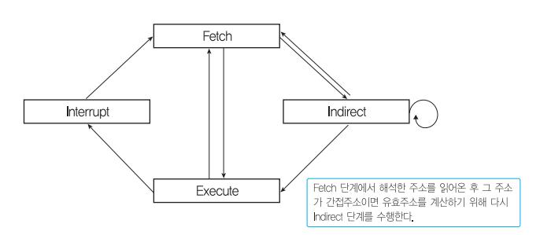

- 동작 순서

| Micro Operation    | 의 미                   |
|--------------------|-----------------------|
| MAR ← MBR[AD] MBR에 | 있는 명령어의 번지 부분을        |
| MAR에               | 전송함                   |
| MBR ← M[MAR]       | 메모리에서 MAR이 지정하는 위치    |
| 의                  | 값을 MBR에 전송함           |
| No Operation 동작    | 없음                    |
| F ← 1, R ← 0 F에    | 1, R에 0을 전송하여 Execute |
| 단계로                | 변천함                   |

### 094. 핵심 인터럽트 단계(Interrept Cycle)

- 인터럽트 발생 시 복귀주소(PC)를 저장시키고, 제어순 서를 인터럽트 처리 프로그램의 첫 번째 명령으로 옮기 는 단계이다.


- 인터럽트 단계를 마친 후에는 항상 Fetch 단계로 변천 한다.
- Interrupt가 발생할 때만 실행되어 다른 일을 처리하고 돌아오기 때문에 하드웨어로 실현되는 서브부틴(부 프 로그램)의 호출이라고도 한다.

| Micro Operation    |       | 의 미  |       |        |      |
|--------------------|-------|------|-------|--------|------|
| MBR[AD] ← PC,      |       |      |       |        |      |
| PC ← 0             |       |      |       |        |      |
| •PC가              | 가지고   | 있는,  | 다음에   | 실행할    | 명령의  |
| 주소를                | MBR의  | 주소   | 부분으로  | 전송함    |      |
| •복귀주소를            |       | 저장할  | 0번지를  | PC에    | 전송함  |
| MAR ← PC,          |       |      |       |        |      |
| PC ← PC + 1        |       |      |       |        |      |
| •PC가              | 가지고   | 있는 값 | 0번지를  | MAR에   | 전송함  |
| •인터럽트             | 처리    | 루틴으로 |       | 이동할    | 수 있는 |
| 인터럽트               | 벡터의   |      | 위치를   | 지정하기   | 위해   |
| PC의                | 값을 1  | 증가시켜 | 1로    | 세트시킴   |      |
| M[MAR] ← MBR,      |       |      |       |        |      |
| IEN ← 0            |       |      |       |        |      |
| •MBR이             | 가지고   | 있는,  | 다음에   | 실행할    | 명령의  |
| 주소를                | 메모리의  | MAR이 |       | 가리키는   | 위치(0 |
| 번지)에               | 저장함   |      |       |        |      |
| •인터럽트             | 단계가   | 끝날   | 때까지   | 다른     | 인터럽  |
| 트가                 | 발생하지  | 않게   | IEN에  | 0을 전송함 |      |
| F ← 0, R ← 0 F에 0, | R에 0을 | 전송하여 | Fetch | 단계로    | 변천함  |

#### 동작 순서

#### ADD : AC ← AC + M[AD]

| Micro Operation | 의 미                      |
|-----------------|--------------------------|
| MAR ← MBR[AD]   | MBR에 있는 명령어의 번지 부분을 MAR에 |
| MBR ← M[MAR]    | 메모리에서 MAR이 지정하는 위치의 값을   |
|                 | MBR에 전송함                 |
| AC ← AC + MBR   | 누산기의 값과 MBR의 값을 더해 누산기에  |

### 095. 핵심 주요 명령의 마이크로 오퍼레이션

#### LDA(Load to AC) : AC ← M[AD]

| Micro Operation       | 의 미                 |
|-----------------------|---------------------|
| MAR ← MBR[AD] MBR에    | 있는 명령어의 번지 부분을 MAR에 |
| MBR ← M[MAR]          |                     |
| AC ← 0                |                     |
| •메모리에서               | MAR이 지정하는 위치의 값을    |
| MBR에                  | 전송함                 |
| •AC에                 | 0을 전송하여 AC를 초기화함    |
| AC ← AC + MBR •메모리에서 | 가져온 MBR과 AC를 더해     |
| AC에                   | 전송함                 |
| ※ 초기화된               | AC에 더해지므로 메모리의      |
| 값을                    | AC로 불러오는 것이됨        |

#### STA(Store to AC) : M[AD] ← AC

| Micro Operation | 의 미                      |
|-----------------|--------------------------|
| MAR ← MBR[AD]   | MBR에 있는 명령어의 번지 부분을 MAR에 |
| MBR ← AC        | AC의 값을 MBR에 전송함          |
| M(MAR) ← MBR    | MBR의 값을 메모리의 MAR이 지정하는   |
|                 | 위치에 전송함                  |

#### BSA(Branch and Save Return Address)

| Micro Operation  | 의 미                       |
|------------------|---------------------------|
| MAR ← MBR[AD],   |                           |
| MBR[AD] ← PC,    |                           |
| PC ← MBR[AD]     |                           |
|                  | •M BR에 있는 명령어의 번지 부분을    |
|                  | MAR에 전송함                  |
|                  | ※ MBR[AD]는 복귀주소가 저장될 위치  |
|                  | 이면서 부프로그램이 시작되기 바로        |
|                  | 전 번지임                     |
|                  | •PC의 값(복귀주소)을 MBR의 주소 부분 |
|                  | 으로 전송함                    |
|                  | ※ 복귀주소를 저장하기 위한 준비단계     |
|                  | •MBR의 주소 부분을 PC로 전송함     |
|                  | ※ 부프로그램이 시작되기 바로 전 주소    |
|                  | 를 PC에 전송함                 |
| M[MAR] ← MBR[AD] | •MBR에 있는 명령어의 번지 부분을 메   |
|                  | 모리의 MAR이 가리키는 위치에 전송함     |
|                  | ※ 부프로그램이 시작되기 바로 전 주소    |
|                  | 에 복귀주소를 저장함               |
| PC ← PC+1        | •PC의 값을 1 증가시킴           |
|                  | ※ 부프로그램의 시작임             |

### 096. 핵심 제어 데이터

- 제어장치가 제어 신호를 발생하기 위한 자료로서, CPU가 특정한 메이저 상태와 타이밍 상태에 있을 때 제어 자료에 따른 제어 규칙에 의해 제어 신호가 발생 한다.

- 제어 데이터는 종류
  - 메이저 스테이트 사이의 변천을 제어하는 데이터
  - 중앙처리장치의 제어점을 제어하는 데이터
  - 인스트럭션의 수행 순서를 결정하는 데 필요한 제어 데이터


| 구 분     | Fetch  | Indirect | Execute | Interrupt |
|---------|--------|----------|---------|-----------|
| State 간 |        |          |         |           |
|         | 명령어 종류 |          |         |           |
|         | 주소지정방식 | 주소지정방식   | 인터럽트    |           |
|         |        |          | 요청 신청   | 없음        |
| 제어용     | 명령어    | 유효주소     | 명령어의    |           |
|         |        |          |         | 따라 달라짐    |
| 수행 순서   |        |          |         |           |
| 제어용     | PC     | 없음       | PC      |           |
|         |        |          |         | 따라 달라짐    |

제어장치는 필요한 마이크로 연산들이 연속적으로 수행 될 수 있도록 제어 신호를 보내는 역할을 한다.

| 구 분    | 고정배선 제어장치 | 마이크로 프로그래밍 기법 |
|--------|-----------|---------------|
| 반응 속도  | 고속        | 저속            |
| 회로 복잡도 | 복잡        | 간단            |
| 경제성    | 비경제적      | 경제적           |
| 융통성    | 없음        | 있음            |
| 구성     | 하드웨어      | 소프트웨어         |

### 097. 핵심 제어장치의 비교

### 098. 핵심 마이크로 명령의 형식

### 099. 핵심 입·출력장치의 구성

#### 마이크로 프로그램 잠깐만요 !

내부 제어신호를 발생하는 여러 가지 마이크로 인스트럭션으로 작성 된 것으로, 보통 ROM에 저장되어 있습니다.

#### 수평 마이크로 명령(Horizontal Micro Instruction)

- 마이크로 명령의 한 비트가 한 개의 마이크로 동작 을 관할하는 명령이다.
- Micro Operation부가 m Bit일 때 m개의 마이크 로 동작을 표현할 수 있다.
- Address부의 주소에 의해 다음 마이크로 명령의 주 소를 결정한다.

#### 수직 마이크로 명령(Vertical Micro Instruction)

- 제어 메모리 외부에서 디코딩 회로를 필요로 하는 마이크로 명령이다.
- 한 개의 마이크로 명령으로 한 개의 마이크로 동작 만 제어할 수 있다.
- 마이크로 명령어의 비트 수가 감소된다.

- 제어 기억장치의 용량을 줄일 수 있다.
- 마이크로 명령어의 코드화된 비트들을 해독하기 위 한 지연이 발생한다.

#### 나노 명령(Nano Instruction)

- 나노 메모리(Nano Memory)라는 낮은 레벨의 메모 리에 저장된 마이크로 명령을 나노 명령이라 한다.
- 수직 마이크로 명령을 수행하는 제어기에서 디코더 를 ROM(나노 메모리)으로 대치하여 두 메모리 레 벨로 구성한다.

#### 입·출력 제어장치

- 입·출력장치와 컴퓨터 사이의 자료 전송을 제어하 는 장치이다.
- 데이터 버퍼 레지스터를 이용하여 두 장치 간의 속 도 차를 조절한다.
- 제어 신호의 논리적, 물리적 변환과 오류를 제어한다.
- 종류 : DMA, 채널, 입·출력 프로세서, 입·출력 컴 퓨터 등

#### 입·출력 인터페이스

- 동작 방식이나 데이터 형식이 서로 다른 컴퓨터 내 부의 주기억장치나 CPU의 레지스터와 외부 입·출 력장치 간의 2진 정보를 원활하게 전송하기 위한 방 법을 제공한다.
- 입·출력 인터페이스는 컴퓨터와 각 주변장치와의 다음과 같은 차이점을 해결하는 것이 목적이다.
  - 전자기 혹은 기계적인 주변장치와 전자적인 CPU 나 메모리 간 동작 방식의 차이
  - 주변장치와 CPU 간의 데이터 전송 속도의 차이

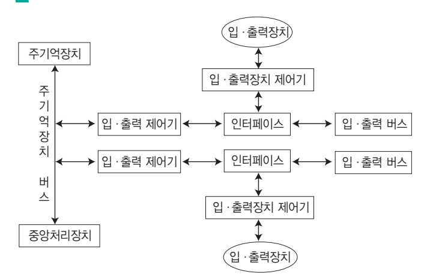


- 주변장치의 데이터 코드와 CPU나 메모리의 워드 형식의 차이
- 전송 사이클의 길이 등 동작 방식이 서로 다른 주 변장치들의 간섭 없는 제어
- 전압레벨의 차이

#### 입·출력 버스

- 주기억장치와 입·출력장치 사이의 데이터 전송을 위해 모든 주변장치의 인터페이스에 공통으로 연결 된 버스이다.
- 입·출력 버스는 데이터 버스, 주소 버스, 제어 버스로 구성된다.

기억장치는 처리 속도가 nano(10-9) 단위인 전자적인 장 치이고, 입·출력장치는 milli(10-3) 단위인 기계적인 장 치이므로 동작 방식에는 많은 차이가 있다.

| 비교 항목 |     | 입·출력장치   | 기억장치 |
|-------|-----|----------|------|
| 동작의   | 속도  | 느리다      | 빠르다  |
| 동작의   | 자율성 | 타율/자율    | 타율   |
| 정보의   | 단위  | Byte(문자) | Word |
| 착오    | 발생률 | 많다       | 적다   |

### 100. 핵심 기억장치와 입·출력장치의 동작

### 102. 핵심 입·출력(Input-Output) 제어 방식

### 101. 핵심 스풀링(SPOOLING)

- Simultaneous Peripheral Operation On-Line 의 약자이다.
- 다중 프로그래밍 환경하에서 용량이 크고 신속한 액세 스가 가능한 디스크를 이용하여 각 사용자 프로그램이 입·출력할 데이터를 직접 I/O 장치로 보내지 않고 디 스크에 모았다가 나중에 한꺼번에 입·출력함으로써 입·출력장치의 공유 및 상대적으로 느린 입·출력장 치의 처리 속도를 보완하는 기법이다.
- 스풀링은 고속의 CPU와 저속의 입·출력장치가 동시 에 독립적으로 동작하게 하여 높은 효율로 여러 작업 을 병행 작업할 수 있도록 해줌으로써 다중 프로그래 밍 시스템의 성능 향상을 가져올 수 있다.
- 스풀링은 디스크 일부를 매우 큰 버퍼처럼 사용한다.

#### 스풀링과 버퍼링의 비교

버퍼링도 입·출력장치와 CPU 간의 속도 차이를 해결 하기 위해 사용하는 목적은 같지만 다음과 같은 점이 스 풀링과 다르다.

|      | 구 분 | 버퍼링   | 스풀링    |
|------|-----|-------|--------|
| 저장   | 위치  | 주기억장치 | 보조기억장치 |
| 운영   | 방식  | 단일 작업 | 다중 작업  |
| 구현   | 방식  | 하드웨어  | 소프트웨어  |
| 입·출력 | 방식  | 큐     | 큐      |

| •원하는        | I/O가       | 완료되었는지의   |            | 여부를        | 검사하기   |
|--------------|------------|-----------|------------|------------|--------|
| 위해서          | CPU가       | 상태        | Flag를      | 계속 조사하여    | I/O가   |
| 완료           | 되었으면       | MDR(MBR)과 |            | AC 사이의     | 자료 전   |
| 송을           | CPU가       | 직접        | 처리하는 I/O   | 방식         |        |
| •입·출력에      |            | 필요한       | 대부분의       | 일을 CPU가    | 해주     |
| 므로           | interface는 | MDR,      | Flag,      | 장치번호       | 디코더로   |
| 만 구성하면       |            | 됨         |            |            |        |
| •I/O        | 작업 시       | CPU는      | 계속 I/O     | 작업에 관여해야   | 하      |
| 기 때문에        |            | 다른 작업을    | 할 수        | 없다는 단점이    | 있음     |
| •입·출력을      |            | 하기 위해     | CPU가       | 계속 Flag를   | 검사     |
| 하지           | 않고,        | 데이터를      | 전송할        | 준비가 되면     | 입·출    |
| 력            | 인터페이스가     |           | 컴퓨터에게      | 알려         | 입·출력이  |
| 이루어지는        |            | 방식        |            |            |        |
| •입·출력       | 인터페이스는     |           | CPU에게      | 인터럽트       | 신호     |
| 를 보내         | 입·출력이      |           | 있음을 알림     |            |        |
| •CPU가       | 계속         | Flag를     | 검사하지       | 않아도        | 되기 때문  |
| 에 Programmed |            |           | I/O보다 효율적임 |            |        |
| •입·출력장치가    |            | 직접        | 주기억장치를     | 접근(Access) |        |
| 하여           | Data       | Block을    | 입·출력하는     | 방식으로       | 입·     |
| 출력           | 전송이        | CPU의      | 레지스터를      | 경유하지       | 않고     |
| •CPU는       | I/O에       | 필요한       | 정보를        | DMA 제어기에   | 알려     |
| 서 I/O        | 동작을        | 개시시킨      | 후 I/O      | 동작에        | 더 이상 간 |
| 섭하지          | 않고         | 다른 프로그램을  |            | 할당하여       | 수행함    |
| •입·출력       | 자료         | 전송        | 시 CPU를     | 거치지        | 않기 때문  |
| 에 CPU의       |            | 부담 없이     | 보다 빠른      | 데이터의       | 전송이    |
| •DMA의       | 우선순위는      |           | 메모리 참조의    | 경우         | 중앙처리   |
| 장치보다         | 상대적으로      |           | 높음         |            |        |
| •인터럽트       | 신호를        | 발생시켜      | CPU에게      | 입·출력       | 종      |
| 료를           | 알림         |           |            |            |        |
| •Cycle      | Steal      | 방식을       | 이용하여       | 데이터를       | 전송함    |
| •CPU에서       | DMA        | 제어기로      | 보내는        | 자료         |        |
| I/O          | 장치의        | 주소        |            |            |        |
| 데이터가         |            | 있는 주기억장치의 |            | 시작 주소      |        |
| DMA를         | 시작시키는      |           | 명령         |            |        |


|        | 입·출력         | 하고자             | 하는        | 자료의 양       |           |        |
|--------|--------------|-----------------|-----------|-------------|-----------|--------|
| 입력     | 또는           | 출력을             | 결정하는      | 명령          |           |        |
| •DMA의  | 구성           | 요소              |           |             |           |        |
|        | 인터페이스       | 회로 :            | CPU와      | 입·출력        |           | 장치와의 통 |
| 신      | 담당           |                 |           |             |           |        |
| 주소    |              | 레지스터(Address    |           | Register)   | 및 주소      | 라인 :   |
|        | 기억장치의        | 위치              | 지정을       | 위한 번지       | 기억        | 및 전송   |
| 워드    | 카운트          |                 | 레지스터(Word | Count       | Register) | : 전    |
|        | 송되어야         | 할 워드의           | 수         | 기억          |           |        |
| 제어     |              | 레지스터(Control    |           | Register) : | 전송        | 방식 결정  |
|        | 데이터         | 레지스터(Data       |           | Register) : | 전송에       | 사용할    |
|        | 자료나          | 주소를             | 임시로       | 기억하는        | 버퍼        | 역할을 함  |
| •DMA의  | 전송           | 절차              |           |             |           |        |
| ❶      | CPU가         | DMA             | 제어기에게     | 명령을         | 내림        |        |
| ❷      | DMA         | 제어기가            | CPU에게     | 버스          | 사용을       | 요구함    |
|        | (Bus         | Request)        |           |             |           |        |
| ❸      | CPU가        | DMA             | 제어기에게     | 버스          | 사용을       | 허가함    |
|        | (Bus Grant)  |                 |           |             |           |        |
| ❹      | DMA         | 제어기가            | 주기억장치에서   |             | 데이터를      | 읽어     |
|        | 디스크로         | 전송함(Data        |           | Transfer)   |           |        |
| ❺      | ❷~❹번을       |                 | 반복하다가     | 데이터         | 전송이       | 완료되    |
| 면      |              | 인터럽트(Interrupt) |           | 신호를 보냄      |           |        |
| •I/O를 | 위한           | 특별한             | 명령어를      | I/O         |           | 프로세서에  |
| 게      | 수행토록         | 하여              | CPU       | 관여 없이       |           | 주기억장치  |
| 와      | 입·출력장치       |                 | 사이에서      |             | 입·출력을     | 제어하    |
| 는      | 입·출력         | 전용              | 프로세서(IOP) |             |           |        |
| •채널은  | DMA          |                 | 방법으로      | 입·출력을       |           | 수행하므   |
| 로      | DMA의         | 확장된             | 개념으로      | 볼           | 수 있음      |        |
| •DMA  | 제어기의         |                 | 한계를       | 극복하기        | 위하여       | 고안     |
| 된      | 방식임          |                 |           |             |           |        |
| •채널   | 제어기는         | 채널              |           | 명령어로        | 작성된       | 채널 프   |
|        | 로그램을         | 해독하고            | 실행하여      |             | 입·출력      | 동작을    |
|        | •CPU로부터     | 입·출력            | 전송을       | 위한          | 명령어를      | 받      |
| 으면     | CPU와는        |                 | 독립적으로     | 동작하여        |           | 입·출력   |
| 을      | 완료함          |                 |           |             |           |        |
| •채널은  |              | 주기억장치에          |           | 기억되어        | 있는        | 채널 프   |
|        | 로그램의         | 수행과             | 자료의       | 전송을         | 위하여       | 주기     |
|        | 억장치에         | 직접              | 접근함       |             |           |        |
| •I/O  | 장치는          | 제어장치를           |           | 통해 채널과      |           | 연결됨    |
| •I/O  | 채널은          | CPU의            | I/O       | 명령을         | 수행하지      | 않고     |
| I/O    | 채널           | 내의              | 특수목적      | 명령을         | 수행함       |        |
| •CPU와 |              | 인터럽트로           | 통신함       |             |           |        |
| •채널의  | 종류           |                 |           |             |           |        |
|        | Selector    | Channel         | : 고속      |             | 입·출력장치(자기 |        |
|        | 디스크,         | 자기              | 테이프,      | 자기 드럼)      | 1개와       | 입·     |
|        | 출력하기         | 위해              | 사용함       |             |           |        |
|        | Multiplexer |                 | Channel : | 저속          | 입·출력장치(카  |        |
|        | 드리더,         | 프린터)            | 여러        | 개를          | 동시에       | 제어하는   |
|        | 채널.          | 바이트             | 멀티플렉서     |             | 채널이라고도    | 함      |
|        | Block        | Multiplexer     | Channel   | :           | 동시에       | 여러 개   |
| 의      | 고속           |                 | 입·출력장치를   | 제어함         |           |        |

#### Cycle Steal 잠깐만요 !

- 데이터 채널(DMA 제어기)과 CPU가 주기억장치를 동시에 Access

할 때 우선순위를 데이터 채널에게 주는 방식입니다.
- Cycle Steal은 한 번에 한 데이터 워드를 전송하고 버스의 제어를 CPU에게 돌려줍니다.
- Cycle Steal을 이용하면 입·출력 자료의 전송을 빠르게 처리해 주 는 장점이 있습니다.
- Cycle Steal 시 중앙처리장치는 메모리 참조가 필요 없는 오퍼레이 션을 계속 수행합니다.
- Interrupt와 Cycle Steal의 차이점

| Interrupt              | Cycle Steal |         |        |
|------------------------|-------------|---------|--------|
| 수행하고 있던 Program은 정     |             |         |        |
| 지되지만, 인터럽트 처리 루틴       |             |         |        |
| 의 명령을 실행하기 위하          |             |         |        |
| 여 CPU는 수행 상태에 있게       |             |         |        |
| 사이클                    | 스틸은         | CPU가    | 내부적으   |
| 로                      | 명령어를        | 해독하거나   | 연산을    |
| 수행하는                   | 등           | 시스템     | 버스를 사용 |
| 하지                     | 않는          | 시간 동안에만 | 시스템    |
| 버스를                    | 사용하기        | 때문에     | CPU는   |
| 메모리                    | 참조가         | 필요      | 없는 오퍼레 |
| 이션을                    | 계속          | 수행할     | 수 있지만  |
| 주기억장치에                 |             | 접근할     | 수는 없다. |
| 주기억장치 사이클이 정지되         |             |         |        |
| 지 않는다.                 |             |         |        |
| 주기억장치                  |             | 사이클의    | 한 주기가  |
| CPU의 상태 보존이 필요하다. CPU의 | 상태          | 보존이     | 필요 없다. |

- 프로그램을 실행하는 도중에 예기치 않은 상황이 발생 할 경우 현재 실행중인 작업을 즉시 중단하고, 발생된 상황을 우선 처리한 후 실행중이던 작업으로 복귀하여 계속 처리하는 것, 일명 "끼어들기"라고도 한다.
- 인터럽트 서비스 루틴을 실행할 때, 인터럽트 플래그 (IF)를 0으로 하면 인터럽트 발생을 방지할 수 있다.
- 인터럽트는 외부 인터럽트, 내부 인터럽트, 소프트웨어 인터럽트로 분류하는데, 외부나 내부 인터럽트는 CPU 의 하드웨어에서의 신호에 의해 발생하고 소프트웨어 인터럽트는 명령어의 수행에 의해 발생한다.

### 103. 핵심 인터럽트의 종류 및 발생 원인

외부 인터럽트

- 전원 이상 인터럽트(Power Fail Interrupt) : 정전이 되거나 전원 이상이 있는 경우
- 기계 착오 인터럽트(Machine Check Interrupt) : CPU의 기능적인 오류 동작이 발생한 경우
- 외부 신호 인터럽트(External Interrupt)
- 타이머에 의해 규정된 시간(Time Slice)을 알리는 경우
- 키보드로 인터럽트 키를 누른 경우
- 외부장치로부터 인터럽트 요청이 있는 경우
- 입·출력 인터럽트(Input-Output Interrupt)
- 입·출력 Data의 오류나 이상 현상이 발생한 경우
- 입·출력장치가 데이터의 전송을 요구하거나 전송이 끝났음을 알릴 경우


| •잘못된                                    | 명령이나       | 데이터를          |       | 사용할    | 때 발생하며, | 트랩   |
|------------------------------------------|------------|---------------|-------|--------|---------|------|
| (Trap)이라고도                               |            | 부름            |       |        |         |      |
| • 프로그램 검사 인터럽트(Program Check Interrupt) |            |               |       |        |         |      |
| 0으로                                      | 나누기(Divide |               | by    | zero)가 | 발생한 경우  |      |
| Overflow                                 |            | 또는 Underflow가 |       | 발생한    | 경우      |      |
| 프로그램에서                                   |            | 명령어를          | 잘못    | 사용한    | 경우      |      |
| 부당한                                     | 기억장소의      |               | 참조와   | 같은     | 프로그램의   | 오류   |
| •프로그램                                   | 처리         | 중 명령의         | 요청에   | 의해     | 발생하는    | 것으   |
| 로, 가장                                    | 대표적인       | 형태는           | 감시    | 프로그램을  |         | 호출하는 |
| SVC(SuperVisor                           |            | Call)         | 인터럽트가 |        | 있음      |      |
| • SVC(SuperVisor Call) 인터럽트             |            |               |       |        |         |      |
| 사용자가                                    | SVC        | 명령을           | 써서    | 의도적으로  | 호출한     | 경우   |
| 복잡한                                      | 입·출력       | 처리를           |       | 해야 하는  | 경우      |      |

- 프로그램 카운터의 내용
- 사용한 모든 레지스터의 내용
- 상태 조건의 내용(PSW)

### 104. 핵심 인터럽트 발생 시 CPU가 확인할 사항

### 105. 핵심 인터럽트의 동작 순서

### 106. 핵심 인터럽트 우선순위

### 107. 핵심 인터럽트 우선순위 판별 방법

#### ➊ 인터럽트 요청 신호 발생

➋ 프로그램 실행을 중단함 : 현재 실행중이던 명령어 (Micro Instruction)는 끝까지 실행함 ➌ 현재의 프로그램 상태를 보존함 : 프로그램 상태는 다음 에 실행할 명령의 번지로서 PC가 가지고 있음 ➍ 인터럽트 처리 루틴을 실행함 : 인터럽트를 요청한 장치 를 식별함 ➎ 인터럽트 서비스(취급) 루틴을 실행함
- 실질적인 인터럽트를 처리함
- 현재 처리하는 인터럽트보다 운선순위가 높은 인터럽 트가 발생하면 그 인터럽트를 먼저 처리해야 함 ➏ 상태 복구 : 인터럽트 요청 신호가 발생했을 때 보관한 PC의 값을 다시 PC에 저장함 ➐ 중단된 프로그램 실행 재개 : PC의 값을 이용하여 인터 럽트 발생 이전에 수행중이던 프로그램을 계속 실행함

#### 프로그램의 상태 보존

인터럽트 발생 시 프로그램의 상태 보존이 필요한 이유는 인터럽트 서비스를 완료하고 원래 수행 중이던 프로그램으로 복귀하기 위해서 입니다.

#### 인터럽트 발생 시 PC의 값 보관 방법

인터럽트 발생 시 상태를 보존하기 위한 PC의 값은 메모리의 0번지, 스택, 인터럽트 벡터 중의 한 곳에 저장합니다.

#### 인터럽트 벡터

- 중앙처리장치는 인터럽트가 발생한 장치번호를 받은 후에는 해당 되는 인터럽트 서비스(취급) 루틴으로 분기하게 됩니다.
- 이때 기억장치 내의 특정한 곳에는 인터럽트 취급 루틴으로 분기 하는 명령어들만을 기억하는 영역이 있는데, 이를 인터럽트 벡터 라고 합니다.
- 인터럽트 벡터에는 인터럽트가 발생했을 때 프로세서의 인터럽트 서비스가 특정의 장소로 점프하도록 점프할 분기번지가 기억되어 있습니다.

#### 인터럽트 체제의 기본 요소

인터럽트 요청 신호, 인터럽트 처리 루틴, 인터럽트 취급 루틴

#### 잠깐만요 !

- 목적 : 여러 장치에서 동시에 인터럽트가 발생하였을 때 먼저 서비스할 장치를 결정하기 위해서임
- 우선순위(높음 > 낮음) : 전원 이상(Power Fail) > 기계 착오(Machine Check) > 외부 신호(External) > 입·출력(I/O) > 명령어 잘못 > 프로그램 검사 (Program Check) > SVC(SuperVisor Call)

#### 소프트웨어 적인 방법 : Polling

- Interrupt 발생 시 가장 높은 우선순위의 인터럽 트 자원(Source)부터 인터럽트 요청 플래그를 차 례로 검사해서, 우선순위가 가장 높은 Interrupt 자원(Source)을 찾아내어 이에 해당하는 인터럽 트 서비스 루틴을 수행하는 방식
- 소프트웨어적인 방식을 폴링이라고 함
- 우선순위 변경이 쉬우며, 자기디스크와 같이 속 도가 빠른 장치에 높은 등급을 부여함
- 많은 인터럽트가 있을 경우 그들을 모두 조사하 는 데 많은 시간이 걸려 반응 시간이 느리다는 단점이 있음
- 회로가 간단하고 융통성이 있으며, 별도의 하드 웨어가 필요 없으므로 경제적임


| •CPU와                            | Interrupt를 | 요청할        | 수 있는  | 장치         | 사이에 |
|-----------------------------------|------------|------------|-------|------------|-----|
| 장치번호에                             | 해당하는       | 버스를        | 병렬이나  | 직렬로        | 연   |
| 결하여                               | 요청 장치의     | 번호를        | CPU에  | 알리는        | 방식  |
| •벡터                              | 인터럽트 방식에서는 |            | 인터럽트를 |            | 발생한 |
| 장치가                               | 프로세서에게     | 분기할        | 곳에    | 대한         | 정보를 |
| 제공하는데,                            | 이 정보를      | 인터럽트       |       | 벡터라 함      |     |
| •벡터                              | 인터럽트를      | 하드웨어       | 신호에   | 의하여        | 수행  |
| 되는 서브루틴이라고도                       |            | 함          |       |            |     |
| •장치 판별을                          | 위한         | 별도의        | 프로그램  | 루틴이        | 없어  |
| 응답 속도가                            | 빠름         |            |       |            |     |
| •회로가                             | 복잡하고       | 융통성이       | 없으며   | 추가적인       | 하   |
| 드웨어가                              | 필요하므로      | 비경제적임      |       |            |     |
| • 직렬(Serial) 우선순위 부여 방식 : 데이지 체인 |            |            |       |            |     |
| 인터럽트가                            | 발생하는       | 모든         | 장치를   | 한 개의       | 회   |
| 선에                                | 직렬로 연결함    |            |       |            |     |
| 우선순위가                            | 높은         | 장치를        | 선두에   | 위치시키고      |     |
| 나머지를                              | 우선순위에      | 따라         | 차례로   | 연결함        |     |
| • 병렬(Parallel) 우선순위 부여 방식        |            |            |       |            |     |
| 인터럽트가                            | 발생하는       | 각          | 장치를   | 개별적인       | 회   |
| 선으로                               | 연결함        |            |       |            |     |
| 우선순위는                            | Mask       | Register의  |       | 비트 위치에     | 의   |
| 해서                                | 결정됨        |            |       |            |     |
| 마스크                              | 레지스터는      | 우선순위가      |       | 높은 것이      | 서   |
| 비스                                | 받고 있을      | 때 우선순위가    |       | 낮은 것을      | 비활  |
| 성화                                | 시킬 수 있음    |            |       |            |     |
| 우선순위가                            | 높은         | Interrupt는 | 낮은    | Interrupt가 |     |
| 처리되는                              | 중에도        | 우선         | 처리됨   |            |     |

| 기억장치는    | 무조건      | 기억       | 용량이            | 큰 것을      | 사용한다  |
|----------|----------|----------|----------------|-----------|-------|
| 고 해서     | 좋은       | 것이 아니라,  | 사용             | 목적에       | 따라 성능 |
| 당 경비     | 비율이      | 적은 것을    | 사용하는           | 것이        | 바람직함  |
| •기억장치에  |          | 읽기 요청이   | 발생한            | 시간부터      | 요구    |
| 한        | 정보를 꺼내서  | 사용       | 가능할            | 때까지의      | 시간    |
| •한      | Word 단위의 | 정보를      | 읽거나            | 기록하는      | 데 걸   |
| 리는       | 시간       |          |                |           |       |
| •Access | Time     | = Seek   | Time           | + Latency | Time  |
| (또는      | Search   | Time)    | + Transmission |           | Time  |
| •기억장치에  |          | 읽기 신호를   | 보낸             | 후 다시      | 읽기 신호 |
| 를        | 보낼 수     | 있을 때까지의  | 시간             | 간격        |       |
| •Cycle  | Time     | ≥ Access | Time           |           |       |
| •메모리로부터 |          | 또는 메모리까지 |                | 1초 동안     | 전송되   |
| 는        | 최대한의     | 정보량으로    | 기억장치의          |           | 자료 처리 |
| 속도를      | 나타내는     | 단위       |                |           |       |
| •메모리    | 워드의      | 길이가      | 작을수록           | 대역폭이      | 좋음    |
| •대역폭은   | 하드웨어의    |          | 특성상 주기억장치가     |           | 제공    |
| 할        | 수 있는     | 정보 전달능력의 | 한계를            | 의미함       |       |

### 108. 핵심 기억장치의 특성을 결정하는 요소

### 110. 핵심 RAM(Random Access Memory)

### 109. 핵심 ROM(Read Only Memory)

#### 기억장치별 접근 속도(빠름 → 느림) 잠깐만요 !

CPU 레지스터 → Cache → RAM(Main Memory) → ROM → 자기 코 어 → 자기 디스크 → 자기 테이프

- 기억된 내용을 읽을 수만 있는 기억장치로서 일반적으 로 쓰기는 불가능하다.
- 전원이 꺼져도 기억된 내용이 지워지지 않는 비휘발성 메모리이다.
- 실제로 ROM은 주기억장치로 사용하기보다는 주로 기 본 입·출력 시스템(B IOS), 자가 진단 프로그램 (POST) 같은 변경 가능성이 희박한 시스템 소프트웨 어를 기억시키는 데 이용한다.

#### ROM의 종류와 특징

| 종 류         |         |         | 특 징  |      |      |
|-------------|---------|---------|------|------|------|
| Mask ROM 제조 | 공장에서    | 프로그램화하여 |      | 생산한  | ROM  |
| 으로,         | 사용자가    | 내용을     | 변경시킬 | 수 없음 |      |
| PROM        | 프로그램    | 장치라는    | 특수   | 장비를  | 이용   |
| 하여          | 비어 있는   | ROM에    | 사용자가 | 한    | 번만 내 |
| 용을          | 기입할     | 수 있으며,  | 이후엔  | 읽기만  | 가능함  |
| •자외선을      |         | 쏘여서     | 기록한  | 내용을  | 지울 수 |
| 있고,         | PROM    | 프로그램    | 장치로  | 기록할  | 수    |
| 도           | 있음      |         |      |      |      |
| •사용자가      | 여러      | 번       | 반복해서 | 지우거나 | 기록   |
| 할           | 수 있음    |         |      |      |      |
| 전기적         | 특성을     | 이용하여    |      | 기록된  | 정보의  |
| 일부를         | 바꿀      | 수 있는    | ROM  |      |      |
| 전기적인        | 방법을     | 이용하여    |      | 기록된  | 내용을  |
| 여러          | 번 수정하거나 |         | 새로운  | 내용을  | 기록할  |
| 수 있는        | ROM     |         |      |      |      |

- 자유롭게 읽고 쓸 수 있는 기억장치로, RWM(Read Write Memory)이라고도 한다.
- RAM에는 현재 사용중인 프로그램이나 데이터가 저장 되어 있다.
- 전원이 꺼지면 기억된 내용이 모두 사라지는 휘발성 메 모리이다.


- 일반적으로 '주기억장치' 또는 '메모리'라고 하면 램을 의미한다.
- 정보가 저장된 위치는 주소로 구분한다.
- DRAM/SRAM의 특징

|    |         | 동적 램(DRAM)  | 정적 램(SRAM)   |
|----|---------|-------------|--------------|
| 구성 | 소자      | 콘덴서         | 플립플롭         |
|    |         | 전원이 공급되어도   | 일정           |
|    |         | 시간이 지나면     | 전하가 방        |
|    |         | 전되므로        | 주기적인 재충      |
|    |         | 전(Refresh)이 | 필요함          |
|    |         |             | 전원이 공급되는 동안에 |
|    |         |             | 는 기억 내용이 유지  |
| 전력 | 소모      | 적음          | 많음           |
| 접근 | 속도      | 느림          | 빠름           |
|    | 집적도(밀도) | 높음          | 낮음           |
| 가격 |         | 저가          | 고가           |
| 용도 |         | 일반적인        | 주기억장치 캐시 메모리 |

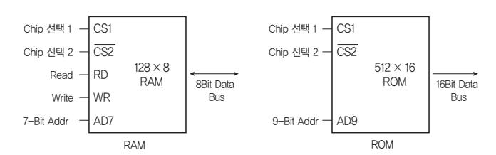

#### RAM/ROM의 구성

RAM은 칩 선택선, 읽기 쓰기 선택선, 주소선, 양방향 데이터 버스가 있지만 ROM은 읽기만 할 수 있도록 정해 져 있으므로 읽기 쓰기 선택선이 없고, 데이터 버스도 단 방향이다.

### 111. 핵심 반도체 기억소자의 구성

### 112. 핵심 자기 코어

### 113. 핵심 보조기억장치

- CS1, CS2 : 칩 선택선
- RD : 입력 신호선
- WR : 출력 신호선
- AD : 주소선, 주소선의 수는 지정할 수 있는 워드의 수 를 나타냄. 주소선이 n개라면 2<sup>n</sup> 개의 워드를 지정할 수 있음
- Data Bus : 워드의 크기를 나타낸다. 데이터 버스가 8Bit라면 워드의 크기가 8Bit임

#### RAM/ROM의 용량 계산

- 위 그림에서 RAM은 주소선이 7개이고, Data Bus가 8Bit이므로 128(27 )×8Bit의 용량이고, ROM은 주소 선이 9개이고, Data Bus가 16Bit이므로 512(29 )× 16Bit의 용량이다.
- 주소선의 수는 주소를 지정하는 MAR, 그리고 다음에 실행할 명령의 주소를 가지고 있는 PC의 크기와 같고, Data Bus의 비트 수는 읽어온 또는 저장할 자료를 잠 시 보관하는 MBR, 그리고 읽어온 명령어를 저장하는 IR의 크기와 같다.
- 주소선의 수 = MAR = PC, Data Bus의 비트 수 = MBR = IR

- 자기 코어는 전류 일치 기술(Coincident-Current Technique)에 의하여 기억장소를 선별한다.
- 자기 코어는 데이터를 읽으면 읽은 내용이 지워지는 파 괴 메모리(DRO Memory)이므로, 내용을 읽은 후 지 워진 내용을 기록하기 위한 재저장(Restorat ion Time) 시간이 필요하다.
- 자기 코어는 중심을 통과하는 전선에 흐르는 전류의 방 향에 따라 1 혹은 0의 값을 갖는다.
- 자기 코어는 부피에 비해 용량이 작고 가격이 비싸 현 재는 거의 사용하지 않는다.
- 자기 코어의 구성 -구동선(X, Y) 2개 : 번지 선택선 -센스 선 1개 : 자기 코어의 상태 검출 -금지선 1개 : 불필요하게 자화되었을 때 금지 전류를 흘려 자화를 소거시키는 선

#### 보조기억장치의 특징

- 주기억장치에 비해 속도는 느리지만 저장 용량이 크다.
- 전원이 차단되어도 내용이 그대로 유지된다.
- 중앙처리장치와 직접 자료 교환이 불가능하다.
- 일반적으로 주기억장치에 데이터를 저장할 때는 DMA 방식을 사용한다.


#### 보조기억장치의 종류

| •순차    | 처리(SASD)만     | 할         | 수 있는    | 대용량     | 저장 매체     |
|---------|---------------|-----------|---------|---------|-----------|
| •가격이   | 저렴하고          | 용량이       | 커서      | 자료의     | 백업용으로     |
| 많이      | 사용함           |           |         |         |           |
| •자성    | 물질이           | 코팅된       | 얇은      | 플라스틱    | 테이프를 동    |
| 그란      | 릴에            | 감아 놓은     | 형태      |         |           |
| •테이프의  |               | 시작과 끝     | 부분을     | 알리는     | 은박지 사이    |
| 의       | 정보 저장         | 부분을       | 7~9트랙으로 |         | 구성함       |
| •트랙별로  |               | 1비트를      | 저장하므로   | 동시에     | 7~9비트를    |
| 읽거나     | 쓸 수           | 있음        |         |         |           |
| •자성    | 물질을           | 입힌        | 금속 원판을  | 여러      | 장 겹쳐서     |
| 만든      | 기억            | 매체로       | 용량이 크고  | 접근      | 속도가 빠름    |
| •순차,   |               | 비순차(직접)   | 처리가     | 모두 가능한  | DASD      |
| (Direct | Access        | Storage   | Device) |         | 방식으로 데이   |
| 터를      | 처리함           |           |         |         |           |
| •      | 트랙(Track)     | : 디스크     | 표면에서    |         | 회전축(스핀들 모 |
| 터)을     | 중심으로          | 데이터가      |         | 기록되는    | 동심원       |
| •      | 섹터(Sector)    | : Track들을 |         | 일정한 크기로 | 구분한       |
|         | 부분이며,         | 정보 기록의    | 기본      | 단위임     |           |
| •      | 실린더(Cylinder) | :         | 서로 다른   | 면들에     | 있는 동일     |
| 위치의     |               | Track들의   | 모임으로,   | 실린더의    | 수는 한      |
| 면의      | 트랙            | 수와 동일함    |         |         |           |

- 디스크 시스템은 디스크 번호, 디스크 표면 번호, 트랙 번호, 섹터 번호를 표현하는 번지 Bit를 가지고 디스크 의 기억공간을 Access한다.
- Access Time = Seek Time + Latency Time + Transmission Time
- Seek Time(탐색 시간) : R/W Head가 특정 트랙까지 이동하는 데 걸리는 시간
- Latency Time(회전 지연 시간, Rotational Delay Time) 또 는 Search Time : R/W Head가 특정 트랙까지 이동한 후 디스크가 회전하여 트랙에 포함되어 있는 특정 섹터 가 R/W Head까지 도달하는 데 걸리는 시간
- Transmission Time(전송 시간) : R/W Head가 Access 한 Sector와 주기억장치 간의 자료 전송에 걸리는 시간

### 114. 핵심 디스크의 Access Time

### 116. 핵심 메모리 인터리빙(Memory Interleaving)

### 117. 핵심 캐시 메모리(Cache Memory)

### 115. 핵심 연관 기억장치(Associative Memory)

- 기억장치에서 자료를 찾을 때 주소에 의해 접근하지 않 고, 기억된 내용의 일부를 이용하여 접근할 수 있는 기 억장치로, CAM(Content Addressable Memory)이 라고도 한다.

- 주소에 의해서만 접근이 가능한 기억장치보다 정보 검 색이 신속하다.
- 캐시 메모리나 가상 메모리 관리 기법에서 사용하는 Mapping Table에 사용된다.
- 외부의 인자와 내용을 비교하기 위한 병렬 판독 논리 회로를 갖고 있기 때문에 하드웨어 비용이 증가한다.

- 여러 개의 독립된 모듈로 이루어진 복수 모듈 메모리와 CPU 간의 주소 버스가 한 개로만 구성되어 있으면 같 은 시각에 CPU로부터 여러 모듈들로 동시에 주소를 전달할 수 없기 때문에, CPU가 각 모듈로 전송할 주소 를 교대로 분산 배치한 후 차례대로 전송하여 여러 모 듈을 병행 접근하는 기법이다.
- 중앙처리장치의 쉬는 시간을 줄일 수 있고, 단위시간당 수행할 수 있는 명령어의 수를 증가시킬 수 있다.
- 이 기억장치를 구성하는 모듈의 수 만큼의 단어들에 동 시 접근이 가능하다.
- 메모리 인터리빙 기법을 사용하면 기억장치의 접근 시 간을 효율적으로 높일 수 있으므로 캐시 기억장치, 고 속 DMA 전송 등에서 많이 사용된다.

메모리 인터리빙은 인터리빙, 디스크 인터리빙으로 혼용 되어 사용됩니다. 잠깐만요 !

- CPU의 속도와 메모리의 속도 차이를 줄이기 위해 사 용하는 고속 Buffer Memory이다.
- 캐시는 주기억장치와 CPU 사이에 위치한다.
- 캐시 메모리는 메모리 계층 구조에서 가장 빠른 소자이 며, 처리 속도가 거의 CPU의 속도와 비슷할 정도이다.
- 캐시를 사용하면 기억장치를 접근(Access)하는 횟수 가 줄어들기 때문에 컴퓨터의 처리 속도가 향상된다.
- 최근에는 명령어와 데이터를 따로 분리하여 각각의 캐 시 메모리에 저장하는 분리 캐시를 운용하기도 한다. 분리 캐시를 사용하면 적중률은 떨어지지만 캐시 접근 시 충돌을 방지 할 수 있다.


- 명령어나 자료를 찾기 위하여 캐시 메모리에 접근하는 경우, 원하는 정보가 캐시 메모리에 기억되어 있을 때 적중(Hit)되었다고 하고, 기억되어 있지 않으면 실패 했다고 한다. 적중 횟수
- 적중률 <sup>=</sup> ------------- <sup>총</sup> 접근 횟수

#### 매핑 프로세스(Mapping Process)

- 주기억장치로부터 캐시 메모리로 데이터를 전송하는 방법
- 종류 : 직접(Direct) 매핑, 어소시에이티브(Associative) 매핑, 세트-어소시에이티브(Set-Associative) 매핑
- 직접 매핑은 같은 인덱스를 가졌지만 다른 tag를 가진 두 개 이상의 워드가 반복 접근할 경우 적중률이 낮아 질 수 있다.

#### 쓰기 정책

- 캐시에 저장되어 있는 데이터에 수정이 발생했을 때 그 수정된 내용을 주기억장치에 갱신하기 위해 시기와 방 법을 결정하는 것이다.
- Write-Through : 캐시에 쓰기 동작이 이루어질 때마다 캐시 메모리와 주기억장치의 내용을 동시에 갱신하는 방식으로, 쓰기 동작에 걸리는 시간이 길다.
- Write-Back : 캐시에 쓰기 동작이 이루어지는 동안은 캐시의 내용만이 갱신되고, 캐시의 내용이 캐시로부터 제거될 때 주기억장치에 복사된다.
- Write-Once : 캐시에 쓰기 동작이 이루어질 때 한 번만 기록하고 이후의 기록은 모두 무시한다.

- 기억 용량이 작은 주기억장치를 마치 큰 용량을 가진 것처럼 사용할 수 있도록 하는 운영체제의 메모리 운영 기법이다.
- 가상 기억장치의 목적은 주기억장치의 용량 확보이다.
- 가상 기억장치는 하드웨어적으로 실제로 존재하는 것 이 아니고 소프트웨어적인 방법으로 보조기억장치를 주기억장치처럼 사용하는 것이다.
- 사용자 프로그램을 여러 개의 작은 블록으로 나누어서 보조기억장치 상에 보관해 놓고 프로그램 실행 시 필요 한 부분들만 주기억장치에 적재한다.

### 118. 핵심 가상 기억장치(Virtual Memory)

### 119. 핵심 플린(Flynn)의 병렬 컴퓨터 분류

- 주기억장치의 이용률과 다중 프로그래밍의 효율을 높 일 수 있다.
- 가상 기억장치 기법에서 사용하는 보조기억장치는 디 스크 같은 DASD 장치이어야 한다.
- 주소의 사용 -가상 기억장치 기법에서는 보조기억장치에 저장된 사용자 프로그램을 블록으로 나누어 블록에 대한 주 소를 주기억장치와는 별도의 주소로 표현하여 필요 시 해당 블록만을 주기억장치에 적재한다. -가상 주소(논리 주소) : 보조기억장치 상의 주소로, 이들 주소의 집합을 주소 공간이라고 한다. 교체 단 위는 페이지를 사용한다. -실기억 주소(물리적 주소) : 주기억장치 상의 주소로 물리적 주소라고도 하며, 이들 주소의 집합을 메모리 공간 또는 기억 공간이라 한다. 교체 단위는 블록을 사용한다.
- 페이지 부재(Page Fault) -CPU가 액세스한 가상 페이지가 주기억장치에 없는 경우를 말한다. -Page Fault가 발생하면 요구된 Page가 주기억장 치로 옮겨질 때까지 프로그램 수행이 중단된다.
- 주소 매핑 -가상주소를 실기억주소로 변환하는 작업이다. -가상기억장치에 보관 중이던 프로그램을 실행하기 위해 주기억장치에 Load했다 하더라도 프로그램을 구성하는 각 기계명령에 포함된 주소는 가상주소로 남아 있기 때문에 CPU에서 주기억장치를 Access하 기 위해서는 가상주소를 실주소로 변환해야 한다. -주소 매핑에는 사상함수가 사용된다.

| <div><span></span></div> <div>SISD(Single Instruction stream Single Data stream)</div>                                                                                          |  |
|---------------------------------------------------------------------------------------------------------------------------------------------------------------------------------|--|
|                                                                                                                                                                                 |  |
| <ul><li>현재의 보통 컴퓨터 구조임</li> <li>명령 하나가 자료 하나를 처리하는 구조임</li> <li>제어장치가 한 개의 명령을 번역한 후 처리기를 작동시켜 명령을 처리할 때 기억장치에서 한 개의 자료를 꺼내서 처리함</li> <li>Pipeline에 의한 시간적 병렬 처리가 가능함</li></ul> |  |


| •한         | 개의 명령으로   |         | 여러          | Data를 | 동시에     | 처리하는     |
|-------------|-----------|---------|-------------|-------|---------|----------|
| •다수의       | 처리기가      | 한       | 개의          | 제어장치에 | 의해      | 제어됨      |
| •배열        | 처리기(Array |         | Processor)에 |       | 의한      | 동기적 병    |
| 렬           | 처리가       | 가능함     |             |       |         |          |
| •다수의       | 처리기에      |         | 의해          | 각각의   | 명령들이    | 하나의      |
| Data를       | 처리하는      |         | 구조임         |       |         |          |
| •실제로는      | 사용되지      |         | 않는          | 구조임   |         |          |
| •Pipeline에 |           | 의한 비동기적 |             | 병렬    | 처리가     | 가능함      |
| •다수의       | 처리기가      |         | 각각          | 다른 명령 | 흐름과     | 자료 흐     |
| 름을          | 가지고       | 여러      | 개의          | 자료를   | 처리하는    | 구조임      |
| •처리기들의     |           | 상호      | 연결          | 시 T   | ight ly | Coup led |
| System을     |           | 다중      | 처리기,        | Loose | ly      | Coup led |
| System을     |           | 분산 처리   | 시스템이라       |       | 함       |          |
| •다중         | 처리기에      | 의한      | 비동기적        | 병렬    | 처리가     | 가능함      |

| •CPU의 |                 | 처리속도를         |            | 높이기          | 위해 2개        | 이상의 명령           |
|--------|-----------------|---------------|------------|--------------|--------------|------------------|
|        | (Instruction)을  |               | 동시에        | 병렬           | 처리하는         | 장치로, 분업          |
| 화의     | 원리를             |               | 활용하여       | 시간적          | 병렬 처리를       | 함                |
| •입력   |                 | 태스크(Task)를    |            | 입력의          | 서브           | 태스크(Sub          |
|        | Task)로          | 나눈            | 다음 서브      |              | 태스크별로        | 동시에 처리할          |
| 수      | 있도록             | 하여            | 처리능력을      |              | 크게 향상시킴      |                  |
| •명령   | 인출,             | 명령            | 해독,        | 오퍼랜드         | 인출,          | 명령 실행의           |
| 절차를    | 거침              |               |            |              |              |                  |
| •산술   | 및               | 논리            | 연산, 비교,    | 내적           | 연산,          | 최대·최소값           |
| 구하기    |                 | 등의            | 벡터연산       | 명령을          | 빠르고          | 효율적으로            |
|        | 수행하도록           | 구성된           |            | 처리기 임        |              |                  |
| •벡터   |                 | 처리기에서         | 사용할        | 수            | 있는           | 알고리즘으로 가         |
| 장      | 적합한             |               | 알고리즘은      | Systolic     | 알고리즘임        |                  |
|        | •PE(Processing |               | Element)라고 |              | 불리는          | 다수의 연산기          |
| 를      | 갖는              | 동기적           | 병렬         | 처리기임         |              |                  |
| •명령   | 해독              | 및             | 제어는        | 제어장치가        | 하고,          | PE들은 명           |
| 령      | 해독              | 능력이           | 결여된        | 수동적          | 장치로서         | 명령 처리            |
| 만      | 함               |               |            |              |              |                  |
| •각    | PE들은            | 데이터           | 운행         | 연결망에         | 의해           | 상호 연결되           |
| 어      | PE(ALU)들을       |               | 중복         | 이용함으로써       |              | 공간적 병렬성          |
| 을      | 얻을 수            | 있음            |            |              |              |                  |
| •기존의  | Von             |               | Neumann형인  | 제어           |              | 흐름(Control-Flow) |
|        | 컴퓨터와            | 반대되는          |            | 개념의          | 컴퓨터 구조임      |                  |
| •어떤   |                 | Instruction에서 |            | 필요한          | 피연산자가        | 모두 준비            |
| 되었을    | 때               | 비로소           | 그          | Instruction을 | 수행하고,        | 수행된              |
| 결과는    | 그               | 결과를           | 필요로        | 하는           | Instruction에 | 보내주              |
| 는      | 방식임             |               |            |              |              |                  |
| •어떤   |                 | Instruction이  |            | 프로그램         | 상의 위치와       | 상관없이             |
| 그      | Instruction이    |               | 처리할        | 피연산자가        | 모두           | 준비되기             |
| 만      | 하면              | 수행되기          | 때문에        | PC가          | 필요 없음        |                  |

### 120. 병렬처리기법

핵심 14.8, 14.5, 13.8, 12.3, 10.9, 10.5, 11.8, 06.5, 04.5, 99.10

### 122. 핵심 운영체제의 개요

14.8, 14.5, 14.3, 13.8, 13.6, 13.3, 12.8, 12.5, 12.3, 11.8, 11.6, 11.3, 10.9, 10.5, 10.3, 09.8, 09.5, 09.3, 08.9, 08.5, 07.9, 07.5, 07.3, 05.9, 05.5, 05.4, 05.3, 04.9, 03.8, 03.5, 03.3, 02.9, 02.5, 01.3, 00.10 00.3, 99.4

## 3과목·운영체제

### 121. 핵심 시스템 소프트웨어의 구성

- 제어 프로그램(Control Program) : 시스템 전체의 작동 상태 감시, 작업의 순서 지정(스케줄링), 작업에 사용 되는 데이터 관리, 인터럽트 처리 등의 역할을 수행하 는 프로그램

- 처리 프로그램 : 제어 프로그램의 지시를 받아 사용자가 요구한 문제를 해결하기 위한 프로그램

| 각종 프로그램            | 프로그램의   |        | 실행과 시스템 전체의 작동 |
|--------------------|---------|--------|----------------|
| 상태를                | 감시·감독하는 |        | 프로그램           |
| 어떤 작업 제어(Job       | 업무를     | 처리하고   | 다른 업무로의 이행을    |
| 자동으로 Control) 프로그램 |         | 수행하기   | 위한 준비 및 그 처리에  |
| 대한 자료 관리(Data      | 완료를     | 담당하는   | 프로그램           |
| 주기억장치와 Management) |         | 보조기억장치 | 사이의 데이터        |
| 전송과 프로그램           | 보조기억장치의 |        | 자료 갱신 및 유지 보   |
| 수                  | 기능을     | 수행하는   | 프로그램           |

| <span></span> 언어 번역(Language Translate) <b>프로그램</b> | 원시 프로그램을 기계어 형태의 목적 프로그램으로 번역하는 프로그램(어셈블러, 컴파일러, 인터프리터) |
|-----------------------------------------------------|---------------------------------------------------------|
| <p><b>서비스(Service) 프로그램</b></p>                     | 컴퓨터를 효율적으로 사용할 수 있는 사용 빈도가 높은 프로그램                      |
| <p><b>문제(Problem) 프로그램</b></p>                      | 특정 업무 및 해결을 위해 사용자가 작성한 프로그램                            |

|    | •컴퓨터            | 시스템의 자원들을               |         | 효율적으로            | 관리하며, |      | 사용자가  |
|----|------------------|-------------------------|---------|------------------|-------|------|-------|
|    | 컴퓨터를             | 편리하고                    | 효과적으로   | 사용할              | 수     | 있도록  | 환경을 제 |
|    | 공하는 여러           | 프로그램의                   | 모임      |                  |       |      |       |
|    | •종류：Windows,     | MS-DOS,                 | UNIX,   | Linux            | 등     |      |       |
| 목적 | 처리               | 능력(Throughput) 및        |         | 신뢰도(Reliability) | 향상,   | 사용   | 가능도   |
|    | (Availability)   | 향상, 반환                  | 시간(Turn | Around           | Time) | 단축   |       |
|    | •               | 처리 능력(Throughput)       | : 일정    | 시간               | 내에    | 시스템이 | 처리하   |
|    | 는 일의 양           |                         |         |                  |       |      |       |
|    | •               | 반환 시간(Turn Around Time) |         | :                | 시스템에  | 작업을  | 의뢰한   |
|    | 시간부터             | 처리가 완료될                 | 때까지     | 걸린               | 시간    |      |       |
|    | •               | 사용 가능도(Availability)    | :       | 시스템을             | 사용할   | 필요가  | 있을 때  |
|    | 즉시 사용            | 가능한 정도                  |         |                  |       |      |       |
|    | 신뢰도(Reliability) | :                       | 시스템이    | 주어진              | 문제를   | 정확하게 | 해결    |
|    | 하는 정도            |                         |         |                  |       |      |       |


### 123. 핵심 운영체제 운용 기법 및 발달 과정

# 14.8, 14.5, 14.3, 13.8, 13.6, 13.3, 12.8, 12.5, 12.3, 11.8, 11.6, 10.9, 10.5, 09.8, 09.3, 08.9, 08.3, 07.9, 06.3, 05.5, 05.4,

### 124. 핵심 컴파일러와 인터프리터

|      | •프로세스 |       | 관리(프로세스 생성과 제거, 중지 및 재수행 등)  |
|------|--------|-------|------------------------------|
|      | •프로세서, | 기억장치, | 입·출력장치, 파일 및 정보 등의 자원 관리     |
|      | •자원의  | 스케줄링  | 기능 제공                        |
|      | •사용자와 | 시스템   | 간의 편리한 인터페이스 제공              |
|      | •시스템의 | 각종    | 하드웨어와 네트워크 관리·제어             |
|      | •시스템의 | 오류    | 검사 및 복구, 데이터 관리, 데이터 및 자원 공유 |
| •자원 | 보호     | 기능    | 제공                           |
| •가상 | 계산기    | 기능    | 제공                           |

#### 운영체제 운용 기법

| •초기의 |        | 컴퓨터      | 시스템에서      | 사용된     | 형태로,   |
|-------|--------|----------|------------|---------|--------|
|       | 일정량    | 또는 일정    | 기간 동안      | 데이터를    | 모아     |
| 서     | 한꺼번에   | 처리하는     | 방식         |         |        |
| •컴퓨터 |        | 시스템을     | 효율적으로      | 사용할     | 수 있    |
| •사용자 |        | 측면에서는    | 반환(응답)     | 시간이     | 늦지     |
| 만     | 하나의    | 작업이      | 모든         | 자원을     | 독점하므로  |
| CPU   | 유휴     | 시간이      | 줄어듦        |         |        |
| •급여  | 계산,    | 지불       | 계산, 연말     | 결산      | 등의 업무  |
| 에     | 사용됨    |          |            |         |        |
| •하나의 |        | CPU와     | 주기억장치를     | 이용하여    | 여러     |
| 개의    |        | 프로그램을    | 동시에        | 처리하는    | 방식     |
| •하나의 |        | 주기억장치에   | 2개         | 이상의     | 프로그램   |
| 을     | 기억시켜   | 놓고,      | 하나의        | CPU와    | 대화하면   |
| 서     | 동시에    | 처리한다.    |            |         |        |
| •여러  | 명의     | 사용자가     | 사용하는       |         | 시스템에서  |
|       | 컴퓨터가   | 사용자들의    |            | 프로그램을   | 번갈아    |
| 가며    | 처리해    | 줌으로써     | 각          | 사용자에게   | 독립     |
| 된     | 컴퓨터를   | 사용하는     | 느낌을        | 주는      | 것이며,   |
|       | 라운드    | 로빈(Round | Robin)     |         | 방식이라고도 |
| •여러  |        | 사용자가     | 각자의        | 단말장치를   | 통하여    |
|       | 동시에    | 운영체제와    | 대화하면서      |         | 각자의 프  |
|       | 로그램을   | 실행함      |            |         |        |
| •하나의 |        | CPU는 같은  | 시점에서       | 여러      | 개의 작   |
| 업을    | 동시에    | 수행할      | 수          | 없기 때문에, | CPU    |
| 의     | 전체     | 사용       | 시간을 작은     | 작업      | 시간량    |
| (Time | Slice, |          | Quantum)으로 | 나누어서    | 그 시    |
| 간량    | 동안만    | 번갈아      | 가면서        | CPU를    | 할당하    |
| 여     | 각      | 작업을 처리함  |            |         |        |
| •다중  |        | 프로그래밍    | 방식과        | 결합하여    | 모든 작   |
| 업이    | 동시에    | 진행되는     | 것처럼        | 대화식     | 처리     |
| 가     | 가능함    |          |            |         |        |

#### 운영체제 발달 과정

일괄 처리 시스템 → 다중 프로그래밍, 다중 처리, 시분할, 실시간 처리 시스템 → 다중 모드 → 분산 처리 시스템

| •여러  | 개의      | CPU와       | 하나의    | 주기억장치를   | 이     |
|-------|---------|------------|--------|----------|-------|
| 용하여   | 여러      | 개의         | 프로그램을  | 동시에      | 처리    |
| 하는    | 방식      |            |        |          |       |
| •하나의 | CPU가    | 고장나더라도     |        | 다른       | CPU를  |
| 이용하여  |         | 업무를        | 처리할    | 수 있으므로   | 시스    |
| 템의    | 신뢰성과    | 안정성이       |        | 높음       |       |
| •데이터 | 발생      | 즉시,        | 또는     | 데이터 처리   | 요구    |
| 가     | 있는 즉시   | 처리하여       | 결과를    | 산출하는     | 방     |
| •우주선 | 운행이나    |            | 레이더    | 추적기,     | 핵물리학  |
| 실험    | 및 데이터   |            | 수집, 전화 | 교환장치의    | 제     |
| 어,    | 은행의     | 온라인        | 업무, 좌석 | 예약       | 업무, 인 |
| 공위성,  | 군함      | 등의         | 제어     | 업무 등 시간에 | 제     |
| 한을    | 두고      | 수행되어야      | 하는     | 작업에      | 사용됨   |
| 일괄    | 처리 시스템, |            | 시분할    | 시스템, 다중  | 처리    |
| 시스템,  | 실시간     | 처리         | 시스템을   | 한 시스템에서  |       |
| 모두    | 제공하는    | 방식         |        |          |       |
| •여러  | 개의      | 컴퓨터(프로세서)를 |        | 통신       | 회선으   |
| 로     | 연결하여    | 하나의        | 작업을    | 처리하는     | 방식    |
| •각   | 단말장치나   | 컴퓨터        | 시스템은   | 고유의      | 운     |
| 영체제와  |         | CPU, 메모리를  |        | 가지고 있음   |       |

| •고급     | 언어로        | 작성된           | 소스      | 프로그램  | 전체를 목적    |
|----------|------------|---------------|---------|-------|-----------|
|          | 프로그램으로     | 번역한           | 후, 링킹   | 작업을   | 통해 컴퓨     |
|          | 터에서 실행     | 가능한           | 실행      | 프로그램을 | 생성함       |
| •번역     | 과정이        | 번거롭고,         | 번역      | 시간이   | 오래 걸리지    |
| 만        | 실행 속도가     | 빠름            |         |       |           |
|          | •FORTRAN, | COBOL,        | PASCAL, | C,    | C++, PL/1 |
| 등이       | 컴파일러를      | 사용함           |         |       |           |
| •고급     | 언어로        | 작성된           | 프로그램을   | 한     | 줄 단위로 받   |
|          | 아들여 번역하고,  |               | 번역과     | 동시에   | 프로그램을 한   |
| 줄        | 단위로 즉시     | 실행시키는         |         | 프로그램  |           |
| •줄      | 단위로 번역     | 실행되기          | 때문에     | 시분할   | 시스템에      |
|          | •프로그램이    | 직접            | 실행되므로   | 목적    | 프로그램이 생   |
|          | 성되지 않음     |               |         |       |           |
| •번역     | 속도는        | 빠르지만          | 실행      | 속도는   | 느림        |
| •BASIC, |            | SNOBOL, LISP, | APL     | 등이    | 인터프리터를    |


### 125. 핵심 매크로와 매크로 프로세서

### 126. 핵심 링커 / 로더

### 128. 핵심 PCB(Process Control Block)

### 127. 프로세스

핵심

- 매크로 : 프로그램 작성 시 한 프로그램 내에서 동일한 코드가 반복될 경우 반복되는 코드를 한 번만 작성하 여 특정 이름으로 정의한 후 그 코드가 필요할 때마다 정의된 이름을 호출하여 사용하는 것으로, 매크로는 매크로 이름이 호출되면 호출된 횟수만큼 정의된 매크 로 코드가 해당 위치에 삽입되어 실행되며, 매크로 정 의 내에 또 다른 매크로를 정의할 수 있다.
- 매크로 프로세서 : 원시 프로그램에 존재하는 매크로 호 출 부분에 매크로(Macro) 프로그램을 삽입하여 확장 된 원시 프로그램을 생성하는 시스템 소프트웨어
- 매크로 프로세서 처리 과정 : 매크로 정의 인식 → 매크 로 정의 저장 → 매크로 호출 인식 → 매크로 확장과 인수(매개 변수) 치환

#### 링커

- 언어 번역 프로그램이 생성한 목적 프로그램들과 라이브 러리, 또 다른 실행 프로그램(로드 모듈) 등을 연결하여 실행 가능한 로드 모듈을 만드는 시스템 소프트웨어이다.
- 연결 기능만 수행하는 로더의 한 형태로, 링커에 의해 수 행되는 작업을 링킹(Linking)이라 한다.

#### 로더

|  | 컴퓨터            | 내부로 정보를         |       | 들여오거나, | 로드       | 모듈을 디스크 | 등     |
|--|----------------|-----------------|-------|--------|----------|---------|-------|
|  | 의              | 보조기억장치로부터       |       | 주기억장치에 | 적재하는     | 시스템     | 소     |
|  | •             | 할당(Allocation)  | : 실행  | 프로그램을  |          | 실행시키기   | 위해 기  |
|  | 억장치            | 내에              | 옮겨놓을  | 공간을    | 확보하는     | 기능      |       |
|  | • 연결(Linking) | :               | 부프로그램 | 호출     | 시 그      | 부프로그램이  | 할     |
|  | 당된             | 기억장소의           |       | 시작주소를  | 호출한 부분에  | 등록하여    | 연     |
|  | 결하는            | 기능              |       |        |          |         |       |
|  | •             | 재배치(Relocation) | :     | 디스크    | 등의       | 보조기억장치에 | 저장    |
|  | 된              | 프로그램이           | 사용하는  | 각      | 주소들을 할당된 |         | 기억장소의 |
|  | 실제             | 주소로             | 배치시키는 | 기능     |          |         |       |
|  | • 적재(Loading) | :               | 실행    | 프로그램을  | 할당된      | 기억공간에   | 실     |
|  | 제로             | 옮기는 기능          |       |        |          |         |       |

| • |      | Compile And Go 로더               | : 별도의 | 로더 없이            | 언어 번역 프 |
|----|------|---------------------------------|-------|------------------|---------|
|    | 로그램이 | 로더의 기능까지                        | 수행하는  | 방식(할당,           | 재배치,    |
| 적재 | 작업을  | 모두 언어                           | 번역    | 프로그램이 담당)        |         |
| • |      | 절대 로더(Absolute Loader)          | :     | 로더의 역할이          | 축소되어    |
| 가장 | 간단한  | 프로그램으로                          |       | 구성되었으며,          | 목적 프로그램 |
| 을  | 기억   | 장소에 적재시키는                       | 기능만   | 수행하는             | 로더(할당   |
| 및  | 연결은  | 프로그래머가,                         | 재배치는  | 언어 번역            | 프로그램이   |
| • |      | 직접 연결 로더(Direct Linking Loader) |       | :                | 일반적인 기능 |
| 의  | 로더로, | 로더의 기능                          | 4가지를  | 모두 수행하는          | 로더      |
| • |      | 동적 적재 로더(Dynamic Loding Loader) |       |                  | : 프로그램을 |
|    | 한꺼번에 | 적재하는 것이                         | 아니라   | 실행 시             | 필요한 일부분 |
| 만을 | 적재하는 | 로더로,                            |       | Load-On-Call이라고도 | 함       |

- 프로세스(Process)는 일반적으로 프로세서(처리기, CPU)에 의해 처리되는 사용자 프로그램이나, 시스템 프로그램을 의미하는 것으로, 프로세스는 필요한 각종 자원을 요구한다.

- 프로세스의 여러 가지 정의
  - 실행중인 프로그램, PCB를 가진 프로그램, 실기억 장치에 저장된 프로그램
  - 프로세서가 할당되는 실체, 프로시저가 활동중인 것
  - 비동기적 행위를 일으키는 주체, 지정된 결과를 얻 기 위한 일련의 계통적 동작
  - 목적 또는 결과에 따라 발생되는 사건들의 과정
  - 프로세서가 할당하는 개체로서 디스패치가 가능한 단위

- PCB : 운영체제가 프로세스에 대한 중요한 정보를 저 장해 놓는 곳으로 각 프로세스가 생성될 때마다 고유의 PCB가 생성되고, 프로세스가 완료되면 PCB가 제거됨
- PCB에 저장되어 있는 정보 : 프로세스의 현재 상태, 포 인터(부모 프로세스에 대한 포인터, 자식 프로세스에 대한 포인터, 프로세스가 위치한 메모리에 대한 포인 터, 할당된 자원에 대한 포인터), 프로세스 고유 식별 자, 스케줄링 및 프로세스의 우선순위, CPU 레지스터 정보(누산기, 인덱스 레지스터, 프로그램 카운터 등), 주기억장치 관리 정보, 입·출력 상태 정보, 계정 정보


| <div><div><span><span></span></span></div><span><b>사용자 수준의 스레드</b></span></div> |                                                                                    |
|---------------------------------------------------------------------------------|------------------------------------------------------------------------------------|
| <span></span>                                                                   | <span> </span> <span><span></span></span>                                          |
| <div><div></div><span>커널 수준의 스레드</span></div>                                   | <div><ul><li>사용자가 만든 라이브러리를 사용하여 스레드를 운용함</li><li>속도는 빠르지만 구현이 어려움</li></ul></div> |
| <span></span>                                                                   | <span> </span> <span><span></span></span>                                          |
| <div><div></div><span>커널 수준의 스레드</span></div>                                   | <div><ul><li>운영체제의 커널에 의해 스레드를 운용함</li><li>구현은 쉽지만 속도가 느림</li></ul></div>          |
| <span></span>                                                                   | <span> </span> <span><span></span></span>                                          |

| <b>준비</b> (Ready) | 프로세스가 프로세서를 할당받기 위해 기다리고 있는 상태 |
|-------------------|--------------------------------|
|                   |                                |

#### 프로세스 상태 전이 관련 용어

| Dispatch | 준비 상태에서 대기하고 있는 프로세스 중 하나가 |
|----------|----------------------------|
|          | 프로세서를 할당받아 실행 상태로 전이되는 과정  |
| Wake-Up  | 입·출력 작업이 완료되어 프로세스가 대기 상태에 |
|          | 서 준비 상태로 전이되는 과정           |

#### 스레드(Thread)

- 하나의 프로세스 내에서 병행성을 증대시키기 위한 메 커니즘으로 시스템의 여러 자원을 할당받아 실행하는 프로그램의 단위이다.
- 독립적인 스케줄링의 최소 단위로서, 동일 프로세스 환경에서 서로 독립적인 다중 수행이 가능하다.
- 스레드는 독립적인 스케줄링의 최소 단위로서 프로세 스의 역할을 담당한다.
- 하나의 프로세스에 하나의 스레드가 존재하는 경우에 는 단일 스레드, 하나 이상의 스레드가 존재하는 경우 에는 다중 스레드라고 한다.
- 스레드는 프로세스의 일부 특성을 갖고 있기 때문에 경량(Light Weight) 프로세스라고도 한다.
- 스레드의 분류

- 스레드 사용의 장점
- 하나의 프로세스를 여러 개의 스레드로 생성하여 병 행성을 증진시킬 수 있다.
- 하드웨어, 운영체제의 성능과 응용 프로그램의 처리 율을 향상시킬 수 있다.
- 응용 프로그램의 응답 시간(Response Time)을 단 축시킬 수 있다.
- 실행 환경을 공유시켜 기억장소 및 자원의 낭비가 줄어든다.
- 공통적으로 접근 가능한 기억장치를 통해 효율적으 로 통신한다.

#### 프로세스의 주요 상태

### 129. 핵심 스레드 / 프로세스 상태 전이

### 130. 스케줄링 / 문맥 교환

핵심

| •준비상태  | 큐에    | 있는 프로세스가 |             | 프로세서를  | 할당       |
|---------|-------|----------|-------------|--------|----------|
| 받아      | 실행되는  | 상태       |             |        |          |
| •프로세스  | 수행이   | 완료되기     | 전에          | 프로세스에게 | 주        |
| 어진      | 프로세서  | 할당       | 시간이 종료(Time |        | Run Out) |
| 되면      | 프로세스는 | 준비       | 상태로         | 전이됨    |          |
| •실행중인  | 프로세스에 |          | 입·출력(I/O)   | 처리가    | 필요       |
| 하면      | 실행중인  | 프로세스는    | 대기          | 상태로    | 전이됨      |
| 입·출력    | 요구가   | 발생되어     | 현재          | 실행중인   | 프로세스     |
| 가 중단되고, | 입·출력  |          | 처리가 완료될     | 때까지    | 대기       |
| 하고 있는   | 상태    |          |             |        |          |

- 스케줄링 정의 : 프로세스가 생성되어 실행될 때 필요한 시스템의 여러 자원을 해당 프로세스에게 할당하는 작업
- 스케줄링 목적 : 공정성, 처리율 증가, CPU 이용률 증 가, 우선순위 제도, 오버헤드 최소화, 응답 시간 최소 화, 반환 시간 최소화, 대기 시간 최소화, 균형 있는 자 원의 사용, 무한 연기 회피
- 문맥 교환(Context Switching) : 하나의 프로세스에서 다 른 프로세스로 CPU가 할당되는 과정에서 발생되는 것으로, 새로운 프로세스에게 CPU를 할당하기 위해 현재 CPU가 할당된 프로세스의 상태 정보를 저장하 고, 새로운 프로세스의 상태 정보를 설정한 후 CPU를 할당하여 실행되도록 하는 작업이며, 운영체제에서 Overhead의 발생 요인 중 하나임


### 131. 핵심 프로세서 스케줄링의 종류

### 133. 핵심 에이징(Aging) 기법

### 134. 핵심 선점 스케줄링의 종류

### 132. 비선점 스케줄링의 종류

핵심

| •이미       | 할당된           | CPU를    | 다른     | 프로세스가    | 강제로      | 빼앗아       |
|------------|---------------|---------|--------|----------|----------|-----------|
| 사용할        | 수             | 없는 스케줄링 |        | 기법       |          |           |
| •프로세스가    |               | CPU를    | 할당받으면  |          | 해당 프로세스가 | 완         |
| 료될         | 때까지           | CPU를    | 사용함    |          |          |           |
| •모든       | 프로세스에         |         | 대한 요구를 | 공정하게     |          | 처리할 수     |
| •일괄       | 처리            | 방식에     | 적합하며,  | 중요한      | 작업(짧은    | 작업)이      |
| 중요하지       |               | 않은 작업(긴 | 작업)을   | 기다리는     | 경우가      | 발생        |
| 할          | 수 있음          |         |        |          |          |           |
| •응답       | 시간            | 예측이     | 용이함    |          |          |           |
| • 종류      | : FCFS(FIFO), |         | SJF,   | 우선순위,    | HRN,     | 기한부 등     |
| 의          | 알고리즘          |         |        |          |          |           |
| •하나의      | 프로세스가         |         | CPU를   | 할당받아     | 실행       | 하고 있      |
| 을          | 때 우선순위가       |         | 높은     | 다른       | 프로세스가    | CPU를      |
| 강제로        | 빼앗아           | 사용할     | 수      | 있는       | 스케줄링     | 기법        |
| •우선순위가    |               | 높은      | 프로세스를  |          | 빠르게      | 처리할 수     |
| •주로       | 빠른            | 응답시간을   | 요구하는   |          | 대화식      | 시분할 시     |
| 스템에        | 사용됨           |         |        |          |          |           |
| •선점으로     |               | 인한 많은   | 오버헤드를  |          | 초래함      |           |
| •선점을      | 위해            | 시간      | 배당을    | 위한       | 인터럽트용    | 타이머       |
| 클럭(Clock)이 |               | 필요함     |        |          |          |           |
| • 종류      | : SRT,        | 선점      | 우선순위,  | RR(Round |          | Robin), 다 |
| 단계         | 큐, 다단계        | 피드백     |        | 큐 등의     | 알고리즘     |           |

| •준비상태 |        | 큐에 도착한  | 순서에    | 따라      | 차례로     | CPU  |
|--------|--------|---------|--------|---------|---------|------|
| 를      | 할당하는   | 기법      |        |         |         |      |
| •먼저   | 도착한    | 것이      | 먼저     | 처리되어    | 공평성은    | 유지   |
| 되지만    | 짧은     | 작업이     | 긴 작업을, | 중요한     | 작업이     | 중    |
| 요하지    | 않은     | 작업을     | 기다리게   | 됨       |         |      |
| •실행   | 시간이    | 가장      | 짧은     | 프로세스에   | 먼저      | CPU를 |
| 할당하는   |        | 기법      |        |         |         |      |
| •가장   | 적은     | 평균 대기   | 시간을    | 제공하는    | 최적      | 알고   |
| •실행   | 시간이    | 긴       | 프로세스에  | 불리한     | SJF     | 기법을  |
| 보완하기   |        | 위한 것으로, | 대기     | 시간과     | 서비스(실행) |      |
| 시간을    | 이용하는   |         | 기법     |         |         |      |
| •우선순위 |        | 계산 공식   | = 대기   | 시간      | + 서비스   | 시간   |
|        |        |         |        | 서비스     | 시간      |      |
| •우선   | 순위     | 계산 결과값이 |        | 높은 것부터  | 우선      | 순위   |
| 가      | 부여되는데, | 대기      | 시간이    | 긴 프로세스일 |         | 경우   |
| 계산     | 결과값이   | 높게      | 나옴     |         |         |      |

| •프로세스에게 |        | 일정한    | 시간을 | 주어 그   | 시간 안에 |
|----------|--------|--------|-----|--------|-------|
| 프로세스를    | 완료하도록  |        | 하는  | 기법     |       |
| •시스템은   | 프로세스에게 |        | 할당할 | 정확한    | 시간을   |
| 추정해야     | 하며,    | 이를     | 위해서 | 사용자는   | 시스템이  |
| 요구한      | 프로세스에  | 대한     | 정확한 | 정보를    | 제공해   |
| 야 함      |        |        |     |        |       |
| 준비상태     | 큐에서    | 기다리는   | 각   | 프로세스마다 | 우선순   |
| 위를 부여하여  |        | 그 중 가장 | 높은  | 프로세스에게 | 먼저    |
| CPU를     | 할당하는   | 기법     |     |        |       |

- 시스템에서 특정 프로세스의 우선순위가 낮아 무한정 기다리게 되는 경우, 한번 양보하거나 기다린 시간에 비 례하여 일정 시간이 지나면 우선순위를 한 단계씩 높여 가까운 시간 안에 자원을 할당받도록 하는 기법이다.
- SJF나 우선순위 기법에서 발생할 수 있는 무한 연기 상태, 기아 상태를 예방할 수 있다.

| 준비상태         | 큐의       | 프로세스들     | 중에서      | 우선순위가           |
|--------------|----------|-----------|----------|-----------------|
| 가장 높은        | 프로세스에게   |           | 먼저 CPU를  | 할당하는            |
| 비선점          | 기법인      | SJF 알고리즘을 | 선점       | 형태로 변           |
| 경한 기법으로,     |          | 현재 실행중인   | 프로세스의    | 남은              |
| 시간과          | 준비상태     | 큐에 새로     | 도착한      | 프로세스의           |
| 실행 시간을       | 비교하여     | 가장        | 짧은 실행    | 시간을 요           |
| 구하는          | 프로세스에게   | CPU를      | 할당하는     | 기법              |
| •시분할        | 시스템(Time | Sharing   | System)을 | 위해              |
| 고안된          | 방식으로,    | FCFS      | 알고리즘을    | 선점 형태           |
| 로 변형한        | 기법       |           |          |                 |
| •FCFS(FIFO) |          | 기법과 같이    | 준비상태     | 큐에 먼저           |
| 들어온          | 프로세스가    | 먼저        | CPU를     | 할당받지만           |
| 각            | 프로세스는    | 할당된       | 시간(T     | im e S l i c e, |
| Quantum)     | 동안만      | 실행한       | 후 실행이    | 완료되지            |
| 않으면          | 다음       | 프로세스에게    | CPU를     | 넘겨주고            |
| 준비상태         | 큐의       | 가장 뒤로     | 배치됨      |                 |
| •할당되는       | 시간이      | 클 경우      | FCFS     | 기법과 같아지         |
| 고,           | 할당되는     | 시간이 작을    | 경우       | 문맥 교환 및         |
| 오버헤드가        | 자주       | 발생됨       |          |                 |
| 프로세스를        | 특정       | 그룹으로      | 분류할      | 수 있을 경우         |
| 그룹에          | 따라 각기    | 다른 준비상태   |          | 큐를 사용하는         |


| 다단계 피드백                       | 하드웨어적           |
|-------------------------------|-----------------|
| 특정 그룹의 준비상태 큐에 들어간 프로세스가      |                 |
| 다른 준비상태 큐로 이동할 수 없는 다단계 큐     |                 |
| 기법을 준비상태 큐 사이를 이동할 수 있도록 개    |                 |
| 선한 기법                         | 세마포어(Semaphore) |
| 큐(Multi level Feedback Queue) | 구현 방법 Test &    |

- 각 프로세스에 제어 신호를 전달하여 순서대로 작업을 수행하도록 하는 기법이다.
- E.J.Dijkstra가 제안하였으며, P와 V라는 2개의 연산 에 의해서 동기화를 유지시키고, 상호 배제의 원리를 보 장한다.
- 여러 개의 프로세스가 동시에 값을 수정하지 못한다.
- S는 P와 V 연산으로만 접근 가능한 세마포어 변수로, 공유 자원의 개수를 나타내며 0과 1 혹은 0과 양의 값을 가질 수 있다.
- P 연산 : 자원을 사용하려는 프로세스들의 진입 여부를 자원의 개수(S)를 통해 결정하는 것으로, 자원의 개수를 감소시켜(S=S-1) 자원이 점유되었음을 알림(Wait 동 작)
- V 연산 : 대기중인 프로세스를 깨우는 신호(Wake Up) 로서, 자원의 개수를 증가시켜(S=S+1) 자원이 반납되 었음을 알림(Signal 동작)

#### 임계 구역(Critical Section)

- 다중 프로그래밍 운영체제에서 여러 개의 프로세스가 공유하는 데이터 및 자원에 대하여 어느 한 시점에서는 하나의 프로세스만 자원 또는 데이터를 사용하도록 지 정된 공유 자원(영역)을 의미한다.
- 임계 구역에는 하나의 프로세스만 접근할 수 있으며, 해 당 프로세스가 자원을 반납한 후에만 다른 프로세스가 자원이나 데이터를 사용할 수 있다.
- 임계 구역은 특정 프로세스가 독점할 수 없다.
- 임계 구역의 자원이나 데이터는 여러 프로세스가 사용 해야 하므로 임계 구역 내에서의 작업은 신속하게 이루 어져야 한다.
- 프로세스가 임계 구역에 대한 진입을 요청하면 일정 시 간 내에 진입을 허락해야 한다.
- 현재 임계 구역에서 실행되는 프로세스가 없다면 잔류 영역에서 임계 구역 사용을 기다리고 있는 프로세스의 사용을 허락해야 하며, 그 이외에 있는 프로세스는 임계 구역에 진입할 수 없다.

#### 상호 배제(Mutual Exclusion)

- 특정 프로세스가 공유 자원을 사용하고 있을 경우 다른 프로세스가 해당 공유 자원을 사용하지 못하게 제어하 는 기법이다.
- 여러 프로세스가 동시에 공유 자원을 사용하려 할 때 각 프로세스가 번갈아가며 공유 자원을 사용하도록 하는 것으로 임계 구역을 유지하는 기법이다.
- 상호 배제 기법을 사용함으로써 임계 구역 내에서는 인터 럽트, 교착상태, 무한반복이 발생되지 않도록 해야 한다.
- 상호 배제 구현 기법

### 135. 핵심 임계구역 / 상호 배제 / 세마포어

### 136. 핵심 모니터(Monitor)

| <span></span>                     | <span></span> Test & Set 기법, Swap 명령어 기법 |
|-----------------------------------|------------------------------------------|
| <p><span><span></span></span></p> |                                          |

| <span></span>              | <ul><li>2개의 프로세스 기준<span> </span>: 데커(Dekker) 알고리즘, 피터슨(Peterson) 알고리즘</li> <li>여러 개의 프로세스 기준<span> </span>: Lamport의 빵집 알고리즘</li></ul> | <span></span> |
|----------------------------|-----------------------------------------------------------------------------------------------------------------------------------------|---------------|
| <p><b>소프트웨어적 구현 방법</b></p> |                                                                                                                                         |               |

- 동기화를 구현하기 위한 특수 프로그램 기법으로 특정 공유 자원을 프로세스에게 할당하는 데 필요한 데이터 와 이 데이터를 처리하는 프로시저로 구성된다.
- 자료 추상화와 정보 은폐 개념을 기초로 하며 공유 자 원을 할당하기 위한 병행성 구조로 이루어져 있다.
- 모니터 내의 공유 자원을 사용하려면 프로세스는 반드 시 모니터의 진입부를 호출해야 한다.
- 외부의 프로시저는 직접 액세스할 수 없으며, 모니터 의 경계에서 상호 배제가 시행된다.
- 한순간에 하나의 프로세스만 진입하여 자원을 사용할 수 있다.

| 상호                         | 배제에   | 의해 나타나는  | 문제점으로, |          | 둘 이상의  | 프로세  |
|----------------------------|-------|----------|--------|----------|--------|------|
| 스들이                        | 자원을   | 점유한      | 상태에서   | 서로 다른    | 프로세스가  | 점    |
| 유하고                        | 있는    | 자원을 요구하며 | 무한정    | 기다리는     | 현상     |      |
| • 상호 배제(Mutual Exclusion) |       |          |        | : 한 번에   | 한 개의   | 프로세  |
| 스만이                        | 공유    | 자원을      | 사용할    | 수 있어야    | 함      |      |
| • 점유와 대기(Hold & Wait)     |       |          | :      | 최소한 하나의  | 자원을    | 점유   |
| 하고                         | 있으면서  | 다른       | 프로세스에  | 할당되어     | 사용되고   | 있는   |
| 자원을                        | 추가로   | 점유하기     | 위해     | 대기하는     | 프로세스가  | 있어   |
| 야                          | 함     |          |        |          |        |      |
| • 비선점(Non-preemptive)     |       |          | :      | 다른 프로세스에 | 할당된    | 자    |
| 원은                         | 사용이   | 끝날 때까지   | 강제로    | 빼앗을      | 수 없어야  | 함    |
| • 환형 대기(Circular Wait)    |       |          | :      | 공유 자원과   | 공유 자원을 | 사    |
| 용하기                        | 위해    | 대기하는     | 프로세스들이 |          | 원형으로   | 구성되어 |
| 있어                         | 자신에게  | 할당된      | 자원을    | 점유하면서    | 앞이나    | 뒤에   |
| 있는                         | 프로세스의 | 자원을      | 요구해야   | 함        |        |      |

### 137. 핵심 교착 상태(Deadlock)

### 138. 교착 상태 해결 방법

핵심

### 139. 핵심 기억장치 관리 전략

- 예방(Prevention) 기법 : 교착 상태가 발생되지 않도록 사전에 시스템을 제어하는 방법으로, 교착 상태 발생 의 4가지 조건 중에서 어느 하나를 제거(부정)함으로 써 수행되며 일반적으로 자원의 낭비가 가장 심함

- 회피(Avoidance) 기법 : 교착 상태가 발생할 가능성을 배제하지 않고, 교착 상태가 발생하면 적절히 피해나 가는 방법으로, 주로 은행원 알고리즘(Bank er 's Algorithm)이 사용됨

| 상호 배제 부정 한 | 번에 여러 | 개의    |       | 프로세서가 | 공유 자원을 | 사용할    |
|------------|-------|-------|-------|-------|--------|--------|
| 수          | 있도록   | 하는    | 것이지만, | 실제로는  | 구현하지   | 않음     |
|            | 프로세스가 | 실행되기  | 전     | 필요한   | 모든     | 자원을 할  |
| 당하여        |       | 프로세스  | 대기를   | 없애거나  | 자원이    | 점유되    |
| 지          | 않은    | 상태에서만 | 자원을   |       | 요구하도록  | 함      |
| 자원을        |       | 점유하고  | 있는    | 프로세스가 | 다른     | 자원을    |
| 요구할        | 때     | 점유하고  | 있는    | 자원을   | 반납하고,  | 요구     |
| 한          | 자원을   | 사용하기  | 위해    | 기다리게  | 함      |        |
| 자원을        | 선형    | 순서로   |       | 분류하여  | 고유     | 번호를 할당 |
| 하고,        | 각     | 프로세스는 | 현재    | 점유한   | 자원의    | 고유 번   |
| 호보다        |       | 앞이나 뒤 | 어느    | 한쪽    | 방향으로만  | 자원을    |
|            | 요구하도록 | 하는    | 것     |       |        |        |

- 발견(Detection) 기법 : 시스템에 교착 상태가 발생했는 지 점검하여 교착 상태에 있는 프로세스와 자원을 발 견하는 것으로, 자원 할당 그래프 등을 사용함
- 회복(Recovery) 기법 : 교착 상태를 일으킨 프로세스를 종 료하거나 교착 상태의 프로세스에 할당된 자원을 선점하 여 프로세스나 자원을 회복하는 것

| •Dijkstra가 |        | 제안한 것으로, | 은행에서     | 모든   | 고   |
|-------------|--------|----------|----------|------|-----|
| 객의          | 요구가    | 충족되도록    | 현금을      | 할당하는 | 데   |
| 서           | 유래한    | 기법       |          |      |     |
| •각         | 프로세스에게 | 자원을      | 할당하여     | 교착   | 상태  |
| 가           | 발생하지   | 않으며      | 모든 프로세스가 |      | 완료될 |
| 수           | 있는 상태를 | 안전       | 상태, 교착   | 상태가  | 발생  |
| 할           | 수 있는   | 상태를 불안전  | 상태라고     | 함    |     |

- 반입(Fetch) 전략 : 보조기억장치에 보관 중인 프로그램 이나 데이터를 언제 주기억장치로 적재할 것인지를 결 정하는 전략

- 배치(Placement) 전략 : 새로 반입되는 프로그램이나 데 이터를 주기억장치의 어디에 위치시킬 것인지를 결정 하는 전략

| 요구 반입 | 실행 중인 프로그램이 특정 프로그램이나 데이터 등 |
|-------|-----------------------------|
|       | 의 참조를 요구할 때 적재하는 방법         |
| 예상 반입 | 실행 중인 프로그램에 의해 참조될 프로그램이나 데 |
|       | 이터를 미리 예상하여 적재하는 방법         |

|   | 프로그램이나 | 데이터가  | 들어갈 | 수  | 있는    | 크기의 | 빈 영 |
|---|--------|-------|-----|----|-------|-----|-----|
| 역 | 중에서 첫  | 번째 분할 | 영역에 |    | 배치시키는 | 방법  |     |
|   | 프로그램이나 | 데이터가  | 들어갈 | 수  | 있는    | 크기의 | 빈 영 |
| 역 | 중에서    | 단편화를  | 가장  | 작게 | 남기는   | 분할  | 영역에 |
|   | 배치시키는  | 방법    |     |    |       |     |     |
|   | 프로그램이나 | 데이터가  | 들어갈 | 수  | 있는    | 크기의 | 빈 영 |
| 역 | 중에서    | 단편화를  | 가장  | 크게 | 남기는   | 분할  | 영역에 |
|   | 배치시키는  | 방법    |     |    |       |     |     |

- 교체(Replacement) 전략 : 주기억장치의 모든 영역이 이미 사용중인 상태에서 가상기억장치의 필요한 페이 지를 주기억장치에 배치하려고 할 때, 이미 사용되고 있는 영역 중에서 어느 영역을 교체하여 사용할 것인 지를 결정하는 전략으로, FIFO, OPT, LRU, LFU, NUR, SCR 등이 있음


### 140. 핵심 단편화 / 단편화 해결 방법

### 141. 핵심 가상 기억장치

### 142. 핵심 페이지 교체 알고리즘

#### 단편화

- 분할된 주기억장치에 프로그램을 할당하고 반납하는 과정을 반복하면서 사용되지 않고 남는 기억장치의 빈 공간 조각을 의미한다.
- 내부(Internal) 단편화 : 분할된 영역이 할당될 프로그램 의 크기보다 크기 때문에 프로그램이 할당된 후 사용 되지 않고 남아 있는 빈 공간
- 외부(External) 단편화 : 분할된 영역이 할당될 프로그램 의 크기보다 작기 때문에 프로그램이 할당될 수 없어 사 용되지 않고 빈 공간으로 남아 있는 분할된 전체 영역

#### 단편화 해결 방법

- 통합(Coalescing) 기법 : 주기억장치 내에 인접해 있는 단편화된 공간을 하나의 공간으로 통합하는 작업
- 압축(Compaction) 기법, 집약 : 주기억장치 내에 분산되 어 있는 단편화된 빈 공간을 결합하여 하나의 큰 가용 공간을 만드는 작업으로, 여러 위치에 분산되어 있는 단편화된 빈 공간을 주기억장치의 한쪽 끝으로 옮겨서 큰 기억공간을 만듦

- 보조기억장치(하드디스크)의 일부를 주기억장치처럼 사용하는 것으로, 용량이 작은 주기억장치를 마치 큰 용량을 가진 것처럼 사용하는 것으로, 현재 사용되는 운영체제에서 흔히 사용되는 기법이다.
- 주기억장치의 용량보다 큰 프로그램을 실행하기 위해 사용한다.
- 가상 기억장치에 저장된 프로그램을 실행하려면 가상 기억장치의 주소를 주기억장치의 주소로 바꾸는 주소 변환 작업(주소 매핑)이 필요하다.
- 블록 단위로 나누어 사용하므로 연속 할당 방식에서 발생할 수 있는 단편화를 해결할 수 있다.
- 기억장치의 이용률과 다중 프로그래밍의 효율을 높일 수 있다.
- 운영체제의 설계가 복잡해지고 주소 변환을 위한 테이 블을 사용하므로 기억장소를 낭비할 수 있다.

- 주소 변환 : 가상 기억장치에 있는 프로그램이 주기억 장치에 적재되어 실행될 때 논리적인 가상주소를 물리 적인 실기억주소로 변환하는 것으로, 주소 사상 또는 주소 매핑(Mapping)이라고도 함

| •가상       | 기억장치에  | 보관되어      | 있는     | 프로그램과 |        | 주기      |
|------------|--------|-----------|--------|-------|--------|---------|
| 억장치의       |        | 영역을 동일한   | 크기로    | 나눈    | 후      | 나눠진     |
| 프로그램(페이지)을 |        |           | 동일하게   | 나눠진   | 주기억장치  |         |
| 의          | 영역(페이지 | 프레임)에     | 적재시켜   | 실행하는  |        | 기법      |
| •외부       | 단편화는   | 발생하지      | 않으나    | 내부    | 단편화는   | 발       |
| 생할         | 수 있음   |           |        |       |        |         |
| •페이지      | 맵      | 테이블이      | 필요함    |       |        |         |
| •가상       | 기억장치에  | 보관되어      | 있는     | 프로그램을 |        | 다양      |
| 한          | 크기의    | 논리적인      | 단위로 나눈 | 후     | 주기억장치에 |         |
| 적재시켜       | 실행시키는  |           | 기법     |       |        |         |
| •프로그램을    |        | 배열이나      | 함수 등과  | 같은    | 논리적인   |         |
| 크기로        | 나눈     | 단위를       | 세그먼트라고 | 하며,   | 각      | 세그      |
| 먼트는        | 고유한    | 이름과       | 크기를    | 갖고 있음 |        |         |
| •다른       | 세그먼트에게 | 할당된       | 영역을    | 침범할   |        | 수 없으    |
| 며,         | 이를     | 위해 기억장치   |        | 보호키(S | t o    | r a g e |
| Protection |        | Key)가 필요함 |        |       |        |         |
| •내부       | 단편화는   | 발생하지      | 않으나    | 외부    | 단편화는   | 발       |
| 생할         | 수 있음   |           |        |       |        |         |
| •세그먼트     | 맵      | 테이블이      | 필요함    |       |        |         |

#### 가상 기억장치 구현 기법

페이지 부재가 발생했을 때 가상 기억장치의 필요한 페 이지를 주기억장치에 적재해야 하는데, 이때 주기억장치 의 모든 페이지 프레임이 사용중이면 어떤 페이지 프레 임을 선택하여 교체할지 결정하는 기법이다.

| •앞으로     | 가장   | 오랫동안     | 사용하지    | 않을     | 페이지   |
|-----------|------|----------|---------|--------|-------|
| 를         | 교체하는 | 기법       |         |        |       |
| •각       | 페이지의 | 호출       | 순서와     | 참조 상황을 | 미리    |
| 예측해야      | 하므로  | 실현       | 가능성이    | 희박함    |       |
| •각       | 페이지가 | 주기억장치에   |         | 적재될    | 때마다 그 |
| 때의        | 시간을  | 기억시켜     | 가장      | 먼저     | 들어와서  |
| 가장        | 오래   | 있었던      | 페이지를    | 교체하는   | 기법    |
| •이해하기    | 쉽고,  | 프로그래밍    |         | 및 설계가  | 간단함   |
| •페이지     | 프레임  | 수가       | 많으면     | 페이지    | 부재의   |
| 수가        | 줄어드는 | 것이       | 일반적이지만, |        | 페이지 프 |
| 레임        | 수를   | 증가시켰는데도  |         | 불구하고   | 페이지   |
| 부재가       | 더    | 많이 일어나는  |         | 벨레이디의  | 모순    |
| (Belady’s |      | Anomaly) | 현상이     | 발생함    |       |


| •최근에 가장 를 교체하는 LRU(Least •각 페이지마다 Recently Used) 점에서 가장 장 오래 전에 •사용 빈도가 기법 LFU(Least Frequently •프로그램 실행 Used) 그 후로 계속 차지할 •최근에 사용하지 법 •최근의 사용 이지마다 참조 트(Modified 용됨 •참조 비트와 NUR(Not Used 페이지의 Recently) 교체 순서 | 오랫동안 사용하지 기법 계수기나 오랫동안 사용하지 사용된 페이지를 가장 적은 초기에 많이 사용되지 않을 수 있음 않은 페이지를 여부를 확인하기 비트(Reference Bit, Dirty Bit), 즉 변형 비트의 순서가 결정됨 참조 비트 | 않은 페이지 스택을 두어 현 시 않은 즉, 가 교체함 페이지를 교체하는 사용된 페이지가 경우에도 프레임을 교체하는 기 위해서 각 페 Bit)와 변형 비 2개의 비트가 사 값에 따라 교체될 변형 비트 |
|-----------------------------------------------------------------------------------------------------------------------------------------------------------------------------------------------------------------------|--------------------------------------------------------------------------------------------------------------------------------------|----------------------------------------------------------------------------------------------------------------|
| 가장 오랫동안                                                                                                                                                                                                               | 주기억장치에 있던                                                                                                                            | 페이지 중                                                                                                          |
| 자주 사용되는                                                                                                                                                                                                               | 페이지의 교체를                                                                                                                             | 방지하기 위한                                                                                                        |
| 것으로, FIFO 기법의                                                                                                                                                                                                         | 단점을 보완한                                                                                                                              | 기법                                                                                                             |
| 1                                                                                                                                                                                                                     | 0                                                                                                                                    | 0                                                                                                              |
| 2                                                                                                                                                                                                                     | 0                                                                                                                                    | 1                                                                                                              |
| 3                                                                                                                                                                                                                     | 1                                                                                                                                    | 0                                                                                                              |
| 4                                                                                                                                                                                                                     | 1                                                                                                                                    | 1                                                                                                              |

| •페이지의       | 단편화가   | 감소되고,    | 한                 | 개의 페이지 |
|--------------|--------|----------|-------------------|--------|
| 를            | 주기억장치로 | 이동하는     | 시간이               | 줄어듦    |
| •프로세스(프로그램) |        | 수행에      | 필요한               | 내용만 주  |
| 기억장치에        |        | 적재할 수    | 있고, Locality(국부성) |        |
| 에            | 더 일치할  | 수 있기     | 때문에 기억장치          | 효율     |
| 이            | 높아짐    |          |                   |        |
| •페이지        | 정보를    | 갖는 페이지   | 맵                 | 테이블의 크 |
| 기가           | 커지고,   | 매핑 속도가   | 늦어짐               |        |
| •디스크        | 접근     | 횟수가 많아져서 | 전체적인              | 입·     |
| 출력           | 시간은    | 늘어남      |                   |        |
| •페이지        | 정보를    | 갖는 페이지   | 맵                 | 테이블의 크 |
| 기가           | 작아지고,  | 매핑 속도가   | 빨라짐               |        |
| •디스크        | 접근     | 횟수가 줄어들어 | 전체적인              | 입·     |
| 출력의          | 효율성이   | 증가함      |                   |        |
| •페이지의       | 단편화가   | 증가되고,    | 한                 | 개의 페이지 |
| 를            | 주기억장치로 | 이동하는     | 시간이               | 늘어남    |
| •프로그램       | 수행에    | 불필요한     | 내용까지도             | 주기     |
| 억장치에         | 적재될    | 수 있음     |                   |        |

### 143. 핵심 페이지 크기

### 144. 핵심 국부성(Locality, 구역성)

### 145. 핵심 워킹 셋 / 페이지 부재

- 실행중인 프로세스가 주기억장치를 참조할 때는 일부 페 이지만 집중적으로 참조하는 성질이 있다는 이론으로 Denning에 의해 증명되었다.
- 스래싱을 방지하기 위한 워킹 셋 이론의 기반이 된다.
- 프로세스가 집중적으로 사용하는 페이지를 알아내는 방법 중 하나로, 가상 기억장치 관리의 이론적인 근거가 된다.
- 캐시 메모리 시스템의 이론적 근거이다.
- Locality 종류

시간 구역성 (Temporal Locality)

- 프로세스가 실행되면서 하나의 페이지를 일정 시

간 동안 집중적으로 액세스하는 현상

- 시간 구역성이 이루어지는 기억장소 : Loop(반복, 순환), 스택(Stack), 부프로그램(Sub Routine), Counting(1씩 증감), Totaling(집계)에 사용되는 변

수(기억장소)

공간 구역성 (Spatial Locality)

- 프로세스 실행 시 일정 위치의 페이지를 집중적으

로 액세스하는 현상

- 공간 구역성이 이루어지는 기억장소 : 배열 순회 (Array Traversal), 순차적 코드의 실행, 프로그래 머들이 관련된 변수(데이터를 저장할 기억장소)들 을 서로 근처에 선언하여 할당되는 기억장소, 같

은 영역에 있는 변수를 참조할 때 사용

#### 워킹 셋(Working Set)

- 프로세스가 일정 시간 동안 자주 참조하는 페이지들 의 집합이다.
- 데닝(Denning)이 제안한 프로그램의 움직임에 대한 모델로, 프로그램의 Locality(구역성) 특징을 이용 한다.
- 자주 참조되는 워킹 셋을 주기억장치에 상주시킴으 로써 페이지 부재 및 페이지 교체 현상을 줄인다.
- 시간이 지남에 따라 자주 참조하는 페이지들의 집합 이 변화하기 때문에 워킹 셋은 시간에 따라 바뀌게 된다.
- 페이지 부재는 프로세스 실행 시 참조할 페이지가 주 기억장치에 없는 현상이며, 페이지 부재 빈도(PFF; Page Fault Frequency)는 페이지 부재가 일어나는 횟수를 의미한다.


- 페이지 부재 빈도 방식 : 페이지 부재율(Page Fault Rate)에 따라 주기억장치에 있는 페이지 프레임의 수 를 늘리거나 줄여 페이지 부재율을 적정 수준으로 유 지하는 방식

- 프로세스의 처리 시간보다 페이지 교체 시간이 더 많 아지는 현상이다.
- 다중 프로그래밍 시스템이나 가상 기억장치를 사용하 는 시스템에서 하나의 프로세스 수행 과정중 자주 페 이지 부재가 발생함으로 인해 나타나는 현상으로 전체 시스템의 성능이 저하된다.
- 다중 프로그래밍의 정도가 높아짐에 따라 CPU의 이용 률은 어느 특정 시점까지는 높아지지만 다중 프로그래 밍의 정도가 더욱 커지면 스래싱이 나타나고, CPU의 이용률은 급격히 감소된다.
- CPU 이용률을 높이고, 스래싱 현상을 방지하는 방법
  - 다중 프로그래밍의 정도를 적정 수준으로 유지
  - 부족한 자원 증설
  - 일부 프로세스 중단
  - 페이지 부재 빈도(Page Fault Frequency) 조절
  - Working Set 유지
  - 적정 프레임 수 제공

### 146. 핵심 스래싱(Thrashing)

**147**

핵심

#### 디스크 스케줄링

- 사용할 데이터가 디스크 상의 여러 곳에 저장되어 있 을 경우 데이터를 액세스하기 위해 디스크 헤드가 움 직이는 경로를 결정하는 기법이다.
- 디스크 스케줄링의 목적 : 처리량 최대화, 평균 응답 시 간의 최소화, 응답 시간 편차의 최소화

FCFS (First Come First Service)
- 가장 간단한 스케줄링으로, 디스크 대기 큐에 가장 먼저 들어온 트랙에 대한 요청을 먼저 서

비스하는 기법

- 디스크 대기 큐에 들어온 순서대로 서비스하기 때문에 더 높은 우선순위의 요청이 입력되어도

순서가 바뀌지 않아 공평성이 보장

| •탐색     | 거리가       | 가장        | 짧은    | 트랙에         | 대한 요청을  | 먼    |
|----------|-----------|-----------|-------|-------------|---------|------|
| 저        | 서비스하는     | 기법        |       |             |         |      |
| •현재     | 헤드        | 위치에서      | 가장    | 가까운         | 거리에     | 있는   |
| 트랙으로     |           | 헤드를       | 이동시킴  |             |         |      |
| •FCFS보다 |           | 처리량이      | 많고,   | 평균 탐색       | 시간이     | 짧음   |
| •탐색     | 패턴이       | 편중되어      | 안쪽이나  |             | 바깥쪽     | 트랙이  |
| 가운데      | 트랙보다      |           | 서비스를  | 덜           | 받는 경향이  | 있    |
| 으며,      | 헤드에서      | 멀리        | 떨어진   | 요청은         | 기아      | 상태   |
| 가        | 발생할       | 수 있음      |       |             |         |      |
| •처리량이    |           | 많은 일괄     | 처리    | 시스템에        | 유용함     |      |
| •SSTF가  | 갖는        | 탐색        | 시간의   | 편차를         | 해소하기    | 위    |
| 한        | 기법        |           |       |             |         |      |
| •현재     | 헤드의       | 위치에서      |       | 진행 방향이      | 결정되면    |      |
| 탐색       | 거리가       | 짧은        | 순서에   | 따라          | 그 방향의   | 모든   |
| 요청을      | 서비스하고,    |           | 끝까지   | 이동한         | 후 역방향의  |      |
| 요청       | 사항을       | 서비스함      |       |             |         |      |
| •항상     | 바깥쪽에서     |           | 안쪽으로  | 움직이면서       |         | 가장 짧 |
| 은        | 탐색 거리를    | 갖는        | 요청을   | 서비스하는       |         | 기법   |
| •헤드는    | 트랙의       | 바깥쪽에서     |       | 안쪽으로        | 한       | 방향으  |
| 로만       | 움직이며      | 서비스하여     |       | 끝까지         | 이동한     | 후,   |
| 안쪽에      | 더         | 이상의       | 요청이   | 없으면         | 헤드는     | 가장   |
| 바깥쪽의     |           | 끝으로       | 이동한   | 후 다시        | 안쪽으로    | 이    |
| 동하면서     |           | 요청을       | 서비스함  |             |         |      |
| SCAN     | 기법의       | 무한        | 대기    | 발생 가능성을     |         | 제거한  |
| 것으로,     | 어떤        | 방향의       | 진행이   | 시작될         | 당시에     | 대기   |
| 중이던      | 요청들만      | 서비스하고,    |       | 진행          | 도중      | 도착한  |
| 요청들은     | 한데        | 모아서       | 다음의   | 반대          | 방향      | 진행 때 |
| 서비스하는    |           | 기법        |       |             |         |      |
| •부하가    | 매우        | 큰         | 항공 예약 | 시스템을        | 위해      | 개발   |
| •탐색     | 시간과       | 회전        | 지연    | 시간을         | 최적화하기   | 위    |
| 한        | 최초의       | 기법        |       |             |         |      |
| •헤드는    | C-SCAN처럼  |           | 움직이며, |             | 모든 실린더는 |      |
| 그        | 실린더에      | 요청이       | 있던    | 없던          | 간에 전체   | 트랙   |
| 이        | 한 바퀴      | 회전할       | 동안에   | 서비스를        | 받음      |      |
| •SLTF는  | 섹터        | 큐잉(Sector |       | Queuing)이라고 |         | 하    |
| 며,       | 회전 시간의    |           | 최적화를  | 위해          | 구현된     | 기법임  |
| •디스크    | 대기        | 큐에        | 있는    | 여러 요청을      | 섹터      | 위치   |
| 에        | 따라 재정렬하고, |           | 가장    | 가까운         | 섹터를     | 먼저   |
| •헤드의    | 이동이       | 거의        | 없는    | 고정          | 헤드 장치인  | 드    |
| 럼과       | 같은        | 장치에서      | 사용됨   |             |         |      |
| SCAN     | 기법을       | 기초로       | 사용하되  | 진행          | 방향의     | 마지   |
| 막 요청을    | 서비스한      |           | 후 그   | 방향의 끝으로     | 이동하는    |      |
| 것이       | 아니라       | 바로 역방향으로  |       | 진행하는        | 기법      |      |


### 148. 핵심 파일 / 파일 시스템

### 150. 핵심 순차 파일 / 색인 순차 파일

### 151. 핵심 직접 파일(Direct File), 직접 접근방식

### 149. 핵심 파일 디스크립터(File Descriptor)

#### 파일

- 파일은 사용자가 작성한 서로 관련 있는 레코드의 집 합체를 의미한다.
- 프로그램 구성의 기본 단위가 되며, 보조기억장치에 저장된다.
- 각 파일마다 이름, 위치, 크기, 작성 시기 등의 여러 속 성을 가지고 있다.

#### 파일 시스템의 기능

- 파일 시스템 : 파일의 저장, 액세스, 공유, 보호 등 보조 기억장치에서의 파일을 총괄하는 파일 관리 기술
- 사용자와 보조기억장치 사이에서 인터페이스를 제공한다.
- 사용자가 파일을 생성, 수정, 제거할 수 있도록 한다.
- 적절한 제어 방식을 통해 타인의 파일을 공동으로 사 용할 수 있도록 한다.
- 사용자가 적합한 구조로 파일을 구성할 수 있도록 한다.
- 불의의 사태를 대비하여 파일의 예비(Backup)와 복구 (Recovery) 등의 기능을 제공한다.
- 정보를 암호화(Encryption)하고 해독(Decrypt)할 수 있다.

- 파일을 관리하기 위해 시스템(운영체제)이 필요로 하 는 파일에 대한 정보를 갖고 있는 제어 블록(파일 제어 블록, FCB)이다.
- 보통 파일 디스크립터는 보조기억장치 내에 저장되어 있 다가, 해당 파일이 Open될 때 주기억장치로 옮겨진다.
- 파일마다 독립적으로 존재하며, 시스템에 따라 다른 구조를 가질 수 있다.
- 파일 시스템이 관리하므로 사용자가 직접 참조할 수 없다.
- 파일 디스크립터의 정보 : 파일의 ID번호, 파일 이름, 파 일 크기, 보조기억장치에서의 파일 위치, 파일 구조, 보조기억장치의 유형, 액세스 제어 정보, 파일 유형, 생성 날짜와 시간, 제거 날짜와 시간, 최종 수정 날짜 및 시간, 액세스한 횟수

#### 순차 파일(Sequential File)

- 레코드를 논리적인 처리 순서에 따라 연속된 물리적 저장공간에 기록하는 것이다.
- 급여 관리 등과 같이 변동 사항이 크지 않고 기간별로 일괄 처리를 주로 하는 경우에 적합하다.
- 주로 순차 접근이 가능한 자기 테이프에서 사용한다.
- 장점 : 파일의 구성 용이, 기억공간의 이용 효율 높음, 레 코드를 기록할 때 사용한 키 순서대로 레코드를 처리할 경 우 다른 편성법보다 처리 속도가 빠름, 처리비용 절감, 어 떤 기억 매체든 실현 가능
- 단점 : 파일에 새로운 레코드를 삽입하거나 삭제하는 경 우 파일 전체를 복사한 후 수행해야 하므로 시간이 많이 걸림, 검색 효율이 낮고, 접근 시간/응답 시간 느림

#### 색인 순차 파일(Indexed Sequential File)

- 순차 파일과 직접 파일에서 지원하는 편성 방법이 결 합된 형태이다.
- 각 레코드를 키 값 순으로 논리적으로 저장하고, 시스템 은 각 레코드의 실제 주소가 저장된 색인을 관리한다.
- 레코드를 참조하려면 색인을 탐색한 후 색인이 가리키 는 포인터(주소)를 사용하여 직접 참조할 수 있다.
- 기본 영역, 색인 영역, 오버플로 영역으로 구성되며, 색인 영역은 트랙 색인 영역, 실린더 색인 영역, 마스 터 색인 영역으로 분류된다.
- 장점 : 순차 처리와 임의 처리가 모두 가능, 효율적인 검색 가능, 삭제, 삽입, 갱신이 용이함
- 단점 : 색인이나 오버플로 처리를 위한 추가 기억공간 이 필요함, 접근 시간이 직접 파일보다 느림

- 파일을 구성하는 레코드를 임의의 물리적 저장공간에 기 록하는 것이다.
- 레코드에 특정 기준으로 키가 할당되며, 해싱 함수 (Hashing Function)를 이용하여 이 키에 대한 보조기 억장치의 물리적 상대 레코드 주소를 계산한 후 해당하는 주소에 레코드를 저장한다.


- 레코드는 해싱 함수에 의해 계산된 물리적 주소를 통해 직 접 접근이 가능하다.
- 임의 접근이 가능한 자기 디스크나 자기 드럼을 사용한다.
- 장점 : 파일의 각 레코드에 직접 접근하거나 기록할 수 있 음, 접근 시간이 빠르고, 레코드의 삽입, 삭제, 갱신이 용 이함
- 단점 : 레코드의 주소 변환 과정이 필요하며, 이 과정으로 인해 시간이 소요됨, 기억공간의 효율이 저하됨, 기억장치 의 물리적 구조에 대한 지식이 필요함

디렉터리는 파일 시스템 내부에 있는 것으로, 효율적인 파일 사용을 위해 디스크에 존재하는 파일에 대한 여러 정보를 가지고 있는 특수한 형태의 파일이다.

| •가장      | 간단하고,      | 모든       | 파일이 하나의    | 디렉터리            |       | 내에 위 |
|-----------|------------|----------|------------|-----------------|-------|------|
| 치하여       | 관리되는       | 구조       |            |                 |       |      |
| •모든       | 파일들이       | 유일한      | 이름을        | 가지고             | 있어야   | 함    |
| •모든      | 파일이        | 같은 디렉터리  |            | 내에 유지되므로        |       | 이해가  |
| 용이하지만,    |            | 파일의      | 수나 사용자의    | 수가              | 증가하면  | 파    |
| 일         | 관리가 복잡해짐   |          |            |                 |       |      |
| •중앙에     | 마스터        | 파일       | 디렉터리(MFD)가 |                 | 있고,   | 그 아래 |
| 에         | 사용자별로      | 서로       | 다른 파일      | 디렉터리(UFD)가      |       | 있는   |
| 2 계층      | 구조         |          |            |                 |       |      |
| •마스터     | 파일         | 디렉터리는    | 사용자        | 파일              | 디렉터리를 | 관    |
| 리하고,      | 사용자        | 파일       | 디렉터리는      | 사용자별            | 파일을   | 관    |
| •서로      | 다른 디렉터리에서는 |          | 동일한        | 파일              | 이름을   | 사용   |
| 할         | 수 있음       |          |            |                 |       |      |
| •하나의     | 루트         | 디렉터리와    | 여러         | 개의 종속(서브)       |       | 디렉터  |
| 리로        | 구성된        | 구조       |            |                 |       |      |
| •DOS,    | Windows,   | UNIX     | 등의         | 운영체제에서          | 사용되는  |      |
| 디렉터리      | 구조         |          |            |                 |       |      |
| •동일한      | 이름의        | 파일이나     | 디렉터리를      | 생성할             | 수     | 있음   |
| •디렉터리의    |            | 생성과      | 파괴가 비교적    | 용이함             |       |      |
| •각       | 디렉터리는      | 서브 디렉터리나 |            | 파일을 가질          | 수 있음  |      |
| •포인터를    | 사용하여       | 디렉터리를    |            | 탐색하며,           | 경로명은  | 절대   |
| 경로명과      | 상대         | 경로명을     | 사용함        |                 |       |      |
| •하위      | 파일이나       | 하위       | 디렉터리를      | 공동으로            | 사용할   | 수    |
| 있는        | 것으로,       | 사이클이     | 허용되지       | 않는              | 구조    |      |
| •하나의     | 파일이나       | 디렉터리가    |            | 여러 개의           | 경로    | 이름을  |
| 가질        | 수 있음       |          |            |                 |       |      |
| •공유된     | 파일을        | 삭제할      | 경우         | 고아 포인터(Dangling |       |      |
| Pointer)가 | 발생할        | 수        | 있음         |                 |       |      |

### 152. 핵심 디렉터리의 구조

### 153. 핵심 자원 보호 기법

### 154. 핵심 보안

- 자원 보호 기법은 컴퓨터 시스템에서 사용자, 프로세 스 등과 같은 주체가 프로세서, CPU, 기억장치 등과 같은 객체(자원)에 불법적으로 접근하는 것을 제어하 고, 객체(자원)의 물리적인 손상을 예방하는 것이다.

#### 자원 보호 기법의 종류

 -접근 제어 행렬(Access Control Matrix) : 자원 보호의 일반적인 모델로, 객체에 대한 접근 권한을 행렬로써 표시한 기법 -전역 테이블(Global Table) : 가장 단순한 구현 방 법으로, 3개의 순서쌍인 영역, 객체, 접근 권한의 집 합을 목록 형태로 구성한 기법 -접근 제어 리스트(Access Control List) : 접근 제 어 행렬에 있는 각 열, 즉 객체를 중심으로 접근 리 스트를 구성한 기법 -권한(자격) 리스트(Capability List) : 접근 제어 행 렬에 있는 각 행, 즉 영역을 중심으로 구성한 것으로 서 각 사용자에 대한 자격들로 구성되며, 자격은 객 체와 그 객체에 허용된 연산 리스트임

#### 보안의 정의

- 보안은 컴퓨터 시스템 내에 있는 프로그램과 데이터에 대하여 통제된 접근 방식을 어떻게 제공할 것인가를 다루는 것이다.
- 물리적, 환경적 취약점을 이용한 침입, 방해, 절도 등 의 행위로부터 컴퓨터 시스템 내의 자원을 보호하고 대응하기 위한 일련의 정책과 행위를 말한다.
- 컴퓨터 시스템에 의해 정의된 자원에 대하여 프로그 램, 프로세스 또는 사용자의 허용된 권한 외의 접근 을 제한하여 자원의 손상 및 유출 등을 방지하는 기법 이다.


#### 보안의 요건

- 기밀성(Confidentiality, 비밀성) : 시스템 내의 정보와 자 원은 인가된 사용자에게만 접근이 허용되며, 정보가 전송중에 노출되더라도 데이터를 읽을 수 없음
- 무결성(Integrity) : 시스템 내의 정보는 오직 인가된 사용 자만 수정할 수 있음
- 가용성(Availability) : 인가받은 사용자는 언제라도 사용 할 수 있음
- 인증(Authentication) : 시스템 내의 정보와 자원을 사용 하려는 사용자가 합법적인 사용자인지를 확인하는 모 든 행위를 말하며, 대표적인 방법으로는 패스워드, 인 증용 카드, 지문 검사 등이 있음
- 부인 방지(NonRepudiation) : 데이터를 송·수신한 자가 송·수신 사실을 부인할 수 없도록 송·수신 증거를 제공함

### 155. 핵심 파일 보호 기법 / 보안 유지 기법

### 156. 핵심 암호화 기법

### 157. 핵심 프로세서 연결 방식

| •  | 시설 보안 : | 천재지변이나   | 외부    |       | 침입자로부터 |
|-----|---------|----------|-------|-------|--------|
| 의   | 보안      |          |       |       |        |
| •  | 운용 보안 : | 전산소      | 관리 및  | 경영자들의 | 정책     |
| 과   | 통제에     | 의해 이루어지는 | 보안    |       |        |
|     | 운영체제가   | 사용자의     | 신원을   | 확인한 후 | 권한이    |
| 있는  | 사용자에게만  |          | 시스템의  | 프로그램과 | 데이     |
| 터를  | 사용할 수   | 있게 하는    | 보안    | 기법    |        |
|     | 하드웨어나   | 운영체제의    | 내장된   | 보안    | 기능을 이  |
| 용하여 | 시스템의    | 신뢰성을     | 유지하고, |       | 보안 문제  |
| 를   | 해결하는    | 기법       |       |       |        |

#### 파일 보호 기법

- 파일 보호 기법은 파일에 대한 일방적인 접근과 손상 및 파괴를 방지하기 위한 기법이다.
- 파일 보호 기법의 종류
- 파일의 명명(Naming) : 접근하고자 하는 파일 이름 을 모르는 사용자를 접근 대상에서 제외시키는 기법
- 비밀번호(Password, 암호) : 각 파일에 판독 암호 와 기록 암호를 부여하여 암호를 아는 사용자에게만 접근을 허용하는 기법
- 접근 제어(Access Control) : 사용자에 따라 공유 데이터에 접근할 수 있는 권한을 제한하는 방법

#### 보안 유지 기법

- 데이터를 보낼 때 송신자가 지정한 수신자 이외에는 그 내용을 알 수 없도록 평문을 암호문으로 변환하는 것이다.
- 비밀키 시스템(Private Key System, 개인키 시스템) : 동 일한 키로 데이터를 암호화하고, 해독(복호화)하는 대 칭 암호화 기법으로, 대표적인 암호화 방식에는 DES 가 있음
- 공용키 시스템(Public Key System, 공개키 시스템) : 서로 다른 키로 데이터를 암호화하고, 해독하는 비대칭 암 호화 기법으로, 대표적인 암호화 방식에는 RSA가 있 으며 키의 분배가 용이함

|       | •프로세서, | 주변장치,   | 기억장치   | 등의     | 각종 장치들  |
|-------|---------|---------|--------|--------|---------|
| 을     | ‘버스’라는  | 단일      | 경로로    | 연결한 방식 |         |
| •장치  | 연결이     | 단순하고,   | 경제적이며, |        | 융통성이 있  |
| 으며    | 장치      | 추가가 용이함 |        |        |         |
| •한   | 시점에서는   | 하나의     | 전송만이   | 가능함    |         |
| •시분할 | 및       | 공유 버스   | 방식에서   | 버스의    | 수를 기    |
|       | 억장치 수만큼 | 증가시켜    | 연결한    | 방식     |         |
| •각   | 기억장치마다  | 다른      | 경로를    | 사용할    | 수 있으    |
| 며,    | 두 개의    | 서로 다른   | 기억장치를  |        | 동시에 참조  |
| 할     | 수 있음    |         |        |        |         |
| •장치의 | 연결이     | 복잡해짐    |        |        |         |
| •다수의 |         | 프로세서들을  | 연결하는   |        | 방식으로 비교 |
| 적     | 경제적인    | 방식임     |        |        |         |
| •4개의 | 프로세서를   | 2개씩     | 서로     | 이웃하게   | 연결한     |
|       | 사각형 모양의 | 2차원     | 하이퍼    | 큐브를    | 만들고, 2  |
| 차원    | 하이퍼     | 큐브의     | 대응점을   | 각각     | 연결하여 3  |
| 차원    | 하이퍼     | 큐브를     | 형성하고,  | 이런     | 형식으로 4  |
| 차원,   | 5차원     | 하이퍼     | 큐브를    | 형성함    |         |
| •다수의 |         | 프로세서를   | 연결할 수  | 있으며,   | 확장성이    |
| •하나의 |         | 프로세서에   | 연결되는   | 다른     | 프로세서의   |
|       | 수(연결점)가 | n개일     | 경우     | 프로세서는  | 총 2n    |
| •시분할 | 및       | 공유 버스   | 방식과    | 크로스바   | 교환 행    |
| 렬     | 방식을     | 혼합한 형태의 | 방식     |        |         |
| •많은  | 수의      | 프로세서를   | 쉽게     | 연결할 수  | 있음      |
| •다양한 | 연결이     | 가능하며,   |        | 전송 시간이 | 비교적     |


### 158. 핵심 다중 처리기의 운영체제 구조

### 159. 프로세서의 결합도

### 160. 핵심 분산 처리 시스템

#### 분산 처리 시스템의 목적 / 장·단점

### 161. 핵심 분산 처리 시스템의 투명성

| •하나의    | 프로세서를  | Master(주프로세서)로 |         |          | 지정   |
|----------|--------|----------------|---------|----------|------|
| 하고,      | 나머지들은  | Slave(종프로세서)로  |         | 지정하는     |      |
| 비대칭      | 구조     |                |         |          |      |
| •주프로세서가 |        | 고장나면           | 전체 시스템이 | 다운됨      |      |
| • 주프로세서 |        | : 입·출력과        | 연산      | 담당, 운영체제 |      |
| • 종프로세서 |        | : 연산만 담당       |         |          |      |
| •주/종    | 처리기의   | 비대칭성을          | 보완하여    | 각        | 프로세  |
| 서가       | 독자적인   | 운영체제를          | 가지고     | 있도록      | 구성   |
| 한        | 구조     |                |         |          |      |
| •각      | 프로세서에서 | 발생하는           | 인터럽트는   |          | 해당 프 |
| 로세서에서    |        | 해결             |         |          |      |
| •각      | 프로세서가  | 독자적인           | 운영체제를   | 가지고      | 있    |
| 기        | 때문에 한  | 프로세서가          | 고장나더라도  |          | 전체 시 |
| 스템이      | 다운되지   | 않음             |         |          |      |
| •여러     | 프로세서들이 | 완전한            | 기능을     | 갖춘       | 하나의  |
| 운영체제를    |        | 공유하여 수행하는      | 구조      |          |      |
| •가장     | 복잡한    | 구조를 가지고        | 있으나     | 가장       | 강력한  |
| •여러     | 개의     | 프로세서가          | 동시에 수행될 | 수        | 있고,  |
| 시스템의     | 전반적인   | 정보를            | 통일적이고   |          | 일관성  |
| 있게       | 운영함    |                |         |          |      |
| •프로세서의  |        | 수를 늘린다고        | 해도      | 시스템      | 효율은  |
| 향상되지     | 않음     |                |         |          |      |
| •프로세서   | 간의     | 통신은            | 공유 메모리를 | 통해       | 이루   |

다중 처리기는 각 프로세서 간의 결합도에 따라 다음과 같 이 약결합 시스템과 강결합 시스템으로 분류할 수 있다.

| •각    | 프로세서마다 | 독립된      | 메모리를     | 가진    | 시스템으로, |       |
|--------|--------|----------|----------|-------|--------|-------|
| 분산     | 처리     | 시스템이라고도  | 함        |       |        |       |
| •둘    | 이상의    | 독립된      | 컴퓨터 시스템을 |       | 통신망(통신 | 링     |
| 크)을    | 통하여    | 연결한      | 시스템      |       |        |       |
| •각     | 시스템마다  | 독자적인     | 운영체제를    |       | 가지고    | 있음    |
| •각    | 시스템은   | 독립적으로    | 작동할      | 수도    | 있고,    | 필요한   |
| 경우에는   |        | 상호 통신할   | 수도       | 있음    |        |       |
| •프로세서 |        | 간의 통신은   | 메시지      | 전달이나  | 원격     | 프로시   |
| 저      | 호출을    | 통해서 이루어짐 |          |       |        |       |
| •각    | 시스템마다  | 독자적인     | 운영이      | 가능하므로 |        | CPU 간 |
| 의      | 결합력이   | 약함       |          |       |        |       |

| •동일    | 운영체제하에서 | 여러     | 개의     | 프로세서가 | 하나의   |
|---------|---------|--------|--------|-------|-------|
| 메모리를    | 공유하여    | 사용하는   | 시스템으로, |       | 다중 처리 |
| 시스템이라고도 |         | 함      |        |       |       |
| •하나의   | 운영체제가   | 모든     | 프로세서와  | 시스템   | 하드웨   |
| 어를      | 제어함     |        |        |       |       |
| •프로세서  | 간의      | 통신은 공유 | 메모리를   | 통해서   | 이루    |
| •하나의   | 메모리를    | 사용하므로  | CPU    | 간의    | 결합력이  |
| •공유    | 메모리를    | 차지하려는  | 프로세서   | 간의    | 경쟁을 최 |
| 소화해야    | 함       |        |        |       |       |

#### 분산 처리 시스템의 목적

| 자원 공유    | 각   | 시스템이  | 통신망을 | 통해   | 연결되어  | 있으므로     |
|----------|-----|-------|------|------|-------|----------|
|          | 유용한 | 자원을   | 공유하여 |      | 사용할 수 | 있음       |
| 연산 속도 향상 | 하나의 | 일을    | 여러   | 시스템에 | 분산시켜  | 처리함으     |
|          | 로써  | 연산    | 속도가  | 향상됨  |       |          |
|          | 여러  | 시스템   | 중    | 하나의  | 시스템에  | 오류가 발생하  |
|          | 더라도 | 다른    | 시스템은 | 계속   | 일을    | 처리할 수 있으 |
|          | 므로  | 신뢰도가  | 향상됨  |      |       |          |
| 컴퓨터 통신   |     | 지리적으로 | 멀리   | 떨어져  | 있더라도  | 통신망을 통해  |
|          | 정보를 | 교환할   | 수    | 있음   |       |          |

#### 분산 처리 시스템의 장·단점

- 장점 : 통신 용이, 장치 공유, 데이터 공유, 중앙 컴퓨터 과부하 줄임, 컴퓨터의 위치를 몰라도 자원 사용 가능, 시스템의 점진적 확장 가능 등
- 단점 : 중앙 집중형 시스템에 비해 소프트웨어 개발이 어려움, 보안 문제 발생, 설계 복잡 등

- 투명성(Transparency, Transparence) : 분산 처리 운영 체제에서 구체적인 시스템 환경을 사용자가 알 수 없도 록 하며, 또한 사용자들로 하여금 이에 대한 정보가 없 어도 원하는 작업을 수행할 수 있도록 지원하는 개념
- 여러 유형의 투명성을 통해 자원의 위치나 정보가 변 경되더라도 사용자가 이를 인식하지 못하게 된다.


#### 투명성의 종류

| 투명성의 종류              |        |        |        |            |
|----------------------|--------|--------|--------|------------|
| 사용자가 위치(Location)    | 하드웨어나  |        | 소프트웨어와 | 같은 자원      |
| (정보 투명성              | 객체)의   | 물리적    | 위치를    | 모르더라도 자원   |
| 에 접근할                | 수      | 있도록    | 함      |            |
| 사용자나 이주(Migration)   | 응용     | 프로그램의  |        | 동작에 영향을 받  |
| 지 않고 투명성             | 시스템    | 내에     | 있는     | 자원을 이동할 수  |
| 있도록 복제(Replication)  | 함      |        |        |            |
| 자원의 투명성              | 복제를    | 사용자에게  |        | 통지할 필요 없이  |
| 자유로이 병행(Concurrency) | 수행할    | 수      | 있음     |            |
| 자원의 투명성              | 위치를    | 모르더라도  |        | 다중 사용자들이 자 |
| 원을                   | 병행하여   | 처리하고,  | 공유할    | 수 있도록 함    |
| 각 프로세서의 접근(Access)   |        | 로그인    | 등과     | 같은 동작을 사용  |
| 하여 투명성               | 지역이나   | 원격     | 자원에    | 접근할 수 있음   |
| 여러 성능(Performance)   | 부하에    | 대해     | 성능을    | 증가시키기 위하여  |
| 시스템을 투명성             | 재구성할   |        | 수 있도록  | 함          |
| 시스템이나 규모(Scaling)    | 응용     | 프로그램들이 |        | 시스템 구조나    |
| 응용 투명성               | 알고리즘에  | 대한     | 변경     | 없이 규모에 맞추  |
| 어 확장할                | 수      | 있도록    | 함      |            |
| 사용자나 고장(Failure)     | 응용     | 프로그램이  |        | 하드웨어나 소프트  |
| 웨어 투명성               | 구성 요소의 |        | 고장에도   | 불구하고 그들의   |
| 작업을                  | 완료할    | 수 있도록  | 함      |            |

### 162. 핵심 위상에 따른 분산 처리 시스템의 분류

#### 핵심 UNIX의 특징

| •각      | 사이트들이   | 시스템     | 내의      | 다른      | 모든    | 사이트    |
|----------|---------|---------|---------|---------|-------|--------|
| 들과       | 직접      | 연결된     | 구조      |         |       |        |
| •사이트의   |         | 수가 n개이면 | 링크(연결)  |         | 수는    | n(n-1) |
| 개임       |         |         |         |         |       | 2      |
| •기본     | 비용은     | 많이      | 들지만     | 통신 비용은  | 적게    | 들      |
| 고,       | 신뢰성이    | 높음      |         |         |       |        |
| •사이트    | 간의      | 메시지     | 전달이     | 매우 빠름   |       |        |
| •시스템    | 내의      | 일부      | 사이트들    | 간에만     | 직접    | 연결     |
| 된        | 형태로,    | 직접      | 연결되지    | 않은 사이트는 |       | 연결     |
| 된        | 다른 사이트를 |         | 통해 통신하는 |         | 구조    |        |
| •기본     | 비용은     | 완전      | 연결형보다   | 적게      | 들고,   | 통신     |
| 비용은      | 완전      | 연결형보다   |         | 많이 듦    |       |        |
| •완전      | 연결형보다   |         | 신뢰성이    | 낮음      |       |        |
| •분산     | 처리      | 시스템의    | 가장      | 대표적인    | 형태로,  | 각      |
| 사이트들이    |         | 트리      | 형태로     | 연결된 구조  |       |        |
| •기본     | 비용은     | 부분      | 연결형보다   | 적게      | 들고,   | 통신     |
| 비용은      | 트리의     | 깊이에     | 비례함     |         |       |        |
| •부모(상위) |         | 사이트의    | 자식(하위)  | 사이트들은   |       | 그      |
| 부모       | 사이트를    | 통해      | 통신이     | 이루어짐    |       |        |
| •부모     | 사이트가    |         | 고장나면    | 그 자식    | 사이트들은 |        |
| 통신이      | 불가능함    |         |         |         |       |        |

| •모든   | 사이트가   | 하나의    | 중앙      | 사이트에  | 직접     | 연   |
|--------|--------|--------|---------|-------|--------|-----|
| 결되어    | 있고,    | 그 외의   | 다른      | 사이트와는 | 연결되    |     |
| 어      | 있지 않은  | 구조     |         |       |        |     |
| •기본   | 비용은    | 사이트의   | 수에      | 비례하며, | 통신     | 비   |
| 용은     | 적게     | 듦      |         |       |        |     |
| •중앙   | 사이트를   | 제외한    | 사이트의    |       | 고장이    | 다른  |
| 사이트에   |        | 영향을    | 미치지     | 않지만,  | 중앙 사이트 |     |
| 가      | 고장 날   | 경우 모든  | 통신이     | 단절됨   |        |     |
| •시스템  | 내의     | 각 사이트가 |         | 인접하는  | 다른     | 두 사 |
| 이트와만   |        | 직접 연결된 | 구조      |       |        |     |
| •정보는   | 단방향    | 또는     | 양방향으로   | 전달될   | 수      | 있음  |
| •기본   | 비용은    | 사이트    | 수에      | 비례하고, | 목적     | 사이  |
| 트에     | 데이터를   | 전달하기   |         | 위해 링을 | 순환할    | 경   |
| 우      | 통신 비용이 | 증가함    |         |       |        |     |
| •시스템  | 내의     | 모든     | 사이트들이   | 공유    | 버스에    | 연   |
| 결된     | 구조     |        |         |       |        |     |
| •기본   | 비용은    | 사이트    | 수에      | 비례하고, | 통신     | 비용  |
| 은      | 일반적으로  | 저렴함    |         |       |        |     |
| •사이트의 |        | 고장은    | 다른 사이트의 | 통신에   | 영향을    |     |
| 주지     | 않지만,   | 버스의    | 고장은     | 전체    | 시스템에   | 영   |
| 향을     | 줌      |        |         |       |        |     |
| •사이트의 |        | 추가와    | 삭제가     | 용이함   |        |     |

- 시분할 시스템을 위해 설계된 대화식 운영체제로, 소 스가 공개된 개방형 시스템(Open System)이다.
- 대부분 C 언어로 작성되어 있어 이식성이 높으며 장 치, 프로세스 간의 호환성이 높다.
- 크기가 작고 이해하기가 쉬우며, Multi-User(다중 사용자), Multi-Tasking(다중 작업)을 지원한다.
- 많은 네트워킹 기능을 제공하므로 통신망(Network) 관리용 운영체제로 적합하다.
- 트리 구조의 파일 시스템으로, 전문적인 프로그램 개 발에 용이하다.
- 백그라운드에서 작업을 수행할 수 있으므로 여러 개의 작업을 병행 처리할 수 있다.
- 다양한 유틸리티 프로그램들이 존재하며, 정보와 유틸 리티들을 공유하여 편리하게 작업을 수행할 수 있다.


| •UNIX의   | 가장           | 핵심적인       | 부분       |              |
|----------|--------------|------------|----------|--------------|
| •하드웨어를  |              | 보호(캡슐화)하고, |          | 프로그램들과 하드    |
| 웨어       | 간의           | 인터페이스      | 역할을      | 담당함          |
| •프로세스   | 관리,          | 기억장치       | 관리,      | 파일 관리, 입·출   |
| 력        | 관리, 프로세스     |            | 간 통신,    | 데이터 전송 및 변환  |
| 등        | 여러 가지        | 기능을        | 수행함      |              |
| •컴퓨터    | 부팅           | 시 주기억장치에   |          | 적재되어 상주하면    |
| 서        | 실행됨          |            |          |              |
| •사용자의   | 명령어를         |            | 인식하여     | 프로그램을 호출하    |
| 고,       | 명령을          | 수행하는       | 명령어      | 해석기          |
| •시스템과    | 사용자          | 간의         | 인터페이스를   | 담당함          |
| •DOS의    | COMMAND.COM과 |            |          | 같은 기능을 수행함   |
| •주기억장치에 |              | 상주하지       | 않고,      | 명령어가 포함된 파   |
| 일        | 형태로          | 존재하며       | 보조기억장치에서 | 교체 처리        |
| 가        | 가능함          |            |          |              |
| • 종류    | : Bourne     | Shell,     | C Shell, | Korn Shell 등 |
| •일반     | 사용자가         | 작성한        | 응용       | 프로그램을 처리하는   |
| 데        | 사용함          |            |          |              |
| •DOS에서의  |              | 외부 명령어에    | 해당       |              |

### 164. 핵심 UNIX 시스템의 구성

### 166. 핵심 UNIX의 주요 명령어

### 165. 핵심 UNIX 파일 시스템의 구조

- 부트 블록 : 부팅 시 필요한 코드를 저장하고 있는 블록
- 슈퍼 블록 : 전체 파일 시스템에 대한 정보를 저장하고 있는 블록으로 사용 가능한 I-node, 사용 가능한 디 스크 블록의 개수를 알 수 있으며, File 시스템마다 각 각의 슈퍼 블록을 가지고 있음
- I-node 블록 : 각 파일이나 디렉터리에 대한 모든 정보 를 저장하고 있는 블록으로, 파일 소유자의 사용자 번 호(UID) 및 그룹 번호(GID), 파일 크기, 파일 타입, 생 성 시기, 최종 변경 시기, 최근 사용 시기, 파일의 보호 권한, 파일 링크 수, 데이터가 저장된 블록의 시작 주 소 등의 정보를 가지고 있음
- 데이터 블록 : 디렉터리별로 디렉터리 엔트리와 실제 파 일에 대한 데이터가 저장된 블록

| 명령어     |        |       |         | 의 미   |        |             |
|---------|--------|-------|---------|-------|--------|-------------|
| fork    | 새로운   | 프로세스  | 생성(하위   |       | 프로세스   | 호출, 프로세스    |
| exec    | 새로운    | 프로세스  | 수행      |       |        |             |
| &       | 백그라운드  |       | 처리를 위해  | 명령의   | 끝에     | 입력          |
| wait    | fork후 | exec에 | 의해      | 실행되는  | 프로세스의  | 상위 프로       |
|         | 세스가    | 하위    | 프로세스    | 종료 등의 | event를 | 기다림         |
| exit    | 프로세스   | 수행    | 종료      |       |        |             |
| cat     | 내용을    | 화면에   | 표시(DOS  | 명령    | 중      | ‘TYPE’과 유사) |
| chmod   | 파일의    | 사용    | 허가 지정   |       |        |             |
| chown   | 소유자    | 변경    |         |       |        |             |
| mount   | 파일    | 시스템을  | 마운팅(새로운 |       | 파일     | 시스템을 기존 파   |
|         | 일      | 시스템의  | 서브      | 디렉터리에 | 연결하는   | 것) 함        |
| mkfs    | 파일     | 시스템   | 생성      |       |        |             |
| chdir   | 현재     | 사용할   | 디렉터리    | 위치 변경 |        |             |
| fsck    | 파일     | 시스템을  | 검사 및    | 보수하여  |        | 무결성을 검사 함   |
| rmdir   | 디렉터리   | 삭제    |         |       |        |             |
| ls      | 현재     | 디렉터리  | 내의 파일   | 목록    | 확인     |             |
| getpid  | 자신의    | 프로세스  | 아이디를    | 얻음    |        |             |
| getppid | 부모     | 프로세스의 | 아이디를    | 얻음    |        |             |
| cp      | 파일     | 복사    |         |       |        |             |
| mv      | 파일     | 이동 및  | 이름 변경   |       |        |             |
| rm      | 파일     | 삭제    |         |       |        |             |
| finger  | 사용자    |       | 정보를 표시함 |       |        |             |

#### 소프트웨어와 시스템

- 소프트웨어 : 하드웨어를 동작시켜 사용자가 작업을 편 리하게 수행하도록 하는 프로그램과 자료 구조 등을 총 칭하며, 프로그램 자체뿐만 아니라 프로그램의 개발, 운 용 및 유지 보수에 관련된 모든 문서와 정보를 포함함

## 4과목·소프트웨어 공학

### 167. 핵심 소프트웨어와 시스템 / 소프트웨어 위기


#### 소프트웨어의 특징

- 시스템 : 공통의 목적이나 목표를 달성하기 위하여 여 러 가지 상호 관련된 요소들을 유기적으로 결합한 것 으로 구성 요소는 입력, 처리, 출력, 제어, 피드백으로 나눌 수 있음

 - 피드백(Feedback) : 출력된 결과가 예정된 목표를 만족 시키지 못할 경우 목표 달성을 위해 반복 처리하는 것

#### 소프트웨어 위기(Crisis)

- 여러 가지 원인에 의해 소프트웨어 개발 속도가 하드 웨어 개발 속도를 따라가지 못해 소프트웨어에 대한 사용자들의 요구사항을 처리할 수 없는 문제가 발생한 것을 의미한다.
- 소프트웨어 위기의 원인과 결과

| 상품성  | 개발된   | 소프트웨어는  |       | 상품화되어   | 판매됨      |        |
|------|-------|---------|-------|---------|----------|--------|
| 견고성  | 일부    | 수정으로    | 소프트웨어 | 전체에     | 영향을 줄    | 수 있음   |
| 복잡성  | 개발    | 과정이     | 복잡하고  | 비표준화되어  | 이해와      | 관리가    |
| 순응성  | 사용자의  | 요구나     | 환경    | 변화에 적절히 | 변경할      | 수 있음   |
| 비가시성 |       | 소프트웨어의  | 구조가   | 외관으로    | 나타나지     | 않고, 코드 |
|      | 속에    | 숨어 있음   |       |         |          |        |
| 비마모성 | 사용에   | 의해      | 마모되거나 | 소멸되지    | 않음       |        |
| 비제조성 |       | 하드웨어처럼  | 제작되지  | 않고      | 논리적인 절차에 | 맞게     |
| 비과학성 | 소프트웨어 | 개발      | 자체는   | 수학적이거나  | 과학적인     | 것이     |
|      | 아니라   | 조직, 인력, | 시간,   | 비용, 절차  | 등이 중심이   | 됨      |

| •소프트웨어의  | 특성에     | 대한   | 이해     | 부족  |       |
|-----------|---------|------|--------|-----|-------|
| •소프트웨어의  | 관리      | 부재   |        |     |       |
| •프로그래밍에만 |         | 치중   |        |     |       |
| •소프트웨어   | 개발      | 기술에  | 대한     | 교육  | 부족    |
| •개발      | 인력의 부족과 | 그로   | 인한     | 인건비 | 상승    |
| •성능      | 및 신뢰성의  | 부족   |        |     |       |
| •개발      | 기간의 지연  | 및 개발 | 비용의    |     | 증가    |
| •유지보수가   | 어렵고,    | 이에   | 따른     | 비용  | 증가    |
| •소프트웨어의  | 생산성     | 저하,  | 소프트웨어의 |     | 품질 저하 |

#### 소프트웨어 공학의 개념

소프트웨어 공학(SE, Software Engineering)은 소프 트웨어의 위기를 극복하기 위한 방안으로 연구된 학문이 며 여러 가지 방법론과 도구, 관리 기법들을 통하여 소프 트웨어의 품질과 생산성 향상을 목적으로 한다.

- IEEE의 소프트웨어 공학 표준 용어사전 : 소프트웨어 의 개발, 운용, 유지보수, 폐기 처분에 대한 체계적인 접근 방안
- Fairley : 지정된 비용과 기간 내에 소프트웨어를 체 계적으로 생산하고 유지보수하는 데 관련된 기술적이 고 관리적인 원리
- Boehm : 과학적인 지식을 소프트웨어 설계와 제작에 응용하는 것이며 이를 개발, 운용, 유지보수하는 데 필 요한 문서 작성 과정
- 소프트웨어 공학은 제품을 단지 생산하는 것이 아니라 가 장 경제적인 방법으로 양질의 제품을 생산하는 것이다.
- 소프트웨어 공학은 안정적이며 효율적으로 작동하는 소프트웨어를 생산하고, 유지보수 활동을 체계적이고 경제적으로 수행하기 위해 계층화 기술을 사용한다.

#### 소프트웨어 공학의 기본 원칙

- 현대적인 프로그래밍 기술을 계속적으로 적용해야 한다.
- 개발된 소프트웨어의 품질이 유지되도록 지속적으로 검증해야 한다.
- 소프트웨어 개발 관련 사항 및 결과에 대한 명확한 기 록을 유지해야 한다.

#### 좋은 품질의 소프트웨어

- 사용자가 요구하는 대로 동작해야 한다.
- 하드웨어 자원을 효율적으로 이용할 수 있어야 한다.
- 일정 시간 내에 주어진 조건하에서 원하는 기능을 실 행할 수 있어야 한다.
- 애매모호함이 없이 처리 절차에 맞게 수행되어 정확하 게 결과가 산출되어야 한다.
- 소프트웨어의 개발, 유지보수 등이 초기 예상한 비용 이내에서 수행되어야 한다.
- 적당한 사용자 인터페이스 제공으로 사용하기가 편리 해야 한다.
- 유지보수가 용이해야 한다.

### 168. 핵심 소프트웨어 공학의 개념과 기본 원칙


- 가능한한 잠재적인 에러가 적어야 한다.
- 신뢰성이 높고 효율적이어야 한다.

- 정의 단계 : '무엇(What)'을 처리하는 소프트웨어를 개 발할 것인지 정의하는 단계로, 관리자와 사용자가 가 장 많이 참여하는 단계

| 타당성 검토 단계 | 개발할     | 소프트웨어가  | 법적,  | 경제적, | 기술적으로 |
|-----------|---------|---------|------|------|-------|
|           | 실현 가능성이 | 있는지     | 조사하는 | 단계   |       |
| 개발 계획 단계  | 소프트웨어   | 개발에     | 사용될  | 자원과  | 비용을   |
|           | 측정하는    | 단계      |      |      |       |
|           | 사용자가    | 요구한 문제를 | 보다   | 상세하고 | 정확히   |
|           | 분석하는    | 단계      |      |      |       |

- 개발 단계 : '어떻게(How)'에 초점을 두고 실제적으로 소프트웨어를 개발하는 단계

### 169. 핵심 일반적인 소프트웨어 생명 주기

### 170. 핵심 소프트웨어 생명 주기 모형 - 폭포수 모형

- 유지보수 단계 : 소프트웨어를 직접 운용하며, '변경 (Change)'에 초점을 두고 여러 환경 변화에 따라 소프 트웨어를 적응 및 유지시키는 단계로, 시간과 비용이 가장 많이 투입되는 단계

| 설계 단계  | 소프트웨어의 | 구조,      | 알고리즘,  |     | 자료   | 구조 등을 |
|--------|--------|----------|--------|-----|------|-------|
|        | 작성하는   | 단계로,     | 에러가 가장 | 많이  | 발생하는 | 단계    |
| 구현 단계  | 설계     | 단계에서 작성된 | 문서를    | 기초로 | 하여   | 코딩하고  |
|        | 번역하는   | 단계       |        |     |      |       |
| 테스트 단계 | 구현된    | 소프트웨어에   | 내재되어   | 있는  | 오류를  | 찾는    |

장점

- 모형의 적용 경험과 성공 사례가 많음

- 단계별 정의가 분명하고, 전체 공조의 이해가 용이함
- 단계별 산출물이 정확하여 개발 공정의 기준점을 잘

제시함

단점

- 개발 과정중에 발생하는 새로운 요구나 경험을 반영하기 어려우므로 처음부터 사용자들이 모든 요구사항들을

명확하게 제시해야 함

- 단계별로 오류 없이 다음 단계로 진행해야 하는데 현실적으로 오류 없이 다음 단계로 진행하기는 어려움
- 개발된 프로그램을 업무에 운용할 때 검출되지 않은 오류로 인하여 사용자들이 큰 인내심을 가져야 함

- 폭포수 모형(Waterfall Model)은 소프트웨어 개발 각 단계를 확실히 매듭짓고 그 결과를 철저하게 검토 하여 승인 과정을 거친 후에 다음 단계를 진행하며 이 전 단계로 되돌아갈 수 없는 방식이다.
- 소프트웨어 공학에서 가장 오래되고 가장 폭넓게 사용 된 전통적인 소프트웨어 생명 주기 모형(고전적 생명 주기 모형)이다.
- 소프트웨어 개발 과정의 앞 단계가 끝나야만 다음 단 계로 넘어갈 수 있는 선형 순차적 모형이다.

- 소프트웨어의 일부가 될 매뉴얼을 작성해야 한다.
- 개발 순서 : 타당성 검토 → 계획 → 요구 분석 → 설계 → 구현(코딩) → 시험(검사) → 유지보수

### 171. 핵심 소프트웨어 생명 주기 모형 - 프로토타입 모형

- 프로토타입 모형(Prototype Model)은 사용자의 요구 사항을 정확히 파악하기 위해 실제 개발될 소프트웨어 에 대한 견본(시제)품(Prototype)을 만들어 최종 결과 물을 예측하는 모형이다.
- 시제품은 사용자와 시스템 사이의 인터페이스에 중점 을 두어 개발한다.
- 시스템의 일부 혹은 시스템의 모형을 만드는 과정으로 서, 요구된 소프트웨어의 일부를 구현하는데, 이는 추 후 구현 단계에서 사용될 골격 코드가 된다.
- 프로토타입은 요구 분석 단계에서 사용하게 되며, 프 로토타입의 평가가 끝나고 개발이 승인되면 다른 모형 을 이용하여 본격적인 개발이 이루어진다.
- 소프트웨어 생명주기에서 유지보수 단계가 없어지고 개발 단계 안에서 유지보수가 이루어진다.
- 개발 순서 : 요구 수집 → 빠른 설계 → 프로토타입 구 축 → 고객 평가 → 프로토타입 조정 → 구현 장점
- 요구사항을 충실히 반영하며, 요구사항의 변경이 용이함
- 최종 결과물이 만들어지기 전에 의뢰자가 최종 결과물의 일부 또는 모형을 볼 수 있음
- 프로토타입은 의뢰자나 개발자 모두에게 공동의 참조 모 델을 제공함 단점
- 미리 제작된 소프트웨어를 사용할 경우 실제 소프트웨어와 의 차이가 발생할 수 있어 사용자에게 혼란을 줄 수 있음
- 단기간에 제작해야 하기 때문에 비효율적인 언어나 알고

| •요구사항을  | 충실히        | 반영하며, | 요구사항의 |       | 변경이       | 용이함  |
|----------|------------|-------|-------|-------|-----------|------|
| •최종     | 결과물이       | 만들어지기 | 전에    | 의뢰자가  | 최종        | 결과물의 |
| 일부       | 또는 모형을     | 볼 수   | 있음    |       |           |      |
| •프로토타입은 |            | 의뢰자나  | 개발자   | 모두에게  | 공동의       | 참조 모 |
| 델을       | 제공함        |       |       |       |           |      |
| •미리     | 제작된 소프트웨어를 |       | 사용할   | 경우    | 실제 소프트웨어와 |      |
| 의        | 차이가 발생할    | 수 있어  | 사용자에게 | 혼란을   | 줄         | 수 있음 |
| •단기간에   | 제작해야       | 하기    | 때문에   | 비효율적인 | 언어나       | 알고   |
| 리즘을      | 사용할        | 수 있음  |       |       |           |      |


#### 효과적인 프로젝트 관리를 위한 3P(3대 요소)

- 나선형 모형(Spiral Model, 점진적 모형)은 보헴 (Boehm)이 제안한 것으로, 폭포수 모형과 프로토타입 모형의 장점에 위험 분석 기능을 추가한 모형이다.
- 나선을 따라 돌 듯이 여러 번의 소프트웨어 개발 과정 을 거쳐 점진적으로(프로토타입을 지속적으로 발전시 켜) 완벽한 최종 소프트웨어를 개발하는 것이다.
- 소프트웨어를 개발하면서 발생할 수 있는 위험을 관리 하고 최소화하는 것을 목적으로 한다.
- 개발 순서 : 계획 및 정의(Planning) → 위험 분석 (Risk Analysis) → 공학적 개발(Engineering) → 고객 평가(Customer Evaluation)

### 172. 핵심 소프트웨어 생명 주기 모형 - 나선형 모형

### 173. 핵심 프로젝트 관리 대상

| •가장    | 현실적인    | 모형으로,   | 대규모       | 시스템에 적합함 |     |
|---------|---------|---------|-----------|----------|-----|
| •점진적으로 | 개발      | 과정이     | 반복되므로     | 누락되거나    | 추가된 |
| 요구사항을   | 첨가할     | 수       | 있고, 정밀하며, | 유지보수     | 과정이 |
| 필요      | 없음      |         |           |          |     |
| •위험성   | 평가에     | 크게 의존하기 | 때문에       | 이를 발견하지  | 않으  |
| 면       | 반드시 문제가 | 발생함     |           |          |     |
| •비교적   | 최신기법이므로 |         | 폭포수 모형이나  | 프로토타입    | 모형  |
| 보다      | 널리 사용되지 | 않음      |           |          |     |

#### 프로젝트 관리(Project Management)

- 주어진 기간 내에 최소의 비용으로 사용자를 만족시키 는 시스템을 개발하기 위한 전반적인 활동
- 소프트웨어 개발 계획을 세우고 분석, 설계, 구현 등의 작업을 통해 하는 것으로 소프트웨어 생명 주기의 전 과정을 걸쳐 진행된다.

#### 프로젝트 관리 대상

- 계획 관리 : 프로젝트 계획, 비용 산정, 일정 계획, 조직 계획
- 품질 관리 : 품질 통제, 품질 보증
- 위험 관리 : 위험 식별, 위험 분석 및 평가, 위험 관리 계획, 위험 감시 및 조치

| 사람(People)    | 프로젝트 관리에서 가장 기본이 되는 인적 자원 |
|---------------|---------------------------|
| 문제(Problem)   | 사용자 입장에서 문제를 분석하여 인식함     |
| 프로세스(Process) | 소프트웨어 개발에 필요한 전체적인 작업 계획  |
|               | 및 구조(Framework)           |

### 174. 핵심 프로젝트 계획 수립

#### 소프트웨어 개발 영역 결정

- 프로젝트 계획 수립의 첫 번째 업무로, 개발될 소프트 웨어의 영역을 결정하는 것이다.
- 소프트웨어 개발 영역을 결정하는 주요 요소 : 처리될 데 이터와 소프트웨어에 대한 기능, 성능, 제약조건, 인터 페이스 및 신뢰도 등

#### 자원 추산

소프트웨어 개발에 필요한 자원을 예측하는 것으로 인적 자원, 재사용 소프트웨어 자원, 환경 자원으로 나눌 수 있다.

#### 소프트웨어 프로젝트 추산

프로젝트 수행에 필요한 비용을 예측하는 것으로, 신뢰 할 만한 비용을 예측하기 위해서는 다음과 같은 방법을 사용한다.

- 프로젝트 관리의 후반까지 프로젝트 예측을 가능한 한 연기한다.
- 이미 수행된 유사 프로젝트를 참고한다.
- 프로젝트를 상대적으로 잘게 분리하여 예측하는 분해 기법을 사용한다.
- 하나 이상의 경험적 예측(실험) 모델을 활용한다.
- 자동화 도구를 도입하여 활용한다.

#### 인터페이스에 포함되는 사항 잠깐만요 !

- 소프트웨어에 의해 간접적으로 제어되는 장치와 소프트웨어를 실 행하는 프로세서나 하드웨어
- 운영체제, 서브루틴 패키지와 같이 새로운 소프트웨어에 연결되어 야 하는 소프트웨어
- 키보드나 기타 I/O 장치들을 통하여 소프트웨어를 사용하는 사람
- 순서적인 연산에 의해 소프트웨어를 실행하는 절차


#### 프로젝트 비용 결정 요소

| 프로젝트 요소 | 제품의  | 복잡도,     | 시스템의 |     | 크기, 요구되는 | 신뢰도 |
|---------|------|----------|------|-----|----------|-----|
| 자원 요소   | 인적   | 자원, 하드웨어 |      | 자원, | 소프트웨어    | 자원  |
| 생산성 요소  | 개발자의 | 능력,      | 경험,  | 주어진 | 개발       | 기간  |

- LOC(원시 코드 라인 수) 기법은 소프트웨어 각 기능의 원시 코드 라인 수의 비관치, 낙관치, 기대치를 측정하 여 예측치를 구하고 이를 이용하여 비용을 산정하는 기법이다.
- 측정이 용이하고, 이해가 쉬워 가장 많이 사용된다.
- 예측치를 이용하여 생산성, 노력, 개발 기간 등의 비용 을 산정한다.

- 예측치 = (단, a : 낙관치, b : 비관치,

m : 중간치(기대치))

#### 산정 공식

a+4m+b 6

| 노력(인월) | •개발 기간 × 투입 인원             |
|--------|-----------------------------|
|        | •LOC / 1인당 월평균 생산 코드 라인 수  |
| 개발 비용  | 노력(인월) × 단위 비용(1인당 월평균 인건비) |
| 개발 기간  | 노력(인월) / 투입 인원              |
| 생산성    | LOC / 노력(인월)                |

### 175. 핵심 비용 산정 기법 - LOC 기법

### 177. 핵심 COCOMO 모형의 종류

**178**

핵심

프로젝트 일정 계획

- 브룩스 법칙 / PERT / CPM

### 176. 핵심 비용 산정 기법 - COCOMO

- Boehm이 제안한 것으로 원시 프로그램의 규모(LOC) 에 의한 비용 산정 기법이다.
- 개발할 소프트웨어의 규모를 예측한 후 이를 소프트웨 어 종류에 따라 다르게 책정되는 비용 산정 방정식(공 식)에 대입하여 비용을 산정한다.
- 비용 견적의 강도 분석 및 비용 견적의 유연성이 높아 소프트웨어 개발비 견적에 널리 통용되고 있다.

#### 소프트웨어 개발 유형

| •기관    | 내부에서         | 개발된          | 중·소규모의 |         | 소프트웨어로  |
|---------|--------------|--------------|--------|---------|---------|
| 일괄      | 자료           | 처리나 과학       | 기술     | 계산용,    | 비즈니스 자  |
| 료       | 처리용으로        | 5만(50KDSI)   | 라인     | 이하의     | 소프트웨    |
| 어를      | 개발하는         | 유형           |        |         |         |
| •사무    | 처리용,         | 업무용,         | 과학용    | 응용      | 소프트웨어 개 |
| 발에      | 적합함          |              |        |         |         |
| •조직형과  |              | 내장형의         | 중간형으로  | 트랜잭션    | 처리 시    |
|         | 스템이나         | 운영체제,        | 데이터베이스 | 관리      | 시스템 등   |
| 의       | 30만(300KDSI) | 라인           | 이하의    | 소프트웨어를  | 개       |
| 발하는     | 유형           |              |        |         |         |
| •컴파일러, |              | 인터프리터와       | 같은     | 유틸리티    | 개발에 적   |
| •초대형   | 규모의          | 트랜잭션         | 처리     | 시스템이나   | 운영체     |
| 제       | 등의           | 30만(300KDSI) | 라인     | 이상의     | 소프트웨어   |
| 를       | 개발하는         | 유형           |        |         |         |
| •신호기   | 제어           | 시스템,         | 미사일    | 유도 시스템, | 실시간     |
| 처리      | 시스템          | 등의 시스템       | 프로그램   | 개발에     | 적합함     |

- 비용 산정 단계 및 적용 변수의 구체화 정도에 따라 기 본(Basic), 중간(Intermediate), 발전(Detailed)형으 로 구분할 수 있다.
- 기본(Basic)형 COCOMO : 소프트웨어의 크기와 개발 유형만을 이용하여 비용을 산정하는 모형
- 중간(Intermediate)형 COCOMO : 기본 COCOMO 공식 을 토대로 사용하나, 제품의 특성, 컴퓨터의 특성, 개 발 요원의 특성, 프로젝트 특성에 의해 비용을 산정하 는 모형
- 발전(Detailed)형 COCOMO : 중간(Intermediate)형 COCOMO를 보완하여 만들어진 방법으로, 개발 공정 별로 보다 자세하고 정확하게 노력을 산출하여 비용을 산정하는 모형

#### 브룩스(Brooks)의 법칙

프로젝트 진행중에 새로운 인력을 투입할 경우 작업 적 응 기간과 부작용으로 인해 일정을 더욱 지연시키고, 프 로젝트에 혼란을 가져오게 된다는 법칙이다.


#### PERT/CPM

- 프로젝트의 지연을 방지하고 계획대로 진행되게 하기 위한 일정을 계획하는 것으로, 대단위 계획의 조직적인 추진을 위해 자원의 제약하에 비용을 적게 사용하면서 최단시간 내 계획 완성을 위한 프로젝트 일정 방법이다.
- 프로젝트 개발 기간을 결정하는 임계 경로(C P; Critical Path)를 제공한다.
- 통계적 모델을 적용해서 개별 작업에 대한 가장 근접 한 시간 측정의 기준이 된다.
- 각 작업에 대한 시작 시간을 정의하여 작업들 간의 경 계 시간을 계산할 수 있게 한다.

| •프로젝트에   | 필요한     | 전체      | 작업의    | 상호     | 관계를 표시하는 |      |
|-----------|---------|---------|--------|--------|----------|------|
| 네트워크로     | 각       | 작업별로    | 낙관적인   | 경우,    | 가능성이     | 있는   |
| 경우,       | 비관적인    | 경우로     | 나누어    | 각 단계별  | 종료       | 시기를  |
| 결정하는      | 방법      |         |        |        |          |      |
| •노드와     | 간선으로    | 구성되며,   |        | 원 노드에는 |          | 작업을, |
| 간선에는      | 낙관치,    | 기대치,    | 비관치를   | 표시함    |          |      |
| •작업에     | 대한      | 경계 시간,  | 작업     | 간의 상호  | 관련성,     | 작업의  |
| 결정        | 경로를 확인할 | 수       | 있음     |        |          |      |
| •프로젝트    | 완성에     | 필요한     | 작업을    | 나열하고   | 작업에      | 필요   |
| 한 소요      | 기간을     | 예측하는    | 데 사용하는 |        | 기법       |      |
| •CPM은    | 노드와     | 간선으로    | 구성된    | 네트워크로  | 노드는      | 작    |
| 업을,       | 간선은     | 작업 사이의  | 전후     | 의존 관계를 | 나타냄      |      |
| •원형      | 노드는     | 각 작업을   | 의미하며   | 각      | 작업 이름과   | 소요   |
| 기간을       | 표시하고,   | 박스      | 노드는    | 이정표를   | 의미하며     | 박스   |
| 노드        | 위에는 예상  | 완료      | 시간을    | 표시함    |          |      |
| •한 이정표에서 |         | 다른 이정표에 |        | 도달하려면  | 이전의      | 작업   |
| 이 모두      | 완료되어야   | 함       |        |        |          |      |
| •프로젝트    | 내에서     | 각 작업이   | 수행되는   | 시간과    | 각        | 작업 사 |
| 이의        | 관계를 파악할 | 수       | 있음     |        |          |      |
| •경영층의    | 과학적인    | 의사      | 결정을    | 지원하며,  | 효과적인     | 프    |
| 로젝트의      | 통제를     | 가능하게    | 해      | 줌      |          |      |

- 프로젝트의 각 작업들이 언제 시작하고 종료되는지에 대한 작업 일정을 막대 도표를 이용하여 표시하는 프로 젝트 일정표로, 시간선(Time-Line) 차트라고도 한다.
- 막대로 표시하며, 수평 막대의 길이는 각 작업의 기간을 나타낸다.
- 중간 목표 미달성 시 이유와 기간을 예측할 수 있게 한다.
- 사용자와의 문제점이나 예산의 초과 지출 등도 관리할 수 있게 한다.

- 자원 배치와 인원 계획에 유용하게 사용된다.
- 다양한 형태로 변경하여 사용할 수 있다.
- 작업 경로는 표시할 수 없으며, 계획의 변화에 대한 적응 성이 약하다.
- 이정표, 작업 일정, 작업 기간, 산출물로 구성되어 있다.

### 179. 핵심 간트 차트(Gantt Chart)

### 180. 핵심 프로젝트 팀 구성

| •팀원    | 모두가         | 의사      | 결정에      | 참여하는    | 비이기적인  | 구성 방식     |
|---------|-------------|---------|----------|---------|--------|-----------|
|         | (민주주의식      | 팀)      |          |         |        |           |
| •의사    | 결정을         |         | 민주주의식으로  | 하며      | 팀 구성원의 | 참여도와      |
| 작업      | 만족도를        | 높이고     | 이직률을     | 낮게      | 함      |           |
| •팀     | 구성원         | 각자가     | 서로의      | 일을      | 검토하고   | 다른 구성원이   |
| 일한      | 결과에         | 대하여     | 같은       | 그룹의     | 일원으로   | 책임을 지며,   |
| 장기      | 프로젝트        | 개발에     | 적합함      |         |        |           |
| •다양한   | 의사          | 교류로     | 인해       | 의사 결정   | 시간이    | 늦어지고, 개   |
| 개인의     | 생산성         | 및       | 책임감이     | 낮아질     | 수 있음   |           |
| •의사소통  |             | 경로의 수   | = n(n-1) |         |        |           |
|         |             |         | 2        | (n :    | 팀원 수)  |           |
| •한     | 관리자가        | 의사결정을   |          | 하고, 팀   | 구성원들은  | 그 결정을     |
| 따르는     | 구성          | 방식으로    | 책임       | 프로그래머   |        | 팀이라고도 함   |
| •프로젝트  |             | 수행에     | 따른 모든    | 권한과     | 책임을    | 한 관리자에게   |
|         | 위임하고,       | 기술 및    | 관리 지원을   | 위해      | 인력을    | 투입하는 형태   |
|         | •의사결정이     | 빠르고,    | 의사 교환    | 경로를     | 줄일     | 수 있음      |
| •한     | 사람에         | 의하여     | 통제할 수    | 있는      | 비교적    | 소규모 문제에   |
| •      | 책임 프로그래머 역할 |         | : 요구     | 분석 및    | 설계,    | 중요한 기술적   |
| 판단,     |             | 프로그래머에게 | 작업       | 지시 및    | 배분 등   |           |
| •      | 프로그래머 역할    | :       | 책임       | 프로그래머의  | 지시에    | 따른 원시     |
| 코드      | 작성,         | 테스트,    | 디버깅,     | 문서 작성   | 등      |           |
|         | 프로그램 사서 역할  |         | : 프로그램   | 리스트,    | 설계     | 문서, 테스트   |
| 계획      | 등을          | 관리      |          |         |        |           |
| •      | 보조 프로그래머 역할 |         | : 책임     |         | 프로그래머의 | 업무 지원, 여  |
| 러       | 가지          | 기술적인    | 문제에      | 대한 자문,  | 사용자,   | 품질 보증 담   |
| 당자      | 등의          | 섭외, 책임  | 프로그래머    |         | 감독하에   | 분석, 설계, 구 |
| 현       | 담당          |         |          |         |        |           |
| •분산형   | 팀           | 구성과     | 중앙 집중형   | 팀       | 구성을    | 혼합한 형태(혼  |
| 합형      | 팀)          |         |          |         |        |           |
| •5~7명의 |             | 초보      | 프로그래머를   | 작은      | 그룹으로   | 만들어 각     |
| 그룹을     | 고급          |         | 프로그래머가   | 관리하게    | 함      |           |
|         | •경험자(고급    |         | 프로그래머)와  | 초보자를    | 구별함    |           |
| •프로젝트  |             | 리더와     | 고급       | 프로그래머에게 | 지휘     | 권한을 부여    |
| 하고,     | 의사          | 교환은     | 초급       | 프로그래머와  | 고급     | 프로그래머     |
| 로       | 분산함         |         |          |         |        |           |


- 명확하게 정의된 소프트웨어의 특성을 의미하며, 소프 트웨어의 품질을 평가하는 기준 항목이다.

- 종류

| 종 류              | 의 미                       |
|------------------|---------------------------|
| 정확성(Correctness) | 사용자의 요구 기능을 충족시키는 정도      |
| 신뢰성(Reliability) | 정확하고 일관된 결과를 얻기 위해 요구된    |
|                  | 기능을 오류 없이 수행하는 정도         |
| 효율성(Efficiency)  | 요구되는 기능을 수행하기 위해 필요한 자원의  |
|                  | 소요 정도                     |
| 무결성(Integrity)   | 허용되지 않는 사용이나 자료의 변경을      |
|                  | 제어하는 정도                   |
| 사용 용이성           |                           |
|                  | 사용에 필요한 노력을 최소화하고 쉽게 사용할  |
|                  | 수 있는 정도(배우고 사용하기 쉬운 정도)   |
|                  | 변경 및 오류 사항의 교정에 대한 노력을 최소 |
|                  | 화하는 정도                    |
| 유연성(Flexibility) | 새로운 요구사항에 맞게 얼마만큼 쉽게 수정할  |
|                  | 수 있는가 하는 정도               |
| 시험 역량            |                           |
|                  | 의도된 기능을 수행하도록 보장하기 위해 프로  |
|                  | 그램을 시험할 수 있는 정도           |
| 이식성(Portability) | 다양한 하드웨어 환경에서도 운용 가능하도록   |
|                  | 쉽게 수정할 수 있는 정도            |
|                  | 전체나 일부 소프트웨어를 다른 목적으로     |
|                  | 사용할 수 있는가 하는 정도           |
| 상호 운용성           |                           |
|                  | 다른 소프트웨어와 정보를 교환할 수 있는    |

### 181. 핵심 품질 표준

### 183. 핵심 위험 관리(Risk Analysis)

### 182. 핵심 품질 보증 / 정형 기술 검토 / 검토 회의 / 검열

| •어떠한 |         | 소프트웨어가 | 이미   | 설정된 요구사항과   |
|-------|---------|--------|------|-------------|
|       | 일치하는가를  | 확인하는   | 데    | 필요한 개발 단계 전 |
| 체에    | 걸친      | 계획적이고  | 체계적인 | 작업          |
|       | •소프트웨어 | 개발     | 초기에  | 소프트웨어의 특성과  |
|       | 요구사항을   | 철저히    | 파악하여 | 품질 목표를 설정   |
| 하고,   | 개발      | 단계에서는  | 정형   | 기술 검토를 통하   |
| 여     | 품질      | 목표의 충족 | 여부를  | 점검하며, 개발 후  |
| 에는    | 디버깅과    | 시험     | 과정을  | 거침          |

| •가장           | 일반적인     | 검토              | 방법으로    | 소프트웨어    | 기술자   |
|----------------|----------|-----------------|---------|----------|-------|
| 들에             | 의해       | 수행되는            | 소프트웨어   | 품질 보증    | 활동    |
| •정            | 형 기      | 술 검 토           | 유 형     | 에 는 검    | 토 회 의 |
| (Walkthrough), |          | 검열(Inspections) |         | 등이       | 있으며   |
| 이는             | 모두       | 회의 형태로          | 수행됨     |          |       |
| •정형           | 기술       | 검토의 목적          |         |          |       |
| -             | 검토중인    | 소프트웨어가          |         | 해당 요구사항과 | 일     |
|                | 치하는지를    | 검증함             |         |          |       |
| -             | 소프트웨어가  | 미리              | 정해진     | 표준에      | 따라 표현 |
|                | 되고 있는지를  | 확인하고,           |         | 기능과 로직에  | 오류    |
|                | 가 있는지    | 확인함             |         |          |       |
| -             | 소프트웨어가  | 균일한             | 방식으로    | 개발되도록함   |       |
| -             | 프로젝트를   | 보다              | 용이하게    | 관리하도록함   |       |
| •정형            | 기술       | 검토에 대한          | 지침      | 사항       |       |
| -             | 제품의      | 검토에만            | 집중하라.   |          |       |
| -             | 의제를      | 제한하여            | 진행하라.   |          |       |
| -             | 논쟁과      | 반박을 제한하라.       |         |          |       |
| -             | 문제 영역을  | 명확히             | 표현하라.   |          |       |
| -             | 해결책이나    | 개선책에            | 대해서는    | 논하지      | 말아라.  |
| -             | 참가자의     | 수를 제한하고         | 사전      | 준비를      | 강요하라. |
| -             | 검토될     | 확률이 있는          | 각 제품에   | 대한       | 체크 리  |
|                | 스트를      | 개발하라.           |         |          |       |
| -             | 자원과      | 시간 일정을          | 할당하라.   |          |       |
| -             | 모든 검토자들을 |                 | 위해 의미있는 | 훈련을      | 행하라.  |
| -             | 검토자들은    | 사전에             | 작성한     | 메모들을     | 공유하라. |
| -             | 검토의      | 과정과 결과를         | 재검토하라.  |          |       |
| •소프트웨어        |          | 개발의             | 각 단계에서  | 개최하는     | 기술    |
| 평가             | 회의로,     | 소프트웨어           | 구성      | 요소와      | 같은 작  |
| 은              | 단위를      | 검토하는            | 것       |          |       |
| •오류의          | 조기       | 검출을             | 목적으로    | 하며 발견된   | 오류    |
| 는              | 문서화하고,   | 검토              | 회의 후에   | 해결함      |       |
| •제품           | 개발자가     | 주최가             | 되며,     | 검토 자료는   | 사전    |
| 에              | 미리 배포함   |                 |         |          |       |
| 검토             | 회의를      | 발전시킨            | 형태로,    | 소프트웨어    | 개발    |
| 단계에서           | 산출된      | 결과물의            | 품질을     | 평가하며     | 이를    |
| 개선시키는          |          | 데 사용함           |         |          |       |

- 프로젝트 추진 과정에서 예상되는 각종 돌발 상황(위험) 을 미리 예상하고 이에 대한 적절한 대책을 수립하는 일 련의 활동이다.
- 소프트웨어 개발 시 일반적인 위험 요소에는 인력 부족, 예산 관리, 일정 관리, 사용자 요구변경 등이 있으며, 이중 가장 대표적인 위험 요소는 사용자 요구 변경이다.
- 위험은 불확실성과 손실을 내재하고 있으며, 위험 관리 는 이러한 위험의 불확실성을 감소시키고, 손실에 대비 하는 작업이다.


#### 위험 관리의 절차

| 위험 식별 알려지거나                       | 예측          | 가능한 위험      | 요소를     | 파악하는    | 작업   |
|-----------------------------------|-------------|-------------|---------|---------|------|
| •위험이                             | 현실화될        | 가능성과        | 실제      | 발생하였을   | 때의   |
| 문제들을                              | 분석하고        | 영향력을        | 파악하는    | 위험      | 추산   |
| (Risk                             | Estimation) | 작업을         | 통해 수행   |         |      |
| •위험                              | 추산을         | 위해 위험표(Risk | Table)를 |         | 작성하여 |
| • 위험표의 구성 요소                     |             | : 위험        | 내용,     | 위험 범주,  | 발생   |
| 확률,                               | 영향력,        | 위험 감시       | 및 조치    |         |      |
| 위험을                               | 예방하고        | 위험 발생       | 시 대책을   | 준비하며    | 문    |
| 서화하는                              | 작업          |             |         |         |      |
| • 위험 회피(Risk Avoidance)          |             |             | : 위험    | 관리에     | 대한   |
| 최상의                               | 전략으로        | 위험이         | 발생될     | 것을 예상하고 | 회    |
| 피하는                               | 것           |             |         |         |      |
| 위험 감시(Risk Monitoring)            |             |             | : 위험    | 요소      | 징후들에 |
| 대하여                               | 계속적으로       | 인지하는        | 것       |         |      |
| • 위험 관리(Risk Management) 및 비상 계획 |             |             |         |         |      |
| (Contingency Plan) 수립             |             |             | : 위험    | 회피 전략이  | 실    |
| 패할                                | 경우 위험에      | 대해          | 관리하고,   | 대비책과    | 비상   |
| 계획을                               | 수립함         |             |         |         |      |

- 소프트웨어 개발 과정에서 소프트웨어의 생산물을 확 인하고 소프트웨어 통제, 변경 상태를 기록하고 보관 하는 일련의 관리 작업이다.
- 소프트웨어 변경의 원인을 알아내고 제어하며 적절히 변경되고 있는지 확인하여 해당 담당자에게 통보하는 작업이다.
- 소프트웨어 개발의 전 단계에 적용되는 활동으로, 유 지보수 단계에서 수행된다.
- 소프트웨어 개발의 전체 비용을 줄이고, 개발 과정의 여러 문제점을 해결하여 방해 요인을 최소화하는 것을 목적으로 한다.
- 소프트웨어 형상 항목 : 정의 단계의 문서, 개발 단계의 문서와 프로그램, 프로그램 내의 자료 구조, 유지보수 단계의 변경 사항 등

### 184. 핵심 형상 관리(SCM)

### 185. 핵심 요구사항 분석

#### 요구사항 분석 작업

| 문제 인식   | 사용자와의 |       | 면담, 설문 | 조사   | 및     | 협조,  | 각종 문서 검 |
|---------|-------|-------|--------|------|-------|------|---------|
| 토       | 등을    | 통하여   | 사용자의   |      | 요구사항을 |      | 찾아냄     |
| 평가와 종합  | 추출된   | 요구사항에 |        | 대한   | 정보를   | 평가하고 | 여러 가    |
| 지       | 해결책을  |       | 종합함    |      |       |      |         |
|         | 평가와   | 종합을   | 바탕으로   |      | 자료와   | 제어의  | 흐름, 기능  |
| 처리,     | 동작    | 행위,   | 정보     | 내용   | 등을    | 이해하기 | 쉽도록     |
|         | 모델로   | 작성함   |        |      |       |      |         |
| 문서화와 검토 | 요구사항  | 분석    |        | 명세서를 | 작성하고, |      | 소프트웨어의  |
| 기능,     | 성능,   | 제약    | 조건     | 등에   | 대하여   | 기술하고 | 검토함     |

#### 요구사항 분석의 개요

- 소프트웨어 개발의 실제적인 첫 단계로 개발 대상에 대한 사용자의 요구사항을 이해하고 문서화(명세화)하 는 활동을 의미한다.
- 사용자의 요구를 정확하게 추출하여 목표를 정하고, 어떤 방식으로 해결할 것인지를 결정한다.
- 요구사항 분석을 통한 결과는 소프트웨어 설계 단계에 서 필요한 기본적인 자료가 되므로 사용자의 요구사항 을 정확하고 일관성있게 분석하여 문서화해야 한다.
- 소프트웨어 분석가에 의해 요구사항 분석이 수행되며, 이 작업 단계를 요구사항 분석 단계라고 한다.

#### 요구사항 분석의 어려움

#### 요구사항 분석가의 자질

- 소프트웨어 개발에 많은 경험을 가지고 있어야 한다.
- 사용자의 요구를 정확히 수용하고, 여러 환경을 이해해 야 한다.
- 설계에 필요한 자료를 충분히 제공할 수 있어야 한다.
- 다방면에 대한 해박한 지식을 가지고 있어야 한다.

| 대화 장벽  | 사용자와 | 개발자의     | 지식     | 배경의    | 다양화,   | 용어     |
|--------|------|----------|--------|--------|--------|--------|
|        | 불일치  | 등으로      | 의사소통   | 곤란     |        |        |
|        |      | 소프트웨어    | 체계화를   | 위하여    | 새로운    | 개념이 필요 |
|        | 해지고, | 시스템      | 규모와    | 대상이    | 광범위해짐에 | 따라     |
|        | 난이도  | 증가에      | 의한     | 소프트웨어의 | 복잡화    |        |
| 요구의 변경 | 사용자  | 생각의      | 부정확성,  | 생각의    | 반복된    | 변경     |
|        | 중복   | 현상,      | 애매모호함, | 시험의    | 어려움,   | 과거와 다  |
|        | 른    | 현재 상황 등의 | 내포에    | 따라     | 요구     | 명세서 작성 |
|        | 이    | 어려움      |        |        |        |        |


- 시간 배정과 계획 등을 빠른 시간 내에 파악할 수 있어 야 한다.
- 하드웨어, 소프트웨어를 포함한 컴퓨터에 대한 기술을 이해하고 있어야 한다.
- 고객이 사용할 시스템을 만들어야 하므로 상대의 관점 (고객 관점)에서 문제를 파악할 수 있어야 한다.

- 요구사항 분석에서 자료의 흐름 및 변환 과정과 기능 을 도형 중심으로 기술하는 방법으로 버블(Bubble) 차 트라고도 한다.
- 시스템 안의 프로세스, 자료 저장소, 단말 간 자료의 흐름을 나타내는 그래프로, 자료 흐름과 처리를 중심 으로 하는 구조적 분석 기법에 이용된다.
- 자료 흐름도는 자료 흐름과 기능을 자세히 표현하기 위해 단계적으로 세분화된다.
- 단계(Level) 0의 자료 흐름도를 배경도라 하는데, 이 배경도를 통해 전체 시스템의 범위를 표현한다.
- 각각의 프로세스에 대하여 개별적인 상세화 및 계층화 가 가능하다.
- 자료 흐름도 구성 요소의 일반적 표기법

| 기 호          | 의 미                        | 표기법 |
|--------------|----------------------------|-----|
|              | 자료를 변환시키는 시스템의 한 부분(처      |     |
|              | 리 과정)을 나타내며, 처리, 기능, 변환, 버 |     |
|              | 블이라고도 함                    |     |
| 자료 흐름(Flow)  | 자료의 이동을 나타냄                |     |
| 자료 저장소       |                            |     |
| (Data Store) |                            |     |
|              | 시스템에서의 자료 저장소(파일, 데이터      |     |
|              | 베이스)를 나타냄                  |     |
|              | 시스템과 교신하는 외부 개체로, 입력 데     |     |
|              | 이터가 만들어지고, 출력 데이터를 받음      |     |
|              | (정보의 생산자와 소비자)             |     |

### 186. 핵심 자료 흐름도(DFD)

### 187. 핵심 자료 사전(DD)

### 188. HIPO

### 189. 구조적 설계의 주요 기본 원리

핵심

- 자료 흐름도 상에 있는 자료를 더 자세히 정의하고 기 록한 것이며, 이처럼 데이터를 설명하는 데이터를 데이 터의 데이터 또는 메타 데이터(Meta Data)라고 한다.
- 자료 흐름도에 시각적으로 표시된 자료에 대한 정보를 체계적이고 조직적으로 모아 개발자나 사용자가 편리 하게 사용할 수 있다.

- 자료 사전 표기 기호

| 기호    | 의 미                                 |
|-------|-------------------------------------|
| =     | 자료의 정의 : ~로 구성되어 있다(is composed of) |
| +     | 자료의 연결 : 그리고(and)                   |
| ( )   | 자료의 생략 : 생략 가능한 자료(Optional)        |
| [   ] | 자료의 선택 : 또는(or)                     |
| { }   | 자료의 반복(Iteration of)                |
| * *   | 자료의 설명 : 주석(Comment)                |

- 시스템의 분석 및 설계나 문서화할 때 사용되는 기법 으로 시스템 실행 과정인 입력, 처리, 출력의 기능을 나타낸다.
- 기본 시스템 모델은 입력, 처리, 출력으로 구성되며, 하향식 소프트웨어 개발을 위한 문서화 도구이다.
- 체계적인 문서 관리가 가능하고, 기호, 도표 등을 사용 하므로 보기 쉬우며 이해하기도 쉽다.
- 기능과 자료의 의존 관계를 동시에 표현할 수 있다.
- HIPO의 종류

| 시스템의 | 전체적인     | 기능과  | 흐름을  | 보여주     |
|------|----------|------|------|---------|
| 는    | 계층(Tree) | 구조도  |      |         |
|      | 프로그램을    | 구성하는 | 기능을  | 기술한 것으  |
| 로    | 입력, 처리,  | 출력에  | 대한   | 전반적인 정보 |
| 를    | 제공하는 도표  |      |      |         |
| 총체적  | 도표에      | 표시된  | 기능을  | 구성하는 기  |
| 본    | 요소들을     | 상세히  | 기술하는 | 도표      |

| <b>모듈화</b> (Modularity) | 소프트웨어를 모듈 단위로 나누는 것 |
|-------------------------|---------------------|
|                         |                     |


| •문제의                  | 세부       | 사항을 먼저   | 설계하기보다는 |          | 전체적이고    |        |
|------------------------|----------|----------|---------|----------|----------|--------|
| 포괄적인                   | 개념을      | 설계한      | 후       | 차례로      | 세분화하여    | 구체화    |
| 시켜                     | 나가는      | 설계 방법    |         |          |          |        |
| • 기능 추상화              |          | : 입력 자료를 | 출력      | 자료로      | 변환하는     | 과정     |
| 을                      | 추상화하는    | 방법       |         |          |          |        |
| • 제어 추상화              |          | : 제어의    | 정확한     | 메커니즘(절차, |          | 방법)을 정 |
| 의하지                    | 않고       | 원하는 효과를  | 정하는     |          | 데 이용하는   | 방법     |
| • 자료 추상화              | :        | 자료와      | 자료에     | 적용될      | 수 있는     | 기능을 함  |
| 께                      | 정의함으로써   | 자료       | 객체를     | 구성하는     | 방법       |        |
| •한                    | 모듈 내부에   | 포함된      | 절차와     | 자료들의     | 정보가      | 감추     |
| 어져                     | 다른 모듈이   | 접근하거나    |         | 변경하지     | 못하도록     | 하는     |
| •모듈을                  | 독립적으로    | 수행할      | 수       | 있고,      | 하나의      | 모듈이 변  |
| 경되더라도                  | 다른       | 모듈에      | 영향을     | 주지       | 않으므로     | 수정,    |
| 시험,                    | 유지보수가    | 용이함      |         |          |          |        |
| •소프트웨어의               |          | 구성 요소인   | 모듈의     | 계층적      | 구성을      | 나타     |
| 내는                     | 것(제어     | 계층 구조)   |         |          |          |        |
| •프로그램의                | 순서,      | 선택,      | 반복과     | 같은       | 소프트웨어의   | 절      |
| 차적인                    | 처리       | 과정을 나타내지 |         | 않음       |          |        |
| • 공유도(Fan-In)         |          | : 어떤     | 모듈을     | 제어(호출)하는 |          | 모듈의    |
| 제어도(Fan-Out)           |          | : 어떤     | 모듈에     | 의해       | 제어(호출)되는 |        |
| 모듈의                    | 수        |          |         |          |          |        |
| 주종적 모듈(Superordinate)  |          |          |         | : 다른     | 모듈을      | 제어(호출) |
| 하는                     | 모듈       |          |         |          |          |        |
| • 종속적 모듈(Subordinate) |          |          | :       | 어떤 모듈에   | 의해       | 제어되    |
| 는                      | 모듈       |          |         |          |          |        |
| 자료 구조 자료               | 사이의 논리적인 |          | 관계를     | 표현한      | 것으로      | 자료의    |
| 구성,                    | 결합 정도,   | 접근 방법    | 등을      | 나타냄      |          |        |

- 설계는 소프트웨어 구조를 나타내야 한다.
- 전체적이고 포괄적인 개념을 설계한 후 차례로 세분화 하여 구체화시켜나간다.
- 요구사항을 모두 구현해야 하고 유지보수가 용이해야 한다.
- 독립적인 기능적 특성을 가진 요소(모듈)로 구성되어 야 한다.
- 모듈 구조, 즉 특정 기능 또는 부기능을 수행하는 논리 적 요소들로 분리되는 구조를 가져야 한다.
- 소프트웨어 요소(모듈) 간의 효과적인 제어를 위해 설 계에서 계층적 자료 조직이 제시되어야 한다.
- 자료와 프로시저에 대한 분명하고 분리된 표현을 포함 해야 한다.

- 모듈 간과 외부 개체 간의 연결 복잡성을 줄이는 인터 페이스를 가져야 한다.
- 요구사항 분석에서 얻어진 정보를 이용하여 반복적인 방법으로 이루어져야 한다.
- 모듈의 기능을 예측할 수 있도록 정의한다.
- 적당한 모듈의 크기를 유지하고, 모듈 간의 상호 의존도 (결합도)는 약하게, 모듈의 응집도는 강하게 설계한다.
- 이식성을 고려한다.

### 190. 핵심 바람직한 설계의 특징

### 191. 핵심 결합도(Coupling)

- 모듈 간에 상호 의존하는 정도를 나타낸다.
- 독립적인 모듈이 되기 위해서는 각 모듈 간의 결합도 가 약해야 하며 의존하는 모듈이 적어야 한다.
- 결합도의 종류(자료 결합도 < 스탬프 결합도 < 제어 결 합도 < 외부 결합도 < 공통 결합도 < 내용 결합도)

| •모듈 | 간의     | 인터페이스가      | 자료      | 요소로만    | 구성될         |
|------|--------|-------------|---------|---------|-------------|
| 때의   | 결합도    |             |         |         |             |
| •어떤 | 모듈이    | 다른          | 모듈을     | 호출하면서   | 매개 변수,      |
|      | 인수로    | 데이터를        | 넘겨주고,   | 호출받은    | 모듈은 받       |
| 은    | 데이터에   | 대한 처리       | 결과를     | 다시      | 돌려주는 것      |
| •모듈 | 간의     | 인터페이스로      |         | 배열이나    | 레코드 등의      |
| 자료   | 구조가    | 전달될         | 때의 결합도  |         |             |
| •두  | 모듈이    | 동일한 자료      | 구조를     | 조회하는    | 경우의         |
|      | 결합도이며  | 자료 구조의      | 어떠한     | 변화,     | 즉 포맷이       |
| 나    | 구조의    | 변화는         | 그것을     | 조회하는    | 모든 모듈 및     |
|      | 변화되는   | 필드를 실제로     | 조회하지    | 않는      | 모듈에까        |
| 지도   | 영향을    | 미치게         | 됨       |         |             |
| •어떤 | 모듈이    | 다른 모듈       | 내부의     | 논리적인    | 흐름을         |
|      | 제어하기   | 위해 제어       | 신호를     | 이용하여    | 통신하거나       |
| 제어   |        | 요소(Function | Code,   | Switch, | Tag, Flag)를 |
|      | 전달하는   | 결합도         |         |         |             |
| •상위 | 모듈이    | 하위          | 모듈의 상세한 | 처리      | 절차를 알       |
| 고    | 있어 이를  | 통제한         | 경우나     | 처리 기능이  | 두 모듈        |
| 에    | 분리되어   | 설계된         | 경우에     | 발생함     |             |
| •하위 | 모듈에서   | 상위          | 모듈로     | 제어      | 신호가 이동하     |
| 여    | 상위     | 모듈에게 처리     | 명령을     | 부여하는    | 권리 전        |
|      | 도현상이   | 발생함         |         |         |             |
| •어떤 | 모듈에서   | 외부로         | 선언한     |         | 데이터(변수)를 다  |
| 른    | 모듈에서   | 참조할         | 때의 결합도  |         |             |
|      | •참조되는 | 데이터의        | 범위를 각   | 모듈에서    | 제한할         |
| 수    | 있음     |             |         |         |             |


| •공유되는 | 공통       | 데이터    | 영역을 | 여러  | 모듈이   | 사용   |
|--------|----------|--------|-----|-----|-------|------|
| 할      | 때의 결합도   |        |     |     |       |      |
| •공통   | 데이터      | 영역의    | 내용을 | 조금만 | 변경하여도 |      |
| 이를     | 사용하는     | 모든     | 모듈에 | 영향을 | 미치므로  | 모    |
| 듈의     | 독립성을     | 약하게    | 만듦  |     |       |      |
| •한    | 모듈이      | 다른 모듈의 | 내부  | 기능  | 및 그   | 내부 자 |
| 료를     | 직접 참조하거나 |        | 수정할 | 때의  | 결합도   |      |
| •한    | 모듈에서     | 다른     | 모듈의 | 내부로 | 제어가   | 이동하  |
| 는      | 경우에 발생함  |        |     |     |       |      |

- 정보 은닉 개념을 확장한 것으로 모듈 안의 요소들이 서로 관련되어 있는 정도, 즉 모듈이 독립적인 기능으 로 정의되어 있는 정도를 나타낸다.
- 모듈의 내부 요소에는 특정 작업을 수행하기 위한 명 령어, 명령어의 모임, 호출문 등이 있다.
- 독립적인 모듈이 되기 위해서는 각 모듈의 응집도가 강해야 한다.
- 응집도 종류(우연적 응집도 < 논리적 응집도 < 시간적 응집도 < 절차적 응집도 < 교환적 응집도 < 순차적 응 집도 < 기능적 응집도)

### 192. 핵심 응집도(Cohesion)

### 193. 핵심 효과적인 모듈화 설계 방안

### 194. 핵심 N-S 차트(Nassi-Schneiderman Chart)

### 195. 핵심 구현 / 프로그래밍 언어 선정 기준 / 구조적 프로그래밍

| 모듈 응집도           | 내부의     | 모든   | 기능 요소들이 | 단일    | 문제   |
|------------------|---------|------|---------|-------|------|
| 와 연관되어           |         | 수행될  | 경우의     | 응집도   |      |
| 모듈               | 내의      | 하나의  | 활동으로부터  | 나온    | 출력   |
| 데이터를 응집도         | 그       | 다음   | 활동의 입력  | 데이터로  | 사    |
| 용할 교환(통신)적       | 경우의     | 응집도  |         |       |      |
| 동일한              | 입력과     | 출력을  | 사용하여    | 서로    | 다른   |
| 기능을 응집도          | 수행하는    |      | 구성 요소들이 | 모여    | 있을   |
| 경우의              | 응집도     |      |         |       |      |
| 모듈이              | 다수의     | 관련   | 기능을     | 가질 때  | 모듈 안 |
| 의 구성 응집도         | 요소들이    |      | 그 기능을   | 순차적으로 | 수    |
| 행할               | 경우의     | 응집도  |         |       |      |
| 특정 응집도           | 시간에     | 처리되는 | 몇 개의    | 기능을   | 모아   |
| 하나의              | 모듈로     | 작성할  | 경우의     | 응집도   |      |
| 유사한 논리적(Logical) | 성격을     | 갖거나  | 특정      | 형태로   | 분류되  |
| 는 응집도            | 처리 요소들로 |      | 하나의     | 모듈이   | 형성되는 |
| 경우의              | 응집도     |      |         |       |      |
| 모듈 응집도           | 내부의     | 각 구성 | 요소들이    | 서로    | 관련 없 |
| 는 다른             | 기능을     | 수행하는 | 경우의     | 응집도   |      |

- 결합도는 줄이고 응집도는 높여서 모듈의 독립성을 높 인다.
- 모듈의 제어 영역 안에서 그 모듈의 영향 영역을 유지 시킨다.
- 복잡도와 중복성을 줄이고 일관성을 유지시킨다.
- 모듈의 기능은 예측이 가능해야 하며 지나치게 제한적 이어서는 안 된다.
- 유지보수가 용이해야 한다.
- 모듈 크기는 시스템의 전반적인 기능과 구조를 이해하 기 쉬운 크기로 분해한다.
- 하나의 입구와 하나의 출구를 갖도록 해야 한다.
- 인덱스 번호나 기능 코드들이 전반적인 처리 논리 구 조에 예기치 못한 영향을 끼치지 않도록 모듈 인터페 이스를 설계해야 한다.

- 논리의 기술에 중점을 둔 도형을 이용한 표현 방법(박 스 다이어그램, Chapin Chart)이다.
- 순차(연속, Sequence) 구조, 반복(While, Do ~ Until) 구조, 선택(If~Then~Else) 구조, 다중 선택 (Case) 구조 등을 표현한다.
- GOTO나 화살표를 사용하지 않으며, 선택과 반복 구 조를 시각적으로 표현한다.
- 조건이 복합되어 있는 곳의 처리를 시각적으로 명확히 식별하는 데 적합하다.
- 이해하기 쉽고, 코드 변환이 용이하다.
- 읽기는 쉽지만 작성하기가 어려우며, 임의로 제어를 전이하는 것이 불가능하다.

#### 구현

설계 단계에서 생성된 설계 명세서를 컴퓨터가 알 수 있 는 모습으로 변환하는 과정으로 프로그래밍 또는 코딩 단계라고도 하며, 각 모듈을 특정 프로그래밍 언어를 이


용하여 원시 코드로 작성하고 문서화하는 작업이다.

#### 프로그래밍 언어 선정 기준

친밀감, 프로그램 구조, 언어의 능력, 프로그램의 길이, 처리의 효율성, 이식성, 과거의 개발 실적, 대상 업무의 성격, 알고리즘과 계산상의 난이도, 소프트웨어의 수행 환경, 자료 구조의 난이도, 개발 담당자의 경험과 지식 등

#### 구조적 프로그래밍

- Dijkstra에 의해 제안된 것으로, 신뢰성 있는 소프트웨 어의 생산과 코딩의 표준화 등을 위해 개발된 방법이다.
- 구조적 프로그래밍의 기본적인 제어 구조

| 순차(Sequence)  | 명령을 순서적으로 나열함       |
|---------------|---------------------|
| 선택(Selection) | 특정 논리에 기초하여 명령을 선택함 |
| 반복(Iteration) | 순환을 제공함             |

- 모듈의 원시 코드를 오픈시킨 상태에서 원시 코드의 논리적인 모든 경로를 검사하여 검사 사례를 설계하는 방법이다.
- 설계된 절차에 초점을 둔 구조적 테스트로, 프로시저 설계의 제어 구조를 사용하여 검사 사례를 설계하며, 테스트 과정의 초기에 적용된다.
- 모듈 안의 작동을 직접 관찰할 수 있다.
- 원시 코드의 모든 문장을 한 번 이상 수행함으로써 수 행된다.
- 프로그램의 제어 구조에 따라 선택, 반복 등의 부분들 을 수행함으로써 논리적 경로를 제어한다.
- 각 조건에서의 참과 거짓의 모든 논리적 결정이 적어 도 한 번 이상 실행된다.
- 논리 흐름도, 루프 구조, 순환 복잡도에 관한 오류를 찾을 수 있다.
- 종류

### 196. 핵심 화이트 박스 테스트(White Box Test)

### 197. 제어 흐름도 / 순환 복잡도

핵심

### 198. 핵심 블랙 박스 테스트

| <span></span>                              | <ul><li>Tom McCabe가 제안한 것으로 대표적인 화이트 박스 테스트 기법</li> <li>검사 사례 설계자가 절차적 설계의 논리적 복잡성을 측정할 수 있게 해주고, 이 측정 결과는 실행 경로의 기초를 정의하는 데 치침으로 사용됨</li></ul> | <span></span> |
|--------------------------------------------|-------------------------------------------------------------------------------------------------------------------------------------------------|---------------|
| <p><b>기초 경로 검사</b>(Basic Path Testing)</p> |                                                                                                                                                 |               |

| 조건 검사                |      |          |      |       |       |
|----------------------|------|----------|------|-------|-------|
| 프로그램                 | 모듈   | 내에       | 있는   | 논리적   | 조건을   |
| 검사하는 루프 검사           | 검사   | 사례       | 설계   | 기법    |       |
| 프로그램의 (Loop Testing) |      | 반복(Loop) |      | 구조에   | 초점을   |
| 맞춰                   | 실시하는 | 검사       | 사례   | 설계 기법 |       |
| 프로그램에서               |      | 변수의      | 정의와  | 변수    | 사용의   |
| 위치에                  | 초점을  | 맞춰       | 실시하는 |       | 검사 사례 |
| 설계                   | 기법   |          |      |       |       |

| 제어 흐름도 제어          | 흐름을    | 표현하기       | 위해 사용되는 | 그래프       |       |      |
|--------------------|--------|------------|---------|-----------|-------|------|
| •한                | 프로그램의  | 논리적인       | 복잡도를    | 측정하기      | 위한    | 소    |
| 프트웨어의              |        | 척도로,       | 제어 흐름도  | 이론에       | 기초를   | 둠    |
| •순환               | 복잡도를   | 이용하여       | 계산된     | 값은        | 프로그램의 | 독    |
| 립적인                | 경로의    | 수를         | 정의하고,   | 모든 경로가    | 한     | 번 이  |
| 상                  | 수행되었음을 | 보장하기       | 위해      | 행해지는      | 테스트   | 횟    |
| 수의                 | 상한선을   | 제공함        |         |           |       |      |
| • 순환 복잡도 계산(V(G)) |        |            | : 영역    | 수(경계된     | 영역과   | 그    |
| 래프                 | 외부의    | 비경계        | 영역의     | 수)를 계산하거나 |       | V(G) |
| =                  | E N    | + 2로 계산(E는 | 화살표     | 수, N은     | 노드    | 수)   |

- 소프트웨어 인터페이스에서 실시되는 검사로, 소프트웨 어가 수행할 특정 기능을 알기 위해서 각 기능이 완전히 작동되는 것을 입증하는 검사로, 기능 검사라고도 한다.
- 부정확하거나 누락된 기능, 인터페이스 오류, 자료 구조 나 외부 데이터베이스 접근에 따른 오류, 행위나 성능 오류, 초기화와 종료 오류 등을 발견하기 위해 사용되며 테스트 과정의 후반부에 적용된다.
- 소프트웨어 산물의 각 기능별로 적절한 정보 영역(입· 출력)을 정하여 적합한 입력에 대한 출력의 정확성을 점 검한다.
- 블랙 박스 테스트의 종류
- 동치 분할 검사(Equivalence Partitioning Testing) : 입력 자료에 초점을 맞춰 검사 사례를 만들고 검사 하는 방법으로, 프로그램의 입력 조건에 타당한 입 력 자료와 타당하지 않은 입력 자료의 개수를 균등 하게 하여 검사 사례를 정함
- 경계값 분석(Boundary Value Analysis) : 입력 자 료에만 치중한 동치 분할 기법을 보완하기 위한 기 법으로, 입력 조건의 중간값보다 경계값에서 오류가


발생될 확률이 높다는 점을 이용하여 입력 조건의 경계값을 검사 사례로 선정하여 검사함

- 원인-효과 그래프 검사(Cause-effect graphing testing) : 입력 데이터 간의 관계와 출력에 영향을 미치는 상황을 체계적으로 분석하여 효용성 높은 검 사 사례를 선정하여 검사하는 기법
- 오류 예측 검사(Fault based testing) = Mutation Testing : 과거의 경험이나 확인자의 감각으로 검사 하는 기법
- 비교 검사(Comparison Testing) : 여러 버전의 프 로그램에 동일한 검사 자료를 제공하여 동일한 결과 가 출력되는지 검사하는 기법

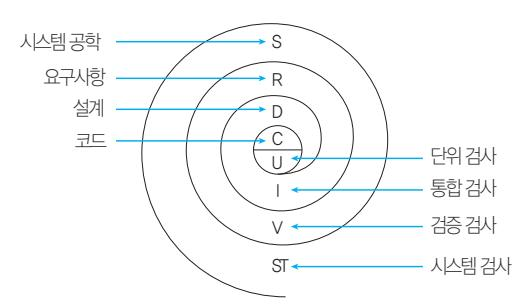

#### 단위 검사

- 코딩이 이루어진 후 소프트웨어 설계의 최소 단위인 모듈에 초점을 맞추어 검사하는 것이다.
- 화이트 박스 검사 기법을 사용하며, 인터페이스, 외부 적 I/O, 자료 구조, 경계 조건 등을 검사한다.

#### 하향식 통합 검사

- 프로그램의 상위 모듈에서 하위 모듈 방향으로 통합하 면서 검사하는 기법이다.
- 일시적으로 필요한 조건만을 가지는 임시로 제공되는 시험용 모듈 스터브(Stub)가 필요하다.

#### 상향식 통합 검사

- 프로그램의 하위 모듈에서 상위 모듈 방향으로 통합하 면서 검사하는 기법이다.
- 가장 하위 단계의 모듈부터 통합 및 검사가 수행되므로 스터브(Stub)는 필요하지 않지만 하나의 주요 제어 모 듈과 관련된 종속 모듈의 그룹인 클러스터가 필요하다.

### 199. 핵심 검사 전략

#### 검증(확인, 인수) 검사

- 소프트웨어가 사용자의 요구사항을 충족시키는가에 중점을 두고 검사하는 방법이다.
- 통합 검사가 끝난 후 전체가 하나의 소프트웨어 단위 로 통합되어 요구사항 명세서를 토대로 진행하며, 블 랙 박스 테스트 기법을 사용한다.
- 검증 검사의 종류

| 형상           |        |       |           |         |       |
|--------------|--------|-------|-----------|---------|-------|
| 소프트웨어 검사(구성  | 구성     | 요소,   | 목록, 유지보수를 |         | 지원하기  |
| 위해 검토, 감사)   | 필요한 모든 | 사항들이  | 제대로       | 표현되었는지를 |       |
| 검사하는         | 기법     |       |           |         |       |
| •개발자의       | 장소에서   | 사용자가  |           | 개발자 앞에서 | 행하    |
| 는 알파 검사      | 검사 기법  |       |           |         |       |
| •통제된        | 환경에서   | 행해지며, | 오류와       | 사용상의    | 문제    |
| 점을           | 사용자와   | 개발자가  | 함께        | 확인하면서   | 기록함   |
| •선정된        | 최종     | 사용자가  | 여러        | 명의 사용자  | 앞에서   |
| 수행하는         | 검사     | 기법    |           |         |       |
| •실업무를 베타 검사 | 가지고    | 사용자가  | 직접        | 시험하는    | 것으로,  |
| 개발자에         | 의해     | 제어되지  | 않은        | 상태에서    | 검사가 행 |
| 해지며,         | 발견된    | 오류와   | 사용상의      | 문제점을    | 기록하   |
| 고            | 개발자에게  | 주기적으로 | 보고함       |         |       |

#### 시스템 검사(System Test)

- 개발된 소프트웨어가 해당 컴퓨터 시스템에서 완벽하게 수행되는가를 검사하는 것이다.
- 시스템 검사의 종류

#### 디버깅

검사 단계에서 검사 사례에 의해 오류를 찾은 후 그 오류 를 수정하는 과정으로, 디버깅 접근법에는 맹목적 강요, 역추적, 원인 제거 등이 있다.

| 복구 검사 | 소프트웨어에 | 여러      | 가지     | 결함을    | 주어   | 실패하도록 | 한    |
|-------|--------|---------|--------|--------|------|-------|------|
|       | 후 올바르게 | 복구되는지를  |        | 확인하는   |      | 검사    |      |
| 보안 검사 | 시스템    | 내에 설치된  | 보호     | 도구가    | 부적당한 |       | 침투로부 |
|       | 터 시스템을 | 보호할     | 수      | 있는지를   | 확인하는 |       | 검사   |
|       | 비정상적인  | 상황에서    |        | 소프트웨어를 |      | 실행시키기 | 위    |
|       | 한 검사로  | 비정상적인   |        | 양, 빈도  | 등의   | 자원을   | 요구하  |
|       | 는 환경에서 | 소프트웨어를  |        | 실행시킴   |      |       |      |
|       | 통합된    | 시스템에서   | 소프트웨어의 |        | 실행   | 시간을   | 검사   |
|       | 하기     | 위한 것으로, | 검사     | 단계의    | 전    | 과정에   | 걸쳐 수 |


- 개발된 소프트웨어의 품질을 항상 최상의 상태로 유지 하기 위한 것으로 소프트웨어 개발 단계 중 가장 많은 노력과 비용이 투입되는 단계이다.
- 소프트웨어가 사용자에게 인수되고, 설치된 후 발생하 는 모든 공학적 작업이다.
- 소프트웨어 유지보수를 용이하게 하려면 시험 용이성, 이해성, 수정 용이성, 이식성 등이 고려되어야 한다.
- 유지보수의 유형

| 수정(Corrective)     |          |         |       |        |
|--------------------|----------|---------|-------|--------|
| 시스템을 보수=수리·교정·     | 운영하면서    | 검사      | 단계에서  | 발견하지   |
| 못한 잠재적인 정정·하자 보수   | 오류를      | 찾아      | 수정하는  | 활동     |
| 소프트웨어의             | 수명       | 기간 중에   | 운영체제나 | 컴파     |
| 일러와 적응(Adaptive)   | 같은 프로그래밍 | 환경      | 변화와   | 주변장치   |
| 또는 다른 보수=환경 적응,    | 시스템      | 요소가     | 향상되거나 | 변경될    |
| 때 기존의 조정 보수        | 소프트웨어에   | 반영하기    |       | 위하여 수행 |
| 하는 활동              |          |         |       |        |
| •소프트웨어의 완전화       |          | 본래 기능에  | 새로운   | 기능을    |
| 추가하거나 (Perfective) | 성능을      | 개선하기    | 위해    | 소프트웨   |
| 어를 보수=기능 개선,       | 확장시키는    | 활동      |       |        |
| •유지보수 기능 보수       | 활동       | 중 가장    | 큰 업무  | 및 비용을  |
| 차지하는               | 활동       |         |       |        |
| 장래의 예방(Preventive) | 유지보수성    | 또는 신뢰성을 |       | 개선하거나  |
| 소프트웨어의 보수          | 오류       | 발생에     | 대비하여  | 미리     |
| 예방 수단을             | 강구해      | 두는      | 활동    |        |

### 200. 핵심 유지보수

### 201. 핵심 외계인 코드

### 203. 핵심 객체지향 기법의 주요 기본 원칙

### 202. 핵심 객체지향 기법

- 아주 오래 전에 개발되어 유지보수 작업이 매우 어려 운 프로그램이다.
- 일반적으로 15년 전 또는 그 전에 개발된 프로그램을 의미하며, 프로그램 내에 문서화(Documentation)를 철저하게 해 두면 외계인 코드를 방지할 수 있다.

- 현실 세계의 개체(Entity)를 기계의 부품처럼 하나의 객체(Object)로 만들어, 기계적인 부품들을 조립하여 제품을 만들 듯이 소프트웨어를 개발할 때도 객체들을 조립해서 작성할 수 있도록 하는 기법이다.

- 현실 세계를 그대로 모형화하므로 사용자와 개발자가 쉽게 이해할 수 있다.
- 구조적 기법의 문제점으로 인한 소프트웨어 위기의 해 결책으로 채택되어 사용되고 있다.
- 소프트웨어의 재사용 및 확장을 용이하게 함으로써 고 품질의 소프트웨어를 빠르게 개발할 수 있으며 유지보 수가 쉽다.
- 객체지향 기법의 구성 요소

| •객체가 | 가지고              | 있는      | 정보로       | 속성이나   | 상태, 분류   |
|-------|------------------|---------|-----------|--------|----------|
| 등을    | 나타냄              |         |           |        |          |
|       | •속성(Attribute), | 상태,     | 변수, 상수,   | 자료     | 구조라고도 함  |
| •객체가 | 수행하는             | 기능으로    | 객체가       | 갖는     | 데이터(속    |
| 성,    | 상태)를             | 처리하는    | 알고리즘      |        |          |
| •객체의 | 상태를              | 참조하거나   |           | 변경하는   | 수단이 되는   |
|       | 것으로, 객체가         | 메시지를    | 받아        | 실행해야   | 할 객체의    |
|       | 구체적인             | 연산을 정의함 |           |        |          |
|       | •메소드(Method,    | 행위),    | 서비스(Se    | rv     | ice), 동작 |
|       | (Operation),     | 연산이라고도  | 함         |        |          |
| •기존의 | 구조적              | 기법에서의   | 함수,       | 프로시저에  | 해당       |
| 하는    | 연산               | 기능      |           |        |          |
| •공통된 | 속성과              | 연산(행위)을 | 갖는        | 객체의    | 집합으로     |
|       | 객체의 일반적인         |         | 타입(Type)을 | 의미함    |          |
| •각각의 | 객체들이             | 갖는      | 속성과       | 연산을    | 정의하고 있   |
| 는     | 틀                |         |           |        |          |
|       | •클래스에           | 속하는 각각의 | 구체적인      | 객체를    | 인스턴      |
|       | 스(Instance)라고    | 함       |           |        |          |
| •객체들 | 간에               | 상호작용을   | 하는        | 데 사용되는 | 수단으      |
| 로     | 객체에게             | 어떤 행위를  | 하도록       | 지시하는   | 명령       |
| •    | 메시지의 구성 요소       | :       | 메시지를      | 받는     | 객체(수신자)  |
| 의     | 이름, 객체가          | 수행할     | 메소드       | 이름,    | 메소드를 수   |
| 행할    | 때 필요한            | 인자(속성값) |           |        |          |

| •데이터와 | 데이터를     |          | 처리하는 함수를 |     | 하나로 묶 |
|--------|----------|----------|----------|-----|-------|
| 는      | 것        |          |          |     |       |
| •캡슐화된 | 객체의      | 세부       | 내용이      | 외부에 | 은폐(정보 |
|        | 은폐)되어,   | 변경이 발생해도 | 오류의      | 파급  | 효과    |
| 가      | 적음       |          |          |     |       |
| •캡슐화된 | 객체들은     | 재사용이     | 용이함      |     |       |
|        | •인터페이스가 | 단순해지고    | 객체       | 간의  | 결합도가  |


| •캡슐화에서                         |         | 가장          | 중요한     | 개념으로       | 다른     | 객체에  |
|---------------------------------|---------|-------------|---------|------------|--------|------|
| 게                               | 자신의     | 정보를         | 숨기고     | 연산만을       | 통하여    | 접    |
| 근을                              | 허용하는    | 것           |         |            |        |      |
| •각                             | 객체의     | 수정이         | 다른 객체에게 | 주는         | 고려되지   |      |
| 은                               | 영향(Side | Effect)을    | 최소화하는   |            | 기술     |      |
| •이미                            | 정의된     | 상위          | 클래스(슈퍼  | 클래스나       |        | 부모   |
| 클래스)의                           |         | 모든 속성과      | 연산을     | 하위         | 클래스가   |      |
| 물려받는                            |         | 것           |         |            |        |      |
| •상속성을                          |         | 이용하면        | 하위      | 클래스는       | 상위     | 클래스  |
| 의                               | 모든      | 속성과 연산을     | 자신의     | 클래스        |        | 내에서  |
| 다시                              | 정의하지    | 않고서도        |         | 즉시 자신의     | 속성으로   |      |
| 사용할                             | 수       | 있음          |         |            |        |      |
| • 다중 상속성(Multiple Inheritance) |         |             |         |            | : 한 개의 | 클    |
| 래스가                             | 2개      | 이상의         | 상위      | 클래스로부터     |        | 속성과  |
| 연산을                             | 상속받는    | 것           |         |            |        |      |
| •불필요한                          |         | 부분을 생략하고    |         | 객체의        | 속성 중   | 가장   |
| 중요한                             | 것에만     | 중점을         | 두어      | 개략화하는      |        | 것, 즉 |
| 모델화하는                           |         | 것           |         |            |        |      |
| •인간이                           | 복잡한     | 문제를         | 다루는     | 데          | 가장     | 기본이  |
| 되는                              | 방법으로,   | 완전한         | 시스템을    | 구축하기       |        | 전에   |
| 그                               | 시스템과    | 유사한         | 모델을     | 만들어서       | 여러     | 가    |
| 지                               | 요인들을    | 테스트할        | 수       | 있음         |        |      |
| •메시지에                          |         | 의해 객체(클래스)가 |         | 연산을        | 수행하게   |      |
| 될                               | 때 하나의   | 메시지에        | 대해      | 각 객체(클래스)가 |        |      |
| 가지고                             | 있는      | 고유한         | 방법으로    | 응답할        | 수      | 있는   |
| •객체(클래스)들은                     |         |             | 동일한     | 메소드명을      | 이용하여   |      |
| 같은                              | 의미의     | 응답을         | 함       |            |        |      |

- 사용자의 요구사항을 분석하여 요구된 문제와 관련된 모든 클래스(객체), 이와 연관된 속성과 연산, 그들 간 의 관계 등을 정의하여 모델링하는 작업이다.
- 분석가에게 주요한 모델링 구성 요소인 클래스, 객체, 속성, 연산들을 표현해서 문제를 모형화할 수 있게 해 준다.
- 객체지향 관점은 모형화 표기법의 전후 관계에서 객체 의 분류, 속성들의 상속, 그리고 메시지의 통신 등을 결합한 것이다.
- 객체는 클래스로부터 인스턴스화되고, 이 클래스를 식 별하는 것이 객체지향 분석의 주요한 목적이다.

#### 객체지향 분석의 방법론

- Rumbaugh(럼바우) 방법 : 가장 일반적으로 사용되는 방 법으로 분석 활동을 객체 모델, 동적 모델, 기능 모델 로 나누어 수행하는 방법

- Booch(부치) 방법 : 미시적(Micro) 개발 프로세스와 거 시적(Macro) 개발 프로세스를 모두 사용하는 분석 방 법으로, 클래스와 객체들을 분석 및 식별하고 클래스 의 속성과 연산을 정의함
- Jacobson 방법 : Use Case를 강조하여 사용하는 분석 방법
- Coad와 Yourdon 방법 : E-R 다이어그램을 사용하여 객체의 행위를 모델링하며, 객체 식별, 구조 식별, 주 제 정의, 속성과 인스턴스 연결 정의, 연산과 메시지 연결 정의 등의 과정으로 구성하는 기법
- Wirfs-Brock 방법 : 분석과 설계 간의 구분이 없고, 고객 명세서를 평가해서 설계 작업까지 연속적으로 수행하 는 기법

### 204. 핵심 객체지향 분석

### 206. 핵심 객체지향 설계

### 205. 핵심 럼바우(Rumbaugh)의 분석 기법

- 모든 소프트웨어 구성 요소를 그래픽 표기법을 이용하 여 모델링하는 기법이다.
- 분석 활동은 객체 모델링, 동적 모델링, 기능 모델링 순으로 이루어진다.

| <b>객체(Object) 모델링</b>     | 정보 모델링이라고도 하며, 시스템에서 요구되는 객체를 찾아내어 속성과 연산 식별 및 객체들 간의 관계를 규정하여 객체 다이어그램으로 표현한 것                                                                |
|---------------------------|------------------------------------------------------------------------------------------------------------------------------------------------|
| <b>동적(Dynamic) 모델링</b>    | 상태도를 이용하여 시간의 흐름에 따른 객체들 사이의 제어 흐름, 상호 작용, 동작 순서 등의 동적인 행위를 표현한 것                                                                              |
| <b>기능(Functional) 모델링</b> | <ul><li>자료 흐름도(DFD)를 이용하여 다수의 프로세스 들간의 자료 흐름을 중심으로 처리 과정을 표현한 것</li> <li>설계 순서 : 입 · 출력 결정 → 자료 흐름도 작성 → 기능을 상세히 기술 → 제약 사항 결정 및 최소화</li></ul> |

- 객체지향 분석(OOA)을 사용해서 생성한 여러 가지 분 석 모델을 설계 모델로 변환하는 작업으로, 시스템 설 계와 객체 설계를 수행한다.
- 최근 소프트웨어 제품의 전형적인 타입인 사용자 중 심, 대화식 프로그램의 개발에 적합하다.


- 객체지향 설계에서 가장 중요한 문제는 시스템을 구성 하는 객체와 속성, 연산을 인식하는 것이다.
- 객체지향 설계를 문서화할 때 객체와 그들의 부객체 (Sub-object)의 계층적 구조를 보여주는 계층 차트를 그리면 유용하다.
- 객체는 순차적으로(Sequentially) 또는 동시적으로 (Concurrently) 구현될 수 있다.
- 객체지향 설계의 설계 개념은 추상화, 정보 은닉, 기능 독립성, 모듈화, 상속성을 바탕으로 하며 이 중 가장 중요한 개념은 모듈화이다.
- 객체지향 설계에서는 현실 세계에서 사용하는 객체를 명사로, 연산이나 객체 서비스를 동사로 표현한다.
- 객체지향 설계를 위해서 럼바우의 객체지향 설계, 부 치(Booch)의 객체지향 설계, 윌리엄 로렌슨(William Lorensen)의 객체지향 설계 방법 등이 제안되었으며 이 중 일반적으로 럼바우의 객체지향 설계가 가장 많 이 사용된다.
- 객체지향 설계 단계 : 문제 정의 → 요구 명세화 → 객체 연산자 정의 → 객체 인터페이스 결정 → 객체 구현

- 새로운 개념의 모듈 단위, 즉 객체라는 단위를 중심으 로 하여 프로그램을 개발하는 기법이다.
- 객체라는 단위를 이용하여 현실 세계에 가까운 방식으 로 프로그래밍한다.
- 현실 세계에 가까운 방식이므로 이해하기 쉽고 조작하 기 쉬운 프로그램을 개발할 수 있다.
- 유지보수가 쉽고 재사용 가능한 프로그램을 만들 수 있다.
- 이미 개발된 프로그램을 이용해 빠르게 확장된 프로그 램을 개발할 수 있다.
- 자연적인 모델링이 가능하고, 소프트웨어의 재사용률 및 유지보수성이 향상된다.
- 객체지향 프로그래밍 언어

| <div><div><span><span></span></span></div><span><b>객체 기반 언어</b></span></div> |                                 |
|------------------------------------------------------------------------------|---------------------------------|
| <span></span>                                                                | Ada, Actor와 같이 객체의 개념만을 지원하는 언어 |
| <div><div><span></span></div><b>클래스 기반 언어</b></div>                          | Clu와 같이 객체와 클래스의 개념을 지원하는 언어    |

### 207. 핵심 객체지향 프로그래밍

### 208. 핵심 소프트웨어의 재사용

객체지향성 언어

- 객체, 클래스, 상속의 개념을 모두 지원하는 가장 좋은 언어
- 초기에 발표된 Simula로부터, Smalltalk, C++, Objective C와 같은 언어가 있음

- 이미 개발된 인정받은 소프트웨어의 전체 혹은 일부분 을 다른 소프트웨어 개발이나 유지에 사용하는 것이다.
- 소프트웨어 개발의 품질과 생산성을 높이기 위한 방법 으로, 기존에 개발한 소프트웨어와 경험, 지식 등을 새 로운 소프트웨어에 적용한다.
- 클래스, 객체 등의 소프트웨어 요소는 소프트웨어 재 사용성을 크게 향상시켰다.

- 재사용이 가능한 요소 : 소스 코드(가장 많이 이용), 응용 분야에 관한 지식, 논리적인 데이터 모형, 프로세스 구 조, 시험 계획, 설계에 관한 결정, 시스템 구조에 관한 지식, 요구 분석 사항, 문서화, 전문적인 기술과 개발 경험, 품질 보증, 응용 분야 지식 등
- 소프트웨어 부품(모듈)의 크기가 작고 일반적인 설계 일수록 재사용률이 높다.
- 소프트웨어 재사용의 이점 : 개발 시간과 비용 단축, 소프 트웨어 품질 및 생산성 향상, 프로젝트 실패 위험 감 소, 시스템 구축 방법에 대한 지식 공유, 시스템 명세, 설계, 코드 등 문서 공유
- 재사용 도입의 문제점
- 어떤 것을 재사용할 것인지 선정해야 한다.
- 시스템에 공통적으로 사용되는 요소들을 발견해야 한다.
- 프로그램의 표준화가 부족하다.
- 새로운 개발 방법론을 도입하기 어렵다.
- 재사용을 위한 관리 및 지원이 부족하다.
- 기존 소프트웨어에 재사용 소프트웨어를 추가하기 어렵다.

 컴포넌트(Component) 객체들의 모임, 대규모 재사용 단위

잠깐만요 !


- 기존에 있던 소프트웨어를 파기하지 않고 새로운 요구에 맞도록 기존 시스템을 이용하여 기존 소프트웨어를 수정 보완하거나 새로운 기능을 추가하여 소프트웨어 성능을 향상시키는 것으로, 예방 유지보수 측면에서 문제를 해결 하는 것이다.
- 유지보수 비용이 소프트웨어 개발 비용의 대부분을 차지 하는 문제를 고려하여 기존 소프트웨어의 데이터와 기능 들의 개조 및 개선을 통해 유지보수성과 품질을 향상시키 려는 기술이다.
- 유지보수 생산성 향상을 통해 소프트웨어 위기를 해결하 는 방법이다.
- 소프트웨어 재공학을 사용하면 위험 부담이 감소되고, 개 발 비용이 절감된다.
- 소프트웨어 재공학도 자동화된 도구를 사용하여 소프트 웨어를 분석하고 수정하는 과정을 포함한다.

#### 주요 활동

- 분석(Analysis) : 기존 소프트웨어의 명세서를 확인하여 소 프트웨어의 동작을 이해하고, 재공학 대상을 선정하는 것
- 개조(재구조, 재구성, Restructuring) -상대적으로 같은 추상적 수준에서 하나의 표현을 다른 표현 형태로 바꾸는 것이다. -기존 소프트웨어의 구조를 향상시키기 위하여 코드를 재구성하는 것으로 소프트웨어의 기능과 외적인 동작 은 바뀌지 않는다.
- 역공학(Reverse Engineering) -기존 소프트웨어를 분석하여 소프트웨어 개발 과정과 데이터 처리 과정을 설명하는 분석 및 설계 정보를 재 발견하거나 다시 만들어내는 작업이다. -일반적인 개발 단계(정공학)와 반대되는 의미로 기존 코드를 복구하는 방법이다. -대상 소프트웨어가 있어야 하며 이로부터 작업이 시작 된다. -역공학의 가장 간단하고 오래된 형태는 재문서화이다.
- 이식(Migration) : 기존 소프트웨어를 다른 운영체제나 하 드웨어 환경에서 사용할 수 있도록 변환하는 작업임
- 재공학의 목표 : 복잡한 시스템을 다루는 방법 구현, 다른 뷰의 생성, 잃어버린 정보의 복구 및 제거, 부작용의 발견

### 209. 핵심 소프트웨어 재공학

### 210. 핵심 CASE

- 소프트웨어 개발 과정에서 사용되는 요구 분석, 설계, 구현, 검사 및 디버깅 과정 전체 또는 일부를 컴퓨터와 전용 소프트웨어 도구를 사용하여 자동화하는 것이다.
- 소프트웨어 생명 주기의 전체 단계를 연결해 주고 자 동화해 주는 통합된 도구를 제공해주는 기술이다.
- 소프트웨어 개발 도구와 방법론이 결합된 것으로, 정 형화된 구조 및 방법(메커니즘)을 소프트웨어 개발에 적용하여 생산성 향상을 구현하는 공학 기법이다.
- 소프트웨어 개발의 모든 단계에 걸쳐 일관된 방법론을 지원한다.
- CASE의 주요 기능 : 소프트웨어 생명주기 전 단계의 연 결, 다양한 소프트웨어 개발 모형 지원, 그래픽 지원 등
- CASE 사용의 이점 : 소프트웨어 개발 기간 단축 및 비 용 절감, 품질 향상, 유지보수 용이, 생산성 향상, 재사 용성 향상, 개발 주기의 표준화, 개발 기법의 실용화, 문서화 용이 등
- CASE 분류

- 정보 저장소(CASE 정보 저장소) : 소프트웨어를 개발하 는 동안에 모아진 정보를 보관하여 관리하는 곳으로, 정 보 저장소에 저장된 정보는 사용자, 도구, 응용 프로그 램 등이 공동으로 사용할 수 있으며, 초기의 소프트웨어 개발 환경에서는 사람이 정보 저장소 역할을 했지만 오 늘날에는 데이터베이스가 정보 저장소 역할을 담당함

| 소프트웨어 | 생명     | 주기의  | 전반부에서             | 사용되는   |
|-------|--------|------|-------------------|--------|
| 것으로,  | 문제를    |      | 기술(Description)하고 | 계획하며   |
| 요구    | 분석과 설계 | 단계를  | 지원하는              | CASE   |
| 소프트웨어 | 생명     | 주기의  | 하반부에서             | 사용되는   |
| 것으로   | 코드의    | 작성과  | 테스트,              | 문서화하는  |
| 과정을   | 지원하는   | CASE |                   |        |
| 소프트웨어 | 생명     | 주기에  | 포함되는              | 전체 과정을 |
| 지원하기  | 위한     | CASE |                   |        |


## 5과목·데이터 통신

### 211. 핵심 데이터 통신의 개요

### 212. 핵심 통신 회선

- 데이터 통신 : 컴퓨터의 발달을 배경으로 하여 생겨난 것 으로, 컴퓨터와 각종 통신기기 사이에서 디지털 형태로 표현된 2진 정보(0과 1)를 송·수신하는 것을 말한다.

- 정보 통신 : 컴퓨터와 통신 기술의 결합에 의해 통신 처 리 기능과 정보 처리 기능은 물론 정보의 변환, 저장 과 정이 추가된 형태의 통신이다.

- 통신의 3요소 : 정보원, 수신원, 전송 매체(=통신 회선)
- 주요 데이터 통신 시스템의 발달 과정

데이터 통신 = 데이터 전송 기술 + 데이터 처리 기술

#### 정보 통신 = 전기 통신(정보 전송) + 컴퓨터(정보 처리)

| SAGE    | 최초의 데이터 통신 시스템         |
|---------|------------------------|
| SABRE   | 최초의 상업용 데이터 통신 시스템     |
| CTSS    | 최초의 시분할 시스템            |
| ARPANET | 인터넷의 효시가 된 통신 시스템      |
| ALOHA   | •최초의 무선(라디오) 패킷 교환 시스템 |
| SNA     | 데이터 통신 시스템의 표준화가 시작    |

#### 꼬임선(Twisted Pair Wire, 이중 나선)

- 전기적 간섭 현상을 줄이기 위해서 균일하게 서로 감 겨있는 형태의 케이블이다.
- 가격이 저렴하고, 설치가 간편하다.
- 거리, 대역폭, 데이터 전송률 면에서 제약이 많다.
- 다른 전기적 신호의 간섭이나 잡음에 영향을 받기가 쉽다.

#### 동축 케이블(Coaxial Cable)

- 주파수 범위(대역폭)가 넓어서 데이터 전송률이 높다.
- 꼬임선에 비해 외부 간섭과 누화의 영향이 적다.
- 신호의 감쇠 현상을 막기 위해 일정 간격마다 중계기 를 설치해야 한다.

- 아날로그와 디지털 신호 전송에 모두 사용한다.
- 고주파 특성이 양호하며, 광대역 전송에 적합하다.
- CATV, 근거리 통신망(LAN), 장거리 전화 등에 다양 하게 사용된다.

#### 광섬유 케이블(Optical Fiber Cable)

- 유리를 원료로 하여 제작된 가느다란 광섬유를 여러 가닥 묶어서 케이블의 형태로 만든 것으로 광 케이블 이라고도 한다.
- 데이터를 빛으로 바꾸어 빛의 반사 원리를 이용하여 전송한다.
- 유선 매체 중 가장 빠른 속도와 높은 주파수 대역폭을 제공한다.
- 대용량, 장거리 전송이 가능하다.
- 가늘고, 가벼워 설치가 용이하다.
- 도청이 어려워 보안성이 뛰어나다.
- 무유도, 무누화의 성질을 가진다.
- 감쇠율이 적어 리피터의 설치 간격이 넓으므로 리피터 의 소요가 적다.
- 설치 비용은 비싸지만 단위 비용은 저렴하다.
- 광섬유 간의 연결이 어려워 설치 시 고도의 기술이 필 요하다.

#### 위성 마이크로파

- 지상에서 쏘아 올린 마이크로 주파수를 통신 위성을 통해 변환, 증폭한 후 다른 주파수로 지상에 송신하는 방식으로, 위성 통신에 사용된다.
- 위성 통신에 사용하고 있는 주파수는 300~3,000MHz 인 UHF(Ultra High Frequency)나 3~30GHz인 SHF(Super High Frequency)를 사용한다.
- 위성 통신 시스템은 통신 위성, 지구국, 채널로 구성된다.
- 대역폭이 넓어 고속·대용량 통신이 가능하고, 통신 비용이 저렴하다.
- 전송 지연 시간이 길고, 보안성이 취약하다.
- 통신 위성은 약 35,800Km 정도의 정지 궤도 상에 위 치하여 지구의 자전 속도로 운행한다.
- 위성 통신 시스템에서는 하나의 통신 위성에 여러 개 의 지구국이 접속하여 사용하므로, 통신 위성을 공동 으로 사용하기 위한 다중 접속 방식이 필요하다.
- FDMA(Frequency Division Multiple Access) : 주 파수 대역을 일정 간격으로 분할하는 방식


- TDMA(Time Division Multiple Access) : 사용 시 간(Time Slot)을 분할하는 방식
- CDMA(Code Division Multiple Access) : 주파수나 시간을 모두 공유하면서 각 데이터에 특별한 코드를 부여하는 방식으로, 산악 지형 또는 혼잡한 도심 지 역에서 통화 품질이 우수함

#### 통신 제어장치의 기능

통신 제어장치는 데이터 전송 회선과 주컴퓨터를 전기적 으로 결합하며, 데이터 신호의 직·병렬 변환을 통해 전 송 문자를 조립 및 분해하는 장치로 컴퓨터를 대신해 데 이터 전송에 관한 전반적인 제어 기능을 수행한다.

| <b>전송 제어</b>      | 다중 접속 제어, 교환 접속 제어, 통신 방식 제어, 우회 중계 회선 설정(경로 설정)                                     |
|-------------------|--------------------------------------------------------------------------------------|
| <b>동기 및 오류 제어</b> | 동기 제어, 오류 제어, 흐름 제어, 응답 제어, 정보 진송 단위의 정합, 데이터 신호의 직ㆍ병렬 변환, 투과성, 정보 표시 형식의 변환, 우선권 제어 |
| <b>그 밖의 기능</b>    | 제어 정보 식별, 기밀 보호, 관리 기능                                                               |

### 213. 핵심 통신 제어장치(CCU)

### 215. 핵심 아날로그 / 디지털 전송

### 216. 핵심 통신 방식

### 217. 핵심 비동기식 전송 / 동기식 전송

### 214. 핵심 주파수 / 대역폭

#### 전처리기(FEP)

호스트 컴퓨터와 단말기 사이에 고속 통신 회선으로 설 치되며, 통신 회선 및 단말기 제어, 메시지의 조립과 분 해, 전송 메시지 검사 등을 수행하므로, 컴퓨터의 부담이 적어진다.

| <span></span>          | <ul><li>단위 시간(주로 1초) 내에 신호 파형이 반복되는 횟수를 의미하는 것으로, 단위는 Hz임</li> <li>단위 시간과의 관계 : f = <span><span><span><span>1</span><span></span></span><sup><span>i</span></sup></span><span>/</span><span>(f</span><span> </span><span>주파수</span>, T<span> </span><span>주기</span>)</span></li> <li>주요 데이터의 주파수 <ul><li>음성 : 300 ~ 3,400Hz</li> <li>−HF(High Frequence) : 3 ~ 30MHz</li> <li>−VHF(Very High Frequence) : 30 ~ 300MHz</li> <li>−UHF(Ultra High Frequence) : 300 ~ 3,000MHz</li> <li>−SHF(Super High Frequence) : 3,000 ~ 30,000MHz</li></ul></li></ul> | <p><b>주파수</b>(Frequency)</p> |
|------------------------|--------------------------------------------------------------------------------------------------------------------------------------------------------------------------------------------------------------------------------------------------------------------------------------------------------------------------------------------------------------------------------------------------------------------------------------------------------------------------------------------------------------------------------------------------------|------------------------------|
| <b>대역폭</b> (Bandwidth) | 주파수의 변화 범위, 즉 상한 주파수와 하한 주파수의 차이                                                                                                                                                                                                                                                                                                                                                                                                                                                                                                                       |                              |

| <b>아날로그 전송</b> | <ul><li>전송 매체를 통해 전달되는 신호가 아날로그 형태인 것</li> <li>신호의 감쇠 현상이 심하므로 장거리 전송 시 증폭기에 의해 신호를 증폭하여 전송하며, 이때 신호에 포함된 잡음까지도 같이 증폭되기 때문에 오류율이 높음</li></ul>                                                                                                                   |
|----------------|-----------------------------------------------------------------------------------------------------------------------------------------------------------------------------------------------------------------------------------------------------------------|
|                |                                                                                                                                                                                                                                                                 |
| <b>디지털 전송</b>  | <ul><li>전송 매체를 통해 전달되는 신호가 디지털 형태인 것</li> <li>장거리 전송 시 중계기(리피터, Repeater)에 의해 원래의 신호 내용을 다시 복원한 다음 전송하는 방식이기 때문에 잡음에 의한 오류율이 낮음</li> <li>대역폭을 효율적으로 이용하여 더 많은 용량을 전송할 수 있음</li> <li>아날로그나 디지털 정보의 암호화를 쉽게 구현할 수 있음</li> <li>전송 장비가 소형화되고 가격이 저렴해지고 있음</li></ul> |
|                |                                                                                                                                                                                                                                                                 |

- 단방향(Simplex) 통신 : 한쪽 방향으로만 전송이 가능한 방식 라디오, TV

- 반이중(Half-Duplex) 통신 : 양방향 전송이 가능하지만 동시에 양쪽 방향에서 전송할 수 없는 방식 무전기, 모뎀을 이용한 데이터 통신
- 전이중(Full-Duplex) 통신 : 동시에 양방향 전송이 가능 한 방식으로, 전송량이 많고, 전송 매체의 용량이 클 때 사용 전화, 전용선을 이용한 데이터 통신

#### 비동기식 전송

- 한 문자를 나타내는 부호(문자 코드) 앞뒤에 Start Bit 와 Stop Bit를 붙여서 Byte와 Byte를 구별하여 전송 하는 방식이다.
- 시작 비트, 전송 문자(정보 비트), 정지 비트로 구성된 한 문자를 단위로 하여 전송하며, 오류 검출을 위한 패 리티 비트(Parity Bit)를 추가하기도 한다.
- 시작 비트는 이진수 0 값을 갖고 1비트 시간만큼 지속 되며, 정지 비트는 이진수 1 값을 갖고 1, 1.5 혹은 2비 트 시간만큼 지속된다.


- 데이터가 전송되지 않을 때 통신 회선은 휴지(Idle) 상 태가 되는데, 문자와 문자 사이의 휴지 시간(Id le Time)이 불규칙하다.
- 2,000bps 이하의 저속, 단거리 전송에 사용한다.
- 문자마다 시작, 정지를 알리기 위한 비트가 2~3Bit씩 추가되므로, 전송 효율이 떨어진다.

#### 동기식 전송

- 미리 정해진 수만큼의 문자열을 한 블록(프레임)으로 만들어 일시에 전송하는 방식이다.
- 프레임 단위로 전송하므로 전송 속도가 빠르다.
- 시작/종료 비트로 인한 오버헤드가 없고, 휴지 시간이 없으므로, 전송 효율이 좋다.
- 주로 원거리 전송에 사용한다.
- 단말기는 반드시 버퍼 기억장치를 내장해야 한다.
- 비트 동기 방식과 블록 동기 방식이 있다.
- 수신기가 데이터 블록의 시작과 끝을 정확히 인식하기 위한 프레임 레벨의 동기화가 필요하다.
- 블록 동기 방식은 문자 동기 방식과 비트 동기 방식으 로 나뉜다.

### 218. 핵심 모뎀(MODEM)

### 219. 핵심 DSU(Digital Service Unit)

### 220. 핵심 신호 변환 방식 - 디지털 변조(Keying)

| <div><div><span><span></span></span></div><span><b>문자 위주 동기 방식</b></span></div> |                                                                                                                    |
|---------------------------------------------------------------------------------|--------------------------------------------------------------------------------------------------------------------|
| <span></span>                                                                   | <div> <ul><li>SYN 등의 동기 문자(전송 제어 문자)에 의해 동기를 맞추는 방식</li> <li>BSC 프로토콜에서 사용</li></ul> </div>                        |
| <div><div><span><span></span></span></div><span><b>비트 위주 동기 방식</b></span></div> | <div> <ul><li>데이터 블록의 처음과 끝에 8비트의 플래그 비트(01111110)를 표시하여 동기를 맞추는 방식</li> <li>HDLC, SDLC 프로토콜에서 사용</li></ul> </div> |

#### 프레임(Frame) 잠깐만요 !

전송할 자료를 일정한 크기로 분리한 것으로, 동기식 전송의 전송 단위이며, 프레임은 데이터뿐만 아니라 행선지 코드, 동기를 위한 제 어 문자, 오류 검출을 위한 패리티나 CRC 등의 추가 정보로 구성됩 니다.

- 컴퓨터나 단말장치로부터 전송되는 디지털 데이터를 아날로그 회선에 적합한 아날로그 신호로 변환하는 변조 (M O d u l a t i o n ) 과정과 그 반대의 복조 (DEModulation) 과정을 수행한다.
- 모뎀의 기능 : 변·복조 기능, 자동 응답 기능, 자동 호 출 기능, 자동 속도 조절 기능, 모뎀 시험(Loop Test) 기능

- 널(Null) 모뎀 : 모뎀을 사용하지 않고 RS-232C 커넥터 를 이용해 2대의 컴퓨터를 직접 접속해서 정보를 교환 할 수 있게 하는 것으로 실제로는 모뎀이 사용되지 않지 만 컴퓨터의 입장에서는 모뎀을 사용하는 것과 같으므 로 모뎀이라고 표현함

- 컴퓨터나 단말장치로부터 전송되는 디지털 데이터를 디지털 회선에 적합한 디지털 신호로 변환하는 과정과 그 반대의 과정을 수행한다.
- 신호의 변조 과정이 없이 단순히 유니폴라(단극성) 신 호를 바이폴라(양극성) 신호로 변환하는 기능만 제공 하기 때문에 모뎀에 비해 구조가 단순하다.
- 디지털 데이터를 공중 데이터 교환망(PSDN)과 같은 디지털 통신망을 이용하여 전송할 때 사용된다.
- 송·수신 기능과 타이밍 회복 기능을 DSU 자체에서 수행한다.
- 속도가 빠르고, 오류율이 낮다.

- 모뎀(MODEM)을 이용하여 디지털 데이터를 아날로 그 신호로 변조하는 방식이다.
- 변조 방식

| <div><span></span></div> <div><b>진폭 편이 변조</b>(ASK)</div>  | <div><ul><li>2진수 0과 1을 서로 다른 진폭의 신호로 변조</li><li>이 방식을 사용하는 모뎀은 구조가 간단하고, 가격이 저렴함</li><li>신호 변동과 잡음에 약하여 데이터 전송용으로 거의 사용되지 않음</li></ul></div> |
|-----------------------------------------------------------|----------------------------------------------------------------------------------------------------------------------------------------------|
| <div><span></span></div> <div><b>주파수 편이 변조</b>(FSK)</div> | <div><ul><li>2진수 0과 1을 서로 다른 주파수로 변조</li><li>1,200bps 이하의 저속도 비동기식 모뎀에서 사용됨</li><li>이 방식을 사용하는 모뎀은 구조가 간단하고, 신호 변동과 잡음에도 강함</li></ul></div>  |


| <span></span> 위상 편이 변조(PSK)                             | <ul><li>2진수 0과 1을 서로 다른 위상을 갖는 신호로 변조</li> <li>파형의 시작 위치를 다르게 하여 신호를 전송</li> <li>한 위상에 1비트(2위상), 2비트(4위상), 또는 3비트(8위상)를 대응시켜 전송하므로, 속도를 증가시킬 수 있음</li> <li>중 · 고속의 동기식 모뎀에 많이 사용</li> <li>종류 : 2위상 편이 변조(DPSK), 4위상 편이 변조(QDPSK), 8위상 편이 변조(ODPSK)</li></ul> |
|---------------------------------------------------------|--------------------------------------------------------------------------------------------------------------------------------------------------------------------------------------------------------------------------------------------------------------|
| <p><b>직교 진폭 변조(QAM)</b></p> <p>= 진폭 위상 변조, 직교 위상 변조</p> | <ul><li>반송파의 진폭과 위상을 상호 변환하여 신호를 얻는 변조 방식</li> <li>제한된 전송 대역 내에서 고속 전송(9,600bps)이 가능함</li> <li>9,600bps 모뎀의 표준 방식으로 권고됨</li> <li>신호의 진폭과 위상을 표시하는 신호의 구분점이 통신 회선의 잡음과 위상 변화에 대하여 우수한 특성을 지닌</li></ul>                                                        |

### 221. 핵심 펄스 코드 변조(PCM)

- 화상, 음성, 동영상 비디오, 가상 현실 등과 같이 연속 적인 시간과 진폭을 가진 아날로그 데이터를 디지털 신호로 변조하는 방식으로, CODEC을 이용한다.
- 펄스 코드 변조(PCM) 순서 : 송신 측(표본화 → 양자화 → 부호화) → 수신 측(복호화 → 여파화)

|                                           | •음성, 영상 등의 연속적인 신호 파형을 일정 시간 간격으로 검출하는 단계                                                                                                                                                                                                                       |
|-------------------------------------------|-----------------------------------------------------------------------------------------------------------------------------------------------------------------------------------------------------------------------------------------------------------------|
| 샤논(Nyquist Shanon)의 표본화 이론 표본화 (Sampling) | : 어떤 신 호 f(t)가 의미를 지니는 최고 주파수보다 2배 이 상의 주파수로 균일한 시간 간격 동안 채집된다 면 이 채집된 데이터는 원래의 신호가 가진 모든 정보를 포함함 •표본화에 의해 검출된 신호를 PAM 신호라고 하 며, 아날로그 형태임 •표본화 횟수 = 2배 × 최고 주파수 •표본화 간격 = 표본화 횟수 •표본화된 PAM 신호를 유한 개의 부호에 대한 대표 값으로 조정하는 과정 •실수 형태의 PAM 신호를 반올림하여 이산적인 정 수형으로 만듦 |
| 양자화 잡음 양자화 (Quantizing)                   | : 표본 측정값과 양자화 파형과의 오 차를 말하며, 주로 PCM 단국장치에서 발생 •양자화 잡음은 양자화 레벨을 세밀하게 함으로써 줄일 수 있으나, 이 경우 데이터의 양이 많아지고 전송 효율이 낮아짐                                                                                                                                                 |
| 양자화 레벨                                    | : PAM 신호를 부호화할 때 2진수로 표현할 수 있는 레벨(양자화 레벨 = 2표본당 전송 비트 수)                                                                                                                                                                                                        |

| <b>부호화</b> (Encoding)  | 양자화된 PCM 펄스의 진폭 크기를 2진수(1 또는 0)로 표시하는 과정 |
|------------------------|------------------------------------------|
| <b>복호화</b> (Decoding)  | 수신된 디지털 신호(PCM 신호)를 PAM 신호로 되돌리는 단계      |
| <b>여파화</b> (Filtering) | PAM 신호를 원래의 입력 신호인 아날로그 신호로 복원하는 과정      |

### 222. 핵심 베이스밴드(Base Band) 전송

### 223. 핵심 다중화기(Multiplexer)

- 컴퓨터나 단말장치 등에서 처리된 디지털 데이터를 다 른 주파수 대역으로 변조하지 않고 직류 펄스의 형태 그대로 전송하는 것으로, 기저대역 전송이라고도 한다.
- 신호만 전송되기 때문에 전송 신호의 품질이 좋다.
- 직류를 사용하므로 감쇠 등의 문제가 있어 장거리 전 송에 적합하지 않다.
- 컴퓨터와 주변장치 간의 통신이나 LAN 등 비교적 가 까운 거리에서 사용된다.

- 하나의 통신 회선에 여러 대의 단말기가 동시에 접속 하여 사용할 수 있도록 하는 장치이다.

- 고속 통신 회선의 주파수나 시간을 일정한 간격으로 나누어 각 단말기에 할당하는 방식으로 운영된다.
- 통신 회선을 공유함으로써 전송 효율을 높이고, 통신 회선의 수와 설치 비용을 줄일 수 있다.
- 다중화기는 주파수 분할 다중화기와 시분할 다중화기 로 구분할 수 있다.
- 입력 회선의 수와 출력 회선의 수가 같다.
- 여러 대의 단말기 속도의 합이 다중화된 하나의 통신 회선 속도와 같다(A + B + C = D).

#### 다중화(Multiplexing) 잠깐만요 !

하나의 통신 회선을 다수의 단말기가 공유할 수 있도록 하는 것으로, 다중화를 위한 장치에는 다중화기, 집중화기, 공동 이용기가 있습 니다.


- 통신 회선의 주파수를 여러 개로 분할하여 여러 대의 단말장치가 동시에 사용할 수 있도록 한 것이다.
- 전송 신호에 필요한 대역폭보다 통신 회선의 유효 대 역폭이 큰 경우에 사용한다.
- 다중화기 자체에 변·복조 기능이 내장되어 있어 모뎀 을 설치할 필요가 없다.
- 시분할 다중화기에 비해 구조가 간단하고 가격이 저렴 하다.
- 대역폭을 나누어 사용하는 각 채널들 간의 상호 간섭을 방지하기 위한 보호 대역(Guard Band)이 필요하다.
- 보호 대역(Guard Band) 사용으로 인한 대역폭의 낭 비가 초래된다.
- 저속(1,200Bps 이하)의 비동기식 전송, 멀티 포인트 방식, 아날로그 신호 전송에 적합하다.

### 224. 핵심 주파수 분할 다중화기(FDM)

### 226. 핵심 역 다중화기(Inverse Multiplexer)

### 227. 핵심 집중화기(Concentrator)

### 225. 핵심 시분할 다중화기(TDM)

- 통신 회선의 대역폭을 일정한 시간 폭(Time Slot)으 로 나누어 여러 대의 단말장치가 동시에 사용할 수 있 도록 한 것이다.
- 디지털 회선에서 주로 이용하며, 대부분의 데이터 통 신에 사용된다.
- 다중화기의 내부 속도와 단말장치의 속도 차이를 보완 해 주는 버퍼가 필요하다.

| <span></span> 동기식 <b>시분할 다중화기(STDM)</b>                                                                                                                                                                                                                                                                                           |  |
|-----------------------------------------------------------------------------------------------------------------------------------------------------------------------------------------------------------------------------------------------------------------------------------------------------------------------------------|--|
|                                                                                                                                                                                                                                                                                                                                   |  |
| <ul><li>모든 단말장치에 균등한(고정된) 시간 폭을 제공함</li> <li>전송되는 데이터의 시간 폭을 정확히 맞추기 위한 동기 비트가 필요함</li> <li>통신 회선의 데이터 전송률이 전송 디지털 신호의 데이터 전송률을 능가할 때 사용함</li> <li>전송할 데이터가 없는 경우에도 시간 폭(Time Slot)이 제공되므로 효율성이 떨어짐</li> <li>송신 측에서는 입력된 데이터를 채널 별로 분리하여 각각의 채널 버퍼에 저장하고, 이를 순차적으로 전송함</li> <li>다중화된 회선의 데이터 전송률은 접속장치들의 데이터 전송률의 합과 같음</li></ul> |  |

비동기식 시분할 다중화기 (ATDM)

- 전송할 데이터가 있는 단말장치에만 시간 폭을 제공하 므로, 전송 효율이 높음
- 동기식 시분할 다중화기보다 많은 수의 단말기들이 전 송 매체에 접속할 수 있음
- 데이터 전송량이 많아질 경우 전송 지연이 생길 수 있음
- 동기식 시분할 다중화기에 비해 접속에 소요되는 시 간이 김
- 주소 제어, 흐름 제어, 오류 제어 등의 기능을 하므로 복잡한 제어 회로와 임시 기억장치가 필요하고, 가격 이 비쌈
- 지능 시분할 다중화기, 확률적 시분할 다중화기, 통계 적 시분할 다중화기라고도 함
- 다중화된 회선의 데이터 전송률은 접속장치들의 데이 터 전송률의 합보다 작음

- 광대역 회선 대신에 2개의 음성 대역 회선을 이용하여 데이터를 전송할 수 있도록 하는 장치이다.
- 광대역 통신 회선을 사용하지 않고도 9,600bps 이상 의 광대역 속도를 얻을 수 있으므로, 통신 비용을 절감 할 수 있다.
- 하나의 통신 회선이 고장나더라고 나머지 하나의 회선 을 통해 1/2 속도로 전송을 계속 유지할 수 있다.
- 여러 가지 변화에 대응해 다양한 전송 속도를 얻을 수 있다.

- 하나 또는 소수의 회선에 여러 대의 단말기를 접속하 여 사용할 수 있도록 하는 장치이다.
- 실제 전송할 데이터가 있는 단말기에만 통신 회선을 할 당하여 동적으로 통신 회선을 이용할 수 있도록 한다.
- 한 개의 단말기가 통신 회선을 점유하면 다른 단말기 는 회선을 사용할 수가 없으므로, 다른 단말기의 자료 를 임시로 보관할 버퍼가 필요하다.
- m개의 입력 회선을 n개의 출력 회선으로 집중화하는 장치로, 입력 회선의 수가 출력 회선의 수보다 같거나 많다.
- 여러 대의 단말기의 속도의 합이 통신 회선의 속도보 다 크거나 같다(A + B + C ≥ D).
- 회선의 이용률이 낮고, 불규칙적인 전송에 적합하다.


### 228. 핵심 통신 속도

### 230. 핵심 전송 제어 문자

### 231. 핵심 HDLC(High-level Data Link Control)의 특징

### 229. 핵심 전송 제어의 기본

| <b>변조 속도</b>  | <ul><li>1초 동안 몇 개의 신호 변화가 있었는가를 나타내는 것(단위<span> </span>: Baud)</li> <li>변조 속도(Baud) = 데이터 신호 속도(Bps) / 변조 시 상태 변화 수</li></ul> |
|---------------|-------------------------------------------------------------------------------------------------------------------------------|
| <b>신호 속도</b>  | <ul><li>1초 동안 전송 가능한 비트의 수(단위<span> </span>: Bps(Bit/Sec))</li> <li>데이터 신호 속도(Bps) = 변조 속도(Baud) × 변조 시 상태 변화 수</li></ul>     |
| <b>전송 속도</b>  | 단위 시간에 전송되는 데이터의 양(문자, 블록, 비트, 단어 수 등)                                                                                        |
| <b>베어러 속도</b> | 데이터 신호에 동기 문자, 상태 신호 등을 합한 속도                                                                                                 |
|               | (단위 <span> </span> : Bps(Bit/Sec))                                                                                            |

#### 변조 시 상태 변화 수 잠깐만요 !

모노 비트(Mono Bit) = 1비트, 디 비트(Di Bit) = 2비트, 트리 비트(Tri Bit) = 3비트, 쿼드 비트(Quad Bit) = 4비트

| <span></span>                   |  | <span></span>                                                                                                       |
|---------------------------------|--|---------------------------------------------------------------------------------------------------------------------|
| <div><b>데이터 통신 회선의 접속</b></div> |  | <div><ul><li>통신 회선과 단말기를 물리적으로 접속하는 단계</li><li>교환 회선을 이용한 포인트 투 포인트 방식이나 멀티 포인트 방식으로 연결된 경우에 필요한 단계</li></ul></div> |
| <div><b>데이터 링크 설정(확립)</b></div> |  | <div>접속된 통신 회선상에서 송ㆍ수신 측 간의 확실한 데이터 전송을 수행하기 위해서 논리적 경로를 구성하는 단계</div>                                              |
| <div><b>정보 메시지 전송</b></div>     |  | <div>설정된 데이터 링크를 통해 데이터를 수신 측에 전송하고, 오류 제어와 순서 제어를 수행하는 단계</div>                                                    |
| <div><b>데이터 링크 종결(해제)</b></div> |  | <div>송ㆍ수신 측 간의 논리적 경로를 해제하는 단계</div>                                                                                |
| <div><b>데이터 통신 회선의 절단</b></div> |  | <div>통신 회선과 단말기 간의 물리적 접속을 절단하는 단계</div>                                                                            |

- 전송 제어 : 데이터의 원활한 흐름을 위하여 입·출력 제어, 회선 제어, 동기 제어, 오류 제어, 흐름 제어 등 을 수행하는 것
- OSI 7 참조 모델의 데이터 링크 계층(2계층)에서 수행 하는 기능이다.
- 전송 제어 절차 : 데이터 통신 회선의 접속 → 데이터 링 크 설정(확립) → 정보 메시지 전송 → 데이터 링크 종 결 → 데이터 통신 회선의 절단

링크 관리, 프레임의 시작 및 끝의 구별과 오류 제어 등 의 기능을 한다.

| 문 자                      | 기 능                            |
|--------------------------|--------------------------------|
| SYN(SYNchronous Idle)    | 문자 동기                          |
| SOH(Start Of Heading)    | 헤딩의 시작                         |
| STX(Start of TeXt)       | 본문의 시작 및 헤딩의 종료                |
| ETX(End of TeXt)         | 본문의 종료                         |
| ETB(End of T             | ransm iss ion                  |
| Block)                   | 블록의 종료                         |
| EOT(End Of Transmission) | 전송 종료 및 데이터 링크의 해제             |
| ENQ(ENQuiry)             | 상대편에 데이터 링크 설정 및               |
| ACK(ACKnowledge)         | 수신된 메시지에 대한 긍정 응답              |
| (Negative                | AcKnowledge) 수신된 메시지에 대한 부정 응답 |

- 비트(Bit) 위주의 프로토콜로, 각 프레임에 데이터의 흐름을 제어하고 오류를 검출할 수 있는 비트 열을 삽 입하여 전송한다.
- 포인트 투 포인트 및 멀티 포인트, 루프 방식에서 모두 사용 가능하다.
- 단방향, 반이중, 전이중 통신을 모두 지원하며, 동기식 전송 방식을 사용한다.
- 오류 제어를 위해 Go-Back-N과 선택적 재전송 (Selective Repeat) ARQ를 사용한다.
- 흐름 제어를 위해 슬라이딩 윈도우 방식을 사용한다.
- 전송 제어상의 제한을 받지 않고 자유로이 비트 정보를 전송할 수 있는 것을 비트 투과성(투명성)이라고 한다.
- 비트 투과성(투명성)을 보장하기 위한 기능으로 비트 스터핑(Bit Stuffing)이 사용 된다.


- 플래그(Flag) : 프레임의 시작과 끝을 나타내는 고유한 비트 패턴(01111110)으로 각 통화로의 혼선을 방지하기 위해 동기를 유지함
- FCS(프레임 검사 순서 필드) : 프레임 내용에 대한 오류 검출을 위해 사용되는 부분으로, 일반적으로 CRC 코 드가 사용

- 전송 효율과 신뢰성이 높다.
- HDLC 프레임 구조

|      | 헤더 텍스트 트레일러                         |
|------|-------------------------------------|
| 플래그  | 주소부 제어부 정보부 FCS 플래그                 |
| 8Bit | 8Bit(확장가능) 8Bit 임의Bit 16/32Bit 8Bit |
| ◀    | ▶                                   |
|      | ◀ ▶◀                                |
| ▶◀   | ▶◀ ▶◀ ▶◀ ▶◀                         |

#### 비트 스터핑(Bit Stuffing) 잠깐만요 !

- 플래그(Flag)를 제외한 모든 비트에 연속적으로 5개의 1이 입력 되면 그 다음 여섯 번째에는 0을 강제로 추가(Stuffing)하여 송신합 니다.

- 프레임 내에 연속해서 6개의 1이 입력되면 플래그(Flag), 7개 이상 의 1이 연속해서 입력되면 오류 프레임으로 인식됩니다.

- HDLC의 프레임 종류

| <b>정보() 프레임 (Information Frame)</b>  | <ul><li> 제어부가 '0'으로 시작하는 프레임</li><li> 사용자 데이터를 전달하거나 피기백킹(Piggybacking) 기법을 통해 데이터에 대한 확인 응답을 보낼 때 사용</li></ul> |
|--------------------------------------|-----------------------------------------------------------------------------------------------------------------|
| <b>감독(S) 프레임 (Supervisor Frame)</b>  | <ul><li> 제어부가 '10'으로 시작하는 프레임</li><li> 오류 제어와 흐름 제어를 위해 사용</li></ul>                                            |
| <b>비번호(U) 프레임 (Unnumbered Frame)</b> | <ul><li> 제어부가 '11'로 시작하는 프레임</li><li> 링크의 동작 모드 설정과 관리, 오류 회복을 수행함</li></ul>                                    |

- HDLC의 데이터 전송 모드 : 데이터 전송 모드는 제어부 에서 관리하는 U프레임에 의해 설정

| <b>표준(정규 응답 모드(NRM))</b> | <ul><li>반이중 통신을 하는 포인트 투 포인트 또는 멀티 포인트 불균형 링크 구성에 사용</li><li>종국은 주국의 허가(Poll)가 있을 때에만 송신</li></ul>                         |
|--------------------------|----------------------------------------------------------------------------------------------------------------------------|
| <b>비동기 응답 모드(ARM)</b>    | <ul><li>전이중 통신을 하는 포인트 투 포인트 불균형 링크 구성에 사용</li><li>종국은 주국의 허가(Poll) 없이도 송신이 가능하지만, 링크 설정이나 오류 복구 등의 제어 기능은 주국만 함</li></ul> |

### 232. 핵심 HDLC의 프레임 및 전송 모드

### 233. 핵심 회선 제어 방식

### 234. 핵심 오류의 발생 원인

| <span></span>                               |                                                                                                                                                                                                                                                                                                                                                   |
|---------------------------------------------|---------------------------------------------------------------------------------------------------------------------------------------------------------------------------------------------------------------------------------------------------------------------------------------------------------------------------------------------------|
| <b>경쟁 (Contention) 방식</b>                   | <ul><li>회선 접속을 위해서 서로 경쟁하는 방식</li> <li>송신 요구를 먼저 한 쪽이 송신권을 가짐</li> <li>포인트 투 포인트 방식에서 주로 사용</li> <li>데이터 링크가 설정되면 정보 전송이 종료되기 전까지는 데이터 링크의 종결이 이루어지지 않고 독점적으로 정보를 전송함</li> <li>대표적인 시스템으로는 ALOHA가 있음</li></ul>                                                                                                                                    |
| <p><b>폴링/셀렉션 (Polling/Selection) 방식</b></p> | <ul><li>주컴퓨터에서 송ㆍ수신 제어권을 가지고 있는 방식으로 트래픽이 많은 멀티 포인트 방식에서 사용</li> <li><b>폴링(Polling)</b><span> </span>: 주컴퓨터에서 단말기에게 전송할 데이터가 있는지를 물어 전송할 데이터가 있다면 전송을 하기(Poll)하는 방식으로, 단말기에서 컴퓨터로 보낼 데이터가 있는 경우에 사용</li> <li><b>셀렉션(Selection)</b><span> </span>: 주컴퓨터가 단말기로 전송할 데이터가 있는 경우 그 단말기가 받을 준비가 되었는가를 묻고, 준비가 되어 있다면 주컴퓨터에서 단말기로 데이터를 전송하는 방식</li></ul> |

- 감쇠 : 전송 신호 세력이 전송 매체를 통과하는 과정에 서 거리에 따라 약해지는 현상

- 지연 왜곡 : 하나의 전송 매체를 통해 여러 신호를 전달 했을 때 주파수에 따라 그 속도가 달라 생기는 오류
- 상호 변조(간섭) 잡음 : 서로 다른 주파수들이 하나의 전 송 매체를 공유할 때 주파수 간의 합(合)이나 차(差)로 인해 새로운 주파수가 생성되는 잡음
- 누화 잡음 = 혼선 : 인접한 전송 매체의 전자기적 상호 유도 작용에 의해 생기는 잡음으로, 전화 통화중 다른 전화의 내용이 함께 들리는 현상
- 충격성 잡음 : 번개와 같은 외부적인 충격 또는 통신 시 스템의 결함이나 파손 등의 기계적인 충격에 의해 생 기는 잡음으로, 디지털 데이터를 전송하는 경우 중요 한 오류 발생 요인이 됨


- 시스템적 왜곡 : 전송 매체에서 언제든지 일어날 수 있 는 왜곡으로 손실, 감쇠, 하모닉 왜곡(신호의 감쇠가 진폭에 의해 달라지는 것) 등이 있음

### 235. 핵심 전송 오류 제어 방식

### 236. 핵심 자동 반복 요청(ARQ)

### 237. 핵심 오류 검출 방식

### 238. 핵심 회선 교환 방식

| <b>전진(순방향) 오류 수정 (FEC)</b> | <ul><li> 재전송 요구 없이 수신 측에서 스스로 오류 검출과 수정을 하는 방식</li> <li> 역채널이 필요 없고, 연속적인 데이터 흐름이 가능함</li> <li> 데이터 비트 이외에 오류 검출 및 수정을 위한 비트(잉여 비트)들이 추가로 전송되어야 하기 때문에 전송 효율이 떨어짐</li> <li> 해밍 코드, 상승 코드 방식이 있음</li></ul> |
|----------------------------|-----------------------------------------------------------------------------------------------------------------------------------------------------------------------------------------------------------|
| <b>후진(역방향) 오류 수정 (BEC)</b> | <ul><li> 데이터 전송 과정에서 오류가 발생하면 송신 측에 재전송을 요구하는 방식</li> <li> 패리티 검사, CRC, 블록 합 방식 등을 사용하여 오류를 검출하고, 오류 제어는 자동 반복 요청(ARQ)에 의해 이루어짐</li></ul>                                                                 |

오류 발생 시 수신 측은 오류 발생을 송신 측에 통보하고, 송 신 측은 오류 발생 블록을 재전송하는 모든 절차를 의미한다.

| <span></span> 정지-대기(Stop-and-Wait) ARQ | <ul><li>송신 측에서 한 개의 블록을 전송한 후 수신 측으로부터 응답을 기다리는 방식</li> <li>구현 방법은 가장 단순하지만, 전송 효율이 떨어짐</li></ul>                                                                                                                                                      |
|----------------------------------------|--------------------------------------------------------------------------------------------------------------------------------------------------------------------------------------------------------------------------------------------------------|
| <p>연속(Continuous) ARQ</p>              | <ul><li>연속적으로 데이터 블록을 보내는 방식</li> <li>Go-Back-N ARQ<span> </span>: 오류가 발생한 블록 이후의 모든 블록을 재전송함</li> <li>선택적 재전송(Selective Repeat) ARQ<span> </span>: 오류가 발생한 블록만을 재전송하는 방식으로, 수신 측에서 데이터를 처리하기 전에 원래 순서대로 조립해야 하므로, 더 복잡한 논리회로와 큰 용량의 버퍼가 필요함</li></ul> |
| <p>적응적(Adaptive) ARQ</p>               | <ul><li>데이터 블록의 길이를 채널의 상태에 따라 그때그때 동적으로 변경하는 방식으로, 전송 효율이 제일 좋음</li> <li>제어회로가 복잡하고, 비용이 많이 들어 현재는 거의 사용되지 않음</li></ul>                                                                                                                               |

| (Parity Bit)를 추가하여 오류 검출 시에 발생하면 검출이 불가능함 패리티 검사 리티 체크가 있음                                                               | •전송 비트에 1비트의 검사 비트인 패리티 비트 •가장 간단한 방식이지만, 2개의 비트에 오류가 동 •오류를 검출만 할 수 있고, 수정은 하지 못함 •홀수/짝수 수직 패리티 체크와 홀수/짝수 수평 패                                      |
|--------------------------------------------------------------------------------------------------------------------------|------------------------------------------------------------------------------------------------------------------------------------------------------|
| •짝수 수직 패리티 검사를 블록 합 검사(B Sum Check) 라고도 한다. •동기식 전송에서 주로 사용함 순환 중복 검사(CRC) 드는 데 사용 가장 많이 사용함 수정하는 방식 잉여 비트가 많이 필요함 해밍 코드 | lock •다항식 코드를 사용하여 오류를 검출하는 방식 •HDLC 프레임의 FCS(프레임 검사 순서 필드)를 만 •집단 오류를 검출할 수 있고, 검출률이 높으므로 •수신 측에서 오류가 발생한 비트를 검출한 후 직접 •1비트의 오류만 수정이 가능하며, 정보 비트 외에 |
| •전송 비트 중 1, 2, 4, 8, 16, 32, 64, …, 2                                                                                    | n 번째를 오 류 검출을 위한 패리티 비트로 사용함                                                                                                                         |
| 해밍 거리(Hamming Distance) 를 수정함 상승 코드 •여러 비트의 오류를 수정할 수 있음                                                                 | : 송신 비트와 수 신 비트 중 서로 다른 비트의 수(오류 비트 수) •순차적 디코딩과 한계값 디코딩을 사용하여 오류                                                                                    |

- 통신을 원하는 두 지점을 교환기를 이용하여 물리적으로 접속시키는 방식이다.
- 데이터 전송 전에 먼저 물리적 통신 회선을 통한 연결이 필요하다.
- 접속이 되고 나면 그 통신 회선은 전용 회선에 의한 통신 처럼 데이터가 전달된다(고정 대역 전송).
- 접속에는 긴 시간이 소요되나 일단 접속되면 교환기 내에 서 전송 지연이 거의 없어 실시간 전송이 가능하다.
- 데이터 전송에 필요한 전체 시간이 축적 교환 방식에 비 해 길다.
- 데이터가 전송되지 않는 동안에도 접속이 유지되기 때문 에 데이터 전송이 연속적이지 않은 경우 통신 회선이 낭 비된다.


- 일정한 데이터 전송률을 제공하므로 동일한 전송 속도가 유지된다.
- 전송된 데이터의 오류 제어나 흐름 제어는 사용자에 의해 수행된다.
- 공간 분할 교환 방식과 시분할 교환 방식으로 나뉘고, 시 분할 교환 방식에는 TDM 버스 교환 방식, 타임 슬롯 교 환 방식, 시간 다중화 교환 방식이 있다.
- 통신 과정 : 호(링크) 설정 → 데이터 전송 → 호(링크) 해제
- 제어 신호 방식

| <span></span> 감시(관리) 제어 신호 | <ul><li>상대방과 통화하는 데 필요한 자원을 이용할 수 있는지를 결정하고 알리는 데 사용되는 제어 신호</li> <li>서비스 요청, 응답, 경보 및 휴지 상태 복귀 신호 등의 기능 수행</li></ul> |
|----------------------------|-----------------------------------------------------------------------------------------------------------------------|
| <p><b>주소 제어 신호</b></p>     | 상대방을 식별하고 경로를 배정하여 전화를 울리게 함                                                                                          |
| <p><b>호 정보 제어 신호</b></p>   | 신호음, 연결음, 통화중 신호음 등 호의 상태 정보를 송신자에게 제공하는 역할 수행                                                                        |
| <p><b>망 관리 제어 신호</b></p>   | 통신망의 전체적인 운영, 유지, 고장 수리 등을 위해 사용                                                                                      |

송신 측에서 전송한 데이터를 송신 측 교환기에 저장시 켰다가 이를 다시 적절한 통신 경로를 선택하여 수신 측 터미널에 전송하는 방식이다.

| <div><span></span></div> <div><b>메시지 교환 방식</b></div>                                                                                                                                                                       |  |
|----------------------------------------------------------------------------------------------------------------------------------------------------------------------------------------------------------------------------|--|
| <span></span>                                                                                                                                                                                                              |  |
| <ul><li>교환기가 일단 송신 측의 메시지를 받아서 저장한 후 전송 순서가 되면 수신 측으로 전송하는 방식</li> <li>각 메시지마다 전송 경로를 결정하고, 수신 측 주소를 붙여서 전송함</li> <li>전송 메시지는 추후 검색 및 속도나 코드 변환이 가능함</li> <li>전송 지연 시간이 매우 길</li> <li>응답 시간이 느려 대화형 데이터 전송에 부적절함</li></ul> |  |

### 239. 핵심 축적 교환 방식

### 240. 핵심 패킷 교환 방식의 종류

패킷 교환 방식

- 메시지를 일정한 길이의 패킷으로 잘라서 전송하는 방식
- 패킷 교환망은 OSI 참조 모델의 네트워크 계층에 해 당함
- 회선 이용률이 높음
- 수신 측에서 분할된 패킷을 재조립해야 함
- 응답 시간이 빠르므로, 대화형 응용이 가능함
- 음성 전송보다 데이터 전송에 더 적합함
- 가상 회선 방식과 데이터그램 방식이 있음
- 전송에 실패한 패킷의 경우 재전송이 가능함
- 데이터의 전송 속도 조절이나 코드 변환이 가능함
- 패킷 단위로 헤더를 추가하므로 패킷별 오버헤드가 발 생함
- 패킷(Packet) : 전송 혹은 다중화를 목적으로, 메시지 를 일정한 비트 수로 분할하여 송·수신 측 주소와 제 어 정보 등을 부가하여 만든 데이터 블록
- Clear Request Packet : 가상 회선 패킷 교환 방식에 서 모든 패킷을 전송한 다음 확립된 접속을 끝내기 위 해 마지막으로 전송하는 패킷
- 패킷의 조립 및 분해 기능이 없는 비패킷형 단말기는 PAD (Packet Assembler/Disassembler)에 의해서 패킷의 조립 및 분해가 이루어짐

| <span></span>              |  | <span></span>                                                                                                                                                                                                                               |
|----------------------------|--|---------------------------------------------------------------------------------------------------------------------------------------------------------------------------------------------------------------------------------------------|
| <div><b>가상 회선 방식</b></div> |  | <div><ul><li>단말기 상호 간에 논리적인 가상 통신 회선을 미리 설정하여 송신지와 수신지 사이의 연결을 확립한 후에 설정된 경로를 따라 패킷들을 순서적으로 운반하는 방식</li><li>통신이 이루어지는 컴퓨터 사이에 데이터 전송의 안정, 신뢰성이 보장됨</li><li>패킷의 송·수신 순서가 같음</li><li>통신 과정 : 호(Call) 설정 → 데이터 전송 → 호(Call) 해제</li></ul></div> |
| <div><b>데이터그램 방식</b></div> |  | <div><ul><li>연결 경로를 설정하지 않고 인접한 노드들의 트래픽(전송량) 상황을 감안하여 각각의 패킷들을 순서에 상관없이 독립적으로 운반하는 방식</li><li>패킷마다 전송 경로가 다르므로 송·수신 순서가 다를 수 있음</li><li>소수의 패킷으로 구성된 짧은 데이터 전송에 적합함</li></ul></div>                                                        |


- 패킷 다중화 : 동시에 다수의 상대 터미널과 통신을 수 행하도록 하는 기능
- 경로 제어(Routing) : 가장 효율적인 전송로를 선택하는 기능
- 논리 채널 : 송·수신 측 단말기 사이에서 논리 채널(가 상 회선)을 설정하는 기능
- 순서 제어 : 패킷의 송·수신 순서를 제어하는 기능
- 트래픽 제어(Traffic Control) : 전송되는 패킷의 흐름 또 는 그 양을 조절하기 위해 교착 상태(Dead Lock)의 방지, 흐름 제어 등을 수행함
- 오류 제어 : 오류를 검출하고 정정하는 기능

### 241. 핵심 패킷 교환망의 기능

### 242. 핵심 경로 제어(Routing)

#### 경로 설정 방식

| <b>고정 경로 제어(Static Routing) = 착국 부호 방식</b> | 네트워크 내의 모든 쌍에 대해서 경로를 미리 정해 놓은 방식 |
|--------------------------------------------|-----------------------------------|
| <b>적응 경로 제어(Adaptive Routing)</b>          | 전송 경로를 동적으로 결정하는 방식               |

- 송·수신 측 간의 전송 경로 중에서 최적의 패킷 교환 경로를 설정하는 기능이다.
- 경로 설정 요소 : 성능 기준, 경로의 결정 시간과 장소, 정보 발생지, 경로 정보의 갱신 시간

#### 경로 설정 프로토콜

|                                            | •하나의 자율 시스템(AS) 내의 라우팅에 사용되는 프로 토콜                                                                                   |
|--------------------------------------------|----------------------------------------------------------------------------------------------------------------------|
| RIP IGP                                    | : 소규모 동종의 네트워크 내에서 효율적인 방법으로, 최대 홉(Hop) 수를 15로 제한                                                                    |
| OSPF                                       | : 홉(Hop) 수에 제한이 없어 대규모 네트워크에서 많이 사용되는 프로토콜로, 라우팅 정보에 변화가 있을 때 변화된 정보만 네트워크 내의 모든 라우터에 알림                             |
| EGP 자율 시스템(AS) 간의 라우팅, 즉 게이트웨이 간의 라우팅에 BGP | 사용되는 프로토콜 •자율 시스템(AS) 간의 라우팅 프로토콜로, EGP의 단점을 보완하기 위해 만들어짐 •초기에 BGP 라우터들이 연결된 때에는 전체 경로 제어표 를 교환하고, 이후에는 변화된 정보만을 교환함 |

| <b>범람 경로 제어(Flooding)</b>       | 네트워크 정보를 요구하지 않고, 송수신처 사이에 존재하는 모든 경로로 패킷을 전송 |
|---------------------------------|-----------------------------------------------|
| <b>임의 경로 제어(Random Routing)</b> | 인접하는 교환기 중 하나를 임의로 선택하여 전송하는 방식               |

### 244. 핵심 망(Network)의 구성 형태

### 243. 핵심 트래픽 제어(Traffic Control)

#### 폭주(혼잡) 제어

네트워크 내의 패킷 수를 조절하여 네트워크의 오버플로 (Overflow)를 방지하는 기능을 한다.

#### 교착 상태 방지

패킷이 같은 목적지를 갖지 않도록 할당하고, 교착 상태 발생 시에는 교착 상태에 있는 한 단말장치를 선택하여 패킷 버퍼를 폐기한다.

네트워크의 보호, 성능 유지, 네트워크 자원의 효율적인 이용을 위해 전송되는 패킷의 흐름 또는 그 양을 조절하 는 기능이다.

#### 흐름 제어(Flow Control)

네트워크 내의 원활한 흐름을 위해 송·수신 측 사이에 전송되는 패킷의 양이나 속도를 규제하는 기능이다.

| <div><div></div><span><b>정자-대기 (Stop-and-Wait)</b></span></div>    | <ul><li>수신 측의 확인 신호(ACK)를 받은 후에 다음 패킷을 전송하는 방식</li> <li>한 번에 하나의 패킷만을 전송할 수 있음</li></ul>                                                                                                             |
|--------------------------------------------------------------------|------------------------------------------------------------------------------------------------------------------------------------------------------------------------------------------------------|
| <div><div></div><span><b>슬라이딩 윈도 (Sliding Window)</b></span></div> | <ul><li>수신 측의 확인 신호를 받지 않더라도 미리 정해진 패킷의 수만큼 연속적으로 전송하는 방식</li> <li>한 번에 여러 개의 패킷을 전송할 수 있어 전송 효율이 좋음</li> <li><b>윈도우 크기(Window Size)</b>: 수신 측의 확인 신호(ACK) 없이도 전송할 수 있는 패킷의 개수로, 상황에 따라 변함</li></ul> |

#### 성형(Star, 중앙 집중형)

- 중앙에 중앙 컴퓨터가 있고, 이를 중심으로 단말기들 이 연결되는 중앙 집중식의 네트워크 구성 형태이다.
- 단말기의 추가와 제거가 쉽다.
- 교환 노드의 수가 가장 적다.


#### 링형(Ring, 루프형)

- 컴퓨터와 단말기들을 서로 이웃하는 것끼리 포인트 투 포인트 방식으로 연결시킨 형태이다.
- 데이터는 단방향 또는 양방향으로 전송할 수 있으며, 단방향 링의 경우 컴퓨터, 단말기, 통신 회선 중 어느 하나라도 고장나면 전체 통신망에 영향을 미친다.

#### 버스형(Bus)

- 한 개의 통신 회선에 여러 대의 단말기가 연결되어 있 는 형태이다.
- 물리적 구조가 간단하고, 단말기의 추가와 제거가 용 이하다.

#### 계층형(Tree, 분산형)

- 중앙 컴퓨터와 일정 지역의 단말기까지는 하나의 통신 회선으로 연결시키고, 이웃하는 단말기는 일정 지역 내에 설치된 중간 단말기로부터 다시 연결시키는 형태이다.
- 분산 처리 시스템을 구성하는 방식이다.

#### 망형(Mesh)

- 모든 지점의 컴퓨터와 단말기를 서로 연결한 형태로, 노드의 연결성이 높다.
- 많은 단말기로부터 많은 양의 통신을 필요로 하는 경 우에 유리하다.
- 공중 데이터 통신망에서 사용되며, 통신 회선의 총 경 로가 가장 길다.
- 통신 회선 장애 시 다른 경로를 통하여 데이터를 전송 할 수 있다.
- 모든 노드를 망형으로 연결할 때 필요한 회선 수(노드 = n)는 n(n-1) <sup>2</sup> 개이다.

- 광대역 통신망과는 달리 학교, 회사, 연구소 등 한 건물 이나 일정 지역 내에서 컴퓨터나 단말기들을 고속 전송 회선으로 연결하여 프로그램 파일 또는 주변장치를 공 유할 수 있도록 한 네트워크 형태이다.
- 단일 기관의 소유, 제한된 지역 내의 통신이다.
- 광대역 전송 매체의 사용으로 고속 통신이 가능하다.
- 경로 선택이 필요 없고, 오류 발생률이 낮다.

| 물리 계층     | OSI 7계층의 물리 계층과 동일한 기능을 제공                                                                                                         |
|-----------|------------------------------------------------------------------------------------------------------------------------------------|
| 데이터 링크 계층 | <ul><li>하위 계층인 매체 접근 제어(MAC) 계층과 상위 계층인 논리 링크 제어(LLC) 계층으로 나뉜</li> <li>매체 접근 제어(MAC) 방식의 종류 : CSMA, CSMA/CD, 토큰 버스, 토큰 링</li></ul> |

### 245. 핵심 LAN(근거리 통신망)

### 246. 핵심 CSMA/CD 방식

- 전송 매체로 꼬임선, 동축 케이블, 광섬유 케이블 등을 사용한다.
- 망의 구성 형태에 따라서 스타형, 버스형, 링형, 계층 (트리)형으로 분류된다.
- LAN의 계층 구조는 물리 계층과 데이터 링크 계층으 로 나눠진다.

- IEEE 802의 주요 표준 규격

| 802.1 | 전체의 구성      | 802.5  | 토큰 링 방식      |
|-------|-------------|--------|--------------|
| 802.2 | 논리 링크 제어 계층 | 802.6  | 도시형 통신망(MAN) |
| 802.3 | CSMA/CD 방식  | 802.11 | 무선 LAN       |
| 802.4 | 토큰 버스 방식    |        |              |

- 채널의 사용권을 서로 경쟁하여 확보하는 방식으로 노 드 간의 충돌을 허용하는 네트워크 접근 방식이다.
- 통신 회선이 사용중이면 일정 시간 동안 대기하고, 통 신 회선상에 데이터가 없을 때에만 데이터를 송신하 며, 송신중에도 전송로의 상태를 계속 감시한다.
- 전송 중에 충돌이 감지되면 패킷의 전송을 즉시 중단 하고 충돌이 발생한 사실을 모든 스테이션들이 알 수 있도록 간단한 통보 신호를 송신한다.
- 노드 장애가 시스템 전체에 영향을 주지 않으며, 장애 처리가 간단하다.
- 버스형 또는 계층(트리)형 LAN에 가장 일반적으로 이 용된다.
- 다른 매체 접근 제어 방식에 비해 알고리즘(처리 기법) 이 간단하여 쉽게 구현할 수 있다.
- 일정 길이 이하의 데이터를 송신할 경우 충돌을 검출 할 수 없다.
- 전송량이 적을 때 매우 효율적이고 신뢰성이 높다.
- 전송량이 많아지면 충돌이 잦아져서 채널의 이용률이 떨어지고 전송 지연 시간이 급격히 증가한다.


- 충돌 발생 시 다른 노드에서는 데이터를 전송할 수 없 으며, 지연 시간을 예측하기 어렵다.
- 충돌과 채널 경쟁을 위한 기법에는 non persistent, 1-persistent, p-persistent 기법이 있으며, 이중 가 장 효율적인 1-persistent 기법이 주로 사용된다.
- CSMA/CD 방식을 사용하는 LAN을 이더넷(Ethernet) 이라고 한다.
- CSMA/CD의 의미
- CS(Carrier Sense) : 통신 회선이 사용중인지를 점검 -MA(Multiple Access) : 통신 회선이 비어 있으면 누 구든지 사용 가능 -CD(Collision Detection) : 데이터 프레임을 전송하 면서 충돌 여부를 조사
- 이더넷 시스템의 규격

| 10 BASE T                                                    | 10은 전송 속도가 10Mbps, BASE는 베이스밴드 방식, T는 전송 매체로 꼬임선(Twisted Pair Wire) 케이블을 사용함을 나타냄                                                                           |
|--------------------------------------------------------------|-------------------------------------------------------------------------------------------------------------------------------------------------------------|
| 10 BASE 2                                                    | 얇은 동축 케이블을 이용하며, 2는 한 세그먼트의 최장 거리가 약 200m임을 나타냄                                                                                                             |
| 10 BASE 5                                                    | 굵은 동축 케이블을 이용하며, 5는 한 세그먼트의 최장 거리가 500m임을 나타냄                                                                                                               |
| 10 BASE F 고속 이더넷 (Fast Ethernet) 기가비트 이더넷 (Gigabit Ethernet) | F는 광섬유 케이블을 이용하는 이더넷임을 나타냄 100 BASE T라고도 불리는 이더넷의 고속 버전. CSMA/CD를 사용하며, 100Mbps의 전송 속도를 지원함 •CSMA/CD를 사용하며, 1Gbps의 전송 속도를 지원 •기존의 이더넷 및 고속 이더넷과 완벽한 호환성을 지님 |

### 247. 핵심 VAN(부가 가치 통신망)

### 248. 핵심 ISDN(종합 정보 통신망)

### 249. 핵심 인터넷의 주소 체계

- 공중 통신 사업자로부터 통신 회선을 임대하여 하나의 사설망을 구축하고 이를 통해 정보의 축적, 가공, 변환 처리 등 부가 가치를 첨가한 후 불특정 다수를 대상으 로 서비스를 제공하는 통신망이다.
- 계층 구조 : 정보 처리 계층, 통신 처리 계층, 네트워크 계층, 기본 통신 계층
- 기능 : 전송 기능, 교환 기능, 통신 처리 기능, 정보 처 리 기능

- 통신 처리 기능은 축적 교환 기능과 변환 기능으로 나 눠진다.

| <b>축적 교환 기능</b> | 전자 사서함, 데이터 교환, 동보 통신, 정시 수집, 정시 배달              |
|-----------------|--------------------------------------------------|
| <b>변환 기능</b>    | 속도 변환, 프로토콜 변환, 코드 변환, 데이터 형식(Format) 변환, 미디어 변환 |

#### 프로토콜 변환 잠깐만요 !

서로 다른 네트워크 간에 또는 서로 다른 기종 간에 통신이 가능하도 록 통신 절차(회선 제어, 접속 등)를 변환하는 기능입니다.

- 통신 방식 및 전송로가 모두 디지털 방식이다.
- 단일 통신망으로 음성, 문자, 영상 등의 다양한 서비스 를 종합적으로 제공한다.
- 고속 통신이 가능하며, 확장성과 재배치성이 좋다.
- 2개 이상의 단말장치를 제어할 수 있기 때문에 동시에 복수 통신을 할 수 있다.
- 통신망의 중복 투자를 피할 수 있어 경제적이다.
- OSI 참조 모델의 계층 구조를 따른다.
- 64Kbps 1회선 교환 서비스가 기본이다.
- 통신망의 교환 접속 기능에는 회선 교환 방식과 패킷 교환 방식이 있다.

- 서브넷 마스크 : 4바이트의 IP 주소 중 네트워크 주소와 호스트 주소를 구분하기 위한 비트

- IP 주소 : 인터넷에 연결된 모든 컴퓨터 자원을 구분하기 위한 고유한 주소로, 숫자로 8비트씩 4부분, 총 32비트 로 구성되며, A ~ E 클래스까지 총 5단계로 구성된다.

| Class A | 국가나 대형 통신망(16,777,216개 호스트) |
|---------|-----------------------------|
| Class B | 중대형 통신망(65,536개 호스트)        |
| Class C | 소규모 통신망(256개 호스트)           |
| Class D | 멀티캐스트 용                     |
| Class E | 실험용                         |


- IPv6 : IPv4의 주소 부족 문제를 해결하기 위해 개발된 것으로, 16비트씩 8부분, 총 128비트로 구성되며, 각 부 분을 16진수로 표현하고, 콜론(:)으로 구분함
- IPv4를 IPv6로 전환하는 전략
- 듀얼 스택(Dual Stack) : 호스트에서 IPv4와 IPv6을 모두 처리할 수 있도록 두 개의 스택을 구성하는 것
- 터널링(Tunneling) : IPv6 망에서 인접한 IPv4 망을 거 쳐 다른 IPv6 망으로 통신할 때 IPv4 망에 터널을 만들 어 IPv6 패킷이 통과할 수 있도록 하는 것으로 IPv4 망 에 들어갈 때 캡슐화되고 나올 때 역캡슐화 됨
- IPv4/IPv6 변환(Translation) ▶헤더 변환(Header Translation) : IP 계층(네트 워크 계층)에서 IPv6 패킷 헤더를 IPv4 패킷 헤 더나 그 반대로 변환하는 방식 ▶전송 계층 릴레이(Relay) 방식 : 전송 계층에서 IPv6 패킷 헤더를 IPv4 패킷 헤더나 그 반대로 변환하는 방식 ▶응용 계층 게이트웨이(Gateway) 방식 : 응용 계 층에서 IPv6 패킷 헤더를 IPv4 패킷 헤더나 그 반대로 변환하는 방식
- 도메인 네임 : 숫자로 된 IP 주소를 사람이 이해하기 쉬 운 문자 형태로 표현한 것으로, 호스트 컴퓨터명, 소속 기관 이름, 소속 기관의 종류, 소속 국가명 순으로 구성
- DNS(Domain Name System) : 문자로 된 도메인 네임을 컴퓨터가 이해할 수 있는 IP 주소로 변환하는 역할을 하 는 시스템

### 250. 핵심 네트워크 관련 장비

### 251. 핵심 통신 프로토콜

### 252. 핵심 OSI 참조 모델

- 허브(Hub) : 한 사무실이나 가까운 거리의 컴퓨터들을 연 결하는 장치로, 각 회선을 통합적으로 관리하며, 신호 재 생 기능을 하는 리피터의 역할도 포함함
- 리피터(Repeater) : 물리 계층의 장비로, 전송되는 신호를 재생함
- 브리지(Bridge) : 데이터 링크 계층의 장비로, LAN과 LAN을 연결하거나 LAN 안에서의 컴퓨터 그룹을 연 결함
- 라우터(Router) : 네트워크 계층의 장비로, LAN과 LAN 의 연결 및 경로 선택, 서로 다른 LAN이나 LAN과 WAN을 연결함

- 게이트웨이(Gateway) : 프로토콜 구조가 전혀 다른 네트 워크의 연결을 수행하는 장비로, 세션 계층, 표현 계층, 응용 계층 간을 연결하여 데이터 형식 변환, 주소 변환, 프로토콜 변환 등을 수행함

- 정의 : 서로 다른 기기들 간의 데이터 교환을 원활하게 수행할 수 있도록 표준화시켜 놓은 통신 규약
- 기본 요소 : 구문(Syntax), 의미(Semantics), 시간 (Timing)
- 기능 : 단편화, 재결합, 캡슐화, 흐름 제어, 오류 제어, 동기화, 순서 제어, 주소 지정, 다중화, 경로 제어, 전 송 서비스(우선순위, 서비스 등급, 보안성)

- 다른 시스템 간의 원활한 통신을 위해 ISO(국제표준화 기구)에서 제안한 통신 규약(Protocol)이다.
- OSI 7계층 : 하위 계층(물리 계층 → 데이터 링크 계층 → 네트워크 계층) → 상위 계층(전송 계층 → 세션 계 층 → 표현 계층 → 응용 계층)

| <b>물리 계층</b> <div>(Physical Layer)</div>   | <ul><li>전송에 필요한 두 장치 간의 실제 접속과 절단 등에 필요한 전송 매체의 기계적, 전기적, 기능적, 절차적 특성에 대한 규칙 정의</li> <li>RS-232C 등</li></ul>                                         |
|--------------------------------------------|------------------------------------------------------------------------------------------------------------------------------------------------------|
| <p><b>데이터 링크 계층</b>(Data Link Layer)</p>   | <ul><li>2개의 인접한 개방 시스템들 간에 신뢰성 있고 효율적인 정보 전송을 할 수 있도록 함</li> <li>흐름 제어, 프레임 동기화, 오류 제어, 순서 제어</li> <li>HDLC, LAPB, PPP, LLC 등</li></ul>              |
| <p><b>네트워크 계층</b>(Network Layer, 망 계층)</p> | <ul><li>개방 시스템들 간의 네트워크 연결 관리(네트워크 연결을 설정, 유지, 해제), 데이터의 교환 및 중계</li> <li>경로 설정(Routing), 트래픽 제어, 패킷 정보 전송</li> <li>X.25, IP 등</li></ul>             |
| <p><b>전송 계층</b>(Transport Layer)</p>       | <ul><li>종단 시스템(End-to-End) 간에 투명한 데이터 전송을 가능하게 함</li> <li>전송 연결 설정, 데이터 전송, 연결 해제 기능</li> <li>주소 설정, 다중화, 오류 제어, 흐름 제어</li> <li>TCP, UDP 등</li></ul> |


| <span></span> 세션 계층(Session Layer) |                                                                                                                                                                         |
|------------------------------------|-------------------------------------------------------------------------------------------------------------------------------------------------------------------------|
| <p><span></span></p>               | <ul><li>송 · 수신 측 간의 관련성을 유지하고 대화 제어를 담당</li> <li>대화(회화) 구성 및 동기 제어, 데이터 교환 관리 기능</li> <li>체크점(=동기점)<span> </span>: 오류가 있는 데이터의 회복을 위해 사용하는 것으로 소동기점과 대동기점이 있음</li></ul> |
| <p><span></span></p>               | <ul><li>응용 계층으로부터 받은 데이터를 세션 계층에 맞게, 세션 계층에서 받은 데이터는 응용 계층에 맞게 변환하는 기능</li> <li>코드 변환, 데이터 암호화, 데이터 압축, 구문 검색, 정보 형식(포맷) 변환, 문맥 관리 기능</li></ul>                         |
| <p><span></span></p>               | <p><b>응용 계층</b>(Application Layer)</p> <p>사용자(응용 프로그램)가 OSI 환경에 접근할 수 있도록 서비스를 제공함</p>                                                                                  |

- 패킷 교환망을 통한 DCE와 DTE 간의 인터페이스를 제공한다.
- ITU-T에서 제정한 국제 표준 프로토콜로 우수한 호 환성을 가진다.
- 신뢰성과 효율성이 높고, 전송 품질이 우수하다.
- 연결형 프로토콜로 흐름 제어, 오류 제어 등의 기능이 있다.
- X.25의 계층 구조

- LAPB : HDLC의 원리를 이용한 비트 동기 제어 프로 토콜로, ITU-T에서 제정하였으며, X.25의 2계층에 서 사용함
- 프레임 릴레이 : 기존의 X.25가 갖는 오버헤드를 제거 하여 고속 데이터 통신에 적합하도록 개선한 프로토콜
- 패킷 교환을 위한 수행 절차 : 호 설정 → 데이터 전송 → 호 해제

| OSI       | X.25   |
|-----------|--------|
| 물리 계층     | 물리 계층  |
| 데이터 링크 계층 | 프레임 계층 |
| 네트워크 계층   | 패킷 계층  |

### 253. 핵심 X.25

### 254. 핵심 TCP/IP

- 인터넷에 연결된 서로 다른 기종의 컴퓨터들이 데이터
- TCP/IP의 계층

를 주고받을 수 있도록 하는 표준 프로토콜이다.

| 응용 계층 | •응용 프로그램 간의 데이터 송·수신 제공                         |
|-------|-------------------------------------------------|
| 전송 계층 | •호스트들 간의 신뢰성 있는 통신 제공                           |
|       | •Ethernet, IEEE 802, HDLC, X.25, RS-232C, PPP 등 |

#### TCP/IP 계층 구조 잠깐만요 !

x네트워크 액세스 계층을 물리 계층과 데이터 링크 계층으로 세분화 하여 물리 계층, 데이터 링크 계층, 인터넷 계층, 전송 계층, 응용 계 층 이렇게 5계층으로 구분하기도 합니다.

#### 주요 프로토콜

| <span></span> | <ul><li>OSI 7계층의 트랜스포트(전송) 계층에 해당</li> <li>신뢰성(안정성) 있는 연결형 서비스를 제공함</li> <li>패킷의 다중화, 순서 제어, 오류 제어, 흐름 제어 기능을 제공함</li> <li>스트림(Stream) 전송 기능을 제공함</li> <li>TCP 헤더에는 간급 포인터, 순서 번호, 체크섬이 포함</li> <li>TCP 프로토콜을 사용하는 응용 계층 서비스<span> </span>: FTP, SMTP, TELNET, DNS, HTTP 등</li></ul> |
|---------------|--------------------------------------------------------------------------------------------------------------------------------------------------------------------------------------------------------------------------------------------------------------------------------------|
| IP            | <ul><li>OSI 7계층의 네트워크 계층에 해당</li> <li>데이터그램을 기반으로 하는 비연결형 서비스를 제공함</li> <li>패킷의 분해/조립, 주소 지정, 경로 선택 기능을 제공함</li> <li>IP 헤더의 길이는 최소 20Byte에서 최대 60Byte임</li></ul>                                                                                                                     |
| ICMP          | <ul><li>IP와 조합하여 통신중에 발생하는 오류의 처리와 전송 경로 변경 등을 위한 제어 메시지를 관리하는 역할을 함</li> <li>헤더는 8Byte로 구성됨</li></ul>                                                                                                                                                                               |
| ARP           | <p>호스트의 IP 주소(논리 주소)를 호스트와 연결된 네트워크 접속장치의 물리적 주소(MAC Address)로 변환함</p>                                                                                                                                                                                                               |
| RARP          | 물리적 주소를 IP 주소(논리 주소)로 변환함                                                                                                                                                                                                                                                            |


| RTCP                         | <ul><li>실시간 전송 프로토콜(RTP)이 안정되게 기능을 유지하도록 데이터 전송을 모니터링하고 최소한의 제어와 인증 기능을 제공함</li> <li>RTCP 패킷은 3GBit로 구성됨</li> <li>세션의 모든 참여자에게 컨트롤 패킷을 주기적으로 전송함</li> <li>데이터 분배에 대한 피드백을 제공함</li></ul>                                                                                                                                                            |
|------------------------------|----------------------------------------------------------------------------------------------------------------------------------------------------------------------------------------------------------------------------------------------------------------------------------------------------------------------------------------------------|
| WAP                          | 이동 단말이나 PDA 등 소형 무선 단말기에서 인터넷을 이용할 수 있도록 해주는 프로토콜                                                                                                                                                                                                                                                                                                  |
| PPP                          | <ul><li>주로 두 개의 라우터를 접속할 때 사용되며, IETF의 표준 프로토콜임</li> <li>오류 검출 기능만 제공되며, 재전송을 통한 오류 복구와 흐름 제어 기능은 제공되지 않음</li></ul>                                                                                                                                                                                                                                |
| UDP (User Datagram Protocol) | <ul><li>데이터 전송 전에는 연결을 설정하지 않는 비연결형 서비스를 제공함</li> <li>TCP에 비해 상대적으로 단순한 헤더 구조를 가지므로, 오버헤드가 적음</li> <li>고속의 안정성 있는 전송 매체를 사용하여 빠른 속도를 필요로 하는 경우, 동시에 여러 사용자에게 데이터를 전달할 경우, 정기적으로 반복해서 전송할 경우에 사용함</li> <li>실시간 전송에 유리하며, 신뢰성보다는 속도가 중요시되는 네트워크에서 사용됨</li> <li>UDP 헤더에는 Source Port Number, Destination Port Number, Length, Checksum이 포함됨</li></ul> |
