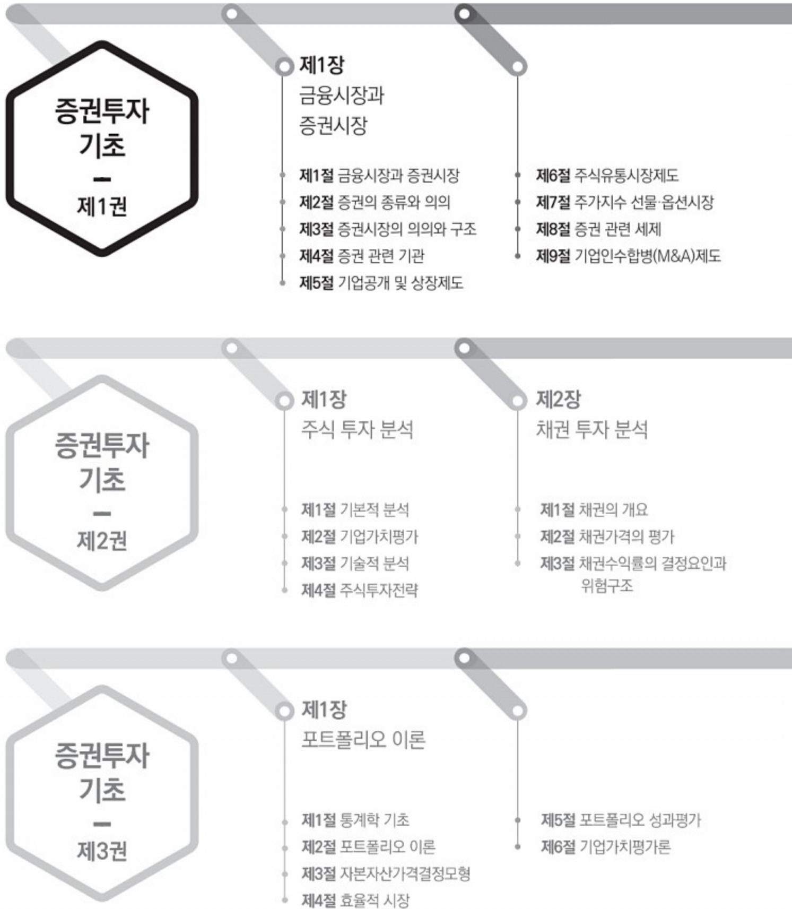
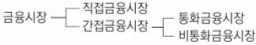
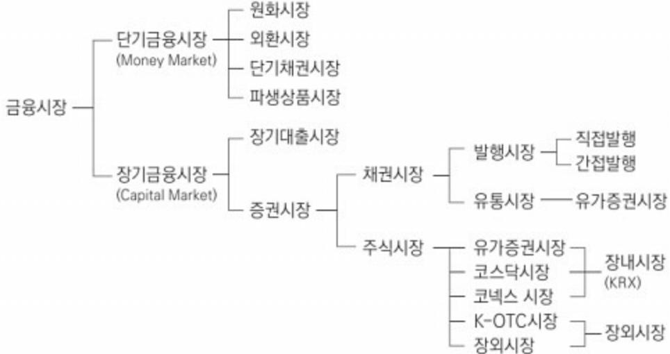
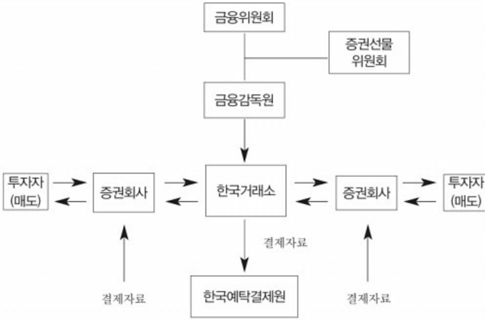
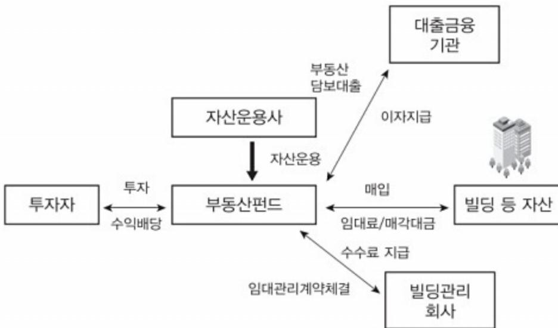
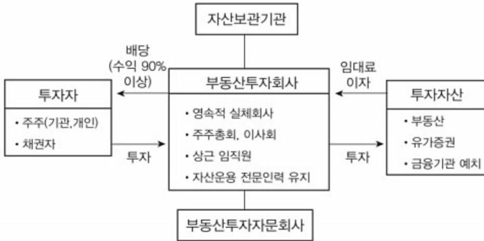
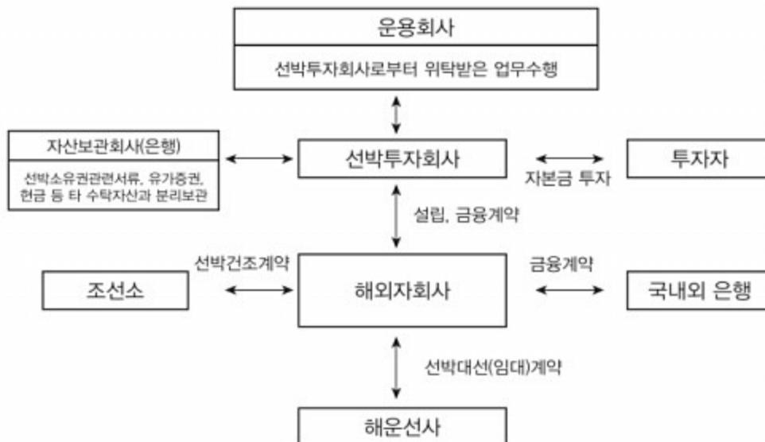
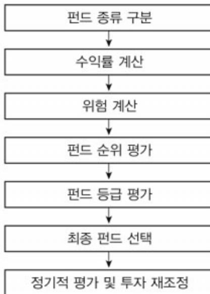

# 증권투자기초

KOREA BANKING INSTITUTE

# 증권투자기초

KOREA BANKING INSTITUTE

## | 금융시장과 증권시장 |

### 강병욱

- 경원대학교 졸업(경영학 박사)
- 한국경제TV해설위원
- 한화증권, ING Baring증권, 삼성증권 등 근무
- 현) 세종사이버대학교 경영학부 겸임교수

## | 집합투자 |

### 윤상설

- 한양대학교 경영학 석사 졸업
- 푸르덴셜투자증권 근무
- 미래에셋증권 신림역지점 지점장

### 이승희

- 서울과학종합대학원 경영학 박사
- 동양증권, 도이치증권, 모간스탠리증권 등 근무
- 현) 나사렛대학교 국제금융부동산학과 교수

## 증권투자기초 제1권

| 초판 발행  | 1989년 4월 5일 초판 발행        |
|--------|--------------------------|
|        | 2026년 7월 1일 37판 발행       |
| 발행처    | 한국금융연수원 u-러닝부            |
| 발행인    | 이준수                      |
| 주소     | (우)03053 서울시 종로구 삼청로 118 |
| 고객지원센터 | (02)3700-1500(대표전화)      |
| 팩스     | (02)3700-1640            |
| 홈페이지   | www.kbi.or.kr            |
| 교재코드   | 5710-2026-3701-1         |

### 비매품

- 이 책의 무단전재 또는 복제행위는 저작권법 제136조에 의거  
  5년 이하의 징역 또는 5,000만 원 이하의 벌금에 처합니다.
- 본 저서의 내용은 우리 연수원의 견해와 다를 수 있습니다.

안녕하십니까, 한국금융연수원 원장 이준수입니다.

한국금융연수원의 원격연수 과정에 참여해 주신 금융인 여러분께 깊이 감사드립니다.

급변하는 국제 정세와 금융 시장의 불확실성, 그리고 AI와 디지털 전환의 가속화는 우리 금융업계에 새로운 도전과 기회를 동시에 안겨 주고 있습니다. 이러한 변화 속에서 금융회사들은 혁신을 통해 미래를 선도하고, 새로운 가치를 창출해야 합니다. 이에 한국금융연수원은 금융회사가 이러한 혁신 노력을 지속하면서도 건전 경영을 위한 리스크 관리 및 내부통제가 실효성 있게 이루어지는 건강한 조직문화를 확립할 수 있도록 다양한 교육과정 제공을 통해 금융인의 역량 강화를 적극 지원하고 있습니다.

특히, AI연수체계를 개편하여 AI 전문인력 양성 및 AI 리터러시 향상을 위한 연수 과정을 체계적으로 마련하였으며, 고객 신뢰 강화와 위기 대응 능력 향상을 위해 내부통제와 자금세탁방지 등 관련 신규 과정도 선제적으로 개발하였습니다. 이러한 연수 과정들은 금융인 여러분이 변화의 흐름에 주도적으로 대응하고 전문성과 경쟁력을 높이는 데 큰 도움이 될 것입니다.

아울러, 한국금융연수원 원격연수 과정은 각 분야 최고 전문가로 구성된 집필진이 참여하여 단순한 지식 전달을 넘어, 금융 환경의 변화와 실무에 필요한 최신 사례를 반영한 깊이 있는 학습 기회를 제공합니다. 또한 AI 기반 챗봇 서비스 도입, 개인화된 학습 로드맵 제공, e-book 기능 개선 등을 통해 디지털 학습 환경을 지속적으로 강화하여 학습자가 언제 어디서나 편리하게 학습할 수 있도록 지원하고 있습니다.

더불어, 한국금융연수원은 고용노동부가 인증한 직업능력개발 훈련기관 인증평가에서 5년 인증 등급을 획득하고 우수훈련기관으로 선정되었습니다. 50년간의 축적된 노하우와 전문성을 바탕으로 금융회사의 HRD 파트너로 자리매김해 왔으며, 앞으로도 “금융인을 최고로, 금융회사를 일류로, 금융을 미래로” 연결하는 원동력이 될 수 있도록 금융회사의 경영 전략과 인재 개발 니즈에 부합하는 연수프로그램을 개발하고, 학습자 중심의 서비스를 강화하며 금융회사와 함께 성장해 나가겠습니다.

금융인 여러분의 적극적인 학습 참여를 기대하며, 이번 연수가 여러분의 전문성과 경쟁력을 한 단계 더 높이는 계기가 되기를 바랍니다.

감사합니다.

## 나만의 학습목표

본 교재의 학습에 앞서 나만의 학습목표를 세워보세요(ex 1등 하기 증권투자초 과정 완전 정복)

## 나만의 학습진도표

학습기간별로 나만의 학습진도표를 만들어 보세요

나만의 학습일자와 학습할 교재 페이지 및 학습여부를 기록해가면서 좀 더 계획적으로 학습을 완성해 나가시기

바랍니다.

| 번호 | 학습일자 | 목표학습 교재 페이지 | 실제학습 교재 페이지 | 메모 |
|----|------|----------------|----------------|----|
| 1  | 월 일  |                |                |    |
| 2  | 월 일  |                |                |    |
| 3  | 월 일  |                |                |    |
| 4  | 월 일  |                |                |    |
| 5  | 월 일  |                |                |    |
| 6  | 월 일  |                |                |    |
| 7  | 월 일  |                |                |    |
| 8  | 월 일  |                |                |    |
| 9  | 월 일  |                |                |    |
| 10 | 월 일  |                |                |    |
| 11 | 월 일  |                |                |    |
| 12 | 월 일  |                |                |    |
| 13 | 월 일  |                |                |    |
| 14 | 월 일  |                |                |    |
| 15 | 월 일  |                |                |    |
| 16 | 월 일  |                |                |    |
| 17 | 월 일  |                |                |    |
| 18 | 월 일  |                |                |    |
| 19 | 월 일  |                |                |    |
| 20 | 월 일  |                |                |    |
| 21 | 월 일  |                |                |    |
| 22 | 월 일  |                |                |    |
| 23 | 월 일  |                |                |    |
| 24 | 월 일  |                |                |    |
| 25 | 월 일  |                |                |    |
| 26 | 월 일  |                |                |    |
| 27 | 월 일  |                |                |    |
| 28 | 월 일  |                |                |    |
| 29 | 월 일  |                |                |    |
| 30 | 월 일  |                |                |    |
| 31 | 월 일  |                |                |    |

# 학습체계도

## Learning Road Map

## 제2장

집합투자

- • 제1절 집합투자의 개념

- • 제2절 펀드의 구조

- • 제3절 펀드의 종류

- • 제4절 펀드 관리

# Introduction to Securities Investment

- • 제4절 채권수익률의 기간구조이론과  
  채권분석

- • 제5절 채권투자운용전략 및  
  성과평가

- • 제6절 채권시장의 구조

## 제2장

금융파생상품

- • 제1절 파생상품 개론

- • 제2절 주가연계상품

- • 제3절 금리 및 통화 상품

- • 제4절 신용 및 원자재 상품

- • 제5절 장외파생상품: 파생결합  
  증권

| 1절   금융시장과 증권시장   | 1. 금융시장 2. 증권시장                                                       | 13 18                        |
|-------------------|--------------------------------------------------------------------------|---------------------------------|
| 2절   증권의 종류와 의의   | 1. 증권의 의의 2. 주식과 채권의 종류                                               | 20 25                        |
| 3절   증권시장의 의의와 구조 | 1. 증권시장의 의의와 구조 2. 발행시장의 의의와 구조 3. 유통시장의 의의와 구조                    | 34 37 44                  |
| 4절   증권 관련 기관     | 1. 증권행정기구 2. 증권 관련 기관 3. 금융투자업                                     | 47 48 54                  |
| 5절   기업공개 및 상장제도  | 1. 기업공개와 상장 2. 증자 3. 상장                                            | 61 67 75                  |
| 6절   주식유통시장제도     | 1. 유가증권시장 매매거래 및 결제제도 2. 기업공시제도 3. 코스닥(KOSDAQ)시장제도                 | 90 116 122                |
| 7절   주가지수선물·옵션시장  | 1. 주가지수선물시장 2. 주가지수옵션시장 3. 주식워런트증권과 주식옵션 4. 개별주식선물 5. 개별주식옵션 | 164 172 176 180 182 |

| 8절   증권 관련 세제 | 1. 배당소득 관련 과세제도 2. 이자소득 관련 과세제도 3. 증권 관련 과세제도 4. 증자 관련 과세제도 | 184 190 192 195 |
|---------------|----------------------------------------------------------------------|--------------------------|
|---------------|----------------------------------------------------------------------|--------------------------|

| 9절   기업인수합병(M&A)제도 | 1. 기업인수합병 | 198 |
|--------------------|-----------|-----|
|--------------------|-----------|-----|

| 2장 | <b>집합투자</b> | CONTENTS |
|----|-------------|----------|
|----|-------------|----------|

| 1절   집합투자의 개념 | 1. 집합투자의 정의 2. 집합투자기구의 구분 | 236 239 |
|---------------|------------------------------|------------|
|---------------|------------------------------|------------|

| 2절   펀드의 구조 | 1. 펀드의 형태 2. 펀드의 기본구조 3. 펀드의 가입과 환매 | 242 246 251 |
|-------------|-------------------------------------------|-------------------|
|-------------|-------------------------------------------|-------------------|

| 3절   펀드의 종류 | 1. 투자대상에 따른 분류 2. 투자구조에 따른 분류 3. 운용전략에 따른 분류 4. 투자지역에 따른 분류 5. 특수한 펀드 | 263 294 299 305 309 |
|-------------|-----------------------------------------------------------------------------------|---------------------------------|
|-------------|-----------------------------------------------------------------------------------|---------------------------------|

| 4절   펀드 관리 | 1. 투자성향 분석 2. 펀드 투자 과정 3. 펀드투자 시 세금 | 314 323 333 |
|------------|-------------------------------------------|-------------------|
|------------|-------------------------------------------|-------------------|

# 제1장

# 금융시장과 증권시장

**증권 구성 4. 증권 구성 5. 증권 구성 6. 증권 구성 7.**

**증권 구성 5. 증권 구성 6. 증권 구성 7. 증권 구성 8. 증권 구성 9. 증권 구성 10. 증권 구성 11. 증권 구성 12. 증권 구성 13. 증권 구성 14. 증권 구성 15. 증권 구성 16. 증권 구성 17. 증권 구성 18. 증권 구성 19. 증권 구성 20. 증권 구성 21. 증권 구성 22. 증권 구성 23. 증권 구성 24. 증권 구성 25. 증권 구성 26. 증권 구성 27. 증권 구성 28. 증권 구성 29. 증권 구성 30. 증권 구성 31. 증권 구성 32. 증권 구성 33. 증권 구성 34. 증권 구성 35. 증권 구성 36. 증권 구성 37. 증권 구성 38. 증권 구성 39. 증권 구성 40. 증권 구성 41. 증권 구성 42. 증권 구성 43. 증권 구성 44. 증권 구성 45. 증권 구성 46. 증권 구성 47. 증권 구성 48. 증권 구성 49. 증권 구성 50. 증권 구성 51. 증권 구성 52. 증권 구성 53. 증권 구성 54. 증권 구성 55. 증권 구성 56. 증권 구성 57. 증권 구성 58. 증권 구성 59. 증권 구성 60. 증권 구성 61. 증권 구성 62. 증권 구성 63. 증권 구성 64. 증권 구성 65. 증권 구성 66. 증권 구성 67. 증권 구성 68. 증권 구성 69. 증권 구성 70. 증권 구성 71. 증권 구성 72. 증권 구성 73. 증권 구성 74. 증권 구성 75. 증권 구성 76. 증권 구성 77. 증권 구성 78. 증권 구성 79. 증권 구성 80. 증권 구성 81. 증권 구성 82. 증권 구성 83. 증권 구성 84. 증권 구성 85. 증권 구성 86. 증권 구성 87. 증권 구성 88. 증권 구성 89. 증권 구성 90. 증권 구성 91. 증권 구성 92. 증권 구성 93. 증권 구성 94. 증권 구성 95. 증권 구성 96. 증권 구성 97. 증권 구성 98. 증권 구성 99. 증권 구성 100. 증권 구성 101. 증권 구성 102. 증권 구성 103. 증권 구성 104. 증권 구성 105. 증권 구성 106. 증권 구성 107. 증권 구성 108. 증권 구성 109. 증권 구성 110. 증권 구성 111. 증권 구성 112. 증권 구성 113. 증권 구성 114. 증권 구성 115. 증권 구성 116. 증권 구성 117. 증권 구성 118. 증권 구성 119. 증권 구성 120. 증권 구성 121. 증권 구성 122. 증권 구성 123. 증권 구성 124. 증권 구성 125. 증권 구성 126. 증권 구성 127. 증권 구성 128. 증권 구성 129. 증권 구성 130. 증권 구성 131. 증권 구성 132. 증권 구성 133. 증권 구성 134. 증권 구성 135. 증권 구성 136. 증권 구성 137. 증권 구성 138. 증권 구성 139. 증권 구성 140. 증권 구성 141. 증권 구성 142. 증권 구성 143. 증권 구성 144. 증권 구성 145. 증권 구성 146. 증권 구성 147. 증권 구성 148. 증권 구성 149. 증권 구성 150. 증권 구성 151. 증권 구성 152. 증권 구성 153. 증권 구성 154. 증권 구성 155. 증권 구성 156. 증권 구성 157. 증권 구성 158. 증권 구성 159. 증권 구성 160. 증권 구성 161. 증권 구성 162. 증권 구성 163. 증권 구성 164. 증권 구성 165. 증권 구성 166. 증권 구성 167. 증권 구성 168. 증권 구성 169. 증권 구성 170. 증권 구성 171. 증권 구성 172. 증권 구성 173. 증권 구성 174. 증권 구성 175. 증권 구성 176. 증권 구성 177. 증권 구성 178. 증권 구성 179. 증권 구성 180. 증권 구성 181. 증권 구성 182. 증권 구성 183. 증권 구성 184. 증권 구성 185. 증권 구성 186. 증권 구성 187. 증권 구성 188. 증권 구성 189. 증권 구성 190. 증권 구성 191. 증권 구성 192. 증권 구성 193. 증권 구성 194. 증권 구성 195. 증권 구성 196. 증권 구성 197. 증권 구성 198. 증권 구성 199. 증권 구성 200. 증권 구성 201. 증권 구성 202. 증권 구성 203. 증권 구성 204. 증권 구성 205. 증권 구성 206. 증권 구성 207. 증권 구성 208. 증권 구성 209. 증권 구성 210. 증권 구성 211. 증권 구성 212. 증권 구성 213. 증권 구성 214. 증권 구성 215. 증권 구성 216. 증권 구성 217. 증권 구성 218. 증권 구성 219. 증권 구성 220. 증권 구성 221. 증권 구성 222. 증권 구성 223. 증권 구성 224. 증권 구성 225. 증권 구성 226. 증권 구성 227. 증권 구성 228. 증권 구성 229. 증권 구성 230. 증권 구성 231. 증권 구성 232. 증권 구성 233. 증권 구성 234. 증권 구성 235. 증권 구성 236. 증권 구성 237. 증권 구성 238. 증권 구성 239. 증권 구성 240. 증권 구성 241. 증권 구성 243. 증권 구성 244. 증권 구성 245. 증권 구성 247. 증권 구성 248. 증권 구성 249. 증권 구성 250. 증권 구성 251. 증권 구성 252. 증권 구성 253. 증권 구성 254. 증권 구성 255. 증권 구성 256. 증권 구성 257. 증권 구성 258. 증권 구성 259. 증권 구성 260. 증권 구성 261. 증권 구성 262. 증권 구성 263. 증권 구성 264. 증권 구성 265. 증권 구성 266. 증권 구성 267. 증권 구성 268. 증권 구성 269. 증권 구성 270. 증권 구성 271. 증권 구성 272. 증권 구성 273. 증권 구성 274. 증권 구성 275. 증권 구성 276. 증권 구성 277. 증권 구성 278. 증권 구성 279. 증권 구성 280. 증권 구성 281. 증권 구성 282. 증권 구성 283. 증권 구성 284. 증권 구성 285. 증권 구성 287. 증권 구성 288. 증권 구성 289. 증권 구성 290. 증권 구성 291. 증권 구성 292. 증권 구성 293. 증권 구성 294. 증권 구성 295. 증권 구성 296. 증권 구성 297. 증권 구성 298. 증권 구성 299. 증권 구성 300. 증권 구성 301. 증권 구성 303. 증권 구성 304. 증권 구성 305. 증권 구성 306. 증권 구성 307. 증권 구성 308. 증권 구성 309. 증권 구성 310. 증권 구성 311. 증권 구성 312. 증권 구성 313. 증권 구성 314. 증권 구성 315. 증권 구성 316. 증권 구성 317. 증권 구성 318. 증권 구성 319. 증권 구성 320. 증권 구성 321. 증권 구성 322. 증권 구성 323. 증권 구성 325. 증권 구성 327. 증권 구성 328. 증권 구성 329. 증권 구성 330. 증권 구성 331. 증권 구성 332. 증권 구성 333. 증권 구성 334. 증권 구성 336. 증권 구성 337. 증권 구성 338. 증권 구성 339. 증권 구성 340. 증권 구성 341. 증권 구성 343. 증권 구성 344. 증권 구성 345. 증권 구성 346. 증권 구성 347. 증권 구성 348. 증권 구성 349. 증권 구성 350. 증권 구성 351. 증권 구성 352. 증권 구성 353. 증권 구성 354. 증권 구성 355. 증권 구성 356. 증권 구성 357. 증권 구성 358. 증권 구성 359. 증권 구성 360. 증권 구성 361. 증권 구성 362. 증권 구성 363. 증권 구성 364. 증권 구성 365. 증권 구성 366. 증권 구성 367. 증권 구성 368. 증권 구성 369. 증권 구성 370. 증권 구성 371. 증권 구성 372. 증권 구성 373. 증권 구성 375. 증권 구성 376. 증권 구성 377. 증권 구성 378. 증권 구성 379. 증권 구성 380. 증권 구성 381. 증권 구성 383. 증권 구성 384. 증권 구성 385. 증권 구성 387. 증권 구성 388. 증권 구성 389. 증권 구성 390. 증권 구성 391. 증권 구성 392. 증권 구성 393. 증권 구성 394. 증권 구성 395. 증권 구성 396. 증권 구성 397. 증권 구성 398. 증권 구성 399. 증권 구성 400. 증권 구성 401. 증권 구성 402. 증권 구성 403. 증권 구성 404. 증권 구성 405. 증권 구성 406. 증권 구성 407. 증권 구성 408. 증권 구성 409. 증권 구성 410. 증권 구성 411. 증권 구성 412. 증권 구성 413. 증권 구성 414. 증권 구성 415. 증권 구성 416. 증권 구성 417. 증권 구성 418. 증권 구성 419. 증권 구성 420. 증권 구성 421. 증권 구성 422. 증권 구성 423. 증권 구성 425. 증권 구성 427. 증권 구성 428. 증권 구성 429. 증권 구성 430. 증권 구성 431. 증권 구성 432. 증권 구성 433. 증권 구성 434. 증권 구성 436. 증권 구성 437. 증권 구성 438. 증권 구성 439. 증권 구성 440. 증권 구성 442. 증권 구성 443. 증권 구성 444. 증권 구성 445. 증권 구성 446. 증권 구성 448. 증권 구성 449. 증권 구성 450. 증권 구성 451. 증권 구성 452. 증권 구성 453. 증권 구성 454. 증권 구성 456. 증권 구성 457. 증권 구성 458. 증권 구성 459. 증권 구성 460. 증권 구성 461. 증권 구성 462. 증권 구성 463. 증권 구성 464. 증권 구성 465. 증권 구성 466. 증권 구성 467. 증권 구성 468. 증권 구성 469. 증권 구성 470. 증권 구성 471. 증권 구성 472. 증권 구성 473. 증권 구성 474. 증권 구성 475. 증권 구성 476. 증권 구성 477. 증권 구성 478. 증권 구성 479. 증권 구성 480. 증권 구성 481. 증권 구성 483. 증권 구성 484. 증권 구성 485. 증권 구성 487. 증권 구성 488. 증권 구성 489. 증권 구성 490. 증권 구성 492. 증권 구성 493. 증권 구성 494. 증권 구성 495. 증권 구성 496. 증권 구성 497. 증권 구성 498. 증권 구성 499. 증권 구성 500. 증권 구성 501. 증권 구성 502. 증권 구성 503. 증권 구성 504. 증권 구성 505. 증권 구성 506. 증권 구성 507. 증권 구성 508. 증권 구성 509. 증권 구성 510. 증권 구성 511. 증권 구성 512. 증권 구성 513. 증권 구성 514. 증권 구성 515. 증권 구성 516. 증권 구성 517. 증권 구성 518. 증권 구성 519. 증권 구성 520. 증권 구성 521. 증권 구성 522. 증권 구성 523. 증권 구성 524. 증권 구성 525. 증권 구성 526. 증권 구성 527. 증권 구성 528. 증권 구성 529. 증권 구성 530. 증권 구성 531. 증권 구성 532. 증권 구성 533. 증권 구성 534. 증권 구성 535. 증권 구성 536. 증권 구성 537. 증권 구성 538. 증권 구성 539. 증권 구성 540. 증권 구성 541. 증권 구성 543. 증권 구성 544. 증권 구성 545. 증권 구성 547. 증권 구성 548. 증권 구성 549. 증권 구성 550. 증권 구성 551. 증권 구성 552. 증권 구성 553. 증권 구성 554. 증권 구성 555. 증권 구성 556. 증권 구성 557. 증권 구성 558. 증권 구성 559. 증권 구성 560. 증권 구성 561. 증권 구성 562. 증권 구성 563. 증권 구성 564. 증권 구성 565. 증권 구성 566. 증권 구성 567. 증권 구성 568. 증권 구성 569. 증권 구성 570. 증권 구성 571. 증권 구성 572. 증권 구성 573. 증권 구성 574. 증권 구성 575. 증권 구성 576. 증권 구성 577. 증권 구성 578. 증권 구성 579. 증권 구성 580. 증권 구성 581. 증권 구성 582. 증권 구성 583. 증권 구성 584. 증권 구성 585. 증권 구성 587. 증권 구성 588. 증권 구성 589. 증권 구성 590. 증권 구성 591. 증권 구성 592. 증권 구성 593. 증권 구성 593. 증권 구성 594. 증권 구성 595. 증권 구성 596. 증권 구성 597. 증권 구성 598. 증권 구성 599. 증권 구성 600. 증권 구성 601. 증권 구성 602. 증권 구성 603. 증권 구성 604. 증권 구성 605. 증권 구성 606. 증권 구성 607. 증권 구성 608. 증권 구성 609. 증권 구성 610. 증권 구성 611. 증권 구성 612. 증권 구성 613. 증권 구성 614. 증권 구성 615. 증권 구성 616. 증권 구성 617. 증권 구성 618. 증권 구성 619. 증권 구성 620. 증권 구성 621. 증권 구성 622. 증권 구성 623. 증권 구성 625. 증권 구성 626. 증권 구성 627. 증권 구성 628. 증권 구성 629. 증권 구성 630. 증권 구성 631. 증권 구성 632. 증권 구성 633. 증권 구성 634. 증권 구성 635. 증권 구성 636. 증권 구성 637. 증권 구성 638. 증권 구성 639. 증권 구성 640. 증권 구성 641. 증권 구성 643. 증권 구성 644. 증권 구성 645. 증권 구성 646. 증권 구성 648. 증권 구성 649. 증권 구성 650. 증권 구성 651. 증권 구성 652. 증권 구성 653. 증권 구성 654. 증권 구성 655. 증권 구성 656. 증권 구성 658. 증권 구성 659. 증권 구성 660. 증권 구성 661. 증권 구성 662. 증권 구성 664. 증권 구성 665. 증권 구성 666. 증권 구성 668. 증권 구성 669. 증권 구성 670. 증권 구성 671. 증권 구성 672. 증권 구성 673. 증권 구성 675. 증권 구성 677. 증권 구성 678. 증권 구성 679. 증권 구성 680. 증권 구성 681. 증권 구성 682. 증권 구성 683. 증권 구성 684. 증권 구성 685. 증권 구성 686. 증권 구성 687. 증권 구성 688. 증권 구성 689. 증권 구성 690. 증권 구성 691. 증권 구성 692. 증권 구성 693. 증권 구성 694. 증권 구성 695. 증권 구성 696. 증권 구성 698. 증권 구성 699. 증권 구성 700. 증권 구성 701. 증권 구성 702. 증권 구성 703. 증권 구성 704. 증권 구성 705. 증권 구성 706. 증권 구성 707. 증권 구성 708. 증권 구성 709. 증권 구성 710. 증권 구성 711. 증권 구성 712. 증권 구성 713. 증권 구성 714. 증권 구성 715. 증권 구성 716. 증권 구성 717. 증권 구성 718. 증권 구성 719. 증권 구성 720. 증권 구성 721. 증권 구성 722. 증권 구성 723. 증권 구성 725. 증권 구성 727. 증권 구성 728. 증권 구성 729. 증권 구성 730. 증권 구성 731. 증권 구성 732. 증권 구성 733. 증권 구성 734. 증권 구성 735. 증권 구성 736. 증권 구성 737. 증권 구성 738. 증권 구성 739. 증권 구성 740. 증권 구성 741. 증권 구성 743. 증권 구성 744. 증권 구성 745. 증권 구성 747. 증권 구성 748. 증권 구성 749. 증권 구성 750. 증권 구성 751. 증권 구성 752. 증권 구성 753. 증권 구성 754. 증권 구성 755. 증권 구성 756. 증권 구성 757. 증권 구성 758. 증권 구성 759. 증권 구성 760. 증권 구성 761. 증권 구성 762. 증권 구성 763. 증권 구성 764. 증권 구성 765. 증권 구성 766. 증권 구성 768. 증권 구성 769. 증권 구성 770. 증권 구성 771. 증권 구성 772. 증권 구성 773. 증권 구성 775. 증권 구성 776. 증권 구성 777. 증권 구성 778. 증권 구성 779. 증권 구성 780. 증권 구성 781. 증권 구성 782. 증권 구성 783. 증권 구성 784. 증권 구성 785. 증권 구성 787. 증권 구성 788. 증권 구성 789. 증권 구성 790. 증권 구성 791. 증권 구성 792. 증권 구성 793. 증권 구성 794. 증권 구성 795. 증권 구성 796. 증권 구성 797. 증권 구성 798. 증권 구성 799. 증권 구성 800. 증권 구성 801. 증권 구성 802. 증권 구성 803. 증권 구성 804. 증권 구성 805. 증권 구성 806. 증권 구성 807. 증권 구성 808. 증권 구성 809. 증권 구성 810. 증권 구성 811. 증권 구성 812. 증권 구성 813. 증권 구성 815. 증권 구성 816. 증권 구성 817. 증권 구성 818. 증권 구성 819. 증권 구성 820. 증권 구성 821. 증권 구성 823. 증권 구성 825. 증권 구성 826. 증권 구성 828. 증권 구성 829. 증권 구성 830. 증권 구성 831. 증권 구성 832. 증권 구성 833. 증권 구성 834. 증권 구성 835. 증권 구성 836. 증권 구성 838. 증권 구성 839. 증권 구성 840. 증권 구성 842. 증권 구성 843. 증권 구성 844. 증권 구성 845. 증권 구성 846. 증권 구성 848. 증권 구성 849. 증권 구성 850. 증권 구성 851. 증권 구성 852. 증권 구성 853. 증권 구성 854. 증권 구성 856. 증권 구성 857. 증권 구성 858. 증권 구성 859. 증권 구성 860. 증권 구성 861. 증권 구성 862. 증권 구성 863. 증권 구성 865. 증권 구성 867. 증권 구성 868. 증권 구성 869. 증권 구성 870. 증권 구성 871. 증권 구성 872. 증권 구성 874. 증권 구성 876. 증권 구성 877. 증권 구성 878. 증권 구성 880. 증권 구성 881. 증권 구성 883. 증권 구성 884. 증권 구성 886. 증권 구성 888. 증권 구성 889. 증권 구성 890. 증권 구성 892. 증권 구성 893. 증권 구성 894. 증권 구성 895. 증권 구성 896. 증권 구성 897. 증권 구성 898. 증권 구성 898. 증권 구성 899. 증권 구성 900. 증권 구성 901. 증권 구성 902. 증권 구성 903. 증권 구성 904. 증권 구성 905. 증권 구성 906. 증권 구성 907. 증권 구성 908. 증권 구성 909. 증권 구성 910. 증권 구성 910. 증권 구성 911. 증권 구성 912. 증권 구성 913. 증권 구성 914. 증권 구성 915. 증권 구성 916. 증권 구성 917. 증권 구성 918. 증권 구성 919. 증권 구성 920. 증권 구성 921. 증권 구성 922. 증권 구성 923. 증권 구성 925. 증권 구성 926. 증권 구성 927. 증권 구성 928. 증권 구성 929. 증권 구성 930. 증권 구성 931. 증권 구성 932. 증권 구성 933. 증권 구성 934. 증권 구성 936. 증권 구성 937. 증권 구성 938. 증권 구성 939. 증권 구성 940. 증권 구성 942. 증권 구성 943. 증권 구성 944. 증권 구성 945. 증권 구성 947. 증권 구성 948. 증권 구성 949. 증권 구성 950. 증권 구성 951. 증권 구성 952. 증권 구성 953. 증권 구성 954. 증권 구성 955. 증권 구성 956. 증권 구성 958. 증권 구성 959. 증권 구성 960. 증권 구성 961. 증권 구성 962. 증권 구성 963. 증권 구성 964. 증권 구성 965. 증권 구성 967. 증권 구성 968. 증권 구성 969. 증권 구성 970. 증권 구성 971. 증권 구성 972. 증권 구성 973. 증권 구성 975. 증권 구성 977. 증권 구성 978. 증권 구성 980. 증권 구성 981. 증권 구성 983. 증권 구성 985. 증권 구성 987. 증권 구성 988. 증권 구성 989. 증권 구성 991. 증권 구성 992. 증권 구성 993. 증권 구성 994. 증권 구성 995. 증권 구성 997. 증권 구성 998. 증권 구성 999. 증권 구성 1000. 증권 구성 1001. 증권 구성 1002. 증권 구성 103. 증권 구성**

# Introduction to Securities Investment

## 1장

금융시장과  
증권시장

### 학습목표

1. 1. 금융시장의 의의를 살펴보고 금융시장의 틀 안에서 증권시장의 위치를 이해한다.
2. 2. 증권의 의의와 종류를 이해하고 증권의 경제적 기능을 살펴본다.
3. 3. 증권시장의 구조를 통해 발행시장과 유통시장의 의의를 이해한다.
4. 4. 증권관계기관은 증권시장의 관리감독체계 및 운영체계를 이해하는 데 필수적이다.
5. 5. 기업공개와 상장의 개념을 분리·이해하고 상장절차 및 요건 등을 살펴본다.
6. 6. 주식시장에서 실제로 매매가 이루어지는 구조를 살펴보고 공시제도를 이해한다.
7. 7. 증권세제를 통해 배당소득과 이자소득에 대한 과세제도를 이해한다.

### 학습개요

증권시장은 금융시장의 일부로서 자금의 수요자와 공급자를 직접 연결하는 기능을 수행한다. 일반적으로 증권시장은 발행시장과 유통시장으로 구분하는데 이러한 시장구조를 통해 산업자본의 조달, 저축 수단의 제공, 소득의 재분배, 자금의 효율적 배분, 재정금융정책의 수단으로 사용되는 경제적 기능을 담당한다.

또한 증권관계기관은 증권시장을 감독하는 기관과 증권시장이 실제로 운영될 수 있도록 하는 기관으로 구분되어 있는데, 이들의 유기적인 관계는 증권시장의 원활한 운영에 도움이 될 것이다. 특히 최근 출범한 한국거래소의 구조를 이해하는 것이 중요하다.

우리나라는 기업공개와 상장의 개념이 혼동되는 나라였으나 최근 들어 그 개념의 정립이 이루어지고 있으며, 이를 통해 상장의 효과와 상장절차 그리고 상장기업의 요건 등을 살펴본다.

또한 증권거래를 하는 경우 필연적으로 과세문제가 발생하는데, 이에 대해 깊이 이해하고 기업인수합병에 대한 개념과 구체적인 방법 등을 살펴봄으로써 최근 활발하게 이루어지고 있는 기업인수합병시장에 대한 준비를 한다.

# 금융시장과 증권시장

## 제1절

### 1. 금융시장

---

#### 1.1. 금융시장의 의의

금융시장이란 상품 등이 거래되는 특정 건물이나 장소를 의미하는 것이 아니라, 일정한 질서 속에서 자금거래가 상시적으로 이루어지도록 하는 체계 또는 기구를 가리키는 추상적 개념의 시장이다.

#### 1.2. 금융시장의 기능

가계부문의 잉여자금을 기업부문으로 이전시킴으로써 자본의 효율을 높이

고, 영세유휴자금을 동원함으로써 대규모 기업의 설립을 가능케하여 경제적 생산활동을 뒷받침한다. 또한 금융시장은 저축에 대한 대가(이자)를 보장함으로써 일반 대중의 저축의욕을 높여 자본형성을 촉진할 뿐만 아니라 시장의 공급자로부터 수요자에게로 구매력 이전을 통하여 재화의 유통을 원활하게 촉진한다.

### 1.3. 금융시장과 증권시장

자금의 수요자와 공급자 간의 거래가 행하여지는 시장을 통틀어 넓은 의미의 금융시장이라고 한다. 금융시장은 자금을 조달하는 방법에 따라 자금공급자와 수요자 사이를 은행 등 금융기관이 중간매개자로서 맺어주는 간접금융시장과 자금의 수요자가 증권을 발행하고, 이를 자금공급자의 잉여자금과 직접 교환하는 직접금융시장으로 나눌 수 있다. 또한 금융자금의 공급기간이 길고 짧음에 따라 만기 1년 이내의 단기증권이 거래되는 단기금융시장과 비교적 장기적인 증권이 거래되는 자본시장으로 분류할 수 있다.

증권시장은 자금을 유통시키는 시장이라는 점에서 금융시장의 일환으로 이해되는데, 금융시장에서는 주로 단기자금을 조달하는 데 반하여 증권시장은 주식과 채권 같은 자본증권을 통하여 기업의 장기자본을 조달하는 역할을 하므로, 협의로는 증권시장을 자본시장이라고도 한다.

• 자금매개의 방법

• 자금공급의 기간

<그림 1 - 1> 금융시장의 분류

**1.4. 금융기관의 형태 및 종류**

우리나라의 금융기관은 제공하는 금융서비스의 성격에 따라 은행, 비은행 예금취급기관, 보험회사, 금융투자회사, 기타 금융기관, 금융보조기관 등으로 분류할 수 있다.

은행에는 은행법에 의해 설립된 일반은행과 개별 특수은행법에 의해 설립된 특수은행이 있다. 일반은행은 예금·대출 및 지급결제 업무를 고유업무로 하여 시중은행, 지방은행, 외국은행 국내지점으로 분류된다. 시중은행은 은행업을 인가받아 운영 중인 인터넷전문은행 3개 사를 포함한다. 특수은행은 일반은행이 재원의 제약, 수익성 확보의 어려움 등을 이유로 필요한 자금을 충분히 공급하기 어려운 부문에 자금을 원활히 공급하기 위하여 설립되었으며, 한국산업은행, 한국수출입은행, 중소기업은행, 농협은행 및 수협은행이 있다.

비은행예금취급기관에는 상호저축은행, 신용협동기구, 우체국예금, 종합금융회사 등이 있다. 상호저축은행은 특정한 지역의 서민 및 소규모 기업을 대상으로 하는 여신업무를 전문으로 한다. 신용협동기구는 조합원에 대한 저축편의 제공과 대출을 통한 상호간의 공동이익 추구를 목적으로 운영되며, 신용협동조합, 새마을금고 그리고 농업협동조합·수산업협동조합·산림조합의 상호금융을 포함한다. 우체국예금은 민간금융이 취약한 지역을 지원하기 위해 전국의 체신관서를 금융창구로 활용하는 국영금융이며, 종합금융회사는 가계대출, 보험, 지급결제 등을 제외한 대부분의 기업금융업무를 영위한다.

보험회사는 사망·질병·노후 또는 화재나 각종 사고를 대비하는 보험을 인수·운영하는 금융기관으로 생명보험회사, 손해보험회사, 우체국보험, 공제기관 등으로 구분된다. 손해보험회사에는 일반적인 손해보험회사 외에도 재보험회사와 보증보험회사가 있다. 또한 국가기관이 취급하는 국영보험인 우체국보험과, 유사보험을 취급하는 공제기관이 있다.

금융투자업자는 주식, 채권 등 유가증권과 장내·장외파생상품 등 금융투자상품의 거래와 관련된 업무를 하는 금융기관이다. 투자매매·중개업자, 집합투자업자, 투자자문·일임업자, 신탁업자로 분류된다.

기타 금융기관에는 금융지주회사, 리스·신용카드·할부금융·신기술사업금융을 취급하는 여신전문금융회사, 벤처캐피탈회사, 대부업자 및 증권금융회사 등이 있다.

공적금융기관은 금융거래에 직접 참여하기보다 정책적 목적으로 각각의 기능에 맞게 설립된 기관을 의미한다. 여기에는 한국무역보험공사, 한국주택금융공사, 한국자산관리공사, 한국투자공사 등이 해당된다.

〈표 1 - 1〉 금융기관의 분류

| 구 분               |         | 금융기관명                                 |
|-------------------|---------|---------------------------------------|
| 은행                | 일반은행    | 시중은행, 지방은행, 외국은행지점                    |
|                   | 특수은행    | 한국산업은행, 한국수출입은행, 기업은행, 농협은행, 수협은행     |
| 비은행 예금취급 기관 | 상호저축은행  |                                       |
|                   | 신용협동기구  | 신용협동조합, 새마을금고, 상호금융                   |
|                   | 우체국예금   |                                       |
|                   | 종합금융회사  |                                       |
| 금융투자 회사        | 투자매매회사  | 증권회사 및 선물회사                           |
|                   | 투자중개회사  |                                       |
|                   | 집합투자회사  | 자산운용회사                                |
|                   | 투자자문회사  |                                       |
|                   | 투자일임회사  |                                       |
|                   | 신탁회사    |                                       |
| 보험회사              | 생명보험회사  |                                       |
|                   | 손해보험회사  | 손해보험, 재보험, 보증보험회사                     |
|                   | 우체국보험   |                                       |
|                   | 공제기관    | 새마을공제, 수협공제, 신협공제                     |
| 기타금융 기관        | 금융지주회사  | 은행지주, 비은행지주                           |
|                   | 예신전문회사  | 신용카드회사, 리스, 시설대여회사, 할부금융회사, 신기술사업금융회사 |
|                   | 벤처캐피탈회사 | 중소기업창업투자회사, 신기술금융회사                   |
|                   | 증권금융회사  |                                       |

## 2. 증권시장

---

증권시장은 증권이 발행되어 투자자에 취득되기까지의 과정 및 투자자 상호 간에 증권이 유통되는 과정을 총괄하는 추상적인 시장을 말한다. 또한 증권시장은 기업에 장기안정적 산업자금을 공급하는 역할을 하며, 증권시장을 통하여 자금이 효율적으로 배분되고 재정금융정책의 수단 및 자산운용수단을 제공해 소득의 재분배를 촉진시키는 기능을 가지고 있다.

이를 과정에 따라 살펴보면, 크게 발행시장과 유통시장으로 나눌 수 있다.

### 2.1. 발행시장

발행시장은 기업이나 정부, 공공단체가 자금을 조달할 목적으로 증권을 발행하여 최초로 투자자에게 매각이 이루어지는 시장을 말하며, 제1차시장이라고도 한다. 이러한 발행시장은 기업의 장기자금 조달을 돕고 증권의 취득과정을 통하여 기업지배 또는 기업 상호 간의 연결을 촉진하고, 통화정책 당국에 의한 공채발행과 공개시장 조작의 수행을 가능하게 하여 금융조절·경기조정의 역할을 수행하는 동시에 투자자들에게 유리한 투자대상을 제공함으로써 소득분배를 촉진시키는 기능을 가지고 있다. 또한 발행시장은 증권의 발행자, 발행기관, 투자자로 구성되어 있으며, 구체적인 시설을 갖춘 시장은 없고, 각 증권회사의 인수부가 시장을 대신한다.

### 2.2. 유통시장

유통시장은 발행시장을 통해 일단 발행된 증권을 투자자 사이에 매매하는 시장을 말하며, 제2차시장이라고도 한다.

이러한 유통시장에서는 유가증권의 매매거래가 집중적으로 계속해서 이루어져 증권자본과 화폐자본이 자유롭게 전환됨으로 인해, 유가증권의 시장성과 답보력

이 증대되는 기능을 가지고 있다.

이와 동시에 집중적이고 계속적인 자유공개시장에서의 매매거래를 통해 유가증권의 공정한 가격형성이 가능하며, 유통시장이 발달할수록 투자자는 보다 다양한 포트폴리오를 구성할 수 있어 투자에 따른 위험을 분산할 수 있게 된다.

또한 유통시장의 발전으로 인해 투자대상 자산의 가치평가를 위한 각종 정보들의 수집, 분석 및 배분을 요구하여 정보시장의 발전을 유도하는 기능을 한다. 가령, 우리나라 유가증권의 유통시장의 개념을 가장 잘 나타내고 있는 한국거래소의 유가증권시장과 코스닥증권시장 등을 들 수 있다.

# 증권의 종류와 의의

## 제2절

### 1. 증권의 의의

---

#### 1.1. 자본시장법상 증권의 정의

자본시장법(「자본시장과 금융투자업에 관한 법률」의 약칭)에서는 “투자성(원본손실가능성)”이라는 특징을 갖는 모든 금융상품을 포괄하는 개념으로 금융투자상품을 정의하고 있다. 특히 자본시장법에서는 금융투자상품의 개념을 열거하지 않고 추상적으로 정의함으로써, 향후 출현할 모든 금융투자상품을 법률의 규율대상으로 포괄할 수 있게 되었다.

이렇게 정의된 금융투자상품을 금융상품의 특성에 따라 증권, 장외파생상품, 장내파생상품으로 분류한 후 각각의 개념도 추상적으로 정의함으로써 포괄주의를 채택하고 있다.

## 1.2. 금융투자상품의 분류 및 정의

### 1.2.1. 금융투자상품의 정의 및 의의

자본시장법은 금융투자상품을 “이익을 얻거나 손실을 회피할 목적으로 현재 또는 장래의 특정시점에 금전 및 그 밖의 재산적 가치가 있는 것을 지급하기로 약정함으로써 취득하는 권리로서, 그 권리의 취득을 위하여 지급하였거나 지급하여야 할 금전 등의 총액이 그 권리로부터 회수하였거나 회수할 수 있는 금전 등의 총액을 초과하게 될 위험이 있는 것”으로 정의하고 있다(자본시장법 제3조 제1항).

#### (1) 투자성(원본손실 가능성)

투자한 원본금액이 회수금액을 초과하게 될 가능성을 투자성으로 정의한다. 원본보장여부는 원본손실이 발생하는 상품구조, 유통과정상의 가치변화(시장위험) 등을 포괄하여 판단함으로써 전통적 예금 등 원본이 보장되는 금융상품을 금융투자상품에서 제외하였다. 또한, 원본과 회수금액의 개념에서 제외되는 항목을 다음과 같이 명확히 규정하였다.

- ① 지급받는 자가 소비하는 금액(보험사의 위험보험료) 등을 원본에서 제외함으로써 전통적인 보험상품이 금융투자상품에 포함되지 않도록 하였다.
- ② 발행자가 도산할 경우 회수불능금액, 중도해지로 인한 수수료, 세금 등을 회수금액에 포함시킴으로써 모든 금융상품이 투자성을 갖는 것으로 해석되지 않도록 명확히 하였다.

#### (2) 이익획득/손실 회피목적

원본손실 가능성이 있더라도 이익획득/손실 회피목적이 없는 상품의 투자자는 보호할 필요성이 없으므로, 해당 상품을 금융투자상품에서 제외하고 있다.(예: 가치변동이 있는 실물자산을 소비목적으로 매입하는 경우)

### (3) 현재 또는 장래에 금전을 이전하기로 약정함으로써 갖게 되는 권리

자본시장법은 금융투자상품을 계약상의 권리로 정의하여 투자성을 가진 실물자산 등이 금융투자상품이 아님을 명백히 하고 있다. 현재의 금전 등을 이전할 것을 약정함으로써 갖는 권리는 증권에, 장래에 금전 등을 이전하기로 약정함으로써 갖게 되는 권리는 파생계약(선도계약)에 해당된다.

#### 1.2.2. 증권과 파생상품의 구분

1. ① 원본까지만 손실이 발생할 가능성이 있는 금융상품은 증권으로 분류한다.
2. ② 원본을 초과하는 손실이 발생할 가능성이 있는 금융투자상품은 파생상품으로 분류한다.
3. ③ 파생상품은 한국거래소와 같은 정형화된 시장에서의 거래여부에 따라 장내파생상품과 장외파생상품으로 구분한다.

〈표 1 - 2〉 원본대비 손실비율과 금융투자상품의 종류

| 범위 | 손실비율 $\leq 0\%$ | 0% $< 손실비율 \leq 100\%$ | 100% $< 손실비율$ |
|----|-----------------|------------------------|---------------|
|    | 원본보전형           | 원본손실형                  | 추가지급형         |
| 상품 | 예금, 보험          | 증권                     | 파생상품          |

#### 1.2.3. 증권의 정의 및 구분

##### (1) 증권의 정의

자본시장법은 증권을 “내국인 또는 외국인이 발행한 금융투자상품으로서 투자자가 취득과 동시에 지급한 금전 등 외에 어떠한 명목으로든지 추가로 지급의무(투자자가 기초자산에 대한 매매를 성립시킬 수 있는 권리를 행사하게 됨으로써 부담하게 되는 지급의무를 제외한다)를 부담하지 아니하는 것”으로 정의하고 있다.(자본시장법 제4조 1항)

### (2) 증권의 종류

자본시장법에서는 증권에 대하여 포괄적 정의를 하고 있지만 예시적인 열거주의도 채택하고 있는데, 그 예시는 다음과 같다.

| 분류     | 포괄적 정의                            | 포함되는 금융상품                                                |
|--------|-----------------------------------|----------------------------------------------------------|
| 채무증권   | 채무를 표시하는 것                        | 국채, 지방채, 특수채, 사채, 일부 기업어음 등                              |
| 지분증권   | 출자지분을 표시하는 것                      | 주식, 신주인수권, 특별법인의 출자증권, 상법상 합자회사·유한회사·익명조합·민법상 조합의 출자지분 등 |
| 수익증권   | 수익권을 표시하는 것                       | 수탁수익증권, 신탁형 집합투자기구의 수익증권 등                               |
| 증권예탁증권 | 증권을 예탁받은 자가 그 증권의 발행국 밖에서 발행하는 증권 | 국내 증권예탁증권(KDR), 외국 증권예탁증권(GDR, ADR 등)                    |

### (3) 투자계약증권의 도입

자본시장법에서는 전통적인 증권 이외에도 투자계약증권이라는 새로운 증권 개념을 도입하여 “투자계약증권은 특정 투자자가 타인 간의 공동사업에 금전 등을 투자하고, 주로 타인이 수행한 공동사업의 결과에 따른 손익을 귀속 받는 계약상의 권리가 표시된 것”으로 정의하고 있다. 이는 기존의 전통적 유형의 증권뿐만 아니라 비정형 집합투자증권과 같은 새로운 유형의 증권도 포괄하게 된다.

#### 1.2.4. 파생결합증권의 정의 및 분류

##### (1) 정의

파생결합증권이란 “기초자산의 가격, 이자율, 지표, 단위 또는 이를 기초로 하는 지수 등의 변동과 연계하여 미리 정하여진 방법에 따라 지급금액 또는 회수금액이 결정되는 권리가 표시된 것”(자본시장법 제4조 제7항)으로 정의된다.

##### (2) 분류

파생결합증권을 기초자산을 중심으로 분류하면 다음과 같다.

| 분류   | 개념                        | 분류예시                                      |
|------|---------------------------|-------------------------------------------|
| 금리관련 | 원리금 지급이 여러 유형의 금리변형변수에 연계 | 역변동금리, 이중지표변동금리, 장기국채금리부 연동금리, 이자율옵션 내재증권 |
| 주식관련 | 원리금 지급이 주가에 연계            | 주가연계증권, 주식워런트증권                           |
| 통화관련 | 원리금 지급이 환율에 연계            | 환율연계증권                                    |
| 상품관련 | 원리금 지급이 금 등 상품지수에 연계      | 금연계증권                                     |
| 신용관련 | 원리금 지급이 신용위험에 연계          | 신용연계증권                                    |

### 1.3. 증권의 성격

#### 1.3.1. 자본의 세분화

거액의 자본을 필요로 하는 증권의 발행자는 조달자본을 증권으로 소액화함으로써 대중으로부터 자본을 조달하는 것이 용이해진다. 또한 영세한 투자자의 입장에서도 증권가격이 소액이므로, 자기의 능력에 맞추어 투자규모를 결정할 수 있다.

#### 1.3.2. 증권의 시장성

개별 증권에 따라 차이가 있기는 하지만, 대개의 경우 증권은 증권시장에서 유통이 가능하므로 증권투자자는 필요시에 보유하고 있는 증권을 매각하여 현금화할 수 있다. 이러한 증권의 시장성이 투자자에게는 부동산을 포함한 실물자산에 대하여 투자하는 것보다 유리한 점이 있다.

#### 1.3.3. 증권의 수익률과 위험의 관계

증권은 종류에 따라 위험과 수익률의 차이가 있다. 일반적으로 투자위험이 높은 증권은 이 위험을 보상할 만큼 수익률도 높으며, 반대로 투자위험이 낮은 증권은 수익률도 낮다. 이처럼 투자대상의 위험과 수익률이 같은 방향으로 증가 또는 감소하는 현상을 위험과 수익의 상충(trade-off)관계라고 한다. 이 현상은 투자결정에 있어 중요한 원리로 이용된다.

## 2. 주식과 채권의 종류

---

### 2.1. 주식의 종류

주식은 주식회사의 물적기반을 이루는 자기자본에 대한 지분권을 나타내는 증서로 주주의 권리형태, 의결권의 유무, 주주명부에의 기재 여부, 액면기재 여부, 보증상환의 형태, 발행방법 등에 따라서 다양하게 분류된다.

#### 2.1.1. 보통주·우선주·후배주·혼합주

주주는 주주평등의 원칙에 따라 그가 가지고 있는 주식 수에 비례하여 배당과 잔여재산의 분배에 평등하게 참여할 수 있다. 그러나 경우에 따라서는 정관에 의하여 배당이나 잔여재산의 분배에 있어 보통주에 비해 우선하는 권리의 지위를 가질 수도 있고, 또 열위적인 지위를 가질 수도 있다.

##### (1) 보통주

보통주는 주주평등의 원칙에 의거하여 지분에 따라 평등하게 배당이나 잔여재산의 분배를 받을 수 있는 주식으로, 회사가 발행한 주식 중 기준이 되는 주식을 말한다. 보통주는 일반적으로 다음과 같은 특징을 갖는다.

1. ① 우선주가 배당을 받은 다음 그 잔여이익에 대하여 배당에 참여한다.
2. ② 회사가 해산할 때에는 우선주에 대하여 잔여재산의 분배가 이루어진 다음 분배에 참여한다.
3. ③ 다른 주식에 의결권이 없는 경우 회사경영에 대한 지배권을 갖는다.

##### (2) 우선주

우선주는 보통주에 비하여 배당이나 잔여재산의 분배에 우선적으로 참여할 수 있는 주식을 말한다. 우선주는 보통주에 우선해서 배당받을 비율, 즉 우선배당률이 주권에 명시되어 있다는 점에서 사채와 유사하다.

예를 들어, 우선주의 경우 주권에 명시된 배당률이 7%라고 한다면 배당가능이익 중 우선주에 대하여 7%의 배당을 우선적으로 실시하고, 나머지를 보통주에 배당하는 형태를 가지는 것이다. 이런 점에서 본다면 보통주는 우선주에 비해 적은 배당을 받을 수도 있고, 배당가능이익이 많을 경우에는 더 많은 배당을 받을 수도 있다.

우선주는 회사이익에 참여 여부와 배당소급 등의 기준에 의하여 다음과 같이 분류된다.

#### ① 참가적 우선주 / 비참가적 우선주

참가적 우선주는 보통주보다 먼저 배당금을 지급받고, 또한 보통주에게도 적정한 배당(일반적으로 우선주와 동일한 배당)이 이루어진 다음에 추가배당을 하면 보통주와 함께 배당에 참여할 권리가 부여된 우선주를 말한다. 또한 참가적 우선주는 배당참여의 범위에 따라 보통주와 동일한 배당률까지 참여할 수 있는 완전참가적 우선주와 일정한 수준까지만 가능한 부분참가적 우선주가 있다. 예를 들어, 확정배당률이 8%인 우선주에 8%의 우선배당을 하고 보통주에도 적절한 배당을 한 후 보통주에 5%의 추가배당을 하는 경우, 완전참가적 우선주는 5%의 추가배당을 받게 되지만 부분참가적 우선주는 약정에 따라 그 미만의 추가배당을 받을 수 있다.

이에 비해, 비참가적 우선주는 추가배당에 참여할 수 없는 주식을 말한다.

#### ② 누적적 우선주 / 비누적적 우선주

우선주도 주주지분이므로 배당금의 지급 여부는 기업이 결정한다. 이익이 없거나 다른 이유로 배당이 선언되지 않아 누적적 우선주가 약정된 배당을 일부 또는 전부 받지 못한 부분을 연체배당금이라고 한다. 누적적 우선주는 보통주에게 배당하기 전에 연체배당금을 소급받을 수 있는 권리가 부여된 주식이고, 비누적적 우선주는 연체배당금을 소급받을 수 있는 권리가 없는 주식을 말한다.

#### (3) 후배주

후배주는 보통주에 비해서 이익배당과 잔여재산의 분배 참가순위가 보통주보다 후위에 있는 주식이다. 이 후배주는 보통 발기인이 갖기 때문에 영국이나 미국

에서는 발기인주 또는 경영자주라고 한다. 발기인은 창업자 이익을 획득하는 수단으로 흔히 후배주를 이용한다.

#### (4) 혼합주

어떤 권리, 예를 들어 배당청구권에 대해서는 우선적 지위가 부여되고 다른권리, 즉 잔여재산분배청구권에 대해서는 후위적 지위가 부여된 주식을 말한다.

### 2.1.2. 의결권주/무의결권주

주식은 주주총회에서 의결권 유무에 따라 의결권주와 무의결권주로 구분된다.

#### (1) 의결권주

의결권주는 의결권이 부여된 주식이다. 의결권은 회사의 경영에 참가하고 그 지배권을 획득·유지하는 기본적 권리를 말한다. 주식은 보통 한 주에 대해서 하나의 의결권이 부여된다. 그러나 외국에서는 특수한 경우에 한 주에 대해 다수의 의결권이 부여되는 다수의결권주와 하나 미만의 의결권이 부여되는 소수의결권주도 있다.

#### (2) 무의결권주

무의결권주는 의결권주를 많이 소유하고 있는 지배적 대주주가 기업에 대한 자기들의 경영지배권을 유지·강화하기 위하여 발행하는 것으로, 주식에 대해서 의결권이 부여되지 않거나 의결권행사에 제한을 가하는 것을 말한다. 또한, 무의결권주는 회사의 발기인이나 경영자가 배당만을 목적으로 하는 투자자에게 우선주를 발행하여 자금을 조달하는 경우에 활용된다.

우리나라의 상법에서는 의결권을 가지고 있는 소수주주에 의한 주주총회의 지배를 방지하기 위하여, 무의결권주의 발행을 총 발행주식의 4분의 1을 초과하지 못하도록 제한하고 있다.

### 2.1.3. 기명주식/무기명주식

#### (1) 기명주식

주주의 이름이 주권 및 주주명부에 기재되어 있는 주식으로, 기명주식의 양도에는 주권의 이면에 취득자의 성명을 기명날인하는 배서양도와 양수자에게 주식의 양도를 증명하는 서면교부를 통한 증서양도 등 두 가지 방법이 있다.

기명주식은 회사로서는 그때그때의 자본적 배경을 알 수 있기 때문에 경영상편리하며, 주주로서는 회사로부터 주주총회, 배당금 지급, 증자배정 등 각종의 통지나 최고를 받는 데 편리하고 주주명부에 기재한 사실만으로 권리행사의 자격이 인정되는 장점이 있다. 따라서 상법은 기명주식의 발행을 원칙으로 하고 있다.

#### (2) 무기명주식

주주의 이름이 주권이나 주주명부에 기재되지 않고 주권을 소유함으로써 주주의 자격을 인정받는 주식을 말한다.

우리나라에서는 회사 정관에 그 발행을 예정하고 있을 때만 발행할 수 있고, 또 발행되었을 경우에도 그 권리행사자를 확정짓기 위하여 주권을 회사에 공탁시키도록 규정하고 있다. 회사가 주주에 최고 통지를 하는 경우, 회사는 주주가 누구인가를 알 수 없으므로 개별적으로 통지 또는 최고를 할 수 없고 공고의 방법에 의하는 수밖에 없다. 참고로 우리나라에서 무기명주식은 거의 발행되고 있지 않다.

### 2.1.4. 액면주식/무액면주식

자본형성의 방법상의 차이에 따라 액면주식과 무액면주식을 구분하고 있으며 우리나라에서는 두 방법 모두 발행이 가능하다.

#### (1) 액면주식

액면주식은 주권에 그 주식의 액면가액이 기재되어 있는 주식을 말하는데, 우리나라에서는 집합투자증권을 제외한 대부분의 주식이 액면주식으로 발행된다. 우

리나라 주식의 액면가는 상법상 1주당 100원 이상으로 되어 있다.1)

주식의 액면은 자본금에 계상되며, 액면을 초과하는 금액으로 발행한 경우 액면초과액은 주식발행초과금으로 자본잉여금에 적립된다.

## (2) 무액면주식

무액면주식은 미국에서 보편화되어 있는 주식발행방법으로 주권에 액면가액이 기재되어 있지 않은 주식을 말한다. 무액면주식은 발행할 때마다 주식의 액면가액이 통상 시가에 의해서 정해지며 기준금액이 없기 때문에 발행가액은 그 금액을 자본에 기록하는 것을 원칙으로 하지만 일부는 자본잉여금으로 처리할 수 있다. 우리나라에서는 집합투자증권을 발행할 때 적용한다.

## 2.2. 사채의 종류

사채는 담보 및 보증의 유무, 이자지급의 형태, 이자지급의 방법, 상환방법 등에 의해 다양하게 분류된다.

### 2.2.1. 담보와 보증의 유무에 따른 분류

#### (1) 담보부사채

발행회사, 수탁회사 및 응모자 간에 발행이 이루어지는 사채로서, 발행회사와 수탁회사 간에는 신탁계약을 하고 수탁회사가 사채권자(응모자)를 위하여 담보의 보전과 담보권의 행사를 맡게 되는 사채를 말한다.

#### (2) 보증사채

발행회사 이외의 제3자가 사채의 원리금을 보증하는 사채로 보증기관은 주로

---

1) 주식을 주식시장에 상장하기 위한 경우에는 액면가액을 100원, 200원, 500원, 1,000원, 2,500원, 5,000원으로 한정하고 있다.

은행, 신용보증기금 등 금융기관으로 제한되어 있다.

### (3) 무보증사채

신용도가 높은 기업이 원리금의 상환 및 이자지급에 대한 제3자의 보증이나 담보 없이 기업의 신용에 의하여 발행하는 사채를 말한다.

#### 2.2.2. 이자지급의 형태에 의한 분류

##### (1) 확정이자부사채

사채의 액면가액에 대해서 일정한 확정이자가 지급되는 형태의 사채를 말한다.

##### (2) 변동금리부사채

사채의 최초 일정 기간에는 확정이자율로 이자를 지급하고, 거치기간 이후에는 금융기관의 정기예금이자율의 변동에 따라서 확정이자율을 연동시켜 이자를 지급하는 형태의 사채이다.

##### (3) 할인사채

사채발생 시 권면에 이자표시가 없이 액면에서 이자 상당부분을 할인하여 발행하며, 사실상 그 차액이 이자로 대체되는 채권을 말한다.

#### 2.2.3. 이자지급의 방법에 의한 분류

##### (1) 이표부사채

사채에 붙어 있는 이표(Coupon)를 이자지급처에 제시하여 이자지급을 받는 사채를 말한다. 일반적으로 이표는 채권의 하단에 첨부되어 있어, 사채권자가 이자지급 시에 이를 떼어 이표와의 상환으로 이자를 지급받는다.

## (2) 등록사채

국채법 및 공사채등록법에서 정하는 등록기관에 등록된 채권을 말한다. 사채의 소유자가 등록기관에 등록한 후 등록기관에서 사채소유자의 명단을 작성하고, 등록처에 사채이자지급통지서를 보내면 이에 의해서 사채소유자가 지급처에서 이자를 수령하는 사채이다.

### 2.2.4. 상환방법에 의한 분류

#### (1) 만기상환사채

사채의 최종 상환만기일에 투자원금 전액이 상환되는 사채이며, 우리나라에서는 가장 보편적인 채권이다. 이 경우 사채의 원금은 만기일에 전액이 일시에 상환되지만 이자는 정기적으로 분할되어 지급되는 것이 보통이다.

#### (2) 정기분할상환사채

사채원금을 일정기간마다 정기적으로 일정액 이상을 분할상환하는 것을 말한다. 정기분할상환하는 방법에도 일정 기간 거치 후에 상환하는 방법과 거치기간 없이 상환하는 방법이 있다.

#### (3) 감채기금부사채

사채의 발행회사가 사채상환의 확실성을 확보하기 위하여 일정 금액을 사채상환기금으로 연차적으로 적립하는 조건으로 발행한 사채이다.

#### (4) 임의상환사채

사채발행회사가 사채를 만기 이전에 필요할 때는 언제든지 임의로 상환할 수 있는 사채를 말한다.

## 2.2.5. 기타 특수한 사채

### (1) 수익사채

사채이면서도 이자지급 의무에 정지조건이 붙어 있어서, 이익이 있는 경우에 한하여 또는 이익의 과다에 따라 이자지급이 변동하는 사채이다. 이익의 분배는 이사회에서 결정한다.

### (2) 이익참가사채

확정이자지급의 의무가 명시되어 있는 데다 또한 일정 조건하에서 잔여이익의 분배에 주주와 나란히 참가할 권리가 주어진 사채를 말한다. 이익참가사채는 투자상의 수익성이 높아져 자본조달을 촉진시킨다. 그러나 상대적으로 주식발행에 의한 자본조달을 어렵게 만든다.

### (3) 영구사채

상환기간이 없고 회사가 해산하거나 그밖의 특수한 경우를 제외하고는 상환되지 않는 사채이다. 이는 원본상환이라는 회사채의 특징이 없어져 주식의 성격을 갖게 된다.

### (4) 전환사채

사채권자에 대하여 소정의 전환기간 내에서 소정의 전환조건으로 당해 사채발행회사의 주식으로 전환할 수 있는 권리가 부여된 사채를 말한다. 전환사채는 전환시점에서 사채의 성격이 소멸하고 주식으로 전환할 수 있는 것이 특징이다.

### (5) 신주인수권부사채

신주인수권부사채는 사채발행회사의 신주에 대한 인수권이 부여된 사채를 말한다. 신주인수권은 발행회사에 대하여 사채발행 시에 미리 정해진 일정 기간 내에 일정 수의 신주를 일정한 가액으로 발행하여 줄 것을 청구하는 권리를 말하며, 주식에 대한 일종의 선택권이라고 할 수 있다.

## (6) 교환사채

교환사채란 소지인에게 교환권 행사기간 내에 사전에 합의된 교환조건으로 당해 사채발행회사가 보유하고 있는 상장유가증권으로 교환을 청구할 수 있는 권리를 부여해 놓은 사채를 말한다.

## (7) 옵션부사채

채권발행 시 금리 등 일정 조건이 갖추어지면 만기 전이라도 발행회사는 사채 권자에게 매도청구를, 사채권자는 발행회사에 상환청구를 할 수 있는 권리가 부여된 채권이다. 투자자들은 금리변동이나 영업실적 악화 등 위험에 대처할 수 있고, 발행회사 측은 장기저리의 자금을 조달할 수 있는 이점이 있다.

# 증권시장의 의의와 구조

## 제3절

### 1. 증권시장의 의의와 구조

---

#### 1.1. 증권시장의 의의

증권시장이란 유가증권(주로 주식과 채권)이 거래되는 경제·사회관계를 총칭하는 것으로서 일반적으로 다음의 두 가지 의미로 쓰이고 있다.

첫째, 넓은 의미에서 증권시장은 기업을 비롯한 자금의 수요자가 유가증권을 발행하거나 매출하여 필요한 자금을 조달하고, 투자자가 유가증권의 매입이나 매각을 통하여 자신의 금융자산을 운용하는 일련의 과정, 즉 유가증권을 매개로 하여 발행 주체와 증권회사 및 투자자 사이에서 유가증권과 자금의 수급관계가 이루어지는 곳을 말하며 이는 포괄적이며 추상적인 개념의 시장이다.

둘째, 좁은 의미에서의 증권시장은 다수의 매매 쌍방이 일정한 시간, 일정한

장소에 집결하여 일정한 조직과 거래질서 하에서 증권을 매매거래하는 조직적이고 구체적인 시장으로, 우리나라에서는 한국거래소의 유가증권시장과 코스닥시장이 이에 해당된다.

## 1.2. 증권시장의 구조

기업이 주식이나 채권 등을 통하여 조달한 자금은 기업의 설비투자 등에 투입되므로 회수하는 데 많은 기간이 걸리는 반면에, 일반투자자가 기업에 제공한 자금은 그 투자자가 필요로 할 때에는 언제든지 회수되어 이용될 수 있어야 한다는 서로 상반된 조건을 가지고 있다.

이러한 상호 상반된 조건에 따라 증권시장은 일반적으로 기업이 유가증권을 발행하여 자금을 조달하고, 일반인이 자금을 제공하여 당해 유가증권을 취득하는 발행시장과 투자자가 취득한 유가증권을 현금화할 수 있는 유통시장으로 구성되어 있다.

발행시장에서 발행된 유가증권이 유통시장에서 한국거래소의 상장을 통하여 거래를 할 수 있어야 유가증권을 취득한 최초의 투자자는 투자한 자금의 회수가 가능하고, 발행 주체도 계속 유가증권을 원활히 발행할 수 있다. 또한 유통시장은 한국거래소에 유가증권시장과 코스닥시장으로 구분되어 있다.

## 1.3. 증권시장의 경제적 기능과 역할

### 1.3.1. 산업자본의 조달

기업의 측면에서 증권시장은 증권발행이라는 수단을 통하여 대중의 영세 유휴 자금을 널리 모집 및 흡수하여 이것을 장기 안정적 산업자금으로 조달하게 된다. 따라서 증권시장은 기업에 대하여는 자금조달원이 됨과 동시에 유동성 자금을 산업자

본화함으로써 시설투자확대 및 기술혁신, 그리고 대량생산을 통한 기업의 체질강화 및 국제경쟁력을 증진시키는 기능을 지니고 있다.

### 1.3.2. 저축수단의 제공

일반대중에 대하여 증권시장은 저축 내지 자산운용을 위한 투자대상을 제공한다. 저축이나 자산을 운용하는 방법에는 여러 가지가 있으나, 크게 나누어 부동산이나 귀금속 등과 같은 실물자산에 대한 투자와 증권투자나 은행예금 같은 금융자산에 대한 투자로 분류할 수 있다. 그런데 일반적으로 개인의 투자성향은 경제·사회가 안정되고 소득이 점차 증대됨에 따라 실물자산보다는 금융자산을 선호하게 되고, 금융자산에 대한 투자 가운데서도 은행예금과 같은 간접투자보다는 증권과 같은 직접투자를 선호하는 경향이 강해진다.

### 1.3.3. 소득의 재분배

사회적 측면에서 증권시장은 주식의 분산에 의하여 소득의 재분배를 구현하는 정책수단이 되고 있다. 현대 자본주의 국가는 주식의 분산을 통한 대중자본주의를 지향하고 있으며, 이에 따라 증권시장은 기업공개 및 주식지분의 분산을 촉진함으로써 대중의 자본소득 증대를 통한 국민복지 향상과 사회안정, 그리고 중산층 육성이라는 사회적 기능을 가지고 있다.

### 1.3.4. 자금의 효율적 배분

증권시장에서 형성되는 주가는 장기적으로 기업의 수익성을 반영하므로, 주가변동에 따라 투자자금이 생산성(수익성)이 낮은 기업에서 생산성이 높은 기업으로 이동하게 되어 자금의 효율적 배분을 촉진하게 된다.

### 1.3.5. 재정금융정책의 수단 제공

정부는 증권시장을 통한 재정증권의 발행과 상환으로 적자 또는 흑자재정을 운용하여 재정정책의 보완적인 수단으로 활용한다. 또한 중앙은행은 증권시장에서 공개시장조작을 함으로써 통화량의 조절 및 경기안정 등을 도모하는 금융정책을 수행한다.

## 2. 발행시장의 의의와 구조

---

### 2.1. 발행시장의 역할과 의의

발행시장이란 자금을 필요로 하는 기업·국가·공공단체 등이 발행 주체가 되어 인수기관을 통해 자금의 공급자인 투자자에게 신규로 발행되는 증권의 취득을 권유(모집)하거나, 이미 발행된 증권의 매도의 청약을 하거나 매수의 청약을 권유(매출)하여 자금을 조달하는 시장을 말한다. 즉, 자금의 수요자인 발행 주체가 유가증권을 새로 발행하거나 특정인이 보유하고 있는 유가증권을 자금의 공급자인 가계나 금융기관 등 투자자에게 매각함으로써 증권시장에 새로운 유가증권을 공급하고 자금을 조달하는 추상적인 시장을 말한다. 이는 증권이 태어나는 시장이라는 점에서 제1차시장(Primary market)이라고도 한다.

## 2.2. 발행시장의 기능

### 2.2.1. 자금조달

자금의 수요자인 발행 주체(국가·기업·공공단체)의 측면에서 볼 때, 발행시장은 광범위한 투자자층으로부터 거액의 장기자금을 일시에 조달할 수 있게 하여 기업자본의 대규모화를 가능하게 한다. 또한 발행시장은 이러한 자금공급에 따라 창출되는 부가가치를 배당 또는 이자 등의 형태로 투자자들에게 적절히 배분되게 하는 창구기능을 하게 된다.

### 2.2.2. 자본집중

널리 흩어져 있는 자금의 공급자(투자자)로부터 증권을 매개로 하여 자금의 수요자에게 자본을 집중시켜 주는 역할을 한다.

### 2.2.3. 최초 소유분산

신규로 발행되는 증권의 최초 분산을 가능하게 하여 기업의 소유구조를 분산시킨다.

### 2.2.4. 경제조정

정부는 증권시장에서 공개시장조작 등을 통해 통화를 조정하여, 물가안정·금리안정 등을 꾀하여 경기를 조절하는 등 경제안정 기능을 한다.

### 2.2.5. 투자수단 제공

투자자는 주식채권 등을 매입함으로써 기업에 자금을 제공하고, 배당과 이자를 제공받아 투자자금의 증식이 이루어진다.

## 2.3. 발행시장의 구조

발행시장은 자금의 수요자인 증권의 발행 주체, 자금의 공급자(투자자) 및 증권발행시의 위험을 부담하고 사무절차를 주도함으로써 자금의 수요자와 공급자를 연결시켜 주는 역할을 하는 인수기관으로 구성된다.

### 2.3.1. 발행 주체(Issuer)

발행시장에서 유가증권(주식·채권·출자증권·신주인수권증서·유가증권 예탁증서 등)을 발행하여 자금을 조달하는 주체로서 주식회사, 국가 및 지방자치단체, 특별법인, 외국법인 등이 있다.

### 2.3.2. 인수기관(Underwriter)

증권의 발행 주체와 투자자 사이에서 증권과 자금이 적절하게 배분될 수 있도록 유가증권을 공모(모집 또는 매출)할 때 인수기능을 수행하는 기관으로서, 증권발행에 관한 지식과 경험 및 풍부한 자료, 금융·자본시장에 대한 노하우로 효과적인 증권발행 업무를 수행한다. 이러한 유가증권의 발행에 대한 책임과 위험을 분산하고 원활한 발행업무를 위해 여러 발행기관이 공동으로 하나의 유가증권 발행에 참여하는 것이 보통인데, 이러한 발행기관의 집단을 넓은 의미의 인수단(Syndicate)이라고 한다. 발행기관은 간사단, 인수단, 청약단으로 그 역할을 달리하고 있다.

#### (1) 간사단

증권의 발행자와 투자자 사이에서 증권이 원활하게 이동·배분될 수 있도록 인수단을 구성하고 증권발행에 따른 사무처리, 발행자에 대한 조언 및 사무절차의 대행을 행하는 기관이다. 간사단에는 역할에 따라 간사회사, 주간사회사 및 공동간사회사가 있다.

① 간사회사는 증권을 인수함에 있어서 인수회사를 대표하여 발행회사와 인

수조건 등을 정하고, 인수 및 청약업무를 통합하는 업무를 행하는 자를 말한다.

② 주간사회사는 발행회사로부터 증권의 인수를 의뢰받은 회사로서 간사회사를 대표하는 회사를 말한다.

③ 공동간사회사는 주간사회사와 동일한 권리와 의무를 갖는 간사회사를 말한다.

또한 간사단의 자격을 가지는 회사는 증권회사와 종합금융회사만 가능하나, 채권의 경우에는 산업은행 등 일부 은행도 간사회사가 될 수 있다.

### (2) 인수단

인수회사는 유가증권을 발행 주체로부터 직접 취득하거나 공모를 주선하는 등 인수기능을 하는 자로서 주간사회사가 정한 자를 말한다. 인수의 형태로는 발행회사가 발행하는 증권의 전부 또는 일부를 취득하는 총액인수와 취득자가 없는 경우 잔여분을 취득하는 잔액인수, 공모를 주선하거나 직·간접으로 공모를 분담하는 공모주선 등이 있다. 인수단의 자격을 가지는 회사는 위의 간사단의 자격을 가지는 회사(증권사, 종합금융회사) 및 증권투자신탁회사와 은행의 신탁계정, 증권투자회사(뮤추얼펀드)가 해당된다.

### (3) 청약단

널리 흘어져 있는 불특정 다수인을 대상으로 청약을 대행해 주는 기관으로, 자기의 책임과 계산 없이 단순히 청약만 대행하며 모집내역을 집계하여 인수단에 직접 청약을 하게 된다. 그러므로 여기에는 특별한 자격요건이 없으며, 불특정 다수인을 모집할 수 있는 기관이면 모두 가능하다.

### 2.3.3. 투자자

발행시장에서 모집 또는 매출에 응하여 유가증권을 취득하여 발행 주체에 자금을 공급하고, 이것을 다시 다른 투자자에게 매각(매도)하는 자를 말한다. 투자자는 보통 개인투자자, 기관투자가(은행·증권회사·종합금융회사·보험회사·투자신탁회사·연금기관·증권투자회사·각종 재단 등), 외국인 및 일반기업으로 구분하여 사용하고 있다.

## 2.4. 공모발행과 사모발행

유가증권의 발행형태는 발행될 유가증권의 수요자를 구하는 방법에 따라 공모발행(公募發行)과 사모발행(私募發行)으로 나뉘며, 발행에 따른 위험부담과 발행모집 사무를 누가 부담하느냐에 따라 직접발행과 간접발행으로 나뉜다. 이중 공모발행의 경우에는 보통 간접발행의 형태로 이루어지게 된다.

### 2.4.1. 공모발행

주식의 공모발행은 발행 주체가 신규로 발행된 주식이나, 발행회사의 대주주 등이 소유한 주식을 다수의 투자자(50인 이상 법인·개인 등)에게 취득할 것을 권유하는 방법으로 주식을 분산(매도)하는 것을 말한다. 또한 채권의 공모발행은 발행가격과 이자율, 상환기간 등 일정한 조건을 제시하고 투자자를 모집하여 자금을 납입하게 하고 채권을 교부하는 것을 말한다. 공모발행은 사모발행시보다 비용은 증가하나, 다수의 투자자를 상대로 복잡한 업무처리를 하여야 하므로 간접 발행의 형태를 취하게 된다.

## 2.4.2. 사모발행

발행 주체가 소수의 투자자(50인 미만)에게 유가증권을 취득할 것을 권유하는 방법으로 유가증권을 분산(매도)하는 것을 말한다. 사모발행은 소수의 투자자를 상대로 하므로 판매(매도)절차가 비교적 간단하여, 대부분 직접발행의 형태를 취한다.

## 2.5. 직접발행과 간접발행

### 2.5.1. 직접발행

발행 주체가 스스로 발행위험을 부담하고 직접 사무를 처리함으로써 유가증권을 발행하는 방법으로, 투자자가 부족한 경우에는 보통 그 부분이 미발행되거나 다시 매도한다. 공모를 직접발행방법으로 하는 경우를 직접공모라 하는데, 비상장·비등록 법인이 주식을 공모할 경우 종종 사용하는 발행형태로서 발행 주체가 자기점포망이나 공고를 통하여 직접 모집을 행하고 그 인수위험 부담과 발행사무를 직접 부담하여 증권을 발행한다.

### 2.5.2. 간접발행

직접발행에 따른 사무처리의 변잡함을 피하고 증권발행에 따른 위험 부담의 해소를 위하여 발행 주체가 인수기관 및 청약사무대행기관 등 중개기관(증권회사·종금사 등)의 도움을 받아 간접적으로 발행하는 방법이다. 발행위험 부담방법에 따라 총액인수·잔액인수·모집주선 등의 방법으로 나누어진다.

#### (1) 총액인수(firm commitment)

주간사회사가 정한 인수기관들로 구성된 인수단(또는 인수회사)이 발행된 증권의 전부 또는 일부를 자기의 책임과 계산하에 인수하고, 이에 따른 발행위험을 부

답하는 방법을 말한다. 따라서 가격변동에 따르는 손해 등 모든 위험은 발행기업으로부터 인수단으로 이전된다. 인수단은 인수를 위하여 많은 자금을 필요로 할 뿐만 아니라, 투자자에게 매도하기까지 증권을 보유하여야 하므로 공모실패에 따른 위험과 증권의 가격변동에 따른 위험을 부담하게 된다. 현재 이 방식이 공모에서 가장 널리 이용되고 있다.

### (2) 잔액인수(stand-by agreement)

공모에 따른 사무처리와 인수에 따른 위험을 분리하여 처리하는 방법으로, 일정 기간 동안 공모를 한 다음 부족액이 발생하였을 경우 그 잔량에 대해서 인수기관에 인수시키는 방법이다. 또한 모집사무를 처리하는 기관과 인수하는 기관이 다를 수 있다. 이 경우 발행된 증권을 투자자들로부터 공모하고, 만약 응모총액이 공모총액에 미달할 경우 잔액은 인수기관이 자기의 책임과 계산으로 인수계약서상에서 정한 조건으로 인수하여야 한다.

### (3) 모집주선(best-effort basis)

모집주선은 제3자인 발행기관이 수수료를 받고 발행인을 위하여 당해 유가증권의 모집 또는 매출을 주선하거나, 기타 직접 또는 간접으로 유가증권의 모집 또는 매출을 분담하는 방법으로 위탁모집이라고도 한다. 이 방법은 발행회사 또는 발기인이 스스로 발행위험을 부담하지만 모집업무와 같은 발행사무를 발행기관에 위탁하는 데 그 특징이 있다. 일반적으로 이 방법은 발행위험이 비교적 높기 때문에 제3자인 발행기관에 부담시키는 것이 용이하지 않아, 발행사무만 위탁하는 경우에 이용된다. 이 경우 발행기관은 발행사무만 담당하고 소화되지 않은 증권은 발행자에게 되돌려주게 된다.

## 3. 유통시장의 의의와 구조

---

### 3.1. 유통시장의 의의

증권의 유통시장은 이미 발행된 유가증권이 투자자 상호 간에 매매거래되는 시장을 말한다. 즉, 유통시장은 투자자가 소유하고 있는 주식이나 채권을 매각하여 투자자금을 회수하거나, 이미 발행된 유가증권을 취득하여 금융자산을 운용하는 시장이다.

현재 거래법상 인정되는 유가증권시장은 한국거래소로 유가증권시장과 코스닥시장이 있다.

### 3.2. 유통시장의 기능

유통시장은 발행된 주식이나 채권의 시장성과 유통성을 높여 일반투자자의 투자를 촉진시킴으로써, 발행시장에서의 장기자본조달을 원활하게 해줄 뿐만 아니라 유통시장에 의한 유가증권의 시장성과 유통성은 유가증권의 담보력을 높여준다.

또한 유통시장은 다수의 투자자가 참여하는 자유경쟁시장이므로 주식이나 채권의 공정한 가격을 형성할 뿐만 아니라, 유통시장에서 형성되는 가격은 앞으로 발행할 새로운 증권의 가격을 결정하는 역할을 한다.

### 3.3. 유통시장의 특징

#### 3.3.1. 제2차 시장

자금의 수요자인 기업이 주식이나 채권을 발행하고 투자자가 이에 응모하여 자금을 공급하는 발행시장을 제1차시장, 이미 발행된 주식이나 채권이 투자자 상호

간에 끊임없이 매매가 이루어지는 유통시장을 제2차시장이라고 한다.

### 3.3.2. 경쟁적 시장

발행시장에서는 매도측이 1인 또는 소수의 집단이며, 매수측은 보통 다수의 투자자인데 비하여 유통시장은 매도측이나 매수측이 모두 다수로 구성되어 거래가 경쟁적인 시장이다.

### 3.3.3. 구체적이고 조직적이며 계속적 시장

발행시장은 일반적으로 구체적인 시장시설에 의하여 이루어지지 않기 때문에 추상적 시장이라고 할 수 있으며, 유통시장은 일반적으로 한국거래소의 유가증권시장 및 코스닥시장을 의미하므로 구체적·조직적 시장이고 거래가 반복적으로 이루어지는 계속적 시장이다.

## 3.4. 유통시장의 구조

증권유통시장의 기본적 구조는 정규시장(유가증권시장·코스닥시장)과 장외시장 등 두 시장 조직으로 형성되어 있으며, 거래대상에 따라 주식유통시장과 채권유통시장으로 나누어진다. 증권의 유통은 투자자 상호 간의 매매거래에 의해 이루어지지만, 현실적으로는 증권회사의 중개에 의하여 성립된다. 즉, 증권회사는 투자자로부터 매매주문을 받아 유가증권시장 및 코스닥증권시장을 통하여 매매를 체결한다.

〈그림 1 - 2〉 유통시장의 구조

# 증권 관련 기관

## 제4절

### 1. 증권행정기구

---

#### 1.1. 재정경제부

재정경제부는 경제사회 발전의 중·장기 정책 수립, 조세제도 및 관련 정책의 수립, 금융정책 및 금융제도에 관한 정책의 수립, 국고 및 국유재산에 관한 사무의 관리, 외환 및 외채관리 정책의 수립, 대외경제협력에 관한 정책의 수립, 국민생활안정을 위한 시책의 발전 등의 사무를 관장한다.

## 1.2. 금융위원회(증권·선물위원회)와 금융감독원

금융위원회와 산하에 있는 증권·선물위원회는 은행, 보험, 증권과 저축은행 등 모든 금융기관에 대한 경영 관련 인허가와 규제·검사·감독·제재, 감독규정 제·개정, 금융산업 구조조정, 금융사고처리, 증권·선물시장의 관리감독을 맡는다.

금융위원회는 위원회와 산하에 증권선물위원회, 각종 특별팀(테스크 포스), 기획행정실로 구성되어 있다. 금융위원회는 상임위원 3인, 재정경제부차관, 한은부총재, 예금보험공사사장 등 당연직 3인, 비상임위원 3인(회계·경제·법률전문가 각 1인) 등 총 9인으로 이루어진다. 위원장은 상임위원 중에서 대통령이 임명한다. 증권·선물관리위원회는 상임위원 2인에 비상임위원 3인 등 5인으로 구성되며, 위원장은 금융위 부위원장이 겸임을 한다.

금융위원회는 심의·의결의 기능을 가진 합의제 행정기관이며, 금융감독원은 정부조직이 아니라 민간조직이지만 법률에 의해 검사권, 금융위·증권위의 집행기능을 담당함으로써 공적 규제기능을 맡고 있는 특수 공법인이다.

## 2. 증권 관련 기관

### 2.1. 한국금융투자협회

#### 2.1.1. 설립목적 및 법적성격

한국금융투자협회는 대한민국의 금융기관 상호 간의 업무질서 유지 및 공정한 거래를 확립하고 투자자를 보호하며, 금융투자업의 건전한 발전을 위해 설립된 법인 단체이다. 이는 자본시장과 금융투자업에 관한 법률에 의해 설치가 의무화된 기관이며, 2009년 2월 4일 정식 출범하였다. 현재 금융투자협회는 대한민국 최대의 금융

단체이다. 금융투자협회는 기존 대한민국의 금융시장에 존재하고 있던 한국증권업협회, 자산운용협회, 선물협회를 합병하는 방법으로 설립되었다.

## 2.1.2. 업무

금융투자협회는 다음의 업무를 담당한다.

1. 1. 회원 간의 건전한 영업질서 유지 및 투자자 보호를 위한 자율규제업무
2. 2. 회원의 영업행위와 관련된 분쟁의 자율조정(당사자의 신청이 있는 경우에 한한다)에 관한 업무
3. 3. 다음 각 목의 주요직무 종사자의 등록 및 관리에 관한 업무
   1. 3-1) 투자권유자문인력(투자권유를 하거나 투자에 관한 자문 업무를 수행하는 자를 말한다.)
   2. 3-2) 조사분석인력(조사분석자료를 작성하거나 이를 심사·승인하는 업무를 수행하는 자를 말한다.)
   3. 3-3) 투자운용인력(집합투자재산·신탁재산 또는 투자일임재산을 운용하는 업무를 수행하는 자를 말한다.)
   4. 3-4) 그 밖에 투자자 보호 또는 건전한 거래질서를 위하여 대통령령으로 정하는 주요직무 종사자
4. 4. 증권시장에 상장되지 아니한 주권의 장외매매거래에 관한 업무
5. 5. 금융투자업 관련 제도의 조사·연구에 관한 업무
6. 6. 투자자 교육 및 이를 위한 재단의 설립·운영에 관한 업무
7. 7. 금융투자업 관련 연수업무
8. 8. 자본시장과 금융투자업에 관한 법률 또는 다른 법령에 따라 위탁받은 업무
9. 9. 자본시장과 금융투자업에 관한 법률 제286조제1항제1호부터 제8호까지의 업무 외에 대통령령으로 정하는 업무
10. 10. 자본시장과 금융투자업에 관한 법률 제286조제1항제1호부터 제9호까지의 업무에 부수되는 업무

## 2.2. 한국거래소

### 2.2.1. 한국거래소의 의의

한국거래소는 유가증권의 매매거래 및 선물거래에 있어서 공정한 가격의 형성 및 안정과 원활한 유통을 위하여 한국거래소법에 의하여 설립된 법인이다. 종전의 한국증권거래소, 코스닥시장, 한국선물거래소, 코스닥위원회가 합병하여 2005년 1월 27일 통합거래소로 출범하였다.

또한 한국거래소는 거래소를 자본금 1천억 원 이상의 주식회사로 하고 있으며, 본점은 부산광역시에 두고 있다.

### 2.2.2. 한국거래소의 법적 성격

#### (1) 법정설립

설립근거법인 한국거래소에 따라 우리나라에서는 거래소가 한국거래소 1개만 존재한다. 이에 따라, 거래소가 아닌 자는 유가증권시장 또는 이와 유사한 시설을 개설하거나 유사시설을 이용하여 유가증권의 매매거래를 하지 못하도록 하는 금지규정이 있다.

#### (2) 회원조직

거래소의 회원이 아닌 자는 유가증권시장에서 매매거래를 하지 못한다. 다만, 회원관리규정에서 특정한 유가증권의 매매거래를 할 수 있다.

#### (3) 자율규제기관

거래소는 법의 구체적 위임과 그 위임에 의한 각종 업무규정과 자치규범인 정관 등에 근거하여 회원 등 시장참가자에 대한 자율규제기능을 수행하는 기관이다.

### 2.2.3. 한국거래소의 업무

1. 1. 유가증권시장·코스닥시장·코넥스시장 및 파생상품시장의 개설·운영에 관한 업무
2. 2. 증권 및 장내파생상품의 매매에 관한 업무
3. 3. 증권의 매매거래 및 장내파생상품거래에 따른 청산 및 결제에 관한 업무
4. 4. 장외파생상품거래의 확인, 청산 및 결제에 관한 업무
5. 5. 증권의 상장에 관한 업무
6. 6. 장내파생상품 매매의 유형 및 품목의 결정에 관한 업무
7. 7. 상장법인의 신고·공시에 관한 업무
8. 8. 시장감시, 이상거래의 심리 및 회원에 대한 감리에 관한 업무
9. 9. 증권의 경매업무
10. 10. 유가증권시장·코스닥시장·코넥스시장 및 파생상품시장 등에서의 매매거래와 관련된 분쟁의 자율조정에 관한 업무
11. 11. 시장정보의 제공 및 판매에 관한 업무
12. 12. 각종 지수의 개발, 산출 및 판매에 관한 업무
13. 13. 시장과 관련된 전산시스템의 개발 및 운영에 관한 업무
14. 14. 부동산 및 전산장비 임대업무
15. 15. 외국거래소(그 지주회사를 포함한다) 및 증권·파생상품관련 기관과의 제휴·연계·협력 등에 관한 업무
16. 16. 외국거래소 및 증권·파생상품관련 기관 등에 대한 시스템수출·업무자문 등에 관한 업무
17. 17. 석유제품현물전자상거래의 도입 및 운영에 관한 업무
18. 18. 금 현물시장의 개설 및 운영에 관한 업무
19. 19. 온실가스 배출권 거래시장의 개설 및 운영에 관한 업무
20. 20. 온라인소액투자증개를 통하여 증권을 발행한 자 등의 주권의 장외거래와 관련한 주문정보 제공 및 정보통신망 운영 등에 관한 업무 등

## 2.2.4. 한국거래소 시장제도의 기본방향

### (1) 우리나라 증권시장의 특성

- ① 수요와 공급의 시장원리에 의해 가격이 결정되는 완전경쟁시장
- ② 조직적·계속적이고 표준화된 시장

### (2) 거래소의 기능

- ① 유가증권의 공정한 가격형성과 유통의 원활화
- ② 효율적인 증권시장 운영
- ③ 공정한 증권시장 관리
- ④ 증권시장의 안정적 운영

## 2.3. 증권금융회사

### 2.3.1. 설립목적

증권금융회사란 증권시장에 필요한 자금을 공급하여 유가증권의 발행 및 유통을 원활하게 하고, 공정한 가격형성을 도모하여 증권시장의 건전한 발전에 기여하는 증권금융을 전문으로 하는 회사를 말한다. 우리나라에는 한국증권금융(주)이 설립되어 있다.

### 2.3.2. 업무

한국증권금융은 증권거래법에 의거해 허가받은 주식회사로서 주요 취급업무는 유가증권 인수자금대출, 증권유통금융(신용공여), 증권회사 등에 운영자금 대출, 주식매입자금 지원 등의 유가증권 담보대출 업무 및 유가증권 대여업무, 환매조건부채권 매수업무, 공모주청약금 예치업무, 고객예탁금 반환준비금 예수업무, 환매도준

비금 예수업무 및 우리사주 조합에 대한 지원·지도 등의 업무를 수행하고 있다.

## 2.4. 한국예탁결제원

### 2.4.1. 설립목적 및 법적 성격

대체결제제도란 유가증권의 매매 또는 기타의 거래에서 투자자, 증권회사, 금융기관 등이 소유하고 있는 유가증권을 일정한 수탁기관에 집중적으로 예탁하여 놓고, 매매거래 등에 따른 유가증권의 수수를 현물에 의하지 않고 계좌 간의 대체로 결제하는 제도를 말한다. 현재 우리나라에서는 유가증권의 집중 예탁과 계좌 간 대체 및 유통의 원활을 기하기 위하여 한국예탁결제원이 설립되어 운영되고 있다. 한국예탁결제원은 자본시장법에 의해 설립된 특수법인으로, 타인의 유사업무 영위가 금지되고 있다.

### 2.4.2. 업무

한국예탁결제원은 유가증권 집중예탁 업무, 유가증권의 계좌 간 대체업무, 예탁원과 유사한 업무를 영위하는 외국법인과의 상호계좌 설정을 통한 유가증권예탁 및 계좌 간 대체업무, 유가증권의 명의개서 대행업무, 유가증권의 보호 예수 업무, 유가증권 관리업무, 기타 법령에서 정한 업무(증권거래세 원천징수, 실질주주 의결권 대리행사)를 수행하고 있다.

## 2.5. 명의개서 대행회사

유가증권 발행회사와의 계약에 의하여 발행회사를 대신하여 주주명부 관리와 유가증권 관리업무의 대행, 배당, 이자 및 상환원금의 지급을 대행하는 업무 및 유가

증권의 발행을 대행하는 업무를 영위할 수 있다. 현재 명의개서 대행회사로는 한국예탁결제원, 국민은행, 하나은행 등이 있다.

## 2.6. 코스콤

코스콤은 우리나라 증권시장이 급성장하여 각종 증권업무처리 및 정보전달 체제의 전산화가 시급한 과제로 대두됨에 따라, 주식회사 형태로 설립되었다.

코스콤의 주요 업무는 다음과 같다.

1. ① 증권관계기관 및 증권회사와 기타 사업의 전자계산업무의 수탁
2. ② 전자계산기에 관한 연구개발 훈련 및 이들 업무에 관련이 있는 사항의 지도 또는 용역제공
3. ③ 증권거래소와 대체결제회사의 계산업무의 전산처리, 증권회사의 매매 주문과 기타 업무의 전산개발 및 처리

## 3. 금융투자업

---

### 3.1. 금융투자업

#### 3.1.1. 금융투자업의 의의와 분류(자본시장법 제6조)

자본시장법에서 금융투자업은 모두 6가지로 크게 분류되며 이들의 겸영은 허용된다. 그 분류는 다음과 같다.

1. ① 투자매매업: 누구의 명의로 하든지 자기의 계산으로 금융투자상품을 매도·매수, 증권의 발행·인수 또는 그 청약의 권유·청약·청약의 승낙을 하는 금융업

- ② 투자중개업: 누구의 명의로 하든지 타인의 계산으로 금융투자상품을 매도·매수, 증권의 발행·인수 또는 그 청약의 권유·청약·청약의 승낙을 하는 금융업
- ③ 집합투자업: 2인 이상에게 투자권유를 하여 모은 금전 등을 투자자 등으로부터 일상적인 운용지시를 받지 아니하면서, 자산의 취득·처분 그 밖의 방법으로 운용하고 그 결과를 투자자에게 배분하여 귀속시키는 금융업
- ④ 투자자문업: 금융투자상품의 가치 또는 투자판단에 관하여 자문을 하는 금융업
- ⑤ 투자일임업: 투자자로부터 금융투자상품에 대한 투자판단의 전부 또는 일부를 일임받아 투자자별로 구분하여 자산의 취득·처분 그 밖의 방법으로 운용하는 금융업
- ⑥ 신탁업: 신탁을 수탁하는 금융업

### 3.1.2. 집합투자업 및 집합투자의 개념

집합투자업이란 집합투자를 영업으로 하는 것을 말한다. 여기서 집합투자란 2인 이상에게 투자권유를 하여 모은 금전 등 또는 국가재정법 제81조에 따른 여유자금을 투자자 또는 각 기금관리주체로부터 일상적인 운용지시를 받지 아니하면서 재산적 가치가 있는 투자대상자산을 취득·처분, 그 밖의 방법으로 운용하고 그 결과를 투자자에게 배분하여 귀속시키는 것을 말한다(자본시장법 제6조제5항). 따라서 종래 간접투자자산운용업법에서는 간접투자라는 개념을 “투자자로부터 자금 등을 모아서 일정한 자산에 운용하고 그 결과를 투자자에게 귀속시키는 것”이라고 정의하고, 간접투자와 관련하여 각종 규제를 해왔다. 그러나 자본시장법에서는 간접투자라는 개념 대신 “집합투자”라는 개념을 도입하였다.

## 3.2. 금융투자업의 인가 및 등록

### 3.2.1. 개요

자본시장법은 투자자를 보호하고 금융투자업을 건전하게 육성하기 위해 금융투자업의 영위에 대한 진입규제를 마련하고 있다. 금융투자업에 대한 진입 규제는 인가제와 등록제로 구분되는데, 투자자문업과 투자일임업을 제외한 금융투자업 영역을 영위하기 위해서는 금융투자업 인가를 받아야 한다(자본시장 법 제11조).

또한 자본시장법은 투자자가 노출되는 위험의 크기에 따라 인가제와 등록제를 차별적으로 적용하고 있다. 고객과 채권채무관계에 있게 되거나 고객의 자산을 수탁하는 경우 인가제가 적용되고, 그렇지 않은 경우에는 상대적으로 완화된 진입규제방식인 등록제가 적용된다. 그 내용은 다음과 같다.

1. ① 인가제를 채택한 금융투자업의 진입요건은 등록제를 채택한 금융투자업자에 비해 엄격하게 설정되었다. 객관적인 요건만을 요구하는 등록제와 달리, 사업계획의 타당성과 같은 감독당국의 재량적인 판단을 허용하는 요건이 추가되었다. 인가제 내에서도 고객과 채권채무관계를 가지는 금융투자업에 대해서는 고객의 자산을 수탁하는 금융투자업에 비해 강화된 요건을 마련하였다. 따라서 금융투자업에 대해서는 투자매매업, 투자중개업, 집합투자업, 신탁업, 투자자문업, 투자일임업의 순으로 진입요건의 수준이 정해진다.
2. ② 금융투자상품의 특성을 진입요건에 반영하였다. 취급 대상 금융투자상품의 위험크기에 따라 장외파생상품 등 위험 금융투자상품을 대상으로 하는 인가에 대해서는 일반 금융투자상품에 비해 강화된 진입요건을 설정하였다.
3. ③ 투자자의 특성, 특히 위험감수능력을 고려하여 일반투자자를 상대로 하는 금융투자업의 경우에는 전문투자자를 상대로 하는 경우보다 강화된 진입요건을 설정하였다.

### 3.2.2. 금융투자업의 인가

금융투자업을 영위하려는 자는 ① 금융투자업의 종류, ② 금융투자상품의 단위, ③ 투자자의 유형을 조합하여 설정되는 1단위의 금융기능을 '인가업무단위'로 하여 그 전부나 일부를 선택하여 금융위원회로부터 1개의 금융투자업 인가를 받아야 한다. 예를 들어, 일반투자자(투자자)를 상대로 하여 증권(금융투자상품)의 투자매매업(금융투자업)을 영위하는 업무단위를 선택하거나 전문투자자를 상대로 하여 장내파생상품(금융투자상품)의 투자자문업(금융투자업)을 영위하는 업무단위를 선택할 수 있으며, 이 두 가지 업무단위를 모두 선택할 수도 있다.

또한 금융투자업을 영위하려는 자는 자본시장법에서 정하는 인가 요건을 모두 갖추어야만 하는데, 이들 요건은 7가지로 대변되며 중요사항은 다음과 같다.

1. ① 금융투자업자가 되려면 상법상 주식회사이거나 대통령령으로 정하는 금융기관이어야 한다.
2. ② 최저자기자본 요건을 충족하여야 한다. 인가업무 단위별로 5억 원 이상으로서 대통령령이 정하는 금액 이상의 자기자본을 보유하여야 한다.
3. ③ 사업계획이 타당하고 건전해야 한다.
4. ④ 인적설비와 물적설비를 충족하여야 한다.
5. ⑤ 임원이 미성년자, 금치산자, 한정치산자와 같은 행위무능력자, 파산선고를 받고 아직 복권되지 않은 자 등의 결격사유에 해당해서는 안 된다.
6. ⑥ 대주주요건을 충족하여야 한다. 대주주는 충분한 출자능력, 건전한 재무상태 및 사회적 신용을 구비하여야 한다.
7. ⑦ 금융투자업자와 투자자 간, 특정 투자자와 다른 투자자 간의 이해상충을 방지하기 위한 체계를 갖추어야 한다.

### 3.2.3. 금융투자업의 등록

금융투자업 중에서 투자자문업과 투자일임업에 대해서는 보다 완화된 진입규제가 적용되지만 등록은 반드시 받아야 한다. 등록제는 인가제보다 완화된 진입규

제이다. 그런데 등록요건을 너무 엄격하게 설정하면 인가제나 허가제에 유사한 형태로 등록제가 운영될 우려가 있으므로, 인가제보다는 완화된 요건을 설정할 필요성이 있다. 금융투자업자는 자본시장법에서 정하는 자기자본, 인력, 대주주 등과 같은 다음 6가지 등록요건을 모두 구비하여야 한다.

- ① 투자자문업이나 투자일임업을 영위하는 금융투자업자가 되려면 상법상의 주식회사이거나, 외국 투자자문업자로서 투자자문업의 수행에 필요한 지점, 기타 영업소를 설치한 자이거나 또는 외국 투자일임업자로서 투자일임업의 수행에 필요한 지점, 기타 영업소를 설치한 자이어야 한다.
- ② 자기자본에 있어서는 등록업무 단위별로 1억 원 이상으로서 대통령령에서 정하는 금액 이상의 자기자본을 보유하여야 한다.

〈표 1 - 3〉 등록업무단위 및 최저자기자본

| 등록업무 단위 | 금융투자업의 종류 | 금융투자상품의 범위          | 투자자의 유형       | 최저자기자본(억 원) |
|---------|-----------|---------------------|---------------|-------------|
| 5-0-1   | 투자자문업     | 증권, 장내파생상품 및 장외파생상품 | 일반투자자 및 전문투자자 | 5           |
| 5-0-2   | 투자자문업     | 증권, 장내파생상품 및 장외파생상품 | 전문투자자         | 2.5         |
| 6-0-1   | 투자일임업     | 증권, 장내파생상품 및 장외파생상품 | 일반투자자 및 전문투자자 | 15          |
| 6-0-2   | 투자일임업     | 증권, 장내파생상품 및 장외파생상품 | 전문투자자         | 7.5         |

- ③ 투자자문업을 영위하려는 자는 대통령령으로 정하는 수 이상의 투자권유 자문인력을 갖추어야 하며, 투자일임업을 영위하려는 자는 대통령령이 정하는 수 이상의 투자운용인력을 갖추어야만 한다.
- ④ 임원이 미성년자, 금치산자, 한정치산자와 같은 행위무능력자, 파산선고 이후 복권되지 않은 자 등과 같은 결격 사유에 해당되어서는 안된다.
- ⑤ 금융투자업 등록을 하려는 자의 대주주는 사회적 신용을 갖추어야 한다. 외국 투자자문업자나 외국 투자일임업자의 경우에도 그 대주주는 사회적 신용을 갖추어야 한다.

### 3.3. 금융투자업자의 다른 금융업무의 영위

금융투자업자는 투자자보호 및 건전한 거래질서를 해할 우려가 없는 금융업무로서 다른 금융업무를 영위할 수 있다.

#### 3.3.1. 금융투자업자의 지급결제 시스템 참여

자본시장법은 소액결제시스템에 대한 금융투자업자의 직접 참여를 허용하였다. 금융투자업자의 지급결제 시스템 참여로 인해 소액결제시스템의 안정성이 저해되지 않도록 하기 위해 법령상으로 여러 가지 안정장치가 부과되는데, 가장 큰 특징은 금융투자업자의 중개계좌(위탁매매) 내의 현금만(투자자예탁금)을 소액결제의 대상으로 함으로써 증권의 가치변동 리스크를 원천적으로 차단하였다는 것이다.

#### 3.3.2. 겸영의 범위

투자매매업자나 투자중개업을 영위하지 않는 금융투자업자는 국가 또는 공공단체업무의 대리(즉, 지로업무)와 지급결제업무의 겸영을 할 수 없도록 되어 있다. 즉, 지급결제업무는 지급결제업무에 대한 수요가 존재하고 투자자예탁금이 존재하는 투자매매업자와 투자중개업자에게만 허용된다.

그리고 투자자문업, 투자일임업 또는 투자자문업과 투자일임업만을 영위하는 금융투자업자는 다른 금융투자업자가 겸영할 경우 투자자보호 및 건전한 거래질서를 해할 우려가 있다고 인정되는 업무는 겸영할 수 없다.

겸영금융투자업자1)는 보험대리점업무, 보험중개사업무, 집합투자기구에서의 일반사무관리회사업무, 외국환업무, 전자자금이체업무, 퇴직연금사업자업무, 담보부사채신탁업무, 기업구조조정회사업무, 중소기업창업투자회사의 업무, 신기술사업금

1) 겸영금융투자업자: 은행(특수은행포함), 보험회사, 증권금융회사, 종합금융회사, 자금중개회사, 외국환중개회사, 한국주택금융공사 등

융업, 기타 금융위원회가 추가로 정하여 고시하는 업무를 겸영할 수 있다. 겸영금융투자업자는 국내의 모든 금융관련법이 명문으로 금융투자업자의 업무겸영을 허용하였다면 역시 동업무를 겸영할 수 있게 되었다.

또한 겸영금융투자업자는 자산담보부증권(ABS)에서의 자산관리업무, 유동화전문회사업무의 수탁업무, 투자자계좌에 속한 증권·금전 등에 대한 제3자 담보권의 관리업무, 사채모집의 수탁업무 등을 제한없이 겸영할 수 있다.

〈표 1 - 4) 금융투자업자의 겸영업무 범위

|     | 업무범위                                                                                                             | 수행가능 금융투자업자                     |
|-----|------------------------------------------------------------------------------------------------------------------|---------------------------------|
| 유형1 | 보험대리점 및 보험중개사업무, 일반사무관리회사업무, 담보부사채신탁업무, 퇴직연금사업자업무, 외국환업무, 전자자금이체업무, CRC, 벤처캐피탈, 신기술사업금융                 | 해당 법령에서 인·허가를 받을 수 있는 금융투자업자 |
| 유형2 | 전자자금이체업무                                                                                                         | 해당법령에서 정한 금융투자업자                |
| 유형3 | 국가, 공공단체 업무대리 투자자예탁금으로 수행하는 자금이체                                                                              | 업무투자매매업자, 투자중개업자                |
| 유형4 | 기업금융업, 대출, 대출중개업, 지급보증업무, SPC 자산 관리자 및 수탁업무, 원화표시CD 매매·중개·주선·대리, 대출채권 등 매매·중개·주선·대리, 증권대차거래·중개·주선·대리 | 투자매매업자, 투자중개업자, 집합투자업자, 신탁업자 |

### 3.3.3. 금융투자업자의 부수업무

금융투자업자의 부수업무란 “금융투자업이 아닌 업무로서 인가받은 금융투자업에 부수되는 업무”를 말한다. 자본시장법은 기존의 영위가능한 모든 부수 업무를 법률에 사전적으로 열거하는 체계에서 벗어나, 원칙적으로 금융투자업자로 하여금 모든 부수업무의 취급을 허용하되, 예외적으로 제한하는 체계로 전환하였다. 금융투자업자는 부수업무 개시 7일 전에 감독당국에 부수업무 개시사실을 신고하여야 한다.

여기서 금융위원회는 부수업무가 금융투자업자의 건전성, 투자자보호, 또는 금융시장의 안정성에 문제를 야기할 경우 부수업무의 영위를 제한하거나 시정을 요구할 수 있다.

# 기업공개 및 상장제도

## 제5절

### 1. 기업공개와 상장

---

#### 1.1. 기업공개제도

##### 1.1.1. 기업공개의 의의

넓은 의미에서의 기업공개(IPO: Initial Public Offering, going public)는 자본시장법 등 증권 관계 법규에 의거하여 주식회사가 신규로 발행하는 주식을 다수의 투자자에게 모집하거나, 이미 발행되어 대주주 등이 소유하고 있는 주식을 매출하여 주식을 분산시키는 것을 말한다. 즉, 폐쇄적인 성격의 개인회사에서 공개적인 회사로 전환시키기 위해 회사가 구주주의 신주인수권을 배제하고 신주를 발행하여 주식을 분산하거나, 대주주 등의 기존 소유주식을 분산시키는 것이다.

## 1.1.2. 기업공개의 필요성

### (1) 대중자본주의의 구현

기업공개는 경제력의 독점 또는 집중이라는 분배구조를 개선함으로써 대중자본주의를 구현할 수 있다는 점에서 의의를 가진다. 또한 현대사회에 있어 기업은 단순히 소수인의 전유물에 그치는 것이 아니라, 사회적 공기로서 책임을 지닌 존재이기 때문에 주식분산에 의한 대중의 기업경영 참여와 정보의 공시는 기업의 사회적 책임을 다한다는 의미를 갖는다.

### (2) 기업자본조달능력 증대

기업공개는 기업의 자본조달능력을 증대시킨다. 자본주의 경제의 성장과 발전으로 기업은 점차 대형화되고, 기업의 자금수요 역시 증가되어 과거와 같이 기업주 개인의 재산이나 은행차입 등의 간접금융만으로는 그 수요를 충족시킬 수 없게 되었다. 이에 따라 직접금융시장을 통한 자본조달의 필요성이 증가되는데, 기업공개는 기업의 직접금융을 통한 자본조달의 첫걸음이다.

### (3) 기업의 공신력 제고수단

기업공개를 통해 기업경영을 합리화할 수 있는 바탕이 이루어진다. 즉, 기업공개를 통하여 소유와 경영이 분리될 수 있으므로, 경영의 합리화를 도모할 수 있는 동시에 기업의 보도매체를 통한 홍보기회가 증대되어 기업의 공신력이 제고된다.

### (4) 투자수단의 제공

기업공개는 투자자에게 자산운용수단을 제공한다. 기업공개로 주식이 한국거래소에 상장되어 자유롭게 거래되기 때문에 투자자들에게 환금성과 수익성이 높은 자산운용수단을 제공하는 셈이 된다.

### 1.1.3. 기업공개의 방법

#### (1) 주식의 발행방법에 따른 구분

##### ① 신주모집

신주모집에 의한 방법은 비공개법인이 자본시장에서 소요자금을 조달함과 동시에 기업을 공개하는 방법이다. 공개 후 자본금의 25% 이상에 해당되는 신규 발행 주식 전량을 인수기관이 인수하여 일반 대중에게 모집하고, 발행회사에 증자금액을 납입하여 자본변경등기 후 발행회사가 자금을 인출하여 사용하면 된다.

##### ② 구주매출

구주매출은 신규 자금의 필요성이 적거나 공개 전 자본금이 과다하여 더 이상 자본금을 증가시킬 이유가 없는 경우 공개 전 자본금의 25% 이상을 일반대중에게 매출하는 방법이다, 이 경우에도 인수기관이 전량 인수하여 대중에게 매출하고, 발행회사는 납입일에 주금을 인출하여 매출한 구주주에게 전달하면 된다.

##### ③ 신주모집과 구주매출의 병행

신규 자금의 필요성 등 자본증가의 필요성은 있으나 전액을 신주모집에 의한다면 공개 후 자본금이 적정자본금을 초과하게 되는 경우, 일부를 신주모집하고 공개요건상의 공모주수 중 잔여분을 구주매출하는 방법이다. 즉 신주모집 및 구주매출을 병행하는 방법도 있는데, 이 방법은 모집 및 매출총액을 인수기관이 전액 인수하여 대중에게 모집·매출하고, 발행회사는 납입일에 전액을 수령하여 모집분은 증자등기하고 매출분은 매출한 구주주에게 전달하는 방법이다. 이 경우에도 공개 후 자본금의 30% 이상을 공모하여야 한다.

#### (2) 주식의 발행가액에 따른 구분

##### ① 액면발행

기업의 재무상태나 수익예상 등이 공개 후 자본금 규모에 합치는 경우 모집·매출을 액면가액으로 하는 방법이다.

## 1.1.4. 매매계약의 체결

### (1) 매매방법

일반적으로 매매방법에는 상대매매, 경매매, 경쟁매매가 있다.

- ① 상대매매: 상대매매는 매매의 상대방이 서로를 인식할 수 있는 상태에서 매매가 이루어지는 것으로, 일반적으로 매매가격은 서로 간에 협의된 가격으로 정하게 된다. 따라서 매매체결 시 얼마의 가격으로 매매를 할 것인가가 중요하다.
- ② 경매매: 경매매는 매도나 매수의 일방은 한 사람이고 매매의 상대방은 다수인 경우를 말하는 것으로, 매수가 한 사람이고 매도가 여러 명인 경우 가장 낮은 호가가격으로 체결되고, 반대의 경우 매도가 한 사람이고 매수가 여러 명인 경우 가장 높은 호가가격으로 체결된다.
- ③ 경쟁매매: 경쟁매매는 매도와 매수의 쌍방이 모두 다수인 경우로 서로 간에 누가 누구에게 매수했는지 또는 매도했는지를 확인할 수 없는 경우를 말하며, 이 경우 매매체결은 경쟁매매의 원칙에 의해 결정된다.

### (2) 매매계약의 체결방법

일반적으로 매매계약 체결방법은 복수의 매도자와 매수자 사이에서 거래가 이루어지는 경쟁매매, 단일의 매도자와 매수자 사이에서 매매거래가 이루어지는 상대매매, 그리고 단일의 매도자 또는 매수자와 복수의 매수자 또는 매도자 사이에서 매매거래가 이루어지는 경매 또는 입찰매매의 세 가지 형태가 있다. 거래소 시장에서 유가증권매매는 경쟁매매를 기본으로 하며, 경쟁매매의 원칙은 다음과 같다.

- ① 가격우선의 원칙: 저가의 매도호가는 고가의 매도호가에 우선하고, 고가의 매수호가는 저가의 매수호가에 우선한다.
- ② 시간우선의 원칙: 동일 가격의 호가에 대해서는 시간적으로 먼저 접수된 호가가 뒤에 접수된 호가에 우선한다.
- ③ 수량우선의 원칙: 동일 가격의 호가 간에 시간의 선후가 분명치 않은 경우에는 수량이 큰 호가가 우선한다.

④ 위탁자매매우선의 원칙: 고객의 위탁매매호가가 증권사의 자기매매호가보다 우선한다. 즉, 동일 가격의 동시호가 매매체결에 있어 고객분이 전량 체결된 이후에 증권사의 자기매매주문이 체결된다.

### (3) 유가증권시장에서의 경쟁매매

경쟁매매에는 집단경쟁매매와 단일경쟁매매가 있다. 집단경쟁매매란 일정한 장소에 매도측과 회원인 시장대리인이 모여 거래소 직원의 리드에 따라 각 시장대리인이 공개적으로 손짓 및 발성에 의하여, 가격과 수량의 경합을 거쳐 매매계약을 체결하는 방법이다. 이때 매매계약의 체결성립을 알리는 신호로 나무로 책상을 내리쳤다고 해서 격탁매매라고도 한다.

개별경쟁매매란 입회장에 설치된 호가장소(이를 포스트라 함)에 상장종목을 배정하고 그 포스트에서 회원은 호가표로 호가를 하고, 거래소는 호가집계표를 사용하여 가격을 결정하는 방법으로 이를 포스트매매라고 한다. 하지만 최근에는 증권매매가 완전 전산화되어 포스트를 통하지 않은 개별경쟁매매가 이루어지고 있다.

이러한 개별경쟁매매는 다시 단일가격에 의한 개별경쟁매매와 복수가격에 의한 개별경쟁매매로 나누어진다.

#### ① 단일가격에 의한 개별경쟁매매

단일가격에 의한 개별경쟁매매(단일가매매)는 일정한 시간 동안 호가를 접수하여 매도호가와 매수호가의 합계수량이 합치되는 하나의 가격으로 매매를 체결시키는 방법이다. 만약 합치되는 가격이 2개 이상인 경우, 그 가격 중 직전가격에 가까운 가격으로 한다.

이러한 방법에 의해 매매를 체결시키는 경우는

- - 시가 및 장종료 시의 가격결정 시
- - 시장의 전부 또는 일부가 정지된 후 재개하여 최초 가격 결정 시
- - 매매거래가 중단 또는 정지된 후 재개하여 최초 가격 결정 시 등에 적용한다.

② 동시호가가 적용되는 경우

단일가격에 의한 경쟁매매를 하는 경우로서 다음과 같다.

- - 시가를 결정하는 경우
- - 시장임시정지 및 매매거래중단 또는 정지 후 최초 가격 결정 시
- - 신규상장종목 등의 최초 가격 결정 시 그 가격이 상하한가로 결정되는 때는 동시호가를 적용한다.

③ 동시호가의 적용범위

다음에 해당하는 호가만 동시호가를 적용하며, 동시호가의 적용이 배제되면 그때부터는 시간우선원칙에 따라 매매체결한다.

- - 상한가로 체결된 경우, 단일가매매를 위한 호가접수시간까지 접수된 상한가 호가로서 당해 호가수량이 전량체결될 때까지
- - 하한가로 체결된 경우, 단일가매매를 위한 호가접수시간까지 접수된 하한가 호가로서 당해 호가수량이 전량체결될 때까지

④ 동시호가 수량배분 방법

- - 매매수량단위의 100배
- - 매매수량단위의 500배
- - 매매수량단위의 1000배
- - 매매수량단위의 2000배
- - 잔량의 2분의 1(매매수량단위 미만의 수량은 매매수량단위로 4사 5입)
- - 잔량

⑤ 복수가격에 의한 개별경쟁매매

단일가격에 의한 개별경쟁매매의 방법으로 시가가 결정된 직후부터 장종료 단일가 직전까지 적용되는 매매체결방법으로, 매도호가와 매수호가의 경합에 의한 개개의 가격으로 개개의 수량이 합치되는 경우에는 가격 및 시간우선에 따라 일치하는 호가 간에 계속적으로 매매거래를 성립시키는 방법이다. 따라서 이 경

우에는 거래시간 중 복수의 가격이 계속적으로 형성되기 때문에 일명 접속매매라고도 한다.

#### (4) 가격제한폭제도

거래소시장은 자유경쟁시장이므로 가격의 형성이나 매매거래방법에 대하여 인위적인 제한을 가하는 것은 바람직하지 않으나, 수급의 편향 등에 의하여 단기적으로 가격이 급변하여 투자자에게 예상치 못한 손실을 입을 우려가 있으므로 가격의 급등락을 제한하기 위하여 당일의 가격변동폭을 제한하는 가격 제한폭제도를 채택하여 시행하고 있다.

과거 가격제한폭은 가격대별 정액식(평균 4.6%)이었으나 1995년 4월 기준 가(통상 전일종가, 전일종가가 없는 경우 기세가격) 대비 상하 6%인 정률법으로 변경되었고, 이후 몇 차례 가격제한폭이 확대되어 1998년 12월 이후에는 15%로 확대되었던 것이 증권시장선진화방안에 따라 2015년 6월부터 기준가 대비 상하 30%로 확대되었다.

또한 주식시장의 안정을 위한 제도로 1998년 12월 이후 필요적매매거래중단제도(Circuit Breakers)를 도입하였는데 가격제한폭의 확대와 더불어 그 내용이 달라졌다.

과거 필요적매매거래중단제도는 종합주가지수가 전일종가대비 10% 이상 하락한 상태가 1분간 지속되면 모든 주식의 매매거래가 20분간 중단되고, 이후 10분간 단일가 호가접수를 통해 매매거래가 재개되었던 것이 제도 변경 이후에는 3단계로 나뉘져서 운용된다.

- ① 1단계: 종합주가지수가 전일대비 8% 이상 하락하면 20분간 매매정지 후 10분간 단일가 매매로 매매재개
- ② 2단계: 종합주가지수가 전일대비 15% 이상 하락하면 20분간 매매정지 후 10분간 단일가매매로 매매재개
- ③ 3단계: 종합주가지수가 전일대비 20% 이상 하락하면 당일 매매종료

〈표 1 - 7〉 주식매매제도

| 제 도                             | 내 용                                                                                                                                                                                                                       |
|---------------------------------|---------------------------------------------------------------------------------------------------------------------------------------------------------------------------------------------------------------------------|
| 매매시간                            | 1. 정규시장: 09:00~15:30(월요일~금요일) 2. 시간외 시장 - 장 개시전 시간외시장: 08:00~09:00 (단, 장 개시전 종가매매: 08:30~08:40(10분)) - 장 종료후 시간외 종가매매: 15:40~16:00 - 장 종료후 시간외 단일가매매: 16:00~18:00 (10분 단위로 체결되며, 종가 대비 상하 10% 가격제한폭 적용) |
| 가격제한폭                           | 1. 주식시장: 기준가대비 $\pm 30\%$ 2. 지수선물시장: 기준가대비 $\pm 20\%$ 3. 개별주식선물시장: 기준가대비 $\pm 30\%$                                                                                                                                 |
| 필요적매매중단제도 (Circuit Breakers) | - 종합주가지수가 전일대비 각각 8%, 15%, 20% 이상 하락시 각각 발동 - 1, 2단계 발동시에는 20분간 거래정지 후 10분간 단일가 매매, 3단계 발동시에는 당일 거래정지                                                                                                                  |
| 매매수량 단위                         | 1주                                                                                                                                                                                                                        |

### 1.1.5. 결제제도

결제는 증권시장에서 성립된 매매거래의 종결이며 매매계약의 이행행위이다. 증권시장에서의 결제는 매매거래와 마찬가지로 다수의 매매쌍방에 의해 이루어지고, 종목 수나 수량에 있어서도 그 규모가 크기 때문에 고도의 정형화된 결제방법을 가지고 있지 않으면 안 된다.

#### (1) 결제장소

매매거래의 결제는 유가증권시장의 결제기구를 통하여야 하며 자본시장법에 의한 한국예탁결제원이 회원(증권회사)으로부터 유가증권을 집중 예탁받아 대체결제를 한 경우에는 이를 증권거래소를 통한 것으로 본다.

#### (2) 결제시한: 월 ~ 금 16시

### (3) 결제방법

- ① 현물결제와 대체결제: 현물결제는 매매거래의 결제 시 현물로 직접 결제하는 방법이며, 대체결제는 거래소의 결제기구에 집중 예탁된 현물을 계좌에 의하여 결제하는 방법이다.
- ② 전량결제와 차감결제: 전량결제는 한 회원의 결제대금 또는 결제증권을 매도·매수별로 전량 수도하는 방법이며, 차감결제는 회원별로 매도와 매수를 차감한 잔액 또는 잔량만을 가지고 결제하는 방법이다.
- ③ 집중결제와 개별결제: 집중결제는 매매거래의 결제업무를 증권거래소의 결제기구를 통하여 집중적으로 결제하는 방법이며, 개별결제는 매매 당사자 간에 개별적으로 결제하는 방법이다.
- ④ 우리나라의 결제제도: 우리나라의 결제제도는 차감결제, 집중결제, 대체결제 제도로 이루어진다.

### (4) 대체결제제도

우리나라 증권거래소의 매매거래 결제는 거래소의 결제기구를 통해 하도록 되어 있다. 그러므로 증권의 매매와 거래를 함에 있어서 계좌이용자(투자자·증권회사·금융기관)들은 그들이 소유하고 있는 유가증권을 미리 계좌관리기관(한국예탁결제원)에 집중적으로 예탁하여, 매매거래에 수반되는 유가증권의 수수를 실물에 의하지 않고 이용자의 계좌 간에 대체함으로써 결제를 종료하게 된다.

이러한 한국예탁결제원을 통한 계좌 간 대체결제는 유가증권의 실물수수에 따른 인력 및 시간을 절약할 수 있고, 유통과정에서 분실·도난 등의 사고를 예방할 수 있으며, 결제업무 처리의 신속·정확성을 확보할 수 있다는 이점이 있다.

## 1.2. 상장법인 자기주식매매제도

### (1) 자기주식매매거래계좌의 설정

상장법인이 자기주식의 매매거래를 위탁하기 위해서는 특정 회원사에 자기 주

식매매거래계좌를 별도로 설정하여야 하고, 동 계좌에서는 자기주식 외의 종목을 거래할 수 없다.

**(2) 자기주식매매신청서 제출**

주권상장법인이 자기주식을 취득(처분)하고자 할 때에는 이사회의 자기주식 취득 결의 사실을 공시한 날의 익일부터 3개월 이내에 자기주식을 취득(처분)해야 한다. 주권상장법인으로부터 자기주식 매매를 위탁받은 회원은 해당 법인의 자기주식을 매매하기 전에 그 내용(종목, 수량)을 미리 공시하도록 하고 있다. 이에 따라, 자기주식매매를 위탁받은 회원은 취득·처분 전일의 정규 시장 종료 후부터 18시까지 자기주식매매신청서를 거래소에 제출하여야 한다.

**(3) 호가 및 가격제한**

회원은 자기주식 매매거래 당일에 상장법인으로부터 주문을 접수한 후 아래의 가격범위 이내로 해당 호가를 제출하여야 한다. 이때, 장종료 30분전(15:00) 이전까지 호가제출을 완료하여야 하고 그 이후에는 자기주식매매 호가를 제출할 수 없다.

**① 가격범위**

| 구분      | 매수                                                                                             | 매도                                                                                               |
|---------|------------------------------------------------------------------------------------------------|--------------------------------------------------------------------------------------------------|
| 장개시전 호가 | - 전일종가 ~ 전일종가의 + 5%                                                                            | - 전일종가 ~ 전일종가보다 2호가 단위 낮은 가격                                                                     |
| 장종호가    | 하한: 직전가격과 최우선매수호가의 가격중 높은 가격으로부터 5호가 단위 낮은 가격 상한: 직전가격과 최우선매수호가의 가격중 높은 가격으로부터 5호가 단위 높은 가격 | 하한: 직전가격과 최우선매도호가의 가격 중 낮은 가격으로부터 5호가 단위 낮은 가격 상한: 직전가격과 최우선매도호가의 가격 중 낮은 가격으로부터 5호가 단위 높은 가격 |

※ 장종 호가를 제출하기 전까지 매매체결이 이루어지지 않은 종목의 경우에는 당일 기준가격을 "직전가격"으로 보아 적용

② 시장에 이미 제출된 호가는 취소가 제한되고, 매매거래시간 중에 위의 가격제한 범위내로 가격을 정정하는 경우에는 정정호가를 제출할 수 있다. 또한, 가격제한으로 인해 자기주식매매에 대해서는 지정가주문만 허용하고 있다.

#### (4) 수량제한

1일 최대 주문가능수량은 종목별로 총발행주식수의 1% 이내에서 ①신고한 취득(처분)예정수량의 10%에 해당하는 수량과 ②최근 1개월간 일평균거래량의 25%에 해당하는 수량 중 많은 수량 이내다.

#### (5) 시간외대량매매를 통한 자기주식 매매

자기주식을 처분하는 경우에는 시간외대량매매에 의한 방법으로도 가능하다. 이때 처분할 수 있는 가격 범위는 당일(장개시전 시간외시장의 경우는 전일) 종가를 기준으로 5% 높은 가격과 5% 낮은 가격 이내(당일 상·하한가 이내)다. 시간외대량매매의 방법을 통한 자기주식의 취득은 정부 등으로부터 자기주식을 취득하는 경우 또는 정부가 지도·권고 등을 하고 금융위원회가 승인한 경우에만 가능하다. 이때, 매수 가격의 범위는 일반적인 시간외대량매매의 가격범위와 동일하지만, 정부·예금보험공사로부터 자기주식을 취득하거나 금융위원회 승인에 따라 취득하는 경우에는 가격제한(가격제한폭 포함)이 적용되지 않는다. 시간외대량매매를 통한 자기주식 매매는 정규시장에서의 매매와 달리 1일 수량한도의 적용을 받지는 않지만, 매매하고자 하는 날의 전일에 신청서를 제출하는 절차는 동일하다.

한편, 신탁계약에 의한 매매의 경우에는 신탁회사가 증권회사에 신탁계약별로 계좌를 설정하여야 하며, 호가의 범위 등 매매에 관한 원칙은 직접취득(처분)과 동일하다. 다만 자기주식의 빈번한 매매를 금지하기 위해 취득(처분) 후 1월간 처분(취득)이 금지되며, 1일 주문수량은 발행주식총수의 1%에 해당하는 수량 이내에서 가능하다.

### 1.3. 관리종목

관리종목이란 상장법인으로서 갖추어야 할 최소한도의 유동성을 갖추지 못하였거나 영업실적 악화 등의 사유로 인하여 부실이 심화되어 투자대상으로 부적격하게 된 경우, 당해 종목에 대해 투자자의 주의를 환기시키고 급격한 가격변동에 따른 투자위험성을 최소화하기 위해 일반상장법인과는 매매거래 체결방법을 달리하는 종목을 말한다.

관리종목은 원칙적으로 즉시 상장폐지시켜야 하지만, 당해 법인에게 회생할 수 있는 기회를 부여하고, 기존 주주들에게는 환금성을 제공하기 위하여 관리종목으로 지정하여 일정 기간 상장을 유지시키는 것이다.

관리종목으로 지정된 후 보통 1년간 당해 지정사유를 해소할 수 있는 시간적 여유가 주어지며, 동 기간 내에 해당 사유를 해소하지 못할 경우 상장폐지 기준에 해당되어 정리매매기간을 거쳐 상장이 폐지된다.

상장법인의 관리종목지정기준과 상장폐지기준은 다음 〈표 I-8〉과 같다.

〈표 I - 8〉 유가증권시장 관리종목지정 및 상장폐지 기준

| 구 분          | 관리종목 지정기준                                                                                                                                                                                                         | 상장폐지기준                                                                                                                                                  |
|--------------|-------------------------------------------------------------------------------------------------------------------------------------------------------------------------------------------------------------------|---------------------------------------------------------------------------------------------------------------------------------------------------------|
| 정기보고서 미제출 | <ul style="list-style-type: none;"> <li>- 법정제출기한(사업연도 경과 후 90일) 내 사업보고서 미제출</li> <li>- 법정제출기한(분·반기 경과 후 45일 이내) 내 반기·분기보고서 미제출</li> </ul>                                                                         | <ul style="list-style-type: none;"> <li>- 사업보고서 미제출로 관리종목 지정 후 법정제출기한부터 10일 이내 사업보고서 미제출</li> <li>- 반기·분기보고서 미제출로 관리 종목 지정후 사업·반기·분기 보고서 미제출</li> </ul> |
| 감사인 의견 미달 | <ul style="list-style-type: none;"> <li>- 감사보고서상 감사의견이 감사범위제한 한정인 경우(연결감사보고서 포함)</li> <li>- 반기 검토보고서상 검토의견이 부적정 또는 의견 거절인 경우</li> </ul>                                                                           | <ul style="list-style-type: none;"> <li>- 최근 사업연도 감사보고서상 감사 의견이 부적정 또는 의견거절인 경우 (연결감사 보고서 포함)</li> <li>- 2년 연속 감사보고서상 감사의견이 감사범위제한 한정인 경우</li> </ul>    |
| 자본잠식         | <ul style="list-style-type: none;"> <li>- 최근사업연도 사업보고서상 자본금 50% 이상 잠식</li> <li>※ 자본잠식률 = <math>\frac{\text{(자본금-자본총계)}}{\text{자본금}}</math></li> <li>※ 종속회사가 있는 경우 연결재무제표상 자본금, 자본총계(외부주주지분 제외)를 기준으로 함</li> </ul> | <ul style="list-style-type: none;"> <li>- 최근사업연도 사업보고서상 자본금 전액 잠식</li> <li>- 자본금 50% 이상 잠식 2년 연속</li> </ul>                                             |

| 구 분         | 관리종목 지정기준                                                                                                                                                       | 상장폐지기준                                                                                                                                                                                                                      |
|-------------|-----------------------------------------------------------------------------------------------------------------------------------------------------------------|-----------------------------------------------------------------------------------------------------------------------------------------------------------------------------------------------------------------------------|
| 주식분산 미달     | <ul> <li>- 최근사업연도 사업보고서상 일반주주수 200명 미만 또는 최근사업연도 사업보고서상 일반주주 지분율 10% 미만. 다만, 200만 주 이상인 경우 해당되지 않는 것으로 간주</li> </ul>                                            | <ul> <li>- 일반주주수 200명 미만 2년 연속</li> <li>- 지분율 10% 미만 2년 연속. 다만, 200만 주 이상인 경우 해당되지 않는 것으로 간주</li> </ul>                                                                                                                     |
| 거래량 미달      | <ul> <li>- 반기 월평균 거래량이 반기말 현재 유동주식수의 1% 미만</li> </ul>                                                                                                           | <ul> <li>- 2반기 연속 반기 월평균 거래량이 유동주식수의 1% 미만</li> </ul>                                                                                                                                                                       |
| 지배구조 미달     | <ul> <li>- 사외이사수가 이사 총수의 1/4 미만 등(자산총액 2조 원 이상 법인의 경우 사외이사 3인 이상, 이사 총수의 과반수 미충족)</li> <li>- 감사위원회 미설치 또는 사외이사수가 감사위원의 2/3 미만 등(자산총액 2조 원 이상 법인만 해당)</li> </ul> | <ul> <li>- 2년 연속 사외이사수 미달 또는 감사위원회 미설치 등</li> </ul>                                                                                                                                                                         |
| 공시의무 위반     | <ul> <li>- 최근 1년간 공시의무위반 누계 벌점 15점 이상</li> <li>- 불성실공시법인이 계선계획서 미제출</li> <li>- 공시책임자/공시담당자 교체 요구 불응</li> </ul>                                                  | <ul> <li>- 관리종목 지정 후 최근 1년간 누계벌점이 15점 이상 추가</li> <li>- 공시책임자/공시담당자 교체 요구 불응</li> <li>- 관리종목 지정 후 고의, 종과실로 공시의무 위반(상장 적격성 실질심사)</li> </ul>                                                                                   |
| 매출액 미달      | <ul> <li>- 최근사업연도 50억 원 미만 (지주회사의 경우 연결 매출액 기준)</li> </ul>                                                                                                      | <ul> <li>- 2년 연속 매출액 50억 원 미만</li> </ul>                                                                                                                                                                                    |
| 주가·시가 총액 미달 | <ul> <li>- 주가가 액면가의 20% 미달 30일간 지속</li> <li>- 시총 50억 원 미달 30일간 지속</li> </ul>                                                                                    | <ul> <li>- 관리종목 지정 후 90일 이내 관리지정사유 미해소</li> </ul>                                                                                                                                                                           |
| 회생절차        | <ul> <li>- 회생절차 개시신청</li> </ul>                                                                                                                                 | <ul> <li>- 회생절차기각, 취소, 불인가 등</li> <li>- 기업의 계속성 등 상장법인으로서의 적격성이 인정되지 않는 경우(상장적격성 실질심사)</li> </ul>                                                                                                                           |
| 파산신청        | <ul> <li>- 파산신청</li> </ul>                                                                                                                                      | <ul> <li>- 법원의 파산선고 결정</li> </ul>                                                                                                                                                                                           |
| 기타 즉시퇴출 사유  |                                                                                                                                                                 | <ul> <li>- 최종부도 또는 은행거래정지</li> <li>- 법률에 따른 해산사유 발생</li> <li>- 주식양도에 제한을 두는 경우</li> <li>- 당해법인이 지주회사의 완전자회사가 되고 지주회사의 주권이 신규상장되는 경우</li> <li>- 우회상장시 우회상장 기준 위반</li> </ul>                                                  |
| 상장적격성 실질심사  |                                                                                                                                                                 | <ul> <li>- 주된 영업이 정지된 경우 (분기 매출액 5억 원 미달)</li> <li>- 주권의 상장 또는 상장폐지와 관련한 제출서류의 내용 중 중요한 사항의 허위기재 또는 누락내용이 투자자 보호를 위하여 중요하다고 판단되는 경우</li> <li>- 기업의 계속성, 경영의 투명성, 기타 공익과 투자자 보호 등을 종합적으로 고려하여 상장폐지가 필요하다고 인정되는 경우</li> </ul> |

### 1.3.1. 관리종목의 매매방법

한국거래소는 주권상장법인이 관리종목 지정기준에 해당하게 되는 경우 주권상장규정에 의하여 당해 법인의 발행종목을 관리종목으로 지정하며, 투자자의 주의 환기를 위하여 1일간 매매거래를 정지한다.

관리종목의 매매방법은 일반 종목과 동일하게 접속매매로 이루어지나, 다만 퇴출을 위한 정리매매종목은 30분 주기의 단일가매매가 적용된다. 관리종목의 경우 매수 시 매수대금의 100%에 해당하는 증거금을 납부하여야 한다.

### 1.3.2. 관리종목에 대한 각종 제한

관리종목은 내포된 투자위험 때문에 매매체결방법 이외에도 다른 제한이 가해진다. 첫째, 대용증권으로서의 효력이 정지되어 증권시장에서 현금처럼 이용되는 역할이 대폭 제한 받게 되며, 둘째, 신용거래종목에서 제외되어 당해 종목에 대한 신용거래용자 또는 신용거래대주를 할 수 없고, 셋째, 증권금융의 담보대출 유가증권에서도 제외된다.

### 1.3.3. 정리매매종목

관리종목으로 지정된 이후 당해 관리종목 지정사유를 해소하지 못하여 상장폐지 기준에 해당되거나, 해산사유 해당 등으로 인하여 관리종목의 지정없이 상장폐지 기준에 해당되면 거래소는 당해 법인이 발행한 종목을 상장폐지한다. 이 경우 증권거래소는 상장폐지가 확정된 종목을 소지하고 있는 주주에게 마지막 환금의 기회를 부여하기 위해 일정 기간(7일) 매매거래를 허용할 수 있는데, 이를 정리매매라고 한다.

정리매매방법은 급격한 가격변동에 따른 투자위험성을 최소화하기 위하여 30분 단위의 단일가 매매방법으로 매매체결(1일 14회)이 이루어지며 가격제한폭을 두지 않고 있다. 이는 정리매매종목은 짧은 기간 동안 허용되어지는 마지막 거래라는 점과

당해 종목의 청산가치는 보는 관점에 따라 차이가 날 수 있다는 점을 감안한 것이라고 할 수 있다.

## 1.4. 단기과열완화제도

거래소는 단기적으로 이상급등·과열 현상이 지속되는 종목의 과도한 추종매매 및 불공정거래를 예방하고 효율적 균형가격 발견을 도모하기 위해 ‘단기과열완화제도’를 도입(12.11.5)하여 운영하고 있다.

### 1.4.1. 단기과열종목 지정요건

#### (1) 지정요건 및 효과

① 대상종목: 상장주권(DR포함)

#### ② 지정요건

| 구분       | 지표                                                                                                                                 |
|----------|------------------------------------------------------------------------------------------------------------------------------------|
| 지정 예고 | 1. 다음 ①~③요건에 모두 해당하여 최초 적출된 날의 다음 매매거래일부터 10매매거래일 이내에 동일요건으로 재적출 되는 경우 (단, 재적출 여부를 판단하는 날의 종가가 직전 매매거래일의 종가 및 기준일의 종가보다 높은 경우에 한함) |
|          | 2. 종류주식으로서 ④요건에 해당하여 최초 적출된 날의 다음 매매거래일부터 10매매거래일 이내에 동일요건으로 재적출 되는 경우                                                             |
|          | ① (주가) 당일 종가가 직전 40거래일 종가의 평균 대비 30% 이상 상승                                                                                         |
|          | ② (회전율) 최근 2거래일 평균 회전율이 직전 40거래일 회전율 평균 대비 500% 이상 증가                                                                              |
|          | ③ (변동성) 최근 2거래일 평균 일중변동성이 직전 40거래일 일중변동성 평균 대비 50% 이상 증가                                                                           |
|          | ④ (괴리율) 당일 종가를 기준으로 종류주식의 가격과 해당 보통주식의 가격간 괴리율[(종류주식가격-해당 보통주식가격) / 해당 보통주식가격×100]이 50%를 초과                                        |
|          | 1. 지정예고의 ①~③요건에 모두 해당하여 지정예고된 날부터 10매매거래일 이내에 다시 동일요건을 충족하는 경우                                                                     |
|          | (단, 당일 종가가 예고일 전일 및 직전매매거래일 종가 대비 상승한 경우에 한함)                                                                                      |
| 지정       | 2. 지정예고의 ④요건에 해당하여 지정예고된 날부터 10매매거래일 이내에 다시 동일요건을 충족하는 경우                                                                          |

③ 지정내용: 3거래일간 정규시장의 접속매매 방식이 30분 단위의 단일가매매 방식으로 변경(시간외단일가매매의 경우에도 체결주기가 10분에서 30분으로 변경)

④ 해제 및 연장기준

가. 해제기준: 지정기간(3거래일) 경과 후 익일부터 자동해제

나. 연장기준

① 지정예고의 ①~③요건에 모두 해당되어 단기과열종목으로 지정된 종목의 경우 지정 종료일 종가가 지정일 전일 종가 대비 20% 이상 상승한 경우에는 해제일이 3매매거래일간 연장(1회)

② 지정예고의 ④요건에 해당되어 단기과열종목으로 지정된 종목의 경우 지정종료일의 종가를 기준으로 여전히 ④요건에 해당하는 경우 3거래일간 지정요건을 연장(이 경우, 이후에도 지정종료일에 ④요건에 계속 해당되면 지정 연장을 반복)

### 1.4.2. 30분 단위 단일가매매방식

단일가매매는 투자자 주문을 접수 즉시 체결시키지 않고, 일정시간동안 주문을 모아 가장 많은 거래가 이루어질 수 있는 균형가격으로 일시에 체결시키는 방식으로서 현재 시가, 종가 등을 결정하는 경우에 적용하고 있다.

즉, 단기과열 완화장치가 발동되면 정규시장(09:00~15:30)에는 09:00부터 30분씩 경과한 시점(단위매매체결시점)에 매매 체결이 이루어진다. 이 경우 지정가호가, 시장가호가, 경쟁대량매매호가에 한하여 호가 제출이 허용되고, 지정가호가 및 시장가호가에 대해서는 IOC·FOK 조건 입력이 제한된다.

시간외시장(장개시전 시간외시장, 장종료후 시간외시장) 및 장중대량·바스켓매매, 경쟁대량매매의 경우는 정상적으로 매매거래가 이루어진다.

## 1.5. 신규상장종목의 최초가격결정

신규상장종목의 최초가격결정은 정규시장의 호가점수 개시시간부터 장 개시시간까지 점수된 최저호가가격과 최고호가가격 이내의 가격에서 매도호가와 매수호가를 점수하여 단일가격으로 매매한다. 이때 최저호가가격은 다음 평가가격의 60%, 최고호가가격은 다음 평가가격의 400%에 해당하는 가격으로 하며, 이때 해당가격이 호가가격단위 미만일 경우 호가가격단위로 절상한다. 이에 대한 평가가격은 다음과 같다.

- ① 모집, 매출한 가격
- ② 코스닥상장종목의 신규상장의 경우 코스닥시장에서 최종일 가격
- ③ 기타의 경우 주당순자산가치

## 1.6. 기타 매매 관련 제도

### 1.6.1. 주문제도

증권시장의 효율성을 증대하고, 시장이용자의 매매편익을 도모하기 위해 주문제도를 다양화하고 있는데, 주문의 종류를 살펴보면 지정가주문, 시장가 주문, 조건부지정가주문, 최유리지정가주문, 최우선지정가주문 그리고 조건을 부여한 주문 등이 있다.

#### (1) 지정가주문

지정가주문은 지정된 가격 또는 그보다 유리한 가격으로 매매거래를 하고자 하는 주문으로, 매수의 경우에는 지정된 가격 또는 그 이하로 체결이 이루어지고, 매도의 경우에는 지정된 가격 또는 그 이상의 가격으로 체결이 이루어진다.

### ③ 상장폐지 실질심사 주요기준

#### 가) 개별적 요건

| 심사항목          | 주요심사기준                                                                                                                                                                     |
|---------------|----------------------------------------------------------------------------------------------------------------------------------------------------------------------------|
| 불성실공시         | <ul style="list-style-type: none;"> <li>- 위반한 공시내용이 시장 및 투자자에게 미치는 영향</li> <li>- 기업경영에 미치는 영향의 중요성</li> <li>- 해당법인의 고의, 중과실 여부</li> <li>- 당해 기업의 상습적 공시의무 위반 여부</li> </ul> |
| 회생절차 개시결정     | <ul style="list-style-type: none;"> <li>- 변제계획 등 회생계획의 충실한 이행 여부</li> <li>- 회생계획상 사업계획에 따른 영업실적 및 법원의 회생계획 인가결정 등 종합적 고려</li> </ul>                                        |
| 상장관련 허위 서류 제출 | <ul style="list-style-type: none;"> <li>- 허위신고 내용이 상장심사에 미치는 중요성</li> <li>- 허위신고 내용이 투자판단에 미치는 영향</li> <li>- 당해 기업의 고의, 중과실 여부 등</li> </ul>                                |

#### 나) 종합적 요건

| 주요심사기준                                | 주요세부심사항목                                                                                                                                                                                                                                                       |
|---------------------------------------|----------------------------------------------------------------------------------------------------------------------------------------------------------------------------------------------------------------------------------------------------------------|
| <b>심사항목 (1) 영업, 재무 상황 등 기업경영의 계속성</b> |                                                                                                                                                                                                                                                                |
| 가. 영업의 지속성                            |                                                                                                                                                                                                                                                                |
| 매출의 지속 가능성                            | <ul style="list-style-type: none;"> <li>- 영업활동의 지속적 악화로 인한 매출의 계속성 여부</li> <li>- 영업활동 개선 계획으로 인한 매출 회복 가능성</li> <li>- 매출액 미달로 관리종목에 지정된 기업이 일시적인 상품매출로 인해 퇴출을 계속하여 회피하였는지 여부</li> </ul>                                                                        |
| 수익성 회복 가능성                            | <ul style="list-style-type: none;"> <li>- 최근 3년간 영업활동의 현저한 악화로 발생한 손실규모 및 향후 손실지속여부</li> <li>- 영업권상각, 자산감액손실등 영업외손실이 당기순손실에서 차지하는 크기 및 추가 감액 여부</li> <li>- 중단사업으로 인한 계속사업손실의 축소나 비경상적 이익 발생으로 수익성 퇴출 요건 회피 여부</li> </ul>                                       |
| 나. 재무상태 건전성여부                         |                                                                                                                                                                                                                                                                |
| 재무상태 취약 여부                            | <ul style="list-style-type: none;"> <li>- 차입금 규모, 만기구조, 상환계획 등을 고려한 채무불이행이나 부도발생 가능성</li> <li>- 자본잠식이 있는 경우 잠식의 정도, 추이 등에 비추어 자본 잠식의 해소 가능성</li> <li>- 자본잠식 해소를 위한 유상증자 등 자구의 반복성 여부</li> <li>- 자구로 조달된 자금의 성격 및 시설투자·운영자금등 기업 경영을 위해 자금이 사용되었는지 여부</li> </ul> |

| 주요심사기준                                      | 주요세부심사항목                                                                                                                                                                                      |
|---------------------------------------------|-----------------------------------------------------------------------------------------------------------------------------------------------------------------------------------------------|
| 경영진의 불법행위에 의한 재무상태 악화 여부                    | <ul style="list-style-type: none;"> <li>- 횡령·배임 등이 재무상태에 미치는 영향</li> <li>- 횡령·배임 등의 발생금액에 대한 구상권 행사 및 회수 가능성</li> <li>- 분식회계가 최근 사업연도의 재무상태에 미치는 영향</li> </ul>                                |
| 우발채무의 실현으로 재무상태 악화 여부                       | <ul style="list-style-type: none;"> <li>- 최대주주 및 경영진에 대한 불법적인 지급보증, 담보제공 등 우발채무의 실현으로 인한 재무상태에 대한 영향</li> <li>- 경영권분쟁 등 기업경영에 중대한 영향을 미치는 소송이나 불법행위로 인해 재무상태에 미치는 영향</li> </ul>               |
| <b>심사항목 (2) 지배구조, 내부통제제도, 공시체제 등 경영 투명성</b> |                                                                                                                                                                                               |
| 가. 지배구조의 중대한 훼손 여부                          |                                                                                                                                                                                               |
| 최대주주 및 경영진의 불법행위 여부                         | <ul style="list-style-type: none;"> <li>- 최대주주 및 경영진의 횡령·배임 관련 여부</li> <li>- 횡령·배임 금액의 크기</li> <li>- 또는 최대주주 및 경영진의 조직적인 분식회계 관여 여부</li> </ul>                                                |
| 경영의 안전성 위협                                  | <ul style="list-style-type: none;"> <li>- 최대주주의 빈번한 교체 및 경영권 분쟁 등으로 인한 경영 안정성 위협 여부</li> </ul>                                                                                                |
| 나. 내부통제제도의 중대한 훼손 여부 검토                     | <ul style="list-style-type: none;"> <li>- 최대주주 및 경영진의 횡령·배임 등으로 인한 내부통제제도 중대 훼손여부</li> <li>- 최대주주 및 경영진의 횡령·배임 등을 사전에 방지하기 위한 내부통제장치 확립 및 운영 여부</li> </ul>                                    |
| 다. 공시체계의 중대한 훼손 여부                          |                                                                                                                                                                                               |
| 회계처리 불투명성                                   | <ul style="list-style-type: none;"> <li>- 분식회계의 발생연도, 지속성, 규모 및 현재 재무상태에 미치는 영향을 고려하여 위반행위의 중대성 여부</li> <li>- 분식회계의 재발 방지 위한 내부회계관리제도 구축 여부</li> <li>- 감사보고서의 재발행으로 인한 감사의견의 변경 내용</li> </ul> |
| 공시위반 행위의 악의·상습성 여부                          | <ul style="list-style-type: none;"> <li>- 공시위반 내용이 최대주주 변경 등 경영권 관련여부</li> <li>- 제3자 배정증자 등 자금조달 관련여부</li> <li>- 공시위반 내용이 타법인출자 등 자금유출 활동을 통한 추가적 횡령발생 가능성 여부</li> </ul>                      |
| <b>심사항목 (3) 기타</b>                          |                                                                                                                                                                                               |
| 가. 투자자보호 및 증권시장 건전한 발전 저해                   | 기업경영의 계속성 및 경영투명성에 준하는 사유로서 투자자 보호 및 증권시장의 건전한 발전 저해로 상장적격성 인정 곤란한 경우                                                                                                                         |

## (2) 상장폐지 절차

### ① 당연폐지

최종부도, 피흡수합병, 매출액 미달, 자본잠식 등을 이유로 하여 상장이 취소되는 경우로서, 코스닥 상장 적격성 실질심사위원회의 승인을 생략하고 사유발생 시 즉시 상장을 취소하게 된다.

### ② 신청에 의한 폐지

코스닥상장법인이 시장에서 자금조달의 필요성이 없어진다든가, 외국기업에 인수되는 경우 등의 사유(유가증권시장 상장으로 인한 상장취소를 포함)가 발생한 때에는 주주총회의 승인을 거친 후, 세칙이 정하는 상장폐지신청서와 첨부서류를 협회에 제출하여 상장폐지를 신청한다.

이때 거래소는 상장폐지요건에 해당하지 않으면서 대주주 등 일부 주주의결정에 따른 상장폐지신청에 대해서는 신청을 거부할 수 있다.

### ③ 심사에 의한 폐지

상장이 폐지되게 되면 폐지된 기업의 주식을 보유한 투자자의 환금기회가 제한될 우려가 있으나, 시장건전성제고 및 투자자보호 차원에서 적극적인 퇴출조치가 이루어지고 있다.

### ④ 이의신청제도

상장폐지가 결정된 법인은 상장폐지 결정을 통보받은 날로부터 7일 이내에 상장폐지 결정에 대한 이의신청을 할 수 있으며, 이 경우 거래소는 이의신청 청구일로부터 15일 이내에 이의신청에 대한 결정을 하여 그 결과를 당해 법인에 통지하며, 그 결정에 대하여 재차 이의신청을 하지 못한다.

### ⑤ 정리매매

상장이 폐지된 주권에 대하여는 취소승인일로부터 매매일 기준으로 7일을 초과하지 않는 범위 내에서 정리매매기간이 부여된다. 정리매매기간 중의 매

매방식은 가격제한폭이 없으며, 30분 간격으로 호가접수 후 단일가 방식으로 체결이 이루어진다.

### 3.4. 대체거래소(넥스트레이드 : NXT)

#### 3.4.1. NXT의 의의

넥스트레이드는 한국거래소에 이어 제2의 주식거래 플랫폼으로서, 자본시장법에 따라 설립되었다. 투자자들은 한국거래소에 상장된 주식을 넥스트레이드에서도 동일하게 거래할 수 있으며, 매수·매도 주문이 가장 유리한 조건에서 체결된다. 이를 통해 50년간 유지된 한국거래소의 단일체제를 딛고 자본시장의 효율성과 역동성을 높이는 것을 목적으로 한다.

#### 3.4.2. NXT의 거래제도

##### (1) 거래제도 개요

NXT시장은 아침 8시부터 저녁 8시까지 총 12시간 동안 경쟁매매로 매매거래를 체결하는 정규시장과, KRX에서 종가가 형성되는 시점인 15시 30분부터 16시까지 KRX 종가로 매매거래를 체결하는 종가매매시장, 그리고 아침 8시부터 저녁 6시까지 특정 당사자 간 합의한 가격과 수량으로 매매거래를 체결하는 대량·바스켓매매시장으로 구분된다.

##### (2) 정규시장

정규시장은 오전 8시부터 오후 8시까지 운영되고, 프리마켓(Pre market), 메인마켓(Main market), 애프터마켓(After market)으로 구분되며, 각 마켓별로 인정되는 호가 유형 등도 차등적으로 적용된다. 한편, NXT시장에서 프리마켓, 메인마켓은 호가접수시간과 매매거래시간을 동일하게 적용하지만, 애프터마켓은 호가접수시

간과 매매거래시간을 달리 적용하고 있다.

정규시장을 3개의 마켓으로 구분하는 것은 한국거래소의 원활한 시가 및 종가 결정을 위해 호가를 한 곳으로 집중하기 위한 것으로, 한국거래소가 시가 및 종가 결정을 위한 단일가매매호가를 접수하는 동안에 NXT는 호가(취소호가 제외)를 접수하지 않는다. 정규시장의 호가접수 시간 및 매매거래 시간은 다음과 같다.

| 구분    | 호가접수시간         | 매매거래시간         |
|-------|----------------|----------------|
| 프리마켓  | 08:00~08:50    | 08:00~08:50    |
| 메인마켓  | 09:00:30~15:20 | 09:00:30~15:20 |
| 애프터마켓 | 15:30~20:00    | 15:40~20:00    |

### (3) 종가매매시장

종가매매는 정규시장의 메인마켓 이후의 시간에 매매거래를 체결하는 제도이며, 종가매매시장의 호가접수시간 동안 매도·매수호가를 접수하여 양방향 호가가 있는 경우, 접수순서에 따라 유가증권시장 또는 코스닥시장의 정규시장에서 형성된 종목의 종가로 매매거래를 체결한다. 따라서 당일 유가증권시장 또는 코스닥시장의 정규시장에서 매매가 형성되지 않은 종목은 종가매매가 이루어지지 않는다.

종가매매시장의 매매체결에는 시간우선원칙이 적용되어 먼저 접수된 호가가 나중에 접수된 호가에 우선한다. 한편, 호가접수는 15시부터 16시까지이나, 실제 매매거래는 15시 30분부터 16시까지 이루어진다. 종가매매시장의 매매방법은 다음과 같다.

| 구분      | 주요 내용                                           |
|---------|-------------------------------------------------|
| 거래대상    | 매매체결대상종목으로 선정된 종목(업무규정 제52조)                    |
| 거래시간    | (호가접수시간) 15:00 ~ 16:00 / (매매거래시간) 15:30 ~ 16:00 |
| 체결방법    | 매도·매수호가 간에 시간우선원칙으로 매매체결                        |
| 체결가격    | 당일 KRX 유가증권시장 또는 코스닥시장 종가                       |
| 호가종류    | 지정가호가                                           |
| 매매수량단위  | 1주                                              |
| 정정 및 취소 | 매매체결 전까지 수량의 일부 또는 전부 취소 가능(가격정정은 불가)           |

#### (4) 대량·바스켓매매시장

대량·바스켓매매는 일정 거래금액 이상의 개별종목(대량매매) 또는 복수종목(바스켓매매)에 대하여 거래당사자 간 합의한 조건(종목, 가격, 수량)으로 매매체결이 이루어지는 특정 당사자간 상대매매를 뜻하며, 대량·바스켓매매시장을 통하여 매매체결이 이루어진다.

한편, NXT시장의 대량·바스켓매매는 매매거래시간 중에는 어느 때라도 당일의 가격제한폭 이내에서 거래할 수 있고, KRX 유가증권시장 및 코스닥시장에 상장된 모든 주권 및 주식예탁증권을 대상으로 매매거래가 이루어진다. 대량·바스켓매매 요건은 다음과 같다.

| 구분      | 대량매매                    | 바스켓매매         |
|---------|-------------------------|---------------|
| 거래시간    | 08:00 ~ 18:00           |               |
| 호가가격범위  | 당일의 가격제한폭(상·하한가) 범위 내   |               |
| 수량/금액기준 | 단일종목 5,000만 원 이상        | 5종목 & 2억 원 이상 |
| 호가가격단위  | 1원                      |               |
| 매매수량단위  | 1주                      |               |
| 기타      | 매도·매수 회원 중 어느 일방은 단일 회원 |               |

### 3.5. 코넥스시장

#### 3.5.1. 코넥스시장의 의의

##### (1) 코넥스시장이란?

코넥스(KONEX, Korea New Exchange)는 자본시장을 통한 초기 중소기업 지원을 강화하여 창조경제 생태계 기반을 조성하기 위해 새로이 개설되는 중소기업전용 신시장이다.

## (2) 코넥스시장의 특징

### ① 중소기업 특화 시장

코넥스시장은 「중소기업기본법」상 중소기업만 상장 가능한 시장으로서 초기 중소기업에 특화된 시장이다.

기술력 있는 중소기업의 성장을 지원하기 위하여 공모, 사모, 직상장 등 진입방법을 다양화하고 진입요건도 최소화하였다. 그 밖에도 분반기보고서를 면제하고 수시공시사항을 축소하여 공시부담을 완화하였으며 법상 사외이사와 상근감사 설치의무를 면제하여 지배구조부담도 완화하였다.

### ② 모험자본의 선순환(투자회수 및 재투자) 체계 지원

코넥스시장은 전문투자자 등으로 시장참여자를 제한하나, 중소기업 투자전문성이 인정되는 벤처캐피탈(창업투자조합 등 포함) 및 엔젤투자자의 시장참여를 허용하여 모험자본의 선순환을 지원한다.

### ③ M&A 등 구조조정을 지원하는 시장

초기 중소기업은 M&A등을 통한 기업성장 및 경쟁력 강화가 매우 중요한데, 코넥스시장은 활발한 M&A의 지원 및 원활한 지분매각을 위하여 합병요건(우회상장 포함)을 완화하고 대량매매·경매매제도 등을 도입하였다.

## 3.5.2. 코넥스시장의 참여

### (1) 기본예탁금제도

코넥스시장은 초기 중소기업 중심의 시장으로서 어느 정도 위험감수능력을 갖춘 투자자로 시장참여자를 제한할 필요가 있어 코넥스시장 상장주권을 매수하려는 자의 경우 1억 원 이상을 기본예탁금으로 예탁하도록 하고 있다.

이때 기본예탁금은 현금 외에 대용증권으로도 예탁이 허용된다. 다만, 충분한 위험감수능력이 있거나 중소기업에 대한 투자전문성이 인정되는 자들은 기본예탁금을 면제하고 있는데 면제대상자는 다음과 같다.

- ① 자본시장법상 전문투자자
- ② 동법 시행령 제6조제1항 각 호의 어느 하나에 해당하는 법률에 따라 설립  
  또는 설정된 집합투자기구(창투조합)
- ③ 「중소기업창업 지원법」에 따른 중소기업창업투자회사
- ④ 「벤처기업육성에 관한 특별조치법」 제13조에 따른 개인투자조합
- ⑤ 「벤처기업육성에 관한 특별조치법」 제2조의2제1항제2호 가목(8)에 해당하  
  는 전문엔젤투자자
- ⑥ 분리과세 하이일드펀드에 해당하는 투자일임재산(랩어카운트, 투자일임계  
  좌 등)
- ⑦ 「금융투자업규정」 제4-77조제7호에 따른 맞춤식 자산관리계좌(“랩어카운  
  트”)를 통해 위탁하는 자

**(2) 코넥스 투자혜택**

코넥스시장 상장법인에 대한 투자는 성장유망기업의 초기단계 투자로 기업성  
장에 따른 고수익창출 투자가 가능하며, 유가증권시장·코스닥시장보다 낮은 증권거  
래세율(0.1%)이 적용되어 거래세 부담이 적고, 개인투자자인 소액주주의 경우 양도  
세가 면제된다.

그 밖에도 벤처캐피탈이 코넥스 상장 벤처기업에 신주투자하는 경우 양도차  
익, 배당소득에 대해 법인세 비과세, 증권거래세 비과세 등의 혜택을 주고 있다.

| 코넥스시장 투자활성화를 위한 지원현황 |                                                                                                                                    |
|----------------------|------------------------------------------------------------------------------------------------------------------------------------|
| 1. 투자자에 대한 세제지원      | ① 상위시장보다 투자자 친화적인 세제 적용 - 정규시장 가운데 최저 거래세율(0.1%) 적용 - 개인투자자인 소액주주에 대해 양도세 면제 - 대주주(4%, 10억 원)에 대해서는 중소기업에 적용되는 양도세율 적용 |
|                      | ② 벤처캐피탈의 코넥스 신주(상장 후 2년 이내) 투자 시 주식양도차익, 배당소득에 대한 법인세 비과세                                                                       |
| 2. 투자촉진을 위한 규제 완화    | ① 벤처캐피탈 투자 시 상장법인에 대한 투자제한 (조합 출자금의 20% 이내)적용 배제                                                                                |

### 3.5.3. 코넥스시장 상장 제도

코넥스시장은 초기 중소·벤처기업에 최적화된 시장으로 이들 기업의 상장이 용이하도록 주요시장인 유가증권시장 및 코스닥시장에 비해 진입요건을 완화함으로써 성장초기 중소·벤처기업이 자본시장을 통해 원활히 자금조달을 할 수 있도록 하였다.

#### (1) 상장제도 개요

##### ① 지정자문인제도 도입

코넥스시장은 아직 우리자본시장에는 생소하지만 해외 신시장에서 운용되는 지정자문인 제도를 도입하였다.

지정자문인제도는 코넥스시장의 핵심 요소로 코넥스시장의 핵심 요소로 지정자문인 자격(인수업 인가)를 갖춘 증권사 1개사와 지정자문인 선임계약을 체결하여야 신규 상장신청이 가능하다(기술특례상장 제외). 또한 코넥스시장 상장기간 동안 지정자문인 선임계약을 유지하여야 하며, 만약 계약이 해지되는 경우 다른 지정자문인과 신속히 지정자문인 계약을 체결하여야 한다.

지정자문인은 초기 중소·벤처기업이 코넥스시장에 용이하게 상장할 수 있도록 지원하며, 상장기업에 자본시장 관련 법규 준수에 대한 자문·조언·지도, 공시 및 신고 대리, 기업의 정보생성 및 주식의 유동성 공급 업무를 담당함으로써 상장기업으로서 의무이행에 어려움을 느끼는 초기 중소·벤처기업을 지원하여 기업의 부담을 완화해주는 역할을 수행한다.

지정자문인은 기업의 후견인으로서 역할을 담당하는 것 외에 상장예정법인의 상장적격성을 심사하고 지정자문인 계약 해지 등을 통해 부실기업을 선제적으로 퇴출하여 코넥스시장 건전성 유지와 투자자 보호를 위한 실질적인 역할을 담당한다.

② 상장심사기간 단축

코넥스시장은 해당 기업에 대해 잘 아는 지정자문인이 사전에 상장적격성을 심사하므로 신규상장 절차를 간소화하고 상장심사기간을 대폭 단축하여 주시장인 유가증권시장 및 코스닥시장의 경우 신규상장신청일부터 상장일까지 기간이 약 3개월이 소요되는 데 반해 코넥스시장의 경우는 15일 이내로 단축(직상장의 경우)하였다.

③ 회계기준 및 지배구조 준수의무 완화

기업이 상장을 추진함에 있어 부담으로 작용하는 증권선물위원회의 감사인 지정 및 한국채택국제회계기준(K-IFRS) 의무적용이 코넥스시장에서는 면제되고 있다. 또한, 사외이사 및 상임감사 선임의무도 면제되고 있어 코넥스 상장기업의 부담을 완화하고 있다.

④ 지정기관투자자 제도 도입

코넥스시장은 기술평가기업을 위한 상장특례 제도와 함께 지정기관투자자 제도를 2015년 7월 6일 도입하였다. 지정기관투자자는 중소기업 증권에 대한 전문적인 가치평가 능력 및 투자실적 등을 고려하여 거래소가 지정하는 기관투자자다.

지정기관투자자가 1년 이상 투자하고 현재 20% 이상 주식등을 보유(단독 또는 다른 지정기관투자자의 소유 주식 합산 가능)한 중소기업 중 상장특례 제도를 활용하여 코넥스시장에 상장하고자 하는 기업은 지정기관투자자로부터 특례상장에 대한 동의를 얻어야 한다.

한편, 지정기관투자자는 특례상장에 동의한 피투자기업이 코넥스시장에서 2사업연도 이내에 지정자문인 계약을 체결할 수 있도록 후원하는 등의 역할을 수행한다.

## (2) 코넥스시장 상장요건

### ① 외형요건심사

코넥스시장은 아직 실적이 가시화되지 않은 성장 초기 중소·벤처기업이 원활하게 코넥스시장에 상장할 수 있도록 매출액·순이익 등의 재무요건을 적용하지 않고 있다.

그 밖에 초기 중소·벤처기업 실정에 부합하지 않는 요건은 폐지하거나 완화하고, 증권의 자유로운 유통과 재무정보의 신뢰성 확보를 위한 최소한의 요건만 적용하도록 하였다.

#### - 코넥스시장의 진입요건(외형요건)

| 구분       | 내용                                                                                          | 비고       |
|----------|---------------------------------------------------------------------------------------------|----------|
| 주권의 양도제한 | 정관 등에 양도제한의 내용이 없을 것 ※ 다만, 他법령에 의해 제한되는 경우로서 그 제한이 코넥스시장에서의 매매거래를 저해하지 않는다고 인정되는 경우에는 예외 |          |
| 감사의견     | 최근 사업연도 감사의견이 적정일 것                                                                         |          |
| 지정자문인    | 지정자문인 1사와 선임계약을 체결할 것                                                                       | 특례상장은 제외 |
| 중소기업 여부  | 중소기업기본법 제2조에 따른 중소기업에 해당될 것                                                                 |          |
| 액면가액     | 100원, 200원, 500원, 1,000원, 2,500원, 5,000원 중 하나일 것                                            | 액면주식에 한함 |

### ② 질적요건 심사

코넥스시장은 지정자문인이 신규상장신청기업의 상장적격성을 심사하고 있으며, 한국거래소에서는 해당 기업의 상장이 공익과 투자자 보호에 적합한 지 여부를 위주로 심사하고 있다.

이와 관련하여 한국거래소는 지정자문인이 제출한 상장적격성보고서를 토대로 경영진의 시장전전성 저해행위 여부, 경영투명성, 회계정보 투명성, 투자 위험 등을 종합적으로 검토하여 공익과 투자자 보호에 부적합한 사유가 없는지에 대해 심사하고 있다.

### 3.6. K-OTC시장(Korea Over The Counter Market)

금융투자협회가 운영하던 비상장주식 장외 매매시장인 “프리보드”를 확대 개편한 장외주식시장으로 2014년 8월 25일 개장하였다.

#### (1) K-OTC시장 법인구분(소속부)

##### ① 등록기업부

기업의 신청에 따라 협회가 매매거래대상으로 등록한 비상장주식을 발행한 기업이다.

##### ② 지정기업부

기업의 신청 없이 협회가 직접 매매거래대상으로 지정(비신청지정제도)한 비상장주식을 발행한 기업이다. 지정기업은 K-OTC시장에서 공시를 하지 않으며, 협회는 금융감독원 전자공시시스템, 예탁결제원 증권정보포털 등에 공개된 지정기업 정보에 따라 시장조치 등을 취한다.

#### (2) 신규등록 요건

K-OTC시장에 신규등록을 신청하고자 하는 법인은 다음의 요건을 모두 갖추어야 하며, 발행주식 전부를 등록 신청하여야 한다. 다만, 보통주식을 제외한 주식(종류주식)의 경우에는 종목별로 등록신청을 하지 아니할 수 있다.

##### ① 자본전액잠식 상태가 아닐 것

감사보고서상(주식회사의 외부감사에 관한 법률에 따른 감사인(이하 “감사인”이라 함)이 회계감사를 한 감사보고서를 말함. 이하 동일) 최근 사업연도말 현재 자본전액잠식 상태(자기자본이 영이거나 (-)인 경우)가 아니어야 한다. 이 경우 최근 사업연도말 이후부터 등록신청일까지의 유상증자금액 및 자산재평가에 의하여 자본에 전입할 금액을 반영한다.

② 매출액이 5억 원 이상일 것

감사보고서상 최근 사업연도의 매출액(재화의 판매와 용역의 제공금액을 합산한 금액)이 5억 원 이상이어야 한다.

③ 감사인의 감사의견이 적정일 것

최초 사업연도의 재무제표에 대한 감사인의 감사의견이 적정이어야 한다.

④ 한국예탁결제원의 증권 등 취급규정에 따른 주권일 것

한국예탁결제원이 정한 통일규격증권 등 취급규정에 따라 통일규격증권을 발행하여야 한다. 이를 위하여 명의개서대행회사를 선정하여 그 사무를 위탁하고, 통일규격증권 사용에 대한 한국예탁결제원의 승인을 얻어야 한다.

⑤ 명의개서대행회사와 명의개서대행계약을 체결하고 있을 것

K-OTC시장에서의 매매거래에 따른 주주명부 및 주권의 원활한 관리를 위해 명의개서대행 회사로 하여금 증권사무를 보도록 하여야 한다.

또한, 명의개서대리인을 선임하려면 상법에 따라 회사 정관에 명의개서대리인을 둘 수 있는 근거조항이 있어야 한다. 현재 명의개서대행회사로는 한국예탁결제원, 국민은행, 하나은행이 있다.

⑥ 정관 등에 주식양도에 대한 제한이 없을 것

K-OTC시장에서의 원활한 주식유통을 위하여 회사정관 등에 주식양도에 대한 제한이 없어야 한다.

**(3) 신규지정 요건**

① 사업보고서 제출대상법인으로서 최근 사업연도의 사업보고서 등을 공시하고 있을 것

자본시장법 제159조 제1항에 따른 사업보고서 제출대상법인으로서 최근 사업연도의 사업보고서(사업연도 개시일로부터 6개월이 경과한 경우에는

최근 반기의 반기보고서를 포함한다)를 금융위원회에 제출하여 공시하고 있어야 한다.

② 모집/매출 실적 또는 증권신고서 등을 제출한 사실이 있거나, K-OTC시장 지정 동의서를 제출하였을 것  
 해당 주권과 관련하여 과거 모집하거나 매출한 실적이 있거나, 자본시장법 제119조에 따른 증권신고서나 자본시장법 제130조 및 동법 시행령 제137조제1항 제1호에 따른 소액공모공시서류를 금융위원회에 제출한 사실이 있거나, 해당 법인이 K-OTC시장 지정 동의서를 협회에 제출한 사실이 있어야 한다.

〈표 1 - 19) K-OTC시장의 신규등록 및 신규지정 요건 비교

| 구 분    | 등록법인                                                                                                                                                                                                                                                                                                                                                                         | 지정법인                                   |                                                                  |
|--------|------------------------------------------------------------------------------------------------------------------------------------------------------------------------------------------------------------------------------------------------------------------------------------------------------------------------------------------------------------------------------|----------------------------------------|------------------------------------------------------------------|
| 개요     | 기업의 신청에 따라 협회가 그 발행주권을 K-OTC시장 등록기업부에 등록                                                                                                                                                                                                                                                                                                                                     | 기업의 신청 없이 협회가 직접 매매거래대상주권을 지정(비신청지정제도) |                                                                  |
| 자기자본   | 최근 사업년도말 현재 자본전액잠식 상태가 아닐 것                                                                                                                                                                                                                                                                                                                                                  |                                        |                                                                  |
| 매출액    | 5억 원 이상(최근 사업연도 기준)                                                                                                                                                                                                                                                                                                                                                          |                                        |                                                                  |
| 감사의견   | 최근 사업연도의 재무제표에 대한 감사인의 감사의견이 적정일 것                                                                                                                                                                                                                                                                                                                                           |                                        |                                                                  |
| 주식유통관련 | - 한국예탁결제원의 증권 등 취급규정에 따른 주권일 것 - 명의개서대행회사와 명의개서대행계약을 체결하고 있을 것 - 정관 등에 주식양도에 대한 제한이 없을 것                                                                                                                                                                                                                                                                               |                                        |                                                                  |
| 기타     | - 「K-OTC시장 운영규정」 제9조에 따른 등록해제규정 중 특정 사유에 해당되지 않을 것 - 등록신청서류의 내용 중 중요한 사항의 허위 기재 또는 누락 내용이 없어야 하고, 기업의 존립 및 투자자 보호에 영향을 미치는 사유(최종부도, 은행 거래정지, 주된 영업의 6개월 이상 정지, 영업의 전부 양도, 회생절차개시신청 기각, 피흡수합병, 해산사유 발생 등)가 없을 것 - 신규등록으로 인해 상장시장에서 상장폐지 사유로 매매거래 정지 중인 상장법인의 지분증권이 거래되는 효과가 있는 경우로서 협회장이 정하는 요건에 해당하지 않을 것 - 해당 법인의 주권을 등록하는 것이 K-OTC 시장의 건전성과 투자자 보호상 부적합한 사유가 없을 것 |                                        | - 최근 사업보고서 DART 공시 (반기보고서 포함) - 해당주식 공모실적이 있거나 지정 동의서 제출하였을 것 |

③ 증권시장에 상장되어 있지 않을 것

해당 주권이 증권시장(한국거래소 유가증권시장, 코스닥시장, 코넥스시장)에 상장되어 있지 않아야 한다.

④ 신규 등록 요건을 모두 충족할 것

해당 주권이 신규 등록 요건을 모두 충족하여야 한다.

#### (4) 기타 요건

① 재등록 및 재지정 제한

K-OTC시장 운영규정(제12조, 제17조)에 따라 정기공시서류 미제출, 최근 2년간 6회 불성실공시법인 지정, 소액주주 분산기준 미달 및 등록해제신청에 의하여 등록이 해제된 주권 또는 사업보고서 등을 제출하지 아니하여 지정이 해제된 주권은 해당 해제일로부터 1년이 경과하여야 재등록 및 재지정이 가능하다.

## 7. 코스닥시장과 유가증권시장의 비교

| 구 분     | 코스닥시장                                                                                                                                                                                                                                | 유가증권시장                   |
|---------|--------------------------------------------------------------------------------------------------------------------------------------------------------------------------------------------------------------------------------------|--------------------------|
| 매매거래시간  | 1. 정규시장: 09:00~15:30(월요일~금요일) 2. 시간외 시장 - 장 개시 전 시간외 시장: 08:00~09:00 (단, 장 개시 전 종가매매는 08:30~08:40 10분간 매매) - 장 종료 후 시간외 종가매매: 15:40~16:00 - 장 종료 후 시간외 단일가매매: 16:00~18:00 (10분 단위로 체결되며, 종가 대비 $\pm 10\%$ 의 가격제한폭 적용) |                          |
| 매매수량단위  | 1주                                                                                                                                                                                                                                   |                          |
| 매매방법    | 단일가 거래 및 접속매매                                                                                                                                                                                                                        |                          |
| 가격제한폭   | 기준가 대비 $\pm 30\%$                                                                                                                                                                                                                    |                          |
| 가격주문방식  | 지정가, 시장가, 조건부지정가, 최우선지정가, 최유리지정가                                                                                                                                                                                                     |                          |
| 호가정보공개  | 10단계                                                                                                                                                                                                                                 |                          |
| 위탁수수료   | 증권회사 자율                                                                                                                                                                                                                              |                          |
| 위탁증거금   | 증권회사 자율                                                                                                                                                                                                                              |                          |
| 증권거래세 등 | 증권거래세 0.23%                                                                                                                                                                                                                          | 증권거래세 0.08% 농특세 0.15% |

## 8. M&A의 종류

| 구분                        | 유형                                                                                                                                                                       |                                                                                                                        |                                                                                                                     |
|---------------------------|--------------------------------------------------------------------------------------------------------------------------------------------------------------------------|------------------------------------------------------------------------------------------------------------------------|---------------------------------------------------------------------------------------------------------------------|
| 현 경영진의 대응에 의한 분류          | <ul style="list-style-type: none; padding-left: 0;"> <li>- 우호적 M&amp;A</li> <li>- 적대적 M&amp;A</li> <li>- 중립적 M&amp;A</li> </ul>                                          |                                                                                                                        |                                                                                                                     |
| 결합방식에 의한 분류               | <ul style="list-style-type: none; padding-left: 0;"> <li>- 수직적 M&amp;A(전후방 연관효과 극대화)</li> <li>- 수평적 M&amp;A(규모의 경제 확보 등)</li> <li>- 다각적 M&amp;A(다른 업종에의 참여 등)</li> </ul> |                                                                                                                        |                                                                                                                     |
| 매수성격상 분류 (대가지급 형태의 분류) | <ul style="list-style-type: none; padding-left: 0;"> <li>- 현금매수</li> <li>- 주식교환매수</li> <li>- 혼합매수</li> <li>- 차입매수(LBO)</li> </ul>                                        |                                                                                                                        |                                                                                                                     |
| 거래형태에 따른 분류               | 주식 취득                                                                                                                                                                 | 구주 취득                                                                                                               | <ul style="list-style-type: none; padding-left: 0;"> <li>- 대주주와 직거래</li> <li>- 비밀매수</li> <li>- 공개매수(TOB)</li> </ul> |
|                           |                                                                                                                                                                          | 신주 취득                                                                                                               | <ul style="list-style-type: none; padding-left: 0;"> <li>- 제3자 배정</li> <li>- CB·BW 등 잠재주식인수</li> </ul>              |
|                           | 위임상 획득                                                                                                                                                                   |                                                                                                                        |                                                                                                                     |
|                           | 합병                                                                                                                                                                       | <ul style="list-style-type: none; padding-left: 0;"> <li>- 신설합병</li> <li>- 흡수합병</li> <li>- 2단계 합병(공개매수후 합병)</li> </ul> |                                                                                                                     |
| 영업양수·자산취득·회사분할·분할합병 등     |                                                                                                                                                                          |                                                                                                                        |                                                                                                                     |

### ■ 參考文獻

1. 1. 박정식, 박종원, 현대투자론, 2001.
2. 2. 서병덕, 임병균, 이용환, 재무관리원론, 2001.
3. 3. 임석필, 증권투자의 이해, 2001.

### ■ 참고사이트

1. 1. [www.fsc.go.kr](http://www.fsc.go.kr) (금융위원회)
2. 2. [www.kofia.or.kr](http://www.kofia.or.kr) (금융투자협회)
3. 3. [www.krx.co.kr](http://www.krx.co.kr) (한국거래소)

# 연습 문제

※ 다음 글을 읽고 맞는 것에 ○표, 틀린 것에는 ×표를 하시오.

1. 증권이란 유가증권의 줄임말로 사실상 재산권을 보증하는 한 장의 종이로 표현되는데 증권시장에서 대상이 되는 증권은 주식과 채권으로 구성된다. ( )

2. 우리나라에서는 액면주와 무액면주가 모두 인정되고 있다. ( )

3. 우선주의 경우 회사가 해산할 때에는 보통주에 대하여 잔여재산의 분배가 이루어진 다음에 분배에 참여한다. 즉, 회사손실에 대한 부담순위는 1순위이다. ( )

4. 참가적 우선주는 보통주보다 먼저 배당금을 지급받기는 하지만, 만약 보통주 배당 가능이익에서 보통주에 대한 배당금을 지급한 이후에도 잔여배당이익이 있을 경우에는 이에 대하여 보통주와 동일하게 잔여이익의 배당에 참가하는 주식을 말한다. ( )

5. 주식은 주주의 권리형태에 따라 보통주·우선주·후배주·혼합주 등이 있으며, 주주총회에서의 의결권 유무에 따라 의결권주와 무의결권주로 구분된다. ( )

6. 자본시장법은 금융투자업자에 대하여 투자자가 노출되는 위험의 크기에 따라 진입 규제 방식을 차별적으로 적용하고 있다. ( )

7. 업무인가단위의 전제로서 인정되는 금융투자업의 종류에는 투자매매업, 투자중개업, 집합투자업, 신탁업 그리고 투자자문업과 투자일임업이 포함된다. ( )

8. 자본시장법은 금융투자상품의 개념을 추상적으로 규정하고, 예시적으로 열거하여 향후 출현할 모든 금융상품을 규제대상으로 하고 있다. ( )

9. 기업공개란 주식을 신규로 증권거래소에 상장하기 위하여 자본시장법에 의한 모집 또는 매출의 방법으로 주식을 새로 발행하거나 이미 발행된 주식을 매도하는 것을 말하는데, 기업공개를 할 때 공개 후 자본금의 50% 이상을 공모해야 한다. ( )

10. 상장법인은 언제든지 이익배당 전액을 주식배당으로 할 수 있다. ( )

11. 금융위원회는 위원장 1인에 위원 7인 등 총 8인으로 구성된다. ( )

12. 유상증자분과 무상증자분을 별개로 하는 증자로서 유상증자분을 포기하더라도 무상증자분을 할당받을 수 있는 증자유형은 유·무상 포괄증자이다. ( )

13. 유·무상 병행증자는 주주가 유상분의 납입을 행하지 않으면 주주의 신주인수권이 상실된다. ( )

14. 발행시장에서 50명 이상으로부터 자금을 조달하기 위해서는 공모절차를 취해야 한다. ( )

15. 기업공개의 목적 중 가장 중요한 것은 기업자금조달이다. ( )

16. 개별 경쟁매매는 단일가격에 의한 개별 경쟁매매와 복수가격에 의한 개별 경쟁매매로 나누어진다. ( )

17. 위탁매매우선의 원칙은 증권회사의 자기매매호가가 고객의 매매호가보다 우선한다는 원칙이다. ( )

18. 신용거래는 신용공여의 대상이 자금인지, 유가증권인지에 따라 융자와 대주로 나뉜다. ( )

19. 조건부지정가주문은 종가의 결정 시 별도의 정정이나 취소 없이 자동으로 시장가호가로 전환된다. ( )

20. 시장가주문이란 지정가주문이 종가결정 전(15:20)까지 체결되지 않는 경우 미체결 잔량이 종가결정 시에 시장가 호가로 참여하는 조건부 형태의 주문형태로, 종가결정 시에 별도의 정정이나 취소 없이 자동으로 시장가 호가로 전환된다. ( )

21. 기업공시의 기본요건은 신속성, 정확성, 이해의 용이성, 공평성 등이 있다. ( )

22. 시간외종가매매는 정규매매시간 종료 후 일정시간(15:30~16:00) 매수·매도 주문을 받아 당일 종가로 접수순에 따라 15:40분부터 20분간 매매를 체결하는 제도이다. ( )

23. 시장점유율을 높이거나 규모의 이익을 실현시키기 위해 동 업종의 타회사를 매수하는 것을 수평적 매수라 한다. ( )

24. 필요적매매중단제도의 경우 종합주가지수가 전일대비 20% 이상 하락하면 매매를 20분간 중단한다. ( )

25. 자본잉여금의 자본전입으로 인한 무상주에 대하여는 의제배당 소득세가 부과된다. ( )

26. 자본시장법상 M&A 관련 제도에는 공개매수제도, 10% 률, 자기주식 취득처분 신고 제도, 의결권대리행사권제도 등이 있다. ( )

27. 상속증여에 있어 과세대상 증권이 비상장주식인 경우 주당순자산가치와 주당수익 가치를 1:2의 비중으로 가중평균한다. ( )

28. 한국거래소의 유가증권시장과 코스닥시장은 경쟁매매시장이지만 K-OTC시장은 상대매매를 하는 시장이다. ( )

29. 증권거래세율은 유가증권시장과 코스닥시장이 같다. ( )

30. 의제배당이란 상법상의 배당절차를 밟지 않았으나 배당으로 간주하여 과세하는 제도이다. ( )

※ 다음 글을 읽고 맞는 답의 번호를 골라 기입하시오.

31. 다음 중 자본시장법상 열거된 유가증권이 아닌 것은? ( )

- ① 지방채
- ② 특수채
- ③ 신주인수권증서
- ④ 보험증권

32. 다음 중 보통주에 대한 설명으로 가장 적합한 것은 어느 것인가? ( )

- ① 의결권을 갖는 주식이다.
- ② 배당받을 수 있는 주식이다.
- ③ 회사가 발행한 주식 중 기준이 되는 주식이다.
- ④ 잔여재산에 대한 청구권이 있는 주식이다.

33. 다음 중 증권시장의 경제적 기능으로 보기 어려운 것은? ( )

- ① 산업자본의 조달
- ② 소득의 재분배
- ③ 가격발견
- ④ 재정금융정책의 수단 제공

34. 다음 중 유가증권 인수업무에 대한 규정상 기업공개를 위한 공모가 불가능한 것으로 판단되는 경우는? ( )

- ① 고액면발행
- ② 할인발행
- ③ 할증발행
- ④ ①과 ③이 가능

35. 다음 중 경쟁매매의 원칙이 아닌 것은? ( )

- ① 수량우선의 원칙
- ② 가격우선의 원칙
- ③ 기관우선의 원칙
- ④ 시간우선의 원칙

36. 다음 중 유상증자의 신주발행방법 중 대부분을 차지하고 있는 형태는? ( )

- ① 제3자 배정
- ② 공모증자
- ③ 구주주 배정
- ④ 주주우선공모 발행

37. 다음 중 유가증권시장 상장을 전제로 한 기업공개 시 주식분산을 위한 최소 공모비율은 공개 후

주식 수의 ()%이다. 괄호 안에 맞는 답은? ( )

- ① 15
- ② 20
- ③ 25
- ④ 50

38. 다음 중 배당과 잔여재산 분배와 관련이 없는 것은? ( )

- ① 후배주
- ② 우선주
- ③ 기명주
- ④ 보통주

39. 다음 중 당해 법인의 명의와 계산으로 자기주식을 이익배당한도의 얼마까지 살 수 있는가?

( )

① 100%

② 50%

③ 33%

④ 25%

40. 다음 공개매수제도에 관한 설명 중 맞지 않는 것은? ( )

① 공개매수신고제도의 적용대상은 상장법인에 한한다.

② 공개매수 주체는 본인과 특별관계자 보유지분을 합산하여 신고해야 한다.

③ 공개매수 기간은 최단 20일 이상 최장 60일 이내이다.

④ 공개매수의 적용범위는 거래소 시장 및 코스닥시장 밖에서 6개월 이내에 10인 이상으로부터 취득하여 5% 이상이 되는 경우이다.

41. 다음 중 우리나라의 매매거래결제방법이 아닌 것은? ( )

① 차감결제

② 집중결제

③ 대체결제

④ 차금결제

42. 다음 중 시간외 종가매매의 내용 중 맞지 않는 것은? ( )

① 대상증권: 상장주권 및 외국주식예탁증서

② 매매단위: 전 종목에 대해 1주로 단일화

③ 주문유형: 쌍방주문

④ 체결방법: 시간우선원칙

43. 다음 중 투자자로부터 금융투자상품에 대한 투자판단의 전부 또는 일부를 위임받아 투자자별로 구분하여 자산을 취득, 처분 그 밖의 방법으로 운용하는 금융투자업은? ( )

- ① 투자매매업
- ② 투자중개업
- ③ 투자일임업
- ④ 투자자문업

44. 다음 중 대차거래의 종류가 아닌 것은? ( )

- ① 경쟁거래
- ② 결제거래
- ③ 보통거래
- ④ 맞춤거래

45. 다음 중 피매수기업의 자산이나 현금흐름을 담보로 부채를 조달하여 기업을 매수하는 방식은? ( )

- ① 현금매수
- ② LBO
- ③ TBO
- ④ 주식교환매수

46. 다음 중 시장점유율을 제고시키거나 혹은 규모의 이익을 실현시킬 목적으로 동 업종에 있는 타사를 매수하는 방식은? ( )

- ① 수직적 매수
- ② 다각화를 위한 매수
- ③ 주식공개 매수
- ④ 수평적 매수

47. 다음 유통시장 중 재정경제부가 감독하지 않는 곳은? ( )

- ① 유가증권시장
- ② 코스닥시장
- ③ K-OTC시장
- ④ 증권회사 장외시장

48. 다음 중 유가증권 상장요건 중 소액주주의 소유주식 수에 대한 요건으로 잘못된 것은? ( )

- ① 예비상장심사청구일 현재 30% 이상을 공모하여야 한다.
- ② 자본금이 500억 원 이상 1,000억 원 미만인 경우 100만 주 이상 모집·매출하여야 한다.
- ③ 자본금이 1,000억 원 이상 2,500억 원 미만의 경우 200만 주 이상 모집·매출하여야 한다.
- ④ 자본금이 2,500억 원 이상인 경우 300만 주 이상 모집, 매출하여야 한다.

49. 주식시장에 증자를 통해 새롭게 발행된 주식을 상장하는 경우를 말하는 것은? ( )

- ① 신규상장
- ② 신주상장
- ③ 변경상장
- ④ 재상장

50. 다음 유상증자를 위한 발행가액의 결정에 관한 식 중 잘못된 것은? ( )

$$\text{① 이론권리락주가} = \frac{\text{기준주가} + \text{액면가액} \times \text{유상증자비율}}{1 + \text{유상증자비율}}$$

$$\text{② 발행가액} = \text{이론권리락주가} \times (1-\text{할인율})$$

$$\text{③ 1차 발행가액} = \frac{\text{기준주가} \times (1-\text{할인율})}{1 + \text{유상증자비율} \times \text{할인율}}$$

$$\text{④ 2차 발행가액} = \text{기준주가} \times (1-\text{할인율})$$

51. 다음 중 증권거래소시장을 설명한 것 중 잘못된 것은 어느 것인가? ( )

① 추상적 시장

② 조직적 시장

③ 상설적 시장

④ 경쟁적 시장

52. 다음 중 경쟁매매의 원칙에 관한 내용 중 잘못된 것은? ( )

① 가격우선의 원칙

② 시간우선의 원칙

③ 수량우선의 원칙

④ 신탁자우선의 원칙

53. 가격지정 없이 가장 유리한 가격조건 또는 시장에서 형성되는 가격으로 매매거래를 하고자 하는 주문을 말하는 것은? ( )

- ① 지정가주문
- ② 시장가주문
- ③ 조건부지정가주문
- ④ 최유리지정가주문

54. 시간외 단일가매매와 관련된 내용으로 잘못된 것은? ( )

- ① 장종료후 15:40~16:00 사이에 이루어지는 매매를 말한다.
- ② 10분 단위로 단일가 매매가 이루어진다.
- ③ 가격제한폭은 당일의 가격제한폭 안에서  $\pm 10\%$  이다.
- ④ 매매수량단위는 1주이고 지정가주문만 가능하다.

55. 다음 중 프로그램매매 호가관리제도(Sidecar)에 대한 내용 중 잘못된 것은? ( )

- ① 선물시장에서 기준종목의 주가가 기준가 대비 5% 이상 변동하여 1분간 지속되는 경우에 발효된다.
- ② 5분간 주식시장의 주문을 중단한다.
- ③ 5분경과 후부터 호가 접수순으로 매매를 재개한다.
- ④ Sidecar 제도는 시장안정을 위한 제도이다.

56. 다음 중 코스닥 시장의 관리종목 지정시기 중 '확인된 날의 익일'이 지정되지 않는 요건은 어느 것인가? ( )

- ① 시가총액미달
- ② 거래실적부진
- ③ 회생절차개시신청
- ④ 부동산투자회사의 자산구성요건 미달

57. 증권거래세 납세의무자에 속하지 않는 것은? ( )

- ① 대체결제회사
- ② 증권회사
- ③ 양도자
- ④ 자산운용회사

58. 다음 중 공개매수제도에 대한 설명으로 맞지 않는 것은? ( )

- ① 공개매수자와 공개매수사무취급자는 공개매수시 대통령령이 정하는 바에 따라 공개매수설명서를 작성하여야 한다.
- ② 공개매수설명서의 기재사항은 공개매수신고서의 기재사항과 동일하여야 한다.
- ③ 공개매수자는 공개매수할 주식 등을 매도하고자 하는 자에 공개매수설명서를 미리 교부하지 않으면 그 주식 등을 매수하는 것이 금지된다.
- ④ 공개매수는 거래소시장에서 6개월 이내 10인 이상으로부터 취득하여 5% 이상 되는 경우 공개매수제도를 적용한다.

59. 다음 중 대량보유상황보고제도에 대한 설명으로 맞는 것은? ( )

- ① 주권상장법인의 주식 등을 대량(5% 이상) 보유하거나 그 보유비율의 1% 이상 변동된 경우 및 보유목적이 변경된 경우 그 변동내용을 5일 이내에 금융위원회와 거래소에 보고하여야 한다.
- ② 보고대상 증권은 주권상장법인이 발행한 의결권이 있는 주식만 해당된다.
- ③ 보고의무자는 본인과 그 특별관계자가 보유하게 되는 주식 등의 수의 합계가 주식 등의 총수의 10% 이상 보유한 자이다.
- ④ 보유상황, 보유목적(발행인의 경영권에 영향을 주기 위한 목적여부), 보유 주식 등에 관한 주요 계약내용, 그 밖에 대통령령으로 정하는 사항을 기재한 보고서를 금융위원회에 제출하여야 한다.

리고 그 다음 달인 2월 6일에 또 10만 원을 투자했는데 2월 6일에는 이 편드의 기준가격이 1,000.00원으로 10만 원으로 살 수 있는 좌수가 100,000좌가 된다. 그리고 그 다음 달에도 역시 10만 원을 투자해 1,049.56원의 기준가격으로 95,278좌의 수익증권을 사게 된다. 그러면 3월 6일 현재 투자자는 300,519좌의 수익증권을 보유하고 있게 된 것이다. 그리고 이날 현재의 기준가격은 1,049.56원이므로 총 자산 가치는 315,413(= 300,519×1,049.56÷1000)이 된다.

기준가격은 투자수익률을 구할 때도 사용된다. 기준가격이 1,000원인 편드에 가입했는데 기준가격이 1,200원이 됐다면 투자수익률은 20%가 된다.

### 2.3. 편드의 비용

편드가입자가 부담해야 하는 비용에는 수수료와 보수가 있다. 보수는 투자기간 동안 지속적으로 부과되는 반면, 수수료는 1회성 서비스에 대해 지불하는 비용을 의미한다.

우선 수수료는 크게 편드 가입 시 내는 선취수수료, 만기 후 돈을 찾을 때 내는 후취수수료, 중도환매수수료로 구분된다. 선취수수료와 후취수수료는 판매회사가 제공하는 서비스의 대가로 판매회사에게 돌아가는 비용이다.

환매수수료는 약정된 기일이 지나기 전에 투자한 돈을 되찾을 때 부과되는 일종의 중도해약비용이다. 이런 환매수수료 제도를 만든 이유는 잦은 자금 유출입을 사전에 방지함으로써 편드 운용의 안정성을 도모하고 동시에 환매 청구에 따라 유가증권을 매각할 때 발생할 수 있는 손실 위험을 잔류 투자자들에게 보상하기 위한 것이다. 그래서 환매수수료는 운용회사나 판매회사가 가져가지 않고 편드로 다시 환입해 남아있는 투자자들의 수익제고에 기여하게 된다. 환매수수료는 대부분 가입 후 90일 또는 180일 등 일정기간으로 제한하고 있으며 '이익금의 몇%'라는 식으로 설정되어 있다. 하지만 이 기간 내에 손해를 보고 있으면 환매수수료를 내지 않고 언제든지 투자자금을 회수할 수 있다.

편드투자자에게 부과되는 보수는 크게 네 가지로 구분된다. 자산운용사에 지

급하는 운용보수, 증권회사와 은행 등 판매회사에 지급하는 판매보수, 주식 등 유가 증권을 보관하고 있는 수탁회사에게 지급하는 수탁보수, 일반사무관리 회사에 지급하는 사무관리보수 등이며 이를 합쳐 총보수라고 한다. 그리고 이러한 총 신탁보수는 펀드 순자산의 일정비율로 계산된다.

펀드의 운용실적에 연동하여 미리 정하여진 산정방식에 따른 보수를 받는 것을 성과보수(performance fee)라 한다. 공모펀드의 경우 원칙적으로 펀드 운용에 대한 성과보수는 허용되지 않으나 운용보수의 산정방식, 투자자의 구성 등을 고려하여 투자자 보호 및 건전한 거래질서를 해할 우려가 없는 경우로서 대통령령으로 정하는 경우에 한해 제한적으로 허용된다. 사모펀드의 경우 성과보수가 허용되며, 집합투자업자는 성과보수의 산정방식 등을 투자설명서 및 집합투자규약에 기재하여야 한다.

펀드의 비용은 펀드투자자들이 쉽게 비교·확인할 수 있도록 투자설명서와 자산운용보고서 및 금융투자협회의 전자공시 화면에 다음과 같이 총비용률(TER: Total Expense Ratio)을 공시한다.

| 운용회사 | 펀드명 | 펀드유형 | 설정일 | 보수율(%) |    |    |    |        | 기타 비용 (B) | 총비용 (TER) (=A+B) | 판매수수료 (%) | 매매 중개수수료율 |
|------|-----|------|-----|--------|----|----|----|--------|-----------|------------------|-----------|-----------|
|      |     |      |     | 운용     | 판매 | 수탁 | 일반 | 합계 (A) |           |                  |           |           |
|      |     |      |     |        |    |    |    |        |           |                  |           |           |

## 2.4. 펀드의 만기

펀드투자자들이 오해할 수 있는 것 중에 하나가 펀드의 만기이다. 펀드는 특별한 경우를 제외하면 '만기가 없는' 투자상품이다. 여기서 특별한 경우란 펀드에 처음 가입할 때 펀드의 만기 날짜를 특별히 명시한 경우로써 이런 펀드들은 대부분 펀드 추가설정이 되지 않는 단위형, 폐쇄형 펀드들이다.

펀드의 만기와 관련한 오해는 환매수수료 부과기간에서 비롯되었다. 환매수수료는 단순히 일정 기간 내에 돈을 찾으면 부과되는 벌칙성 수수료의 의미를 갖는다.

투자자 입장에서는 환매수수료 부과기간이 경과하면 별도의 별칙 없이 언제든지 돈을 찾을 수 있는 선택의 기회가 주어진다고 이해하면 된다.

환매수수료 부과기간이 경과하고 나서도 펀드수익률이 더욱 상승할 것이라는 확신이 있다면 굳이 환매하거나 다른 펀드로 갈아탈 필요가 없다. 다른 펀드로 갈아탈 경우 갈아 탄 펀드의 환매수수료 부과 기간이 경과할 때까지 다시 기다려야 하기 때문이다.

하지만 적립식 펀드에 가입할 때는 '만기'라는 표현을 사용하기도 한다. 적립식 펀드의 만기는 일반적인 금융상품의 만기와는 다른 개념이다. 적립식 펀드의 만기는 환매수수료와 관련되어 있다. 적립식 펀드에 투자할 때 펀드 약관 외에 '저축약관'이라는 별도의 계약서에 서명하게 된다. 이때 저축약관은 '펀드의 환매수수료 부과기간(90일로 가정)에도 불구하고, 적립식계좌 만기(1년 내지 3년)가 되면 만기 이전 90일 이내에 불입한 적립금에 대해 환매수수료 부과를 면제한다'는 내용을 담고 있다. 다시 말해 적립식 펀드 만기 이전에 해약할 경우 저축약관에 의한 펀드 환매수수료 부과면제 혜택을 받지 못해 해약일 이전 90일 이내에 적립한 적립금에 대해 환매수수료를 물어야 하는데 적립식 펀드의 만기까지 기다렸다가 환매하게 되면 환매수수료를 면제받을 수 있다는 것을 의미한다.

### 3. 펀드의 가입과 환매

---

#### 3.1. 펀드의 투자권유

금융소비자 보호에 관한 법률에서는 집합투자증권(펀드 등)을 포함한 금융 상품 계약 체결을 권유할 때 금융소비자보호 차원에서 일정한 원칙을 지키도록 명시하고 있다. 적합성의 원칙과 적정성의 원칙, 설명의 의무 등이 부여되는데 이러한 의무

는 일반금융소비자에게 계약 체결을 권유할 때 적용되며 전문금융소비자에게는 적용되지 않는다.

전문금융소비자란 금융상품에 관한 전문성 구비 여부, 소유자산규모 등에 비추어 금융상품 계약에 따른 위험감수능력이 있는 금융소비자를 말하며, 구체적으로는 국가, 한국은행, 금융기관, 주권상장법인, 그 밖에 금융상품의 유형별로 대통령령으로 정하는 자 등이 해당될 수 있다.

일반금융소비자란 전문금융소비자가 아닌 금융소비자를 말하며, 전문금융소비자 중 대통령령으로 정하는 자가 일반금융소비자와 같은 대우를 받겠다는 의사를 금융상품판매업자 또는 금융상품자문업자(이하 “금융상품판매업자등” 이라 한다)에게 서면으로 통지하는 경우 금융상품판매업자 등은 정당한 사유가 있는 경우를 제외하고는 이에 동의하여야 하며, 금융상품판매업자 등이 동의한 경우에는 해당 금융소비자는 일반금융소비자로 본다.

### 3.1.1. 적합성의 원칙

금융상품판매업자 등은 금융상품계약체결 등을 하기 전에 금융소비자가 일반금융소비자인지 전문금융소비자인지 여부를 확인해야 한다. 일반금융소비자에게 금융상품 계약 체결을 권유하기 전 면담·질문 등을 통하여 일반금융소비자의 투자목적·재산상황 및 투자경험 등의 정보를 파악하고, 일반금융소비자로부터 서명(전자서명 포함), 기명날인, 녹취, 그 밖에 대통령령으로 정하는 방법(전자우편, 우편, 전화자동응답시스템 등)으로 확인을 받아 이를 유지·관리하여야 하며, 확인받은 내용을 일반금융소비자에게 지체없이 제공하여야 한다. 일반금융소비자에게 계약 체결을 권유하는 경우 일반금융소비자의 투자목적·재산상황 및 투자경험 등에 비추어 그 일반금융소비자에게 적합하지 아니하다고 인정되는 계약 체결 권유를 하여서는 아니된다.

### 3.1.2. 적정성의 원칙

금융상품판매업자는 대통령령으로 각각 정하는 보장성 상품, 투자성 상품 (파생상품 및 파생결합증권, 전환사채, 고난도금융투자상품 등) 및 대출성 상품에 대하여 일반금융소비자에게 계약 체결을 권유하지 아니하고 금융상품 판매 계약을 체결하려는 경우에는 면담·질문 등을 통하여 그 일반금융소비자의 투자목적·재산상황 및 투자경험 등의 정보를 파악하여야 한다. 금융상품판매업자는 일반금융소비자의 투자목적·재산상황 및 투자경험 등에 비추어 해당 파생상품 등이 그 일반금융소비자에게 적정하지 아니하다고 판단되는 경우에는 대통령령으로 정하는 바(해당 파생상품 등의 내용, 해당 파생상품 등에 대한 투자에 따르는 위험, 해당 파생상품 등이 일반금융소비자의 투자목적·재산상황 및 투자경험 등에 비추어 그 일반금융소비자에게 적정하지 아니하다는 사실)에 따라 그 사실을 알리고, 일반금융소비자로부터 서명, 기명날인, 녹취, 그 밖에 대통령령으로 정하는 방법(전자우편, 우편, 전화자동응답시스템 등)으로 확인을 받아야 한다.

### 3.1.3. 설명의 의무

금융상품판매업자등은 일반금융소비자에게 계약 체결을 권유하는 경우 및 일반금융소비자가 설명을 요청하는 경우에는 금융투자상품의 내용, 투자에 따르는 위험, 대통령령으로 정하는 투자성 상품의 경우 위험등급, 수수료, 조기 상환 조건, 계약의 해제·해지 등에 관한 사항을 일반금융소비자가 이해할 수 있도록 설명하여야 한다. 또한 설명한 내용을 일반금융소비자가 이해하였음을 전술한 바와 같은 방법 중 하나 이상의 방법으로 확인을 받아야 하며, 금융소비자의 합리적인 투자판단 또는 해당 금융투자상품의 가치에 중대한 영향을 미칠 수 있는 사항을 거짓으로 설명하거나 중요사항을 누락하여서는 아니 된다. 설명의무를 위반한 경우 금융상품판매업자등은 이로 인하여 발생한 일반 금융소비자의 손해를 배상할 책임이 있다.

### 3.2. 부당권유의 금지

금융상품판매업자등은 계약 체결을 권유함에 있어서 다음의 행위를 하여서는 아니 된다.

1. ① 불확실한 사항에 대하여 단정적 판단을 제공하거나 확실하다고 오인하게 할 소지가 있는 내용을 알리는 행위
2. ② 금융상품의 내용을 사실과 다르게 알리는 행위
3. ③ 금융상품의 가치에 중대한 영향을 미치는 사항을 미리 알고 있으면서 금융소비자에게 알리지 아니하는 행위
4. ④ 금융상품 내용의 일부에 대하여 비교대상 및 기준을 밝히지 아니하거나 객관적인 근거 없이 다른 금융상품과 비교하여 해당 금융상품이 우수하거나 유리하다고 알리는 행위
5. ⑤ 금융소비자로부터 계약의 체결권유를 해줄 것을 요청받지 아니하고 방문·전화 등 실시간 대화의 방법을 이용하는 행위. 다만, 증권이나 장내 파생상품에 대하여 권유하는 행위는 제외한다.
6. ⑥ 계약의 체결권유를 받은 금융소비자가 이를 거부하는 취지의 의사를 표시하였음에도 불구하고 계약의 체결권유를 계속하는 행위. 다만, 금융위원회가 정하여 고시하는 기간이 지난 경우 다시 계약의 체결권유하는 행위를 제외한다.
7. ⑦ 그 밖에 금융소비자 보호 또는 건전한 거래질서를 해칠 우려가 있는 행위로서 대통령령으로 정하는 행위

### 3.3. 편드의 판매가격 및 수수료

#### 3.3.1. 편드의 판매가격

편드를 가입할 경우 적용하는 기준가격은 다음과 같이 과거가격과 미래가격을 적용할 수 있다.

##### (1) 과거가격

과거가격(backward pricing)이란 편드를 매수신청한 당일의 기준가격을 말하며, 과거가격에 의해 편드를 매수할 경우 그 가격을 사전에 알 수 있다는 장점이 있다. 그러나 신규투자자가 이를 이용하면 당일의 가격변동과 무관하게 편드에 가입할 수 있어 무위험차익거래가 발생할 수 있고 기존 투자자들에게 편드 충가치가 당일의 가격변동에 못 미치는 결과를 가져올 수 있다. 예를 들면 주가가 크게 상승한 날에 편드에 가입하면 전일에 형성된 주가를 기준으로 산정된 편드의 당일 기준가격은 주가상승을 반영하지 못한 상태이므로 신규투자자는 낮은 기준가격에 매수한 것이 된다. 신규로 가입한 투자자금은 아직 주식을 매입하지 않은 상태가 되어 기존투자자에게 편드가치 희석 효과를 주게 된다.

##### (2) 미래가격

미래가격(forward pricing)이란 편드 매수 신청 이후에 산정되는 기준가격을 말한다. 미래가격을 적용하여 편드를 매수할 경우 그 편드의 기준가격을 모르고 투자하게 되지만 판매시점과 판매가격의 불일치를 제거하여 무위험차익거래의 발생가능성을 제거할 수 있다.

우리나라의 경우 과거에는 과거가격방식이 적용되었으나 1999년 9월 이후 주식형 편드에 대해 미래가격방식이 도입되었고 이후 채권형 편드와 MMF에도 순차적으로 미래가격방식이 도입되어 현재는 모든 편드에 원칙적으로 미래가격방식이 적용되고 있다.

〈표 II-3〉 편드 가입과 매수일 기준(국내 편드)

| 구분                     |            | 영업일자  |           |           |
|------------------------|------------|-------|-----------|-----------|
| 편드                     | 기준시간       | T(당일) | T+1일(2일차) | T+2일(3일차) |
| MMF                    | 17시 이전     | 매수신청  | 기준가적용 매수일 |           |
|                        | 17시 이후     | 매수신청  | -         | 기준가적용 매수일 |
| 주식편입비율 50% 미만 / 채권형 | 17시 이전     | 매수신청  | 기준가적용 매수일 |           |
|                        | 17시 이후     | 매수신청  | -         | 기준가적용 매수일 |
| 주식편입비율 50% 이상       | 15시 30분 이전 | 매수신청  | 기준가적용 매수일 |           |
|                        | 15시 30분 이후 | 매수신청  | -         | 기준가적용 매수일 |

### 3.3.2. 편드 가입에 따른 비용

편드를 가입하게 되면 발생하는 비용은 수수료(commission)와 보수(fee)가 있다. 수수료는 편드투자자가 지불하는 일회성 비용이며, 보수는 편드 가입기간 동안 편드순자산의 일정비율로 지속적·정기적으로 지불되는 비용이다.

편드 판매회사가 판매서비스에 대해 받는 대가로 판매수수료와 판매보수가 있다. 판매수수료는 편드를 추천하고 편드내용을 설명해주는 대가이며 선취 또는 후취로 부과한다. 판매보수는 투자자의 편드계좌를 지속적으로 관리해 주는 비용에 대한 대가로 편드자산의 일정비율을 지급하게 된다.

편드자산을 운용하는 대가로 자산운용회사가 받는 돈을 운용보수라고 하며, 매년 편드 자산의 일정비율을 지급하게 된다. 그 밖에 자산 보관·수탁회사가 받는 신탁보수와 일반사무관리회사가 받는 사무관리보수가 있다.

판매수수료 부과방식에 따라 편드 클래스의 유형이 달라지는데 편드 가입 시점에 판매수수료를 징구하는 수수료 선취(A)형, 편드 환매시점에 판매수수료를 후취하는 수수료 후취(B)형, 판매수수료를 징구하지 않고 판매보수만 받는 수수료 미징구(C)형, 편드 가입시점 및 환매시점 모두 판매수수료를 징구하는 수수료 선·후취(D)형으로 분류할 수 있다.

수수료 선취(A)형은 가입 시 선취판매수수료가 부과되지만, 판매보수가 낮아 장기투자에 적합하다. 수수료 후취(B)형은 가입 후 일정기간 내에 환매 시 후취수수

료가 부과되지만, 단기에 환매가능성이 낮은 장기투자에 적합하다. 수수료 미징구(C) 형의 경우 선취·후취 판매수수료가 없으나 판매보수가 높은 펀드로서 단기투자에 적합하다고 볼 수 있다.

펀드 판매경로에 따라 온라인(e)형, 오프라인형, 온라인슈퍼(S)형, 직판(J) 형으로 분류한다. 온라인(e)형과 온라인슈퍼(S)형은 오프라인형 펀드에 비해 펀드비용이 약 30~50% 저렴하지만 별도의 투자권유 및 상담서비스는 제공되지 않는다. 이 외에 보수체감(CDSC)형, 무권유저비용(G)형, 개인연금(P1)형, 퇴직연금(P2)형, 주택마련(H)형 등으로 클래스가 분류된다.

### 3.4. 추가설정가능 여부에 따른 펀드 구분

펀드가 만들어진 후에도 계속해서 수익증권을 만들어 투자자에게 판매하는 것을 '추가설정'이라고 하며, 펀드에 추가로 돈을 넣을 수 있는지 없는지에 따라 추가 형과 단위형으로 구분한다. 펀드를 일정 규모로 만든 뒤 만기까지 추가 납입을 받지 않고 운용하는 상품이 단위형으로 만기 때까지 펀드규모가 일정하게 유지된다. 주식형 펀드인데 목표수익률 달성 시 채권형 펀드로 전환되는 목표전환펀드가 대부분의 단위형 상품이다. 추가형은 언제든지 투자자들이 돈을 추가로 맡길 수 있다. 따라서 시간이 갈수록 펀드규모가 커지게 된다.

#### 3.4.1. 추가형 펀드

펀드에 처음 돈을 넣은 이후에도 중간에 원할 때마다 추가 납입이 가능한 펀드를 말하며 요즘 대부분의 펀드들은 중간에 돈을 더 넣을 수 있는 추가형 펀드라고 보면 된다. 동일한 신탁계약으로 추가적인 설정이 자유로운 형태로서 추가적인 수익권의 취득이 가능하며 신탁재산의 원본증액이 이루어진다. 따라서 추가적 자금에 대한 운용이 그때마다 이루어지므로 운용이 다소 신축적이다. 추가형은 동일 신탁계약에 의한 원본규모를 추가해 갈 수 있으므로 수요가 증가하는데도 동일 신탁에 흡수하여 종합운용이 가능하므로 신탁의 관리 면에서는 용이한 형태라 할 수 있다.

### 3.4.2. 단위형 편드

단위형 편드는 편드 모집 기간을 정해 놓고 그 기간에만 고객을 대상으로 편드를 모집하는 편드를 말한다. 단위형은 동일한 신탁계약에 의하여 1회의 설정행위로 끝나는 형태로, 원본의 추가에 의한 추가적인 수익권의 취득이 불가능하므로 최초의 조성된 신탁재산에 변동이 없어 신탁기간 내에서 안정적인 운용을 할 수 있는 장점이 있다. 그러나 원본의 추가가 불가능하므로 동일 신탁에 대한 수요가 증가하여도 이를 흡수할 수 없어 새로운 신탁을 설정하여야 한다. 따라서 동일한 성격의 신탁이 다수 생겨날 수 있어 신탁의 관리상 불편이 따를 수 있다.

## 3.5. 편드의 환매

### 3.5.1. 환매의 정의

투자자는 편드에 맡긴 자금을 현금화 하고 싶으면 그 편드를 판매한 투자매매 업자 또는 투자중개업자에게 환매를 청구하면 된다. 환매(redemption)란 투자자에게 편드를 매각한 판매회사를 통하여 집합투자업자에게 대금을 청구하고 집합투자 업자는 집합투자재산을 처분하여 대금을 마련하고 판매업자를 통해서 투자자에게 대금을 지급하는 것을 말한다. 환매청구를 받은 판매회사는 집합투자업자나 투자회사 등에 즉시 환매에 응할 것을 요구해야 한다.

#### 자본지지점의 용도

- • 투자신탁 수익증권, 투자의명조합 지분증권  
  투자자 → 판매회사 → 집합투자업자 → 환매
- • 투자회사, 투자유한·합자회사, 투자조합의 지분증권  
  투자자 → 판매회사 → 투자회사 등 → 환매

판매회사로부터 환매를 청구받은 집합투자업자나 투자회사는 환매청구일로부터 15일 이내에서 편드의 정관이나 약관에서 정한 환매일에 환매대금을 지급해야 한다. 하지만 부동산과 같이 시장성이 없어서 잘 거래되지 않는 자산에 10%를 초과하여 투자하거나 외화자산에 50%를 초과하여 투자하는 편드에서는 15일을 초과하여 환매일을 정할 수 있다.

### 3.5.2. 편드의 환매가격

투자자에게 돌려주는 환매가격은 환매청구일 후에 계산되는 기준가격으로 해야 한다. 이를 미래가격(forward pricing)으로 환매하는 원칙이라고 한다. 환매청구일 이후에 산정되는 기준가격은 환매청구일 다음날인 제2영업일로 하며, 편드의 정관이나 약관에서 정한 시간(예를 들면 오후 3시 30분) 이후에 환매를 청구한 경우 제3영업일 이후에 공고되는 기준가격으로 한다. 하지만 판매회사를 통해 편드가 판매된 경우 중에서 단기금융집합투자기구(MMF)의 경우에는 제한적으로 당일환매도 가능하다.

〈표 II-4〉 편드 환매와 환매금 지급일의 기준(국내 편드)

| 구분               |            | 영업일자  |                |                |                |       |
|------------------|------------|-------|----------------|----------------|----------------|-------|
| 편드               | 기준시간       | T(당일) | T+1일           | T+2일           | T+3일           | T+4일  |
| MMF              | 17시 이전     | 환매청구  | 기준가적용 환매금지급 |                |                |       |
|                  | 17시 이후     | 환매청구  | -              | 기준가적용 환매금지급 |                |       |
| 채권형              | 17시 이전     | 환매청구  | -              | 기준가적용 환매금지급 |                |       |
|                  | 17시 이후     | 환매청구  | -              | -              | 기준가적용 환매금지급 |       |
| 주식편입비율 50% 미만 | 17시 이전     | 환매청구  | -              | 기준가적용          | 환매금지급          |       |
|                  | 17시 이후     | 환매청구  | -              | -              | 기준가적용          | 환매금지급 |
| 주식편입비율 50% 이상 | 15시 30분 이전 | 환매청구  | 기준가적용          | -              | 환매금지급          |       |
|                  | 15시 30분 이후 | 환매청구  | -              | 기준가적용          | 환매금지급          |       |

고객이 환매 청구한 대금을 편드에서 소유하고 있는 금전으로 지급하거나 편드의 재산을 처분하여 조성한 금전으로만 지급해야 한다. 단 투자자 전원의 동의를 얻은 경우에는 편드의 재산으로 지급할 수 있다. 또한 편드의 판매회사, 신탁업자, 집합투자업자는 모두 고객이 환매청구한 편드를 자기가 취득하거나 타인에게 취득하게 하는 방법으로 환매자금을 지급해서는 아니 된다.

### 3.5.3. 환매수수료

집합투자증권을 환매할 때 투자자가 지급하는 수수료를 환매수수료라고 한다. 환매수수료는 집합투자규약에서 정하는 기간 이내에 환매하는 경우 부과한다. 집합투자증권의 보유기간별로 환매수수료율은 차등적용되며 이는 시장 변동에 따라 단기 투자하는 투자행위를 억제하고 장기 투자를 유도하는 의미이다.

환매수수료는 환매금액 또는 이익금을 기준으로 부과할 수 있다. 환매를 청구한 투자자가 부담하는 환매수수료는 편드 재산에 귀속시킨다. 환매수수료는 지나치게 일찍 편드에서 자금을 찾아가는 투자자로 인해 남아 있는 투자자에게 미치는 부정적인 영향을 완화하기 위해 부과하는 벌과금적 성격을 지닌 수수료이므로 당해 편드 재산에 편입하도록 하고 있다.

### 3.5.4. 환매의 연기

투자신탁이나 투자회사 등은 투자자가 편드의 환매를 청구한 경우라고 해도 다음과 같은 몇 가지 특수한 경우에 한하여 편드의 환매를 연기할 수 있다.

#### (1) 집합투자재산의 처분이 불가능하여 사실상 환매에 응할 수 없는 경우

- ① 뚜렷한 거래부진 등의 사유로 집합투자재산을 처분할 수 없는 경우
- ② 증권시장이나 해외 증권시장의 폐쇄·휴장 또는 거래정지 등으로 집합 투자재산을 처분할 수 없는 경우
- ③ 천재지변, 그 밖에 이에 준하는 사유가 발생한 경우

**(2) 투자자 간의 형평성을 해칠 염려가 있는 경우**

- ① 부도발생 등으로 인하여 집합투자재산을 처분하여 환매에 응하는 경우에 다른 투자자의 이익을 해칠 염려가 있는 경우
- ② 집합투자재산에 속하는 자산의 시가가 없어서 환매청구에 응하는 경우에 다른 투자자의 이익을 해칠 염려가 있는 경우
- ③ 대량의 환매청구에 응하는 것이 투자자 간의 형평성을 해칠 염려가 있는 경우

**(3) 환매를 청구받거나 요구받은 투자매매업자 또는 투자중개업자·집합투자업자·신탁업자·투자회사 등이 해산 등으로 인하여 집합투자증권을 환매할 수 없는 경우**

**(4) 그 밖에 금융위원회가 환매연기가 필요하다고 인정한 경우**

편드는 환매가 연기된 날로부터 6주 이내에 집합투자자총회에서 집합투자증권의 환매에 관한 다음과 같은 사항을 결의해야 한다.

- ① 환매를 재개하는 경우의 환매대금의 지급시기와 지급방법
- ② 환매연기를 계속하려는 경우에는 환매연기기간과 환매를 재개할 때의 환매대금의 지급시기 및 지급방법
- ③ 일부 환매를 하는 경우에는 환매연기의 원인이 되는 자산의 처리방법

### **3.6. 환매가능 여부에 따른 편드의 구분**

편드를 환매 청구할 수 있는지 여부, 편드 지분의 추가발행이 자유로운지 여부에 따라 편드는 개방형 편드와 폐쇄형 편드로 구분된다.

### 3.6.1. 개방형 펀드

개방형 펀드는 투자자가 펀드에 투자 후 상시적으로 환매 청구를 할 수 있고, 펀드 규모 증대를 위해서 추가로 펀드 지분(투자신탁의 수익증권, 투자회사의 주권)을 발행하는 펀드이다. 통상 개방형 펀드는 투자대상자산이 매일 공정평가가 가능한 자산에 투자하게 된다. 그러나 투자자가 펀드 가입 후 투자자금을 너무 빨리 회수해가면 펀드자금을 운용하는데 제약이 되므로 나머지 투자자들이 피해를 입을 수 있다. 따라서 이런 경우 벌칙성으로 환매수수료를 부과한다. 즉, 펀드가 사전에 정해 놓은 투자기간 이전에 돈을 회수해 가려면 이익금에 대해 일정 비율(30~70% 수준)을 환매수수료로 떼어 놓아야 한다. 물론 수익이 나지 않은 경우에는 적용되지 않는다. 이 환매수수료는 다시 펀드에 투자되어 남아있는 투자자에게 혜택이 돌아갈 수 있도록 하고 있다. 따라서 개방형 펀드를 가입하려고 할 때는 환매수수료 부과기간이 언제까지인지 확인하고 가입 여부를 결정하는 것이 필요하다.

### 3.6.2. 폐쇄형 펀드

폐쇄형 펀드는 펀드의 만기(존속기간)가 정해져 있고 이 기간까지는 투자자가 환매청구를 할 수 없고, 펀드 지분의 추가 발행이 제한되는 환매금지형 펀드를 말한다. 폐쇄형 펀드의 경우 투자자가 환매를 통한 투자금 회수가 어려우므로(천재지변이나 투자자의 사망, 이민 등의 특별한 사유를 제외) 증권시장에 90일 이내에 상장하도록 하여 투자자가 상장된 펀드 지분을 증권에서 매매하는 방법으로 투자금을 회수하도록 하는 구조를 갖는다. 즉, 환금성을 부여하는 것이다. 투자설명서나 제안서에 90일 미만 환매시 '환매수수료 이익금의 몇 %'와 같은 조건이 붙어 있는 상품은 개방형 펀드, 환매내용에 '환매 불가'라고 표시되어 있는 것은 폐쇄형 펀드라고 보면 된다. 이런 폐쇄형 펀드는 중간에 환매가 이루어져 펀드의 규모가 변화되면 펀드 고유의 목적을 달성하기 힘든 경우에 설정되는 경우가 많다. 주로 유동성이 낮은 장기투자자산에 투자하는 펀드들이 폐쇄형으로 설정된다. 특히 부동산펀드, 특별자산펀드, 혼합자산펀드나 금융위원회가 정하여 고시하는 비율을 초과하여 시장성 없는 자산에 투자할 수 있는 펀드는 폐쇄형 펀드로 설정·설립할 것을 법적으로 의무화하고 있다.

# 편드의 종류

## 제3절

### 1. 투자대상에 따른 분류

#### 1.1. 투자대상에 따른 기대수익률과 위험

편드는 주로 투자하는 대상에 따라 주식형 편드, 채권형 편드, 혼합형 편드, 부동산편드, 특별자산편드, 혼합자산편드, 단기금융편드(MMF) 등으로 분류할 수 있다. 편드는 주로 투자하는 자산이 가지고 있는 기대수익률과 투자위험의 속성에 따라 편드의 기대수익률과 위험이 영향을 받는다. 편드가 주로 투자하는 자산을 구분하면 다음과 같다.

① 현금성 자산: 급전 필요 시 바로 현금화가 가능한 초단기 채권, 수시 입출금 상품(보통예금 등), CD(양도성 예금증서), CP(기업어음)

② 채권형 자산: 이자율의 변동에 의해 채권의 가격 변동이 발생하고 고정금리

### 1.6.2. 임대형 부동산편드

임대형 부동산편드(Buy & Lease 방식)는 업무용, 상업용 부동산(오피스빌딩, 상가 등)을 매입하고 임대하는 것을 주된 운용방법으로 하고, 이를 통해 지속적인 안정적 임대수입과 향후의 부동산 자산 가치 증가로 인한 추가적인 수익의 획득을 목적으로 하는 부동산 편드이다.

〈그림 II-8〉 임대형 부동산편드

일반적인 투자절차는 다음과 같다.

첫째, 투자자로부터 모집한 자금 및 필요시 대출금융 기관으로부터 차입한 자금으로 빌딩이나 건물을 매입한다.

둘째, 빌딩관리회사와 빌딩관리계약을 체결하여 임차인 유지 및 관리, 시설 관리 등에 대한 일괄 계약을 체결한다.

셋째, 빌딩운영에서 발생하는 임대료를 통해 대출금에 대한 이자지급, 수수료 및 운용보수 등을 공제한 후 남은 수익을 투자자에게 배분한다.

넷째, 빌딩은 일정기간 운영 후 매각하며 시장상황에 따라 매각차익 또는 손실 발생이 가능하다. 매각대금 등은 투자자에게 상환함으로써 투자가 종료된다.

### 1.6.3. 경·공매형 부동산편드

경·공매형 부동산편드는 법원 경매와 자산관리공사의 공매물건을 취득해 임대 혹은 재매각을 통해 수익을 확보하는 편드다.

이 방식의 부동산편드는 편드자금의 모집 및 운용에 있어 '사전불특정형 방식(Blind 방식)'을 취하게 된다. 그러나 부동산 경기가 좋지 않은 상황에서 편드규모가 너무 클 경우 미운용 자금이 많아져 실제 편드 수익률에 악영향을 미칠 수 있다.

### 1.6.4. 직접개발형 부동산편드

직접개발형 부동산편드(Development 방식)는 편드가 부동산개발회사(시행사)의 역할과 기능을 수행함으로써 직접 부동산 개발에 참여하여 분양이나 임대를 통해 개발이익(시행이익)을 획득하는 것을 목적으로 하는 부동산편드이다. 이런 유형의 편드는 편드가 부동산개발사업의 주체이기 때문에 전문인력이 없으면 사업을 원활하게 진행할 수 없다. 따라서 자산운용사의 전문인력이 충분한 전문지식이나 경험을 보유하고 있는지 사전에 꼭 확인해야 한다.

### 1.6.5. 부동산편드 투자 시 유의점

부동산편드는 편드 운용기간이 2~3년이고 중도환매가 금지되어 있으므로 반드시 여유자금으로 투자해야 한다. 또한, 투자실적에 따른 성과를 배분받는 집합투자상품이므로 경우에 따라서 자금이 장기간 묶이거나 손해를 볼 수 있다는 점을 확인해야 한다.

부동산편드는 소액으로 부동산에 투자할 수 있다는 장점이 있으나, 원금이 보장되는 상품이 아니고 중도환매가 제한되어 주식형 편드나 채권형 편드에 비해 현금화가 어려운 단점이 있다. 그러나 대출채권을 근거로 ABS를 발행하면 사업성공 여부와 상관없이 투자자금을 회수할 수도 있다.

임대형 편드의 경우 빌딩이나 오피스 등을 임대하여 얻는 수익을 배당하고 만

기 시에 빌딩을 매각해 시세차익을 투자자에게 돌려주는 구조인데, 통상 만기 6개월 전부터 현금을 확보하기 위해 매각 작업에 들어가게 된다. 그러나 부동산시장이 침체되는 경우 빌딩 매각이 쉽지 않아 어려움을 겪을 수 있다.

대출형(PF형) 부동산편드의 경우 프로젝트파이낸싱(PF) 자금을 대출해준 건설사들이 미분양 등으로 자금을 연체하는 등의 자금 회수가 제때 되지 않는 경우도 있을 수 있다. 우리나라 저축은행들이 과거에 가장 많이 투자했다가 손실을 보고 회사가 망하기도 했던 방식이다.

직접개발형 편드는 직접 개발에 나서 분양하거나 임대하여 개발이익을 얻는 형태이므로 위험도가 상대적으로 크다. 따라서 운용사가 제시하는 목표수익률에 대한 판단은 편드 투자자가 직접 해야 한다.

## 1.7. 리츠

부동산투자회사법에 의한 부동산투자회사는 국토교통부장관의 설립인가를 받아 상법상 주식회사로 설립된 편드로 통상 '리츠(REITs)'라 불린다. 리츠는 'Real Estate Investment Trusts'의 약자로 부동산투자신탁을 의미한다.

소액투자자들로부터 자금을 모아 부동산이나 부동산 관련대출에 투자하여 발생한 수익을 투자자에게 배당하는 회사나 투자신탁으로 증권의 뮤추얼편드와 개념상 동일하며 '부동산 뮤추얼편드'라고도 한다. 주로 부동산개발사업·임대·주택저당채권 등에 투자하여 수익을 올리며, 만기는 3년 이상이 대부분이다.

리츠라는 제도는 1938년에 스위스에서 처음으로 실시되었고, 제2차 세계대전 후 급속히 발달하여, 1959년 이후 여러 나라에서 잇달아 시작되었는데, 특히 독일·미국 등에서 많은 발전을 하였다.

우리나라의 경우 일반인의 부동산 간접투자기회 제공 및 부동산 시장의 활성화를 위해 2001년 4월 7일 제정된 부동산투자회사법에 의거 도입되었다. 이후 리츠 제도는 수차례 변경되었으며 주요 개정방향은 최소자본금, 공모 요건 등의 규제 완화이며 지속적으로 활성화 방안이 제시되고 있다.

〈그림 II-9〉 리츠의 사업구조

리츠를 통한 부동산 투자의 장점 중 하나는 개인들이 소액으로 대형 부동산에 투자하여 수익을 얻을 수 있다는 점이다. 또 리츠에 주어지는 다양한 세제혜택으로 직접 투자시보다 유리하다는 장점도 있다. 예를 들어 리츠에 대해서는 부동산 매입 시 취득세가 30% 감면되며, 직접 투자 시 토지에 대하여 재산세와 종합부동산세에 누진과세(최고세율 0.7%)가 적용되나, 리츠를 통한 투자 시 토지재산세가 0.2%의 단일세율로 적용받으며 종합부동산세 대상에서도 제외된다. 이러한 세제상의 혜택 이외에도 상장된 리츠의 경우, 만기 이전에 주식시장에서 보유지분을 매각하여 현금화가 가능하다는 장점도 있다.

리츠는 뮤추얼펀드와 마찬가지로 주식을 발행하여 투자자를 모집한다. 리츠는 투자자에게 일정 기간을 단위로 배당(이익 배당한도의 90% 이상)을 하며, 증권시장에 주식을 상장하여 그 주식이 증권시장에서 거래되도록 하여 투자자에게 환금성을 제공해야 한다.

한편 리츠는 자기관리리츠, 위탁관리리츠, 기업구조조정리츠, 개발전문리츠의 4가지로 나뉘며, 그 내용은 다음 표와 같다.

| 유형                  | 형태                 | 투자대상        | 내용                                                                                                                                                                                  |
|---------------------|--------------------|-------------|-------------------------------------------------------------------------------------------------------------------------------------------------------------------------------------|
| 자기관리리츠              | 실제회사               | 일반 부동산      | 자산의 투자·운용 등 전반적인 자산관리를 자체 자산 운용 전문 인력으로 직접 수행하는 형태의 리츠                                                                                                                              |
| 위탁관리리츠              | 명목회사               | 일반 부동산      | 자산의 투자·운용 등 전반적인 자산관리를 외부의 전문 자산관리회사에 위탁하는 형태의 리츠                                                                                                                                   |
| 기업구조조정리츠 (CR-REITs) | 명목회사               | 기업구조조정용 부동산 | 기업의 채무상환을 위해 매각하는 부동산을 대상으로 설립되고 자산관리는 외부의 전문 자산관리회사에 위탁하는 형태의 리츠                                                                                                                   |
| 개발전문리츠              | 실제회사 또는 명목회사 | 개발가능 부동산 | 부동산 개발사업에 투자하고 자산의 투자·운용 등 전반적인 자산관리를 직접 또는 외부의 전문 자산관리회사에 위탁하는 형태의 리츠 (개발전문리츠는 이론상 실체형인 자기관리리츠, 명목회사형인 위탁관리리츠, CR리츠 모두 가능하나, 실무적으로 운용기간 중 CR리츠요건에 해당되는 부동산자산을 구성하는 개발리츠는 설립하기 어려움) |

### 1.8. 특별자산편드

자본시장법상 특별자산편드란 “편드재산의 50%를 초과하여 특별자산(증권 및 부동산을 제외한 모든 투자대상자산을 말한다)에 투자하는 편드”를 의미한다.

즉 주식, 채권, 부동산과 같은 기존의 전통적인 투자대상이 아닌 그 밖의 투자 대상을 주된 투자대상으로 하는 편드를 통칭하는 용어이다. 과거 편드 관련 근거법령이었던 「간접투자자산운용업법」에서는 편드가 투자할 수 있는 대상이 일일이 열거되어 있어 법에 열거되어 있지 않은 투자대상에는 투자할 수 없는 열거주의 방식이었으나, 「자본시장법」에서는 편드의 투자대상을 일일이 열거하는 대신, 투자할 수 없도록 지정된 대상 이외에는 자유롭게 투자가 가능한 포괄주의를 채택함에 따라 편드의 유형이 매우 폭넓어지는 계기가 마련되었다.

특별자산편드는 투자대상 자산의 특별성으로 인하여 투자위험(Risk)이나, 수익구조를 이해하기가 쉽지 않은 특징을 가지고 있다. 또한 ‘폐쇄형(환매금지형)’으로 설정되기 때문에 유동성이 낮으며 자산의 특별성으로 인하여 투자기간이 비교적 장기라는 특징을 보인다. 특별자산 편드의 종류는 다음과 같이 구분할 수 있다.

### 1.8.1. 일반상품투자형 특별자산편드

편드재산의 50%를 초과하여 일반상품(농산물·축산물·수산물·임산물·광산물·에너지 등)에 투자하는 특별자산편드를 의미한다. 예를 들어, 편드재산의 50%를 초과하여 유전, 가스, 석탄, 발전 등 에너지자원에 투자하는 에너지자원특별자산편드, 편드재산의 50%를 초과하여 철, 구리, 아연, 우라늄, 금 등 광물자원에 투자하는 광물자원특별자산편드, 편드재산의 50%를 초과하여 원당, 곡물, 어류, 가축, 목재 등 농·수·축·임산물 자원에 투자하는 농수축임산물자원특별자산편드 등이 이에 해당한다.

### 1.8.2. 동산투자형 특별자산편드

편드재산의 50%를 초과하여 등기·등록 등의 공시방법을 갖추고 있는 동산(선박·항공기·건설기계·자동차 등이 해당한다)에 투자하는 특별자산편드를 의미한다. 예를 들어, 편드재산의 50%를 초과하여 선박에 투자하는 선박특별자산편드, 편드재산의 50%를 초과하여 항공기에 투자하는 항공기특별자산편드가 이에 해당된다.

〈그림 II-10〉 선박편드 운용구조

### 1.8.3. 미술품투자형 특별자산편드

편드재산의 50%를 초과하여 미술품(그림·조각·공예·사진 등 예술작품을 포괄적으로 말한다)에 투자하는 특별자산편드를 의미한다. 예를 들어, 편드 재산의 50%를 초과하여 국내외 미술품에 투자하는 일명 아트특별자산편드가 대표적으로 이에 해당한다.

### 1.8.4. 문화콘텐츠투자형 특별자산편드

편드재산의 50%를 초과하여 문화콘텐츠(영화·드라마·애니메이션·음반·연극·뮤지컬·오페라·게임·캐릭터·인터넷/모바일콘텐츠·출판물 등을 포함한 엔터테인먼트 성격을 내포하고 있는 제반 상품을 의미한다)에 투자하는 특별자산편드를 의미한다. 예를 들어, 편드재산의 50%를 초과하여 영화에 투자하는 영화특별자산편드가 대표적으로 이에 해당한다.

### 1.8.5. 증권형 특별자산편드

편드재산의 50%를 초과하여 특별자산에 해당하는 증권에 투자하는 특별자산편드를 의미한다. 예를 들어, 편드재산의 50%를 초과하여 다른 특별자산편드(특별자산이 편드재산의 100분의 50 이상을 차지하는 경우)의 집합투자증권에 투자하는 증권형 특별자산편드, 편드재산의 50%를 초과하여 '선박투자회사법'에 따른 선박투자회사가 발행한 주식에 투자하는 증권형 특별자산편드, 편드재산의 50%를 초과하여 '사회기반시설에 대한 민간투자법'에 따른 "사회 기반시설사업의 시행을 목적으로 하는 법인"이 발행한 주식과 채권에 투자하는 증권형특별자산편드가 이에 해당한다.

### 1.8.6. 파생상품형 특별자산편드

편드재산의 50%를 초과하여 특별자산에 해당하는 파생상품(통화, 일반상품, 신용위험, 그 밖에 자연적·환경적·경제적 현상 등에 속하는 위험으로서 합리적이고 적정한 방법에 의하여 가격·이자율·지표·단위의 산출이나 평가가 가능한 것을 기초자산으로 하는 파생상품을 말한다)에 투자하는 특별자산편드를 의미한다.

### 1.8.7. 권리형 특별자산편드

편드재산의 50%를 초과하여 특별자산에 해당하는 권리(어업권, 광업권, 탄소배출권, 지식재산권(특허권 등) 보험금지급청구권 등이 포함된다)에 투자하는 특별자산편드를 의미한다. 예를 들어, 편드재산의 50%를 초과하여 지식재산권에 투자하는 지식재산권 특별자산편드가 대표적으로 이에 해당한다.

## 1.9. 혼합자산편드

혼합자산편드는 증권, 부동산, 특별자산에 대한 최소투자비율을 적용받지 않는 편드이다. 즉 혼합자산편드는 법령상 어떠한 자산에 대해서도 최소투자 비율이 없으므로 제한 없이 투자가 가능하다는 장점이 있는 반면 투자대상 자산의 공정평가가 어려운 측면이 있어 원칙적으로 폐쇄형으로 설정해야 하나 시장성 있는 자산에만 투자하는 경우 개방형으로도 설정 가능하다. 혼합자산 편드는 증권형 편드에 속하는 주식혼합형, 채권혼합형 편드와는 다른 개념이다.

## 1.10. 파생형 펀드

자본시장법에서는 파생상품펀드에 대한 별도의 정의를 하고 있지 않지만 실무적인 관점에서 '파생상품펀드'란 '파생상품매매에 따른 위험평가액이 10%를 초과할 수 있는 펀드'와 '파생결합증권이 주된 투자대상인 펀드'를 의미하는 것으로 인정된다.

금융감독원은 펀드명칭 표기와 관련하여, 다음에 대해 '파생형'이라는 명칭을 사용하도록 하고 있다.

1. ① 파생상품매매에 따른 위험평가액이 10%를 초과하는 펀드
2. ② 펀드재산의 50%를 초과하여 파생결합증권에 운용하는 펀드

2009년 7월 1일 개정된 자본시장법 시행령에서는 '파생상품 등'의 개념을 도입하였는데, '파생상품 등'에는 다음 3가지가 포함된다.

### (1) 파생결합증권

파생결합증권은 자본시장법에서 파생상품이 아닌 '증권'으로 분류하고 있는데 파생결합증권이란 기초자산의 가격·이자율·지표·단위 또는 이를 기초로 하는 지수 등의 변동과 연계하여 미리 정하여진 방법에 따라 지급금액 또는 회수금액이 결정되는 권리가 표시된 것을 말한다.

### (2) 파생상품매매에 따른 위험평가액이 10%를 초과하는 펀드(장내·외 파생상품에 투자하는 파생상품펀드)

장내·외 파생상품에 투자하는 파생상품펀드란 집합투자기구 중에서 '파생 상품매매에 따른 위험평가액이 10%를 초과할 수 있는 펀드'인 '파생형펀드'를 말하는데, 이는 자본시장법상 분류기준으로 보면 '파생형 증권펀드', '파생형 부동산펀드', '파생형 특별자산펀드', '파생형 혼합자산펀드' 등을 의미한다.

### (3) 펀드재산의 50%를 초과하여 파생결합증권에 운용하는 펀드

파생결합증권에 투자하는 파생상품펀드는 주로 개별 주식이나 주가지수,

금리, 환율 등 기초자산의 변동성에 연계하여 손익이 결정되는 수익구조를 가지게 되는데, 파생상품편드 투자에 있어서 실무적으로 유의해야 할 것은 기초 자산의 변동성에 따른 수익구조와 함께 발행사의 안전성과 그리고 원본손실의 가능성 및 조기상환조건 등이다.

지금까지 살펴본 투자대상에 따른 편드의 종류는 〈표 II-10〉과 같이 요약할 수 있다.

〈표 II-10〉 투자대상에 따른 편드 분류

| 구분     |      | 주된 투자대상             | 편드특징                                |
|--------|------|---------------------|-------------------------------------|
| 증권편드   | 주식형  | 주식에 투자              | 고위험/고수익 추구                          |
|        | 혼합형  | 주식, 채권에 투자          | 채권투자의 안정성과 주식투자의 수익성을 동시에 추구        |
|        | 채권형  | 채권에 투자              | 안정적인 수익 추구                          |
| 특별자산편드 | 파생상품 | 선물, 옵션 등 파생상품에 투자   | 파생상품을 통한 구조화된 수익추구                  |
|        | 특별자산 | 수익권 및 출자 지분 등에 투자   | 환금성에 제약이 따르지만 장기투자를 통한 안정적 수익 추구 |
|        | 실물편드 | 선박, 석유 금 등 실물자산에 투자 |                                     |
| 부동산편드  |      | 부동산에 투자             | 부동산에 직접 투자한 효과 추구                   |
| 혼합자산편드 |      | 투자대상에 제한이 없음        | 여러 투자상품을 혼합 운용                      |
| MMF    |      | 단기금융상품에 투자          | 수시 입출금이 가능한 편드                      |

## 2. 투자구조에 따른 분류

---

### 2.1. 재간접 편드

재간접 편드는 자산운용사가 직접 주식이나 채권에 투자하는 것이 아니라 주식이나 채권 등에 투자하는 다른 편드에 투자하는 편드로서, 여러 편드에 분산투자하여 위험을 최소화하면서 수익을 추구한다. 편드오브편드(Fund of Funds)라고도 한다. 개별 주식에 대해 복수의 종목에 분산투자가 권장되는 것처럼 편드 투자 시에도 복수의 편드에 분산투자를 원칙으로 한다. 이 경우 투자자가 직접 투자지역이나 투자전략 등 다양한 특성을 가진 편드를 골라 분산 투자하는 것은 용이한 일이 아니다. 따라서 이를 전문가인 편드매니저가 개별 편드를 분석하고 투자목적에 맞는 편드들만을 골라 편드 포트폴리오를 대신 구축해주는 것이 재간접 편드이다.

재간접 편드의 장점은 편드에 대한 용이한 분산투자이다. 재간접 편드 하나만 골라서 투자하면 그 안에 5개 이상의 다른 편드들이 포함되기 때문에 투자자들이 굳이 고민하지 않아도 자연스럽게 편드에 대한 분산이 이루어진다. 또한 글로벌 재간접 편드를 사용한다면, 하나의 편드를 통해 전 세계의 다양한 자산에 대한 투자도 가능해진다.

한편 자산운용사 입장에서는 재간접편드를 통해 자산운용능력을 아웃소싱(outsourcing)할 수 있는 장점이 있다. 즉, 자산운용사의 전문성이 부족한 투자대상이나 새로운 투자대상에 대한 발굴이 용이하지 않은 경우 투자경험과 노하우가 풍부한 다른 자산운용사의 편드에 투자함으로써 자신의 고객들에게 새로운 수익원을 제공해 줄 수 있게 된다.

그러나 재간접편드는 편드에서 또 다른 편드에 투자하는 구조를 가지게 되므로 상위편드의 운용에 소요되는 비용에 하위편드에 투자하는 비용까지 투자자가 부담하므로 이중으로 비용이 부과되는 단점이 있다. 그러나 국내편드의 경우 별도의 클래스를 통해 재간접 편드에 적용되는 판매보수는 낮게 책정하여 일반 투자자가 투자하는 경우에 비해 전체 비용을 줄일 수 있는 구조를 가지고 있는 것이 일반적이다.

투자자보호를 위해 재간접편드의 운용에는 일부 제한이 있는데 개략적인 내용

은 다음과 같다.

첫째, 동일한 자산운용사가 운용하는 편드투자는 편드자산 총액의 50%를 초과하지 못하도록 되어 있다. 다만 외국자산운용사가 운용하는 역외편드 및 일정 요건을 충족하는 ETF는 50%가 넘어도 가능하다. 이는 해외투자의 경우 쉽게 투자할 수 없기 때문에 이를 허용하였으며, ETF는 ETF 자체에서 이미 분산투자하여 투자위험을 축소했다고 보기 때문에 50%를 초과하여 투자할 수 있도록 하였다.

둘째, 동일한 편드에 대해서는 편드 자산 총액의 20%를 초과할 수 없다. 따라서 일반적인 재간접 편드의 경우 최소 5개 이상의 편드가 포함된다. 다만 일정요건을 충족하는 ETF에는 100%, 그 외 ETF에는 30%까지 가능하다. 동일한 자산운용사나 동일한 편드에 집중투자하여 발생할 수 있는 투자위험을 최소화하기 위해서이다.

셋째, 편드 투자로 발생하는 판매회사의 보수 및 수수료(해당 재간접 편드와 피투자편드 포함)는 연 5% 또는 납입 및 환매금액의 5%를 초과하여 받을 수 없다. 이 중으로 부담해야 하는 편드의 보수를 과다하게 징수할 경우 투자자가 피해를 볼 수 있기 때문이다. 그 밖에도 다른 재간접 편드에 투자를 금지하거나 사모편드에 5% 초과 투자를 금지하는 등 투자자 보호를 위한 여러 장치가 있다.

## 2.2. 모자편드

모자편드란 여러개의 자(子)편드를 통해 투자자금을 조달해 1개 또는 성질을 달리하는 몇개의 모편드(母)에서 통합 운용하는 편드다.

편드를 다른 편드에 투자한다는 점에서는 재간접 편드와 성격은 비슷하지만 모자편드의 경우에는 동일한 운용사에 의해 관리된다는 점에서는 차별화돼 있다. 모자편드는 성격이 비슷한 여러 개의 자신탁을 집중관리함에 따른 비용의 감소와 운용 업무의 효율성을 제고하기 위해 만들어진 편드이다.

### 2.3. 종류형 펀드

주식형 펀드에 가입할 때 'OO펀드 Class A', 'OO펀드 Class B'처럼 앞부분의 펀드 이름은 같지만 뒷부분만 다른 펀드를 볼 수 있다. 이런 펀드를 멀티클래스 펀드(Multiple Class Fund, 종류형 펀드)라고 부른다.

종류형 펀드란 하나의 펀드 안에서 투자자 그룹(클래스)별로 서로 다른 판매보수와 수수료 체계를 적용하는 상품을 말한다. 보수와 수수료의 차이로 클래스별 기준가격은 다르게 산출되지만 각 클래스는 하나의 펀드로 간주돼 통합 운용되므로 자산운용 및 평가 방법은 동일하다.

2006년 8월 이후 설정된 종류형 펀드는 수수료 부과형태에 따라 선취수수료를 부과하는 클래스 펀드는 A, 후취수수료는 B, 선취와 후취 수수료가 없는 펀드는 C, 둘 다 부과하는 펀드는 D로 표기된다.

종류형 펀드는 투자자 그룹별로 운용보수 수준을 각각 다르게 적용하기 때문에 투자자는 자신의 투자기간이나 금액 등을 고려해 자신에게 맞는 운용보수율을 선택할 수 있는 장점이 있다.

종류형 펀드는 상품에 따라 수수료 체계가 제각각이기 때문에 가입 전에 투자자가 스스로 충분한 정보를 찾아 비교해 볼 필요가 있다.

〈표 II-11〉 펀드 클래스별 특징

| 클래스    | 특징                                                                               |
|--------|----------------------------------------------------------------------------------|
| A      | 가입 시 선취판매수수료, 상대적으로 낮은 판매보수, 장기 투자자에게 유리                                         |
| B      | 환매 시 후취판매수수료, 상대적으로 낮은 판매보수, B클래스 펀드는 많지 않음                                      |
| C      | 판매수수료는 없지만, 투자기간에 따라 상대적으로 높은 판매보수, 단기 투자자에게 유리                                  |
| Ae, Ce | A, C 클래스의 인터넷 전용펀드로, 판매수수료와 판매보수가 A, C 클래스보다 낮음 주로 금융사 홈페이지에서 판매              |
| S      | 펀드슈퍼마켓 전용펀드로 판매수수료가 없고 판매보수가 상대적으로 낮음 단, 3년 안에 환매할 경우 후취판매수수료 부과, 장기 투자자에게 유리 |
| P      | 개인·퇴직연금펀드                                                                        |
| W      | 랩어카운트(Wrap Account) 전용펀드                                                         |
| F, I   | 기관투자가·법인전용펀드                                                                     |

## 2.4. 엄브렐러 펀드

전용펀드 등 다양한 자(子)펀드를 거느리고 있는 펀드이다. 그 모양이 우산 같다고 하여 이름 붙여진 엄브렐러 펀드는 하나의 펀드 아래 성격이 서로 다른 여러 개의 하위펀드가 구성돼 있는 형태로 하위펀드들 사이에서 전환이 자유로운 것이 특징이다.

주가 상황에 따라 상승장이 예상된다면 성장형 펀드나 인덱스 펀드에 투자해 수익을 내고, 하락장에서 수익을 얻고자 한다면 '리버스 인덱스 펀드'로 전환할 수 있다. 또한 장세판단이 곤란할 때는 MMF에 대기하고 있다가 수수료 없이 언제든지 다른 하위펀드로 옮길 수도 있다.

보통펀드의 경우 환매수수료 등으로 펀드의 전환이 자유롭지 않은데 비해 엄브렐러펀드는 시장상황에 따라 수수료 부담 없이 탄력적으로 대응할 수 있다는 점이 특징이다.

## 2.5. 랩어카운트

랩어카운트(Wrap Account)란 여러 종류의 자산운용 관련 서비스를 하나로 구성하여 고객 기호에 맞게 구성해 제공하는 자산종합관리계좌를 말한다. 투자자가 증권회사에 돈을 맡기고 일정한 수수료를 지불하면 증권회사에서 알아서 주식 채권 뮤추얼펀드 등으로 포트폴리오를 구성해 운용해주고, 위탁 수수료 운용보수 투자자 문 등 계좌운용에 관한 모든 비용과 서비스도 총괄해 운용해 준다.

랩어카운트는 투자자의 돈을 모아 '공동 투자'하는 펀드와 달리 계좌 단위로 별도 운용하기 때문에 '규모의 효과'를 기대할 수 없지만, 명치가 작아 시장상황에 따른 발 빠른 대처가 가능한 장점이 있다. 또한, 펀드와 달리 고객 계좌에서 바로 운영되기 때문에 포트폴리오 현황을 실시간으로 HTS(홈트레이딩 시스템)를 통해 직접 확인할 수도 있다. 그리고 본인 명의의 계좌에 주식이 들어 있기 때문에 배당은 물론, 주주로서의 권리도 행사할 수 있으며, 수수료가 싼 점도 강점이다. 펀드와 달리 해지할 때

코스닥벤처펀드는 벤처기업신주와 벤처기업 등의 주식, 공모주에 투자하며 다음과 같은 운용요건이 충족된 경우에 코스닥 공모주 30% 우선 배정 및 소득 공제 혜택을 적용받는다.

〈표 II-15〉 코스닥벤처펀드의 운용요건

| 투자요건                                                    | 투자방식              | 비 고                              |
|---------------------------------------------------------|-------------------|----------------------------------|
| 벤처기업 신주에 15% 이상                                         | 신주의 투자: 인수방식으로 투자 | 최초 설정일로부터 6개월 이내 요건을 충족하여야 함     |
| 벤처기업 또는 벤처기업 해제 후 7년 이내 코스닥 상장 중소·중견기업의 신주 및 구주에 35% 이상 | 구주의 투자: 별도 제한 없음  | 요건 충족 후 매 6개월마다 평균 보유비율을 기준으로 산정 |

# 편드 관리

## 제4절

### 1. 투자성향 분석

---

편드에 투자하기 전 투자자의 투자성향을 먼저 파악해야 한다. 투자성향이 안정을 추구하는 유형인데, 고위험/고수익 편드에 가입하면 편드수익률의 변동성으로 인해 그 편드를 유지하지 못하는 경우가 발생할 수 있다. 투자성향이 공격투자형인데 위험이 낮은 편드에 가입하면 수익률에 만족하지 않을 것이다. 투자자의 투자성향은 시간선호(time preference)와 위험선호(risk preference)에 의해서 결정되는데, 특히 투자자의 위험회피도를 파악하여야 위험을 고려한 적정 수익률의 모델포트폴리오를 제시할 수 있다. 시간선호는 현재소비와 미래소비 간의 선호도로 파악하며, 위험선호는 기대수익과 위험간의 선호도로 파악한다.

통상 금융기관은 설문이나 면담을 통해서 일반투자자의 투자목적, 재산상황,

투자경험 등의 정보를 파악하고, 파악된 정보를 점수화(scoring system)하여 투자자의 투자성향을 일정 유형으로 분류한다.

### 1.1. 위험회피도 파악

일반적으로 모든 투자자는 위험회피적(risk averse)이며, 단지 위험회피의 정도는 투자자마다 다르다. 위험회피도는 투자자의 효용함수(utility function)의 형태에 의해서 결정되는데, 크게 절대적 위험회피도(absolute risk aversion)계수와 상대적 위험회피도(relative risk aversion)계수로 측정된다.

금융기관에서는 투자자들의 투자목적·재산상황 및 투자경험에 관한 설문을 통해서 투자자들의 위험회피도와 투자성향을 파악하고, 투자성향에 맞는 상품에 투자할 것을 권유한다.

### 1.2. 투자자 투자목적과 투자성향

투자자의 투자목적과 투자성향은 투자자 개인의 관련 정보에 의해서 결정되며, 통상적으로 설문이나 면담을 통해서 파악된다.

투자목적은 투자자금의 성격에 의해서 파악하는 방법과 기대수익률과 위험을 동시에 고려한 수준으로 파악하는 방법이 있다. 투자자금의 성격으로 투자 목적을 구분해 보면 노후자금, 주택마련, 자녀교육, 사업자금, 여유자금 등이다.

#### 1.2.1. 투자성향 분류

투자자의 투자성향 분석은 위험선호도를 파악하는 것이며, 그 내용은 기대수익률과 위험 간의 선호 정도를 파악하는 것이다. 투자자의 투자성향은 위험 선호도뿐만 아니라, 나이, 투자금액, 투자기간, 투자상품에 대한 이해 등도 관련이 있다.

한국금융투자협회의 『표준투자권유준칙』에 따르면, 위협회피도가 가장 큰 1단계(안정형)부터 2단계(안정추구형), 3단계(위협중립형), 4단계(적극투자형), 그리고 위협회피도가 가장 낮은 5단계(공격투자형) 등의 5단계로 파악한다.

① 안정형

예금 또는 적금 수준의 수익률을 기대하며, 투자원금에 손실이 발생하는 것을 원하지 않는다. 위협회피형이라고도 한다.

② 안정추구형

투자원금의 손실위험은 최소화하고, 이자소득이나 배당소득 수준의 안정적인 투자를 목표로 한다. 다만, 수익을 위해 단기적인 손실을 수용할 수 있으며, 예·적금보다 높은 수익을 위해 자산 중 일부를 변동성 높은 상품에 투자할 의향이 있다. 안정성장형이라고도 한다.

③ 위협중립형

투자에는 그에 상응하는 투자위험이 있음을 충분히 인식하고 있으며, 예·적금보다 높은 수익을 기대할 수 있다면 일정 수준의 손실위험을 감수할 수 있다. 성장형이라고도 한다.

④ 적극투자형

투자원금의 보전보다는 위험을 감내하더라도 높은 수준의 투자수익 실현을 추구한다. 투자자금의 상당 부분을 주식, 주식형편드 또는 파생상품 등의 위험자산에 투자할 의향이 있다. 적극형이라고도 한다.

⑤ 공격투자형

시장평균 수익률을 훨씬 넘어서는 높은 수준의 투자수익을 추구하며, 이를 위해 자산 가치의 변동에 따른 손실 위험을 적극 수용한다. 투자자금 대부분을 주식, 주식형 편드 또는 파생상품 등의 위험자산에 투자할 의향이 있다. 위험선호형이라고도 한다.

### 1.2.2. 다른 투자성향 분류

투자자의 투자성향을 좀 더 세분해서 저위험 유형부터 고위험 유형으로 구분하면, 이자소득형, 안정투자선호형, 혼합투자형, 고수익채권형, 주식펀드선호형, 주식선호형, 공격투자형 등 7단계로 구분하기도 한다.

수익과 위험을 동시에 고려해서 저위험-저수익형, 중위험-중수익형, 고위험-고수익형 등 3단계로 구분하기도 한다.

그리고 4단계로 구분하여 이자배당형, 성장형, 주식선호형, 파생상품형 등으로 구분하기도 한다.

| 제1방식                                                                                                              | 제2방식                                                                                                                                | 제3방식                                                                                                                                                               | 제4방식                                                                                                                                                                                                                                            |
|-------------------------------------------------------------------------------------------------------------------|-------------------------------------------------------------------------------------------------------------------------------------|--------------------------------------------------------------------------------------------------------------------------------------------------------------------|-------------------------------------------------------------------------------------------------------------------------------------------------------------------------------------------------------------------------------------------------|
| <input type="checkbox"/> 고위험 - 고수익형 <input type="checkbox"/> 중위험 - 중수익형 <input type="checkbox"/> 저위험 - 저수익형 | <input type="checkbox"/> 파생상품형 <input type="checkbox"/> 주식선호형 <input type="checkbox"/> 성장형 <input type="checkbox"/> 이자·배당형 | <input type="checkbox"/> 위험선호형 <input type="checkbox"/> 적극형 <input type="checkbox"/> 성장형 <input type="checkbox"/> 안정성장형 <input type="checkbox"/> 위험회피형 | <input type="checkbox"/> 공격투자형 <input type="checkbox"/> 주식선호형 <input type="checkbox"/> 주식펀드선호형 <input type="checkbox"/> 고수익채권형 <input type="checkbox"/> 혼합투자형 <input type="checkbox"/> 안정투자선호형 <input type="checkbox"/> 이자소득형 |

출처: 금융투자협회(2016). 2016 표준투자권유준칙. p.7.

### 1.2.3. 투자기간을 고려한 투자성향 분류

투자자의 투자성향 분석에서 투자자의 소득수준뿐만 아니라 투자기간 역시 매우 중요한 요인이다. 투자기간을 고려한 경우 투자성향은 〈표 II-16〉과 같다.

〈표 II-16〉 투자예정기간을 감안한 투자자 유형 분류(예시: 5단계인 경우)

| 구분     | 위험 감내도(투자기간 등)      |          |         |         |         |         |
|--------|---------------------|----------|---------|---------|---------|---------|
|        | 단기                  | 단중기      | 중기      | 중장기     | 장기      |         |
| 투자자 유형 | (고위험) $\uparrow$ | 위험-수익중립형 | 공격투자형   | 공격투자형   | 공격투자형   | 공격투자형   |
|        |                     | 위험-수익중립형 | 적극투자형   | 적극투자형   | 공격투자형   | 공격투자형   |
|        |                     | 안정추구형    | 위험수익중립형 | 적극투자형   | 적극투자형   | 적극투자형   |
|        | (저위험)               | 안정추구형    | 안정추구형   | 위험수익중립형 | 위험수익중립형 | 위험수익중립형 |
|        |                     | 안정형      | 안정추구형   | 안정추구형   | 위험수익중립형 | 위험수익중립형 |

출처: 금융투자협회(2016). 2016 표준투자권유준칙. p.27.

### 1.3. 포트폴리오 구성

투자자의 재무목표와 위험선호도에 따라서 다양한 운용포트폴리오 구성이 가능하다. 투자자의 경우 생애주기에 따라 다양한 재무목표를 가지게 된다. 예를 들어 20~30대의 경우 결혼준비자금, 주택자금, 노후자금 등을 준비해야 하고, 30~40대의 경우 자녀교육비, 주택자금 및 확장자금, 노후자금 등이 재무목표가 될 수 있으며, 40~50대의 경우 주택자금 및 확장자금, 부채상환, 자녀교육비, 자녀결혼자금 등이 재무목표가 될 수 있다. 이러한 재무목표에 따라서 목표금액이 추정되며, 이를 달성하기 위해서 투자가능종목군(asset universe)에서 자산군을 선택하게 된다.

최종적인 선택은 물론 투자자의 위험선호도를 반영해서 결정된다. 위험선호도에 따라서 실현 가능한 목표금액이 조절되기도 한다. 예를 들어 저성장·저금리 시대의 경우, 과도한 수준의 목표수익률은 달성 가능하지 않을 수도 있다. 또는 목표수익률 달성을 위해서 과도한 위험을 부담하게 되는 경우 투자자가 감내할 수 있는 위험

범위를 초과하게 될 수도 있다. 이럴 경우, 목표수익률을 조정해야 할 것이다.

금융투자회사는 투자자 유형에 따라서 운용포트폴리오를 분류해서 제공하기도 한다. 투자자 성향을 안정형, 안정추구형, 위험중립형, 적극투자형, 공격투자형 등으로 구분하여 이에 맞는 운용포트폴리오를 구성하여 제시하기도 한다. 운용포트폴리오는 금융투자회사의 특화 분야에 따라서 투자가능종목군이 매우 다양하다. 예를 들어 기본적으로 국내 주식과 국내 채권을 포함하고 있으며 해외자산을 포함하는 경우도 있고, 대체자산을 포함하는 경우도 있다.

〈표 II-17〉 투자자 유형과 세부자산배분 유형(예시)

| 투자자 유형 자산배분 유형 | 고위험선호 ← → 저위험선호                                                                                                  |     |   |
|-------------------|------------------------------------------------------------------------------------------------------------------|-----|---|
|                   | 주식1                                                                                                              | 주식3 | - |
| 유형군1 (주식)      | 주식1                                                                                                              | 주식3 | - |
|                   | 주식2                                                                                                              | 주식4 | - |
| 유형군2 (채권)      | 투기등급회사채, 주식관련사채(BW 등) ← → 초우량 회사채, 국채                                                                      |     |   |
| 유형군3 (편드)      | 주식형편드, 파생상품형 편드, 변동성이 큰 편드 ← → 국공채형 편드, 변동성이 작은 편드, MMF                                              |     |   |
| 유형군4 (이종자산)    | 주식, 파생상품, 투기등 급회사채, 주식관련사채, 주식워런트, 원금비 보존형ELS(DLS), ELW, 이머징국가채권, 외화 주식 ← → 국채, MMF, 원금보존형 ELS |     |   |

\* 회사채는 채권의 위험도(ex. 보증유무, 신용등급, 후순위채권 여부 등)에 따라 회사 자체적으로 판단하여 세부자산배분유형 분류  
출처: 금융투자협회(2016). 2016 표준투자권유준칙. p.28.

투자자 유형에 따른 운용포트폴리오 구성의 예를 살펴보면 〈표 II-17〉과 같다. 공격투자형의 경우 고위험-고수익을 추구하기 때문에 적극적 포토폴리오 운용을 통해서 고위험 상품의 비중이 높다. 반면, 안정형 투자자 유형의 경우 저위험-저수익을 추구하기 때문에 소극적인 포트폴리오 운용을 통해서 안전자산의 비중이 상대적으로 높게 된다.

## 1.4. 투자설명서와 자산운용보고서

### 1.4.1. 투자설명서

편드 판매회사는 투자자에게 집합투자기구의 매수를 권유할 때 반드시 투자설명서(간이투자설명서 포함)를 교부하고, 이에 대해 설명하도록 하고 있다. 투자설명서는 편드의 투자목적, 투자대상, 투자전략 등이 기술되어 있어 편드의 특성을 이해할 수 있는 중요한 자료이다. 투자설명서를 통해 해당 편드가 투자자의 투자목적과 투자성향에 맞는 편드인지를 파악할 수 있다. 또한, 투자설명서에는 편드 매입과 환매 시 평가액 산정기준까지 작성되어 있어 편드투자자에게 매우 중요한 정보라 할 수 있다.

투자설명서 항목과 세부항목은 〈표 II-18〉과 같다.

〈표 II-18〉 투자설명서 항목

| 구성항목                        | 세부항목                                                                                                                                                                                                                                                                                                               |
|-----------------------------|--------------------------------------------------------------------------------------------------------------------------------------------------------------------------------------------------------------------------------------------------------------------------------------------------------------------|
| 공통사항                        | <ul style="list-style-type: none;"> <li>- 용어의 정의, 공시서류 작성의 일반원칙</li> <li>- 투자결정시 유의사항 안내</li> </ul>                                                                                                                                                                                                                |
| 집합투자증권의 모집·매출에 관한 사항        | <ul style="list-style-type: none;"> <li>- 집합투자기구의 명칭 및 종류, 형태</li> <li>- 모집예정금액 및 절차</li> <li>- 집합투자기구의 인수, 상장 및 매매에 관한 사항</li> </ul>                                                                                                                                                                              |
| 집합투자기구에 관한 사항               | <ul style="list-style-type: none;"> <li>- 집합투자기구의 연혁, 신탁계약기간</li> <li>- 집합투자업자와 운용전문인력</li> <li>- 집합투자기구의 구조, 투자목적, 투자대상</li> <li>- 집합투자기구의 투자전략, 위험관리 및 수익구조</li> <li>- 집합투자기구의 투자위험</li> <li>- 매입, 환매, 전환기준</li> <li>- 기준가격 산정기준 및 집합투자재산의 평가</li> <li>- 보수 및 수수료에 관한 사항</li> <li>- 이익 배분 및 과세에 관한 사항</li> </ul> |
| 집합투자기구의 재무 및 운용 실적 등에 관한 사항 | <ul style="list-style-type: none;"> <li>- 재무정보</li> <li>- 연도별 설정 및 환매현황</li> <li>- 집합투자기구의 운용실적</li> </ul>                                                                                                                                                                                                         |
| 집합투자기구의 관련회사에 관한 사항         | <ul style="list-style-type: none;"> <li>- 집합투자업자에 관한 사항</li> <li>- 운용 관련 업무 수탁회사에 등에 관한 사항</li> <li>- 집합투자기구 관계회사에 대한 사항</li> </ul> 
(신탁회사, 일반사무관리회사, 집합투자기구 평가회사, 채권평가회사)
                                                                                                                                   |

| 구성항목                 | 세부항목                                                                    |
|----------------------|-------------------------------------------------------------------------|
| 기타 투자자 보호를 위해 필요한 사항 | - 투자자의 권리에 관한 사항 - 집합투자기구의 해지 및 공시에 관한 사항 - 이해관계인 등과의 거래에 관한 사항 등 |

출처: 금융감독원, 기업공시서식 작성기준(2018. 01. 10 개정) - 제4부 집합투자기구 공시기준

#### 1.4.2. 간이투자설명서

간이투자설명서는 투자설명서 중 중요한 사항만 발췌하여 기재한 것으로, 간이투자설명서만 확인하더라도 투자설명서의 내용을 대략적으로 파악할 수 있다. 간이투자설명서를 보고 해당 편드에 대해 개략적으로 파악한 후 세부적인 내용을 투자설명서를 통해 확인하는 것이 필요하다. 간이투자설명서는 3개의 큰 항목으로 구성되어 있으며, 각 세부항목은 다음과 같다.

〈표 II-19〉 간이투자설명서 항목

| 구성항목          | 세부항목                                                                                       |
|---------------|--------------------------------------------------------------------------------------------|
| 집합투자기구의 개요    | - 집합투자기구의 명칭, 특징, 분류 - 집합투자업자, 모집예정기간, 모집예정금액, 펀드존속기간 - 보수 및 수수료, 기준가격 산정 및 매입·환매 절차 |
| 집합투자기구의 투자정보  | - 집합투자기구의 투자목적, 투자전략, 수익구조 등 - 운용전문인력, 투자실적추이 - 주요 투자위험 및 투자위험 등급 분류, 위험관리           |
| 집합투자기구의 기타 정보 | - 과세, 전환절차 및 방법 - 요약 재무정보                                                               |

출처: 금융감독원, 기업공시서식 작성기준(2018. 01. 10 개정) - 제25장 간이투자설명서

#### 1.4.3. 자산운용보고서

자산운용보고서는 펀드의 운용결과에 대해서 집합투자업자가 펀드투자자에게 제공하는 보고서이다. 투자자의 눈높이에 맞게 알기 쉬운 용어를 사용하며, 간단하고 명료하게 기재하되, 이해를 돕기 위해 그래프, 표, 그림 등을 이용하여 작성할 수 있다.

자산운용보고서는 자산운용사가 신탁업자의 확인을 받아 판매회사를 통하여 3개월마다 1회 이상 투자자에게 제공하여야 한다. 자산운용보고서의 내용을 정기적으로 점검하여 편드가 제대로 운용되고 있는지, 편드매니저가 변경되지는 않았는지, 시장상황에 대한 편드매니저의 대응전략, 향후 시장전망에 대한 편드매니저의 관점 등을 확인할 수 있다.

자산운용보고서에는 편드의 개요, 자산, 부채, 포트폴리오 현황, 운용전문인력(편드매니저)에 관한 내용이 들어가며, 금융투자협회의 표준서식이 있다. 하지만 자산운용보고서 표준서식은 권고안이며 자산운용사는 법령, 금융위원회규정 및 시행 세칙 등에서 정하는 범위를 벗어나지 않는 경우 서식(표나 그림 등을 포함한다)을 적절히 변경하여 작성할 수 있다. 금융투자협회의 표준서식(작성항목)은 〈표 II-20〉과 같다.

〈표 II-20〉 자산운용보고서 표준서식(금융투자협회)

| 작성항목              | 세부항목                                                                                                                                                                                                   |
|-------------------|--------------------------------------------------------------------------------------------------------------------------------------------------------------------------------------------------------|
| 제1장 편드의 개요        | <ul style="list-style-type: none;"> <li>- 기본정보: 편드의 명칭과 종류, 자산운용사, 관계회사(판매사, 신탁 회사 등), 최초설정일, 운용기간, 상품의 특징, 위험등급 등</li> <li>- 재산 현황: 자산총액, 부채총액, 순자산총액 및 기준가격</li> <li>- 편드의 구성: 모자형, 종류형 등</li> </ul> |
| 제2장 운용경과 및 수익률 현황 | <ul style="list-style-type: none;"> <li>- 운용경과: 시장상황, 운용성과 분석, 주요 투자대상 자산손익사항, 주된 투자대상에 대한 시장 전망 등</li> <li>- 수익률 현황: 최근 기간수익률과 비교지수 수익률</li> <li>- 추적오차: 인덱스투자형의 경우 추적오차 기재</li> </ul>                |
| 제3장 자산현황          | <ul style="list-style-type: none;"> <li>- 자산구성 현황 및 업종별·국가별 투자비중</li> <li>- 환혜지에 관한 사항</li> <li>- 주요 자산보유 현황: 보유비중 상위 10개 종목의 보유내역 등</li> </ul>                                                        |
| 제4장 투자운용인력 현황     | - 투자운용인력 및 변경내역                                                                                                                                                                                        |
| 제5장 비용현황          | <ul style="list-style-type: none;"> <li>- 총보수비용 비율</li> <li>- 보수 및 비용지급 현황</li> </ul>                                                                                                                  |
| 제6장 투자자산 매매내역     | <ul style="list-style-type: none;"> <li>- 매매주식규모 및 회전율</li> <li>- 최근 3분기 매매회전율 추이</li> </ul>                                                                                                           |
| 제7장 고유재산 투자사항     | - 자산운용사의 고유재산 투자에 관한 사항                                                                                                                                                                                |

출처: 금융투자협회, 금융투자회사의 영업 및 업무에 관한 규정 시행세칙(2018. 01. 17) - (별지 제 9호) 집합투자기구 자산 운용보고서.

## 2. 펀드 투자 과정

펀드를 합리적으로 선택하기 위해서는 펀드를 종류별로 분류해야 하며, 펀드의 수익률과 위험을 계산하고, 이를 바탕으로 펀드의 순위와 등급을 평가하고, 마지막으로 펀드를 운용하게 될 자산운용회사나 펀드매니저에 대해 비계량적인 분석을 하게 된다. 이렇게 선택한 펀드에 대해서는 주기적으로 위험을 고려한 성과평가를 실시하여 펀드의 계속 투자 여부를 결정하게 된다. 이런 과정은 〈그림 II-10〉과 같이 나타낼 수 있다.

〈그림 II-10〉 펀드 투자 과정

### 2.1. 펀드종류 구분

펀드선택의 첫 번째 단계는 펀드를 종류별로 분류하는 일이다. 수많은 펀드 중에서 투자할만한 펀드를 선택하는 것은 매우 어렵다. 많은 펀드를 비교하여 좋은 펀드를 고르기 위해서는 비슷한 투자대상과 투자전략을 가진 펀드끼리 비교해야 한다. 이를 사과는 사과끼리 비교하는 원칙(apple to apple principle)이라고 한다. 펀드

의 유형(Category)은 성격이 유사한 각각의 개별 펀드들을 하나의 집단(동일유형: Peer Group)으로 그룹화하는 것이다. 이는 개별 펀드의 유형 내 순위를 산출하고 집단평균치와 상대 비교하는데 사용되는 중요한 모집단의 기능을 가지고 있다.

펀드의 유형을 결정하기 위해서는 펀드의 약관이나 투자설명서를 분석하는 방법, 펀드의 투자종목과 투자방법을 살펴보는 방법, 수익률의 변화과정을 계량적으로 분석하는 방법 등이 있다.

첫 번째, 펀드의 약관이나 투자설명서를 분석하는 방법은 약간의 문제점이 존재한다. 우리나라 자산운용사들이 지나치게 형식적으로 약관이나 투자설명서를 만들기 때문이다. 예를 들어 주식펀드의 경우 가치주 펀드인지, 대형주 펀드인지를 기재하지 않는 경우가 많다. 배당주와 같은 일부 펀드들이 펀드명에 배당주라는 말을 기재하지만 펀드자산의 몇 %를 배당주에 투자할 것인지는 알 수 없다. 배당주라는 명칭을 가진 펀드에서 배당주를 전혀 투자하지 않아도 약관이나 관련 법규위반이 되지 않는다. 또한, 약관이나 투자설명서에 투자대상의 벤치마크가 기재된 경우가 많지 않기 때문에 펀드를 분류하기 어렵다. 미국의 경우 펀드명칭에 해당되는 증권을 항상 80% 이상 투자해야 하는 규정이 존재하기 때문에 약관이나 투자설명서로 펀드를 분류하기 쉽다.

두 번째 펀드의 투자종목과 투자방법을 살펴보는 방법은 상당히 정확한 펀드의 유형결정에 도움이 된다. 일반 투자자들이 가입하는 공모펀드의 경우 법률상 평가 기관인 펀드평가사들이 매월 말 펀드의 투자내역을 분석할 수 있다. 따라서 펀드평가사들은 월간 단위로 펀드의 투자내역을 분석함으로써 펀드가 어떤 유형인지를 분류하고 있다.

세 번째 수익률의 움직임을 분석함으로써 펀드의 종류를 구분하기 위해서는 적어도 5년 이상의 장기간 수익률이 필요하다. 수년간의 수익률 변화과정을 분석함으로써 펀드의 유형을 결정할 수 있다. 하지만 신규로 설정된 펀드, 운용도중 운용전략을 변경한 펀드들은 이 방법을 적용할 수 없다는 문제점이 존재한다.

결국 펀드의 종류를 정확하게 알기 위해서는 펀드의 약관이나 투자설명서를 분석하는 방법과 펀드의 투자종목과 투자방법을 살펴보는 방법을 동시에 사용하게 된다.

## 2.2. 수익률 계산

편드를 선택하기 위한 두 번째 단계는 편드의 수익률을 다양하게 계산하는 일이다. 우선 같은 유형 안에 존재하는 수백 개의 편드를 대상으로 개별 편드의 과거수익률을 계산하고, 이들 전체의 평균 수익률을 계산하고, 이를 개별 편드가 아니라 자산운용사별로도 계산할 수 있다. 이는 편드별 수익률, 운용사별 평균수익률, 유형수익률이라는 세 종류로 나뉜다.

### 2.2.1. 편드별 수익률

편드의 수익률은 편드가 매일 발표하고 있는 기준가격을 이용하여 계산한다. 기준가격이란 편드 내에 모든 자산의 시장가치를 평가하여 산출한 총자산 가치에서 부채가치를 차감하고 남은 순자산(Net Asset Value)을 편드의 총발행좌수로 나눈 값을 1,000원이나 5,000원을 기준으로 표현한 것이다. 만약 1,000원 단위로 발표되는 기준가격의 경우 1,200원이 되었다면 20%의 수익률이 달성된 것이다.

### 2.2.2. 운용사별 평균수익률

한 개의 자산운용회사에서 여러 개의 편드를 운용 중일 경우 다른 회사와 성과를 비교하기 위해서는 각 회사별 평균 수익률이 필요하다. 그래서 각 자산운용사별로 동일한 유형의 편드를 모아서 평균 수익률을 산출한 다음 다른 운용회사와 비교하면 손쉽게 자산운용회사를 평가할 수 있다.

### 2.2.3. 유형수익률

투자자들이 코스피지수처럼 모든 편드의 수익률을 가중평균한 값을 원할 경우 사용할 수 있는 정보는 유형수익률(Category Return)이다. 유형수익률은 여러 가지 편드유형 내에 속하는 모든 편드들을 시가총액으로 가중 결합한 수익률이다.

## 2.3. 위험 계산

편드 투자에서 발생하는 위험은 수익률의 변동성(표준편차), 베타, 벤치마크 초과수익률, 유형수익률 초과 정도, 수익률 순위의 지속성 등으로 측정될 수 있다. 편드의 투자위험으로 가장 많이 사용되는 것은 표준편차이다. 표준편차는 수익률이 얼마나 크게 변동하는가를 측정하는 지표이다. 수익률의 변동은 불가피하게 발생하지만 같은 수익률이라면 변동성이 작은 것이 더 안정적이라고 할 수 있다. 따라서 편드의 운용수익률과 함께 수익률의 변동성을 측정함으로써 전체적인 운용성과를 평가할 수 있다.

베타란 편드의 수익률이 벤치마크 수익률의 변화에 대해 어느 정도의 민감도를 가지고 있는가를 나타내는 척도이다. 편드의 베타가 1.0이면 편드수익률이 벤치마크 수익률과 동일하게 변화한 것을 의미하며, 편드의 베타가 1.0보다 낮으면 편드가 벤치마크보다 안정적으로 움직였다는 것을 나타낸다. 베타가 1.0보다 높으면 벤치마크에 비해 편드가 공격적으로 운용된다는 의미이며, 위험이 높아진다는 것을 의미한다.

편드의 벤치마크 초과수익률이란 편드수익률이 벤치마크의 수익률에 비해서 얼마나 높은지 낮은지를 비교하는 방법이다. 주식편드의 1년간 수익률이 20% 달성되었는데 벤치마크인 코스피지수의 수익률이 25% 발생했다면, 벤치마크 대비 초과수익률은  $20\% - 25\% = -5\%$ 로 계산된다. 이는 편드수익률이 벤치마크 수익률보다 5% 저조하다는 것을 의미한다. 이때 벤치마크 대신에 동일한 형태의 편드들의 평균수익률인 유형수익률을 사용해도 비슷한 이용방법이 가능하다.

편드의 위험을 측정하는 대상은 운용회사별 평균 수익률과 편드별 수익률 2가지를 모두 사용할 수 있다. 먼저 운용회사별 평균수익률이란 각 운용회사가 특정 유형 내에 여러 가지 편드를 가지고 있는 경우 이를 평균한 수익률이므로, 여러 개의 편드를 한꺼번에 운용회사별로 평가할 수 있는 장점이 있다. 예를 들어 국내 주식편드의 경우 각 운용회사별로 여러 개의 편드가 존재하겠지만 이를 평균하여 평가할 수 있다.

투자회사는 투자대행만을 목적으로 설립된 주식회사 형태의 집합투자 기구이며, 투자자는 주주의 지위에 있게 된다.

### 2) 편드의 기본구조

자산운용회사(집합투자업자), 판매회사, 수탁회사(신탁업자), 사무관리회사, 채권평가회사, 편드평가회사 등이 모두 편드와 직간접적으로 관련되어 있는 회사들이다.

기준가격은 편드를 사고 팔 때 기준이 되는 가격을 말한다.

편드가입자가 부담해야 하는 비용에는 수수료와 보수가 있다. 보수는 투자기간 동안 지속적으로 부과되는 반면, 수수료는 1회성 서비스에 대해 지불하는 비용을 의미한다.

편드는 특별한 경우를 제외하면 만기가 없는 투자상품이다.

### 3) 편드의 가입과 환매

자본시장법에서는 집합투자증권(편드 등)을 포함한 금융투자상품을 투자 권유할 때 투자자보호 차원에서 적합성의 원칙과 적정성의 원칙, 설명의 의무가 부여된다. 또한 부당권유의 금지가 적용된다.

편드를 가입할 경우 적용하는 기준가격은 원칙적으로 미래가격방식이 적용되고 있다. 편드에 추가로 돈을 넣을 수 있는지 없는지에 따라 추가형과 단위형으로 구분한다.

편드의 환매가격도 원칙적으로 미래가격방식이 적용되고 있다. 집합투자 증권을 환매할 때 투자자가 지급하는 수수료를 환매수수료라고 한다. 편드를 환매 청구할 수 있는지 여부, 편드 지분의 추가발행이 자유로운지 여부에 따라 편드는 개방형 편드와 폐쇄형 편드로 구분된다.

### 3. 편드의 종류

#### 1) 투자대상에 따른 분류

편드는 주로 투자하는 대상에 따라 주식형편드, 채권형 편드, 혼합형 편드, 부동산편드, 특별자산편드, 혼합자산편드, 단기금융편드 등으로 분류할 수 있다. 편드는 주로 투자하는 자산이 가지고 있는 기대수익률과 투자위험의 속성에 따라 편드의 기대수익률과 위험이 영향을 받는다.

주식형 편드는 약관상 주식 최저 편입 비율이 60% 이상인 편드로 대형주·중형주·소형주 편드, 가치주·성장주 편드, 배당주 편드, SRI편드, 섹터 편드 등이 있다.

채권형 편드는 채권에 60% 이상을 투자하도록 되어 있는 편드로 채권형 편드의 스타일은 크게 지역, 잔존만기, 신용등급에 따라 구분된다.

혼합형 편드는 주식과 채권에 모두 투자할 수 있는 편드로 시장에 대한 판단에 따라 주식투자 비중을 조절할 수 있다.

MMF는 대표적인 단기금융상품으로 집합투자재산을 주식을 제외한 단기유가증권들로 운용하는 편드다.

부동산 편드는 부동산 관련 자산에 운용자산의 50% 이상을 투자하는 편드를 말하며, 대출형 부동산 편드, 임대형 부동산 편드, 경·공매형 부동산 편드, 직접개발형 부동산 편드가 있다. 부동산 투자회사는 부동산 편드와 가장 유사한 상품으로 리츠(REITs)라고 부른다.

특별자산편드란 “편드재산의 50%를 초과하여 특별자산(증권 및 부동산을 제외한 모든 투자대상자산을 말한다)에 투자하는 편드”를 의미한다. 특별자산편드는 투자대상 자산의 특별성으로 인하여 투자위험이나, 수익 구조를 이해하기가 쉽지 않은 특징을 가지고 있다.

혼합자산편드는 증권, 부동산, 특별자산에 대한 최소투자비율을 적용받지 않는 편드이다.

‘파생상품편드’란 ‘파생상품매매에 따른 위험평가액이 10%를 초과할 수 있는 편드’와 ‘파생결합증권이 주된 투자대상인 편드’를 의미한다.

## 2) 투자구조에 따른 분류

재간접 편드는 다른 편드에 투자하는 편드로서, 여러 편드에 분산투자하여 위험을 최소화하면서 수익을 추구한다.

모자편드란 여러 개의 자편드를 통해 투자자금을 조달해 모편드에서 통합 운용하는 편드이다.

종류형 편드란 하나의 편드 안에서 투자자 그룹(클래스)별로 서로 다른 판매보수와 수수료 체계를 적용하는 상품을 말한다.

업브렐러 편드는 하나의 편드 아래 성격이 서로 다른 여러 개의 하위편드가 구성돼 있는 형태로 하위편드들 사이에서 전환이 자유로운 것이 특징이다.

랩어카운트란 여러 종류의 자산운용 관련 서비스를 하나로 구성하여 고객 기호에 맞게 구성해 제공하는 자산종합관리계좌를 말한다. 편드랩은 증권회사들이 미래 전망이 좋을 것으로 판단되는 편드들을 하나로 묶어 제공하는 편드 묶음 상품이다.

## 3) 운용전략에 따른 분류

편드운용 전략은 크게 적극적 투자관리와 소극적 투자관리로 나뉜다. 소극적 투자관리 전략에는 단순한 매입보유 전략, 인덱스편드, 상장지수 편드 등이 있다.

적극적 투자관리 전략에는 시장예측 전략, 종목 선택전략이 있다.

#### 4) 투자지역에 따른 분류

편드는 어느 지역에 투자하느냐에 따라 국내 편드와 해외 편드로 나눌 수 있고, 해외 편드는 역외편드와 해외투자편드, 해외 재간접 편드로 구분할 수 있다.

전 세계를 투자대상으로 하는 자산배분 전략은 국내 투자대상만을 대상으로 하는 자산배분에 비하여 우수한 위험분산효과를 기대할 수 있으며, 국내에 국한된 투자보다 향상된 위험·수익 간의 조합을 구성하여 안정적인 수익기반을 제공할 수 있다. 해외의 특정 지수의 움직임을 쫓는 상장지수 편드(ETF)들이 있다.

#### 5) 특수한 편드

인프라 편드란 기관이나 개인투자자로부터 모은 돈으로 도로, 항만, 터널 등 국가기간시설을 건설한 뒤 도로통행료와 항만사용료 등의 수입을 투자자에게 배당하는 편드를 말한다.

사모투자편드란 소수의 개인 및 기관투자자로부터 돈을 모집하여 기업을 인수해 가치를 높인 뒤 되팔아 차익을 추구하는 전형적인 고수익추구 편드이다.

헤지편드는 특정 분야 및 전략에 집중된 상장 및 비상장 증권 포트폴리오와 이들 증권에 대한 파생상품을 운용하고, 매수 포지션 및 공매도 포지션의 투자 및 레버리지의 채용이 가능한, 사모방식으로 조성된 투자기구로 정의된다.

## 4. 편드 관리

### 1) 투자성향 분석

편드에 투자하기 전 투자자의 투자성향을 먼저 파악해야 한다. 투자자의 재무목표와 위험선호도에 따라서 다양한 운용포트폴리오 구성이 가능하다.

### 2) 편드 투자 과정

편드를 합리적으로 선택하기 위해서는 편드를 종류별로 분류해야 하며, 편드의 수익률과 위험을 계산하고, 이를 바탕으로 편드의 순위와 등급을 평가하고, 마지막으로 편드를 운용하게 될 자산운용회사나 편드매니저에 대해 비계량적인 분석을 하게 된다. 이렇게 선택한 편드에 대해서는 주기적으로 위험을 고려한 성과평가를 실시하여 편드의 계속 투자여부를 결정하게 된다.

### 3) 편드 투자 시 세금

편드 투자자들은 편드 투자 시 발생하는 수익금, 금융소득에 대해 개인 투자자의 경우 15.4%(소득세 14%, 지방소득세 1.4%)의 세율이 적용된다.

채권형편드의 경우 채권 등의 매매 차익과 이자수입에서 수익이 발생하기 때문에 모든 이익이 과표대상이 된다.

주식형편드의 경우에는 편드의 기준가격과는 별개로 과세표준 기준가격을 산출하고 있다.

# 연습 문제

※ 다음 글을 읽고 맞는 것에 ○표, 틀린 것에는 ×표를 하시오.

1. 공모집합투자기구는 투자자 총수가 100인을 초과하는 편드를 말한다. ( )

2. 모든 집합투자기구는 증권, 파생상품, 부동산, 실물자산, 특별자산 등 다양한 투자대상에 집합투자 재산을 운용할 수 있다. ( )

3. 자산운용회사가 수탁회사에 운용 지시를 하면 수탁회사는 무조건 따라야 한다. ( )

4. 투자자에게 돌려주는 환매가격은 환매청구일 후에 계산되는 기준가격으로 해야 한다. ( )

5. 가장 위험과 기대수익률이 낮은 자산은 현금성 자산이고 가장 위험과 기대수익률이 높은 자산은 대체투자 자산이다. ( )

6. 배당주 편드는 일반 편드에 비해 변동성이 낮은 편이다. ( )

7. 섹터편드는 지역이나 국가보다는 특정 산업분야별로 투자하는 편드를 말한다. ( )

8. 채권형 펀드에 가입한 시점에 비해 시장이자율이 많이 상승했다면 채권형 펀드 수익률은 더 높아졌을 가능성이 많다. ( )

9. 타겟 데이트 펀드는 펀드가입자의 연령이 높아질수록 주식의 비중이 감소한다. ( )

10. 재간접펀드는 펀드 운용비용이 적게 들어가는 장점이 있다. ( )

11. 선취수수료를 부과하는 클래스 펀드는 S 클래스 펀드이다. ( )

12. ETF의 추적오차율이 낮을수록 그 ETF는 우수하다고 할 수 있다. ( )

13. 한국금융투자협회의 『표준투자권유준칙』에 따르면, 투자자의 투자성향을 5단계로 파악하여야 한다. ( )

14. 펀드의 베타가 1.00이면 펀드수익률이 벤치마크 수익률과 동일하게 변화한 것을 의미한다. ( )

15. 주식형펀드의 경우 손실이 발생하여도 세금을 내야 하는 경우가 있다. ( )

※ 다음 글을 읽고 맞는 답의 번호를 골라 기입하시오.

16. 자본시장법상 집합투자의 특징과 가장 거리가 먼 것은? ( )

- ① 투자자가 1인인 사모단독편드를 허용하고 있지 않다.
- ② 구조적으로 분산투자가 이뤄지도록 하고 있다.
- ③ 투자자로부터 일상적인 운용지시를 받는다.
- ④ 투자재산의 운용 결과 발생한 수익과 손실을 모두 투자자에게 귀속시킨다.

17. 자본시장법상 집합투자기구로 설립할 수 없는 형태는? ( )

- ① 투자유한회사
- ② 투자합명회사
- ③ 투자합자조합
- ④ 투자의명조합

18. 다음 편드와 직간접적으로 관련이 있는 회사들 중에서 선관의무와 충실의무를 모두 지닌 회사는? ( )

- ① 편드 판매회사
- ② 사무관리회사
- ③ 편드평가회사
- ④ 신탁업자

19. 다음 편드의 비용 중 1회성 서비스에 대해 지불하는 비용은? ( )

- ① 환매수수료
- ② 판매보수
- ③ 운용보수
- ④ 수탁보수

20. 금융상품판매업자가 일반투자자에게 투자권유를 하지 아니하고 파생상품을 판매하려는

경우에 추가적으로 적용되는 원칙으로 가장 적절한 것은? ( )

- ① 적합성의 원칙
- ② 적정성의 원칙
- ③ 설명의 의무 원칙
- ④ 부당권유의 금지 원칙

21. 주식편입비율 50%이상인 펀드를 16시에 가입신청한 경우 기준가 적용일은? ( )

- ① T일(당일)
- ② T+1일(2일차)
- ③ T+2일(3일차)
- ④ T+3일(4일차)

22. 주식편입비율 50% 이상인 펀드를 16시에 환매신청한 경우 기준가 적용일과 환매금 지급일은?

( )

- ① 기준가 적용일: T+1일, 환매금 지급일: T+2일
- ② 기준가 적용일: T+1일, 환매금 지급일: T+3일
- ③ 기준가 적용일: T+2일, 환매금 지급일: T+3일
- ④ 기준가 적용일: T+2일, 환매금 지급일: T+4일

23. 주식형 펀드에 대한 설명 중 적절하지 않은 것은? ( )

- ① 대형주는 주가의 변동 폭이 중·소형주에 비해 비교적 큰 편이다.
- ② 가치주펀드는 내재가치 대비 낮은 가격에 거래되는 주식을 주로 편입한다.
- ③ 경기가 호황일 경우 성장주펀드가 가치주펀드보다 우월한 성과를 보인다.
- ④ SRI 펀드란 사회적 책임을 다하는 기업에 투자하는 펀드를 말한다.

24. 채권형 펀드의 기대수익률이 높아지는 경우로 가장 적절한 것은? ( )

- ① 펀드 편입 채권의 만기가 짧을수록, 신용등급이 낮을수록 기대수익률이 높아진다.
- ② 펀드 편입 채권의 만기가 짧을수록, 신용등급이 높을수록 기대수익률이 높아진다.
- ③ 펀드 편입 채권의 만기가 길수록, 신용등급이 낮을수록 기대수익률이 높아진다.
- ④ 펀드 편입 채권의 만기가 길수록, 신용등급이 높을수록 기대수익률이 높아진다.

25. MMF 가입 시 유의해야 하는 사항으로 적절하지 못한 것은? ( )

- ① 편입자산의 잔존만기가 짧은 MMF를 선택하는 것이 좋다.
- ② 안정적인 수익을 꾸준히 얻고자 한다면 대형 펀드 중심으로 선택하는 것이 좋다.
- ③ 펀드 가입 전에 편입자산의 내역을 확인한 후 가입 여부를 결정해야 한다.
- ④ 시장 수익률에 비해 아주 높은 수익이 발생하는 펀드를 선택한다.

26. 부동산펀드 중 펀드자금의 모집 및 운용에 있어 '사전불특정형 방식(Blind 방식)'을 취하게 되는 방식의 펀드는? ( )

- ① 대출형 부동산 펀드
- ② 경·공매형 부동산 펀드
- ③ 임대형 부동산 펀드
- ④ 직접개발형 부동산 펀드

27. 재간접펀드에 대한 설명이 적절하지 않은 것은? ( )

- ① 재간접펀드는 자산운용사가 다른 펀드에 투자를 하는 펀드로서, 여러 펀드에 분산투자하여 위험을 최소화하면서 수익을 추구한다.
- ② 글로벌 재간접펀드를 사용한다면, 하나의 펀드를 통해 전 세계의 다양한 자산에 대한 투자도 가능해진다.
- ③ 원칙적으로 동일한 펀드에 대해서는 펀드 자산 총액의 20%를 초과할 수 없다.
- ④ 다른 재간접펀드나 사모펀드에 20% 내에서 투자하는 것도 가능하다.

28. 다음 ETF 중 주식시장이 하락하면 가장 큰 수익을 낼수 있는 것은? ( )

- ① 코스피200 ETF
- ② 인버스 ETF
- ③ 인버스 레버리지 ETF
- ④ 레버리지 ETF

29. 펀드 투자에서 발생하는 위험을 측정하는 방법과 가장 거리가 먼 것은? ( )

- ① 운용사별 평균수익률
- ② 벤치마크 초과수익률
- ③ 펀드의 베타
- ④ 수익률의 표준편차

30. 무위험수익률은 3.0%이며, A펀드의 수익률은 10.0%이고 표준편차는 14.0%이다. A펀드의 사프척도는? ( )

- ① 0.30
- ② 0.50
- ③ 0.70
- ④ 0.90

# 연습문제 정답&해설

1. ○

**해설** 공모집합투자기구는 투자자 총수가 100인을 초과하는 펀드를 말한다.

2. ×

**해설** 단기금융집합투자기구는 집합투자재산 전부를 증권에만 투자할 수 있다.

3. ×

**해설** 자산운용회사가 하는 운용 지시가 법률을 위반하는 등 정상적인 운용이라고 보기 어려울 때는 운용 지시의 시정을 요구하고 그 운용지시를 따르지 않을 수 있다.

4. ○

**해설** 이를 미래가격(Forward Pricing)으로 환매하는 원칙이라고 한다.

5. ×

**해설** 주식형 자산이 가장 위험과 기대수익률이 높은 자산이다.

6. ○

**해설** 배당주 펀드에 경기방어주를 주로 편입하는데, 이런 주식은 경기에 따라 부침이 심한 경기순환주에 비해 변동성이 낮은 경향이 있다.

7. ○

**해설** 섹터펀드(Sector Fund)는 특정 산업에만 투자하는 펀드를 말한다.

8. ×

**해설** 채권형 펀드에 가입한 시점에 비해 시장이자율이 많이 상승했다면 채권형 펀드수익률은 마이너스가 되어 있을 확률이 높다.

9. ○

**해설** 타겟 데이트펀드는 시간이 지날수록 주식 비중을 줄이고 안전자산인 채권과 현금성 자산을 늘려가는 식으로 운용한다.

10. ×

**해설** 재간접 펀드는 상위펀드의 운용에 소요되는 비용에 하위펀드에 투자하는 비용까지 투자자가 부담하므로 이중으로 비용이 부과되는 단점이 있다.

11. ×

**해설** 선취수수료를 부과하는 클래스 펀드는 A로 표기된다. S클래스는 펀드슈퍼마켓 전용펀드이다.

12. ○

**해설** 추적오차율이 낮을수록 집합투자업자의 자산운용능력이 뛰어나고 그 ETF는 우수하다고 할 수 있다.

13. ×

**해설** 투자자의 투자성향을 3단계, 4단계, 5단계, 7단계로 구분하기도 한다.

14. ○

**해설** 펀드의 베타가 1.0이면 펀드수익률이 벤치마크 수익률과 동일하게 변화한 것을 의미하며, 펀드의 베타가 1.0보다 낮으면 펀드가 벤치마크보다 안정적으로 움직였다는 것을 나타낸다.

15. ○

**해설** 주식형 펀드의 경우 수익률이 하락해 손실이 발생하더라도 과표기준가격에 따라 세금을 부과 받는다.

16. ③

**해설** 투자자로부터 일상적인 운용지시를 받지 않고, 경험과 지식이 풍부한 투자전문가들이 투자자를 대신하여 투자한다는 특징을 갖는다.

17. ②

**해설** 자본시장법상 집합투자기구는 투자신탁, 투자회사 형태에 투자유한회사, 투자합자회사, 투자유한책임회사, 투자합자조합, 투자익명조합 형태 등으로 설립할 수 있어 합명회사를 제외한 현행법상 설립이 가능한 거의 모든 형태를 허용하고 있다.

18. ④

**해설** 위탁자(집합투자업자)와 수탁자(신탁업자)는 「신탁법」과 「자본시장법」상의 선관의무(Duty of Care)와 충실의무(Duty of Royalty)를 진다.

19. ①

**해설** 보수는 투자기간 동안 지속적으로 부과되는 반면, 수수료는 1회성 서비스에 대해 지불하는 비용을 의미한다.

20. ②

**해설** 금융투자업자가 일반투자자에게 투자권유를 하지 아니하고 파생상품을 판매하려는 경우에 추가적으로 적용되는 원칙은 적정성의 원칙이다.

21. ③

**해설** 주식편입비율 50% 이상인 펀드를 15시 30분 이후에 가입신청한 경우 기준가 적용일은 T+2일(3일차)이다.

22. ③

**해설** 주식편입비율 50% 이상인 편드를 15시 30분 이후에 환매신청한 경우 기준가 적용일과 환매금 지급일은 T+2일과 T+3일이다.

23. ①

**해설** 대형주는 주가의 변동 폭이 중·소형주에 비해 비교적 작은 편이다.

24. ③

**해설** 편드 편입 채권의 만기가 길수록, 신용등급이 낮을수록 기대수익률이 높아진다.

25. ④

**해설** 수익률에 너무 민감할 필요는 없다. MMF는 성격상 수익률에 큰 차이가 나기 어렵다. 시장 수익률에 비해 너무 높은 수익이 발생하는 편드라면 편드 내역을 잘 살펴야 할 것이다.

26. ②

**해설** 경·공매형 부동산 편드는 편드자금의 모집 및 운용에 있어 '사전불특정형 방식(Blind 방식)'을 취하게 된다.

27. ④

**해설** 재간접 편드는 다른 재간접 편드에 투자를 금지하거나 사모편드에 5% 초과 투자를 금지하고 있다.

28. ③

**해설** 인버스 레버리지 ETF는 주식시장이 하락하면 고수익을 낼 수 있도록 설계된 상품이다.

29. ①

**해설** 편드 투자에서 발생하는 위험은 수익률의 변동성(표준편차), 베타, 벤치마크 초과수익률, 유형수익률 초과 정도, 수익률 순위의 지속성 등으로 측정될 수 있다.

30. ②

해설

$$\text{사프척도 계산식: } SR = \frac{R_p - R_f}{\sigma_p}$$

$$A\text{편드의 } SR = \frac{(0.10-0.03)}{0.14} = 0.50$$

# 증권투자기초

1

**한국금융연수원**  
KOREA BANKING INSTITUTE